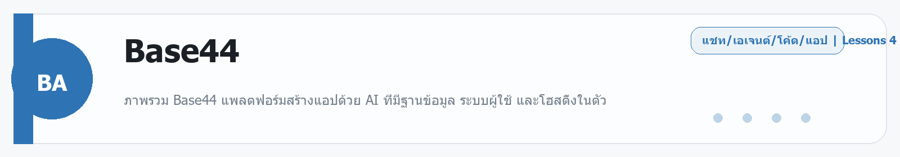

# Antigravity
Source: https://ailab.learnnakdev.online/docs/antigravity
Pages captured: 4

## Page 1 (หน้า 1 / 3)
```text
Antigravity
คู่มืออย่างเป็นทางการ
4 เอกสาร
ระดับกลาง
Google Antigravity คืออะไร — แพลตฟอร์มเขียนโค้ดยุคเอเจนต์

ภาพรวม Google Antigravity แพลตฟอร์มพัฒนาซอฟต์แวร์ที่มี AI เอเจนต์ทำงานให้ ·  6 นาที

หน้า 1 / 3
Google Antigravity — เขียนโค้ดร่วมกับ AI เอเจนต์ 🚀

เรียบเรียงเป็นภาษาไทยจากเอกสารทางการ antigravity.google

Google Antigravity คือแพลตฟอร์มพัฒนาซอฟต์แวร์รุ่นใหม่ของ Google ที่ออกแบบมาสำหรับ ยุคที่ AI เอเจนต์ทำงานเขียนโค้ดให้เรา — แทนที่จะพิมพ์โค้ดเองทุกบรรทัด คุณสั่งงานเป็นภารกิจ (task) แล้วเอเจนต์จะวางแผน เขียนโค้ด รันเทสต์ และเปิดเบราว์เซอร์ตรวจงานเองได้ ขับเคลื่อนด้วยโมเดล Gemini

📖 คำศัพท์ที่ควรรู้
คำศัพท์	ความหมายง่าย ๆ
Agent	ผู้ช่วย AI ที่ทำงานหลายขั้นตอนเองจนจบ ไม่ใช่แค่ตอบทีละข้อความ
Agent Manager	หน้าควบคุมที่สั่งงาน/ดูเอเจนต์หลายตัวทำงานพร้อมกัน
Editor	หน้าต่างแก้โค้ด (คล้าย VS Code) ที่มีเอเจนต์ในตัว
Artifacts	ผลงานที่เอเจนต์สร้าง เช่น แผนงาน สกรีนช็อต รายงาน
Browser	เบราว์เซอร์ในตัวที่เอเจนต์ใช้ทดสอบเว็บที่เขียน
⭐ จุดเด่น
ทำงานระดับเอเจนต์ — สั่งเป็นภารกิจ เอเจนต์จัดการเองหลายขั้นตอน
คุมหลายเอเจนต์พร้อมกัน ผ่าน Agent Manager
ตรวจงานได้จริง — เอเจนต์เปิดเบราว์เซอร์ทดสอบและแคปหน้าจอมาให้ดู
ใช้พลัง Gemini — โมเดลล่าสุดของ Google
คุ้นมือ — ตัว Editor พัฒนาต่อยอดจากแนว VS Code
🚀 เริ่มต้นใช้งาน
ดาวน์โหลด Antigravity จาก antigravity.google แล้วล็อกอินด้วยบัญชี Google
เปิดโฟลเดอร์โปรเจกต์ของคุณ
พิมพ์สั่งงานเป็นภารกิจ เช่น "เพิ่มหน้า login พร้อมตรวจสอบอีเมล"
ดูเอเจนต์วางแผน → เขียนโค้ด → ทดสอบ แล้วตรวจ Artifacts/สกรีนช็อตที่ได้
📚 สารบัญเอกสาร (ตาม official docs)
✅ ภาพรวม (หน้านี้)
⏳ Editor — เขียนโค้ดร่วมกับเอเจนต์
⏳ Agent Manager — สั่งและคุมหลายเอเจนต์
⏳ Browser & การทดสอบ
⏳ Artifacts — ผลงานและรายงานของเอเจนต์
🔗 อ้างอิง
เว็บทางการ: https://antigravity.google/
 ก่อนหน้า
ถัดไป
Antigravity: Editor — เขียนโค้ดร่วมกับเอเจนต์
```

## Page 2 (หน้า 2 / 3)
```text
Antigravity
คู่มืออย่างเป็นทางการ
4 เอกสาร
ระดับกลาง
Antigravity: Editor — เขียนโค้ดร่วมกับเอเจนต์

ทำความรู้จักหน้า Editor ของ Antigravity และการทำงานร่วมกับ AI เอเจนต์ ·  5 นาที

หน้า 2 / 3
Editor — พื้นที่เขียนโค้ดของ Antigravity ⌨️

เรียบเรียงเป็นภาษาไทยจากเอกสารทางการ antigravity.google

Editor คือหน้าต่างเขียนโค้ดของ Antigravity ที่หน้าตาคุ้นเคยแบบ VS Code แต่มี AI เอเจนต์ทำงานเคียงข้าง

🗂️ ส่วนสำคัญ
ส่วน	ทำอะไร
ตัวแก้โค้ด	เขียน/แก้ไฟล์ตามปกติ (มี syntax highlight, ส่วนขยาย)
แผงเอเจนต์	สั่งงาน AI เป็นภารกิจ แล้วดูมันลงมือทำ
Terminal	รันคำสั่ง (เอเจนต์ใช้รันเทสต์/ติดตั้งได้เอง)
Diff view	ดูสิ่งที่เอเจนต์แก้ ก่อนรับเข้า
🤝 ทำงานร่วมกับเอเจนต์
พิมพ์โค้ดเองได้ และให้เอเจนต์ช่วยเป็นช่วง ๆ
หรือมอบหมายงานทั้งก้อนให้เอเจนต์ แล้วคุณรีวิว
ทุกการแก้ไขดูเป็น diff ได้ — รับ/ปฏิเสธทีละจุด
▶️ เริ่มต้น
เปิดโฟลเดอร์โปรเจกต์
เขียนโค้ด หรือเปิดแผงเอเจนต์เพื่อสั่งงาน
ตรวจ diff ที่เอเจนต์เสนอ แล้ว Accept
💡 เคล็ดลับ
ถ้ามาจาก VS Code จะปรับตัวได้เร็ว
งานเล็กพิมพ์เอง งานใหญ่ปล่อยเอเจนต์ แล้วโฟกัสที่รีวิว
🔗 อ้างอิง
เว็บทางการ: https://antigravity.google/
 ก่อนหน้า
Google Antigravity คืออะไร — แพลตฟอร์มเขียนโค้ดยุคเอเจนต์
ถัดไป
Antigravity: Agent Manager — สั่งและคุมหลายเอเจนต์
```

## Page 3 (หน้า 3 / 3)
```text
Antigravity
คู่มืออย่างเป็นทางการ
4 เอกสาร
ระดับกลาง
Antigravity: Agent Manager — สั่งและคุมหลายเอเจนต์

ใช้ Agent Manager มอบหมายงานและดูเอเจนต์หลายตัวทำงานพร้อมกัน ·  5 นาที

หน้า 3 / 3
Agent Manager — ศูนย์บัญชาการเอเจนต์ 🎛️

เรียบเรียงเป็นภาษาไทยจากเอกสารทางการ antigravity.google

Agent Manager คือมุมมองที่ให้คุณ มอบหมายงานและคุมเอเจนต์หลายตัวพร้อมกัน — เหมือนเป็นหัวหน้าทีมที่สั่งงานลูกทีม AI หลายคน

⭐ ทำอะไรได้
มอบหมายภารกิจ ให้เอเจนต์เป็นงาน ๆ
ดูหลายเอเจนต์ทำงานขนาน — แต่ละตัวทำคนละงาน
ติดตามความคืบหน้า ของแต่ละภารกิจ
รีวิวผลงาน (โค้ด/แผน/สกรีนช็อต) ก่อนรับเข้า
🔄 รูปแบบการทำงาน
เขียนภารกิจให้ชัด เช่น "เพิ่มระบบค้นหาในหน้า products"
เอเจนต์ วางแผน → ขออนุมัติ (ถ้าตั้งไว้)
เอเจนต์ ลงมือ เขียนโค้ด รันเทสต์ ทดสอบบนเบราว์เซอร์
ส่ง Artifacts (ผลงาน) มาให้รีวิว
💡 เคล็ดลับ
แตกงานใหญ่เป็นหลายภารกิจย่อย แล้วให้เอเจนต์หลายตัวช่วยกัน
เขียนเป้าหมาย + เกณฑ์ความสำเร็จให้ชัด เอเจนต์จะทำได้ตรงขึ้น
รีวิวงานเสมอก่อนรวมเข้าโปรเจกต์จริง
🔗 อ้างอิง
เว็บทางการ: https://antigravity.google/
 ก่อนหน้า
Antigravity: Editor — เขียนโค้ดร่วมกับเอเจนต์
ถัดไป
Antigravity: Browser & Artifacts — ทดสอบจริงและผลงานของเอเจนต์
```

## Page 4 (หน้า 1 / 1)
```text
Antigravity
คู่มืออย่างเป็นทางการ
4 เอกสาร
ขั้นโปร
Antigravity: Browser & Artifacts — ทดสอบจริงและผลงานของเอเจนต์

เอเจนต์ใช้เบราว์เซอร์ในตัวทดสอบงาน และส่ง Artifacts (แผน/สกรีนช็อต/รายงาน) มาให้รีวิว ·  4 นาที

หน้า 1 / 1
Browser & Artifacts — ตรวจงานได้ของจริง 🌐

เรียบเรียงเป็นภาษาไทยจากเอกสารทางการ antigravity.google

จุดเด่นของ Antigravity คือเอเจนต์ไม่ได้แค่เขียนโค้ด แต่ ทดสอบงานเองได้ ผ่านเบราว์เซอร์ในตัว แล้วส่งหลักฐานมาให้คุณดู

🌐 Browser (เบราว์เซอร์ในตัว)
เอเจนต์เปิดเว็บที่เพิ่งเขียนเพื่อ ทดสอบจริง
คลิก กรอกฟอร์ม ตรวจว่าทำงานถูกไหม
เจอปัญหา → กลับไปแก้โค้ดต่อเอง
📦 Artifacts (ผลงานที่เอเจนต์สร้าง)
Artifact	คืออะไร
แผนงาน (Plan)	ขั้นตอนที่เอเจนต์ตั้งใจทำ
สกรีนช็อต	ภาพหน้าจอตอนทดสอบ
รายงาน	สรุปสิ่งที่ทำและผลลัพธ์
บันทึกการทำงาน	ร่องรอยคำสั่ง/การแก้ไข

Artifacts ช่วยให้คุณ ตรวจสอบได้ว่าเอเจนต์ทำอะไรไปบ้าง แทนที่จะเชื่อแบบมืดบอด

▶️ การใช้ในงานจริง
มอบหมายภารกิจที่มีหน้าเว็บให้ทดสอบ
เอเจนต์เขียน + เปิด browser ทดสอบ + แคปหน้าจอ
ดู Artifacts (แผน/สกรีนช็อต/รายงาน) เพื่อยืนยันว่าถูกต้อง
รับงานเข้า หรือสั่งแก้เพิ่ม
🔗 อ้างอิง
เว็บทางการ: https://antigravity.google/
 ก่อนหน้า
Antigravity: Agent Manager — สั่งและคุมหลายเอเจนต์
ถัดไป
```


---

## Beginner Guide

### Antigravity

Source: daily-ai-lab-ai-tools-32page-beginner-guide.docx


**หมวด:** Chat / Agent / Coding / App
**บทเรียนใน /docs:** 4 หน้า

**ใช้ทำอะไร**
ภาพรวม Google Antigravity แพลตฟอร์มพัฒนาซอฟต์แวร์ที่มี AI เอเจนต์ทำงานให้

**พื้นฐานที่ควรรู้**
พื้นฐานที่ควรรู้คือ prompt, context, file, workspace, และการตรวจผลลัพธ์ก่อนนำไปใช้งานจริง. มือใหม่ควรเริ่มจากงานเล็กที่วัดผลได้ เช่น สรุปเอกสาร แก้โค้ดสั้น ๆ หรือทำต้นแบบหน้าเว็บหนึ่งหน้า

**เหมาะกับมือใหม่แบบไหน**
เครื่องมือนี้เหมาะกับผู้เริ่มต้นที่อยากฝึกงาน Chat / Agent / Coding / App แบบสั้นและดูผลลัพธ์ได้เร็ว

**วิธีเริ่มแบบสั้น**
1. เปิด workspace หรือแชท แล้วให้โจทย์เดียวที่ชัดเจนพร้อมบริบทที่จำเป็น
2. แนบไฟล์ ตัวอย่าง หรือเป้าหมายที่อยากได้ เพื่อให้โมเดลอ่านภาพรวมได้เร็ว
3. ตรวจผลลัพธ์รอบแรก แล้วให้แก้แบบเฉพาะจุด เช่น tone, logic, code style หรือ structure

**ราคา/Plan**
Free for individuals; larger usage is tied to Google AI Pro/Ultra or organization billing.

**สิ่งที่ควรจำ**
- จุดแข็ง: เครื่องมือนี้เหมาะกับผู้เริ่มต้นที่อยากฝึกงาน Chat / Agent / Coding / App แบบสั้นและดูผลลัพธ์ได้เร็ว
- ข้อควรระวัง: ระวัง prompt ที่กว้างเกินไปและตรวจโค้ดหรือเอกสารทุกครั้งก่อนนำไปใช้จริง.

**ตัวอย่างเริ่มต้น**
ตัวอย่างงานเริ่มต้น: ช่วยฉันทำงานนี้ให้จบในรอบแรก: งานเริ่มต้นของฉัน. นี่คือบริบทที่มีอยู่: ฉันมีเป้าหมายชัดและอยากได้ผลลัพธ์ที่ตรวจสอบได้. ขอผลลัพธ์เป็นขั้นตอนชัดเจนและตรวจสอบได้

---

---

<!-- merged-beginner-guide:Antigravity -->
## คู่มือพื้นฐานของ Antigravity

**หมวด:** Chat / Agent / Coding / App
**บทเรียนใน /docs:** 4 หน้า

**ใช้ทำอะไร**
ภาพรวม Google Antigravity แพลตฟอร์มพัฒนาซอฟต์แวร์ที่มี AI เอเจนต์ทำงานให้

**พื้นฐานที่ควรรู้**
พื้นฐานที่ควรรู้คือ prompt, context, file, workspace, และการตรวจผลลัพธ์ก่อนนำไปใช้งานจริง. มือใหม่ควรเริ่มจากงานเล็กที่วัดผลได้ เช่น สรุปเอกสาร แก้โค้ดสั้น ๆ หรือทำต้นแบบหน้าเว็บหนึ่งหน้า

**เหมาะกับมือใหม่แบบไหน**
เครื่องมือนี้เหมาะกับผู้เริ่มต้นที่อยากฝึกงาน Chat / Agent / Coding / App แบบสั้นและดูผลลัพธ์ได้เร็ว

**วิธีเริ่มแบบสั้น**
1. เปิด workspace หรือแชท แล้วให้โจทย์เดียวที่ชัดเจนพร้อมบริบทที่จำเป็น
2. แนบไฟล์ ตัวอย่าง หรือเป้าหมายที่อยากได้ เพื่อให้โมเดลอ่านภาพรวมได้เร็ว
3. ตรวจผลลัพธ์รอบแรก แล้วให้แก้แบบเฉพาะจุด เช่น tone, logic, code style หรือ structure

**ราคา/Plan**
Free for individuals; larger usage is tied to Google AI Pro/Ultra or organization billing.

**สิ่งที่ควรจำ**
- จุดแข็ง: เครื่องมือนี้เหมาะกับผู้เริ่มต้นที่อยากฝึกงาน Chat / Agent / Coding / App แบบสั้นและดูผลลัพธ์ได้เร็ว
- ข้อควรระวัง: ระวัง prompt ที่กว้างเกินไปและตรวจโค้ดหรือเอกสารทุกครั้งก่อนนำไปใช้จริง.

**ตัวอย่างเริ่มต้น**
ตัวอย่างงานเริ่มต้น: ช่วยฉันทำงานนี้ให้จบในรอบแรก: งานเริ่มต้นของฉัน. นี่คือบริบทที่มีอยู่: ฉันมีเป้าหมายชัดและอยากได้ผลลัพธ์ที่ตรวจสอบได้. ขอผลลัพธ์เป็นขั้นตอนชัดเจนและตรวจสอบได้

---


