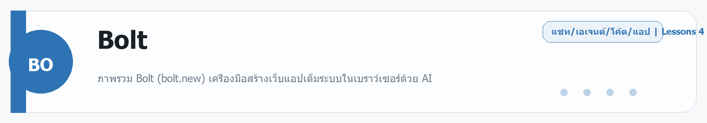

# Base44
Source: https://ailab.learnnakdev.online/docs/base44
Pages captured: 4

## Page 1 (หน้า 1 / 3)
```text
Base44
คู่มืออย่างเป็นทางการ
4 เอกสาร
เริ่มต้น
Base44 คืออะไร — สร้างแอปครบทั้งระบบในที่เดียว ไม่ต้องเขียนโค้ด

ภาพรวม Base44 แพลตฟอร์มสร้างแอปด้วย AI ที่มีฐานข้อมูล ระบบผู้ใช้ และโฮสติ้งในตัว ·  6 นาที

หน้า 1 / 3
Base44 — สร้างแอปครบจบในที่เดียว 🧱

เรียบเรียงเป็นภาษาไทยจากเอกสารทางการ docs.base44.com

Base44 คือแพลตฟอร์มสร้างแอปด้วย AI แบบ all-in-one — บอกเป็นข้อความว่าอยากได้แอปแบบไหน Base44 ก็สร้างให้ทั้งหน้าตา ฐานข้อมูล ระบบสมาชิก (ผู้ใช้/ล็อกอิน) และที่โฮสต์ มาพร้อมในตัวโดยไม่ต้องต่อบริการภายนอกหลายเจ้า เหมาะกับคนที่อยากได้แอปใช้งานจริงเร็ว ๆ โดยไม่ต้องเขียนโค้ด (ปัจจุบันเป็นบริษัทในเครือ Wix)

📖 คำศัพท์ที่ควรรู้
คำศัพท์	ความหมายง่าย ๆ
All-in-one	ครบทุกอย่างในที่เดียว ไม่ต้องต่อบริการนอกหลายตัว
Database	ที่เก็บข้อมูลของแอป (มีให้ในตัว)
Users / Auth	ระบบสมาชิกและล็อกอิน (มีให้ในตัว)
Entity	"ตาราง/ชนิดข้อมูล" ในฐานข้อมูล เช่น สินค้า ลูกค้า
Publish	เผยแพร่แอปขึ้นออนไลน์
⭐ จุดเด่น
ครบในตัว — ฐานข้อมูล + ระบบผู้ใช้ + โฮสติ้ง ไม่ต้องตั้งเอง
พิมพ์ภาษาคน ได้แอปจริง — ไม่ต้องเขียนโค้ด
มีระบบสมาชิกพร้อมใช้ — ทำแอปที่ผู้ใช้ล็อกอินได้ทันที
เผยแพร่ง่าย — กดเดียวขึ้นออนไลน์
ต่อยอดได้ — เชื่อมบริการ/อีเมล/การชำระเงินเพิ่ม
🚀 เริ่มต้นใช้งาน
เข้า base44.com แล้วสมัครบัญชี
พิมพ์บอกแอปที่อยากได้ เช่น "ระบบจองคิวร้านตัดผม มีหน้าสมาชิกและประวัติการจอง"
ดู Base44 สร้างแอปพร้อมฐานข้อมูลและระบบล็อกอินให้
ปรับแต่งเพิ่ม แล้วกด Publish เพื่อเผยแพร่
📚 สารบัญเอกสาร Base44 (ตาม official docs)
✅ ภาพรวม (หน้านี้)
⏳ สร้างแอปแรกของคุณ
⏳ Database & Entities — จัดการข้อมูล
⏳ Users & Auth — ระบบสมาชิก
⏳ Integrations & Publishing
🔗 อ้างอิง
เอกสารทางการ: https://docs.base44.com/
เว็บหลัก: https://base44.com/
 ก่อนหน้า
ถัดไป
Base44: สร้างแอปแรกของคุณ
```

## Page 2 (หน้า 2 / 3)
```text
Base44
คู่มืออย่างเป็นทางการ
4 เอกสาร
เริ่มต้น
Base44: สร้างแอปแรกของคุณ

ขั้นตอนสร้างแอปด้วย Base44 จากการบอกเป็นข้อความ และปรับแต่งต่อ ·  5 นาที

หน้า 2 / 3
สร้างแอปแรกด้วย Base44 🧱

เรียบเรียงเป็นภาษาไทยจากเอกสารทางการ docs.base44.com

Base44 สร้างแอปทั้งระบบจากการบอกเป็นภาษาคน — มาดูขั้นตอนกัน

▶️ ขั้นตอน
เข้า base44.com แล้วสร้างโปรเจกต์ใหม่
พิมพ์บอกแอปที่อยากได้ เช่น "ระบบจองคิวร้านตัดผม มีหน้าสมาชิกและประวัติการจอง"
Base44 สร้างแอปพร้อม ฐานข้อมูล + ระบบล็อกอิน ให้
ทดลองใช้ แล้วสั่งปรับแต่งต่อทีละอย่าง
✍️ สั่งงานให้ได้ผลดี
บอกภาพรวมก่อน แล้วเพิ่มฟีเจอร์ทีละอย่าง
ระบุข้อมูลที่ต้องเก็บ (เช่น ชื่อลูกค้า เวลา บริการ)
บอกว่าใครเห็นอะไรได้ (สิทธิ์ผู้ใช้)
แก้ทีละเรื่อง ตรวจว่าทำงานก่อนไปต่อ
🧩 จุดเด่นของ Base44

ต่างจากเครื่องมือที่สร้างแค่หน้าตา — Base44 ให้ทั้ง frontend + backend + ฐานข้อมูล + ระบบสมาชิก ในที่เดียว จึงได้แอปที่ใช้งานจริงได้เร็วโดยไม่ต้องต่อบริการนอกหลายเจ้า

📚 ถัดไป
Database & Auth — ข้อมูลและสมาชิก
เผยแพร่แอป
🔗 อ้างอิง
เอกสารทางการ: https://docs.base44.com/
 ก่อนหน้า
Base44 คืออะไร — สร้างแอปครบทั้งระบบในที่เดียว ไม่ต้องเขียนโค้ด
ถัดไป
Base44: Integrations & Publishing — ต่อบริการและเผยแพร่
```

## Page 3 (หน้า 3 / 3)
```text
Base44
คู่มืออย่างเป็นทางการ
4 เอกสาร
เริ่มต้น
Base44: Integrations & Publishing — ต่อบริการและเผยแพร่

เชื่อมบริการเสริม (อีเมล/ชำระเงิน) และเผยแพร่แอป Base44 ขึ้นออนไลน์ ·  4 นาที

หน้า 3 / 3
Integrations & Publishing 🚀

เรียบเรียงเป็นภาษาไทยจากเอกสารทางการ docs.base44.com

🔌 Integrations (บริการเสริม)

แม้ Base44 จะครบในตัว แต่ต่อบริการเพิ่มได้ เช่น:

อีเมล — ส่งอีเมลแจ้งเตือน/ยืนยัน
การชำระเงิน — รับเงินในแอป
บริการภายนอกอื่น ๆ ผ่านการเชื่อมต่อ/เรียก API

สั่งเป็นข้อความได้ เช่น "ส่งอีเมลยืนยันเมื่อมีการจองใหม่"

🌐 Publishing (เผยแพร่)
ตรวจแอปและสิทธิ์การเข้าถึงข้อมูลให้เรียบร้อย
กด Publish
ได้ลิงก์ให้คนอื่นเข้าใช้งานได้ทันที
แก้แล้วอยากอัปเดต ก็ Publish ใหม่
✅ เช็กลิสต์ก่อนเปิดสาธารณะ
ระบบล็อกอินทำงานถูกต้อง
สิทธิ์ข้อมูลรัดกุม (ผู้ใช้เห็นเฉพาะของตัวเอง)
ฟีเจอร์หลักทดสอบแล้วใช้ได้
หน้าตาแสดงผลดีทั้งมือถือและคอม
🔗 อ้างอิง
เอกสารทางการ: https://docs.base44.com/
 ก่อนหน้า
Base44: สร้างแอปแรกของคุณ
ถัดไป
Base44: Database & Auth — ข้อมูลและระบบสมาชิก
```

## Page 4 (หน้า 1 / 1)
```text
Base44
คู่มืออย่างเป็นทางการ
4 เอกสาร
ระดับกลาง
Base44: Database & Auth — ข้อมูลและระบบสมาชิก

จัดการข้อมูล (Entities) และระบบผู้ใช้/ล็อกอินที่มากับ Base44 ในตัว ·  5 นาที

หน้า 1 / 1
Database & Auth — หัวใจของแอปจริง 🗄️

เรียบเรียงเป็นภาษาไทยจากเอกสารทางการ docs.base44.com

จุดแข็งของ Base44 คือมีฐานข้อมูลและระบบสมาชิก มาในตัว ไม่ต้องตั้งเอง

🧱 Database & Entities

Entity คือ "ชนิดข้อมูล/ตาราง" ในแอป เช่น สินค้า ลูกค้า การจอง

Base44 สร้าง Entity ให้อัตโนมัติตามที่คุณอธิบายแอป
แต่ละ Entity มี field (เช่น ชื่อ ราคา วันที่)
เพิ่ม/แก้ field ได้ด้วยการบอกเป็นข้อความ
👤 Users & Auth (ระบบสมาชิก)
ระบบ สมัคร/ล็อกอิน พร้อมใช้ทันที
กำหนด สิทธิ์ ได้ว่าใครเห็น/แก้ข้อมูลอะไร
ทำแอปที่ "ผู้ใช้แต่ละคนเห็นเฉพาะข้อมูลของตัวเอง" ได้ง่าย
🔒 สิทธิ์การเข้าถึง (สำคัญ)

ตั้งให้รัดกุมว่า:

ใครอ่าน/เขียนข้อมูลแต่ละชนิดได้
ข้อมูลส่วนตัวต้องไม่หลุดให้คนอื่นเห็น

💡 ตรวจสิทธิ์ให้ดีก่อนเปิดแอปสาธารณะ — เป็นจุดพลาดที่พบบ่อย

▶️ ตัวอย่างสั่งงาน

"เพิ่ม Entity 'การจอง' มี field ลูกค้า บริการ วันเวลา และให้ลูกค้าเห็นเฉพาะการจองของตัวเอง"

🔗 อ้างอิง
เอกสารทางการ: https://docs.base44.com/
 ก่อนหน้า
Base44: Integrations & Publishing — ต่อบริการและเผยแพร่
ถัดไป
```


---

## Beginner Guide

### Base44

Source: daily-ai-lab-ai-tools-32page-beginner-guide.docx


**หมวด:** Chat / Agent / Coding / App
**บทเรียนใน /docs:** 4 หน้า

**ใช้ทำอะไร**
ภาพรวม Base44 แพลตฟอร์มสร้างแอปด้วย AI ที่มีฐานข้อมูล ระบบผู้ใช้ และโฮสติ้งในตัว

**พื้นฐานที่ควรรู้**
พื้นฐานที่ควรรู้คือ prompt, context, file, workspace, และการตรวจผลลัพธ์ก่อนนำไปใช้งานจริง. มือใหม่ควรเริ่มจากงานเล็กที่วัดผลได้ เช่น สรุปเอกสาร แก้โค้ดสั้น ๆ หรือทำต้นแบบหน้าเว็บหนึ่งหน้า

**เหมาะกับมือใหม่แบบไหน**
เครื่องมือนี้เหมาะกับผู้เริ่มต้นที่อยากฝึกงาน Chat / Agent / Coding / App แบบสั้นและดูผลลัพธ์ได้เร็ว

**วิธีเริ่มแบบสั้น**
1. เปิด workspace หรือแชท แล้วให้โจทย์เดียวที่ชัดเจนพร้อมบริบทที่จำเป็น
2. แนบไฟล์ ตัวอย่าง หรือเป้าหมายที่อยากได้ เพื่อให้โมเดลอ่านภาพรวมได้เร็ว
3. ตรวจผลลัพธ์รอบแรก แล้วให้แก้แบบเฉพาะจุด เช่น tone, logic, code style หรือ structure

**ราคา/Plan**
Free tier; paid plans start around $16/month.

**สิ่งที่ควรจำ**
- จุดแข็ง: เครื่องมือนี้เหมาะกับผู้เริ่มต้นที่อยากฝึกงาน Chat / Agent / Coding / App แบบสั้นและดูผลลัพธ์ได้เร็ว
- ข้อควรระวัง: ระวัง prompt ที่กว้างเกินไปและตรวจโค้ดหรือเอกสารทุกครั้งก่อนนำไปใช้จริง.

**ตัวอย่างเริ่มต้น**
ตัวอย่างงานเริ่มต้น: ช่วยฉันทำงานนี้ให้จบในรอบแรก: งานเริ่มต้นของฉัน. นี่คือบริบทที่มีอยู่: ฉันมีเป้าหมายชัดและอยากได้ผลลัพธ์ที่ตรวจสอบได้. ขอผลลัพธ์เป็นขั้นตอนชัดเจนและตรวจสอบได้

---

---

<!-- merged-beginner-guide:Base44 -->
## คู่มือพื้นฐานของ Base44

**หมวด:** Chat / Agent / Coding / App
**บทเรียนใน /docs:** 4 หน้า

**ใช้ทำอะไร**
ภาพรวม Base44 แพลตฟอร์มสร้างแอปด้วย AI ที่มีฐานข้อมูล ระบบผู้ใช้ และโฮสติ้งในตัว

**พื้นฐานที่ควรรู้**
พื้นฐานที่ควรรู้คือ prompt, context, file, workspace, และการตรวจผลลัพธ์ก่อนนำไปใช้งานจริง. มือใหม่ควรเริ่มจากงานเล็กที่วัดผลได้ เช่น สรุปเอกสาร แก้โค้ดสั้น ๆ หรือทำต้นแบบหน้าเว็บหนึ่งหน้า

**เหมาะกับมือใหม่แบบไหน**
เครื่องมือนี้เหมาะกับผู้เริ่มต้นที่อยากฝึกงาน Chat / Agent / Coding / App แบบสั้นและดูผลลัพธ์ได้เร็ว

**วิธีเริ่มแบบสั้น**
1. เปิด workspace หรือแชท แล้วให้โจทย์เดียวที่ชัดเจนพร้อมบริบทที่จำเป็น
2. แนบไฟล์ ตัวอย่าง หรือเป้าหมายที่อยากได้ เพื่อให้โมเดลอ่านภาพรวมได้เร็ว
3. ตรวจผลลัพธ์รอบแรก แล้วให้แก้แบบเฉพาะจุด เช่น tone, logic, code style หรือ structure

**ราคา/Plan**
Free tier; paid plans start around $16/month.

**สิ่งที่ควรจำ**
- จุดแข็ง: เครื่องมือนี้เหมาะกับผู้เริ่มต้นที่อยากฝึกงาน Chat / Agent / Coding / App แบบสั้นและดูผลลัพธ์ได้เร็ว
- ข้อควรระวัง: ระวัง prompt ที่กว้างเกินไปและตรวจโค้ดหรือเอกสารทุกครั้งก่อนนำไปใช้จริง.

**ตัวอย่างเริ่มต้น**
ตัวอย่างงานเริ่มต้น: ช่วยฉันทำงานนี้ให้จบในรอบแรก: งานเริ่มต้นของฉัน. นี่คือบริบทที่มีอยู่: ฉันมีเป้าหมายชัดและอยากได้ผลลัพธ์ที่ตรวจสอบได้. ขอผลลัพธ์เป็นขั้นตอนชัดเจนและตรวจสอบได้

---


