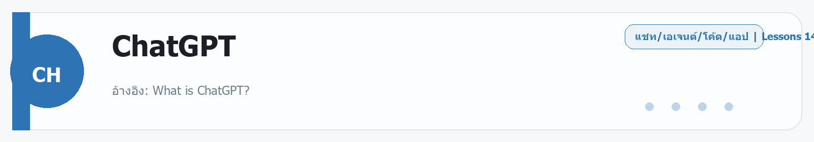

# ChatGPT
Source: https://ailab.learnnakdev.online/docs/chatgpt
Pages captured: 14

## Page 1 (หน้า 1 / 3)
```text
ChatGPT
คู่มืออย่างเป็นทางการ
14 เอกสาร
เริ่มต้น
เริ่มต้นใช้งาน & แผนการสมัคร

อ้างอิง: What is ChatGPT? ·  5 นาที

หน้า 1 / 3
ChatGPT คู่มือภาษาไทย — ตอนที่ 1: เริ่มต้นใช้งาน & แผนการสมัคร

อ้างอิงหลัก: OpenAI Help Center — ChatGPT

ChatGPT คืออะไร

อ้างอิง: What is ChatGPT?

หัวข้อนี้คืออะไร

ChatGPT คือผู้ช่วย AI (ปัญญาประดิษฐ์ — คอมพิวเตอร์ที่เรียนรู้และตอบโต้ได้เหมือนมนุษย์) ที่พัฒนาโดย OpenAI ใช้โมเดลภาษาขนาดใหญ่ หรือ Large Language Model (โปรแกรม AI ที่ฝึกมาจากข้อความจำนวนมหาศาล เพื่อให้เข้าใจและสร้างภาษาได้อย่างเป็นธรรมชาติ) ที่ผ่านการฝึกให้โต้ตอบกับมนุษย์ได้อย่างเป็นธรรมชาติ

ใช้ทำอะไร

ChatGPT ช่วยได้หลากหลายงาน เช่น ตอบคำถาม เขียนบทความ สรุปเอกสาร เขียนโค้ด (ชุดคำสั่งโปรแกรม) แปลภาษา วิเคราะห์ข้อมูล และสนทนาได้เหมือนคุยกับผู้เชี่ยวชาญ

รายละเอียดสำคัญ

ChatGPT เข้าใจภาษาธรรมชาติและสามารถปฏิบัติตามคำสั่งที่ซับซ้อนได้ จำบริบท (ความเชื่อมโยงของการสนทนา — เช่น จำว่าคุณถามอะไรไปก่อนหน้านี้) ภายในการสนทนาเดียวกัน และปรับการตอบสนองตามสถานการณ์ได้

ความสามารถหลัก:

ตอบคำถาม และอธิบายแนวคิดในหลากหลายสาขา
เขียนและแก้ไขเนื้อหา เช่น อีเมล บทความ รายงาน
ให้ข้อเสนอแนะเชิงสร้างสรรค์ เช่น เขียนเรื่องสั้น หรือระดมไอเดีย
แก้ปัญหาด้วยเหตุผล หรือ Logical Reasoning (การคิดเป็นขั้นตอนอย่างมีเหตุผล)
แปลภาษา ได้หลายภาษาทั่วโลก รวมถึงภาษาไทย
ข้อควรระวัง

ChatGPT อาจให้ข้อมูลที่ไม่ถูกต้องบางครั้ง ควรตรวจสอบข้อเท็จจริงจากแหล่งอื่นด้วย โดยเฉพาะข้อมูลที่ต้องการความแม่นยำสูง เช่น ข้อมูลทางการแพทย์หรือกฎหมาย

สรุป

ChatGPT คือ AI แชตบอต (โปรแกรมสนทนาอัจฉริยะ — ตอบโต้ผ่านการพิมพ์หรือพูดได้) ที่ช่วยได้ทุกเรื่อง เหมาะกับทั้งผู้เริ่มต้นและมืออาชีพ

ความสามารถภาพรวมของ ChatGPT

อ้างอิง: ChatGPT Capabilities Overview

หัวข้อนี้คืออะไร

หน้านี้อธิบายฟีเจอร์ (ความสามารถหรือคุณสมบัติของโปรแกรม) ทั้งหมดที่ ChatGPT มีให้ใช้ แบ่งตามประเภทการทำงาน

ความสามารถหลัก (Core Capabilities)

ChatGPT มีความสามารถพื้นฐานดังนี้:

ตอบคำถามและอธิบายเรื่องต่างๆ ไม่ว่าจะเป็นเรื่องวิทยาศาสตร์ ประวัติศาสตร์ คณิตศาสตร์ หรือเรื่องในชีวิตประจำวัน
เขียน แก้ไข หรือสรุปเนื้อหา ได้หลายรูปแบบ
ให้คำแนะนำเชิงสร้างสรรค์ เช่น เขียนนิยาย หรือช่วยคิดไอเดีย
แก้ปัญหาผ่านการใช้เหตุผล
แปลภาษา ระหว่างภาษาต่างๆ ได้

ผู้ใช้แผนเสียเงินสามารถเลือกใช้โมเดล (Model — รุ่นของ AI ที่มีความสามารถแตกต่างกัน เหมือนรุ่นของโทรศัพท์มือถือ) ต่างๆ ได้ตามความต้องการ

เครื่องมือและโหมดพิเศษ (Tools and Special Modes)

ขึ้นอยู่กับแผนที่สมัครและการตั้งค่า ChatGPT มีเครื่องมือเสริมดังนี้:

เครื่องมือ	คำอธิบาย
Search (ค้นหาเว็บ)	ดึงข้อมูลจากอินเทอร์เน็ตแบบ Real-time (ข้อมูลปัจจุบัน ณ ขณะนั้น — ไม่ใช่ข้อมูลเก่าที่ฝึกไว้)
Deep Research	วิจัยเชิงลึกจากหลายแหล่ง พร้อมอ้างอิง
Image Input & Generation	วิเคราะห์และสร้างรูปภาพ
File Uploads (อัปโหลดไฟล์ — ส่งไฟล์ขึ้นไปให้ AI อ่าน)	อัปโหลดและวิเคราะห์เอกสาร PDF, Word, Presentation
Data Analysis (วิเคราะห์ข้อมูล)	วิเคราะห์ข้อมูลจาก CSV/Excel รันโค้ดได้
Voice Mode (โหมดเสียง — สนทนาด้วยการพูดแทนการพิมพ์)	สนทนาด้วยเสียง
Canvas (พื้นที่ทำงาน — เหมือนกระดานขนาดใหญ่ที่ทำงานร่วมกับ AI ได้)	พื้นที่ทำงานร่วมกันสำหรับเขียนและเขียนโค้ด
Memory (หน่วยความจำ — ทำให้ AI จำข้อมูลของคุณข้ามการสนทนา)	จดจำข้อมูลของคุณข้ามการสนทนา
Projects (โปรเจกต์ — กลุ่มงานที่จัดระเบียบแชตและไฟล์ไว้ด้วยกัน)	จัดระเบียบแชต ไฟล์ และบริบทตามโปรเจกต์
Scheduled Tasks (งานตั้งเวลา — สั่งให้ AI ทำงานล่วงหน้าตามเวลาที่กำหนด)	ตั้งเวลาให้ ChatGPT ทำงานล่วงหน้าได้
Custom GPTs (GPT ปรับแต่ง — สร้าง AI ส่วนตัวในแบบของตัวเอง)	สร้าง AI ส่วนตัวที่ปรับแต่งได้ตามต้องการ
วิธีเข้าถึง ChatGPT
ทางเว็บไซต์

เข้าใช้งานได้ที่ chatgpt.com หรือ chat.openai.com

ใช้ได้ฟรีโดยสมัครบัญชี OpenAI
รองรับทุก Browser (โปรแกรมท่องเว็บ — เช่น Chrome, Safari, Firefox) ที่อัปเดตเป็นเวอร์ชันล่าสุด
แอปมือถือ
iOS: ดาวน์โหลดจาก App Store (ชื่อแอปคือ "ChatGPT")
Android: ดาวน์โหลดจาก Google Play Store
แอปเดสก์ท็อป
macOS: ต้องใช้ macOS 14 ขึ้นไป และ Apple Silicon (ชิปประมวลผลที่ Apple ออกแบบเอง — รุ่น M1 หรือดีกว่า) ดาวน์โหลดได้ที่ openai.com/chatgpt/desktop กด ⌥ (Option) + Space เพื่อเปิดแชตได้ทุกเมื่อ
Windows: มีแอปสำหรับ Windows ด้วย
ประเทศที่รองรับ

อ้างอิง: ChatGPT Supported Countries

ChatGPT ให้บริการในประเทศและดินแดนส่วนใหญ่ทั่วโลก รวมถึง ประเทศไทย ตรวจสอบรายการทั้งหมดได้ที่ลิงก์อ้างอิง

แผนการสมัครใช้งาน (Plans & Pricing)
ChatGPT Free (ฟรี)

อ้างอิง: Using ChatGPT's Free Tier - FAQ

หัวข้อนี้คืออะไร

แผนฟรีช่วยให้ผู้เริ่มต้นได้ทดลองใช้ ChatGPT โดยไม่ต้องเสียค่าใช้จ่าย

รายละเอียด
เข้าถึงโมเดล GPT-4o mini เป็นหลัก (รุ่นเบาของ GPT-4o — ตอบเร็วกว่าแต่ความสามารถน้อยกว่า)
ใช้ GPT-4o ได้แต่มีขีดจำกัดการใช้งาน
รองรับ Voice Mode (โหมดเสียง) แบบจำกัดสูงสุด 2 ชั่วโมงต่อวัน
อัปโหลดไฟล์ได้จำกัด (สูงสุด 3 ไฟล์ต่อวัน)
ใช้ GPTs ได้บางส่วน
ไม่รองรับ Memory (หน่วยความจำข้ามการสนทนา), Deep Research, Canvas บางฟีเจอร์
ข้อควรรู้

แผนฟรีเหมาะสำหรับผู้ที่ต้องการทดลองใช้งานทั่วไป แต่ถ้าต้องการฟีเจอร์เต็มรูปแบบควรอัปเกรด (เพิ่มระดับแผน) เป็น Plus หรือ Pro

ChatGPT Plus

อ้างอิง: What is ChatGPT Plus?

หัวข้อนี้คืออะไร

ChatGPT Plus คือแผนสมัครสมาชิกรายเดือน ราคา $20/เดือน สำหรับผู้ใช้ทั่วไปที่ต้องการฟีเจอร์เพิ่มเติม

สิ่งที่ได้รับ
เข้าถึง GPT-4o ได้อย่างเต็มที่ (มีขีดจำกัดที่สูงกว่าแผนฟรีมาก)
เข้าถึง o1, o3, o4-mini (โมเดลที่ออกแบบมาให้ "คิด" ก่อนตอบ — เหมาะกับงานซับซ้อน)
ใช้ Memory (ความจำ — ChatGPT จำข้อมูลของคุณข้ามการสนทนา ไม่ต้องบอกซ้ำทุกครั้ง)
ใช้ Voice Mode แบบ GPT-4o เกือบไม่จำกัด
อัปโหลดไฟล์ได้ถึง 20 ไฟล์ต่อ Project
ใช้ DALL·E (ดาลี — โมเดล AI สำหรับสร้างรูปภาพจากคำอธิบาย) สร้างรูปภาพ
ใช้ Canvas เต็มรูปแบบ
ใช้ Deep Research ได้จำนวนจำกัดต่อเดือน
ใช้ Custom GPTs (GPT ปรับแต่งพิเศษ)
เข้าถึง GPT Store (ร้านค้า GPT — คลังรวบรวม GPT จากนักพัฒนาทั่วโลก)
วิธีสมัคร
ไปที่ chatgpt.com
คลิกโปรไฟล์ → Upgrade to Plus
ชำระเงินผ่านบัตรเครดิต/บัตรเดบิต
ยกเลิก

ยกเลิกได้ตลอดเวลาใน Settings → Manage Subscription สำหรับผู้ที่สมัครผ่าน iOS App ต้องยกเลิกผ่าน App Store ของ Apple แทน

ChatGPT Pro

อ้างอิง: What is ChatGPT Pro?

หัวข้อนี้คืออะไร

ChatGPT Pro เป็นแผนระดับสูงสุดสำหรับผู้ใช้งานหนัก ราคา $200/เดือน

สิ่งที่ได้รับ
ทุกอย่างใน Plus บวกกับ:
ใช้ o1 Pro Mode ซึ่งคิดได้ลึกและแม่นยำกว่า o1 ปกติ (โหมดพิเศษที่ใช้เวลาคิดนานขึ้น เพื่อผลลัพธ์ที่แม่นยำกว่า)
Voice Mode แบบ GPT-4o ไม่จำกัด (ไม่มี Fallback — การสลับไปโมเดลรองเมื่อหมด quota — ไป mini)
Deep Research ใช้ได้มากกว่า Plus
ขีดจำกัดสูงสุดสำหรับทุกโมเดลและฟีเจอร์
เหมาะสำหรับนักวิจัย นักพัฒนา หรือผู้ที่ใช้งาน AI อย่างเข้มข้น
ข้อควรรู้

แผน Pro เหมาะกับคนที่ใช้ ChatGPT เป็นเครื่องมือหลักในการทำงานทุกวัน และต้องการประสิทธิภาพสูงสุด

ChatGPT Team

อ้างอิง: ChatGPT Team Plan FAQ

หัวข้อนี้คืออะไร

ChatGPT Team เป็นแผนสำหรับทีมงานหรือองค์กรขนาดเล็ก ราคา $25-30/คน/เดือน (ขึ้นอยู่กับจำนวนสมาชิก)

สิ่งที่ได้รับ
ทุกอย่างใน Plus
Workspace (พื้นที่ทำงานร่วมกัน — เหมือนออฟฟิศออนไลน์ที่แชร์กันได้ในทีม) ที่แชร์กันได้ในทีม
ข้อมูลในทีม ไม่ถูกนำไปฝึกโมเดล (ป้องกันข้อมูลบริษัท)
จัดการสมาชิกและสิทธิ์ใช้งาน (Permission — สิทธิ์ที่กำหนดว่าใครทำอะไรได้บ้าง) ได้
ขีดจำกัดที่สูงกว่า Plus
Admin Console (แผงควบคุมสำหรับผู้ดูแลระบบ — จัดการสมาชิกและการตั้งค่าต่างๆ) สำหรับผู้ดูแลระบบ
เหมาะกับใคร

ทีมขนาด 2+ คน ที่ต้องการทำงานร่วมกันและต้องการความเป็นส่วนตัวของข้อมูล

ChatGPT Enterprise

อ้างอิง: What is ChatGPT Enterprise?

หัวข้อนี้คืออะไร

ChatGPT Enterprise คือแผนสำหรับองค์กรขนาดใหญ่ที่ต้องการความปลอดภัยและการปรับแต่งสูงสุด (ราคาสอบถามจาก OpenAI โดยตรง)

สิ่งที่ได้รับ
ทุกอย่างใน Team บวกกับ:
Security (ความปลอดภัย) และ Privacy (ความเป็นส่วนตัวของข้อมูล) ระดับองค์กร ได้รับการรับรองมาตรฐาน SOC 2 Type 2 (มาตรฐานความปลอดภัยด้านข้อมูลระดับสากลสำหรับองค์กร)
ข้อมูลไม่ถูกนำไปฝึกโมเดลเด็ดขาด
Context Window (หน้าต่างบริบท — จำนวนข้อความสูงสุดที่ AI สามารถ "จำ" ในการสนทนาหนึ่งครั้ง) ขนาดใหญ่ขึ้น รองรับงานที่ซับซ้อนมาก
Admin Dashboard (แดชบอร์ดสำหรับผู้ดูแล — หน้าจอแสดงภาพรวมและควบคุมระบบ) ขั้นสูง
SSO หรือ Single Sign-On (ระบบเข้าสู่ระบบครั้งเดียวใช้ได้หลายบริการ — สะดวกสำหรับองค์กรที่มีหลายระบบ) รองรับ
API (Application Programming Interface — ช่องทางให้โปรแกรมอื่นเชื่อมต่อและใช้งาน ChatGPT ได้) ที่ปรับแต่งได้
Visual Retrieval (การดึงข้อมูลจากรูปภาพ — อ่านข้อมูลจากกราฟหรือรูปที่อยู่ใน PDF ได้) สำหรับ PDF
รองรับ Flexible Pricing Plan (แผนราคาแบบยืดหยุ่น — จ่ายตามการใช้งานจริง)
ChatGPT Edu

อ้างอิง: What is ChatGPT Edu?

หัวข้อนี้คืออะไร

ChatGPT Edu คือแผนพิเศษสำหรับมหาวิทยาลัยและสถาบันการศึกษา ออกแบบมาเพื่อนักศึกษาและอาจารย์

สิ่งที่ได้รับ
คุณสมบัติคล้าย Enterprise
ราคาพิเศษสำหรับสถาบันการศึกษา
ข้อมูลนักศึกษาและอาจารย์ไม่ถูกนำไปฝึกโมเดล
Admin Control (การควบคุมระดับผู้ดูแล — สำหรับมหาวิทยาลัยจัดการการใช้งานของนักศึกษาได้) สำหรับมหาวิทยาลัย
สรุปตารางเปรียบเทียบแผน
ฟีเจอร์	Free	Plus	Pro	Team	Enterprise
GPT-4o	จำกัด	✅	✅	✅	✅
o1 / o3	❌	✅	✅	✅	✅
Memory (ความจำข้ามการสนทนา)	❌	✅	✅	✅	✅
Voice Mode (โหมดเสียง)	จำกัด (mini)	เกือบไม่จำกัด	ไม่จำกัด	✅	✅
Canvas (พื้นที่ทำงานร่วมกัน)	❌	✅	✅	✅	✅
DALL·E (สร้างรูปภาพ)	❌	✅	✅	✅	✅
Deep Research (วิจัยเชิงลึก)	❌	จำกัด	เพิ่มขึ้น	✅	✅
File Upload (อัปโหลดไฟล์)	3 ไฟล์/วัน	20 ไฟล์/Project	สูงกว่า	40 ไฟล์/Project	สูงสุด
ข้อมูลไม่ฝึกโมเดล	❌ (ปิดเองได้)	❌ (ปิดเองได้)	❌ (ปิดเองได้)	✅	✅
ราคา/เดือน	ฟรี	$20	$200	$25-30/คน	ติดต่อ OpenAI
วิธีล็อกอิน / ปัญหาการเข้าสู่ระบบ

อ้างอิง: Why can't I log in to ChatGPT?

วิธีล็อกอิน

ChatGPT รองรับการเข้าสู่ระบบผ่าน:

อีเมลและรหัสผ่าน (OpenAI Account)
Google Account
Microsoft Account
Apple ID (บน iOS)
ปัญหาที่พบบ่อยและวิธีแก้

1. ล็อกอินไม่ได้เลย

ตรวจสอบ Email และรหัสผ่านให้ถูกต้อง
ลอง Reset Password (รีเซตรหัสผ่าน — ขอสร้างรหัสผ่านใหม่ผ่าน Email)
ตรวจดูว่า VPN (โปรแกรมเปลี่ยนตำแหน่งเครือข่าย — ทำให้ดูเหมือนใช้อินเทอร์เน็ตจากประเทศอื่น) หรือ Proxy (ตัวกลางรับ-ส่งข้อมูลอินเทอร์เน็ต) ปิดกันการเชื่อมต่อหรือเปล่า

2. มีข้อความ "We detect suspicious activity"

OpenAI ตรวจพบพฤติกรรมผิดปกติจาก IP (หมายเลขที่อยู่ของอุปกรณ์ในเครือข่าย — เหมือนบ้านเลขที่บนอินเทอร์เน็ต) ของคุณ
ลองใช้เครือข่าย Wi-Fi อื่น หรือปิด VPN
ถ้าไม่ดีขึ้น ติดต่อ help.openai.com

3. CAPTCHA (แบบทดสอบยืนยันความเป็นมนุษย์ — เช่น การเลือกรูปหรือพิมพ์ตัวอักษรบิดเบี้ยว) ขึ้นบ่อย

ChatGPT ใช้ CAPTCHA เพื่อป้องกัน Bot (โปรแกรมอัตโนมัติที่ไม่ใช่มนุษย์)
ทำ CAPTCHA ให้ผ่านตามปกติ หากพบบ่อยมากอาจเกิดจาก Browser Extension (ส่วนเสริมของโปรแกรมท่องเว็บ) ที่รบกวน ให้ลอง Disable (ปิดการใช้งาน) Extension แล้วลองใหม่

4. บัญชีถูกล็อกหรือผิดปกติ
อ้างอิง: I'm seeing unrecognized activity

หากพบกิจกรรมที่ไม่รู้จักในบัญชี ให้เปลี่ยนรหัสผ่านทันที
ออกจากระบบจากทุกอุปกรณ์
ติดต่อ OpenAI Support
ข้อควรรู้

ประเทศไทยได้รับการรองรับอย่างเป็นทางการ แต่บางพื้นที่หรือ ISP (ผู้ให้บริการอินเทอร์เน็ต) บางรายอาจมีปัญหาการเชื่อมต่อ ลอง VPN ถ้าจำเป็น (แต่ VPN อาจทำให้ถูกตรวจจับเป็นกิจกรรมน่าสงสัยได้เช่นกัน)

Release Notes (อัปเดตล่าสุด)

อ้างอิง: ChatGPT Release Notes

OpenAI อัปเดต ChatGPT อย่างต่อเนื่อง สามารถติดตาม Changelog (บันทึกการเปลี่ยนแปลง — รายการฟีเจอร์ใหม่และการแก้ไขในแต่ละเวอร์ชัน) ได้ที่ลิงก์ข้างต้น ฟีเจอร์ใหม่มักถูก Roll Out (ทยอยเปิดให้ใช้งาน — เปิดให้ผู้ใช้ทีละกลุ่มก่อนเปิดให้ทุกคน) ให้ผู้ใช้ทีละกลุ่มก่อนเปิดให้ทุกคนใช้

 ก่อนหน้า
ถัดไป
โมเดล, หน่วยความจำ, ไฟล์ & คำสั่งส่วนตัว
```

## Page 2 (หน้า 2 / 3)
```text
ChatGPT
คู่มืออย่างเป็นทางการ
14 เอกสาร
เริ่มต้น
โมเดล, หน่วยความจำ, ไฟล์ & คำสั่งส่วนตัว

อ้างอิง: What is the ChatGPT Model Selector? ·  5 นาที

หน้า 2 / 3
ChatGPT คู่มือภาษาไทย — ตอนที่ 2: โมเดล, หน่วยความจำ, ไฟล์ & คำสั่งส่วนตัว

อ้างอิงหลัก: OpenAI Help Center — ChatGPT

Model Selector — เลือกโมเดลที่ใช้

อ้างอิง: What is the ChatGPT Model Selector?

หัวข้อนี้คืออะไร

Model Selector (ตัวเลือกโมเดล — เมนูสำหรับเลือกว่าจะใช้ AI รุ่นไหนในการสนทนา) คือเมนูที่ให้คุณเลือกว่าจะใช้ AI โมเดลรุ่นไหน แต่ละโมเดลมีความสามารถและขีดจำกัดที่แตกต่างกัน

วิธีใช้งาน
บน Web: คลิกชื่อโมเดลที่แสดงอยู่บนหัวหน้าต่างแชต
บน Mobile: แตะเมนูตัวเลือกที่ด้านบนของหน้าจอ
โมเดลที่มีให้เลือก
โมเดล	คำอธิบาย	เหมาะกับ
GPT-4o	โมเดลหลักที่ฉลาดและเร็วที่สุดสำหรับผู้ใช้ทั่วไป	งานทั่วไป, เขียน, วิเคราะห์, ตอบคำถาม
GPT-4o mini	เวอร์ชันเบา ตอบเร็วกว่า ใช้ Token น้อยกว่า (Token คือหน่วยย่อยของข้อความที่ AI ใช้ประมวลผล — เหมือนแบ่งคำออกเป็นชิ้นเล็กๆ เช่น "สวัสดี" อาจแบ่งเป็น 2-3 ชิ้น)	งานง่ายๆ, ตอบสั้น, ประหยัด quota
o1	โมเดลคิดลึก ใช้เวลานาน แต่แม่นยำกว่า	คณิตศาสตร์, โปรแกรมมิ่งซับซ้อน, การวิจัย
o3	รุ่นที่พัฒนาต่อจาก o1 ฉลาดขึ้น	งานเชิงวิเคราะห์ขั้นสูง
o4-mini	o4 เวอร์ชันเบา เร็วกว่าและใช้ quota (โควต้า — จำนวนการใช้งานที่กำหนดไว้ในแต่ละช่วงเวลา) น้อยกว่า	งานที่ต้องการ reasoning (การคิดวิเคราะห์เชิงตรรกะ) แต่ไม่ซับซ้อนมาก
o1 Pro Mode	o1 รุ่นพิเศษสำหรับแผน Pro เท่านั้น คิดลึกที่สุด	วิจัยระดับสูง, โจทย์ยากมาก
ข้อควรรู้
แผน Free: ใช้ได้ส่วนใหญ่เป็น GPT-4o mini
แผน Plus: ใช้ GPT-4o ได้ บวก o1/o3/o4-mini
แผน Pro: ใช้ได้ทุกโมเดลรวม o1 Pro
แต่ละโมเดลมีขีดจำกัดการใช้งาน หรือ Usage Limit (จำนวนครั้งสูงสุดที่ใช้ได้ต่อวันหรือต่อเดือน) แตกต่างกัน เมื่อหมดจะสลับไปใช้โมเดลที่ต่ำกว่าอัตโนมัติ
Canvas ไม่รองรับ โมเดลซีรีส์ Pro (o1 Pro)
GPT-4o (จีพีที สี่โอ)

อ้างอิง: How can I access GPT-4o?

หัวข้อนี้คืออะไร

GPT-4o (อ่านว่า "จีพีที-ฟอ-โอ" ตัว "o" ย่อมาจาก "omni" — แปลว่าครบทุกอย่าง) คือโมเดลหลักของ ChatGPT ที่ออกแบบมาให้ทำงานได้หลายรูปแบบในโมเดลเดียว

ความสามารถ
รับ Input (ข้อมูลนำเข้า — สิ่งที่คุณส่งให้ AI) ได้ทั้ง ข้อความ, รูปภาพ, และเสียง
ตอบสนองเร็วกว่า GPT-4 รุ่นเก่า
ทำ Vision (วิเคราะห์รูปภาพ — ให้ AI "มองเห็น" และอธิบายเนื้อหาในรูป) ได้
ใช้เป็นโมเดลหลักใน Voice Mode
วิธีเข้าถึง
Plus/Pro: ใช้ได้ทันทีโดยไม่ต้องตั้งค่าพิเศษ
Free: ใช้ได้แต่มีขีดจำกัด หลังจากนั้นจะสลับไป GPT-4o mini อัตโนมัติ
API (ช่องทางเชื่อมต่อสำหรับนักพัฒนา): เรียกใช้ผ่าน model ID (รหัสระบุตัวตนโมเดล) gpt-4o
โมเดลซีรีส์ o (Reasoning Models — โมเดลที่เน้นการคิดวิเคราะห์)

อ้างอิง: OpenAI o-series models

หัวข้อนี้คืออะไร

โมเดลซีรีส์ o (o1, o3, o4) ได้รับการออกแบบมาเพื่อ "คิด" ก่อนตอบ ใช้เทคนิค Chain-of-Thought (การคิดแบบลูกโซ่ — AI แสดงขั้นตอนการคิดทีละขั้นก่อนให้คำตอบสุดท้าย) ภายในโมเดล ทำให้แม่นยำกว่า GPT-4o ในงานที่ซับซ้อน

ต่างจาก GPT-4o อย่างไร
ด้าน	GPT-4o	o1 / o3 / o4
ความเร็ว	เร็ว	ช้ากว่า (ใช้เวลาคิด)
ความแม่นยำในงานซับซ้อน	ดี	ดีกว่ามาก
คณิตศาสตร์และโปรแกรมมิ่ง	ดี	เยี่ยม
การสนทนาทั่วไป	เยี่ยม	ดี
เหมาะกับงานไหน
โจทย์คณิตศาสตร์และสถิติ ที่ต้องการขั้นตอนการคิดที่ถูกต้อง
โค้ดที่ซับซ้อน หรือ Debug (ค้นหาและแก้ข้อผิดพลาดในโปรแกรม) ปัญหายาก
การวิจัยและวิเคราะห์ ที่ต้องการความรอบคอบ
งานที่ต้องตรวจสอบตัวเองหลายรอบ ก่อนให้คำตอบ
Memory — ความจำของ ChatGPT

อ้างอิง: What is Memory? | Memory FAQ

หัวข้อนี้คืออะไร

Memory (หน่วยความจำ — ฟีเจอร์ที่ทำให้ AI จดจำข้อมูลของคุณแม้ปิดและเปิดแอปใหม่) คือฟีเจอร์ที่ทำให้ ChatGPT จดจำข้อมูลเกี่ยวกับคุณข้ามการสนทนา ทำให้การสนทนาครั้งหน้าฉลาดขึ้นและเหมาะกับคุณมากขึ้น

ใช้ทำอะไร

แทนที่จะต้องบอก ChatGPT ซ้ำทุกครั้งว่าคุณชอบอะไร หรือมีพื้นฐานอะไร ChatGPT จะจำและนำมาปรับการตอบโดยอัตโนมัติ เช่น:

"จำไว้ว่าฉันเป็นมังสวิรัติ เวลาแนะนำสูตรอาหาร"
"จำไว้ว่าฉันเป็น Developer (นักพัฒนาโปรแกรม) ที่ใช้ Python เป็นหลัก"
"จำชื่อฉันไว้ด้วย: สมชาย"
วิธีใช้งาน

เปิดใช้ Memory:

ไปที่ Settings (การตั้งค่า) → Personalization (การปรับแต่งส่วนตัว) → Memory
เปิดสวิตช์ Memory

สอน ChatGPT ให้จำ:

พิมพ์บอก ChatGPT โดยตรง เช่น "Remember that I prefer bullet points when explaining things"
ChatGPT อาจจำข้อมูลโดยอัตโนมัติจากบริบทการสนทนา

ดูว่า ChatGPT จำอะไรบ้าง:

ถาม ChatGPT ตรงๆ ว่า "What do you remember about me?"
หรือไปที่ Settings → Personalization → Manage Memory

ลบความจำ:

ลบรายการเฉพาะ: Settings → Personalization → Manage Memory → ลบแต่ละรายการ
ลบทั้งหมด: Settings → Personalization → Clear Memory
ข้อควรระวัง
Memory ใช้ได้เฉพาะแผน Plus, Pro, Team, Enterprise (ไม่มีใน Free)
Memory ไม่ทำงาน ใน Custom GPTs (GPT ที่ปรับแต่งพิเศษ)
ถ้าต้องการคุยโดยไม่ให้ ChatGPT จำ ให้ใช้ Temporary Chat (แชตชั่วคราว — จะไม่บันทึกและไม่สร้าง Memory)
Memory ผูกกับบัญชี ไม่ใช่กับอุปกรณ์
Personalization FAQ

อ้างอิง: Personalization FAQ

หัวข้อนี้คืออะไร

นอกจาก Memory แล้ว ChatGPT ยังมีฟีเจอร์ Personalization (การปรับแต่งส่วนตัว — ทำให้ AI เข้าใจสไตล์และความต้องการของคุณโดยรวม) ที่ช่วยให้ AI ปรับตัวตามสไตล์การสนทนาของคุณโดยรวม

รายละเอียด
ChatGPT เรียนรู้จากรูปแบบการพิมพ์และคำถามของคุณตลอดเวลา
ปรับน้ำเสียง ความยาวคำตอบ และระดับรายละเอียดให้เหมาะกับคุณ
แตกต่างจาก Memory ตรงที่ Personalization ดูภาพรวม ไม่ใช่จดจำข้อมูลเฉพาะ
Custom Instructions — คำสั่งส่วนตัว

อ้างอิง: Custom Instructions for ChatGPT

หัวข้อนี้คืออะไร

Custom Instructions (คำสั่งส่วนตัว — การตั้งค่าล่วงหน้าว่าต้องการให้ AI รู้อะไรและตอบแบบไหน) คือการตั้งค่า "คำสั่งพื้นฐาน" ให้ ChatGPT รู้จักคุณและรู้ว่าคุณต้องการการตอบสนองแบบไหน โดยไม่ต้องบอกซ้ำทุกครั้ง

ต่างจาก Memory อย่างไร
Memory = ChatGPT จดจำข้อมูลเองจากการสนทนา
Custom Instructions = คุณกำหนดเองว่าต้องการให้ ChatGPT รู้อะไรและตอบแบบไหน
วิธีตั้งค่า
คลิกโปรไฟล์ → Customize ChatGPT (หรือ Settings → Personalization → Custom Instructions)
จะพบ 2 ช่อง:

ช่องที่ 1: "What would you like ChatGPT to know about you?"
ใส่ข้อมูลเกี่ยวกับตัวคุณ เช่น:

- ฉันเป็น Full-stack Developer (นักพัฒนาโปรแกรมครบวงจร — ทำทั้งส่วน Frontend ที่ผู้ใช้มองเห็น และ Backend ที่ทำงานเบื้องหลัง) ที่ใช้ React และ Node.js
- ฉันอยู่ในประเทศไทย ทำงานสตาร์ทอัป
- ฉันพูดภาษาไทยได้ แต่ชอบอ่านคำตอบเป็นภาษาอังกฤษ


ช่องที่ 2: "How would you like ChatGPT to respond?"
ระบุสไตล์การตอบที่ต้องการ เช่น:

- ตอบสั้นและตรงประเด็น ไม่ต้องเกริ่นนาน
- ถ้าเขียนโค้ด ใส่ comment (หมายเหตุอธิบายในโค้ด) อธิบายด้วยเสมอ
- ถ้าไม่แน่ใจ บอกตรงๆ อย่าเดา

ข้อควรรู้
Custom Instructions ใช้ได้กับทุกแผน (Free, Plus, Pro, Team)
Enterprise อาจมีการจำกัดบาง Settings โดยผู้ดูแลระบบ
API ก็มีระบบคล้ายกันคือ System Message (ข้อความระบบ — คำสั่งพื้นฐานที่กำหนดพฤติกรรม AI ก่อนการสนทนาเริ่ม สำหรับนักพัฒนา)
File Uploads — การอัปโหลดไฟล์

อ้างอิง: File Uploads FAQ

หัวข้อนี้คืออะไร

File Uploads (การอัปโหลดไฟล์ — ส่งเอกสารหรือรูปภาพจากเครื่องของคุณขึ้นไปให้ ChatGPT อ่านและวิเคราะห์) ให้คุณอัปโหลดเอกสารต่างๆ เข้า ChatGPT เพื่อให้วิเคราะห์ สรุป หรือตอบคำถามจากเนื้อหาในนั้น

ใช้ทำอะไร

Synthesis (การสังเคราะห์ — รวมข้อมูลจากหลายแหล่งให้เป็นภาพรวม):

อัปโหลด CSV (ไฟล์ข้อมูลตาราง — เปิดด้วย Excel ได้) แล้วให้สรุปและสร้าง Visualization (การแสดงข้อมูลเป็นภาพ — เช่น กราฟหรือแผนภูมิ)
เปรียบเทียบเอกสาร 2 ฉบับ
วิเคราะห์อารมณ์หรือน้ำเสียงของเอกสาร

Transformation (การแปลงรูปแบบ — เปลี่ยนรูปแบบของเนื้อหาให้เหมาะกับการใช้งานใหม่):

อัปโหลดงานวิจัยซับซ้อนแล้วขอสรุปภาษาง่าย
แปลง Presentation (สไลด์นำเสนอ) เป็น Report (รายงาน)
เขียนเอกสารใหม่ในสไตล์ที่ต้องการ

Extraction (การดึงข้อมูล — เอาข้อมูลเฉพาะส่วนออกมาจากเอกสาร):

ค้นหาคำหรือหัวข้อเฉพาะใน PDF
ดึง Quotes (ข้อความอ้างอิง) ที่เกี่ยวข้อง
ดึง Metadata (ข้อมูลเกี่ยวกับไฟล์ — เช่น ผู้แต่ง วันที่สร้าง ขนาดไฟล์) ของไฟล์
ประเภทไฟล์ที่รองรับ

รองรับไฟล์ทุกนามสกุลทั่วไป ได้แก่:

เอกสาร: .pdf, .docx, .doc, .txt, .md
Spreadsheet (ไฟล์ตารางคำนวณ): .csv, .xlsx, .xls
Presentation (ไฟล์สไลด์): .pptx, .ppt
รูปภาพ: .png, .jpg, .jpeg, .gif, .webp
ขีดจำกัด
ประเภท	ขีดจำกัด
ขนาดไฟล์สูงสุด	512 MB ต่อไฟล์
Token ต่อไฟล์ (ข้อความ) (Token — หน่วยย่อยของข้อความที่ AI ประมวลผล)	2 ล้าน Token
ขนาด CSV/Excel	~50 MB
ขนาดรูปภาพ	20 MB
ไฟล์ต่อ GPT	สูงสุด 10 ไฟล์
จำนวนอัปโหลด	80 ไฟล์ ต่อ 3 ชั่วโมง
Free Tier (แผนฟรี)	3 ไฟล์ ต่อวัน
Storage ต่อ User (พื้นที่เก็บไฟล์ต่อผู้ใช้)	25 GB
Storage ต่อ Organization (พื้นที่เก็บไฟล์ต่อองค์กร)	100 GB

ขีดจำกัดไฟล์ต่อ Project:

Plus: สูงสุด 20 ไฟล์/Project
Pro, Team, Edu, Business: สูงสุด 40 ไฟล์/Project
การจัดเก็บไฟล์
ไฟล์ที่อัปโหลดจะเก็บไว้ในบัญชีตราบเท่าที่ยังมี Chat อยู่
ลบ Chat = ไฟล์จะถูกลบภายใน 30 วัน
ดูการใช้งาน Storage ได้ที่ Settings → Storage
ข้อควรระวัง
ไม่ใช่ทุกแผนที่รองรับ Visual Retrieval (การดึงข้อมูลจากรูปภาพในเอกสาร — เช่น อ่านกราฟที่อยู่ในไฟล์ PDF) ใน PDF (มีเฉพาะ Enterprise)
แผนอื่นๆ ดึงได้เฉพาะ Text (ข้อความ) ไม่ใช่รูปภาพในเอกสาร
ถ้าขึ้น "upload limit reached" ให้ตรวจสอบ quota (โควต้า — จำนวนที่อนุญาตให้ใช้ได้) ในหน้า Storage
Image Inputs (Vision) — การวิเคราะห์รูปภาพ

อ้างอิง: Image Inputs for ChatGPT - FAQ

หัวข้อนี้คืออะไร

ChatGPT สามารถ "มองเห็น" และวิเคราะห์รูปภาพได้ ฟีเจอร์นี้เรียกว่า Vision (วิชัน — ความสามารถของ AI ในการมองเห็นและเข้าใจรูปภาพ)

ใช้ทำอะไร
อัปโหลดรูปแผนผัง หรือ Diagram (แผนภาพ — รูปวาดที่แสดงโครงสร้างหรือความสัมพันธ์ของสิ่งต่างๆ) ให้ ChatGPT อธิบาย
ถามเกี่ยวกับเนื้อหาในรูป เช่น "กราฟนี้บอกอะไร?"
ให้ ChatGPT อ่านข้อความในรูปภาพ หรือที่เรียกว่า OCR (Optical Character Recognition — การแปลงรูปภาพที่มีตัวอักษรให้เป็นข้อความที่แก้ไขได้)
วิเคราะห์ Screenshot (ภาพหน้าจอ) ของ Error (ข้อผิดพลาด) ใน Terminal (หน้าต่างคำสั่ง)
ส่งรูปถ่ายปัญหา แล้วให้ช่วยแก้ไข
วิธีใช้
คลิกไอคอน รูปภาพ/คลิป ในช่องพิมพ์ข้อความ
เลือกรูปจากอุปกรณ์ หรือวางรูป (Paste) ได้เลย
พิมพ์คำถามเกี่ยวกับรูปนั้น
ข้อจำกัด
ไม่สามารถระบุตัวตนคนในรูปได้ (ด้วยเหตุผลด้านความเป็นส่วนตัว)
บางรูปอาจ Block (บล็อก — ถูกปฏิเสธ) โดยระบบ Safety (ระบบความปลอดภัย) ของ OpenAI
รูปภาพที่ยื่นไปจะถูกประมวลผลชั่วคราว ไม่ได้เก็บถาวร
Temporary Chat — การแชตแบบชั่วคราว

อ้างอิง: Temporary Chat FAQ

หัวข้อนี้คืออะไร

Temporary Chat (แชตชั่วคราว — โหมดที่การสนทนาจะไม่ถูกบันทึกและจะถูกลบออกโดยอัตโนมัติ) คือโหมดที่สนทนาโดยไม่บันทึก History (ประวัติ) และ ChatGPT จะไม่จดจำหรือใช้ข้อมูลจากการสนทนานั้น

ใช้เมื่อไหร่
ต้องการความเป็นส่วนตัวสูง
ไม่อยากให้ข้อมูลในการสนทนาถูกนำไปฝึกโมเดล
ต้องการ "เริ่มใหม่" โดยไม่มี Memory จากครั้งก่อน
วิธีเปิด
คลิก New Chat → เลือก "Temporary Chat"
หรือไปที่เมนูด้านบนแล้วสลับโหมด
สิ่งที่ต่างจากปกติ
ไม่บันทึกใน Chat History (ประวัติการสนทนา)
ไม่สร้าง Memory (แม้จะเปิด Memory ไว้)
ถูกลบออกจากระบบภายใน 30 วัน
อาจถูก Review (ตรวจสอบ) โดยทีม OpenAI เพื่อตรวจสอบ Safety (ความปลอดภัย) เท่านั้น
 ก่อนหน้า
เริ่มต้นใช้งาน & แผนการสมัคร
ถัดไป
เครื่องมือพิเศษ (Tools)
```

## Page 3 (หน้า 3 / 3)
```text
ChatGPT
คู่มืออย่างเป็นทางการ
14 เอกสาร
เริ่มต้น
เครื่องมือพิเศษ (Tools)

อ้างอิง: ChatGPT Search ·  7 นาที

หน้า 3 / 3
ChatGPT คู่มือภาษาไทย — ตอนที่ 3: เครื่องมือพิเศษ (Tools)

อ้างอิงหลัก: OpenAI Help Center — ChatGPT

Search (ค้นหาเว็บ)

อ้างอิง: ChatGPT Search

หัวข้อนี้คืออะไร

ChatGPT Search ให้ ChatGPT ค้นหาข้อมูลจากอินเทอร์เน็ตแบบ Real-time (ข้อมูลปัจจุบัน ณ ขณะนั้น — ไม่ใช่ข้อมูลที่ฝึกมาในอดีต) ได้ ทำให้ตอบคำถามเกี่ยวกับเหตุการณ์ปัจจุบันได้แม่นยำขึ้น พร้อมระบุแหล่งอ้างอิง

ใช้ทำอะไร
ถามเรื่องข่าวล่าสุดหรือเหตุการณ์ที่เพิ่งเกิด
ค้นหาราคาสินค้า ข้อมูลบริษัท หรือข้อมูลที่เปลี่ยนแปลงบ่อย
หาข้อมูลที่ต้องการลิงก์อ้างอิง
วิธีใช้

วิธีเปิด Search:

คลิกไอคอน 🌐 (Globe) ในช่องพิมพ์ข้อความ
หรือพิมพ์ / แล้วเลือก Search จากเมนู
หรือ ChatGPT จะ ค้นหาโดยอัตโนมัติ ถ้าเห็นว่าคำถามนั้นต้องใช้ข้อมูลจากเว็บ

อ่านผลลัพธ์:

คำตอบจะมี Inline Citations (การอ้างอิงในเนื้อหา — ตัวเลขหรือสัญลักษณ์ที่บอกว่าข้อมูลนี้มาจากแหล่งไหน) กำกับ
คลิก Citation เพื่อดูแหล่งที่มา
ปุ่ม Sources (แหล่งที่มา) ท้ายคำตอบ รวมลิงก์ทุกแหล่งไว้
บางครั้งผลลัพธ์จะแสดงรูปภาพจากเว็บด้วย

ตั้งเป็น Default Search Engine (เครื่องมือค้นหาหลัก) ใน Chrome:

ดาวน์โหลด ChatGPT Chrome Extension (ส่วนเสริมของ Chrome — โปรแกรมเล็กๆ ที่ติดตั้งเพิ่มความสามารถให้ Browser)
ค้นหาผ่าน URL Bar (แถบที่อยู่เว็บ) ได้เลย
ถ้าอยากใช้ Google แทน พิมพ์ !g [คำค้นหา]
ความเป็นส่วนตัว
ChatGPT ส่ง Query (คำค้นหา — ข้อความที่คุณส่งไปเพื่อค้นหา) ให้ Bing (Microsoft) เพื่อค้นหา
อาจแชร์ข้อมูล IP Location (ตำแหน่งจากหมายเลข IP) เพื่อผลลัพธ์ที่แม่นยำขึ้น
อ่านนโยบายเพิ่มเติมได้ใน OpenAI Privacy Policy
ความพร้อมใช้งาน
Plus, Team, Enterprise, Edu: ใช้ได้เต็มที่
Free: ค่อยๆ เปิดให้ใช้ทีละกลุ่ม
ข้อควรรู้

Search Query (คำค้นหา) ใช้ Quota (โควต้า — จำนวนการใช้งานที่กำหนดไว้) ของ GPT-4o เหมือนกัน ถ้าหมด Quota จะไม่สามารถค้นหาได้

Deep Research — วิจัยเชิงลึก

อ้างอิง: Deep Research FAQ

หัวข้อนี้คืออะไร

Deep Research (การวิจัยเชิงลึก — โหมดที่ AI ทำการค้นคว้าหลายขั้นตอนและสังเคราะห์ข้อมูลจากหลายแหล่ง) คือโหมดพิเศษที่ ChatGPT ทำการวิจัยหลายขั้นตอนโดยอ่านและสังเคราะห์ข้อมูลจากหลายแหล่งบนอินเทอร์เน็ต ผลลัพธ์คือรายงานที่มีการอ้างอิงครบถ้วน

ต่างจาก Search ปกติอย่างไร
ด้าน	Search ปกติ	Deep Research
ความลึก	ค้นหาพื้นฐาน	วิจัยหลายชั้น
แหล่งข้อมูล	ไม่กี่แหล่ง	หลายสิบแหล่ง
เวลา	เร็ว (วินาที)	ช้ากว่า (นาที)
ผลลัพธ์	คำตอบสั้น	รายงานยาว พร้อม Citation (การอ้างอิง)
เหมาะกับ	คำถามทั่วไป	Strategy (กลยุทธ์), Literature Review (การทบทวนวรรณกรรม — รวบรวมและสรุปงานวิจัยที่มีอยู่)
ใช้เมื่อไหร่
ต้องการรายงานที่ครบถ้วนเกี่ยวกับหัวข้อซับซ้อน
วิเคราะห์คู่แข่ง/ตลาด
เตรียมข้อมูลสำหรับการนำเสนอหรืองานวิจัย
สรุปวรรณกรรม (Literature Review)
วิธีใช้
พิมพ์ / แล้วเลือก Deep Research หรือคลิกไอคอนวิจัย
บอกหัวข้อที่ต้องการวิจัยให้ชัดเจน
ความพร้อมใช้งาน
Plus: ใช้ได้แต่มีจำนวนจำกัดต่อเดือน
Pro: ใช้ได้มากกว่า Plus
Team/Enterprise: ขึ้นอยู่กับ Admin Settings (การตั้งค่าโดยผู้ดูแลระบบ)
Canvas — พื้นที่ทำงานร่วมกัน

อ้างอิง: What is the Canvas feature in ChatGPT?

หัวข้อนี้คืออะไร

Canvas (แคนวาส — พื้นที่ทำงานแบบ Interactive ที่คุณและ AI ทำงานร่วมกันบนเอกสารหรือโค้ดได้โดยตรง เหมือนกระดานเขียนออนไลน์) คือพื้นที่ทำงานแบบ Interactive (โต้ตอบได้แบบ Real-time) ที่เปิดขึ้นมาข้างๆ การสนทนา ให้คุณและ ChatGPT ทำงานร่วมกัน บนเอกสารหรือโค้ดได้โดยตรง

ใช้ทำอะไร
เขียนและแก้ไขเอกสาร ร่วมกับ ChatGPT
เขียนและ Debug (แก้ข้อผิดพลาดในโค้ด) โค้ด พร้อมรันได้ในหน้าเดียว
ดูประวัติเวอร์ชัน (Version History — ประวัติการเปลี่ยนแปลงทุกครั้ง เหมือน Undo แบบไม่จำกัด)
ไฮไลต์ (เน้น) ส่วนที่ต้องการแก้ และขอ Feedback (ข้อเสนอแนะ) แบบ Inline (ในเนื้อหาทันที)
วิธีเปิด Canvas
อัตโนมัติ: ChatGPT จะเปิด Canvas เองเมื่อเนื้อหา > 10 บรรทัด หรือเป็นงานที่ต้องการ Editor (โปรแกรมแก้ไขข้อความ)
พิมพ์บอก: บอกว่า "use canvas..." หรือ "open a canvas"
ปุ่ม Open in Canvas: ปุ่มมุมขวาบนของช่องพิมพ์
Shortcut (ทางลัด): พิมพ์ / แล้วเลือก canvas
วิธีแก้ไขใน Canvas

แก้ด้วย Chat:

พิมพ์คำสั่งใน Chat ปกติ เช่น "แก้ย่อหน้าที่ 2 ให้กระชับขึ้น"

แก้โดยตรง:

คลิกในพื้นที่ Canvas แล้วพิมพ์แก้เองได้เลย

Inline Comment (ความคิดเห็นในเนื้อหา):

ไฮไลต์ข้อความที่ต้องการ → กล่อง Comment จะปรากฏขึ้น → ขอให้ ChatGPT แก้ไขส่วนนั้น
Shortcuts สำหรับการเขียน
Shortcut	ทำอะไร
Suggest edits	ChatGPT เพิ่ม Comment แนะนำการแก้ไข
Adjust the length	ปรับความยาวสั้น/ยาว (มี Slider — แถบเลื่อน)
Change reading level	ปรับระดับภาษา ตั้งแต่อนุบาลถึงระดับปริญญาเอก
Add final polish	ตรวจ Grammar (ไวยากรณ์), ความชัดเจน, ความสม่ำเสมอ
Add emojis	เพิ่ม Emoji (อิโมจิ — รูปสัญลักษณ์แสดงอารมณ์) ในเนื้อหา
Shortcuts สำหรับการเขียนโค้ด
Shortcut	ทำอะไร
Add logs	เพิ่ม Print Statement (คำสั่งพิมพ์ข้อความ — ใช้ตรวจสอบค่าตัวแปรระหว่าง Debug) เพื่อ Debug
Add comments	เพิ่ม Comment (หมายเหตุอธิบาย) ในโค้ด
Fix bugs	ตรวจและแก้ Bug (ข้อผิดพลาดในโปรแกรม)
Port to a language	แปลงโค้ดไปเป็นภาษาอื่น (Python, JS, Java, ฯลฯ)
Code review	ให้ Suggestion (ข้อแนะนำ) เพื่อปรับปรุงโค้ด
รันโค้ดใน Canvas
Python: กดปุ่ม Execute (รัน — สั่งให้โปรแกรมทำงาน) ผลลัพธ์แสดงใน Console (หน้าต่างแสดงผลลัพธ์การรันโค้ด) ด้านล่าง
React/HTML: Render (แสดงผล — เปลี่ยนโค้ดให้กลายเป็นหน้าเว็บที่มองเห็นได้) ผลลัพธ์ได้ใน Sandbox (สภาพแวดล้อมปิด — แยกออกจากระบบจริงเพื่อความปลอดภัย)
ถ้ามี Error (ข้อผิดพลาด) ChatGPT จะแนะนำให้กด Fix bug อัตโนมัติ
Version History (ประวัติเวอร์ชัน)
ใช้ปุ่ม ← → ด้านบน Canvas เพื่อดูเวอร์ชันก่อนหน้า
ปุ่ม Show changes แสดงการเพิ่ม/ลบแบบ Diff (การเปรียบเทียบ — แสดงว่าส่วนไหนเปลี่ยนแปลงไปบ้าง)
ดาวน์โหลดจาก Canvas
เอกสาร: Export (ส่งออก — บันทึกในรูปแบบอื่น) เป็น PDF, Markdown (.md — ภาษาจัดรูปแบบข้อความที่นิยมในงานเทคนิค), Word (.docx)
โค้ด: Export เป็นไฟล์ตามภาษา เช่น .py, .js, .sql
แชร์ Canvas
ทุกแผน (Free, Plus, Pro, Team, Enterprise) แชร์ Canvas ได้
แชร์ Link ได้เหมือนกับการแชร์ Conversation
ข้อควรระวัง
Canvas ยังไม่รองรับ Mobile (iOS/Android) — ใช้ได้เฉพาะ Web, Windows, macOS
Canvas ไม่รองรับ โมเดล Pro-series (เช่น o1 Pro)
Web Preview (การแสดงตัวอย่างบนเว็บ) ใน Canvas อาจสื่อสารกับ Third-party (บริการจากภายนอก) ได้ ควรระวังข้อมูลที่แชร์
Voice Mode — การสนทนาด้วยเสียง

อ้างอิง: Voice Mode FAQ

หัวข้อนี้คืออะไร

Voice Mode (โหมดเสียง — ให้คุณพูดคุยกับ ChatGPT ด้วยเสียงจริง แทนการพิมพ์ข้อความ) ให้คุณสนทนากับ ChatGPT ด้วยเสียงพูดได้ แบบ Real-time เหมือนคุยกับผู้ช่วยส่วนตัว

วิธีเริ่มใช้

บน Mobile (iOS/Android):

แตะไอคอน Voice (หน้าหูฟัง/คลื่นเสียง) มุมล่างขวาของหน้าจอ
ครั้งแรกต้องอนุญาตให้แอปใช้ Microphone (ไมโครโฟน — อุปกรณ์รับเสียง)
หากเปิดครั้งแรก จะให้เลือกเสียง (Voice) ที่ต้องการ

บน Web (chatgpt.com):

คลิกไอคอน Voice ด้านขวาของช่องพิมพ์
อนุญาต Browser ให้เข้าถึง Microphone
เริ่มพูดได้เลย
ตัวเลือกเสียง (Voice Options)

มีเสียงให้เลือก 9 แบบ ต่างกันที่โทนและบุคลิก:

ชื่อเสียง	โทน
Arbor	สบาย ยืดหยุ่น
Breeze	มีชีวิตชีวา จริงใจ
Cove	สงบ ตรงประเด็น
Ember	มั่นใจ มองโลกในแง่ดี
Juniper	เปิดกว้าง สดใส
Maple	ร่าเริง ตรงไปตรงมา
Sol	คล่องแคล่ว ผ่อนคลาย
Spruce	สงบ ให้กำลังใจ
Vale	สดใส อยากรู้อยากเห็น

เปลี่ยนเสียงได้ที่ Settings → Voice หรือจากเมนูในโหมดเสียง

ระหว่างการสนทนาด้วยเสียง
Mute/Unmute (ปิด/เปิดเสียง): กดไอคอน Mic มุมล่างซ้าย
หยุดชั่วคราว/ต่อ: กดปุ่ม Pause (หยุดชั่วคราว)
หยุดพูด: กดปุ่ม Exit มุมล่างขวา
Subtitles/Captions (คำบรรยาย — แสดงข้อความของเสียงที่พูด): กดปุ่ม "cc" มุมบนขวา (iOS/Android)
แชร์วิดีโอและหน้าจอขณะคุย (Subscriber Only — เฉพาะผู้สมัครแบบเสียค่าใช้จ่าย)
แชร์ กล้องถ่ายรูป: กดไอคอนกล้องระหว่างสนทนา
แชร์ รูปภาพหรือหน้าจอ: กดปุ่มสามจุด → เลือก Share Screen (แชร์หน้าจอ)
หยุดแชร์หน้าจอ: กดปุ่ม Screenshare อีกครั้ง
ขีดจำกัดการใช้งาน
แผน	ขีดจำกัด Voice
Free	GPT-4o mini, สูงสุด 2 ชั่วโมง/วัน
Plus	GPT-4o เกือบไม่จำกัด (มี Fallback — การสลับโมเดล ไป mini เมื่อหมด quota)
Pro	GPT-4o ไม่จำกัด
Enterprise (Flexible)	ไม่จำกัด (นับ Credit — หน่วยเครดิตที่ใช้แทนเงิน)
Background Conversations (การสนทนาเสียงขณะอยู่เบื้องหลัง)
ตั้งค่า Background Conversations ใน Settings ให้ Voice ทำงานต่อได้แม้ออกจากแอป
จะหยุดเมื่อ: จบการสนทนาเอง, ปิดแอป, ถึง Daily Limit (จำนวนสูงสุดต่อวัน), หรือเกิน 1 ชั่วโมง
GPTs ก็ใช้ Voice ได้
GPTs มีเสียงพิเศษ Shimmer แตกต่างจาก 9 เสียงหลัก
Voice Mode ยังไม่รองรับ Tools เช่น Image Generation (การสร้างรูปภาพ), File Upload (อัปโหลดไฟล์), หรือ Code Interpreter (ตัวแปลและรันโค้ด) ใน GPTs
ความเป็นส่วนตัวด้านเสียง
Audio Clip (ไฟล์เสียง) เก็บไว้ 30 วันพร้อมกับ Chat History
ลบ Chat = Audio จะถูกลบภายใน 30 วัน
OpenAI ไม่นำ Audio (ไฟล์เสียง) ไปฝึกโมเดล โดยอัตโนมัติ
หากต้องการช่วย OpenAI ปรับปรุง ไปที่ Settings → Data Controls → "Include your audio recordings"
ปัญหาที่พบบ่อย
เสียงตรวจจับภาษาผิด: ไปที่ Settings → Speech → Main Language แล้วตั้งค่าภาษาที่ต้องการ
ได้คำตอบ "Sorry, I cannot help with that": เป็น Safety Response (การตอบสนองเพื่อความปลอดภัย) ในบางหัวข้อที่ Voice Mode จำกัดไว้
เสียงถูก Interrupt (ขัดจังหวะ) บ่อย: ลองใส่หูฟัง หรือเปิด Voice Isolation Mode (โหมดแยกเสียง — กรองเสียงรบกวนออก) บน iPhone
Image Generation — สร้างรูปภาพด้วย DALL·E

อ้างอิง: Creating Images in ChatGPT | DALL·E in ChatGPT

หัวข้อนี้คืออะไร

ChatGPT สามารถสร้างรูปภาพจาก Text Prompt (คำอธิบายข้อความ — บรรยายรูปที่ต้องการให้ AI สร้างให้) ได้ โดยใช้โมเดล DALL·E (ดาลี — โมเดล AI ที่สร้างรูปภาพจากคำอธิบายข้อความ)

ใช้ทำอะไร
สร้าง Illustration (ภาพประกอบ) หรือ Artwork จากคำอธิบาย
สร้าง Mockup (แบบร่าง — ภาพตัวอย่างก่อนสร้างจริง), Concept Design, หรือ Thumbnail (รูปขนาดย่อ)
สร้างรูปประกอบบทความหรือ Presentation
แก้ไขรูปภาพที่มีอยู่ด้วยคำสั่งภาษาธรรมชาติ
วิธีสร้างรูปภาพ
เปิด ChatGPT (Plus, Pro, Team หรือ Enterprise)
พิมพ์คำอธิบายรูปที่ต้องการ เช่น:
"วาดแมวนอนอยู่บนกระถางต้นไม้สไตล์ Watercolor (สีน้ำ)"
"Create a minimalist logo for a coffee shop called 'Morning Brew'"
ChatGPT จะสร้างรูปให้อัตโนมัติ
แก้ไขรูปภาพ

อ้างอิง: Editing Your Images with DALL·E

คลิกรูปที่สร้างแล้วเลือก Edit image
บอก ChatGPT ว่าต้องการเปลี่ยนอะไร เช่น "เพิ่มพระอาทิตย์ตกในพื้นหลัง"
หรือใช้ Brush Tool (เครื่องมือแปรง — เลือกพื้นที่เฉพาะที่ต้องการแก้) เพื่อ Select (เลือก) ส่วนที่ต้องการแก้ไข
ข้อควรระวัง
DALL·E ใช้ได้เฉพาะแผน Plus, Pro, Team, Enterprise (ไม่มีใน Free)
OpenAI มี Content Policy (นโยบายเนื้อหา — กฎที่กำหนดว่าสร้างอะไรได้บ้าง) ห้ามสร้างรูปที่: ใช้หน้าคนจริง, ละเมิดลิขสิทธิ์, เนื้อหา Adult ที่ไม่เหมาะสม
รูปที่สร้างได้ถือเป็นสิทธิ์ของผู้ใช้ตาม Terms of Service (ข้อตกลงการใช้บริการ) ของ OpenAI
Data Analysis — วิเคราะห์ข้อมูล (Code Interpreter)

อ้างอิง: Data Analysis with ChatGPT

หัวข้อนี้คืออะไร

Data Analysis (การวิเคราะห์ข้อมูล) หรือที่เดิมเรียกว่า Code Interpreter (ตัวแปลโค้ด — ระบบที่รันโค้ดได้จริงภายใน ChatGPT) หรือ Advanced Data Analysis ให้ ChatGPT รันโค้ด Python (ภาษาโปรแกรมยอดนิยมสำหรับงานข้อมูล) ในสภาพแวดล้อมที่ปลอดภัย เพื่อวิเคราะห์และ Visualize (แสดงข้อมูลเป็นภาพ) ข้อมูล

ใช้ทำอะไร
อัปโหลด CSV/Excel แล้วขอสรุปข้อมูล
สร้างกราฟและ Chart (แผนภูมิ) จากข้อมูล
ทำ Data Cleaning (ทำความสะอาดข้อมูล — แก้ข้อมูลที่ผิดพลาดหรือไม่สมบูรณ์)
คำนวณสถิติพื้นฐาน เช่น Mean (ค่าเฉลี่ย), Median (ค่ากลาง), Correlation (ความสัมพันธ์ระหว่างตัวแปร)
ทำ Projection (การพยากรณ์ — คาดการณ์แนวโน้มในอนาคต) หรือพยากรณ์ข้อมูล
วิธีใช้
อัปโหลดไฟล์ข้อมูล (CSV, XLSX ฯลฯ)
พิมพ์สิ่งที่ต้องการวิเคราะห์ เช่น:
"สรุปข้อมูลในไฟล์นี้"
"สร้าง Bar Chart (แผนภูมิแท่ง) แสดงยอดขายแต่ละเดือน"
"หา Outlier (ค่าผิดปกติ — ข้อมูลที่ห่างจากกลุ่มมากผิดปกติ) ในคอลัมน์ราคา"
ตัวอย่างการใช้งาน (Extracting Insights — ดึงข้อมูลเชิงลึก)

อ้างอิง: Extracting Insights with ChatGPT Data Analysis

นำ Spreadsheet (ตารางคำนวณ) ยอดขาย → ขอสรุปแนวโน้มรายไตรมาส
นำข้อมูล Survey (แบบสอบถาม) → ให้วิเคราะห์ความพึงพอใจแยกตามกลุ่ม
นำข้อมูล Log (บันทึกการทำงานของระบบ) → ให้หาช่วงเวลาที่มีปัญหาบ่อย
ข้อควรรู้
รันได้เฉพาะ Python ในสภาพแวดล้อม Sandbox (สภาพแวดล้อมปิด — แยกออกจากอินเทอร์เน็ตและระบบภายนอก) ไม่สามารถออกไปอินเทอร์เน็ตได้โดยตรง
ใช้ได้เฉพาะแผน Plus, Pro, Team, Enterprise
Scheduled Tasks — งานที่ตั้งเวลาไว้ล่วงหน้า

อ้างอิง: Scheduled Tasks in ChatGPT

หัวข้อนี้คืออะไร

Scheduled Tasks (งานตั้งเวลา — ฟีเจอร์ที่ให้ AI ทำงานอัตโนมัติตามเวลาที่กำหนดโดยไม่ต้องสั่งเอง) ให้คุณสั่งให้ ChatGPT ทำงานบางอย่างในอนาคตโดยอัตโนมัติ เช่น ส่งข้อมูลสรุป หรือเช็คข้อมูลตามเวลาที่กำหนด

ใช้ทำอะไร
ตั้ง Reminder (การแจ้งเตือน) "แจ้งเตือนฉันทุกเช้าวันจันทร์เกี่ยวกับสิ่งที่ต้องทำ"
ให้ ChatGPT เช็คเว็บแล้วสรุปข่าวทุกวัน
สั่งทำงาน Analysis (การวิเคราะห์) ซ้ำๆ เป็นประจำ
วิธีสร้าง Task (งาน)
พิมพ์บอก ChatGPT ว่าต้องการให้ทำอะไรและเมื่อไหร่ เช่น "ทุกเช้า 9 โมง สรุปข่าวเศรษฐกิจ"
ChatGPT จะยืนยันและสร้าง Task
ดู Task ที่มีอยู่ทั้งหมดได้จากเมนู Sidebar (แถบด้านข้าง)
ข้อควรรู้
ฟีเจอร์นี้ยังอยู่ในช่วง Rollout (การทยอยเปิดให้ใช้งาน) บางแผนเท่านั้น
Task จะทำงานเฉพาะเมื่อคุณออนไลน์หรือมีการ Notify (แจ้งเตือน) มาที่แอป
Connected Apps — แอปที่เชื่อมต่อกับ ChatGPT

อ้างอิง: Connected Apps on ChatGPT

หัวข้อนี้คืออะไร

ChatGPT สามารถเชื่อมต่อกับแอปภายนอกได้ เช่น Google Drive (บริการจัดเก็บไฟล์บนคลาวด์ของ Google), OneDrive (บริการจัดเก็บไฟล์บนคลาวด์ของ Microsoft) เพื่อให้ ChatGPT เข้าถึงและวิเคราะห์ไฟล์จาก Cloud (คลาวด์ — พื้นที่จัดเก็บข้อมูลบนอินเทอร์เน็ต) ได้โดยตรง

วิธีเชื่อมต่อ
ไปที่ Settings → Connected Apps (หรือจากช่องพิมพ์ → ไอคอน Attachment (ไฟล์แนบ) → Connect)
เลือกแอปที่ต้องการ เช่น Google Drive
อนุญาตสิทธิ์ (Permission) การเข้าถึง
ข้อควรระวัง
ให้สิทธิ์เฉพาะไฟล์ที่ต้องการ ไม่ควรให้สิทธิ์ทุกอย่าง
ChatGPT จะอ่านเนื้อหาไฟล์เพื่อตอบคำถามของคุณ แต่ไม่แก้ไขไฟล์ต้นฉบับ (ขึ้นอยู่กับการตั้งค่า)
 ก่อนหน้า
โมเดล, หน่วยความจำ, ไฟล์ & คำสั่งส่วนตัว
ถัดไป
GPTs, GPT Store & Projects
```

## Page 4 (หน้า 1 / 8)
```text
ChatGPT
คู่มืออย่างเป็นทางการ
14 เอกสาร
ระดับกลาง
GPTs, GPT Store & Projects

อ้างอิง: How can I use GPTs? ·  5 นาที

หน้า 1 / 8
ChatGPT คู่มือภาษาไทย — ตอนที่ 4: GPTs, GPT Store & Projects

อ้างอิงหลัก: OpenAI Help Center — ChatGPT

GPTs คืออะไร

อ้างอิง: How can I use GPTs?

หัวข้อนี้คืออะไร

GPTs (อ่านว่า "จีพีทีส์" — เวอร์ชันพิเศษของ ChatGPT ที่ถูกปรับแต่งสำหรับงานหรือหัวข้อเฉพาะ) คือ ChatGPT เวอร์ชันที่ถูก ปรับแต่งพิเศษ เพื่องานหรือหัวข้อเฉพาะ ใครก็สามารถสร้างและแชร์ GPT ของตัวเองได้ หรือเลือกใช้ GPT ที่คนอื่นสร้างไว้แล้ว

ต่างจาก ChatGPT ปกติอย่างไร
ด้าน	ChatGPT ปกติ	GPT
จุดประสงค์	ทั่วไป	เฉพาะทาง
คำสั่ง	ตั้งค่าเองทุกครั้ง	ตั้งไว้ล่วงหน้าแล้ว
ไฟล์ความรู้	ไม่มี	มีไฟล์ฝังไว้ให้
เครื่องมือ	ตามปกติ	เลือกได้ว่าจะเปิดเครื่องมือไหน
Action (การเชื่อมต่อกับระบบภายนอก)	ไม่มี	เชื่อมต่อ API ภายนอกได้
ใช้ GPT ได้อย่างไร

วิธีเข้าถึง GPT Store (ร้านค้า GPT — คลังรวบรวม GPT จากนักพัฒนาทั่วโลก):

ไปที่ chatgpt.com/gpts หรือกด Explore GPTs ใน Sidebar (แถบด้านข้าง)
ค้นหา GPT ตามหมวดหมู่: Writing (การเขียน), Coding (การเขียนโค้ด), Productivity (ประสิทธิภาพการทำงาน), Education (การศึกษา), Lifestyle (ไลฟ์สไตล์) ฯลฯ
คลิก GPT ที่สนใจ → กด Start Chat

หมวดหมู่ GPT ที่มีใน Store:

Writing (การเขียน): ช่วยเขียน เช่น Ghost Writer (นักเขียนแทน), Email Writer (ผู้เขียนอีเมล)
Coding (การเขียนโค้ด): ช่วยเขียนโค้ด Debug (แก้ข้อผิดพลาด) และอธิบาย
Research & Analysis (วิจัยและวิเคราะห์): ช่วยวิจัยและสรุป
Education (การศึกษา): ครูส่วนตัวสำหรับวิชาต่างๆ
Productivity (ประสิทธิภาพ): จัดการงาน ช่วยวางแผน
Lifestyle (ไลฟ์สไตล์): ฟิตเนส อาหาร เดินทาง
ความพร้อมใช้งาน
Free: ใช้ GPT ได้แต่มีขีดจำกัด
Plus/Pro/Team/Enterprise: ใช้ GPT ได้เต็มรูปแบบ
GPT กับ Voice
ใช้ Voice Mode (โหมดเสียง) กับ GPT ได้
GPT มีเสียงพิเศษชื่อ Shimmer (ต่างจาก 9 เสียงหลัก)
Voice Mode กับ GPT ยังไม่รองรับ: Image Generation (สร้างรูปภาพ), File Upload (อัปโหลดไฟล์), Code Interpreter (ตัวรันโค้ด), Custom Actions (การเชื่อมต่อกับระบบภายนอกที่ปรับแต่งเอง)
การแชร์และความเป็นส่วนตัว

อ้างอิง: How do I restrict my GPT's share settings?

เมื่อสร้าง GPT คุณเลือกได้ว่าจะแชร์อย่างไร:

Only me (ฉันคนเดียว): ใช้คนเดียว
Anyone with a link (ใครก็ตามที่มีลิงก์): มีลิงก์ก็เข้าใช้ได้
Everyone (GPT Store) (สาธารณะ): เผยแพร่ใน GPT Store สาธารณะ
การสร้าง GPT ของตัวเอง

อ้างอิง: GPT Builder

หัวข้อนี้คืออะไร

GPT Builder (เครื่องมือสร้าง GPT — ระบบที่ช่วยให้คุณสร้าง GPT ส่วนตัวได้โดยไม่ต้องเขียนโค้ด) คือเครื่องมือสำหรับสร้าง GPT ส่วนตัว ไม่ต้องเขียนโค้ด ทำได้ผ่านการ Chat กับ AI ที่ช่วยสร้าง GPT ให้

วิธีสร้าง GPT

ขั้นตอนที่ 1: เปิด GPT Builder

ไปที่ chatgpt.com/gpts
กด + Create หรือ Create a GPT

ขั้นตอนที่ 2: ตั้งค่าผ่าน Create Tab (แท็บสร้าง)

บอก GPT Builder ว่าต้องการให้ GPT ทำอะไร
เช่น: "สร้าง GPT ที่ช่วยนักเรียนฝึกภาษาอังกฤษ"
Builder จะถามเพิ่มเติมและสร้างโปรไฟล์ให้อัตโนมัติ

ขั้นตอนที่ 3: ปรับแต่งผ่าน Configure Tab (แท็บตั้งค่า)

Name (ชื่อ): ตั้งชื่อ GPT
Description (คำอธิบาย): อธิบายว่า GPT ทำอะไร
Instructions (คำสั่ง): คำสั่งหลักที่กำหนดพฤติกรรม GPT หรือที่เรียกว่า System Prompt (ข้อความระบบ — คำสั่งเบื้องหลังที่ AI ต้องปฏิบัติตามตลอดการสนทนา)
Conversation Starters (ปุ่มเริ่มต้น): ปุ่ม Quick Reply (ตอบด่วน) ให้ผู้ใช้กดเพื่อเริ่มคุย
Knowledge (ฐานความรู้): อัปโหลดไฟล์เป็น "ฐานความรู้" ให้ GPT ใช้อ้างอิง
Capabilities (ความสามารถ): เลือกว่าจะเปิด Web Search (ค้นเว็บ), DALL·E (สร้างรูปภาพ), Code Interpreter (รันโค้ด), Canvas (พื้นที่ทำงาน) หรือไม่
Actions (การกระทำ): เชื่อมต่อ API (Application Programming Interface — ช่องทางให้โปรแกรมสื่อสารกัน) ภายนอก เช่น อ่านข้อมูลจากระบบของตัวเอง

ขั้นตอนที่ 4: ทดสอบและบันทึก

ทดลองใน Preview Panel (แผงตัวอย่าง — หน้าต่างแสดงผลลัพธ์ก่อนเผยแพร่) ด้านขวา
กด Save เพื่อบันทึก
เลือก Share Setting (การตั้งค่าการแชร์) ที่ต้องการ
ตัวอย่างไอเดีย GPT
Thai Grammar Teacher (ครูสอนไวยากรณ์ไทย): สอนไวยากรณ์ภาษาไทย พร้อมตัวอย่างและแบบฝึกหัด
Resume Reviewer (ผู้ตรวจ Resume): ตรวจ Resume (เรซูเม่ — เอกสารสมัครงาน) และให้ Feedback (ข้อเสนอแนะ) ทันที
Code Buddy (เพื่อนช่วยเขียนโค้ด): ช่วย Debug โค้ด Python พร้อมอธิบายทุกบรรทัด
Recipe Creator (ผู้สร้างสูตรอาหาร): แนะนำสูตรอาหารตาม Ingredient (วัตถุดิบ) ที่มี
Meeting Summarizer (ผู้สรุปประชุม): สรุป Meeting Notes (บันทึกการประชุม) เป็นจุดสำคัญ
Knowledge ใน GPT
อัปโหลดไฟล์เป็น "ฐานความรู้" ได้ เช่น PDF คู่มือ, CSV ข้อมูล
GPT จะอ่านและใช้เนื้อหาในไฟล์ตอบคำถาม — เหมือนให้ AI อ่านหนังสือเฉพาะทางก่อนตอบ
ขีดจำกัดไฟล์ใน GPT: สูงสุด 10 ไฟล์ (ขึ้นอยู่กับแผน)
ไฟล์ Knowledge เก็บไว้จนกว่าจะลบ GPT
Actions ใน GPT
Actions (การกระทำ — ให้ GPT เรียกใช้งาน API ภายนอกเพื่อทำงานเพิ่มเติมนอกเหนือจากการแชต) ให้ GPT เรียก API ภายนอกได้
กำหนดด้วย OpenAPI Specification (มาตรฐานการอธิบาย API — เหมือนคู่มือบอก AI ว่า API ทำงานอย่างไรและรับข้อมูลแบบไหน) ในรูปแบบ JSON/YAML
เช่น ให้ GPT ดึงราคาหุ้นจาก API ของคุณ หรือสร้าง Ticket (คำร้องขอ — เอกสารบันทึกปัญหาหรืองานที่ต้องทำ) ใน Jira (ระบบจัดการงานยอดนิยม) อัตโนมัติ
ต้องมีความรู้ด้าน API เพื่อตั้งค่า Actions
GPT Store

อ้างอิง: GPT Store

หัวข้อนี้คืออะไร

GPT Store (ร้านค้า GPT) คือ Marketplace (ตลาดออนไลน์ — แพลตฟอร์มที่รวบรวมสินค้าหรือบริการจากหลายผู้สร้าง) ที่รวบรวม GPT ที่สร้างโดย OpenAI และนักพัฒนา/ผู้ใช้ทั่วไป ให้คุณค้นหาและใช้งานได้ฟรี

วิธีใช้ GPT Store
ไปที่ Sidebar → Explore GPTs
ค้นหาชื่อหรือหมวดหมู่
ดูรายละเอียด GPT ก่อนใช้
กด Start Chat เพื่อเริ่มใช้งาน
หมวดหมู่หลักใน GPT Store
Featured (GPT แนะนำโดย OpenAI)
Trending (GPT ยอดนิยมขณะนี้)
By OpenAI (สร้างโดย OpenAI เอง)
Writing, Productivity, Research, Programming, Education ฯลฯ
การเผยแพร่ GPT ของตัวเอง

หลังสร้าง GPT สำเร็จ สามารถเผยแพร่ใน Store ได้โดย:

ตั้ง Share Setting เป็น Everyone (GPT Store)
GPT จะถูก Review (ตรวจสอบ) โดย OpenAI ก่อน
เมื่อผ่านแล้วจะปรากฏใน Store
Projects — จัดระเบียบงานด้วย Projects

อ้างอิง: Using Projects in ChatGPT

หัวข้อนี้คืออะไร

Projects (โปรเจกต์ — ฟีเจอร์ที่จัดกลุ่มการสนทนา ไฟล์ และบริบทที่เกี่ยวข้องไว้ในงานเดียว เหมือนโฟลเดอร์โปรเจกต์ในคอมพิวเตอร์) คือฟีเจอร์ที่ให้คุณจัดกลุ่มการสนทนา ไฟล์ และบริบทที่เกี่ยวข้องกันไว้ใน "โปรเจกต์" เดียว เหมาะสำหรับงานระยะยาวหรืองานที่มีหลายแง่มุม

ใช้ทำอะไร
งานระยะยาว: เช่น เขียนหนังสือ, พัฒนาโปรแกรม, ทำวิจัย
จัดระเบียบหัวข้อ: แยกแชตตาม Project ไม่ปนกัน
แชร์บริบท (Context — ข้อมูลที่ใช้อ้างอิงในการสนทนา): ไฟล์ที่อัปโหลดใน Project จะพร้อมใช้ในทุก Chat ภายใน Project นั้น
ทำงานหลาย Session (เซสชัน — ช่วงเวลาการใช้งาน): เริ่มงานวันนี้ กลับมาต่อพรุ่งนี้โดยยังมีบริบทครบ
วิธีสร้าง Project
คลิก + New Project ใน Sidebar
ตั้งชื่อ Project
เพิ่ม Chat ใหม่หรือย้าย Chat ที่มีอยู่เข้า Project
อัปโหลดไฟล์ที่เกี่ยวข้องกับ Project
ขีดจำกัดไฟล์ใน Projects
แผน	ขีดจำกัดไฟล์ต่อ Project
Plus	20 ไฟล์
Pro / Team / Edu / Business	40 ไฟล์
สิ่งที่ต่างจาก Chat ปกติ
ด้าน	Chat ปกติ	Project
ไฟล์ที่แชร์ร่วม	❌	✅
บริบทข้ามการสนทนา	❌	✅
จัดกลุ่มได้	❌	✅
Instructions เฉพาะ Project (คำสั่งพิเศษสำหรับโปรเจกต์นี้)	❌	✅
ข้อควรรู้
Projects ใช้ได้กับทุกแผนที่มี Memory (หน่วยความจำ) และ File Upload (อัปโหลดไฟล์)
ไฟล์ใน Project ถูกเก็บไว้จนกว่าจะลบ Project หรือหมด Storage Quota (โควต้าพื้นที่จัดเก็บ)
Memory ของ ChatGPT ทำงานร่วมกับ Projects ได้
Shared Links — แชร์การสนทนา

อ้างอิง: ChatGPT Shared Links FAQ

หัวข้อนี้คืออะไร

Shared Links (ลิงก์แชร์ — ลิงก์ที่ให้คนอื่นดูการสนทนาของคุณได้โดยไม่ต้องมีบัญชี ChatGPT) ให้คุณสร้างลิงก์แชร์การสนทนาใน ChatGPT ให้คนอื่นดูได้ โดยไม่ต้องให้คนนั้นมีบัญชี ChatGPT

วิธีสร้าง Shared Link
เปิดการสนทนาที่ต้องการแชร์
คลิกไอคอน Share (แชร์ — ลูกศรขึ้น) ด้านบน
คลิก Copy Link (คัดลอกลิงก์)
ส่งลิงก์ให้คนที่ต้องการ
สิ่งที่คนรับลิงก์เห็น
เห็นเนื้อหาการสนทนา ณ เวลาที่แชร์
ไม่เห็นการสนทนาที่เพิ่มขึ้นมาหลังแชร์ (ต้อง Update ลิงก์)
ไม่สามารถแชทต่อในลิงก์นั้นได้ (View Only — ดูได้อย่างเดียว)
อัปเดตลิงก์

อ้างอิง: How do I update a shared link?

หลังแชร์ ถ้าคุย Chat ต่อ เนื้อหาใหม่จะไม่ปรากฏในลิงก์เดิม
ต้องสร้างลิงก์ใหม่เพื่ออัปเดตเนื้อหา
ลบลิงก์

อ้างอิง: Delete/invalidate a shared link

ไปที่ Settings → Data Controls → Shared Links
เลือก Link ที่ต้องการลบ
แจ้งเนื้อหาที่ไม่เหมาะสม
ถ้าพบลิงก์แชร์ที่มีเนื้อหาผิดกฎหมายหรือเป็นอันตราย ใช้ฟอร์มแจ้งที่ OpenAI
อ้างอิง: How do I report harmful content in a shared link?
ข้อมูลการ Export
เมื่อ Export (ส่งออก — ดาวน์โหลดข้อมูลทั้งหมดของคุณออกมา) ข้อมูลจาก ChatGPT Shared Links ไม่รวมอยู่ใน Export เป็นค่าตั้งต้น
 ก่อนหน้า
เครื่องมือพิเศษ (Tools)
ถัดไป
บัญชี, ความเป็นส่วนตัว & ความปลอดภัย
```

## Page 5 (หน้า 2 / 8)
```text
ChatGPT
คู่มืออย่างเป็นทางการ
14 เอกสาร
ระดับกลาง
บัญชี, ความเป็นส่วนตัว & ความปลอดภัย

การใช้ ChatGPT ต้องมีบัญชี OpenAI สมัครได้ที่ chatgpt.com ·  6 นาที

หน้า 2 / 8
ChatGPT คู่มือภาษาไทย — ตอนที่ 5: บัญชี, ความเป็นส่วนตัว & ความปลอดภัย

อ้างอิงหลัก: OpenAI Help Center — ChatGPT

การจัดการบัญชี
สมัครบัญชี OpenAI

การใช้ ChatGPT ต้องมีบัญชี OpenAI สมัครได้ที่ chatgpt.com

วิธีสมัคร:

ไปที่ chatgpt.com → กด Sign Up (สมัครสมาชิก)
เลือกวิธีสมัคร:
Email + Password (อีเมลและรหัสผ่าน)
Google Account
Microsoft Account
Apple ID (iOS)
ยืนยัน Email (ถ้าสมัครด้วย Email)
กรอกชื่อและวันเกิด
เสร็จสิ้น — เข้าใช้งานได้เลย
ตั้งค่าภาษา

อ้างอิง: How to change your language setting in ChatGPT

ChatGPT ตรวจจับภาษาจาก Browser Setting (การตั้งค่าภาษาของโปรแกรมท่องเว็บ) ของคุณ หากต้องการตั้งเป็นภาษาไทย:

ตั้ง Browser Language เป็นภาษาไทย
ChatGPT อาจแสดง UI (User Interface — ส่วนติดต่อผู้ใช้ เช่น เมนู ปุ่ม ข้อความ) เป็นภาษาไทยในบางส่วน ขึ้นอยู่กับ Region (ภูมิภาค) ที่รองรับ
Billing & Subscription — การชำระเงิน
วิธีจัดการ Subscription (การสมัครสมาชิก)

อ้างอิง: How do I resolve a billing issue?

ไปที่ Settings → Manage Subscription (จัดการการสมัครสมาชิก) บนเว็บ
จากที่นี่คุณสามารถ:
ดูรายละเอียดแผนปัจจุบัน
อัปเกรด (เพิ่มระดับแผน) หรือเปลี่ยนแผน
ยกเลิก Subscription
ดาวน์โหลด Invoice (ใบเสร็จ — เอกสารแสดงรายการค่าใช้จ่าย)
รับ Invoice
Web/Desktop: Settings → Manage Subscription → ดาวน์โหลด Invoice
iOS App Subscriber: ต้องดู Invoice ผ่าน Apple App Store โดยตรง
อ้างอิง: How do I obtain my invoice if I subscribed from App Store?
ยกเลิก Subscription
Web: Settings → Manage Subscription → Cancel Plan
iOS: ต้องยกเลิกผ่าน App Store → Your Apple ID → Subscriptions
Android: ต้องยกเลิกผ่าน Google Play Store → Subscriptions
หลังยกเลิกยังใช้งานได้จนหมดรอบบิล (Billing Cycle — รอบการเรียกเก็บเงิน)
ปัญหาการชำระเงิน

ปัญหาที่พบบ่อย:

บัตรไม่ผ่าน: ตรวจสอบข้อมูลบัตร, วงเงิน, หรือถามธนาคาร
ถูกเรียกเก็บซ้ำ: ติดต่อ Support พร้อมแนบ Screenshot (ภาพหน้าจอ)
บัตรไม่รองรับ: ใช้บัตรที่รองรับ International Transaction (การทำธุรกรรมระหว่างประเทศ)
Data Controls — ควบคุมข้อมูลของคุณ

อ้างอิง: Data Controls FAQ

หัวข้อนี้คืออะไร

Data Controls (การควบคุมข้อมูล — การตั้งค่าที่ให้คุณกำหนดว่า ChatGPT จะจัดการข้อมูลของคุณอย่างไร) คือการตั้งค่าที่ให้คุณควบคุมว่า ChatGPT จะใช้ข้อมูลการสนทนาของคุณอย่างไร

การตั้งค่าหลัก

"Improve the model for everyone" (ช่วยพัฒนาโมเดลสำหรับทุกคน)

เมื่อเปิด: OpenAI อาจนำการสนทนาของคุณไปฝึกโมเดล (Train — กระบวนการที่ AI เรียนรู้จากข้อมูลเพื่อพัฒนาความสามารถ) AI ต่อไป
เมื่อปิด: การสนทนาจะยังบันทึกใน History (ประวัติ) แต่ไม่ถูกนำไปฝึก

วิธีปิด (บน Web):

คลิกโปรไฟล์ → Settings
ไปที่ Data Controls
ปิด "Improve the model for everyone"

วิธีปิด (บน Mobile):

เปิด Sidebar (แถบด้านข้าง) → แตะโปรไฟล์
เลือก Data Controls
ปิด Toggle (สวิตช์เปิด-ปิด)
สิ่งที่ควรรู้
การตั้งค่านี้ sync (ซิงก์ — อัปเดตพร้อมกันทุกอุปกรณ์) ระหว่างทุกอุปกรณ์
แผน Team, Enterprise, Edu ข้อมูลไม่ถูกนำไปฝึกโมเดลโดยค่าตั้งต้น
การปิด Memory/Personalization ไม่ได้ ปิด Safety Features (ฟีเจอร์ความปลอดภัย — ระบบที่ป้องกันการตอบสนองที่เป็นอันตราย) ที่ต้องใช้บริบทบางส่วนเพื่อตอบอย่างปลอดภัย
ความเป็นส่วนตัวของข้อมูล

อ้างอิง: How Your Data is Used to Improve Model Performance

OpenAI ใช้ข้อมูลของคุณอย่างไร

ข้อมูลที่อาจถูกใช้ฝึกโมเดล (ถ้าเปิด):

การสนทนาข้อความ
ไฟล์ที่อัปโหลด
Transcript (บทพูด — ข้อความที่แปลงมาจากเสียง) ของ Voice Conversation (การสนทนาด้วยเสียง)
Feedback (การให้คะแนน — กดถูก/ผิด ว่าชอบหรือไม่ชอบคำตอบ) (Thumbs Up/Down)

ข้อมูลที่ไม่ถูกนำไปฝึก (โดยค่าตั้งต้น):

Audio Clips (ไฟล์เสียง) จาก Voice Chat
Video Clips (ไฟล์วิดีโอ) จาก Voice Chat
ข้อมูลทุกอย่างของแผน Team, Enterprise, Edu

สิทธิ์ที่คุณมี:

ปิดการใช้ข้อมูลสำหรับฝึกโมเดล
Export (ส่งออก — ดาวน์โหลด) ข้อมูลของตัวเองออกมา
ลบบัญชีและข้อมูลทั้งหมด
เกี่ยวกับ API

OpenAI ไม่นำข้อมูล API (ข้อมูลที่ส่งผ่านช่องทางสำหรับนักพัฒนา) ไปฝึกโมเดล (ตั้งแต่ 1 มีนาคม 2023) ข้อมูล API เก็บ 30 วันแล้วลบ

การเก็บรักษา Chat และไฟล์

อ้างอิง: How are Files vs Chats Retained?

Chat
Chat (บทสนทนา) บันทึกในบัญชีจนกว่าคุณจะลบ
ลบ Chat แล้ว → ถูกลบออกจากระบบภายใน 30 วัน
ลบบัญชีแล้ว → ถูกลบออกจากระบบภายใน 30 วัน
ยกเว้น: Chat ที่ถูก Anonymize (ทำให้ไม่ระบุตัวตน — แยกออกจากบัญชีแล้วแต่ยังเก็บเนื้อหา) อาจยังถูกเก็บไว้
ไฟล์
ไฟล์ที่อัปโหลดใน Chat เก็บตราบเท่าที่มี Chat อยู่
ลบ Chat → ไฟล์ถูกลบภายใน 30 วัน
ไฟล์ใน Custom GPT (GPT ปรับแต่งพิเศษ) → เก็บไว้จนกว่าจะลบ GPT
ไฟล์ที่ประมวลผลผ่าน Data Analysis (การวิเคราะห์ข้อมูล): ระยะเวลาขึ้นอยู่กับแผน
Archive vs Delete (เก็บถาวร vs ลบ)
Archive (เก็บถาวร): Chat ยังอยู่ในระบบ แต่ไม่แสดงใน History หลัก — เหมือนใส่กล่องเก็บของ ยังมีอยู่แต่ไม่ขัดสายตา
Delete (ลบ): ลบจริง ข้อมูลถูกลบภายใน 30 วัน ไม่สามารถกู้คืนได้
Audio/Video จาก Voice Chat
เก็บ 30 วันพร้อมกับ Chat
ลบ Chat → Audio/Video ถูกลบภายใน 30 วัน
Export ข้อมูล

อ้างอิง: How do I export my ChatGPT history and data?

วิธี Export
ไปที่ Settings → Data Controls
คลิก Export Data (ส่งออกข้อมูล)
ยืนยันผ่าน Email
OpenAI จะส่งไฟล์ .zip (ไฟล์บีบอัด — รวมหลายไฟล์เป็นไฟล์เดียวขนาดเล็กลง) มาที่ Email ของคุณ (อาจใช้เวลาสักครู่)
ข้อมูลที่ได้รับใน Export
ประวัติ Chat ทั้งหมด (ไฟล์ .html หรือ .json — รูปแบบไฟล์ข้อมูลที่โปรแกรมอ่านได้)
ข้อมูลบัญชี
หมายเหตุ: Shared Links (ลิงก์แชร์) ไม่รวมอยู่ใน Export
ความปลอดภัยของบัญชี
บัญชีถูก Hack หรือเข้าถึงโดยไม่ได้รับอนุญาต

อ้างอิง: I'm seeing unrecognized activity on my OpenAI account

ทำทันที:

เปลี่ยนรหัสผ่าน ที่ account.openai.com
ออกจากระบบ ในทุกอุปกรณ์ (Settings → Sign Out All Devices)
ตรวจสอบ Email ว่ามีการใช้ที่ผิดปกติหรือไม่
ถ้า Email ก็ถูกเข้าถึง ให้รีบเปลี่ยน Email Password ด้วย
ติดต่อ OpenAI Support
ป้องกันการเข้าถึงโดยไม่ได้รับอนุญาต
ใช้รหัสผ่านที่แข็งแรงและไม่ซ้ำกับที่อื่น
เปิด Two-Factor Authentication หรือ 2FA (การยืนยันตัวตนสองขั้น — ต้องใส่รหัสจากโทรศัพท์เพิ่มเติมหลังจากใส่รหัสผ่าน เพื่อความปลอดภัยสองชั้น) ถ้ามี
ระวัง Phishing Email (อีเมลหลอกลวง — ส่งมาแอบอ้างเป็น OpenAI เพื่อขโมยข้อมูล) ที่แอบอ้างเป็น OpenAI
แอปมือถือ
iOS App

อ้างอิง: ChatGPT iOS App FAQ

ดาวน์โหลด: App Store → ค้นหา "ChatGPT" (ไอคอนสีดำ)
ความต้องการระบบ: ขึ้นอยู่กับเวอร์ชัน iOS ปัจจุบัน

ฟีเจอร์พิเศษใน iOS:

Siri Integration (การเชื่อมต่อกับ Siri — ผู้ช่วยเสียง AI ของ Apple): ถาม ChatGPT ผ่าน Siri ได้
Settings → Siri & Shortcuts (ทางลัด) → เพิ่ม Shortcut สำหรับ ChatGPT
iPad Drag & Drop (ลากและวาง): ลากไฟล์หรือรูปจากแอปอื่นมาวางได้โดยตรง
iPad Support: รองรับทั้ง iPhone และ iPad

วิธีปิด Chat History บน iOS:

Sidebar → แตะโปรไฟล์ → Data Controls
ปิด "Improve the model for everyone"

ยกเลิก Plus บน iOS:

ต้องยกเลิกผ่าน App Store ไม่สามารถยกเลิกในแอปได้
App Store → Apple ID → Subscriptions → ChatGPT Plus → Cancel
Android App

อ้างอิง: ChatGPT Android App FAQ

ดาวน์โหลด: Google Play Store → ค้นหา "ChatGPT"
Browser แนะนำ: Google Chrome สำหรับประสบการณ์ที่ดีที่สุด

วิธี Login (เข้าสู่ระบบ) ด้วย Microsoft Account บน Android:

เลือก "Continue with Microsoft" ในหน้า Login
อ้างอิง: How to login to Android app with Microsoft

Export (ส่งออก) ข้อมูลบน Android:

Settings → Data Controls → Export Data

ยกเลิก Plus บน Android:

Google Play Store → Account → Subscriptions → ChatGPT Plus → Cancel
macOS App

อ้างอิง: Downloading the ChatGPT macOS app

ดาวน์โหลด: openai.com/chatgpt/desktop
ความต้องการ: macOS 14+ และ Apple Silicon (ชิปประมวลผลที่ Apple ออกแบบเอง — M1 หรือดีกว่า)

Quick Access (เข้าถึงด่วน):

กด ⌥ (Option) + Space เพื่อเปิด Chat Bar (แถบแชต — หน้าต่างเล็กสำหรับพิมพ์คำถามโดยไม่ต้องเปิดแอปเต็ม) ได้ทุกเมื่อ แม้อยู่ใน App อื่น
อ้างอิง: How to launch the Chat Bar
Troubleshooting — แก้ปัญหาที่พบบ่อย

อ้างอิง: ChatGPT Error Messages

ข้อความ Error (ข้อผิดพลาด) ที่พบบ่อยและวิธีแก้

"Something went wrong"

ปัญหา: เซิร์ฟเวอร์ (Server — คอมพิวเตอร์ที่ให้บริการ) มีปัญหาชั่วคราว
แก้: รีเฟรช (โหลดหน้าใหม่) หรือรอสักครู่แล้วลองใหม่
ตรวจสอบ: status.openai.com

"There was a problem preparing your chat"

ปัญหา: โหลดการสนทนาไม่ได้
แก้: ล้าง Cache (แคช — ข้อมูลชั่วคราวที่ Browser เก็บไว้เพื่อโหลดหน้าเว็บเร็วขึ้น)/Cookies (คุกกี้ — ข้อมูลเล็กๆ ที่เว็บบันทึกในเครื่องคุณ) ของ Browser, ลอง Incognito Mode (โหมดไม่ระบุตัวตน — เปิด Browser ใหม่ที่ไม่มี Cache และ Cookies เก่า)

"We detect suspicious activity"

ปัญหา: IP (หมายเลขที่อยู่เครือข่าย) หรือพฤติกรรมถูกตั้งข้อสงสัย
แก้: เปลี่ยน Network (เปลี่ยนเครือข่าย) ปิด VPN (โปรแกรมเปลี่ยน IP) ถ้าใช้อยู่ ลอง Network อื่น
ถ้าไม่หาย: ติดต่อ Support

"Our systems have detected unusual activity from your system"

คล้ายกับข้างต้น เกิดจาก Rate Limiting (การจำกัดความถี่ — ป้องกันการส่งคำขอมากเกินไปในเวลาสั้น) หรือ Security System (ระบบความปลอดภัย)
แก้: หยุดใช้งานสักครู่แล้วลองใหม่

ChatGPT ตอบช้า
อ้างอิง: Why is my ChatGPT taking so long to respond?

ช่วง Peak (ชั่วโมงเร่งด่วน — ช่วงที่มีผู้ใช้จำนวนมากพร้อมกัน) ผู้ใช้จำนวนมาก เซิร์ฟเวอร์อาจช้า
เปลี่ยนไปใช้โมเดลที่เร็วกว่า เช่น GPT-4o mini
ตรวจสอบ Status (สถานะระบบ): status.openai.com

CAPTCHA (แบบทดสอบยืนยันความเป็นมนุษย์) ขึ้นบ่อย
อ้างอิง: CAPTCHAs in ChatGPT

ปกติ: ใช้เพื่อยืนยันว่าเป็นมนุษย์ ไม่ใช่ Bot (โปรแกรมอัตโนมัติ)
ถ้าขึ้นบ่อยมาก: ลอง Disable (ปิดการใช้งาน) Browser Extensions (ส่วนเสริม Browser) เช่น Ad Blocker (ตัวบล็อกโฆษณา)
ลอง Browser อื่น

ปัญหา Network / Network Recommendations (คำแนะนำด้านเครือข่าย)
อ้างอิง: Network recommendations for ChatGPT errors on web

ChatGPT ต้องการ:

การเชื่อมต่ออินเทอร์เน็ตที่เสถียร
ไม่มี Firewall (กำแพงไฟ — ระบบป้องกันเครือข่ายที่กรองการเชื่อมต่อ)/Proxy (ตัวกลางเชื่อมต่อ) บล็อค domain (โดเมน — ที่อยู่เว็บ) ของ OpenAI
ถ้าใช้ VPN บางตัวอาจมีปัญหา ลอง Disconnect (ตัดการเชื่อมต่อ) แล้วเชื่อมต่อใหม่
ถ้า Corporate Network (เครือข่ายองค์กร) มีปัญหา ติดต่อ IT Admin (ผู้ดูแลระบบไอที) เพื่อ Whitelist (อนุญาตพิเศษ — เพิ่ม domain ในรายการที่ไม่บล็อก) domains ของ OpenAI
Safety — ความปลอดภัยและ Content Policy
ChatGPT ตอบแค่ไหน

ChatGPT มีขีดจำกัดเรื่อง:

เนื้อหา เป็นอันตราย เช่น วิธีทำอาวุธ, เนื้อหา CSAM (ภาพล่วงละเมิดทางเพศเด็ก — ผิดกฎหมายอย่างเด็ดขาด)
เนื้อหา ผิดกฎหมาย
เนื้อหาที่ ล่วงละเมิด หรือ คุกคาม
การแอบอ้างตัวตน
ChatGPT บอกความจริงไหม

อ้างอิง: Does ChatGPT tell the truth?

ChatGPT พยายามให้ข้อมูลที่ถูกต้อง แต่:

อาจ Hallucinate (ฮัลลูซิเนต — สร้างข้อมูลที่ฟังดูน่าเชื่อแต่ไม่มีจริง เหมือนฝันกลางวัน — เกิดจากวิธีที่ AI สร้างข้อความ) ได้
ข้อมูลความรู้มีวันหมดอายุ หรือ Knowledge Cutoff (วันที่ตัดความรู้ — AI ไม่รู้เหตุการณ์ที่เกิดขึ้นหลังจากวันนี้)
ควรตรวจสอบข้อมูลสำคัญจากแหล่งอื่นเสมอ
ใช้ Search Mode (โหมดค้นเว็บ) เพื่อให้ได้ข้อมูล Real-time (ปัจจุบัน) ที่แม่นยำขึ้น
Ads ใน ChatGPT

อ้างอิง: Ads in ChatGPT

ChatGPT บางแพลตฟอร์มอาจมีโฆษณา (Ads — Advertisement)
คุณมีสิทธิ์ควบคุมประสบการณ์โฆษณาได้ใน Settings → Data Controls
Free Trial Invites

อ้างอิง: Free Trial Invites FAQ

คืออะไร

OpenAI มีโปรแกรมให้ผู้ใช้ Plus บางรายสร้างลิงก์เพื่อชวนเพื่อนทดลองใช้ ChatGPT Plus ฟรี

วิธีดูว่ามีลิงก์ให้ชวนหรือไม่
ไปที่ Settings → ดูว่ามีตัวเลือก "Invite Friends" (ชวนเพื่อน) หรือไม่
ถ้ามีสิทธิ์จะสามารถสร้างลิงก์ Invite (เชิญ) ได้
 ก่อนหน้า
GPTs, GPT Store & Projects
ถัดไป
Voice Mode & Advanced Voice
```

## Page 6 (หน้า 3 / 8)
```text
ChatGPT
คู่มืออย่างเป็นทางการ
14 เอกสาร
ระดับกลาง
Voice Mode & Advanced Voice

ฟีเจอร์สนทนาด้วยเสียงแบบ Real-time ที่ตอบสนองอารมณ์และรองรับหลายภาษา พร้อมโหมด Advanced Voice ที่ตอบโต้เป็นธรรมชาติเหมือนคุยกับคน ·  6 นาที

หน้า 3 / 8
Voice Mode & Advanced Voice

อ้างอิงหลัก: OpenAI Help Center — ChatGPT

Voice Mode คืออะไร

ChatGPT มีระบบสนทนาด้วยเสียง 2 ระดับ ได้แก่ Voice Mode ปกติ และ Advanced Voice Mode (AVM) ซึ่งทั้งสองช่วยให้คุณพูดคุยกับ ChatGPT ได้โดยตรงโดยไม่ต้องพิมพ์

ความแตกต่างระหว่างสองโหมด
คุณสมบัติ	Voice Mode ปกติ	Advanced Voice Mode
วิธีทำงาน	แปลงเสียงเป็นข้อความ แล้วแปลงคำตอบกลับเป็นเสียง	AI ประมวลผลเสียงโดยตรง ไม่ผ่านการแปลง
ความเป็นธรรมชาติ	ฟังดูเหมือนอ่าน Text-to-Speech (ระบบแปลงตัวอักษรเป็นเสียงพูดอัตโนมัติ)	สนทนาเหมือนคุยกับคนจริง ๆ
การรับรู้อารมณ์	ไม่มี	รับรู้น้ำเสียงและอารมณ์ของผู้พูด
การขัดจังหวะ	ต้องรอให้พูดจบ	สามารถขัดจังหวะกลางคันได้
การหยุดชั่วคราว	ไม่มี	หยุดชั่วคราวได้เหมือนการสนทนาจริง
Advanced Voice Mode (AVM)
ฟีเจอร์หลัก

สนทนาแบบ Real-time (แบบทันทีทันใด — ไม่มีการรอ) ไร้ล่าช้า
Advanced Voice Mode ประมวลผลเสียงพูดโดยตรง ทำให้ความหน่วง หรือ Latency (ระยะเวลาที่ระบบใช้ตอบสนอง — ยิ่งต่ำยิ่งดี) ต่ำมาก คุณพูดแล้วได้ยินคำตอบเกือบทันที เหมือนคุยโทรศัพท์กับผู้ช่วยที่ฉลาดมาก

ตรวจจับอารมณ์และน้ำเสียง
AVM สามารถ "รับรู้และตอบสนองต่ออารมณ์ของผู้ใช้" ได้ เช่น

ถ้าคุณพูดเสียงกังวล AI จะตอบในลักษณะที่ให้กำลังใจ
ถ้าคุณพูดเสียงสนุกสนาน AI จะตอบในโทนที่ร่าเริง
ถ้าคุณพูดเร็ว AI จะตอบกลับอย่างกระชับ

ขัดจังหวะได้ตลอดเวลา
ไม่ต้องรอให้ AI พูดจบ คุณสามารถขัดจังหวะกลางประโยคได้เลย เหมือนการสนทนาจริง ๆ ที่เป็นธรรมชาติ

ตัวเลือกเสียง (Voice Options — ตัวเลือกเสียงพูดของ AI)
OpenAI มีเสียงที่สร้างจากนักแสดงเสียงมืออาชีพ ได้แก่

Alloy — น้ำเสียงกลาง เป็นกลาง เหมาะกับงานทั่วไป
Echo — เสียงต่ำ ดูเป็นมืออาชีพ
Fable — เสียงที่ฟังดูอบอุ่น เป็นมิตร
Onyx — เสียงทุ้ม มีพลัง
Nova — เสียงสูง ฟังดูสดใส
Shimmer — เสียงนุ่มนวล ผ่อนคลาย
ความปลอดภัยของเสียง
ระบบ ไม่สามารถเลียนเสียงบุคคลจริงหรือบุคคลสาธารณะ ได้
มีตัวกรองป้องกันการสร้างเสียงเพลงหรือเนื้อหาลิขสิทธิ์
ทุกเสียงถูกสร้างขึ้นร่วมกับนักแสดงมืออาชีพที่ได้รับค่าตอบแทน
วิธีใช้ Voice Mode
บนแอปมือถือ (iOS & Android)
เปิดแอป ChatGPT
กดปุ่ม ไมโครโฟน ที่มุมล่างขวาของหน้าจอ
รอให้วงกลมสั่นไหว (แสดงว่าพร้อมฟัง)
พูดได้เลย
กดปุ่มหยุดหรือพูดต่อเมื่อต้องการ
บน Advanced Voice Mode
กดไอคอน หูฟัง หรือเลือก Voice Mode จากเมนู
หน้าจอจะเปลี่ยนเป็นโหมดสนทนาเสียงเต็มจอ
เริ่มพูดได้ทันที — AI จะฟังตลอดเวลา
กด X เพื่อออกจากโหมดเสียง
ฟีเจอร์เพิ่มเติมใน AVM
Video & Screen Sharing (การแชร์หน้าจอและวิดีโอ — ให้ AI เห็นสิ่งที่คุณเห็น): สามารถแชร์หน้าจอหรือเปิดกล้องให้ AI เห็นขณะสนทนา (ฟีเจอร์นี้ทยอยเปิดให้ผู้ใช้)
Hands-free (ใช้งานโดยไม่ต้องถือหรือสัมผัสอุปกรณ์): ใช้งานขณะทำกิจกรรมอื่น ขับรถ ออกกำลังกาย ทำอาหาร
กรณีการใช้งานที่แนะนำ
ฝึกภาษา

Voice Mode เหมาะมากสำหรับฝึกพูดภาษาต่างประเทศ เพราะ:

AI จะตอบกลับในภาษาเดียวกับที่คุณพูด
สามารถขอให้ AI แก้ไขออกเสียงหรือไวยากรณ์ได้
ฝึกได้ตลอดเวลา ไม่ต้องอาย
ถามคำถามขณะมือไม่ว่าง
ถามระหว่างทำอาหาร
สอบถามเส้นทางขณะขับรถ (ระมัดระวังด้านความปลอดภัย)
Brainstorm (ระดมความคิด) ไอเดียขณะเดิน
ประชุมและซักซ้อม
ซักซ้อมการนำเสนองาน (Presentation — การแสดงผลงานหรืออธิบายให้ผู้อื่นฟัง)
ฝึกตอบคำถามสัมภาษณ์งาน
ระดมสมองด้วยการพูด
ข้อจำกัดและสิ่งที่ควรรู้
หัวข้อ	รายละเอียด
แผนที่รองรับ	AVM: Plus, Pro, Team, Enterprise (Free มีการใช้งานจำกัด)
ภาษา	รองรับกว่า 45 ภาษา ทดสอบโดย Red Teamers จาก 29 ประเทศ
การบันทึก	OpenAI อาจเก็บบันทึกเสียงเพื่อพัฒนาโมเดล (Model — ตัวโปรแกรม AI ที่ได้รับการฝึกมาแล้ว) ตั้งค่าได้ใน Privacy
บริบทข้ามบท	Voice Mode ในแต่ละการสนทนาเป็นอิสระจากกัน ยกเว้นเปิด Memory
คำสั่งบางอย่าง	บางคำสั่งซับซ้อนอาจทำงานได้ดีกว่าผ่านการพิมพ์
เคล็ดลับการใช้งาน
พูดชัดๆ และเป็นประโยค: AI เข้าใจ Context (บริบท — ข้อมูลรอบข้างที่ช่วยให้เข้าใจความหมาย) ได้ดีกว่าคำพูดที่กระท่อนกระแท่น
ขัดจังหวะเมื่อต้องการ: ไม่ต้องรอให้ AI พูดจบ ถ้าคำตอบไม่ตรง บอกได้เลย
เปลี่ยนเสียงตามอารมณ์: ลองเสียงต่าง ๆ เพื่อหาที่ชอบ ตั้งค่าได้ใน Settings > Speech
ใช้ร่วมกับ Memory (ระบบความจำ — ให้ AI จำข้อมูลสำคัญของคุณข้ามการสนทนา): เปิด Memory ให้ AI จำชื่อ ความชอบ และบริบทชีวิตของคุณ เพื่อการสนทนาที่เป็นส่วนตัวยิ่งขึ้น
 ก่อนหน้า
บัญชี, ความเป็นส่วนตัว & ความปลอดภัย
ถัดไป
Canvas — พื้นที่ทำงานร่วมกับ AI
```

## Page 7 (หน้า 4 / 8)
```text
ChatGPT
คู่มืออย่างเป็นทางการ
14 เอกสาร
ระดับกลาง
Canvas — พื้นที่ทำงานร่วมกับ AI

Canvas คือ workspace ที่เปิดขึ้นคู่กับแชท ให้คุณเขียน แก้ไข และเขียนโค้ดร่วมกับ AI ได้แบบ Iterative โดยไม่ต้องเริ่มใหม่ทุกครั้ง ·  7 นาที

หน้า 4 / 8
Canvas — พื้นที่ทำงานร่วมกับ AI

อ้างอิงหลัก: OpenAI Help Center — ChatGPT

Canvas คืออะไร

Canvas คือ Workspace (พื้นที่ทำงาน — พื้นที่หน้าจอสำหรับสร้างและแก้ไขเนื้อหา) ใหม่ที่เปิดขึ้นคู่ขนานกับหน้าต่างสนทนาปกติ แทนที่คำตอบจะแสดงในกล่องแชทธรรมดา Canvas จะเปิดเอกสารแยกทางขวามือ ซึ่งคุณสามารถแก้ไข ขัดเกลา และพัฒนาเนื้อหาร่วมกับ AI ได้อย่างต่อเนื่อง

Canvas เป็น "อัพเดทอินเทอร์เฟซ (หน้าตาและการใช้งานของโปรแกรม) ครั้งใหญ่ที่สุดของ ChatGPT ในรอบ 2 ปี" — ออกแบบมาสำหรับงานที่ต้องการการแก้ไขซ้ำหลายรอบ เช่น การเขียนบทความยาว การพัฒนาโค้ด (Code — คำสั่งที่เขียนเพื่อให้คอมพิวเตอร์ทำงาน) หรืองานสร้างสรรค์ที่ต้องการความละเอียด

วิธีเข้าถึง Canvas
เปิดอัตโนมัติ

ChatGPT จะเปิด Canvas อัตโนมัติเมื่อระบบตรวจจับว่างานนั้นเหมาะกับ Canvas เช่น:

ขอให้เขียนบทความ รายงาน หรือเอกสารยาว
ขอให้เขียนโค้ดโปรเจกต์ขนาดใหญ่
ขอให้แก้ไขหรือ Review (ตรวจสอบและให้ความเห็น) เนื้อหา
เปิดด้วยตนเอง
คลิกไอคอน "View tools" หรือ "+" ในช่องพิมพ์
เลือก Canvas จากเมนู
หรือพิมพ์ในแชทว่า "เปิด Canvas สำหรับงานนี้" หรือ "ช่วยเขียนเป็นเอกสาร"

หมายเหตุ: Canvas ใช้ได้กับ GPT-4o และโมเดล (Model — ตัวโปรแกรม AI ที่ได้รับการฝึกมาแล้ว) รุ่นใหม่กว่าเท่านั้น

ฟีเจอร์สำหรับการเขียน (Writing)
เครื่องมือหลักในแผง Canvas

Suggest Edits (แนะนำการแก้ไข)
AI จะอ่านเอกสารทั้งฉบับแล้วแสดง Inline Comments (ความเห็นที่แสดงตรงข้อความที่เกี่ยวข้อง ไม่แยกออกไปต่างหาก) พร้อมข้อเสนอแนะการปรับปรุง เช่น การเปลี่ยนคำ ปรับโครงสร้างประโยค หรือเพิ่มความชัดเจน

Adjust Length (ปรับความยาว)
มี Slider (แถบเลื่อนเพื่อปรับค่า) ให้ปรับความยาวของเอกสาร:

ย่อให้สั้นลง (ตัดส่วนที่ไม่จำเป็น)
ขยายให้ยาวขึ้น (เพิ่มรายละเอียด ตัวอย่าง หรือบริบท)

Reading Level (ระดับภาษา)
ปรับระดับภาษาของเนื้อหาตั้งแต่:

ระดับเด็ก (เข้าใจง่าย ประโยคสั้น)
ระดับมัธยม / มหาวิทยาลัย
ระดับผู้เชี่ยวชาญ / บัณฑิตศึกษา

Final Polish (ขัดเกลาขั้นสุดท้าย)
AI จะตรวจสอบและแก้ไข:

ไวยากรณ์และการสะกดคำ
ความลื่นไหลของประโยค
ความสอดคล้องของโทนและสไตล์การเขียน

Add Emojis
เพิ่ม Emoji ที่เหมาะสมตลอดเอกสาร เหมาะสำหรับเนื้อหาโซเชียลมีเดียหรือบทความที่ต้องการความสนุกสนาน

การแก้ไขแบบ Inline (แก้ไขตรงจุด — แก้ไขได้เลยในเนื้อหาโดยไม่ต้องเปิดหน้าต่างใหม่)
ไฮไลต์ข้อความ ส่วนใดก็ได้แล้วพิมพ์คำสั่ง เช่น "ทำให้กระชับกว่านี้" หรือ "เปลี่ยนโทนให้เป็นทางการ"
AI จะแก้เฉพาะส่วนที่เลือก ไม่แตะส่วนอื่น
ฟีเจอร์สำหรับโค้ด (Coding)
เครื่องมือในโหมด Code

Code Review (รีวิวโค้ด — ตรวจสอบคุณภาพโค้ด)
AI จะอ่านโค้ดทั้งหมดแล้วแสดง Inline Comments สีเหลืองพร้อมข้อเสนอแนะ เช่น ปัญหาด้านประสิทธิภาพ ความปลอดภัย หรือรูปแบบโค้ด

Add Logs (เพิ่ม Log — บันทึกการทำงาน)
เพิ่ม console.log(), print(), หรือ Logging statement (คำสั่งบันทึกข้อมูลระหว่างโปรแกรมทำงาน เพื่อตรวจสอบว่าเกิดอะไรขึ้น) อัตโนมัติเพื่อช่วย Debug (ตรวจหาและแก้ไขข้อผิดพลาดในโค้ด)

Add Comments (เพิ่มคอมเมนต์)
เพิ่ม Inline Comments อธิบายการทำงานของโค้ด เหมาะสำหรับการทำเอกสารหรือส่งต่อให้ทีม

Fix Bugs (แก้ไขบั๊ก — แก้ไขข้อผิดพลาดในโปรแกรม)
AI ตรวจหาและแก้บั๊กในโค้ดโดยอัตโนมัติ พร้อมอธิบายว่าแก้อะไรและทำไม

Port to Language (แปลงภาษาโปรแกรม)
แปลงโค้ดระหว่างภาษาต่าง ๆ:

JavaScript ↔ TypeScript ↔ Python
Java ↔ C++ ↔ PHP
และภาษาอื่น ๆ อีกมาก
การแก้ไขโค้ดแบบ Inline

เลือกบรรทัดหรือฟังก์ชัน (Function — ชุดคำสั่งที่ทำงานร่วมกันเพื่อทำสิ่งใดสิ่งหนึ่ง) ที่ต้องการแล้วพิมพ์คำสั่ง เช่น "เพิ่ม Error Handling (การจัดการข้อผิดพลาด — รับมือกรณีที่โปรแกรมทำงานผิดพลาด)" หรือ "ทำให้เป็น Async (แบบไม่รอ — ทำงานหลายอย่างพร้อมกัน ไม่ต้องรอทีละอย่าง)"

ระบบ Version History

Canvas มีระบบ Version Control (ระบบควบคุมเวอร์ชัน — ติดตามการเปลี่ยนแปลงและย้อนกลับได้) ในตัว:

ทุกครั้งที่ AI แก้ไขเอกสาร ระบบจะบันทึก Version (เวอร์ชัน — สำเนาของเอกสาร ณ เวลาหนึ่ง) ใหม่
คุณสามารถ ย้อนกลับ ไปยัง Version ก่อนหน้าได้ตลอดเวลา
การแสดง Visual Diff (การเปรียบเทียบให้เห็นความแตกต่างด้วยสี): ข้อความที่ถูกลบแสดงเป็นสีแดง ข้อความใหม่แสดงเป็นสีเขียว
กด Undo/Redo ได้เหมือน Google Docs
เปรียบเทียบ: Chat ปกติ vs Canvas
	Chat ปกติ	Canvas
เหมาะกับ	ถามตอบ ค้นหาข้อมูล งานสั้น	เขียนเอกสาร โค้ดโปรเจกต์ งานที่ต้องแก้ซ้ำ
การแก้ไข	ต้องพิมพ์ใหม่ทั้งหมด	แก้เฉพาะส่วน Inline ได้
ประวัติ	Scroll หาใน Chat	Version History แยกชัดเจน
เครื่องมือ	ไม่มี	มี Toolbar (แถบเครื่องมือ) เฉพาะงาน
การ Copy	คัดลอกจาก Chat	Copy ได้ด้วยปุ่มเดียว
เคล็ดลับการใช้ Canvas อย่างมีประสิทธิภาพ
เริ่มจากโครงร่าง: ให้ AI เขียน Outline (โครงร่าง — หัวข้อหลักและหัวข้อย่อยก่อนลงรายละเอียด) ก่อน แล้วค่อยขยายแต่ละหัวข้อ
ไฮไลต์ก่อนสั่ง: อย่าสั่งแก้ทั้งเอกสาร ให้เลือกส่วนที่ต้องการก่อนเพื่อผลลัพธ์ที่ตรงกว่า
ใช้ Adjust Length: ถ้าเนื้อหาสั้นเกินหรือยาวเกิน ปรับ Slider แทนการเขียนใหม่
Save Version บ่อยๆ: ก่อนทดลองอะไรใหม่ ให้สังเกต Version ปัจจุบันก่อน เพื่อย้อนกลับได้
ผสมกับ Chat: ใช้ Canvas สำหรับ Output (ผลลัพธ์ที่ได้จากการทำงาน) หลัก ส่วน Chat ใช้ถามคำถามเพิ่มเติมหรือขออธิบาย
ความพร้อมใช้งาน
แผน	Canvas
Free	ไม่รองรับ
Plus	รองรับเต็มรูปแบบ
Team	รองรับเต็มรูปแบบ
Enterprise	รองรับเต็มรูปแบบ
Edu	รองรับ (ทยอยเปิด)
 ก่อนหน้า
Voice Mode & Advanced Voice
ถัดไป
Desktop App & Mobile App
```

## Page 8 (หน้า 5 / 8)
```text
ChatGPT
คู่มืออย่างเป็นทางการ
14 เอกสาร
ระดับกลาง
Desktop App & Mobile App

แอป ChatGPT บน Mac, Windows, iOS และ Android มีฟีเจอร์เฉพาะที่ช่วยให้ใช้งานสะดวกกว่าเว็บ ตั้งแต่ Keyboard Shortcut, Screenshot Analysis ไปจนถึงการใช้เป็น Default Assistant บนมือถือ ·  6 นาที

หน้า 5 / 8
Desktop App & Mobile App

อ้างอิงหลัก: OpenAI Help Center — ChatGPT

Desktop App

OpenAI เปิดตัว ChatGPT Desktop App (แอปพลิเคชันบนคอมพิวเตอร์ — โปรแกรมที่ติดตั้งและรันบนเครื่องโดยตรง) สำหรับ macOS (พฤษภาคม 2024) และ Windows (ตุลาคม 2024) ให้ดาวน์โหลดฟรีบน Mac App Store และ Microsoft Store ตามลำดับ

ฟีเจอร์เด่นของ Desktop App
Keyboard Shortcut (ทางลัดคีย์บอร์ด — กดปุ่มลัดเพื่อเรียกโปรแกรมทันที)

เรียก ChatGPT ได้ทันทีโดยไม่ต้องเปิดเบราว์เซอร์:

macOS: Option + Space — เปิด Quick Input bar ทับหน้าจอปัจจุบัน
Windows: ตั้งค่า Shortcut ได้ในหน้า Settings ของแอป

ประโยชน์: สามารถถาม ChatGPT ขณะทำงานในโปรแกรมอื่น เช่น Word, Excel, VS Code ได้เลย

Screenshot Analysis (วิเคราะห์ภาพหน้าจอ — ถ่ายภาพสิ่งที่แสดงอยู่บนหน้าจอแล้วส่งให้ AI ดู)
จับภาพหน้าจอแล้วส่งให้ ChatGPT วิเคราะห์ได้โดยตรง
ใช้ถามเกี่ยวกับ Error Messages (ข้อความแจ้งข้อผิดพลาด), กราฟ, หรือเนื้อหาในหน้าจอ
ไม่ต้องบันทึกไฟล์แล้ว Upload (อัปโหลด — ส่งไฟล์จากเครื่องของเราไปยังระบบออนไลน์) ทีละขั้น
การทำงานร่วมกับโปรแกรมอื่น
วิเคราะห์ไฟล์ Excel หรือ CSV (ไฟล์ข้อมูลตาราง — รูปแบบไฟล์เก็บข้อมูลแบบแถวและคอลัมน์ที่เปิดได้ในโปรแกรมสเปรดชีต) ตรงจากเดสก์ท็อป
อ่านเอกสาร PDF แล้วสรุปให้
ถ่ายภาพด้วยกล้องแล็ปท็อปแล้วให้ AI วิเคราะห์วัตถุหรือข้อความในภาพ
Menu Bar Integration (macOS)
ไอคอน ChatGPT ปรากฏใน Menu Bar (แถบเมนูด้านบนของหน้าจอ Mac)
เปิด/ปิดแอปได้รวดเร็ว
แสดงสถานะการประมวลผล
ไม่ต้องเปิดเบราว์เซอร์

แอป Desktop ทำงานเป็น Native App (แอปที่สร้างมาเฉพาะสำหรับระบบปฏิบัติการนั้น ทำงานได้เร็วและเสถียรกว่า) ซึ่งมักเร็วกว่าและใช้ RAM (หน่วยความจำชั่วคราว — ที่เก็บข้อมูลที่โปรแกรมกำลังใช้อยู่) น้อยกว่าการเปิดหลาย Tab ในเบราว์เซอร์

การติดตั้ง

macOS:

ไปที่ chatgpt.com แล้วคลิก "Download the app"
หรือค้นหา "ChatGPT" ใน Mac App Store
ต้องใช้ macOS 14 Sonoma ขึ้นไป

Windows:

ค้นหา "ChatGPT" ใน Microsoft Store
หรือดาวน์โหลดจากเว็บไซต์ OpenAI
ต้องใช้ Windows 10 (Build 17763) ขึ้นไป
Mobile App (iOS & Android)

ChatGPT มีแอปมือถือทั้งบน iOS (พฤษภาคม 2023) และ Android (กรกฎาคม 2023) — ดาวน์โหลดฟรี

ฟีเจอร์เฉพาะบนมือถือ
Voice Mode ในมือ
กดปุ่มไมโครโฟนเพื่อพูดแทนการพิมพ์
รองรับ Advanced Voice Mode บน iOS และ Android
เหมาะสำหรับการถามคำถามสั้นๆ หรือ Hands-free (ใช้งานโดยไม่ต้องถือหรือสัมผัสอุปกรณ์)
Camera & Image Input
ถ่ายรูปหรือเลือกจาก Photo Library ส่งให้ AI วิเคราะห์
Live Camera Mode (GPT-4o): ชี้กล้องไปที่วัตถุหรือเอกสารแล้วถามได้เลย
ใช้งานได้: วิเคราะห์อาหาร, อ่านป้ายภาษาต่างประเทศ, แก้โจทย์คณิตศาสตร์จากรูปถ่าย
Home Screen Widget (iOS)
เพิ่ม Widget (วิดเจ็ต — ส่วนเล็กๆ บนหน้าจอหลักที่แสดงข้อมูลหรือเข้าถึงฟีเจอร์ได้โดยตรง) ของ ChatGPT บน Home Screen
พิมพ์หรือพูดคำถามได้จาก Widget โดยตรง
ไม่ต้องเปิดแอปก่อน
Siri Integration (iOS)
ตั้งค่าให้ Siri ส่งคำถามต่อไปยัง ChatGPT ได้
ใช้ Siri Shortcuts (ทางลัดสั่งงานด้วยเสียง) เพื่อสั่ง ChatGPT ด้วยเสียง
Android Default Assistant
ตั้งค่า ChatGPT เป็น Default Digital Assistant (ผู้ช่วยดิจิทัลหลัก — AI ที่ระบบเรียกใช้เมื่อกดปุ่มผู้ช่วย) บน Android ได้
กด Home Button ค้างหรือใช้ Gesture (ท่าทางสัมผัส — การปัดหรือแตะแบบพิเศษ) เรียก ChatGPT แทน Google Assistant
Haptic Feedback (การสั่นสะเทือนตอบสนอง — มือถือสั่นเพื่อแจ้งให้รู้ว่ามีเหตุการณ์เกิดขึ้น)
มือถือสั่นเมื่อ AI เริ่มตอบหรือเมื่อ Voice Mode พร้อมฟัง
ฟีเจอร์ที่มีทั้งบนมือถือและเว็บ
ฟีเจอร์	iOS	Android	Web
Chat ข้อความ	✓	✓	✓
Voice Mode	✓	✓	✓
Advanced Voice	✓	✓	✓
Image Upload	✓	✓	✓
Live Camera	✓	✓	✗
File Upload	✓	✓	✓
Canvas	✓	✓	✓
Widget	✓	บางรุ่น	✗
Default Assistant	✗	✓	✗
การตั้งค่าแอปมือถือ
Notification Settings (การตั้งค่าการแจ้งเตือน)
เปิดการแจ้งเตือนเมื่อ AI ตอบกลับงานที่ใช้เวลานาน
ปิดการแจ้งเตือนทั่วไปได้ใน Settings ของแอป
Haptics & Sound
เปิด/ปิด Haptic Feedback
เลือก Sound Effect เมื่อ AI ตอบ
Speech Settings (การตั้งค่าเสียง)
เลือกเสียงพูดของ ChatGPT (6 เสียงให้เลือก)
เลือกภาษาสำหรับ Speech-to-Text (การแปลงเสียงพูดเป็นข้อความ)
Data & Privacy (ข้อมูลและความเป็นส่วนตัว)
เลือกว่าจะให้บันทึก Chat History (ประวัติการสนทนา) หรือไม่
Opt-out (ปฏิเสธการเข้าร่วม — เลือกที่จะไม่ยินยอม) จากการนำข้อมูลไปฝึก AI ได้
เคล็ดลับ Desktop & Mobile
สำหรับ Desktop
ใช้ Shortcut: ตั้งใจจำ Keyboard Shortcut เพื่อเรียก ChatGPT เร็วขึ้น
Screenshot ก่อนถาม: แทนที่จะพิมพ์อธิบาย Error จับภาพหน้าจอแล้วส่งเลย
ใช้ Multiple Windows: เปิด Desktop App ค้างไว้ด้านข้างขณะทำงานในโปรแกรมอื่น
สำหรับ Mobile
Live Camera: ชี้กล้องแล้วถามคำถามเกี่ยวกับสิ่งที่เห็น ไม่ต้องถ่ายแล้วอัปโหลด
Voice ขณะเดิน: ใช้ Voice Mode สำหรับ Brainstorm (ระดมความคิด) หรือจดบันทึกขณะเดิน
Widget: เพิ่ม Widget เพื่อเข้าถึง ChatGPT เร็วขึ้นบน Home Screen
 ก่อนหน้า
Canvas — พื้นที่ทำงานร่วมกับ AI
ถัดไป
Data Analysis & Code Interpreter
```

## Page 9 (หน้า 6 / 8)
```text
ChatGPT
คู่มืออย่างเป็นทางการ
14 เอกสาร
ระดับกลาง
Data Analysis & Code Interpreter

วิเคราะห์ข้อมูล สร้างกราฟ และรันโค้ด Python ใน ChatGPT ได้โดยตรง ไม่ต้องมีพื้นฐานการเขียนโปรแกรม ·  8 นาที

หน้า 6 / 8
Data Analysis & Code Interpreter

อ้างอิงหลัก: OpenAI Help Center — ChatGPT

Data Analysis คืออะไร

Advanced Data Analysis (เดิมชื่อ Code Interpreter) คือฟีเจอร์ที่ให้ ChatGPT รันโค้ด (Code — คำสั่งที่เขียนเพื่อให้คอมพิวเตอร์ทำงาน) Python ได้จริงในสภาพแวดล้อม Sandbox (พื้นที่ทำงานแยกต่างหาก — ทำงานอย่างปลอดภัยโดยไม่กระทบระบบภายนอก) แบบ Isolated (แยกออกไม่เชื่อมต่อกับระบบอื่น) และวิเคราะห์ข้อมูลจากไฟล์ที่คุณอัปโหลด

สิ่งนี้หมายความว่า ChatGPT ไม่ได้แค่ "บอก" วิธีวิเคราะห์ข้อมูล แต่ รันโค้ดจริง แล้วแสดงผลลัพธ์ให้คุณเห็นทันที รวมถึงสร้างกราฟและ Export (ส่งออก — บันทึกผลลัพธ์เป็นไฟล์เพื่อใช้ต่อ) ไฟล์ผลลัพธ์ได้

ประเภทไฟล์ที่รองรับ
ประเภท	ตัวอย่าง
ข้อมูล	.csv, .xlsx, .json, .parquet
เอกสาร	.pdf, .docx, .txt
รูปภาพ	.png, .jpg, .jpeg, .gif
โค้ด	.py, .js, .html, .css
เสียง	.mp3, .mp4, .wav (บางแผน)
บีบอัด	.zip, .tar.gz
ความสามารถหลัก
1. Data Cleaning (ทำความสะอาดข้อมูล — ตรวจสอบและแก้ไขข้อมูลที่ผิดพลาดหรือไม่สมบูรณ์)

อัปโหลดไฟล์ CSV หรือ Excel แล้วบอก ChatGPT ว่าต้องการอะไร:

หาค่า Missing (ข้อมูลที่หายไป): ตรวจสอบว่าคอลัมน์ไหนมีข้อมูลว่าง และเติมค่าหรือลบออก
ตรวจสอบ Data Types (ประเภทของข้อมูล): ตรวจสอบว่าคอลัมน์วันที่ถูก Format (รูปแบบการแสดงผล) ถูกต้อง
ค้นหา Outliers (ค่าผิดปกติ — ข้อมูลที่แตกต่างจากค่าอื่นมากผิดปกติ): หาค่าที่ผิดปกติด้วยสถิติหรือกราฟ
Deduplication (การลบข้อมูลซ้ำ): หาและลบข้อมูลซ้ำ

ตัวอย่างคำสั่ง:

"ช่วยตรวจสอบไฟล์ CSV นี้ว่ามีค่า Missing Values ในคอลัมน์ไหนบ้าง และเสนอวิธีจัดการ"

2. Exploratory Data Analysis — EDA (การวิเคราะห์ข้อมูลเบื้องต้น — สำรวจข้อมูลเพื่อทำความเข้าใจก่อนวิเคราะห์จริง)

วิเคราะห์ข้อมูลเบื้องต้นเพื่อทำความเข้าใจข้อมูลก่อนสร้างโมเดล (Model — ตัวโปรแกรม AI ที่ได้รับการฝึกมาแล้ว):

สรุปสถิติพื้นฐาน (Mean, Median, Std, Min, Max)
Distribution (การกระจายตัว — ดูว่าข้อมูลส่วนใหญ่อยู่ที่ไหน) ของแต่ละคอลัมน์
Correlation Matrix (ตารางความสัมพันธ์ — แสดงว่าตัวแปรไหนมีผลต่อกัน) ระหว่างตัวแปร
แนวโน้มและรูปแบบที่น่าสนใจ

ตัวอย่างคำสั่ง:

"วิเคราะห์ข้อมูลยอดขายนี้ บอกฉันว่า Product ไหนขายดีที่สุด ช่วงเวลาไหนยอดขายสูง และมี Trend (แนวโน้ม) อะไรที่น่าสนใจ"

3. Data Visualization (การสร้างกราฟจากข้อมูล — ทำให้ข้อมูลมองเห็นได้ง่ายขึ้น)

ChatGPT สร้างกราฟหลากหลายประเภทด้วย Matplotlib, Seaborn, หรือ Plotly (ชื่อไลบรารีโค้ด Python สำหรับสร้างกราฟ):

Bar Chart / Column Chart: เปรียบเทียบหมวดหมู่
Line Chart: แสดงแนวโน้มตามเวลา
Scatter Plot: ดูความสัมพันธ์ระหว่าง 2 ตัวแปร
Pie Chart: แสดงสัดส่วน
Heatmap (แผนที่ความร้อน — ใช้สีแสดงความเข้มข้นของข้อมูล): แสดง Correlation หรือข้อมูล 2 มิติ
Box Plot: แสดงการกระจายตัวและ Outliers
Histogram: แสดง Distribution

ตัวอย่างคำสั่ง:

"สร้าง Line Chart แสดงยอดขายรายเดือนของปีนี้ พร้อม Trend Line ด้วย"

4. Statistical Analysis (การวิเคราะห์ทางสถิติ)
T-test, Chi-square test, ANOVA (วิธีทดสอบทางสถิติเพื่อเปรียบเทียบกลุ่มข้อมูล)
Regression Analysis (การวิเคราะห์การถดถอย — หาความสัมพันธ์ระหว่างตัวแปรเพื่อทำนายค่า) แบบ Linear และ Logistic
Time Series Analysis (การวิเคราะห์ข้อมูลตามช่วงเวลา)
Hypothesis Testing (การทดสอบสมมุติฐาน)
5. Feature Engineering (การสร้างตัวแปรใหม่จากข้อมูลที่มี — เพื่อให้ AI เรียนรู้ได้ดีขึ้น)

สร้างตัวแปรใหม่จากข้อมูลที่มีอยู่:

แยกวันที่ออกเป็น วัน/เดือน/ปี/วันในสัปดาห์
คำนวณอัตราการเปลี่ยนแปลง (Growth Rate)
Normalize หรือ Scale (ปรับขนาดข้อมูล — ทำให้ค่าต่างๆ อยู่ในช่วงเดียวกัน) ข้อมูล
6. Export ผลลัพธ์
Export กราฟเป็น .png หรือ .pdf
Export ตารางผลลัพธ์เป็น .csv
สร้าง Report เป็น .html หรือ Word Document
วิธีใช้ Data Analysis
ขั้นตอนพื้นฐาน
อัปโหลดไฟล์: คลิกไอคอน Paperclip หรือ "+" แล้วเลือกไฟล์
บอกสิ่งที่ต้องการ: พิมพ์คำสั่งว่าต้องการวิเคราะห์อะไร
ดูผลลัพธ์: ChatGPT รันโค้ดแล้วแสดงผล
ถามเพิ่มเติม: สามารถถามต่อจากผลลัพธ์ที่ได้เลย
ดาวน์โหลด: คลิก Download เพื่อบันทึกกราฟหรือไฟล์
ตัวอย่างคำสั่งที่ใช้บ่อย
"วิเคราะห์ข้อมูลนี้และบอกฉันว่ามีอะไรที่น่าสนใจ"
"สร้างกราฟยอดขายรายเดือนเปรียบเทียบปีนี้กับปีที่แล้ว"
"หาว่าคอลัมน์ไหนมีความสัมพันธ์กับ Revenue"
"ทำ Summary Report ของข้อมูลนี้เป็น PDF"
"แก้ไข Code Python ที่รันแล้ว Error นี้"

ตัวอย่างกรณีใช้งานจริง
สำหรับธุรกิจ
วิเคราะห์ยอดขายรายสาขา หาสาขาที่ทำผลงานต่ำกว่าค่าเฉลี่ย
วิเคราะห์ข้อมูลลูกค้าเพื่อแบ่งกลุ่ม (Customer Segmentation — การจัดกลุ่มลูกค้าตามลักษณะที่คล้ายกัน)
สร้าง Dashboard Report (รายงานภาพรวมที่แสดงข้อมูลสำคัญในหน้าเดียว) อัตโนมัติจากไฟล์ Excel
สำหรับนักศึกษา/นักวิจัย
วิเคราะห์ข้อมูลแบบสอบถามจาก Google Form
สร้างกราฟสำหรับรายงานหรือ Thesis (วิทยานิพนธ์)
ทดสอบสมมุติฐานทางสถิติ
สำหรับนักพัฒนา
Debug (ตรวจหาและแก้ไขข้อผิดพลาด) โค้ด Python โดยไม่ต้องตั้งค่า Environment (สภาพแวดล้อมการทำงาน — โปรแกรมและการตั้งค่าที่จำเป็นสำหรับรันโค้ด)
ทดสอบ Algorithm (ขั้นตอนการแก้ปัญหา — ชุดคำสั่งที่บอกให้คอมพิวเตอร์ทำงานเป็นขั้นตอน) กับข้อมูลตัวอย่าง
แปลงและ Transform (แปลงรูปแบบ) ข้อมูลระหว่าง Format ต่างๆ
ข้อจำกัดที่ควรรู้
หัวข้อ	รายละเอียด
ขนาดไฟล์	จำกัด 512 MB ต่อไฟล์ (อาจแตกต่างตามแผน)
ระยะเวลา Session (ช่วงการใช้งาน)	Sandbox รีเซ็ตทุก Session ตัวแปรที่สร้างไว้จะหายไป
การเชื่อมต่ออินเทอร์เน็ต	Code Interpreter ทำงานแบบ Isolated ไม่สามารถดึงข้อมูลจากอินเทอร์เน็ตได้
ไลบรารี (Library — ชุดโค้ดสำเร็จรูปที่นำมาใช้ได้เลย)	รองรับ Library หลักๆ เช่น pandas, numpy, matplotlib, scipy แต่ไม่ทุกตัว
แผนที่รองรับ	Plus, Pro, Team, Enterprise (Free มีจำกัด)
เคล็ดลับ Data Analysis
อธิบาย Context (บริบท — ข้อมูลรอบข้างที่ช่วยให้เข้าใจความหมาย): บอก ChatGPT ว่าข้อมูลนี้คืออะไร แต่ละคอลัมน์หมายถึงอะไร เพื่อผลลัพธ์ที่แม่นยำ
ถามเป็นขั้นตอน: แยกคำถามออกเป็นส่วนเล็กๆ แทนการถามทุกอย่างพร้อมกัน
ดูโค้ดที่รัน: คลิก "Show code" เพื่อดูว่า ChatGPT รัน Python อะไร จะช่วยให้เรียนรู้ได้ด้วย
ตรวจสอบผลลัพธ์: AI อาจเกิด Hallucination (การตีความหรือสร้างข้อมูลที่ไม่ถูกต้อง — AI คิดว่าถูกแต่จริงๆ ผิด) ได้ ตรวจสอบผลลัพธ์กับข้อมูลจริงเสมอ
Upload ไฟล์ตัวอย่างก่อน: ถ้าไม่แน่ใจว่าจะขอแบบไหน ลองอัปโหลดไฟล์เล็กๆ ก่อนเพื่อดูว่า ChatGPT เข้าใจโครงสร้างข้อมูลถูกต้อง
 ก่อนหน้า
Desktop App & Mobile App
ถัดไป
Image Generation — สร้างภาพด้วย AI
```

## Page 10 (หน้า 7 / 8)
```text
ChatGPT
คู่มืออย่างเป็นทางการ
14 เอกสาร
ระดับกลาง
Image Generation — สร้างภาพด้วย AI

สร้างภาพจาก Text Prompt ด้วย DALL-E 3 และ GPT Image ใน ChatGPT ตั้งแต่ภาพประกอบบทความ โลโก้ แบบออกแบบ ไปจนถึงงานศิลปะดิจิทัล ·  7 นาที

หน้า 7 / 8
Image Generation — สร้างภาพด้วย AI

อ้างอิงหลัก: OpenAI Help Center — ChatGPT

Image Generation คืออะไร

ChatGPT สามารถสร้างภาพจาก Text Prompt (คำอธิบายที่พิมพ์เป็นข้อความเพื่อสั่งให้ AI สร้างภาพ) ได้โดยตรง โดยใช้โมเดล (Model — ตัวโปรแกรม AI ที่ได้รับการฝึกมาแล้ว) สร้างภาพของ OpenAI:

DALL-E 3 (ตุลาคม 2023): โมเดลสร้างภาพรุ่นที่ 3 ที่เข้าใจ Prompt ภาษาธรรมชาติได้ดีกว่าเดิม
GPT Image (gpt-image-1) (มีนาคม 2025): โมเดลรุ่นใหม่ล่าสุดที่สร้างภาพได้สมจริงและละเอียดกว่า
วิธีสร้างภาพ
การสร้างภาพจาก Text

พิมพ์คำอธิบายภาพที่ต้องการใน Chat ได้เลย:

ตัวอย่างคำสั่งง่ายๆ:

"วาดภาพแมวส้มนั่งบนหลังคาบ้านในยามเย็น"

ตัวอย่างคำสั่งละเอียด:

"ภาพถ่ายสไตล์ Cinematic (สไตล์ภาพยนตร์ — มีแสง เงา และมุมกล้องที่ดูมีคุณภาพ) ของเมืองฟิวเจอริสต์ยามค่ำคืน มีแสงนีออนสีม่วงและน้ำเงิน ฝนตกเบาๆ สะท้อนแสงบนพื้นถนน ไม่มีคนอยู่ในเฟรม"

วิธีเปิดใช้งาน
เริ่ม Chat ใหม่
คลิกไอคอน "+" หรือ "View tools"
เลือก "Create image" หรือ "DALL-E"
หรือพิมพ์คำสั่งสร้างภาพเลย — ChatGPT จะเปิดใช้งานอัตโนมัติ
Style และ Format ที่รองรับ
สไตล์ภาพ (Art Styles)
สไตล์	คีย์เวิร์ดที่ใช้
Photorealistic (สมจริงเหมือนภาพถ่าย)	"photo realistic", "DSLR photo", "8K"
Oil Painting (ภาพวาดสีน้ำมัน)	"oil painting", "impasto style"
Watercolor (ภาพสีน้ำ)	"watercolor", "soft watercolor"
Digital Art (ภาพศิลปะดิจิทัล)	"digital art", "concept art"
Anime / Manga	"anime style", "manga", "Studio Ghibli"
Cartoon (การ์ตูน)	"cartoon", "illustration", "flat design"
Pixel Art (ภาพพิกเซล — สไตล์เกมเก่า)	"pixel art", "16-bit", "retro game"
Sketch (ภาพร่าง)	"pencil sketch", "charcoal drawing"
3D Render (ภาพสามมิติที่สร้างด้วยคอมพิวเตอร์)	"3D render", "Unreal Engine", "Blender"
Minimalist (ออกแบบแบบเรียบง่าย ตัดทุกอย่างที่ไม่จำเป็นออก)	"minimalist", "simple", "clean design"
ขนาดและสัดส่วน (Aspect Ratio — อัตราส่วนระหว่างความกว้างและความสูงของภาพ)
1:1 (Square): เหมาะสำหรับ Social Media, Profile Picture
16:9 (Landscape): เหมาะสำหรับ Wallpaper, YouTube Thumbnail
9:16 (Portrait): เหมาะสำหรับ Story, TikTok, โปสเตอร์บนมือถือ
2:3 / 3:2: เหมาะสำหรับ Print
การแก้ไขและปรับปรุงภาพ
Iterative Editing (แก้ไขแบบทีละขั้น — ปรับปรุงภาพได้เรื่อยๆ โดยไม่ต้องเริ่มใหม่)

หลังจากสร้างภาพแล้ว คุณสามารถขอแก้ไขต่อได้ในการสนทนาเดียวกัน:

"ดีมาก แต่ช่วยเพิ่มต้นไม้ด้านซ้ายให้ดูเขียวชอุ่มกว่านี้"
"เปลี่ยนสีฉากหลังจากน้ำเงินเป็นส้มพระอาทิตย์ตกดิน"

Image-to-Image (แก้ไขภาพที่มีอยู่ — ใส่ภาพเข้าไปแล้วให้ AI ปรับเปลี่ยน)

อัปโหลดภาพที่คุณมีแล้วขอให้ AI แก้ไข:

เพิ่มหรือลบองค์ประกอบในภาพ
เปลี่ยน Background (ฉากหลัง)
ปรับสี แสง หรือบรรยากาศ
แปลงสไตล์ภาพ (เช่น เปลี่ยนภาพถ่ายเป็น Anime)
กรณีใช้งานที่แนะนำ
งานสร้างสรรค์
ภาพประกอบบทความหรือ Blog Post
Cover Art (ภาพปก) สำหรับ Podcast หรือ Music
Character Design (ออกแบบตัวละคร) สำหรับเกมหรือนิยาย
Storyboard (ภาพบอร์ดเล่าเรื่องก่อนถ่ายทำจริง) สำหรับ Video Production
งานธุรกิจ
Mockup (แบบจำลองเบื้องต้น — ภาพตัวอย่างก่อนผลิตจริง) สินค้า
ภาพโปรโมตสำหรับ Social Media
Prototype (ต้นแบบ — เวอร์ชันแรกสำหรับทดสอบ) สำหรับ Presentation ลูกค้า
Icon และ Graphic สำหรับ App
งานส่วนตัว
ภาพวอลเปเปอร์ตามใจ
การ์ดอวยพรส่วนตัว
ภาพพิเศษเป็นของขวัญ
การทดลองสไตล์ภาพต่างๆ
เคล็ดลับเขียน Prompt ที่ดี
หลักการ SDAC
Subject (ประธาน): คืออะไร — "แมวสีส้ม"
Detail (รายละเอียด): ลักษณะ — "นั่งม้วนตัว ตาครึ่งหลับ"
Action/Atmosphere (บรรยากาศ): อารมณ์ — "ยามเย็น แสงทอง อบอุ่น"
Context/Style (บริบทและสไตล์): รูปแบบ — "สไตล์ภาพถ่ายสมจริง f/1.8"
ตัวอย่าง Prompt ที่ดี vs ไม่ดี
ไม่ดี	ดีกว่า
"วาดบ้าน"	"บ้านไม้สองชั้นสไตล์ญี่ปุ่น มีสวนดอกซากุระด้านหน้า ถ่ายในมุมมองกว้าง ยามเช้า"
"คนสวย"	"หญิงสาวชาวไทย อายุ 25 ปี รอยยิ้มอ่อนหวาน ใส่ชุดไทยสีทอง ฉากหลังเป็นวัดไทยโบราณ"
"ดวงดาว"	"กาแลคซีทางช้างเผือกบนท้องฟ้าคืนที่ใสสะอาด มีเทือกเขาด้านล่าง สไตล์ภาพดาราศาสตร์ 4K"
ข้อจำกัดและสิ่งที่ ChatGPT ปฏิเสธ

ChatGPT จะ ไม่สร้างภาพ ที่มีเนื้อหาดังต่อไปนี้:

ภาพบุคคลจริงที่อาจสร้างความเข้าใจผิด (Deepfake — การปลอมแปลงใบหน้าหรือเสียงด้วย AI)
เนื้อหารุนแรง ลามก หรือเป็นอันตราย
ภาพที่ละเมิดลิขสิทธิ์หรือเลียนแบบศิลปินโดยตรง
เนื้อหาที่เป็นการเมืองหรืออาจสร้างความเกลียดชัง
ความพร้อมใช้งาน
แผน	การสร้างภาพ	โควต้าต่อวัน
Free	รองรับ (จำกัด)	ประมาณ 2-5 ภาพ
Plus	รองรับเต็มรูปแบบ	มากกว่า Free
Pro	รองรับเต็มรูปแบบ + คิวเร็ว	ไม่จำกัด (ใช้สมเหตุสมผล)
Team / Enterprise	รองรับเต็มรูปแบบ	สูงกว่า Plus

หมายเหตุ: โควต้าอาจเปลี่ยนแปลงตามนโยบาย OpenAI ตรวจสอบล่าสุดที่ openai.com/pricing

 ก่อนหน้า
Data Analysis & Code Interpreter
ถัดไป
Memory — ระบบจำข้อมูลข้ามการสนทนา
```

## Page 11 (หน้า 8 / 8)
```text
ChatGPT
คู่มืออย่างเป็นทางการ
14 เอกสาร
ระดับกลาง
Memory — ระบบจำข้อมูลข้ามการสนทนา

Memory ช่วยให้ ChatGPT จำข้อมูลสำคัญเกี่ยวกับคุณข้ามการสนทนา เพื่อตอบสนองได้เป็นส่วนตัวและตรงกับความต้องการมากขึ้นทุกครั้งที่ใช้งาน ·  6 นาที

หน้า 8 / 8
Memory — ระบบจำข้อมูลข้ามการสนทนา

อ้างอิงหลัก: OpenAI Help Center — ChatGPT

Memory คืออะไร

ตามปกติ ChatGPT "ลืม" ทุกอย่างเมื่อจบการสนทนา แต่ละ Chat จึงเริ่มต้นใหม่จากศูนย์ ฟีเจอร์ Memory (ระบบความจำ) แก้ปัญหานี้โดยให้ ChatGPT บันทึกข้อมูลสำคัญเกี่ยวกับคุณและนำมาใช้ในการสนทนาครั้งถัดไปได้

Memory ทำให้ ChatGPT กลายเป็นผู้ช่วยที่ "รู้จักคุณมากขึ้น" เมื่อเวลาผ่านไป แทนที่จะต้องแนะนำตัวหรืออธิบาย Context (บริบท — ข้อมูลรอบข้างที่ช่วยให้เข้าใจสถานการณ์) ซ้ำทุกครั้ง

ประเภทของ Memory
1. Automatic Memory (จำอัตโนมัติ — AI บันทึกข้อมูลสำคัญเองโดยไม่ต้องสั่ง)

ChatGPT จะเรียนรู้และจำข้อมูลจากการสนทนาโดยอัตโนมัติ เมื่อตรวจพบข้อมูลที่มีประโยชน์สำหรับการสนทนาในอนาคต เช่น:

ชื่อ อาชีพ หรือสถานที่ที่คุณอาศัย
ความชอบและความไม่ชอบ
โปรเจกต์ที่คุณกำลังทำงาน
สไตล์การเขียนที่ต้องการ

ตัวอย่าง: ถ้าคุณบอกว่า "ฉันเป็นนักพัฒนา Python ที่ทำงานกับ Django" ChatGPT จะจำไว้และให้คำตอบที่เกี่ยวข้องกับ Python/Django ในครั้งต่อไปโดยอัตโนมัติ

2. Manual Memory (จำตามคำสั่ง — คุณสั่งให้ AI จำข้อมูลที่ต้องการโดยตรง)

คุณสามารถบอก ChatGPT โดยตรงให้จำอะไรก็ได้:

"จำไว้ว่าฉันชอบคำตอบที่สั้นกระชับ ไม่เกิน 3 ประเด็น"
"จำว่าชื่อลูกค้าหลักของฉันคือ บริษัท ABC"
"ฉันชื่อ [ชื่อ] และทำงานเป็น [อาชีพ]"

ChatGPT จะยืนยันว่า "ได้จำแล้ว" และนำข้อมูลนั้นมาใช้ในการสนทนาครั้งถัดไป

วิธีจัดการ Memory
ดูข้อมูลที่ ChatGPT จำ
คลิก Profile Icon > Settings
เลือก Personalization (การปรับแต่งส่วนตัว)
คลิก "Manage Memory"
จะเห็นรายการข้อมูลทั้งหมดที่ ChatGPT จำไว้
ลบ Memory บางรายการ
ในหน้า Manage Memory คลิกไอคอน "X" หรือ "Delete" หน้ารายการที่ต้องการลบ
หรือบอกใน Chat โดยตรง: "ลืมเรื่องที่ฉันบอกว่าทำงานที่บริษัท X ได้เลย"
ล้าง Memory ทั้งหมด
ใน Manage Memory คลิก "Clear all memories"
ยืนยันการลบ
ChatGPT จะเริ่มต้นใหม่โดยไม่มีข้อมูลเดิม
เปิด/ปิด Memory
ใน Settings > Personalization มี Toggle (ปุ่มสลับ — กดเพื่อเปิดหรือปิดฟีเจอร์) เปิด/ปิด Memory ได้
เมื่อปิด: ChatGPT จะไม่จำข้อมูลใหม่ แต่ Memory เดิมยังอยู่
เมื่อเปิดใหม่: Memory เดิมยังคงอยู่ ไม่ถูกลบ
Temporary Chat (แชทชั่วคราว — บทสนทนาที่ไม่บันทึกและไม่เพิ่มความจำ)

สำหรับการสนทนาที่คุณ ไม่ต้องการให้ Memory จำ ใช้ Temporary Chat:

วิธีเปิด Temporary Chat
คลิก "New Chat" > เลือก "Temporary Chat"
หรือคลิกไอคอน นาฬิกา ที่ขอบบนขวาของหน้าต่างแชท
ลักษณะของ Temporary Chat
ไม่บันทึกลงประวัติการสนทนา (Chat History — ประวัติบทสนทนาที่ผ่านมา)
ChatGPT จะไม่จำข้อมูลจากบทสนทนานี้
Memory ที่มีอยู่เดิมยังคงใช้ได้ แต่สิ่งใหม่ที่เรียนรู้จะไม่ถูกบันทึก
เหมาะสำหรับคำถามที่ต้องการความเป็นส่วนตัวสูง
ตัวอย่างการใช้ Memory อย่างมีประสิทธิภาพ
สำหรับงานประจำ

จำ Context ที่ต้องใช้ซ้ำบ่อย:

"จำว่าฉันทำงานที่ [ชื่อบริษัท] เป็น [ตำแหน่ง] ดูแล [ทีม/โปรเจกต์]"
"โปรเจกต์หลักของฉันตอนนี้คือ [ชื่อโปรเจกต์] ใช้ Tech Stack (ชุดเทคโนโลยีที่ใช้พัฒนา): React, Node.js, PostgreSQL"
สำหรับ Learning
"ฉันกำลังเรียน Machine Learning (การเรียนรู้ของเครื่อง — AI ที่เรียนรู้จากข้อมูลแทนการโปรแกรมทีละขั้นตอน) อยู่ที่ระดับ Intermediate ช่วยอธิบายในระดับนั้น"
"ฉันเข้าใจ Statistics แต่ไม่แม่นเรื่อง Linear Algebra"
สำหรับการเขียน
"สไตล์การเขียนของฉัน: กระชับ ตรงประเด็น ไม่เยิ่นเย้อ ใช้ภาษาทั่วไปไม่ใช่ศัพท์เทคนิค"
"Target Audience (กลุ่มเป้าหมาย) ของงานเขียนของฉันคือคนไทยอายุ 20-35 ปี"
สำหรับ Personal Use
"ฉันมีอาหารแพ้: กุ้ง และอาหารทะเล"
"ฉันมีงบประมาณจำกัด ขอแนะนำสิ่งที่คุ้มค่าเสมอ"
ความเป็นส่วนตัวของ Memory
สิ่งที่ OpenAI ทำกับข้อมูล Memory
Memory ถูกเก็บในบัญชีของคุณ ไม่ใช่แยกต่างหาก
OpenAI ใช้ Memory ในการฝึก AI ได้ (ยกเว้น Opt-out — การเลือกไม่ยินยอม หรือใช้แผน Teams/Enterprise)
สามารถดาวน์โหลด Export (ส่งออก) ข้อมูล Memory ทั้งหมดได้
วิธี Opt-out จากการใช้ข้อมูลฝึก AI
Settings > Data Controls
ปิด "Improve the model for everyone"
Memory ยังคงทำงาน แต่ข้อมูลของคุณจะไม่ถูกนำไปฝึกโมเดล (Model — ตัวโปรแกรม AI)
ข้อควรระวัง
สิ่งที่ควรระวัง	คำแนะนำ
ข้อมูลละเอียดอ่อน	อย่าให้ ChatGPT จำ รหัสผ่าน, เลขบัตรประชาชน, หรือข้อมูลทางการเงิน
ข้อมูลองค์กร	ระมัดระวังเรื่อง Trade Secret (ความลับทางการค้า) หรือข้อมูลลับขององค์กร
ข้อมูลที่เปลี่ยนแปลง	อัปเดต Memory เมื่อสถานการณ์เปลี่ยน เช่น เปลี่ยนงาน, เปลี่ยนโปรเจกต์
Memory อาจผิดพลาด	ตรวจสอบ Manage Memory เป็นครั้งคราว AI อาจจำบางอย่างไม่ถูกต้อง
ความพร้อมใช้งาน
แผน	Memory
Free	รองรับ (จำกัดจำนวน Memory)
Plus	รองรับเต็มรูปแบบ
Pro	รองรับเต็มรูปแบบ
Teams	รองรับ (Memory แยกต่างหากระหว่าง Personal และ Workspace)
Enterprise	รองรับ (Admin ควบคุม Policy ได้)
 ก่อนหน้า
Image Generation — สร้างภาพด้วย AI
ถัดไป
ChatGPT Teams & Enterprise
```

## Page 12 (หน้า 1 / 3)
```text
ChatGPT
คู่มืออย่างเป็นทางการ
14 เอกสาร
ขั้นโปร
ChatGPT Teams & Enterprise

แผนสำหรับองค์กร — Teams เหมาะกับทีมขนาดเล็ก-กลาง ส่วน Enterprise ออกแบบมาสำหรับองค์กรขนาดใหญ่ที่ต้องการความปลอดภัยและ Compliance ระดับสูง ·  8 นาที

หน้า 1 / 3
ChatGPT Teams & Enterprise

อ้างอิงหลัก: OpenAI Help Center — ChatGPT

ภาพรวม: แผนสำหรับองค์กร

OpenAI มีแผนที่ออกแบบมาสำหรับการใช้งานในองค์กรโดยเฉพาะ 2 ระดับ:

	Teams	Enterprise
เหมาะกับ	ทีมขนาดเล็กถึงกลาง (2+ คน)	องค์กรขนาดใหญ่
ราคา	~$25/user/month (annual)	ติดต่อฝ่ายขาย
จำนวนขั้นต่ำ	2 คน	ไม่ระบุ (มักใหญ่กว่า 150 คน)
การรักษาความปลอดภัย	พื้นฐาน	SOC 2, SSO, Advanced
Context Window (หน้าต่างบริบท — จำนวนข้อมูลที่ AI รับได้ในครั้งเดียว)	32k tokens	32k tokens
Training Data (ข้อมูลฝึกสอน)	ไม่ใช้ข้อมูลทีม	ไม่ใช้ข้อมูลองค์กร
ChatGPT Teams
ฟีเจอร์หลักของ Teams

Workspace (พื้นที่ทำงาน) ส่วนตัวของทีม

พื้นที่ทำงานแยกจาก Account ส่วนตัวของสมาชิกแต่ละคน
ข้อมูลในทีม Workspace ไม่รั่วไหลออกไปด้านนอก
สมาชิกแต่ละคนเข้าสู่ระบบด้วย Account ส่วนตัว แต่ทำงานใน Workspace ร่วมกัน

GPTs ส่วนตัวของทีม

สร้าง Custom GPTs (GPT ที่ปรับแต่งมาเฉพาะทาง — เหมือนผู้ช่วย AI ที่ฝึกมาสำหรับงานเฉพาะ) สำหรับทีม
แชร์ GPT กับสมาชิกทุกคนในทีมได้
ตัวอย่าง: GPT ที่รู้จักผลิตภัณฑ์ของบริษัท, GPT สำหรับ HR Policy (นโยบายพนักงาน)

Higher Usage Limits (ขีดจำกัดการใช้งานที่สูงขึ้น)

ใช้ GPT-4o และโมเดลอื่นๆ ได้มากกว่า Free และ Plus
ลดปัญหาการถึงขีดจำกัดในช่วงทำงาน

Admin Console (หน้าจัดการผู้ดูแล — ระบบควบคุมสมาชิกและการตั้งค่าทีม)

เพิ่ม/ลบสมาชิกได้
ดูสถิติการใช้งานของทีม
จัดการการเข้าถึงฟีเจอร์ต่างๆ

ความเป็นส่วนตัว

OpenAI ไม่นำข้อมูลการสนทนาของทีมไปฝึก AI
ข้อมูลในแผน Teams แยกจากการใช้งาน Consumer (ผู้ใช้ทั่วไป)
สิ่งที่ Teams ได้รับเพิ่มจาก Plus
Workspace แยกสำหรับทีม
Shared Custom GPTs
Admin Console
Higher Rate Limits (ขีดจำกัดจำนวนคำขอต่อช่วงเวลา — ใช้งานได้มากขึ้นต่อชั่วโมง)
Priority access (สิทธิ์เข้าใช้งานก่อน) ในช่วง Peak time (ช่วงเวลาที่มีผู้ใช้งานพร้อมกันมาก)
Early access to new features (ได้ใช้ฟีเจอร์ใหม่ก่อนคนอื่น)
ใครเหมาะกับ Teams?
สตาร์ทอัพที่มีพนักงาน 5-50 คน
ทีมงานภายในองค์กรที่ต้องการ ChatGPT ร่วมกัน
SME (ธุรกิจขนาดกลางและขนาดเล็ก) ที่ต้องการความเป็นส่วนตัวของข้อมูล
ทีม Marketing, Content, หรือ Customer Support
ChatGPT Enterprise
ฟีเจอร์หลักของ Enterprise

Security & Compliance (ความปลอดภัยและการปฏิบัติตามกฎ) ระดับองค์กร

SOC 2 Type 2 Certified (ผ่านการรับรองมาตรฐานความปลอดภัยระดับองค์กรจากผู้ตรวจสอบอิสระ): ผ่านการตรวจสอบด้านความปลอดภัยและความน่าเชื่อถือ
End-to-End Encryption (การเข้ารหัสข้อมูลตลอดเส้นทาง — ข้อมูลถูกเข้ารหัสตั้งแต่ต้นทางถึงปลายทาง): การสนทนาเข้ารหัสทั้งขาส่งและขาจัดเก็บ
Data Ownership (ความเป็นเจ้าของข้อมูล): องค์กรเป็นเจ้าของข้อมูลทั้งหมด OpenAI ไม่ใช้ข้อมูลฝึก AI
GDPR/CCPA Compliant (ปฏิบัติตามกฎหมายคุ้มครองข้อมูลส่วนบุคคลของยุโรปและแคลิฟอร์เนีย): รองรับกฎระเบียบด้านความเป็นส่วนตัวของยุโรปและอเมริกา

Single Sign-On — SSO (การเข้าสู่ระบบด้วยบัญชีเดียว — ใช้รหัสผ่านชุดเดียวเพื่อเข้าทุกระบบ)

เชื่อมต่อกับ Identity Provider (ระบบยืนยันตัวตน) ขององค์กร (เช่น Okta, Azure AD, Google Workspace)
พนักงานเข้าสู่ระบบด้วย Corporate Account เดียวกัน
Domain Verification (การยืนยันโดเมน — ตรวจสอบว่าผู้ใช้เป็นพนักงานจริงของบริษัท) เพื่อยืนยันตัวตน

Unlimited Usage (การใช้งานไม่จำกัด)

ไม่มีขีดจำกัดการใช้งาน (แทบไม่มี Rate Limit — ข้อจำกัดจำนวนคำขอต่อช่วงเวลา)
ประมวลผลเร็วกว่าแผนอื่นๆ ถึง 2 เท่า
32k Token (หน่วยข้อมูลย่อย — ประมาณ 1 คำหรือ 3-4 ตัวอักษร) Context Window สำหรับทำงานกับเอกสารยาว

Admin Dashboard (หน้าจัดการสำหรับผู้ดูแลระบบ) ขั้นสูง

ดูสถิติการใช้งานทั่วทั้งองค์กร
กำหนด Policy (นโยบาย — กฎเกณฑ์การใช้งาน) สำหรับพนักงานแต่ละกลุ่ม
ควบคุมว่าพนักงานสามารถใช้ฟีเจอร์ใดได้บ้าง
ตั้งค่า Data Retention Policy (นโยบายการเก็บข้อมูล — กำหนดว่าข้อมูลจะถูกเก็บนานแค่ไหนก่อนลบ)

Shared Templates และ GPTs

สร้าง Chat Template (แม่แบบการสนทนา — รูปแบบสำเร็จรูปสำหรับงานที่ทำซ้ำบ่อย) สำหรับงานซ้ำๆ แชร์กันทั้งองค์กร
GPTs เฉพาะสำหรับองค์กร ที่รู้จักนโยบาย ผลิตภัณฑ์ และกระบวนการของบริษัท

API Credits (เครดิตสำหรับใช้ API) ฟรี

ได้รับ API Credit เพื่อสร้าง Custom Integration (การเชื่อมต่อแบบปรับแต่ง — นำ ChatGPT ไปฝังในระบบขององค์กร) กับระบบภายในองค์กร
ใครเหมาะกับ Enterprise?
องค์กรขนาดใหญ่ที่มีพนักงาน 150+ คน
บริษัทที่อยู่ในอุตสาหกรรมที่มีกฎระเบียบเข้มงวด (การเงิน, สาธารณสุข, กฎหมาย)
องค์กรที่ต้องการ SSO และ Integration กับระบบ IT ขององค์กร
บริษัทที่ต้องการ SLA (Service Level Agreement — สัญญาระดับการให้บริการ ระบุเวลาตอบสนองและประกันคุณภาพ) ชัดเจน
เปรียบเทียบทุกแผนโดยละเอียด
ฟีเจอร์	Free	Plus	Teams	Enterprise
GPT-4o	จำกัด	✓	✓	✓
Advanced Voice	จำกัด	✓	✓	✓
Image Generation	จำกัด	✓	✓	✓
Advanced Data Analysis	✗	✓	✓	✓
Canvas	✗	✓	✓	✓
Custom GPTs	✓ (ใช้)	✓ (สร้าง)	✓ + Shared	✓ + Shared
Projects	✓	✓	✓	✓
ข้อมูลไม่ฝึก AI	✗ (opt-out ได้)	✗ (opt-out ได้)	✓	✓
Team Workspace	✗	✗	✓	✓
Admin Console	✗	✗	พื้นฐาน	ขั้นสูง
SSO	✗	✗	✗	✓
SOC 2	✗	✗	✗	✓
Context Window	8k	32k	32k	32k
Rate Limits	ต่ำ	กลาง	สูง	สูงมาก
การเริ่มต้น ChatGPT Teams
ขั้นตอนสมัคร
ไปที่ chat.openai.com
คลิก Profile > "Upgrade Plan"
เลือก ChatGPT Team
กรอกชื่อ Workspace และจำนวนสมาชิก
เลือก Billing (การชำระเงิน) แบบ Monthly หรือ Annual
เชิญสมาชิกทีมด้วย Email
การจัดการ Workspace
Admin Settings: ตั้งค่าการเข้าถึงและ Policy
Members: เพิ่ม/ลบ/เปลี่ยน Role (บทบาท — สิทธิ์และหน้าที่ในระบบ) สมาชิก
Shared GPTs: สร้างและแชร์ Custom GPTs
Usage Analytics (การวิเคราะห์การใช้งาน): ดูว่าทีมใช้ ChatGPT อย่างไร
ChatGPT Edu

นอกจาก Teams และ Enterprise OpenAI ยังมี ChatGPT Edu สำหรับสถาบันการศึกษาโดยเฉพาะ:

ราคาพิเศษสำหรับมหาวิทยาลัยและโรงเรียน
ฟีเจอร์คล้าย Enterprise แต่ปรับให้เหมาะกับสภาพแวดล้อมการศึกษา
เน้นความปลอดภัยสำหรับข้อมูลนักเรียน (FERPA Compliant — ปฏิบัติตามกฎหมายคุ้มครองข้อมูลนักเรียนของสหรัฐฯ)
คำถามที่พบบ่อย

Q: ข้อมูลของทีม/บริษัทปลอดภัยแค่ไหน?
A: ทั้ง Teams และ Enterprise ไม่นำข้อมูลการสนทนาไปฝึก AI โมเดล (Model — ตัวโปรแกรม AI ที่ได้รับการฝึกมาแล้ว) ข้อมูลเข้ารหัสทั้งขาส่งและขาจัดเก็บ

Q: พนักงานต้องใช้ Account เดียวกันหรือไม่?
A: ไม่ แต่ละคนเข้าสู่ระบบด้วย Account ของตัวเอง แต่ทำงานใน Workspace ร่วมกัน

Q: สามารถ Integrate (เชื่อมต่อและทำงานร่วมกัน) กับ Slack หรือ Jira ได้ไหม?
A: Enterprise รองรับ API (ช่องทางเชื่อมต่อระหว่างโปรแกรม — เหมือนสะพานที่ให้แอพต่างๆ คุยกัน) Integration กับระบบต่างๆ ต้องใช้ API Key (รหัสผ่านสำหรับใช้ API) ของ OpenAI

Q: ถ้าพนักงานออก จะเกิดอะไรขึ้นกับข้อมูล?
A: Admin สามารถลบ Account และยกเลิกการเข้าถึง Workspace ได้ทันที

 ก่อนหน้า
Memory — ระบบจำข้อมูลข้ามการสนทนา
ถัดไป
ChatGPT Agent & Operator — AI ทำงานแทนคุณ
```

## Page 13 (หน้า 2 / 3)
```text
ChatGPT
คู่มืออย่างเป็นทางการ
14 เอกสาร
ขั้นโปร
ChatGPT Agent & Operator — AI ทำงานแทนคุณ

Operator และ ChatGPT Agent คือระบบ Agentic AI ที่ทำงานอัตโนมัติได้หลายขั้นตอน ตั้งแต่สั่งอาหาร จองโรงแรม ไปจนถึงทำงานคอมพิวเตอร์หลายชั่วโมงแทนคุณ ·  7 นาที

หน้า 2 / 3
ChatGPT Agent & Operator — AI ทำงานแทนคุณ

อ้างอิงหลัก: OpenAI Help Center — ChatGPT

AI Agents คืออะไร

Agentic AI หรือ AI Agents (เอเจนต์ AI — AI ที่ทำงานเป็นตัวแทน วางแผนและดำเนินการเองได้หลายขั้นตอน) คือระบบ AI ที่ไม่ได้แค่ "ตอบคำถาม" แต่สามารถ วางแผนและทำงานหลายขั้นตอนได้โดยอัตโนมัติ เพื่อบรรลุเป้าหมายที่คุณกำหนด

OpenAI มีผลิตภัณฑ์ Agent หลายตัวภายใต้ ChatGPT:

ชื่อ	เปิดตัว	ความสามารถหลัก
Operator	มกราคม 2025	ทำงานบนเว็บเบราว์เซอร์อัตโนมัติ
Deep Research	กุมภาพันธ์ 2025	วิจัยข้อมูลจากเว็บเชิงลึก
ChatGPT Agent	กรกฎาคม 2025	ควบคุมคอมพิวเตอร์ Virtual แบบ Multi-step
Codex	2025	เขียนและรันโค้ดอัตโนมัติ
Operator
Operator คืออะไร

Operator คือ AI Agent รุ่นแรกของ OpenAI ที่ออกแบบมาเพื่อ ทำงานบนอินเทอร์เน็ตแทนคุณ โดยใช้เบราว์เซอร์เสมือน (Virtual Browser — เบราว์เซอร์ที่ทำงานในระบบจำลอง ไม่ใช่บนหน้าจอจริงของคุณ) ที่ขับเคลื่อนด้วย GPT-4 Vision (ความสามารถในการมองเห็นและเข้าใจภาพ) และ Reinforcement Learning (การเรียนรู้แบบเสริมแรง — AI เรียนรู้จากการลองผิดลองถูกและรางวัล)

วิธีทำงานของ Operator
คุณบอก Operator ว่า "ต้องการอะไร" ด้วยภาษาธรรมชาติ
Operator เปิดเบราว์เซอร์เสมือน ค้นหาเว็บไซต์ที่เหมาะสม
กรอกฟอร์ม คลิกปุ่ม และนำทางไปยังหน้าต่างๆ โดยอัตโนมัติ
เมื่อเจออุปสรรค (เช่น ต้องใส่รหัสผ่าน หรือตัดสินใจเรื่องราคา) Operator จะส่งต่อการควบคุมให้คุณ
เมื่อคุณจัดการเสร็จ Operator ทำงานต่อจากจุดนั้น
สิ่งที่ Operator ทำได้

การจัดการการเดินทาง

ค้นหาโรงแรมและเปรียบเทียบราคา
เช็คตารางเที่ยวบิน
เริ่มกระบวนการจอง (การยืนยันสุดท้ายให้คุณทำเอง)

การสั่งซื้อและบริการ

สั่งอาหารจากแพลตฟอร์ม Delivery (บริการส่งของ)
ค้นหาข้อเสนอช็อปปิ้งออนไลน์
กรอกฟอร์มออนไลน์

การนัดหมายและกำหนดการ

ค้นหาและนัดหมายบริการต่างๆ
กรอกข้อมูลในฟอร์มนัดหมาย
ข้อจำกัดปัจจุบัน
ยังอยู่ในระยะ Research Preview (ช่วงทดลองสำหรับนักวิจัย — ยังไม่ใช่เวอร์ชันสำหรับผู้ใช้ทั่วไปเต็มรูปแบบ) — ไม่ใช่ผลิตภัณฑ์ที่พร้อมใช้งานอย่างสมบูรณ์
มักช้าในงานที่ซับซ้อน และขัดจังหวะบ่อย
ไม่สามารถทำธุรกรรมทางการเงินที่ซับซ้อนได้อัตโนมัติ
ใช้ได้กับ ChatGPT Pro ($200/month) เป็นหลัก
ChatGPT Agent
ChatGPT Agent คืออะไร

ChatGPT Agent (เปิดตัวกรกฎาคม 2025) คือ Agent รุ่นใหม่ที่ทรงพลังกว่า Operator โดยสามารถ ควบคุมคอมพิวเตอร์เสมือน (Virtual Computer — คอมพิวเตอร์จำลองในระบบ Cloud ที่ทำงานแยกจากเครื่องของคุณ) และทำงาน Multi-step (หลายขั้นตอนต่อเนื่อง) ที่ซับซ้อนได้

ความสามารถพิเศษ

ใช้คอมพิวเตอร์เสมือน

ดำเนินงานในสภาพแวดล้อม Virtual Computer แยกต่างหาก
ทำงานนานหลายชั่วโมงโดยไม่ต้องให้คุณรอ
ใช้โปรแกรมต่างๆ เปิด-ปิดไฟล์ และนำทางระบบได้

การวิจัยเชิงลึก (Deep Research — ค้นหาและสังเคราะห์ข้อมูลจากหลายแหล่งอย่างครอบคลุม)

รวบรวมข้อมูลจากหลายร้อยแหล่งออนไลน์
สรุปและวิเคราะห์ข้อมูลเป็น Report (รายงาน)
อ้างอิงแหล่งที่มาครบถ้วน

การขัดจังหวะและให้คำแนะนำ

คุณสามารถ "เข้าไปดู" ความคืบหน้าได้ตลอด
ขัดจังหวะและให้คำสั่งเพิ่มเติมได้กลางงาน
ChatGPT Agent จะแจ้งเตือนเมื่อต้องการ Input (ข้อมูลหรือคำสั่งจากคุณ) จากคุณ
ตัวอย่างงานที่ ChatGPT Agent ทำได้

งานวิจัย

"วิจัยเกี่ยวกับ Market Size (ขนาดตลาด — มูลค่าและปริมาณของตลาดนั้นๆ) ของ EV ในประเทศไทย รวบรวมข้อมูลจากหลายแหล่ง แล้วทำ Report พร้อมกราฟ"

งานเอกสาร

"อ่านไฟล์ 10 ฉบับในโฟลเดอร์นี้ สรุปประเด็นสำคัญ แล้วเขียน Summary Report (รายงานสรุป)"

งานติดตามข้อมูล

"ติดตามราคาหุ้น 5 ตัว บันทึกทุกชั่วโมง แล้วส่งสรุปตอนเย็น"

Deep Research

Deep Research เป็นฟีเจอร์ที่ ChatGPT "คิด" และ "ค้นหา" อย่างเข้มข้นก่อนตอบ:

วิธีทำงาน
ChatGPT วางแผนการวิจัยก่อน
ค้นหาเว็บไซต์หลายสิบถึงหลายร้อยแหล่ง
อ่านและวิเคราะห์เนื้อหา
สังเคราะห์ข้อมูลทั้งหมดเป็นคำตอบที่ครอบคลุม
เหมาะกับงานอะไร
คำถามที่ต้องใช้ข้อมูลจากหลายมุมมอง
การเปรียบเทียบหลายทางเลือก
การวิเคราะห์ข้อดี/ข้อเสียอย่างรอบด้าน
การหา Evidence (หลักฐาน) สนับสนุนหรือโต้แย้งสมมุติฐาน
ข้อควรรู้
ใช้เวลานานกว่าการค้นหาปกติ (อาจ 5-20 นาที)
ผลลัพธ์มักยาวและละเอียดมาก
รองรับใน Plus, Pro, Teams, Enterprise
Operator System Prompt

System Prompt (คำสั่งเริ่มต้นของระบบ — ข้อความที่กำหนดพฤติกรรมของ AI ก่อนผู้ใช้เริ่มพูดคุย) หรือ Operator Instructions คือการตั้งค่าโดย "Operator" (ผู้ที่ Deploy — นำ ChatGPT ไปติดตั้งและเปิดใช้บน Platform ของตัวเอง) ว่า ChatGPT ควรมีพฤติกรรมอย่างไรในบริบทนั้น

ตัวอย่างการใช้
บริษัทที่ Embed (ฝัง — นำ ChatGPT ไปใส่ไว้ในแอปพลิเคชันของตัวเอง) ChatGPT ใน App ของตัวเอง อาจตั้ง System Prompt ว่า "ตอบเฉพาะคำถามเกี่ยวกับบริการของเรา"
แพลตฟอร์มการศึกษาอาจตั้งว่า "ไม่ตอบคำถามที่ไม่เกี่ยวกับการเรียน"
ผู้ใช้ทั่วไปไม่สามารถเห็น System Prompt ที่ Operator ตั้งได้
ความปลอดภัยของ Agentic AI

OpenAI ให้ความสำคัญกับความปลอดภัยของ Agent อย่างมาก:

Sandbox Environment (สภาพแวดล้อมแบบแยกตัว — ทำงานโดยไม่กระทบระบบอื่น)

Operator และ ChatGPT Agent ทำงานใน Virtual Machine (เครื่องคอมพิวเตอร์จำลอง) ที่แยกจากคอมพิวเตอร์จริงของคุณ
ไม่สามารถเข้าถึงไฟล์ส่วนตัวหรือข้อมูลอื่นๆ ได้โดยตรง

Human-in-the-Loop (มีคนควบคุมในทุกขั้นตอนสำคัญ — AI ไม่ตัดสินใจเองทั้งหมด)

Agent จะขอ Confirmation (การยืนยัน) ก่อนทำรายการที่ไม่สามารถย้อนกลับได้
คุณสามารถหยุดการทำงานได้ตลอดเวลา

การจำกัดการกระทำ

ไม่สามารถเข้าถึง Sensitive Information (ข้อมูลละเอียดอ่อน) โดยไม่ได้รับอนุญาต
จำกัดการทำธุรกรรมทางการเงิน
ความพร้อมใช้งาน
ฟีเจอร์	แผนที่รองรับ
Deep Research	Plus, Pro, Teams, Enterprise
Operator	Pro (เป็นหลัก), ทยอยขยาย
ChatGPT Agent	Pro, Enterprise (ทยอยขยาย)
Codex	Plus, Pro, Teams

หมายเหตุ: ฟีเจอร์ Agentic ยังอยู่ในช่วงพัฒนาและอาจเปลี่ยนแปลง ตรวจสอบความพร้อมใช้งานล่าสุดที่ openai.com

 ก่อนหน้า
ChatGPT Teams & Enterprise
ถัดไป
Sora — สร้างวิดีโอด้วย AI
```

## Page 14 (หน้า 3 / 3)
```text
ChatGPT
คู่มืออย่างเป็นทางการ
14 เอกสาร
ขั้นโปร
Sora — สร้างวิดีโอด้วย AI

Sora คือโมเดลสร้างวิดีโอ Text-to-Video ของ OpenAI ที่สร้างคลิปสมจริงจากคำอธิบายข้อความ ผสานอยู่ใน ChatGPT สำหรับการสร้าง Content วิดีโอระดับมืออาชีพ ·  6 นาที

หน้า 3 / 3
Sora — สร้างวิดีโอด้วย AI

อ้างอิงหลัก: OpenAI Help Center — ChatGPT

Sora คืออะไร

Sora คือโมเดล (Model — ตัวโปรแกรม AI ที่ได้รับการฝึกมาแล้ว) Text-to-Video (การแปลงข้อความเป็นวิดีโอ) ของ OpenAI ที่สร้างวิดีโอ AI จาก Text Prompt (คำอธิบายที่พิมพ์เพื่อสั่ง AI) และนำไปรวมเข้ากับ ChatGPT เพื่อให้ผู้ใช้สามารถ สร้างวิดีโอจากการพูดคุยใน ChatGPT ได้โดยตรง

Sora ใช้สถาปัตยกรรม Diffusion Transformer (โครงสร้าง AI ที่ผสมระหว่างวิธีสร้างภาพแบบ Diffusion และ Transformer — ทำให้วิดีโอสมจริงและต่อเนื่องกว่าเดิม) ซึ่งทำให้สร้างวิดีโอที่สมจริง มีความต่อเนื่อง และปฏิบัติตามกฎฟิสิกส์ได้ดีกว่าโมเดลรุ่นก่อน

ความสามารถของ Sora
Text-to-Video (ข้อความเป็นวิดีโอ)

สร้างวิดีโอจากคำอธิบายข้อความ:

ตัวอย่าง Prompt:

"วิดีโอ 15 วินาที ของฝูงนกบินผ่านท้องฟ้ายามเย็นสีส้มทอง สไตล์ Cinematic (สไตล์ภาพยนตร์)"

"Timelapse (การถ่ายภาพต่อเนื่องที่เร่งให้เร็วขึ้นมาก — เช่น ถ่ายทุก 1 นาทีแล้วเล่น 24 เฟรมต่อวินาที) ของดอกไม้บานในสวนตอนเช้าตรู่ แสงนุ่มอ่อน"

ความสมจริงที่โดดเด่น

Physics Simulation (การจำลองกฎฟิสิกส์ — AI เข้าใจว่าวัตถุต่างๆ ควรเคลื่อนไหวอย่างไรในโลกจริง)
Sora สามารถ "จำลองกฎฟิสิกส์" ได้ เช่น:

ความลื่นไหลของน้ำและของเหลว
การเคลื่อนไหวของผ้าหรือผม
การตกกระทบและแรงโน้มถ่วง
แสงและเงาที่เปลี่ยนตามมุมกล้อง

Character Consistency (ความสม่ำเสมอของตัวละคร — หน้าตาและรูปร่างไม่เปลี่ยนแปลงตลอดทั้งคลิป)
ตัวละครในวิดีโอจะ "คงรูปลักษณ์" ต่อเนื่องตลอดทั้งคลิป แม้กล้องเปลี่ยนมุม

Dynamic Camera Angles (มุมกล้องที่เคลื่อนไหวได้หลากหลาย)
เรียนรู้การสร้าง 3D Graphics (ภาพสามมิติที่สร้างด้วยคอมพิวเตอร์) และการเคลื่อนไหวกล้องที่หลากหลายโดยไม่ต้องระบุรายละเอียด

Audio Integration (การรวมเสียงเข้ากับภาพ)
เพิ่ม Sound Effects (เสียงประกอบ) อัตโนมัติตามเนื้อหาวิดีโอ
Sync (ซิงค์ — จัดให้เสียงและภาพเกิดขึ้นพร้อมกัน) เสียงและภาพให้เป็นธรรมชาติ
ฟีเจอร์พิเศษบนแพลตฟอร์ม Sora
Cameo

เครื่องมือที่ให้คุณ ใส่รูปหน้าของตัวเองเข้าไปในวิดีโอ เพื่อสร้าง Personalized Content (เนื้อหาที่ปรับให้เป็นส่วนตัว)

Story Extension (ขยายวิดีโอ — ต่อเนื้อเรื่องจากจุดที่วิดีโอจบ)
สร้างวิดีโอต้นฉบับแล้วขอให้ Sora "ต่อ" จากจุดที่จบ
เหมาะสำหรับการสร้าง Story Sequence (ลำดับเรื่องราว) หรือ Video Series (วิดีโอชุด)
Re-cut และ Remix (ตัดต่อและดัดแปลงวิดีโอที่สร้างแล้ว)

ปรับเปลี่ยนวิดีโอที่สร้างแล้ว เช่น เปลี่ยนสภาพอากาศ เวลา หรือสไตล์ภาพ

วิธีเข้าถึง Sora ผ่าน ChatGPT
ตั้งแต่ปี 2025

OpenAI ได้รวม Sora เข้ากับ ChatGPT ซึ่งหมายความว่าคุณสามารถ:

เริ่ม Chat ปกติ
บอกว่าต้องการสร้างวิดีโอ
ChatGPT จะส่ง Prompt ไปยัง Sora และแสดงผลกลับมา
การเข้าถึงโดยตรง

ไปที่ sora.com เพื่อใช้งาน Sora โดยตรง ไม่ผ่าน ChatGPT Interface (หน้าตาและการใช้งานของโปรแกรม)

สเปคที่รองรับ
คุณสมบัติ	รายละเอียด
ความยาวสูงสุด	1 นาที (60 วินาที)
ความละเอียด	สูงสุด 1080p
Aspect Ratio (อัตราส่วนภาพ)	16:9, 9:16, 1:1
Format (รูปแบบไฟล์)	.mp4, .webm
Watermark (ลายน้ำ — เครื่องหมายที่บอกแหล่งที่มาของไฟล์)	มี C2PA Metadata และ Digital Watermark ทุกไฟล์
Metadata และความโปร่งใส

ทุกวิดีโอที่สร้างด้วย Sora จะมี:

C2PA Metadata (Content Credentials — ข้อมูลฝังในไฟล์ที่ระบุว่าสร้างด้วย AI และโดยใคร)

บันทึกไว้ในไฟล์ว่าสร้างโดย AI
เป็นมาตรฐาน Coalition for Content Provenance and Authenticity (กลุ่มมาตรฐานสากลสำหรับการยืนยันแหล่งที่มาของเนื้อหา)
ช่วยให้ผู้รับรู้ว่าเนื้อหาไหนสร้างด้วย AI

Visible Watermark (ลายน้ำที่มองเห็นได้ — ข้อความหรือโลโก้ที่แสดงบนวิดีโอ)

บางกรณีมี Watermark ที่มองเห็นได้
แสดงว่าสร้างโดย OpenAI/Sora
ข้อจำกัดและสิ่งที่ Sora ทำไม่ได้
ข้อจำกัดด้านเทคนิค
Complex Physics (ฟิสิกส์ซับซ้อน): ยังมีปัญหากับ Physics ที่ซับซ้อนมาก เช่น การชนกันของหลายวัตถุพร้อมกัน
Causality (ความเป็นเหตุและผล): บางครั้งไม่เข้าใจเหตุและผล (เช่น แก้วแตก แต่ไม่มีสิ่งมาตี)
Left/Right: อาจสับสนระหว่างซ้ายและขวาใน Spatial Reasoning (การคิดเชิงพื้นที่)
Text ในวิดีโอ: ข้อความที่ปรากฏในวิดีโออาจผิดพลาดหรืออ่านไม่ออก
เนื้อหาที่ไม่รองรับ
เนื้อหารุนแรง ลามก หรือสร้างความเกลียดชัง
วิดีโอของบุคคลจริงที่อาจสร้างความเข้าใจผิด (Deepfake — การปลอมแปลงใบหน้าหรือเสียงด้วย AI)
เนื้อหาที่ละเมิดลิขสิทธิ์
เพลงหรือเสียงที่มีลิขสิทธิ์
กรณีการใช้งานที่แนะนำ
Content Creator
สร้าง B-Roll (ฟุตเทจเสริม — วิดีโอที่ใช้ประกอบหรือตัดสลับกับภาพหลัก) สำหรับ YouTube หรือ Podcast
ทดสอบ Concept Visual (ภาพแนวคิด) ก่อนถ่ายทำจริง
สร้าง Intro/Outro (วิดีโอเปิดและปิด) วิดีโอ
Marketing & Advertising
Prototype (ต้นแบบ — เวอร์ชันแรกสำหรับทดสอบ) โฆษณา ก่อนส่ง Production จริง
สร้างภาพ Product ในบริบทต่างๆ
Visualize (แสดงภาพให้เห็นชัดขึ้น) แนวคิดแคมเปญ
การศึกษา
สร้างวิดีโออธิบาย Concept (แนวคิด) ที่เป็นนามธรรม
Visualize ปรากฏการณ์ทางวิทยาศาสตร์
สร้าง Educational Content (เนื้อหาเพื่อการศึกษา)
งานสร้างสรรค์
Short Film Concept (แนวคิดหนังสั้น)
Music Video Visualization (ภาพเพลง)
Art Project และ Experimental Video (วิดีโอทดลอง)
ความพร้อมใช้งาน
แผน	Sora
Free	ไม่รองรับ (หรือจำกัดมาก)
Plus	รองรับ (จำกัดจำนวนวิดีโอ)
Pro	รองรับเต็มรูปแบบ + คิวเร็ว
Teams / Enterprise	รองรับ (ติดต่อ OpenAI)

หมายเหตุ: Sora เปิดใช้งานเต็มรูปแบบในบางประเทศเป็นหลัก ตรวจสอบความพร้อมใช้งานในภูมิภาคของคุณที่ sora.com

 ก่อนหน้า
ChatGPT Agent & Operator — AI ทำงานแทนคุณ
ถัดไป
```


---

## Beginner Guide

### ChatGPT

Source: daily-ai-lab-ai-tools-32page-beginner-guide.docx



**หมวด:** Chat / Agent / Coding / App
**บทเรียนใน /docs:** 14 หน้า

**ใช้ทำอะไร**
อ้างอิง: What is ChatGPT?

**พื้นฐานที่ควรรู้**
พื้นฐานที่ควรรู้คือ prompt, context, file, workspace, และการตรวจผลลัพธ์ก่อนนำไปใช้งานจริง. มือใหม่ควรเริ่มจากงานเล็กที่วัดผลได้ เช่น สรุปเอกสาร แก้โค้ดสั้น ๆ หรือทำต้นแบบหน้าเว็บหนึ่งหน้า

**เหมาะกับมือใหม่แบบไหน**
เหมาะกับงานเริ่มต้นทุกประเภท เพราะคุยได้กว้างและพอมีโหมดอ่านไฟล์ วิเคราะห์เอกสาร และช่วยเขียนงานให้เป็นระบบ.

**วิธีเริ่มแบบสั้น**
1. เปิด workspace หรือแชท แล้วให้โจทย์เดียวที่ชัดเจนพร้อมบริบทที่จำเป็น
2. แนบไฟล์ ตัวอย่าง หรือเป้าหมายที่อยากได้ เพื่อให้โมเดลอ่านภาพรวมได้เร็ว
3. ตรวจผลลัพธ์รอบแรก แล้วให้แก้แบบเฉพาะจุด เช่น tone, logic, code style หรือ structure

**ราคา/Plan**
Free; Plus $20/month; Pro $200/month; Team/Enterprise/Edu for organizations.

**สิ่งที่ควรจำ**
- จุดแข็ง: เหมาะกับงานเริ่มต้นทุกประเภท เพราะคุยได้กว้างและพอมีโหมดอ่านไฟล์ วิเคราะห์เอกสาร และช่วยเขียนงานให้เป็นระบบ.
- ข้อควรระวัง: ระวัง prompt ที่กว้างเกินไปและตรวจโค้ดหรือเอกสารทุกครั้งก่อนนำไปใช้จริง.

**ตัวอย่างเริ่มต้น**
ตัวอย่างงานเริ่มต้น: ช่วยสรุปไฟล์นี้เป็น 5 ประเด็น พร้อมรายการสิ่งที่ฉันควรทำต่อจากนี้

---

---

<!-- merged-beginner-guide:ChatGPT -->
## คู่มือพื้นฐานของ ChatGPT

**หมวด:** Chat / Agent / Coding / App
**บทเรียนใน /docs:** 14 หน้า

**ใช้ทำอะไร**
อ้างอิง: What is ChatGPT?

**พื้นฐานที่ควรรู้**
พื้นฐานที่ควรรู้คือ prompt, context, file, workspace, และการตรวจผลลัพธ์ก่อนนำไปใช้งานจริง. มือใหม่ควรเริ่มจากงานเล็กที่วัดผลได้ เช่น สรุปเอกสาร แก้โค้ดสั้น ๆ หรือทำต้นแบบหน้าเว็บหนึ่งหน้า

**เหมาะกับมือใหม่แบบไหน**
เหมาะกับงานเริ่มต้นทุกประเภท เพราะคุยได้กว้างและพอมีโหมดอ่านไฟล์ วิเคราะห์เอกสาร และช่วยเขียนงานให้เป็นระบบ.

**วิธีเริ่มแบบสั้น**
1. เปิด workspace หรือแชท แล้วให้โจทย์เดียวที่ชัดเจนพร้อมบริบทที่จำเป็น
2. แนบไฟล์ ตัวอย่าง หรือเป้าหมายที่อยากได้ เพื่อให้โมเดลอ่านภาพรวมได้เร็ว
3. ตรวจผลลัพธ์รอบแรก แล้วให้แก้แบบเฉพาะจุด เช่น tone, logic, code style หรือ structure

**ราคา/Plan**
Free; Plus $20/month; Pro $200/month; Team/Enterprise/Edu for organizations.

**สิ่งที่ควรจำ**
- จุดแข็ง: เหมาะกับงานเริ่มต้นทุกประเภท เพราะคุยได้กว้างและพอมีโหมดอ่านไฟล์ วิเคราะห์เอกสาร และช่วยเขียนงานให้เป็นระบบ.
- ข้อควรระวัง: ระวัง prompt ที่กว้างเกินไปและตรวจโค้ดหรือเอกสารทุกครั้งก่อนนำไปใช้จริง.

**ตัวอย่างเริ่มต้น**
ตัวอย่างงานเริ่มต้น: ช่วยสรุปไฟล์นี้เป็น 5 ประเด็น พร้อมรายการสิ่งที่ฉันควรทำต่อจากนี้

---


