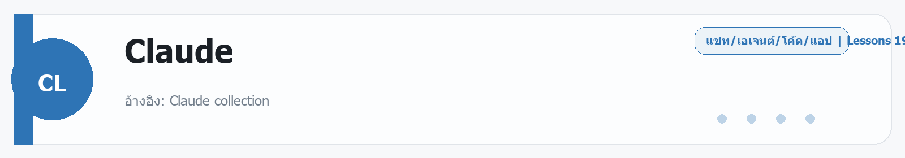

# Claude
Source: https://ailab.learnnakdev.online/docs/claude
Pages captured: 19

## Page 1 (หน้า 1 / 3)
```text
Claude
คู่มืออย่างเป็นทางการ
19 เอกสาร
เริ่มต้น
แอปผู้ใช้ (Claude.ai / มือถือ / เดสก์ท็อป)

อ้างอิง: Claude collection ·  5 นาที

หน้า 1 / 3
คู่มือ Claude ภาษาไทย — ส่วนที่ 1: แอปผู้ใช้ (Claude.ai / มือถือ / เดสก์ท็อป)

เรียบเรียงจาก Claude Help Center สำหรับผู้ใช้ทั่วไปที่ต้องการใช้ Claude ผ่านเว็บ แอปมือถือ และแอปเดสก์ท็อป

📖 คำศัพท์ที่ควรรู้ในเอกสารนี้
คำศัพท์	ความหมายง่ายๆ
SSO (Single Sign-On)	การล็อกอินด้วยบัญชีองค์กรเดียว แล้วเข้าได้ทุกบริการโดยไม่ต้องสร้างรหัสผ่านใหม่
SCIM	ระบบที่ให้ IT ขององค์กรเพิ่ม/ลบสมาชิกและสิทธิ์ใช้งานโดยอัตโนมัติ
MCP (Model Context Protocol)	มาตรฐานเปิดสำหรับเชื่อมต่อ AI กับเครื่องมือภายนอก เช่น Google Drive, Slack, GitHub
Connector	ตัวเชื่อมระหว่าง Claude กับบริการภายนอก (ทำงานผ่าน MCP)
Knowledge base (คลังความรู้)	ไฟล์/เอกสารที่อัปโหลดไว้ใน Project เพื่อให้ Claude อ้างอิงได้ตลอด
Custom instructions	คำสั่งที่ผู้ใช้กำหนดเองเพื่อปรับโทนหรือพฤติกรรมของ Claude เช่น "ตอบกระชับ ไม่เกิน 3 ประโยค"
Artifacts	หน้าต่างผลงานแยกด้านขวาที่แสดงโค้ด เอกสาร หรือแอปขนาดเล็กที่ Claude สร้าง
Sandbox	พื้นที่ทำงานแยกต่างหากภายในเบราว์เซอร์ โค้ดที่รันในนี้ไม่สามารถเข้าถึงข้อมูลอื่นในเครื่องได้
Prompt injection	การโจมตีโดยซ่อนคำสั่งปลอมเอาไว้ในเนื้อหาหน้าเว็บ เพื่อหลอกให้ AI ทำในสิ่งที่ไม่ได้ตั้งใจ
Zero Data Retention (ZDR)	นโยบายที่ Anthropic จะไม่เก็บข้อมูลการสนทนาไว้หลังจากประมวลผลเสร็จ (สำหรับองค์กร)
Extension	ส่วนขยายที่ติดตั้งเพิ่มในเบราว์เซอร์ Chrome เพื่อเพิ่มความสามารถ
1. ภาพรวมการใช้งาน Claude

อ้างอิง: Claude collection

หัวข้อนี้คืออะไร

Claude คือผู้ช่วย AI สนทนาที่ใช้ได้ผ่านเว็บ claude.ai แอปมือถือ (iOS/Android) และแอปเดสก์ท็อป (macOS/Windows) เราพิมพ์คำถามหรือสั่งงานเป็นภาษาธรรมชาติ (รวมถึงภาษาไทย) แล้ว Claude ตอบกลับ ช่วยเขียน สรุป วิเคราะห์ แปล เขียนโค้ด และทำงานกับไฟล์ได้

ใช้ทำอะไร
เขียนและปรับแก้ข้อความ อีเมล รายงาน บทความ
สรุปเอกสารยาว ๆ ตอบคำถามจากไฟล์ที่อัปโหลด
ช่วยคิดวิเคราะห์ ระดมไอเดีย วางแผน
เขียน/อธิบาย/แก้โค้ด สร้างตาราง กราฟ
ค้นเว็บและเชื่อมต่อเครื่องมือภายนอก (Connectors)
รายละเอียดสำคัญจากเอกสารทางการ

หน้าจอหลักประกอบด้วยช่องพิมพ์ข้อความ (prompt) ประวัติการสนทนาด้านข้าง และตัวเลือกโมเดล แต่ละบทสนทนา (chat) แยกความจำกัน Claude จำบริบทภายในบทสนทนาเดียวได้ แต่จะไม่ข้ามไปบทสนทนาอื่นโดยอัตโนมัติ เว้นแต่ใช้ฟีเจอร์ Memory หรือ Projects

โมเดลที่เลือกได้ขึ้นกับแพ็กเกจ โดยทั่วไปมีโมเดลเร็ว (Haiku), โมเดลสมดุล (Sonnet) และโมเดลเก่งสุด (Opus) ให้เลือกตามงาน

วิธีใช้งาน
เข้า claude.ai แล้วสมัคร/ล็อกอิน (อีเมล, Google หรือ SSO ขององค์กร — คือล็อกอินผ่านบัญชีที่บริษัทจัดให้โดยไม่ต้องสร้างรหัสผ่านใหม่)
พิมพ์คำถามหรือคำสั่งในช่องข้อความ กด Enter เพื่อส่ง
แนบไฟล์ได้ด้วยปุ่มคลิปหนีบหรือการลากวาง
เลือกโมเดลจากเมนูด้านบน/ใกล้ช่องพิมพ์
กดปุ่ม 👍/👎 เพื่อให้ฟีดแบ็ก หรือกดคัดลอก/แก้ไขข้อความ
ข้อควรระวัง
Claude อาจให้ข้อมูลที่ไม่ถูกต้องได้ ควรตรวจสอบข้อเท็จจริงสำคัญเสมอ
บทสนทนาแต่ละอันแยกกัน หากต้องการให้จำข้ามบทสนทนาให้ใช้ Memory/Projects
สรุปสั้น ๆ

Claude แอปคือผู้ช่วย AI สนทนาที่ใช้ได้หลายแพลตฟอร์ม สั่งงานเป็นภาษาไทยได้ ทำงานกับไฟล์และเครื่องมือภายนอกได้

2. แพ็กเกจและการเข้าถึง (Plans)

อ้างอิง: Pro and Max plans · Team and Enterprise plans

หัวข้อนี้คืออะไร

Claude มีหลายแพ็กเกจให้เลือกตามปริมาณการใช้งานและความต้องการ ตั้งแต่ใช้ฟรี ไปจนถึงแพ็กเกจองค์กร

รายละเอียดสำคัญจากเอกสารทางการ
Free — ใช้งานพื้นฐานฟรี มีโควต้าการส่งข้อความจำกัดต่อช่วงเวลา เข้าถึงโมเดลและฟีเจอร์ได้บางส่วน
Pro — แพ็กเกจรายเดือนสำหรับผู้ใช้ทั่วไป ได้โควต้าการใช้งานมากขึ้น เข้าถึงโมเดลเก่ง ๆ, Projects, Connectors และฟีเจอร์ขั้นสูง
Max — สำหรับผู้ใช้หนัก ได้โควต้าสูงกว่า Pro หลายเท่า (มีหลายระดับ) เหมาะกับคนที่ใช้ทั้งวันและใช้ Claude Code มาก
Team — สำหรับทีม/บริษัทเล็ก จัดการสมาชิก การเรียกเก็บเงินรวม และพื้นที่ทำงานร่วมกัน
Enterprise — สำหรับองค์กรใหญ่ เพิ่ม SSO (ล็อกอินด้วยบัญชีองค์กร)/SCIM (จัดการสมาชิกอัตโนมัติ), การควบคุมความปลอดภัย, นโยบายข้อมูล, และการจัดการผู้ดูแล

โควต้าการใช้งานมักวัดเป็นรอบเวลา (เช่น ทุก ๆ ไม่กี่ชั่วโมง) และขึ้นกับโมเดลที่เลือก โมเดลเก่งกว่าจะกินโควต้ามากกว่า

ข้อควรระวัง
ราคาและโควต้ามีการเปลี่ยนแปลง ควรตรวจสอบหน้าราคาทางการที่ claude.com/pricing เสมอ
การยกเลิก/เปลี่ยนแพ็กเกจทำได้ในหน้า Settings → Billing
สรุปสั้น ๆ

มี Free, Pro, Max, Team, Enterprise — เลือกตามปริมาณการใช้และความต้องการด้านองค์กร/ความปลอดภัย

3. Projects (พื้นที่ทำงานเฉพาะเรื่อง)

อ้างอิง: Claude collection

หัวข้อนี้คืออะไร

Projects คือพื้นที่รวมบทสนทนาและไฟล์ที่เกี่ยวข้องกับงานหนึ่ง ๆ ไว้ด้วยกัน พร้อมตั้ง "คำสั่งประจำโปรเจกต์" (custom instructions) และอัปโหลดความรู้ (knowledge) ที่ Claude จะอ้างอิงได้ในทุกบทสนทนาภายในโปรเจกต์นั้น

ใช้ทำอะไร

เหมาะกับงานต่อเนื่อง เช่น โปรเจกต์เขียนหนังสือ งานวิจัย งานลูกค้ารายหนึ่ง หรือฐานความรู้ภายในทีม โดยไม่ต้องอัปโหลดไฟล์หรืออธิบายบริบทซ้ำทุกครั้ง

รายละเอียดสำคัญจากเอกสารทางการ
แต่ละโปรเจกต์มี knowledge base (คลังความรู้) ของตัวเอง อัปโหลดเอกสาร/ไฟล์เพื่อให้ Claude ใช้อ้างอิงได้ตลอดโดยไม่ต้องส่งซ้ำทุกครั้ง
ตั้ง custom instructions (คำสั่งกำหนดพฤติกรรม) เพื่อกำหนดบทบาท โทน หรือรูปแบบผลลัพธ์ที่ต้องการ เช่น "ตอบเป็นภาษาทางการ" หรือ "ไม่ต้องใช้ bullet point"
บทสนทนาทุกอันในโปรเจกต์ใช้ความรู้และคำสั่งร่วมกัน
แชร์โปรเจกต์กับสมาชิกทีมได้ (ในแพ็กเกจ Team/Enterprise)
วิธีใช้งาน
กด Projects ในเมนูด้านข้าง แล้ว Create project
ตั้งชื่อและคำอธิบาย
เพิ่มไฟล์/เอกสารใน knowledge และเขียน custom instructions
เริ่มบทสนทนาภายในโปรเจกต์ — Claude จะอ้างอิงความรู้นั้นอัตโนมัติ
สรุปสั้น ๆ

Projects = รวมไฟล์ + คำสั่ง + บทสนทนาของงานเดียวไว้ที่เดียว ไม่ต้องอธิบายบริบทซ้ำ

4. Artifacts (ผลงานที่แก้ไขได้แยกหน้าต่าง)

อ้างอิง: Claude collection

หัวข้อนี้คืออะไร

Artifacts คือหน้าต่างแยกด้านขวาที่แสดงผลงานชิ้นใหญ่ เช่น โค้ด เอกสาร เว็บหน้าเดียว (HTML), ไดอะแกรม หรือแอปเล็ก ๆ (React — กรอบสร้างหน้าเว็บแบบโต้ตอบ) ที่ Claude สร้าง — แก้ไข ดูตัวอย่าง และนำไปใช้ต่อได้สะดวก

ใช้ทำอะไร

เหมาะกับผลงานที่ต้องการเก็บแยกจากบทสนทนา เช่น สร้างเครื่องคิดเลข, แดชบอร์ด, เกมเล็ก ๆ, เอกสารยาว, โค้ดที่ต้องคัดลอกไปใช้

รายละเอียดสำคัญจากเอกสารทางการ
รองรับเนื้อหาหลายชนิด: โค้ด, Markdown, HTML, SVG, ไดอะแกรม (Mermaid) และคอมโพเนนต์ React
แก้ไขซ้ำได้ Claude จะอัปเดต artifact เดิมแทนการสร้างใหม่
ดูตัวอย่างผลลัพธ์ (preview) ได้ทันทีสำหรับ HTML/React
ดาวน์โหลดหรือคัดลอกไปใช้นอกแอปได้
สามารถเผยแพร่/แชร์ artifact บางประเภทได้
ข้อควรระวัง
artifact ที่เป็นแอปทำงานใน แซนด์บ็อกซ์ ของเบราว์เซอร์ (พื้นที่แยกต่างหากที่ปลอดภัย ไม่สามารถเข้าถึงข้อมูลอื่นในเครื่อง) มีข้อจำกัด เช่น ห้ามใช้ localStorage (พื้นที่เก็บข้อมูลในเบราว์เซอร์) ในบางสภาพแวดล้อม
ตรวจสอบโค้ดก่อนนำไป production เสมอ
สรุปสั้น ๆ

Artifacts = หน้าต่างผลงานแก้ไขได้ (โค้ด/เอกสาร/แอป) ที่ดูตัวอย่างและนำไปใช้ต่อได้

5. Memory (ความจำข้ามบทสนทนา)

อ้างอิง: Claude collection

หัวข้อนี้คืออะไร

Memory ช่วยให้ Claude จดจำข้อมูลสำคัญเกี่ยวกับผู้ใช้และงานข้ามบทสนทนาได้ เช่น ความชอบ บริบทงาน หรือรูปแบบการทำงานที่ต้องการ

ใช้ทำอะไร

ลดการอธิบายซ้ำ เช่น "ฉันชอบคำตอบกระชับ" หรือ "ฉันทำงานสาย X" Claude จะนำมาใช้ในบทสนทนาถัด ๆ ไป

รายละเอียดสำคัญจากเอกสารทางการ
ผู้ใช้ควบคุมได้ว่าจะเปิด/ปิด Memory และดู/ลบสิ่งที่จำไว้ได้ในหน้า Settings
สามารถสั่งให้จำหรือลืมสิ่งใดสิ่งหนึ่งได้โดยตรงในบทสนทนา
ในแพ็กเกจองค์กร ผู้ดูแลอาจกำหนดนโยบายการใช้ Memory
ข้อควรระวัง
หลีกเลี่ยงการให้ Claude จำข้อมูลอ่อนไหว (รหัสผ่าน เลขบัตร ข้อมูลสุขภาพ) เว้นแต่จำเป็นและเข้าใจความเสี่ยง
ตรวจสอบเนื้อหาที่จำเป็นระยะ ๆ และลบสิ่งที่ไม่ต้องการ
สรุปสั้น ๆ

Memory = ความจำข้ามแชทที่ผู้ใช้ควบคุมเปิด/ปิด/ลบได้ ช่วยไม่ต้องอธิบายซ้ำ

6. ไฟล์และไฟล์แนบ (Files & Attachments)

อ้างอิง: Claude collection

หัวข้อนี้คืออะไร

สามารถแนบไฟล์ให้ Claude อ่านและวิเคราะห์ เช่น PDF, รูปภาพ, เอกสาร Word, สเปรดชีต, ไฟล์ข้อความ/โค้ด

รายละเอียดสำคัญจากเอกสารทางการ
รองรับการอ่าน PDF (รวมข้อความและภาพในหน้า), รูปภาพ (vision), CSV/สเปรดชีต, และไฟล์ข้อความ
ลากวางไฟล์หรือกดปุ่มแนบเพื่ออัปโหลด
Claude สรุป ดึงข้อมูล ตอบคำถาม หรือแปลงข้อมูลจากไฟล์ได้
มีข้อจำกัดด้านขนาดและจำนวนไฟล์ต่อข้อความ (ขึ้นกับแพ็กเกจ)
วิธีใช้งาน
กดไอคอนแนบไฟล์หรือลากไฟล์เข้าช่องพิมพ์
พิมพ์คำสั่งว่าต้องการให้ทำอะไรกับไฟล์ (เช่น "สรุปเอกสารนี้เป็นข้อ ๆ")
ส่งข้อความ
สรุปสั้น ๆ

แนบ PDF/รูป/สเปรดชีต/เอกสารให้ Claude อ่าน วิเคราะห์ สรุป และดึงข้อมูลได้

7. Connectors (เชื่อมต่อเครื่องมือภายนอก / MCP)

อ้างอิง: Connectors

หัวข้อนี้คืออะไร

Connectors คือการเชื่อม Claude เข้ากับเครื่องมือและบริการภายนอก เช่น Google Drive, Slack, GitHub, ฐานข้อมูล ฯลฯ ผ่านมาตรฐานเปิด MCP (Model Context Protocol) ซึ่งเป็นมาตรฐานกลางที่ทำให้ AI เชื่อมกับเครื่องมือต่าง ๆ ได้ง่าย — เพื่อให้ Claude อ่านข้อมูลและทำงานกับบริการเหล่านั้นได้

กล่าวง่าย ๆ: Connector คือ "สะพาน" ระหว่าง Claude กับแอปที่คุณใช้งาน Claude จะเข้าถึงข้อมูลในแอปนั้น ๆ ได้ก็ต่อเมื่อคุณอนุญาตเท่านั้น

ใช้ทำอะไร
ดึงเอกสารจาก Google Drive มาสรุป
ค้นและตอบจากข้อความใน Slack
จัดการ issue/PR ใน GitHub
เชื่อมเครื่องมือภายในองค์กรที่รองรับ MCP
รายละเอียดสำคัญจากเอกสารทางการ
มี connector สำเร็จรูปจาก Anthropic และพาร์ตเนอร์ และเพิ่ม MCP server ของตัวเองได้
ต้องอนุญาตสิทธิ์ (authorize) ให้ connector เข้าถึงบัญชี/ข้อมูลก่อนใช้งาน
ในแพ็กเกจองค์กร ผู้ดูแลควบคุมได้ว่าจะเปิด connector ใดบ้าง
ข้อควรระวัง
ให้สิทธิ์เฉพาะ connector ที่เชื่อถือได้ และตรวจสอบขอบเขตสิทธิ์ที่ขอ
ข้อมูลที่ดึงเข้ามาจะกลายเป็นบริบทของบทสนทนา ระวังข้อมูลอ่อนไหว
สรุปสั้น ๆ

Connectors (MCP) = เชื่อม Claude กับเครื่องมือภายนอกเพื่ออ่านข้อมูลและทำงานข้ามแอปได้

8. Claude ในเบราว์เซอร์ (Claude in Chrome)

อ้างอิง: Claude in Chrome

หัวข้อนี้คืออะไร

ส่วนขยาย (Extension) ที่ให้ Claude ทำงานในเบราว์เซอร์ Chrome — ช่วยอ่าน สรุป กรอกฟอร์ม และทำงานบนหน้าเว็บแทนผู้ใช้ได้

Extension คือโปรแกรมเสริมขนาดเล็กที่ติดตั้งเพิ่มเข้าไปในเบราว์เซอร์ เหมือน "ปลั๊กอิน" ที่เพิ่มความสามารถให้ Chrome

(เป็นฟีเจอร์รุ่น เบต้า — หมายถึงฟีเจอร์ที่ยังอยู่ในช่วงทดสอบ ความสามารถอาจเปลี่ยนแปลงได้)

รายละเอียดสำคัญจากเอกสารทางการ
ติดตั้งส่วนขยายและล็อกอินด้วยบัญชี Claude
Claude มองเห็นและโต้ตอบกับหน้าเว็บที่เปิดอยู่ได้ (เช่น ดึงข้อมูล กรอกข้อมูล นำทาง)
มีการขออนุญาตและกลไกความปลอดภัยก่อนทำงานบนเว็บ โดยเฉพาะการคลิกลิงก์ที่น่าสงสัย
ข้อควรระวัง
ระวัง Prompt Injection — คือการที่หน้าเว็บบางหน้าซ่อนคำสั่งแฝงเอาไว้ในเนื้อหา เพื่อหลอกให้ Claude ทำสิ่งที่ไม่ได้ตั้งใจ เช่น เปิดเผยข้อมูลส่วนตัวของคุณ ตรวจสอบการกระทำที่มีความเสี่ยง เช่น การกรอกข้อมูลสำคัญหรือทำธุรกรรม
เป็นฟีเจอร์เบต้า ความสามารถและการเข้าถึงอาจเปลี่ยนแปลง
สรุปสั้น ๆ

Claude in Chrome = ผู้ช่วยในเบราว์เซอร์ที่อ่าน/สรุป/ทำงานบนหน้าเว็บได้ ใช้อย่างระวังเรื่องความปลอดภัย

9. แอปมือถือและเดสก์ท็อป

อ้างอิง: Mobile apps · Claude Desktop

รายละเอียดสำคัญจากเอกสารทางการ
มือถือ (iOS/Android): แชท แนบรูป/ไฟล์ ใช้เสียงพูด และซิงก์ประวัติข้ามอุปกรณ์ผ่านบัญชีเดียวกัน
เดสก์ท็อป (macOS/Windows): แอปเฉพาะที่เปิดเร็ว ใช้คีย์ลัด เชื่อม connectors และเข้าถึงฟีเจอร์อย่าง Cowork/Claude Code ได้ (ขึ้นกับการเปิดให้ใช้)
ประวัติบทสนทนา, Projects และ Memory ซิงก์ผ่านบัญชีเดียวกันทุกแพลตฟอร์ม
สรุปสั้น ๆ

ใช้ Claude ได้ทั้งมือถือและเดสก์ท็อป ข้อมูลซิงก์ผ่านบัญชีเดียว

10. ความเป็นส่วนตัว ความปลอดภัย และนโยบายข้อมูล

อ้างอิง: Privacy and legal · Safeguards

รายละเอียดสำคัญจากเอกสารทางการ
Anthropic มีนโยบายความเป็นส่วนตัวและการใช้งาน (Usage Policy) กำกับว่าผู้ใช้ทำอะไรได้/ไม่ได้
ผู้ใช้ควบคุมการตั้งค่าข้อมูลได้ในหน้า Settings เช่น การใช้ข้อมูลเพื่อปรับปรุงโมเดล
แพ็กเกจองค์กรมีตัวเลือกเพิ่ม เช่น Zero Data Retention (ZDR) — นโยบายที่ Anthropic จะไม่เก็บข้อมูลบทสนทนาของคุณไว้หลังประมวลผลเสร็จ, การควบคุมการเก็บข้อมูล และการปฏิบัติตามมาตรฐาน
มีระบบ Safeguards ป้องกันการใช้งานที่เป็นอันตราย และดูแลความปลอดภัยเด็ก
ข้อควรระวัง
หลีกเลี่ยงการป้อนข้อมูลลับ/อ่อนไหวเกินจำเป็น
อ่านนโยบายล่าสุดที่ Privacy Policy และ Usage Policy
สรุปสั้น ๆ

ผู้ใช้ควบคุมข้อมูลได้ องค์กรมีตัวเลือกความปลอดภัยเพิ่ม ควรอ่านนโยบายทางการเสมอ

หัวข้ออ้างอิงเพิ่มเติม
Release Notes (แอป): https://support.claude.com/en/articles/12138966-release-notes
วิธีขอความช่วยเหลือ: https://support.claude.com/en/articles/9015913-how-to-get-support
Claude for Education: https://support.claude.com/en/collections/12630177-claude-for-education
Claude for Nonprofits: https://support.claude.com/en/collections/17047088-claude-for-nonprofits
 ก่อนหน้า
ถัดไป
Developer Docs / API
```

## Page 2 (หน้า 2 / 3)
```text
Claude
คู่มืออย่างเป็นทางการ
19 เอกสาร
เริ่มต้น
Developer Docs / API

อ้างอิง: Intro to Claude ·  9 นาที

หน้า 2 / 3
คู่มือ Claude ภาษาไทย — ส่วนที่ 2: Developer Docs / API

เรียบเรียงจาก platform.claude.com/docs สำหรับนักพัฒนาที่ต้องการนำ Claude ไปใช้ในแอปของตัวเองผ่าน API

📖 คำศัพท์สำคัญสำหรับนักพัฒนา
คำศัพท์	ความหมายง่ายๆ
API (Application Programming Interface)	ช่องทางสำเร็จรูปที่ให้โปรแกรมของคุณ "คุย" กับ Claude ได้ โดยส่งข้อมูลผ่านอินเทอร์เน็ต
Endpoint	URL (ที่อยู่เว็บ) สำหรับรับ-ส่งข้อมูลกับ API เช่น POST /v1/messages คือ URL ที่ใช้ส่งข้อความ
SDK (Software Development Kit)	ชุดเครื่องมือและโค้ดสำเร็จรูปที่ทำให้เรียกใช้ API ง่ายขึ้น เช่น ไม่ต้องเขียน HTTP request เอง
API Key	รหัสลับส่วนตัวที่ใช้ยืนยันว่าคุณมีสิทธิ์ใช้ API เหมือน "บัตรผ่าน" ที่ต้องส่งไปทุกครั้ง
Token	หน่วยที่ AI ใช้วัดขนาดข้อความ ประมาณ 1 token ≈ 0.75 คำภาษาอังกฤษ หรือ ≈ 1-3 ตัวอักษรไทย
Max tokens	จำนวน token สูงสุดที่อนุญาตให้ Claude ตอบกลับ ถ้าคำตอบยาวเกินจะถูกตัด
Context window	"ขนาดหน่วยความจำ" ของโมเดล คือจำนวน token สูงสุดที่ส่งได้ในคำขอเดียว รวมทั้งคำถามและประวัติสนทนา
Stateless	ไม่มีความจำ — API ไม่จำบทสนทนาเก่าเลย ต้องส่งประวัติทั้งหมดกลับไปทุกครั้งที่ส่งคำขอ
Prompt	ข้อความหรือคำสั่งที่ส่งให้ AI ประมวลผล
System prompt	คำสั่งเบื้องต้นที่กำหนดบทบาทหรือพฤติกรรมโดยรวมของ Claude เช่น "คุณเป็นผู้ช่วยลูกค้าของบริษัท X"
Prompt caching	การบันทึก (แคช) ส่วนของ prompt ที่ส่งซ้ำบ่อย ๆ เพื่อลดต้นทุนและเพิ่มความเร็ว
Streaming	รับคำตอบทีละชิ้นแบบเรียลไทม์ เหมือนดูพิมพ์ทีละตัวอักษร แทนที่จะรอจนคำตอบครบ
Agentic loop	วงจรที่ AI ทำงานซ้ำหลายรอบ: ถามคำถาม → เรียกใช้เครื่องมือ → ดูผล → ทำต่อ → จนเสร็จ
Tool use	การให้ Claude "เรียกใช้" ฟังก์ชันหรือเครื่องมือของแอปคุณ เช่น ค้นเว็บ คำนวณ ดึงข้อมูล
Batch processing	การส่งคำขอจำนวนมากพร้อมกันแบบไม่รอผลทันที (asynchronous) เหมาะกับงานปริมาณมาก
Asynchronous	ทำงานเบื้องหลัง ไม่รอให้เสร็จก่อนทำต่อ เหมือนสั่งอาหาร แล้วไปทำงานอื่นรอ
Rate limit	ขีดจำกัดจำนวนคำขอที่ส่งได้ต่อช่วงเวลา ป้องกันการใช้งานเกินพิกัด
Latency	ความหน่วง — เวลาที่ใช้รอตั้งแต่ส่งคำขอจนได้รับคำตอบ ยิ่งน้อยยิ่งเร็ว
Guardrails	กฎหรือตัวกรองที่ควบคุมพฤติกรรม AI ไม่ให้ตอบสิ่งที่ไม่ต้องการ
Evals (Evaluations)	การทดสอบคุณภาพของ prompt หรือโมเดลก่อนนำไปใช้จริง
Environment variable	ตัวแปรที่เก็บค่าสำคัญ เช่น API key ไว้ในระบบ แทนที่จะเขียนตรงๆ ในโค้ด เพื่อความปลอดภัย
1. ภาพรวมการพัฒนาด้วย Claude

อ้างอิง: Intro to Claude

หัวข้อนี้คืออะไร

Anthropic ให้สองวิธีหลักในการสร้างงานกับ Claude:

Messages API — เข้าถึงโมเดลโดยตรง คุณสร้างทุก "รอบสนทนา" เอง จัดการสถานะบทสนทนาและวงจรการเรียกเครื่องมือเอง เหมาะกับงานที่ต้องการควบคุมละเอียด
Claude Managed Agents — โครงสร้าง agent (AI ที่ทำงานหลายขั้นตอนอัตโนมัติ) สำเร็จรูปที่ Anthropic จัดการ infrastructure (ระบบโครงสร้างพื้นฐาน) ให้ เหมาะกับงานยาว ๆ และงานที่รันเบื้องหลัง
เครื่องมือสำหรับนักพัฒนา
Developer Console (platform.claude.com) — ทดลองและทดสอบ prompt ใน Workbench, สร้าง prompt อัตโนมัติ, จัดการ API key
API Reference — เอกสาร endpoint และ client SDK ครบถ้วน
Cookbook / Quickstarts — โน้ตบุ๊กและแอปตัวอย่างพร้อมใช้
สรุปสั้น ๆ

เลือก Messages API ถ้าต้องการควบคุมเอง หรือ Managed Agents ถ้าต้องการ agent สำเร็จรูปแบบ managed

2. Quickstart — เรียก API ครั้งแรก

อ้างอิง: Quickstart

วิธีใช้งาน (Step-by-step)
สมัครและสร้าง API key (รหัสลับสำหรับใช้งาน API) ที่ platform.claude.com/settings/keys
ตั้งค่า environment variable (ตัวแปรสภาพแวดล้อม — วิธีเก็บค่าลับไว้ในระบบโดยไม่ต้องเขียนในโค้ด): ANTHROPIC_API_KEY
ติดตั้ง SDK (ชุดเครื่องมือสำเร็จรูปสำหรับเรียกใช้ API ง่ายขึ้น) บน Python: pip install anthropic
ส่งข้อความแรก
ตัวอย่าง (Python)
import anthropic

client = anthropic.Anthropic()  # อ่านคีย์จาก ANTHROPIC_API_KEY

message = client.messages.create(
    model="claude-opus-4-8",
    max_tokens=1024,
    messages=[
        {"role": "user", "content": "สวัสดี Claude ช่วยแนะนำตัวหน่อย"}
    ],
)
print(message.content[0].text)


มี SDK อย่างเป็นทางการสำหรับ Python, TypeScript, Go, Java, Ruby, PHP, C# และเรียกผ่าน cURL/CLI ได้

ข้อควรระวัง
เก็บ API key เป็นความลับ อย่า commit ลง repo
max_tokens คือเพดานจำนวน token (หน่วยวัดข้อความ) ของคำตอบ ต้องกำหนดเสมอ ถ้าคำตอบยาวเกินค่านี้จะถูกตัดกลางคัน
สรุปสั้น ๆ

สร้างคีย์ → ตั้ง env → ติดตั้ง SDK → เรียก messages.create พร้อม model, max_tokens, messages

3. Messages API (โครงสร้างหลัก)

อ้างอิง: Using the Messages API

หัวข้อนี้คืออะไร

Messages API คือ endpoint หลักในการคุยกับ Claude โดยส่งรายการข้อความ (messages) แบบสลับบทบาท user และ assistant แล้วรับคำตอบกลับ

รายละเอียดสำคัญจากเอกสารทางการ
โครงสร้างคำขอ: model, max_tokens, messages (จำเป็น) และ system, temperature, tools, stream ฯลฯ (ทางเลือก)
บทสนทนาหลายรอบ: API ไม่มีความจำ (stateless — ไม่จำสิ่งที่คุยกันไปก่อนหน้า) ดังนั้นต้องส่งประวัติบทสนทนาทั้งหมดกลับไปทุกครั้ง ต่อบทสนทนาด้วยการต่อรายการ messages
System prompt: ใส่ในพารามิเตอร์ system เพื่อกำหนดบทบาท/พฤติกรรมโดยรวม
เนื้อหา (content): เป็นข้อความ หรือ array ของ block (ข้อความ, รูปภาพ, ไฟล์, tool_use, tool_result)
ตัวอย่าง (บทสนทนาหลาย turn + system)
message = client.messages.create(
    model="claude-sonnet-4-6",
    max_tokens=1024,
    system="คุณเป็นติวเตอร์คณิตศาสตร์ ตอบเป็นภาษาไทยแบบเข้าใจง่าย",
    messages=[
        {"role": "user", "content": "อธิบายทฤษฎีบทพีทาโกรัส"},
        {"role": "assistant", "content": "ทฤษฎีบทพีทาโกรัสกล่าวว่า..."},
        {"role": "user", "content": "ยกตัวอย่างหน่อย"},
    ],
)

สรุปสั้น ๆ

ส่ง array ของ messages (user/assistant) + system; API ไม่จำสถานะ ต้องส่งประวัติเองทุกครั้ง

4. Handling stop reasons (เหตุผลที่ Claude หยุด)

อ้างอิง: Handling stop reasons

รายละเอียดสำคัญจากเอกสารทางการ

คำตอบจะมีฟิลด์ stop_reason บอกว่าทำไมโมเดลหยุดสร้างผลลัพธ์ ค่าที่พบบ่อย:

end_turn — ตอบจบตามปกติ โปรแกรมทำงานต่อได้เลย
max_tokens — คำตอบชนเพดาน token ที่ตั้งไว้ คำตอบอาจถูกตัดกลางคัน ควรเพิ่มค่า max_tokens หรือสั่งให้ทำต่อ
stop_sequence — เจอคำ/วลีที่กำหนดให้หยุด (เช่น กำหนดว่าพอเจอคำว่า "END" ให้หยุด)
tool_use — Claude ต้องการเรียกใช้เครื่องมือ โปรแกรมต้องรันเครื่องมือนั้น แล้วส่งผลกลับให้ Claude ทำต่อ
pause_turn / refusal — กรณีพิเศษ เช่น หยุดชั่วคราว หรือ Claude ปฏิเสธที่จะตอบ
ข้อควรระวัง

ควรเขียนโค้ดจัดการทุกค่า stop_reason โดยเฉพาะ tool_use และ max_tokens เพื่อให้ loop ทำงานถูกต้อง

สรุปสั้น ๆ

ตรวจ stop_reason ทุกครั้ง: tool_use ต้องรันเครื่องมือต่อ, max_tokens คือคำตอบถูกตัด

5. โมเดลและการเลือกใช้ (Models)

อ้างอิง: Models overview · Choosing a model

รายละเอียดสำคัญจากเอกสารทางการ

ตระกูลรุ่นล่าสุด:

คุณสมบัติ	Opus 4.8	Sonnet 4.6	Haiku 4.5
จุดเด่น	เก่งสุด เหตุผลซับซ้อน + coding	สมดุลเร็ว/ฉลาด	เร็วสุด
API ID	claude-opus-4-8	claude-sonnet-4-6	claude-haiku-4-5-20251001
ราคา (input/output ต่อ 1M tokens)	$5 / $25	$3 / $15	$1 / $5
Context window	1M tokens	1M tokens	200k tokens
Max output	128k tokens	64k tokens	64k tokens
Extended thinking	ไม่	ใช่	ใช่
Adaptive thinking	ใช่	ใช่	ไม่
ทุกรุ่นรองรับ input ข้อความ+รูปภาพ, output ข้อความ, หลายภาษา และ vision
ใช้ได้ผ่าน Claude API, AWS Bedrock, Vertex AI และ Microsoft Foundry
บน Opus 4.8 พารามิเตอร์ effort ค่าเริ่มต้นเป็น high ทุกแพลตฟอร์ม
Model IDs และเวอร์ชัน

อ้างอิง: Model IDs and versioning

ทุก model ID เป็น snapshot ที่ตรึงไว้ (pinned) ตั้งแต่รุ่น 4.6 เป็นต้นไปใช้รูปแบบไม่มีวันที่แต่ก็ยังเป็น snapshot ตรึง ไม่ใช่ตัวชี้แบบ evergreen
คิวรีความสามารถและเพดาน token ของโมเดลได้ผ่าน Models API
ข้อควรระวัง
เริ่มจาก Opus 4.8 สำหรับงานยากสุด แต่ใช้ Sonnet/Haiku เพื่อประหยัดต้นทุนในงานทั่วไป
ตรวจตาราง deprecations ก่อนตรึงรุ่นเก่าระยะยาว
สรุปสั้น ๆ

Opus = เก่งสุด, Sonnet = สมดุล, Haiku = เร็ว/ถูก; เลือกตามความยากและงบประมาณ

6. Tool use (การเรียกใช้เครื่องมือ)

อ้างอิง: Tool use overview · How tool use works

หัวข้อนี้คืออะไร

Tool use ให้ Claude เรียกฟังก์ชันที่คุณนิยาม หรือเครื่องมือที่ Anthropic ให้มา Claude ตัดสินใจเองว่าจะเรียกเครื่องมือเมื่อไหร่จากคำอธิบายของ tool แล้วคืนการเรียกแบบมีโครงสร้างให้แอปไปรัน

รายละเอียดสำคัญจากเอกสารทางการ

แบ่งตามที่โค้ดทำงาน:

Client tools (เครื่องมือฝั่งคุณ) — รันในแอปของคุณเอง คุณเขียนฟังก์ชันไว้ แล้ว Claude จะขอเรียกเมื่อต้องการ Claude ส่ง stop_reason: "tool_use" มาพร้อมรายละเอียด คุณรันฟังก์ชัน แล้วส่งผลกลับเป็น tool_result
Server tools (เครื่องมือฝั่ง Anthropic) — รันบนเซิร์ฟเวอร์ของ Anthropic เช่น ค้นเว็บ ดึงหน้าเว็บ รันโค้ด Python คุณได้ผลลัพธ์โดยไม่ต้องเขียนโค้ดเครื่องมือเอง

Agentic loop (วงจรการทำงานซ้ำ): ส่งคำขอ → Claude อาจขอเรียกเครื่องมือ → แอปรันเครื่องมือ → ส่งผลกลับ → Claude ใช้ผลทำต่อ → วนซ้ำจนตอบจบ (end_turn)

เปรียบเหมือน: Claude เป็นเหมือนพนักงานที่ทำงานให้คุณ เมื่อต้องการข้อมูลก็จะ "ขอ" ให้คุณไปหาข้อมูลมาให้ (client tool) หรือบางอย่างเขาหาได้เองเลย (server tool)

ควบคุมการเรียกเครื่องมือ: tool_choice ค่าเริ่มต้นเป็น {"type": "auto"} (Claude ตัดสินใจเองว่าจะเรียกหรือไม่) ปรับเป็น any/tool เพื่อบังคับให้เรียกเสมอ และเพิ่ม strict: true เพื่อรับประกันว่าข้อมูลที่ส่งมาตรงรูปแบบที่กำหนดไว้ (schema)

ตัวอย่าง (server tool: web search)
response = client.messages.create(
    model="claude-opus-4-8",
    max_tokens=1024,
    tools=[{"type": "web_search_20260209", "name": "web_search"}],
    messages=[{"role": "user", "content": "ข่าวล่าสุดเรื่อง Mars rover มีอะไรบ้าง"}],
)

ตัวอย่าง (client tool: นิยามเอง)
tools = [{
    "name": "get_weather",
    "description": "ดึงสภาพอากาศปัจจุบันของเมืองที่ระบุ",
    "input_schema": {
        "type": "object",
        "properties": {"city": {"type": "string", "description": "ชื่อเมือง"}},
        "required": ["city"],
    },
}]
# เมื่อ stop_reason == "tool_use" ให้รันฟังก์ชันจริง แล้วส่ง tool_result กลับ

ข้อควรระวัง
การให้ tools เพิ่ม token ของ system prompt (เช่น Opus 4.8 ใช้เพิ่ม ~290–410 tokens)
Server tools อาจมีค่าใช้จ่ายเพิ่มตามการใช้งาน (เช่น web search คิดต่อครั้งค้นหา)
สรุปสั้น ๆ

Client tools รันที่แอปคุณ (ต้องส่ง tool_result กลับ), Server tools รันฝั่ง Anthropic; วน agentic loop จนได้คำตอบ

7. Server tools ที่สำคัญ

อ้างอิง: Server tools

รายละเอียดสำคัญจากเอกสารทางการ
Web search — ค้นเว็บแบบเรียลไทม์ คิดเงินต่อครั้งค้นหา (web-search-tool)
Web fetch — ดึงเนื้อหาจาก URL ที่ระบุ (web-fetch-tool)
Code execution — รันโค้ด Python ในแซนด์บ็อกซ์ เหมาะกับการคำนวณ/วิเคราะห์ข้อมูล (code-execution-tool)
Memory tool — ให้ Claude เก็บ/อ่านความจำข้ามคำขอผ่านไฟล์ (memory-tool)
Bash / Computer use / Text editor — เครื่องมือฝั่งคุณ (client tools) แต่ใช้รูปแบบ (schema) มาตรฐานที่ Anthropic กำหนด ใช้สำหรับสั่งบรรทัดคำสั่ง ควบคุมหน้าจอ และแก้ไขไฟล์
สรุปสั้น ๆ

มีเครื่องมือสำเร็จ: ค้นเว็บ, ดึง URL, รันโค้ด, ความจำ, เชลล์, computer use, แก้ไฟล์

8. ความสามารถของโมเดล (Model capabilities)

อ้างอิง: Extended thinking · Streaming · Structured outputs · Batch processing

รายละเอียดสำคัญจากเอกสารทางการ
Extended thinking (คิดแบบขยาย) — ให้โมเดลใช้ "พื้นที่คิด" ก่อนตอบ เหมือนคนทำงานที่ต้องคิดทบทวนก่อนตอบ เพิ่มคุณภาพในงานที่ต้องการเหตุผลซับซ้อน (รองรับใน Sonnet/Haiku รุ่นล่าสุด)
Adaptive thinking / Effort (ปรับระดับความพยายาม) — กำหนดว่าจะให้โมเดล "คิดมากแค่ไหน" เพื่อสมดุลระหว่างคุณภาพและต้นทุน
Structured outputs (ผลลัพธ์เป็นโครงสร้าง) — บังคับให้คำตอบออกมาเป็นรูปแบบที่กำหนด เช่น JSON (รูปแบบข้อมูลที่โปรแกรมอ่านได้ง่าย) เพื่อนำไปใช้ต่อในแอปได้ทันที
Streaming (รับแบบสตรีม) — รับคำตอบทีละส่วนแบบเรียลไทม์ผ่าน Server-Sent Events (SSE) (เทคนิคส่งข้อมูลจากเซิร์ฟเวอร์แบบต่อเนื่อง) แทนที่จะรอจนคำตอบครบ ทำให้ผู้ใช้เห็นคำตอบได้เร็วขึ้น
Batch processing (ประมวลผลเป็นชุด) — ส่งคำขอจำนวนมากพร้อมกันแบบ asynchronous (ทำงานเบื้องหลัง ไม่รอผลทันที) ในราคาลดพิเศษ 50% เหมาะกับงานปริมาณมากที่ไม่รีบ
Citations (การอ้างอิง) — ให้ Claude อ้างอิงแหล่งที่มาจากเอกสารที่ให้ไป (Citations)
สรุปสั้น ๆ

ปรับการคิด (thinking/effort), บังคับรูปแบบ (structured outputs), สตรีมผลลัพธ์, และประมวลผลเป็นชุด (batch) เพื่อประหยัด

9. การจัดการบริบท (Context management)

อ้างอิง: Context windows · Prompt caching · Token counting

รายละเอียดสำคัญจากเอกสารทางการ
Context window (หน้าต่างบริบท) — จำนวน token สูงสุดที่ใส่ได้ในคำขอเดียว เปรียบเหมือน "ขนาดกระดาษ" ที่ Claude อ่านได้ต่อครั้ง (Opus 4.8/Sonnet 4.6 = 1 ล้าน tokens, Haiku 4.5 = 200,000 tokens)
Prompt caching (แคชส่วน prompt) — บันทึกส่วน prompt ที่ส่งซ้ำบ่อย เช่น system prompt หรือเอกสารยาว เพื่อลดต้นทุนและความหน่วง (latency) ของคำขอถัดไป
Compaction / Context editing (บีบอัดบริบท) — เมื่อบทสนทนายาวมาก ระบบจะสรุปหรือตัดประวัติเก่าออก เพื่อไม่ให้ล้นขนาด context window
Token counting (นับ token) — นับจำนวน token ล่วงหน้าก่อนส่งจริง เพื่อวางแผนต้นทุนและตรวจว่าขนาดเกินหรือไม่
ข้อควรระวัง

ยิ่ง context ยาว ยิ่งกินต้นทุน ใช้ prompt caching และ compaction ช่วยเมื่อทำงานยาว/ซ้ำ

สรุปสั้น ๆ

รู้ขนาด context window, ใช้ prompt caching ลดต้นทุนเนื้อหาซ้ำ, นับ token ล่วงหน้าเพื่อวางแผน

10. การทำงานกับไฟล์ (Files / PDF / Vision)

อ้างอิง: Files API · PDF support · Vision

รายละเอียดสำคัญจากเอกสารทางการ
Files API — อัปโหลดไฟล์เก็บไว้แล้วอ้างถึงด้วย file ID ในหลายคำขอ โดยไม่ต้องส่งซ้ำ
PDF support — ส่ง PDF ให้ Claude อ่านทั้งข้อความและองค์ประกอบภาพในหน้า
Vision — ส่งรูปภาพ (base64 หรือ URL/file) ให้ Claude วิเคราะห์ บรรยาย หรือดึงข้อมูล
สรุปสั้น ๆ

อัปโหลดผ่าน Files API แล้วอ้างด้วย ID; รองรับอ่าน PDF และวิเคราะห์รูปภาพ (vision)

11. Skills (ในบริบท API)

อ้างอิง: Agent Skills overview · Skills in the API

หัวข้อนี้คืออะไร

Skills คือชุดความสามารถแบบแพ็กเกจ (โฟลเดอร์ที่มีไฟล์ SKILL.md พร้อมคำสั่งและสคริปต์) ที่ Claude โหลดมาใช้เมื่องานนั้นต้องการ เปรียบเหมือน "ปลั๊กอิน" ที่เพิ่มความสามารถเฉพาะทาง เช่น สร้างเอกสาร Word/PowerPoint/Excel

รายละเอียดสำคัญจากเอกสารทางการ
โหลดเฉพาะตอนที่เกี่ยวข้อง (progressive disclosure — ไม่โหลดทั้งหมดพร้อมกัน ประหยัด context)
ใช้ได้ทั้งใน Claude apps, Claude Code และผ่าน API
มี best practices และโหมดสำหรับองค์กร
สรุปสั้น ๆ

Skills = แพ็กเกจความสามารถเฉพาะทางที่โหลดเมื่อจำเป็น ใช้ซ้ำและแชร์ได้

12. MCP (Model Context Protocol)

อ้างอิง: Remote MCP servers · MCP connector

หัวข้อนี้คืออะไร

MCP เป็นมาตรฐานเปิดสำหรับเชื่อมเครื่องมือ AI กับแหล่งข้อมูลและบริการภายนอก Claude API เชื่อม MCP server (เซิร์ฟเวอร์ที่ให้บริการเครื่องมือต่าง ๆ) จากระยะไกลได้ผ่าน MCP connector เพื่อให้โมเดลเรียกใช้เครื่องมือของ server เหล่านั้นโดยตรง

กล่าวง่ายๆ: MCP เปรียบเหมือน "ปลั๊กไฟมาตรฐาน" ที่ทำให้ AI เสียบเข้ากับเครื่องมือต่าง ๆ ได้โดยไม่ต้องเขียนโค้ดเชื่อมต่อแบบพิเศษแต่ละตัว

รายละเอียดสำคัญจากเอกสารทางการ
เชื่อม remote MCP server (MCP server ที่อยู่บนอินเทอร์เน็ต) เข้ากับคำขอ Messages API ได้โดยตรง
รองรับการยืนยันตัวตน (auth = authentication) เพื่อความปลอดภัยในการเข้าถึง server
สำหรับสร้าง MCP client เองดูได้ที่ modelcontextprotocol.io
สรุปสั้น ๆ

MCP connector ให้ Claude API เรียก tools จาก MCP server ภายนอกได้แบบมาตรฐานเดียว

13. ราคา (Pricing)

อ้างอิง: Pricing

รายละเอียดสำคัญจากเอกสารทางการ
คิดเงินตามจำนวน token แยก input/output (ดูตารางในหัวข้อโมเดล)
มีส่วนลดสำหรับ Batch API และอัตราพิเศษสำหรับ prompt caching
Server tools (เช่น web search) มีค่าใช้จ่ายเพิ่มตามการใช้งาน
ราคาบนแพลตฟอร์มคลาวด์ (Bedrock/Vertex/Foundry) อาจต่างกันตาม endpoint
สรุปสั้น ๆ

จ่ายตาม token (input/output); ลดต้นทุนด้วย batch และ prompt caching; tool ฝั่ง server มีค่าใช้จ่ายเพิ่ม

14. การทดสอบและความปลอดภัย (Evaluate & Guardrails)

อ้างอิง: Prompt engineering overview · Develop tests · Strengthen guardrails

รายละเอียดสำคัญจากเอกสารทางการ
Prompt engineering (การเขียน prompt ที่ดี) — เทคนิคเขียนคำสั่งให้ AI: ชัดเจนและละเอียด ใส่ตัวอย่างทั้งที่ถูกและผิด ให้คิดเป็นขั้นตอน ขอผลในแท็ก XML (เครื่องหมาย <tag>) เพื่อแยกส่วนข้อความ ระบุความยาวและรูปแบบที่ต้องการ
Evals (Evaluations — การประเมินคุณภาพ) — สร้างชุดทดสอบเพื่อวัดว่า prompt หรือโมเดลทำงานได้ดีแค่ไหน ก่อนนำไปใช้จริง (production)
Guardrails (ตัวกันความเสี่ยง) — กฎหรือตัวกรองที่เพิ่มเข้าไปเพื่อควบคุมพฤติกรรม AI ป้องกันไม่ให้ตอบสิ่งที่ไม่ต้องการ และจัดการกรณีที่ AI ปฏิเสธตอบ
Rate limits & errors (ขีดจำกัดและข้อผิดพลาด) — API มีขีดจำกัดจำนวนคำขอต่อนาที ถ้าส่งเกินจะได้รหัสข้อผิดพลาด 429 ต้องทำ retry with backoff (ลองใหม่โดยรอนานขึ้นเรื่อยๆ) (Rate limits)
สรุปสั้น ๆ

เขียน prompt ให้ดี → ทดสอบด้วย evals → เสริม guardrails → จัดการ rate limit/error ก่อนขึ้นจริง

หัวข้ออ้างอิงเพิ่มเติม
API Reference: https://platform.claude.com/docs/en/api/overview
Client SDKs: https://platform.claude.com/docs/en/api/client-sdks
Release notes (API): https://platform.claude.com/docs/en/release-notes/overview
Managed Agents: https://platform.claude.com/docs/en/managed-agents/overview
Cookbook: https://platform.claude.com/cookbooks
 ก่อนหน้า
แอปผู้ใช้ (Claude.ai / มือถือ / เดสก์ท็อป)
ถัดไป
Claude Code
```

## Page 3 (หน้า 3 / 3)
```text
Claude
คู่มืออย่างเป็นทางการ
19 เอกสาร
เริ่มต้น
Claude Code

Claude Code คือผู้ช่วยเขียนโค้ดที่ขับเคลื่อนด้วย AI แบบ agentic (ทำงานอัตโนมัติหลายขั้นตอน) ช่วยสร้างฟีเจอร์ แก้บั๊ก และทำงานซ้ำ ๆ ·  9 นาที

หน้า 3 / 3
คู่มือ Claude ภาษาไทย — ส่วนที่ 3: Claude Code

เรียบเรียงจาก code.claude.com/docs — เครื่องมือเขียนโค้ดแบบอัตโนมัติที่อ่านโค้ดเบส แก้ไฟล์ รันคำสั่ง และเชื่อมกับเครื่องมือพัฒนา ใช้ได้บน Terminal, IDE, แอปเดสก์ท็อป และเว็บ

📖 คำศัพท์สำคัญสำหรับ Claude Code
คำศัพท์	ความหมายง่ายๆ
Terminal / CLI (Command Line Interface)	หน้าต่างบรรทัดคำสั่ง เช่น Terminal บน Mac/Linux หรือ PowerShell บน Windows ใช้พิมพ์คำสั่งโดยตรง
Agentic	ทำงานอัตโนมัติหลายขั้นตอนต่อเนื่อง — Claude อ่านโค้ด คิด แก้ไฟล์ รันทดสอบ เองโดยไม่ต้องสั่งทีละขั้น
โค้ดเบส (Codebase)	ชุดไฟล์โค้ดทั้งหมดของโปรเจกต์
IDE (Integrated Development Environment)	โปรแกรมแก้ไขโค้ดแบบครบวงจร เช่น VS Code, JetBrains
Context (ในบริบท Claude Code)	ปริมาณข้อมูลที่อยู่ใน "ความจำ" ของ Claude ขณะนั้น รวมประวัติสนทนา ไฟล์ที่อ่าน และคำสั่ง
Environment variable	ตัวแปรที่เก็บค่าสำคัญ เช่น API key ไว้ในระบบ ไม่ต้องเขียนในโค้ดโดยตรง
Hook	สคริปต์ที่รันอัตโนมัติเมื่อเกิดเหตุการณ์ เช่น รัน formatter ทุกครั้งที่บันทึกไฟล์
Sandbox	พื้นที่ทำงานแยกต่างหาก โค้ดที่รันในนี้ไม่กระทบระบบหลัก ใช้ทดสอบได้อย่างปลอดภัย
CI/CD	ระบบทดสอบและปล่อยโค้ดอัตโนมัติ — CI (ทดสอบ) CD (ปล่อยขึ้น production)
Branch	สาขาของโค้ด ทำงานแยกจาก main code เพื่อทดสอบ feature ใหม่
PR (Pull Request)	คำขอรวมโค้ดจากสาขาหนึ่งเข้าสาขาหลัก
Prompt injection	การโจมตีโดยซ่อนคำสั่งแฝงในไฟล์หรือหน้าเว็บ เพื่อหลอกให้ AI ทำงานที่ไม่ต้องการ
Token	หน่วยวัดขนาดข้อความที่ AI ประมวลผล (context เต็มหมายความว่าใช้ token ครบแล้ว)
ZDR (Zero Data Retention)	ไม่เก็บข้อมูลการใช้งานหลังประมวลผลเสร็จ
mTLS	การยืนยันตัวตนแบบสองฝ่าย — ทั้งคลาวด์และเซิร์ฟเวอร์คุณตรวจสอบกันเอง
1. ภาพรวม Claude Code

อ้างอิง: Overview

หัวข้อนี้คืออะไร

Claude Code คือผู้ช่วยเขียนโค้ดที่ขับเคลื่อนด้วย AI แบบ agentic (ทำงานอัตโนมัติหลายขั้นตอน) ช่วยสร้างฟีเจอร์ แก้บั๊ก และทำงานซ้ำ ๆ ที่นักพัฒนาไม่อยากทำเอง มันเข้าใจทั้งโค้ดเบส (ไฟล์โค้ดทั้งหมดของโปรเจกต์) และทำงานข้ามหลายไฟล์/เครื่องมือได้ในคราวเดียว

ใช้ทำอะไร
ทำงานน่าเบื่อแทน: เขียนเทสต์ (ทดสอบโค้ด), แก้ lint (ข้อผิดพลาดรูปแบบโค้ด), แก้ merge conflict (ความขัดแย้งเมื่อรวมโค้ด), อัปเดต dependency (ไลบรารีที่โปรเจกต์พึ่งพา), เขียน release notes
สร้างฟีเจอร์/แก้บั๊กจากคำอธิบายภาษาธรรมชาติ
ทำงานกับ git: stage, commit, สร้าง branch, เปิด PR
เชื่อมเครื่องมือผ่าน MCP, รัน agent teams, ตั้งเวลางาน
แพลตฟอร์มที่ใช้ได้
Terminal (CLI) — ฟีเจอร์ครบ ทำงานบนบรรทัดคำสั่ง (หน้าต่าง Terminal/PowerShell)
VS Code / JetBrains — ส่วนขยายในโปรแกรมแก้โค้ด พร้อม inline diff (แสดงการเปลี่ยนแปลงแบบเคียงข้างกัน), @-mention, plan review
Desktop app — แอปแยกต่างหาก ดู diff แบบภาพ รันหลาย session (เซสชัน — การทำงานหนึ่งครั้ง) ขนานกัน ตั้งเวลางาน
Web (claude.ai/code) — รันบนคลาวด์ ไม่ต้องตั้งค่าเครื่อง
เชื่อม CI/CD (GitHub Actions, GitLab), Slack, Chrome ได้

ทุกแพลตฟอร์มใช้เอนจิน Claude Code เดียวกัน ดังนั้น CLAUDE.md, settings และ MCP servers ใช้ร่วมกันได้ทุกที่

สรุปสั้น ๆ

Claude Code = ผู้ช่วยเขียนโค้ด agentic ที่อ่าน/แก้โค้ดเบส รันคำสั่ง และเชื่อมเครื่องมือ ใช้ได้หลายแพลตฟอร์ม

2. การติดตั้งและเริ่มต้น (Quickstart)

อ้างอิง: Quickstart · Setup

สิ่งที่ต้องมี
Terminal และโปรเจกต์โค้ด
บัญชี Claude แบบเสียเงิน (Pro/Max/Team/Enterprise), บัญชี Claude Console, หรือผ่าน cloud provider ที่รองรับ
วิธีติดตั้ง (Step-by-step)

แบบ Native Install (แนะนำ):

# macOS, Linux, WSL
curl -fsSL https://claude.ai/install.sh | bash

# Windows PowerShell
irm https://claude.ai/install.ps1 | iex


ทางเลือกอื่น: brew install --cask claude-code (macOS), winget install Anthropic.ClaudeCode (Windows), หรือ apt/dnf/apk บน Linux

บน Windows แนะนำติดตั้ง Git for Windows เพื่อให้ Claude Code ใช้ Bash tool ได้ (ถ้าไม่มีจะใช้ PowerShell แทน)

เริ่มใช้งาน:

cd your-project
claude          # ครั้งแรกจะให้ล็อกอินผ่านเบราว์เซอร์


ล็อกอินด้วยบัญชี Pro/Max/Team/Enterprise (แนะนำ), Claude Console, หรือ Bedrock/Vertex/Foundry ใช้ /login เพื่อสลับบัญชีภายหลัง

ลองใช้งานแรก
what does this project do?        # ให้สรุปโปรเจกต์
add a hello world function...     # ให้แก้โค้ด (จะขออนุญาตก่อนแก้ไฟล์)
commit my changes...             # ให้ทำงาน git

ข้อควรระวัง

Claude Code ขออนุญาตก่อนแก้ไฟล์เสมอ อนุมัติทีละรายการ หรือเปิดโหมด "Accept all" ต่อ session ได้

สรุปสั้น ๆ

ติดตั้งด้วยสคริปต์ → cd เข้าโปรเจกต์ → claude → ล็อกอิน → สั่งงานเป็นภาษาธรรมชาติ

3. คำสั่ง CLI ที่ใช้บ่อย

อ้างอิง: CLI reference · Built-in commands

คำสั่งหลัก
คำสั่ง	ทำอะไร
claude	เริ่มโหมดโต้ตอบ (interactive)
claude "task"	รันงานครั้งเดียว
claude -p "query"	รันคำถามแบบครั้งเดียวแล้วออก (headless/pipe ได้)
claude -c	ต่อบทสนทนาล่าสุดในไดเรกทอรีนี้
claude -r	เลือกบทสนทนาเก่ามาต่อ (resume)
/clear	ล้างประวัติบทสนทนา
/help	แสดงคำสั่งที่ใช้ได้
exit / Ctrl+D	ออกจาก Claude Code
Slash commands ในเซสชัน

/login, /init (สร้าง CLAUDE.md อัตโนมัติ), /memory (ดู/แก้ memory), /clear, /compact (บีบอัดบริบท), /resume, /schedule, /loop ฯลฯ

เคล็ดลับ
พิมพ์ / เพื่อดูคำสั่งและ skills ทั้งหมด
Tab = เติมคำสั่งอัตโนมัติ, ↑ = ประวัติคำสั่ง, Shift+Tab = สลับโหมดสิทธิ์ (permission mode)
ตัวอย่าง pipe / สคริปต์
tail -200 app.log | claude -p "แจ้งเตือนถ้าพบความผิดปกติ"
git diff main --name-only | claude -p "รีวิวไฟล์ที่เปลี่ยนเรื่องความปลอดภัย"

สรุปสั้น ๆ

ใช้ claude เปิดโหมดโต้ตอบ, -p สำหรับครั้งเดียว/pipe, และ slash command ในเซสชัน; Shift+Tab สลับโหมดสิทธิ์

4. Memory — CLAUDE.md และ auto memory

อ้างอิง: Memory

หัวข้อนี้คืออะไร

แต่ละ เซสชัน (session — การทำงานหนึ่งครั้ง) เริ่มด้วย context ใหม่ (ไม่จำเรื่องเก่า) มีสองกลไกที่พาความรู้ข้ามเซสชัน:

CLAUDE.md — ไฟล์คำสั่งที่ "คุณเขียนเอง" เพื่อให้ Claude รู้บริบทโปรเจกต์ถาวร เช่น "ใช้ TypeScript เสมอ" หรือ "ทดสอบด้วย Jest"
Auto memory — บันทึกที่ "Claude เขียนเองอัตโนมัติ" จากการสังเกตความชอบและรูปแบบการทำงานของคุณ

ทั้งคู่ถูกโหลดตอนเริ่มทุกบทสนทนา และเป็น "บริบท" (แนะนำ) ไม่ใช่กฎบังคับ — ถ้าต้องการบังคับให้ทำแน่นอนทุกครั้ง ต้องใช้ hook (สคริปต์อัตโนมัติ) แทน

CLAUDE.md — ตำแหน่งและขอบเขต (เรียงตามลำดับโหลด)
ขอบเขต	ตำแหน่ง	ใช้ทำอะไร
Managed policy	macOS: /Library/Application Support/ClaudeCode/CLAUDE.md, Linux/WSL: /etc/claude-code/CLAUDE.md, Windows: C:\Program Files\ClaudeCode\CLAUDE.md	คำสั่งระดับองค์กร (IT/DevOps คุม)
User	~/.claude/CLAUDE.md	ความชอบส่วนตัวทุกโปรเจกต์
Project	./CLAUDE.md หรือ ./.claude/CLAUDE.md	คำสั่งของทีม (commit เข้า git)
Local	./CLAUDE.local.md	ความชอบเฉพาะโปรเจกต์ส่วนตัว (ใส่ใน .gitignore)
วิธีเขียนให้ได้ผล
ขนาด: ควร ไม่เกิน 200 บรรทัด ต่อไฟล์ (ยาวเกินกิน context และทำให้ทำตามน้อยลง)
ใช้ header/bullet จัดกลุ่มให้อ่านง่าย
เจาะจงพอที่จะตรวจสอบได้ เช่น "ใช้ย่อหน้า 2 ช่อง" ดีกว่า "จัดรูปแบบให้สวย"
หลีกเลี่ยงคำสั่งขัดแย้งกัน
รัน /init เพื่อสร้าง CLAUDE.md เริ่มต้นจากการวิเคราะห์โค้ดเบสอัตโนมัติ
นำเข้าไฟล์อื่นด้วย @path/to/file (ลึกได้สูงสุด 4 ระดับ)
.claude/rules/ — แยกกฎเป็นไฟล์ย่อย

สำหรับโปรเจกต์ใหญ่ แยกคำสั่งเป็นหลายไฟล์ใน .claude/rules/ และจำกัดให้โหลดเฉพาะบางไฟล์ด้วย frontmatter paths:

---
paths:
  - "src/api/**/*.ts"
---
# กฎสำหรับ API
- ทุก endpoint ต้องมี input validation

Auto memory
เปิดโดยค่าเริ่มต้น (ต้อง Claude Code v2.1.59 ขึ้นไป) ปิดได้ใน /memory หรือ autoMemoryEnabled: false
เก็บที่ ~/.claude/projects/<project>/memory/ มีไฟล์ดัชนี MEMORY.md (โหลด 200 บรรทัดแรกหรือ 25KB แรกทุกเซสชัน) + ไฟล์หัวข้อย่อย (โหลดเมื่อจำเป็น)
เป็น markdown ที่แก้/ลบเองได้ ดูได้ผ่าน /memory
ข้อควรระวัง
ถ้า Claude ไม่ทำตาม CLAUDE.md: ตรวจด้วย /memory ว่าไฟล์ถูกโหลด, ทำคำสั่งให้เจาะจงขึ้น, ลบคำสั่งขัดแย้ง, หรือใช้ hook ถ้าต้องบังคับ
CLAUDE.md ที่ project root จะถูกโหลดซ้ำหลัง /compact แต่ไฟล์ใน subdirectory ไม่ถูก re-inject อัตโนมัติ
สรุปสั้น ๆ

CLAUDE.md = คุณเขียนคำสั่ง (สั้น เจาะจง <200 บรรทัด), Auto memory = Claude จำให้เอง; ทั้งคู่เป็นบริบท ไม่ใช่การบังคับ

5. การตั้งค่า (Settings)

อ้างอิง: Settings · Environment variables

รายละเอียดสำคัญจากเอกสารทางการ
ตั้งค่าผ่านไฟล์ settings.json หลายระดับ (ลำดับความสำคัญ: managed policy > local > project > user)
User: ~/.claude/settings.json
Project: .claude/settings.json (แชร์กับทีม)
Local: .claude/settings.local.json (ส่วนตัว ใส่ .gitignore)
Managed: ระดับองค์กร บังคับใช้ทับการตั้งค่าผู้ใช้
ตั้งค่าได้ เช่น สิทธิ์ (permissions), โมเดล, env vars, hooks, sandbox, การ login
ควบคุมพฤติกรรมเพิ่มได้ผ่าน environment variables (ดู env-vars)
สรุปสั้น ๆ

ตั้งค่าด้วย settings.json หลายระดับ (managed > local > project > user) คุมสิทธิ์/โมเดล/hooks/env ได้

6. สิทธิ์และโหมดการทำงาน (Permissions)

อ้างอิง: Permissions · Permission modes

รายละเอียดสำคัญจากเอกสารทางการ
Claude Code ขออนุญาตก่อนทำงานที่มีผลกระทบ (แก้ไฟล์ รันคำสั่ง) ตามกฎสิทธิ์ที่ตั้งไว้
มีกฎ allow / deny / ask กำหนดได้ละเอียดถึงระดับเครื่องมือ คำสั่ง หรือ path
โหมดสิทธิ์ สลับด้วย Shift+Tab ใน CLI (หรือ mode selector ใน VS Code/Desktop):
โหมดแก้ไขแบบมีการกำกับ (ถามก่อนทุกครั้ง)
โหมดอ่านอย่างเดียว/วางแผน (plan mode)
โหมดอัตโนมัติ (auto) ใช้ classifier เบื้องหลังแทนการถามทีละครั้ง
องค์กรใช้ managed settings บังคับ permissions.deny, sandbox, การ login ได้
ข้อควรระวัง

ใช้โหมด auto อย่างเข้าใจความเสี่ยง โดยเฉพาะกับคำสั่งที่เปลี่ยนแปลงระบบ; พิจารณาใช้ sandbox

สรุปสั้น ๆ

คุมสิทธิ์ด้วยกฎ allow/deny/ask; สลับโหมด plan/auto ด้วย Shift+Tab; องค์กรบังคับผ่าน managed settings

7. ขยายความสามารถ — Skills, Subagents, Hooks, Plugins

อ้างอิง: Features overview

Skills

อ้างอิง: Skills — แพ็กเกจ workflow ที่ทำซ้ำได้ (เช่น /review-pr) โหลดเมื่อคุณเรียกหรือเมื่อ Claude เห็นว่าเกี่ยวข้อง แชร์ในทีมได้

Subagents

อ้างอิง: Subagents — agent เฉพาะทางที่มี context แยก ช่วยแตกงานยาก ๆ ออกเป็นส่วน ๆ และทำขนานกัน; subagent มี auto memory ของตัวเองได้

Hooks

อ้างอิง: Hooks guide · Hooks reference — Hooks คือสคริปต์ที่รันอัตโนมัติเมื่อเกิดเหตุการณ์ในวงจรการทำงานของ Claude เช่น ก่อน/หลังแก้ไฟล์ หรือก่อน commit (บันทึกเวอร์ชันโค้ด) ใช้ บังคับ กฎได้จริง ต่างจาก CLAUDE.md ที่เป็นแค่คำแนะนำ ตัวอย่าง: จัด format โค้ดอัตโนมัติหลังแก้ไฟล์, รัน lint (ตรวจข้อผิดพลาด) ก่อน commit

Plugins และ Marketplaces

อ้างอิง: Plugins · Discover plugins — แพ็กเกจรวม skills, agents, hooks และ MCP servers ติดตั้งจาก marketplace เพื่อขยายความสามารถ และสร้าง/เผยแพร่ marketplace ของตัวเองได้

เลือกใช้อะไรเมื่อไหร่
คำสั่งที่ต้องอยู่ทุกเซสชัน → CLAUDE.md
workflow ที่โหลดเมื่อต้องใช้ → Skill
ต้องบังคับให้เกิดขึ้นแน่นอน ณ จุดหนึ่ง → Hook
งานย่อยที่มี context แยก → Subagent
รวมทั้งหมดเพื่อแจกจ่าย → Plugin
สรุปสั้น ๆ

CLAUDE.md (บริบทถาวร), Skills (workflow ตามต้องการ), Hooks (บังคับด้วยเชลล์), Subagents (งานย่อยแยก context), Plugins (แพ็กเกจแจกจ่าย)

8. เชื่อมเครื่องมือผ่าน MCP

อ้างอิง: MCP · MCP quickstart

หัวข้อนี้คืออะไร

MCP (Model Context Protocol) เป็นมาตรฐานเปิดเชื่อม AI กับแหล่งข้อมูล/บริการภายนอก ทำให้ Claude Code อ่านดีไซน์ใน Google Drive, อัปเดต ticket ใน Jira, ดึงข้อมูลจาก Slack หรือใช้เครื่องมือภายในของคุณได้

วิธีใช้งาน
เพิ่ม MCP server (ผ่านคำสั่ง claude mcp add ... หรือไฟล์ตั้งค่า)
อนุญาตสิทธิ์ที่ server ขอ
เรียกใช้ tools ของ server นั้นภายในเซสชัน
สรุปสั้น ๆ

MCP เชื่อม Claude Code กับเครื่องมือภายนอก (Drive, Jira, Slack ฯลฯ) แบบมาตรฐานเดียว

9. เครื่องมือในตัว (Tools)

อ้างอิง: Tools reference · How Claude Code works

รายละเอียดสำคัญจากเอกสารทางการ

Claude Code ทำงานเป็น agentic loop และมีเครื่องมือในตัว เช่น อ่าน/เขียน/แก้ไฟล์ (Read/Write/Edit), ค้นหา (Grep/Glob), รันเชลล์ (Bash), งาน git, ค้นเว็บ ฯลฯ — แต่ละเครื่องมือมีข้อกำหนดเรื่องสิทธิ์ที่ต่างกัน

สรุปสั้น ๆ

มีเครื่องมือในตัวครบ (อ่าน/เขียนไฟล์ ค้นหา รันเชลล์ git เว็บ) ทำงานเป็นวง agentic พร้อมระบบสิทธิ์

10. การทำงานอัตโนมัติและตั้งเวลา

อ้างอิง: Scheduled tasks · Routines · Common workflows

รายละเอียดสำคัญจากเอกสารทางการ
Routines — รันบนเซิร์ฟเวอร์ของ Anthropic ทำงานต่อแม้ปิดเครื่อง ตั้งจากเว็บ/Desktop หรือ /schedule; trigger (เปิดใช้งาน) จาก API หรือ GitHub events ได้
Desktop scheduled tasks — รันบนเครื่องคุณเอง เข้าถึงไฟล์/เครื่องมือในเครื่องได้
/loop — วน prompt ซ้ำภายในเซสชัน CLI สำหรับ polling (ตรวจสอบสถานะซ้ำๆ) สั้น ๆ
ตัวอย่างงานอัตโนมัติ: รีวิว PR (คำขอรวมโค้ด) ตอนเช้า, วิเคราะห์ CI (ระบบทดสอบ) ที่ล้มเหลวข้ามคืน, ตรวจ dependency (ไลบรารีที่ใช้) รายสัปดาห์
สรุปสั้น ๆ

ตั้งเวลางานด้วย Routines (คลาวด์), Desktop tasks (เครื่อง local), หรือ /loop (วนในเซสชัน)

11. แพลตฟอร์มและการเชื่อมต่อ

อ้างอิง: Platforms · VS Code · Desktop · Web

รายละเอียดสำคัญจากเอกสารทางการ
VS Code / Cursor / JetBrains — ส่วนขยายพร้อม inline diff, @-mention, plan review
Desktop app — รีวิว diff แบบภาพ, หลาย session ขนานด้วย Git isolation, ตั้งเวลางาน, Dispatch จากมือถือ
Web (claude.ai/code) — รันงานยาวบนคลาวด์ ดึงกลับมาที่ terminal ด้วย claude --teleport
Remote Control — ต่อเซสชัน local จากมือถือ/เบราว์เซอร์อื่น
CI/CD (ระบบทดสอบและปล่อยโค้ดอัตโนมัติ) — GitHub Actions, GitLab CI/CD, รีวิวโค้ดอัตโนมัติทุก PR (Pull Request — คำขอรวมโค้ด)
Slack — มอบหมายงานด้วย @Claude ในแชต, Chrome — ดีบักเว็บแอป
สรุปสั้น ๆ

ใช้ได้ใน IDE, Desktop, Web, มือถือ และเชื่อม CI/CD, Slack, Chrome — ทุกที่ใช้เอนจิน/ตั้งค่าเดียวกัน

12. ความปลอดภัยและ Sandbox

อ้างอิง: Security · Sandboxing · Data usage

รายละเอียดสำคัญจากเอกสารทางการ
มีระบบสิทธิ์และการอนุมัติก่อนทำงานที่มีผลกระทบ
Sandboxing (กักกันสภาพแวดล้อม) — แยกระบบไฟล์และเครือข่ายออกมาเมื่อ Claude รันคำสั่ง Bash เพื่อให้ทำงานอัตโนมัติได้โดยไม่เสี่ยงกระทบระบบอื่น
ระวัง prompt injection (คำสั่งแฝงในไฟล์หรือหน้าเว็บที่หลอกให้ AI ทำในสิ่งที่ไม่ต้องการ) จากเนื้อหาภายนอก
องค์กรมี Zero Data Retention (ZDR) (ไม่เก็บข้อมูลหลังประมวลผล) สำหรับ Claude for Enterprise และตั้งค่าเครือข่าย เช่น proxy (เซิร์ฟเวอร์กลาง), CA (ใบรับรองความปลอดภัย), mTLS (การยืนยันตัวตนสองฝ่าย) ได้
สรุปสั้น ๆ

มีระบบสิทธิ์ + sandbox แยกไฟล์/เครือข่าย; องค์กรมี ZDR และตั้งค่าเครือข่ายเฉพาะได้

13. การแก้ปัญหา (Troubleshooting)

อ้างอิง: Troubleshooting · Costs

ปัญหาที่พบบ่อยและแนวทาง
ติดตั้งไม่ผ่าน — ดู installation troubleshooting; บน Windows ตรวจว่าใช้ PowerShell หรือ CMD ให้ถูกคำสั่ง
Claude ไม่ทำตาม CLAUDE.md — ใช้ /memory ตรวจว่าไฟล์ถูกโหลด ทำคำสั่งให้เจาะจง หรือใช้ hook
context เต็ม/ทำงานยาว — เมื่อบทสนทนายาวมากจน Claude "จำไม่ไหว" ให้ใช้ /compact (สรุปบทสนทนา), เลือกโมเดลที่มี context ใหญ่กว่า, หรือใช้ preprocessing hooks ลดปริมาณข้อมูลที่ส่งไป
ต้นทุนสูง — ติดตามการใช้ token, ตั้ง spend limit ของทีม, ปรับ extended thinking และการเลือกโมเดล (ดู Costs)
สรุปสั้น ๆ

ปัญหาส่วนใหญ่แก้ได้ด้วยการตรวจการติดตั้ง, ใช้ /memory กับ CLAUDE.md, /compact จัดการ context และคุมต้นทุนด้วยการเลือกโมเดล/spend limit

หัวข้ออ้างอิงเพิ่มเติม
Best practices: https://code.claude.com/docs/en/best-practices
Common workflows: https://code.claude.com/docs/en/common-workflows
Agent SDK (headless): https://code.claude.com/docs/en/headless
Changelog: https://code.claude.com/docs/en/changelog
ดัชนีเอกสารทั้งหมด: https://code.claude.com/docs/llms.txt
 ก่อนหน้า
Developer Docs / API
ถัดไป
API Reference (รายละเอียด Endpoint)
```

## Page 4 (หน้า 1 / 7)
```text
Claude
คู่มืออย่างเป็นทางการ
19 เอกสาร
ระดับกลาง
API Reference (รายละเอียด Endpoint)

อ้างอิง: API overview ·  7 นาที

หน้า 1 / 7
คู่มือ Claude ภาษาไทย — ส่วนที่ 4: API Reference (รายละเอียด Endpoint)

เรียบเรียงจาก API overview — รายละเอียด endpoint, การยืนยันตัวตน, ขีดจำกัด และรูปแบบคำขอ/คำตอบของ Claude API

📖 คำศัพท์สำคัญสำหรับ API Reference
คำศัพท์	ความหมายง่ายๆ
RESTful API	รูปแบบมาตรฐานของ API บนเว็บ — ส่ง request ไปยัง URL แล้วรับ response กลับ
Endpoint	URL ที่ระบุว่าจะทำอะไร เช่น POST /v1/messages = ส่งข้อความ, GET /v1/models = ดูรายการโมเดล
POST / GET	วิธีส่งข้อมูล — POST = ส่งข้อมูลไปสร้างหรือประมวลผล, GET = ขอดูข้อมูล
Request body	ข้อมูลที่ส่งไปพร้อมคำขอ เช่น model ที่ใช้ ข้อความ และ max_tokens
Response	ข้อมูลที่ได้รับกลับมาจาก API
Authentication (การยืนยันตัวตน)	การพิสูจน์ว่าคุณมีสิทธิ์ใช้ API โดยส่ง API key ไปพร้อมทุกคำขอ
Header	ข้อมูลเพิ่มเติมที่แนบไปกับ request นอกเหนือจาก body เช่น API key และเวอร์ชัน API
Bearer token	วิธีส่ง token ยืนยันตัวตนในรูปแบบ Authorization: Bearer <token>
Rate limit	ขีดจำกัดจำนวนคำขอที่ส่งได้ต่อหน่วยเวลา เพื่อป้องกันการใช้งานเกินพิกัด
RPM / TPM	Requests Per Minute (คำขอต่อนาที) / Tokens Per Minute (token ต่อนาที)
Token bucket	อัลกอริทึมจัดการ rate limit — เหมือน "ถัง" ที่เติม token ทีละนิดตลอดเวลา เบิกใช้ได้ไม่เกินที่มีในถัง
Exponential backoff	วิธีลองใหม่เมื่อเจอ error — รอ 1 วินาที → 2 วินาที → 4 วินาที → เพิ่มเรื่อยๆ
Stateful	มีสถานะ — จำข้อมูลและสถานะการทำงานไว้ได้ข้ามคำขอ
Async (Asynchronous)	ทำงานเบื้องหลัง ไม่รอผลทันที เช่น ส่ง batch แล้วมาดึงผลทีหลัง
Beta	ฟีเจอร์ที่ยังอยู่ในช่วงทดสอบ ต้องใส่ header พิเศษ anthropic-beta เพื่อเปิดใช้
GA (General Availability)	ฟีเจอร์ที่พร้อมใช้งานแล้ว เสถียรและรองรับ production
1. ภาพรวม Claude API

อ้างอิง: API overview

หัวข้อนี้คืออะไร

Claude API เป็น RESTful API (รูปแบบมาตรฐานสำหรับส่งข้อมูลผ่านเว็บ) ที่ https://api.anthropic.com ให้เข้าถึงโมเดล Claude และ Claude Managed Agents แบบเขียนโปรแกรม

สิ่งที่ต้องมี (Prerequisites)
บัญชี Claude Console
API key หรือกฎ Workload Identity Federation (WIF) ที่ตั้งค่าไว้
รายการ API ที่ให้บริการ

General Availability (GA) — ฟีเจอร์พร้อมใช้งาน เสถียรแล้ว:

Messages API — ส่งข้อความให้ Claude (POST /v1/messages)
Message Batches API — ประมวลผลคำขอจำนวนมากแบบ async (ทำงานเบื้องหลัง) ลดต้นทุน 50% (POST /v1/messages/batches)
Token Counting API — นับ token ก่อนส่งเพื่อวางแผนต้นทุน (POST /v1/messages/count_tokens)
Models API — แสดงรายการโมเดลที่ใช้ได้ (GET /v1/models)

Beta — ฟีเจอร์ทดสอบ ต้องใส่ anthropic-beta header:

Files API — อัปโหลดไฟล์ไว้บน server แล้วใช้ซ้ำหลายคำขอโดยอ้างด้วย ID (POST /v1/files)
Skills API — สร้าง/จัดการ agent skills (ชุดความสามารถเฉพาะทาง) (POST /v1/skills)
Agents API — นิยาม agent config (การตั้งค่า agent) เพื่อใช้ซ้ำได้ (POST /v1/agents)
Sessions API — รัน session แบบ stateful (มีสถานะ จำข้อมูลได้) ในแซนด์บ็อกซ์คลาวด์ (POST /v1/sessions)
Environments API — ตั้งค่า template แซนด์บ็อกซ์ (แม่แบบสภาพแวดล้อม) (POST /v1/environments)
สรุปสั้น ๆ

Claude API = REST ที่ api.anthropic.com มี Messages, Batches, Token Counting, Models (GA) และ Files, Skills, Agents, Sessions, Environments (beta)

2. การยืนยันตัวตน (Authentication)

อ้างอิง: Authentication

Header ที่ทุกคำขอต้องมี
Header	ค่า	จำเป็น
x-api-key	API key (รหัสลับ) จาก Console	ต้องมีอย่างใดอย่างหนึ่ง (x-api-key หรือ Authorization)
Authorization	Bearer <token> — วิธีส่ง token ยืนยันสิทธิ์ (access token อายุสั้นจาก WIF)	ต้องมีอย่างใดอย่างหนึ่ง
anthropic-version	เวอร์ชัน API เช่น 2023-06-01 (ระบุว่าใช้ API รุ่นไหน)	ใช่
content-type	application/json (บอกว่าข้อมูลที่ส่งเป็น JSON)	ใช่
ถ้าใช้ Client SDK (ชุดเครื่องมือ Python/TypeScript ฯลฯ) SDK จะใส่ header เหล่านี้ให้อัตโนมัติ ไม่ต้องเขียนเอง
สร้าง API key ใน Account Settings และใช้ workspaces แยกคีย์/ควบคุมค่าใช้จ่ายตาม use case
เมื่อเข้าถึงผ่านแพลตฟอร์มคลาวด์ การยืนยันตัวตนจะรวมเข้ากับ IAM ของผู้ให้บริการนั้น
ข้อควรระวัง

เก็บ API key เป็นความลับ ใช้ environment variable ไม่ commit ลง repo

สรุปสั้น ๆ

ใส่ x-api-key (หรือ Authorization: Bearer) + anthropic-version + content-type ทุกคำขอ; SDK จัดการให้อัตโนมัติ

3. Messages API (endpoint หลัก)

อ้างอิง: Messages API reference

Endpoint

POST /v1/messages

พารามิเตอร์หลักใน Request body
model (จำเป็น) — เช่น claude-opus-4-8
max_tokens (จำเป็น) — เพดาน token ของผลลัพธ์
messages (จำเป็น) — array ของ {role, content} (role = user/assistant)
system — system prompt กำหนดบทบาท/พฤติกรรม
temperature — ความสุ่มของผลลัพธ์ (0 = ตอบซ้ำเหมือนเดิมทุกครั้ง, 1 = สร้างสรรค์มากขึ้น)
top_p, top_k — วิธีควบคุมการสุ่มอื่น ๆ (เหมือน temperature แต่ต่างตรรกะ)
stop_sequences — ลำดับข้อความที่ให้หยุด
stream — true เพื่อสตรีมผลลัพธ์
tools, tool_choice — สำหรับ tool use
metadata — ข้อมูลกำกับ เช่น user_id
ตัวอย่าง (cURL)
curl https://api.anthropic.com/v1/messages \
  --header "x-api-key: $ANTHROPIC_API_KEY" \
  --header "anthropic-version: 2023-06-01" \
  --header "content-type: application/json" \
  --data '{
    "model": "claude-opus-4-8",
    "max_tokens": 1024,
    "messages": [{"role": "user", "content": "สวัสดี Claude"}]
  }'

โครงสร้าง Response
id, type, role, model
content — array ของ block (เช่น {type: "text", text: ...} หรือ tool_use)
stop_reason — เหตุผลที่หยุด (end_turn, max_tokens, tool_use, stop_sequence)
usage — {input_tokens, output_tokens}
สรุปสั้น ๆ

POST /v1/messages ต้องมี model, max_tokens, messages; คืน content + stop_reason + usage

4. Message Batches API

อ้างอิง: Creating message batches · Batch processing

รายละเอียดสำคัญจากเอกสารทางการ
ส่งคำขอ Messages จำนวนมากแบบ asynchronous ในชุดเดียว (POST /v1/messages/batches)
ลดต้นทุน 50% เทียบกับการเรียกแบบ synchronous
เหมาะกับงาน offline ปริมาณมากที่ไม่ต้องการคำตอบทันที (เช่น จัดประเภทข้อมูลหลายหมื่นรายการ)
ผลลัพธ์ทยอยเสร็จ ดึงผลเมื่อ batch เสร็จสมบูรณ์
ขนาดคำขอสูงสุด 256 MB
สรุปสั้น ๆ

Batches = ส่งคำขอจำนวนมากแบบ async ประหยัด 50% เหมาะงาน offline

5. Token Counting API

อ้างอิง: Count tokens

รายละเอียดสำคัญจากเอกสารทางการ
POST /v1/messages/count_tokens นับจำนวน token ของข้อความก่อนส่งจริง
ใช้วางแผนต้นทุนและไม่ให้เกิน rate limit / context window
รับพารามิเตอร์คล้าย Messages (model, messages, system, tools)
สรุปสั้น ๆ

นับ token ล่วงหน้าเพื่อคุมต้นทุนและขนาดคำขอ

6. Models API

อ้างอิง: Models list

รายละเอียดสำคัญจากเอกสารทางการ
GET /v1/models แสดงรายการโมเดลที่ใช้ได้พร้อมรายละเอียด
Response มี max_input_tokens, max_tokens และ object capabilities ของแต่ละโมเดล
ใช้คิวรีความสามารถ/เพดาน token ของโมเดลแบบโปรแกรม
สรุปสั้น ๆ

GET /v1/models ดูรายการโมเดลและความสามารถแบบโปรแกรม

7. Files API (beta)

อ้างอิง: Files API reference · Files guide

รายละเอียดสำคัญจากเอกสารทางการ
POST /v1/files อัปโหลดไฟล์, GET /v1/files แสดงรายการ, ลบได้ด้วย DELETE
อ้างไฟล์ด้วย file ID ในหลายคำขอโดยไม่ต้องส่งซ้ำ
ขนาดคำขอสูงสุด 500 MB
เป็น beta ต้องใส่ beta header
สรุปสั้น ๆ

อัปโหลดไฟล์ครั้งเดียว อ้างด้วย ID ในหลายคำขอ (beta)

8. ขนาดคำขอและ Header การตอบกลับ

อ้างอิง: API overview

ขีดจำกัดขนาดคำขอ
Endpoint	ขนาดสูงสุด
Messages, Token Counting	32 MB
Message Batches	256 MB
Files	500 MB
Sessions, Agents, Environments	32 MB

เกินขีดจำกัดจะได้ error 413 request_too_large (บน Vertex จำกัด 30 MB, Bedrock 20 MB)

Header การตอบกลับ
request-id — รหัสคำขอที่ไม่ซ้ำทั่วโลก (ใช้แจ้งปัญหา/ติดตาม)
anthropic-organization-id — รหัสองค์กรของ API key ที่ใช้
สรุปสั้น ๆ

Messages จำกัด 32 MB, Batches 256 MB, Files 500 MB; ตอบกลับมี request-id เสมอ

9. Rate limits และ Spend limits

อ้างอิง: Rate limits

รายละเอียดสำคัญจากเอกสารทางการ
API มี rate limit (ขีดจำกัดคำขอ) และ spend limit (เพดานค่าใช้จ่าย) เพื่อป้องกันการใช้งานเกินพิกัดและบริหารกำลังเซิร์ฟเวอร์
จัด usage tiers (ระดับการใช้งาน) ที่เพิ่มขึ้นอัตโนมัติตามประวัติการใช้งาน แต่ละระดับมี:
Spend limit — เพดานค่าใช้จ่ายรายเดือน (ถ้าเกินจะหยุดให้บริการ)
Rate limit — RPM (จำนวนคำขอต่อนาที) และ TPM (จำนวน token ต่อนาที)
ใช้อัลกอริทึม token bucket (เปรียบเหมือนถังที่เติมเต็มทีละนิด เบิกได้แค่ที่มีในถัง) ในการจำกัดอัตรา
ดูขีดจำกัดปัจจุบันใน Console → Limits; ขอเพิ่มหรือ Priority Tier ติดต่อ sales
ข้อควรระวัง

เมื่อเจอ error 429 (เกิน rate limit) ให้ทำ retry พร้อม exponential backoff — คือรอก่อนลองใหม่ และเพิ่มเวลารอขึ้นเรื่อยๆ เช่น รอ 1 วิ → รอ 2 วิ → รอ 4 วิ → รอ 8 วิ แทนที่จะส่งซ้ำทันที

สรุปสั้น ๆ

มี rate limit (RPM/TPM) + spend limit เป็น tier ที่โตอัตโนมัติ; เจอ 429 ให้ retry แบบ backoff

10. ข้อผิดพลาด (Errors) และ Beta headers

อ้างอิง: Errors · Beta headers

รหัสข้อผิดพลาดที่พบบ่อย
400 invalid_request_error — คำขอผิดรูปแบบ
401 authentication_error — API key ไม่ถูกต้อง
403 permission_error — ไม่มีสิทธิ์
404 not_found_error — ไม่พบทรัพยากร
413 request_too_large — คำขอใหญ่เกิน
429 rate_limit_error — เกิน rate limit
500 api_error / 529 overloaded_error — ฝั่งเซิร์ฟเวอร์/โหลดสูง
Beta headers

ฟีเจอร์ beta ต้องใส่ header anthropic-beta ที่ระบุ (เช่น managed-agents-2026-04-01)

สรุปสั้น ๆ

จัดการ error ตามรหัส (401 คีย์, 429 rate limit, 5xx ฝั่งเซิร์ฟเวอร์); ฟีเจอร์ beta ต้องใส่ anthropic-beta

11. Client SDKs และความพร้อมใช้งานตามภูมิภาค

อ้างอิง: Client SDKs · Supported regions

รายละเอียดสำคัญจากเอกสารทางการ
SDK ทางการ: Python, TypeScript, Java, Go, C#, Ruby, PHP
ประโยชน์ของ SDK: จัดการ header อัตโนมัติ, type-safe (ตรวจสอบชนิดข้อมูลตั้งแต่เขียนโค้ด), retry/error handling (ลองใหม่เมื่อเกิด error อัตโนมัติ), สตรีม (รับข้อมูลทีละชิ้น), timeout/connection management (จัดการเวลาและการเชื่อมต่อ)
API ใช้ได้ในหลายประเทศ/ภูมิภาค ตรวจ หน้าภูมิภาคที่รองรับ
สรุปสั้น ๆ

ใช้ SDK ทางการ (7 ภาษา) เพื่อความสะดวก/ปลอดภัย; ตรวจภูมิภาคที่รองรับก่อนใช้

หัวข้ออ้างอิงเพิ่มเติม
Messages API: https://platform.claude.com/docs/en/api/messages/create
Versioning: https://platform.claude.com/docs/en/api/versioning
Workload Identity Federation: https://platform.claude.com/docs/en/manage-claude/workload-identity-federation
Service tiers / Priority Tier: https://platform.claude.com/docs/en/api/service-tiers
 ก่อนหน้า
Claude Code
ถัดไป
Claude Managed Agents
```

## Page 5 (หน้า 2 / 7)
```text
Claude
คู่มืออย่างเป็นทางการ
19 เอกสาร
ระดับกลาง
Claude Managed Agents

Claude Managed Agents ให้ 'harness' (โครงสร้างสำเร็จรูปที่ครอบ Claude) และระบบโครงสร้างพื้นฐานสำหรับรัน Claude เป็น agent อัตโนมัต ·  4 นาที

หน้า 2 / 7
คู่มือ Claude ภาษาไทย — ส่วนที่ 5: Claude Managed Agents

เรียบเรียงจาก Claude Managed Agents overview — โครงสร้าง agent (AI ที่ทำงานหลายขั้นตอนอัตโนมัติ) สำเร็จรูปที่ Anthropic จัดการระบบโครงสร้างพื้นฐานให้ เหมาะกับงานที่รันนานและงานที่ทำเบื้องหลัง

📖 คำศัพท์สำคัญสำหรับ Managed Agents
คำศัพท์	ความหมายง่ายๆ
Agent	AI ที่ทำงานอัตโนมัติหลายขั้นตอนต่อเนื่อง โดยไม่ต้องสั่งทีละขั้น
Managed	มี Anthropic ดูแลระบบให้ คุณไม่ต้องสร้างหรือจัดการ server เอง
Infrastructure	ระบบโครงสร้างพื้นฐานที่รองรับการทำงาน เช่น server, database
Harness	โครงสร้างสำเร็จรูปที่รองรับการทำงานของ agent — เหมือน "กรอบ" ที่ครอบ Claude
Sandbox	พื้นที่ทำงานแยกต่างหาก ปลอดภัย ไม่กระทบระบบอื่น
Stateful	มีสถานะ — จำไฟล์ ประวัติ และสถานะการทำงานได้ข้ามคำขอ (ต่างจาก stateless ที่ลืมทุกครั้ง)
Asynchronous	ทำงานเบื้องหลัง ไม่รอผลทันที — ส่งงานไปแล้วไปทำอย่างอื่นรอ
SSE (Server-Sent Events)	เทคนิคส่งข้อมูลจากเซิร์ฟเวอร์มาหาแอปแบบต่อเนื่อง เพื่อรับผลลัพธ์ทีละชิ้น
Self-hosted	รันบน server ของตัวเอง แทนที่จะใช้บริการบนคลาวด์
ZDR (Zero Data Retention)	ไม่เก็บข้อมูลหลังประมวลผลเสร็จ เหมาะกับข้อมูลที่ต้องการความเป็นส่วนตัวสูง
HIPAA BAA	สัญญาความร่วมมือตามกฎหมายสุขภาพของสหรัฐฯ สำหรับข้อมูลทางการแพทย์
Compliance	การปฏิบัติตามมาตรฐานหรือกฎหมายที่กำหนด
Data residency	ข้อกำหนดว่าข้อมูลต้องเก็บในประเทศหรือภูมิภาคใด
Vault	ที่เก็บข้อมูลรับรอง เช่น รหัสผ่าน หรือ API key อย่างปลอดภัย
1. ภาพรวม Managed Agents

อ้างอิง: Overview

หัวข้อนี้คืออะไร

Claude Managed Agents ให้ "harness" (โครงสร้างสำเร็จรูปที่ครอบ Claude) และระบบโครงสร้างพื้นฐานสำหรับรัน Claude เป็น agent อัตโนมัติ แทนที่คุณจะต้องสร้าง agent loop (วงจรทำงาน), การรันเครื่องมือ และ runtime (สภาพแวดล้อมรัน) เอง — Anthropic จัดการให้หมด โดย Claude อ่านไฟล์ รันคำสั่ง ค้นเว็บ และรันโค้ดได้อย่างปลอดภัยใน sandbox (พื้นที่แยกต่างหาก) นอกจากนี้ยังมี prompt caching (แคชข้อมูลซ้ำ), compaction (บีบอัดบริบท) และการปรับแต่งประสิทธิภาพในตัวให้อัตโนมัติ

เปรียบเทียบกับ Messages API
	Messages API	Managed Agents
คืออะไร	เข้าถึงโมเดลโดยตรง	harness/agent สำเร็จรูปบน infrastructure ที่จัดการให้
เหมาะกับ	agent loop ที่ควบคุมเอง ละเอียด	งานยาว ทำงาน asynchronous
ใช้ทำอะไร (เหมาะกับงานแบบไหน)
งานที่รันนานหลายนาที/ชั่วโมง มี tool call หลายครั้ง
ต้องการแซนด์บ็อกซ์คลาวด์ที่ติดตั้งแพ็กเกจไว้แล้วและเข้าเน็ตได้
ต้องการรันบน infrastructure ตัวเอง (self-hosted) เพื่อ compliance/data residency
ไม่อยากสร้าง agent loop/sandbox/tool execution เอง
ต้องการ session แบบ stateful (ไฟล์ระบบและประวัติสนทนาอยู่ต่อเนื่อง)
สรุปสั้น ๆ

Managed Agents = agent อัตโนมัติแบบ managed พร้อม sandbox + state เหมาะงานยาว/หลายขั้นตอน ไม่ต้องสร้าง loop เอง

2. แนวคิดหลัก 4 อย่าง (Core concepts)

อ้างอิง: Overview

แนวคิด	คำอธิบาย
Agent (เอเจนต์)	การตั้งค่า Claude สำหรับงานนี้ — กำหนดโมเดล, system prompt (คำสั่งพฤติกรรม), เครื่องมือ, MCP servers, และ skills
Environment (สภาพแวดล้อม)	ที่รัน session — เป็น sandbox คลาวด์ของ Anthropic หรือ self-hosted (รันบน server ของคุณเอง) เพื่อ compliance
Session (เซสชัน)	การทำงานหนึ่งครั้ง — เป็น instance (ตัวอย่างที่กำลังทำงาน) ของ agent ใน environment สร้าง output และมีสถานะของตัวเอง
Events (เหตุการณ์)	ข้อความที่แลกเปลี่ยนระหว่างแอปและ agent เช่น คำถามจากผู้ใช้, ผลจากเครื่องมือ, สถานะ
สรุปสั้น ๆ

จำ 4 คำ: Agent (นิยาม), Environment (ที่รัน), Session (instance ทำงาน), Events (ข้อความสื่อสาร)

3. ขั้นตอนการทำงาน (How it works)

อ้างอิง: Overview · Quickstart

วิธีใช้งาน (Step-by-step)
สร้าง Agent — นิยามโมเดล, system prompt, tools, MCP servers, skills แล้วอ้างด้วย ID ข้าม session ได้
สร้าง Environment — เลือกว่ารันที่แซนด์บ็อกซ์คลาวด์ หรือ self-hosted sandbox
เริ่ม Session — เปิด session ที่อ้าง agent + environment
ส่ง Events และสตรีมผล — ส่งข้อความผู้ใช้เป็น event; Claude รันเครื่องมืออัตโนมัติและสตรีม (ส่งทีละชิ้น) ผลกลับผ่าน SSE (Server-Sent Events) — เทคนิคส่งข้อมูลจากเซิร์ฟเวอร์แบบต่อเนื่อง; ประวัติ event ถูกเก็บฝั่งเซิร์ฟเวอร์และดึงได้ครบ
ชี้นำหรือขัดจังหวะ — ส่ง event เพิ่มเพื่อปรับทิศกลางคัน หรือ interrupt เพื่อเปลี่ยนทิศ
Endpoint ที่เกี่ยวข้อง
Agents: POST /v1/agents, GET /v1/agents
Sessions: POST /v1/sessions, GET /v1/sessions/{id}/stream
Environments: POST /v1/environments, GET /v1/environments
สรุปสั้น ๆ

สร้าง Agent → สร้าง Environment → เริ่ม Session → ส่ง events/สตรีมผล → ชี้นำหรือ interrupt ได้

4. เครื่องมือที่รองรับ (Supported tools)

อ้างอิง: Tools

รายละเอียดสำคัญจากเอกสารทางการ

Managed Agents ให้ Claude ใช้เครื่องมือในตัว:

Bash — รันคำสั่งเชลล์ในแซนด์บ็อกซ์
File operations — read, write, edit, glob, grep ไฟล์ในแซนด์บ็อกซ์
Web search & fetch — ค้นเว็บและดึงเนื้อหาจาก URL
MCP servers — เชื่อมผู้ให้บริการ tool ภายนอก

นอกจากนี้ยังมี permission policies, Agent Skills และ vaults สำหรับเก็บข้อมูลรับรอง

สรุปสั้น ๆ

มี Bash, การจัดการไฟล์, web search/fetch และ MCP ในตัว พร้อมระบบสิทธิ์และ vault

5. การเข้าถึงแบบ Beta และนโยบายข้อมูล

อ้างอิง: Overview · Reference

รายละเอียดสำคัญจากเอกสารทางการ
ปัจจุบันเป็น beta ทุก endpoint ต้องใส่ header managed-agents-2026-04-01 (SDK ใส่ให้อัตโนมัติ)
ต้องมี: API key + beta header + การเข้าถึง Managed Agents (เปิดให้ทุกบัญชี API โดยค่าเริ่มต้น)
ภายใน beta: MCP tunnels และ dreaming เป็น research preview จำกัด ต้อง ขอเข้าถึง
ข้อควรระวัง (นโยบายข้อมูล)
Managed Agents เป็น stateful (มีสถานะ) โดยออกแบบ: session อยู่ต่อเนื่อง resume (เปิดต่อ) ได้ เก็บประวัติ/สถานะ sandbox/output ฝั่งเซิร์ฟเวอร์
ด้วยเหตุนี้ ยังไม่เข้าเกณฑ์ Zero Data Retention (ZDR) (ไม่เก็บข้อมูลหลังประมวลผล) และ HIPAA BAA (สัญญาสำหรับข้อมูลทางการแพทย์)
คุณควบคุมข้อมูลได้: ลบ session และลบไฟล์ที่อัปโหลดได้ผ่าน API ตลอดเวลา
สรุปสั้น ๆ

ยังเป็น beta (ต้องใส่ beta header), เป็น stateful จึงยังไม่รองรับ ZDR/HIPAA แต่ลบ session/ไฟล์เองได้

6. การจัดการ session ขั้นสูง

อ้างอิง: Session operations · Events and streaming · Multi-agent

รายละเอียดสำคัญจากเอกสารทางการ
Session operations — สร้าง ดู หยุดชั่วคราว resume และลบ session
Event stream — รับเหตุการณ์แบบเรียลไทม์ผ่าน SSE; subscribe webhooks เพื่อรับแจ้งเตือน
Define outcomes — กำหนดผลลัพธ์/เงื่อนไขความสำเร็จที่คาดหวัง
Files — แนบและดาวน์โหลดไฟล์เข้า/ออก session
GitHub access — ให้ agent เข้าถึง GitHub repo
Multiagent sessions — orchestrate หลาย agent ทำงานร่วมกัน
สรุปสั้น ๆ

จัดการ session (resume/ลบ), รับ event ผ่าน SSE/webhooks, กำหนด outcomes, แนบไฟล์, ต่อ GitHub และทำ multi-agent ได้

หัวข้ออ้างอิงเพิ่มเติม
Quickstart: https://platform.claude.com/docs/en/managed-agents/quickstart
Agent setup: https://platform.claude.com/docs/en/managed-agents/agent-setup
Cloud environment setup: https://platform.claude.com/docs/en/managed-agents/environments
Reference (event types, rate limits): https://platform.claude.com/docs/en/managed-agents/reference
 ก่อนหน้า
API Reference (รายละเอียด Endpoint)
ถัดไป
Admin และการจัดการองค์กร
```

## Page 6 (หน้า 3 / 7)
```text
Claude
คู่มืออย่างเป็นทางการ
19 เอกสาร
ระดับกลาง
Admin และการจัดการองค์กร

Admin API ให้จัดการทรัพยากรขององค์กรแบบเขียนโปรแกรม ได้แก่ สมาชิกองค์กร, workspaces และ API keys แทนการตั้งค่าด้วยมือใน Console ·  5 นาที

หน้า 3 / 7
คู่มือ Claude ภาษาไทย — ส่วนที่ 6: Admin และการจัดการองค์กร

เรียบเรียงจาก Admin API และ Claude Help Center — สำหรับผู้ดูแลองค์กรที่ต้องจัดการสมาชิก สิทธิ์ ค่าใช้จ่าย ความปลอดภัย และโปรแกรมเฉพาะกลุ่ม

📖 คำศัพท์สำคัญสำหรับ Admin
คำศัพท์	ความหมายง่ายๆ
Admin API	API สำหรับผู้ดูแลองค์กรโดยเฉพาะ ใช้จัดการสมาชิกและการตั้งค่าแบบโปรแกรม
Workspace	พื้นที่ทำงานแยกต่างหาก ใช้แบ่งกลุ่ม API key และควบคุมค่าใช้จ่ายตามทีมหรือโปรเจกต์
SSO (Single Sign-On)	ล็อกอินด้วยบัญชีองค์กรเดียว เข้าได้ทุกบริการโดยไม่ต้องสร้างรหัสผ่านใหม่
IdP (Identity Provider)	ระบบจัดการตัวตนขององค์กร เช่น Okta, Azure AD, Google Workspace
SAML / OIDC	โปรโตคอล (ภาษากลาง) สำหรับส่งข้อมูลยืนยันตัวตนระหว่าง SSO ระบบต่าง ๆ
JIT (Just-In-Time provisioning)	สร้างบัญชีผู้ใช้อัตโนมัติเมื่อล็อกอินผ่าน SSO เป็นครั้งแรก ไม่ต้องสร้างล่วงหน้า
SCIM	มาตรฐานซิงก์ผู้ใช้อัตโนมัติจากระบบ IdP — เพิ่ม แก้ไข หรือปิดบัญชีผู้ใช้แบบอัตโนมัติ
WIF (Workload Identity Federation)	วิธีให้ระบบอัตโนมัติใช้ token อายุสั้นแทน API key ถาวร — ปลอดภัยกว่า
Onboarding / Offboarding	การเพิ่มสมาชิกใหม่เข้าระบบ / การนำสมาชิกออกจากระบบ
Data residency	ข้อกำหนดว่าข้อมูลต้องเก็บในประเทศหรือภูมิภาคใด เช่น ต้องเก็บในยุโรป
Zero Data Retention (ZDR)	ไม่เก็บข้อมูลหลังประมวลผลเสร็จ เหมาะกับข้อมูลที่ต้องการความเป็นส่วนตัวสูง
Audit log	บันทึกกิจกรรมทั้งหมดในระบบ เพื่อตรวจสอบความปลอดภัยและการปฏิบัติตามมาตรฐาน
Compliance	การปฏิบัติตามมาตรฐานหรือกฎหมาย เช่น HIPAA (สุขภาพ), SOC 2 (ความปลอดภัย IT)
1. Admin API (จัดการองค์กรแบบโปรแกรม)

อ้างอิง: Admin API

หัวข้อนี้คืออะไร

Admin API ให้จัดการทรัพยากรขององค์กรแบบเขียนโปรแกรม ได้แก่ สมาชิกองค์กร, workspaces และ API keys แทนการตั้งค่าด้วยมือใน Console

ใช้ทำอะไร
ทำ onboarding/offboarding ผู้ใช้อัตโนมัติ
จัดการสิทธิ์เข้าถึง workspace แบบโปรแกรม
ติดตาม/จัดการการใช้ API key
รายละเอียดสำคัญจากเอกสารทางการ
ต้องใช้ Admin API key เฉพาะ (ขึ้นต้นด้วย sk-ant-admin...) ต่างจาก API key ปกติ; เฉพาะสมาชิกบทบาท admin สร้างได้
ไม่มีให้ใช้สำหรับบัญชีบุคคล ต้องตั้งค่าองค์กรใน Console → Settings → Organization ก่อน
บน Claude Platform on AWS ใช้ได้เฉพาะ workspace endpoints ส่วนอื่น (members, invites, API keys, รายงาน) ไม่รองรับ
บทบาทในระดับองค์กร (5 บทบาท)
บทบาท	สิทธิ์
user	ใช้ Workbench
claude_code_user	ใช้ Workbench + Claude Code
developer	ใช้ Workbench + จัดการ API keys
billing	ใช้ Workbench + จัดการการเรียกเก็บเงิน
admin	ทำได้ทุกอย่างข้างต้น + จัดการผู้ใช้
ตัวอย่าง (จัดการสมาชิก)
# ดูรายชื่อสมาชิกองค์กร
curl "https://api.anthropic.com/v1/organizations/users?limit=10" \
  --header "anthropic-version: 2023-06-01" \
  --header "x-api-key: $ANTHROPIC_ADMIN_KEY"

# เปลี่ยนบทบาทสมาชิก
curl "https://api.anthropic.com/v1/organizations/users/{user_id}" \
  --header "anthropic-version: 2023-06-01" \
  --header "content-type: application/json" \
  --header "x-api-key: $ANTHROPIC_ADMIN_KEY" \
  --data '{"role": "developer"}'

Endpoint หลัก
สมาชิก: /v1/organizations/users
คำเชิญ: /v1/organizations/invites
Workspace + สมาชิก workspace: /v1/organizations/workspaces/...
API keys: /v1/organizations/api_keys
ข้อมูลองค์กร: /v1/organizations/me
Best Practices

ตั้งชื่อ workspace/API key ให้สื่อความหมาย, จัดการ error, ตรวจสอบบทบาทสม่ำเสมอ, ลบ workspace/คำเชิญที่ไม่ใช้, หมุนเวียน API key เป็นระยะ

สรุปสั้น ๆ

Admin API (คีย์ sk-ant-admin...) จัดการสมาชิก/workspace/API key แบบโปรแกรม; มี 5 บทบาท เฉพาะองค์กรเท่านั้น

2. Workspaces

อ้างอิง: Workspaces

รายละเอียดสำคัญจากเอกสารทางการ
Workspace ใช้แบ่งกลุ่ม API key, ควบคุมค่าใช้จ่ายและ rate limit ตาม use case/ทีม
กำหนดบทบาทระดับ workspace ได้ (เช่น workspace_developer, workspace_admin)
สร้าง/จัดการได้ทั้งใน Console และผ่าน Admin API
สรุปสั้น ๆ

Workspace = แบ่งกลุ่ม API key + คุมค่าใช้จ่าย/สิทธิ์ตามทีมหรือ use case

3. การติดตามการใช้งานและค่าใช้จ่าย

อ้างอิง: Usage and Cost API · Rate Limits API · Claude Code Analytics API

รายละเอียดสำคัญจากเอกสารทางการ
Usage and Cost API — ดึงรายงานการใช้งาน (token) และค่าใช้จ่ายขององค์กร แยกตามช่วงเวลา/workspace/โมเดล
Rate Limits API — อ่าน rate limit ที่ตั้งไว้ขององค์กรและ workspace
Claude Code Analytics API — ติดตามการนำ Claude Code ไปใช้และ productivity ของนักพัฒนา
สรุปสั้น ๆ

มี API สำหรับดูการใช้งาน/ค่าใช้จ่าย, rate limit และ analytics ของ Claude Code

4. การยืนยันตัวตนองค์กรและ Identity (SSO, JIT, SCIM)

อ้างอิง: Authentication · Workload Identity Federation · Identity management

หัวข้อนี้คืออะไร

สำหรับองค์กร (Team/Enterprise) มีวิธีจัดการตัวตนและสิทธิ์เข้าถึงแบบรวมศูนย์ เชื่อมกับ Identity Provider (IdP) ขององค์กร

รายละเอียดสำคัญจากเอกสารทางการ
SSO (Single Sign-On) — ล็อกอินด้วยบัญชีองค์กรเดียวผ่าน IdP (Identity Provider — ระบบจัดการตัวตน) เช่น Okta, Azure AD, Google Workspace โดยใช้โปรโตคอล SAML หรือ OIDC
JIT (Just-In-Time provisioning) — สร้างบัญชีผู้ใช้ใหม่อัตโนมัติทันทีที่ล็อกอินผ่าน SSO ครั้งแรก ไม่ต้องสร้างล่วงหน้าทีละคน
SCIM — มาตรฐานที่ซิงก์รายชื่อและสิทธิ์ผู้ใช้จาก IdP ไปยัง Claude อัตโนมัติ เมื่อเพิ่ม/ลบ/แก้ไขใน IdP ก็จะอัปเดตใน Claude ด้วย — ทำ onboarding/offboarding (รับ/ลบสมาชิก) ได้รวดเร็ว
Workload Identity Federation (WIF) — วิธีให้ระบบอัตโนมัติใช้ access token อายุสั้นแทน API key แบบถาวร ปลอดภัยกว่าเพราะ token หมดอายุเร็ว (POST /v1/oauth/token)
ข้อควรระวัง
การตั้งค่า SSO/SCIM ต้องทำโดยผู้ดูแล IdP และผู้ดูแลองค์กรใน Claude
ใช้ WIF แทน API key ถาวรในระบบอัตโนมัติเพื่อความปลอดภัย
สรุปสั้น ๆ

องค์กรใช้ SSO (ล็อกอินรวม), JIT (สร้างบัญชีอัตโนมัติ), SCIM (ซิงก์ผู้ใช้), และ WIF (token อายุสั้นแทน API key)

5. ข้อมูลและการปฏิบัติตามข้อกำหนด (Data & Compliance)

อ้างอิง: Data residency · API and data retention · Compliance API

รายละเอียดสำคัญจากเอกสารทางการ
Data residency (ที่เก็บข้อมูล) — เลือกภูมิภาคที่เก็บและประมวลผลข้อมูลได้ เหมาะกับองค์กรที่มีข้อกำหนดว่าข้อมูลต้องอยู่ในประเทศใด
API and data retention (นโยบายเก็บข้อมูล) — กำหนดนโยบายว่า Anthropic เก็บข้อมูล API ไว้นานแค่ไหน รวมถึงตัวเลือก Zero Data Retention (ZDR) (ไม่เก็บข้อมูลเลย) สำหรับฟีเจอร์ที่เข้าเกณฑ์
Compliance API — ดึง audit log (บันทึกกิจกรรม) ขององค์กร: Activity Feed, ข้อมูลแชท/ไฟล์/โปรเจกต์, ข้อมูลผู้ใช้/บทบาท/กลุ่ม เพื่อตรวจสอบและการปฏิบัติตามมาตรฐาน
Encryption keys (กุญแจเข้ารหัส) — รองรับการจัดการ encryption key เองสำหรับองค์กร (เพิ่มความควบคุมการปกป้องข้อมูล)
สรุปสั้น ๆ

องค์กรเลือก data residency, ใช้ ZDR สำหรับฟีเจอร์ที่เข้าเกณฑ์, และดึง audit log ผ่าน Compliance API

6. Claude for Education

อ้างอิง: Claude for Education

รายละเอียดสำคัญจากเอกสารทางการ
แพ็กเกจสำหรับสถาบันการศึกษา (มหาวิทยาลัย/โรงเรียน) ให้นักศึกษาและบุคลากรใช้ Claude
มีโหมด/ฟีเจอร์ที่เน้นการเรียนรู้ เช่น Learning mode ที่ชี้นำให้คิดเองแทนการให้คำตอบสำเร็จรูป
รวมการจัดการระดับสถาบัน (สิทธิ์ ความเป็นส่วนตัวของผู้เรียน)
สรุปสั้น ๆ

แพ็กเกจการศึกษาให้ทั้งสถาบันใช้ Claude พร้อมโหมดช่วยเรียนรู้และการจัดการระดับองค์กร

7. Claude for Nonprofits

อ้างอิง: Claude for Nonprofits

รายละเอียดสำคัญจากเอกสารทางการ
โปรแกรมสำหรับองค์กรไม่แสวงกำไร เข้าถึง Claude ในเงื่อนไข/ราคาพิเศษ
มีเกณฑ์คุณสมบัติและขั้นตอนสมัครเฉพาะ ดูรายละเอียดในศูนย์ช่วยเหลือ
สรุปสั้น ๆ

โปรแกรมสิทธิพิเศษสำหรับองค์กรไม่แสวงกำไร มีเกณฑ์/ขั้นตอนสมัครเฉพาะ

8. Claude for Government

อ้างอิง: Claude for Government

รายละเอียดสำคัญจากเอกสารทางการ
โซลูชันสำหรับหน่วยงานภาครัฐ เน้นความปลอดภัย การปฏิบัติตามข้อกำหนด และการควบคุมข้อมูลระดับสูง
ดูรายละเอียดเงื่อนไข/การเข้าถึงในศูนย์ช่วยเหลือและฝ่ายขาย
สรุปสั้น ๆ

โซลูชันภาครัฐที่เน้นความปลอดภัยและ compliance ระดับสูง

หัวข้ออ้างอิงเพิ่มเติม
API Console roles and permissions: https://support.claude.com/en/articles/10186004-api-console-roles-and-permissions
Team and Enterprise plans: https://support.claude.com/en/collections/9387370-team-and-enterprise-plans
WIF reference: https://platform.claude.com/docs/en/manage-claude/wif-reference
Trust Center (security/compliance): https://trust.anthropic.com
 ก่อนหน้า
Claude Managed Agents
ถัดไป
Claude Models — ภาพรวมและการเปรียบเทียบ
```

## Page 7 (หน้า 4 / 7)
```text
Claude
คู่มืออย่างเป็นทางการ
19 เอกสาร
ระดับกลาง
Claude Models — ภาพรวมและการเปรียบเทียบ

รู้จักกับ Claude ทุกรุ่น — Haiku, Sonnet, Opus และ Fable เปรียบเทียบความสามารถ context window ราคา และวิธีเลือกโมเดลที่เหมาะกับงาน ·  10 นาที

หน้า 4 / 7
Claude Models คืออะไร?

Claude เป็น family ของ large language models (LLM — โมเดลภาษาขนาดใหญ่ที่เรียนรู้จากข้อความมหาศาล) ที่พัฒนาโดย Anthropic โมเดล (สมองของ AI ที่ถูกฝึกมาเพื่อทำงานนั้น) แต่ละรุ่นถูกออกแบบมาเพื่องานที่แตกต่างกัน ตั้งแต่งานที่ต้องการความรวดเร็วและราคาถูก ไปจนถึงงานที่ต้องการการวิเคราะห์เชิงลึกและ reasoning (การใช้เหตุผล — ความสามารถในการคิดวิเคราะห์และอ้างอิงข้อมูลเพื่อหาคำตอบ) ที่ซับซ้อน

Anthropic จัดกลุ่มโมเดลออกเป็น 3 ระดับหลัก:

Haiku — เร็วที่สุด ราคาถูกที่สุด เหมาะกับงานทั่วไปและ real-time (ตอบสนองแบบทันที)
Sonnet — สมดุลระหว่างความเร็วและความฉลาด เหมาะกับ production (การใช้งานจริงในระบบ) ส่วนใหญ่
Opus — ทรงพลังที่สุด เหมาะกับงานที่ซับซ้อนและ agentic tasks (งานที่ AI ทำหลายขั้นตอนต่อเนื่องโดยอัตโนมัติ)
Fable / Mythos — รุ่นใหม่ล่าสุด ณ ปี 2026 สำหรับงานระดับสูงสุด
โมเดลปัจจุบัน (Current Models)
เปรียบเทียบโมเดลหลัก
โมเดล	API ID	Context Window	Max Output	Input Price	Output Price	ลักษณะเด่น
Claude Opus 4.8	claude-opus-4-8	1M tokens	128k tokens	$5/MTok	$25/MTok	Complex reasoning, agentic coding
Claude Sonnet 4.6	claude-sonnet-4-6	1M tokens	64k tokens	$3/MTok	$15/MTok	Speed + intelligence balance
Claude Haiku 4.5	claude-haiku-4-5	200k tokens	64k tokens	$1/MTok	$5/MTok	Fastest, near-frontier
Claude Fable 5 และ Mythos 5 (รุ่นใหม่ล่าสุด 2026)
โมเดล	API ID	Context Window	Input Price	Output Price
Claude Fable 5	claude-fable-5	1M tokens	$10/MTok	$50/MTok
Claude Mythos 5	claude-mythos-5	1M tokens	$10/MTok	$50/MTok

หมายเหตุ: Claude Fable 5 เปิดให้ใช้งานทั่วไป ส่วน Claude Mythos 5 ให้บริการเฉพาะลูกค้าที่ได้รับเชิญผ่าน Project Glasswing เท่านั้น

ทำความเข้าใจ Token และ Context Window
Token คืออะไร?

Token (ชิ้นส่วนข้อความ — ประมาณ 1 คำหรือ 3-4 ตัวอักษร) คือหน่วยที่โมเดลใช้ประมวลผลข้อความ โดยประมาณ:

ภาษาอังกฤษ: 1 token ≈ 4 ตัวอักษร หรือ 0.75 คำ
ภาษาไทย: อาจใช้ token มากกว่าเนื่องจากตัวอักษรที่ซับซ้อนกว่า
Context Window

Context Window (ขนาดหน่วยความจำชั่วคราว — จำนวนข้อความที่ AI จำได้ในการสนทนาหนึ่งครั้ง) คือขนาดสูงสุดของข้อความที่โมเดลสามารถ "จำ" ได้ในการสนทนาหนึ่งครั้ง รวมทั้ง input (ข้อความที่ส่งเข้าไป) และ output (ข้อความที่ตอบกลับ)

1M tokens ≈ 750,000 คำภาษาอังกฤษ ≈ หนังสือประมาณ 1,500 หน้า
200k tokens ≈ 150,000 คำ ≈ หนังสือประมาณ 300 หน้า
คุณสมบัติพิเศษของแต่ละโมเดล
Extended Thinking และ Adaptive Thinking
โมเดล	Extended Thinking	Adaptive Thinking
Claude Fable 5	ไม่รองรับ	เปิดอยู่เสมอ
Claude Opus 4.8	ไม่รองรับ	รองรับ (แนะนำ)
Claude Sonnet 4.6	รองรับ (deprecated)	รองรับ (แนะนำ)
Claude Haiku 4.5	รองรับ	ไม่รองรับ
Extended Thinking (การคิดแบบขยาย — Claude แสดงกระบวนการคิดภายในก่อนตอบ): Claude แสดง "ขั้นตอนการคิด" ภายในก่อนตอบ เหมาะกับงาน reasoning ที่ซับซ้อน
Adaptive Thinking (การคิดแบบปรับตัว — โมเดลวัดความยากของคำถามแล้วตัดสินใจเองว่าต้องคิดมากแค่ไหน): โมเดลตัดสินใจเองว่าต้อง "คิด" มากแค่ไหน ตามความยากของคำถาม
Vision / Multimodal

Multimodal (หลายรูปแบบ — ความสามารถรับข้อมูลได้ทั้งข้อความและรูปภาพ) ในโมเดล Claude ทุกรุ่นปัจจุบันรองรับ:

Input (ข้อมูลที่ส่งเข้า): ข้อความ + รูปภาพ
Output (ผลลัพธ์ที่ได้): ข้อความ
ภาษา: หลายภาษา รวมภาษาไทย
Knowledge Cutoff
โมเดล	Reliable Knowledge Cutoff	Training Data Cutoff
Claude Opus 4.8	มกราคม 2026	มกราคม 2026
Claude Sonnet 4.6	สิงหาคม 2025	มกราคม 2026
Claude Haiku 4.5	กุมภาพันธ์ 2025	กรกฎาคม 2025

Reliable Knowledge Cutoff (วันตัดความรู้ที่เชื่อถือได้ — วันที่ข้อมูลในการฝึกโมเดลยังครบถ้วนและแม่นยำ) คือวันที่ความรู้ของโมเดลมีความครบถ้วนและเชื่อถือได้มากที่สุด

วิธีเลือกโมเดลที่เหมาะสม
ใช้ Haiku เมื่อ:
ต้องการ response (การตอบกลับ) เร็วมาก เช่น real-time chat (แชทแบบทันที), autocomplete (การเติมคำอัตโนมัติ)
งานซ้ำๆ ปริมาณมาก เช่น batch classification (การจำแนกข้อมูลเป็นชุด), data extraction (การดึงข้อมูลออกจากข้อความ)
งบประมาณจำกัด
งานไม่ซับซ้อน เช่น สรุปข้อความสั้น แปลภาษา
ใช้ Sonnet เมื่อ:
ต้องการความสมดุลระหว่างคุณภาพและความเร็ว
งาน production ทั่วไป
Coding assistance (ผู้ช่วยเขียนโค้ด), content generation (การสร้างเนื้อหา)
Customer service chatbots (บอทบริการลูกค้า)
ใช้ Opus เมื่อ:
งานต้องการ reasoning ลึก เช่น วิเคราะห์กฎหมาย งานวิจัย
Long-horizon agentic tasks (งาน AI อัตโนมัติที่มีหลายขั้นตอนต่อเนื่องยาวนาน — โปรเจกต์หลายขั้นตอน)
งานที่ต้องการความแม่นยำสูง
Complex coding (การเขียนโค้ดซับซ้อน), architecture design (การออกแบบโครงสร้างระบบ)
ใช้ Fable 5 เมื่อ:
ต้องการสมรรถนะสูงสุดที่มี
งาน agentic ที่ต้องการการตัดสินใจที่ซับซ้อนมาก
การเข้าถึงโมเดล

Claude models พร้อมใช้งานผ่าน:

Claude API (api.anthropic.com) (ช่องทางเชื่อมต่อระหว่างโปรแกรม — เหมือนสะพานที่ให้แอพต่างๆ คุยกัน) — สำหรับนักพัฒนา
Amazon Bedrock — สำหรับลูกค้า AWS
Google Vertex AI — สำหรับลูกค้า Google Cloud
Microsoft Foundry — สำหรับลูกค้า Microsoft
Claude.ai — สำหรับผู้ใช้ทั่วไป
Model IDs และ Versioning

ตั้งแต่รุ่น Claude 4.6 เป็นต้นไป Anthropic เปลี่ยนรูปแบบ model ID (รหัสที่ใช้ระบุโมเดลเมื่อเรียก API):

รูปแบบใหม่ (4.6+): claude-sonnet-4-6 (ไม่มีวันที่)
รูปแบบเก่า (ก่อน 4.6): claude-sonnet-4-5-20250929 (มีวันที่)

ทั้งสองรูปแบบเป็น pinned snapshot (ภาพถ่ายโมเดล ณ เวลานั้น — ไม่เปลี่ยนแปลงตามเวลา) ถ้าต้องการโมเดลล่าสุดเสมอ ต้องอัปเดต ID เอง

ราคาและการ Optimize
Batch API Discount

ส่ง request แบบ batch (ส่งพร้อมกันเป็นกลุ่ม — ไม่ต้องรอ real-time ทีละอัน) รับส่วนลด 50% ทั้ง input และ output tokens

Prompt Caching

Cache (การจำข้อมูลไว้ใช้ซ้ำ — เพื่อให้ไม่ต้องส่งข้อมูลชุดเดิมซ้ำทุกครั้ง) ส่วน system prompt (คำสั่งตั้งต้นให้ AI) หรือเอกสารซ้ำๆ เพื่อลดต้นทุน:

Cache read ราคา 10% ของ input ปกติ
Cache write (5 นาที): 125% ของ input ปกติ
Cache write (1 ชั่วโมง): 200% ของ input ปกติ
ตัวอย่างการประหยัดต้นทุน

สำหรับ system prompt 10,000 tokens ที่ใช้ซ้ำ 100 ครั้ง:

ไม่ cache: 10,000 × 100 = 1,000,000 tokens → ราคาเต็ม
มี cache (หลังครั้งแรก): 10,000 × 0.1 × 99 = 99,000 tokens → ประหยัดได้มาก
สรุป
ความต้องการ	โมเดลแนะนำ
เร็วที่สุด	Haiku 4.5
สมดุล production	Sonnet 4.6
งานซับซ้อน	Opus 4.8
สมรรถนะสูงสุด	Fable 5
งบน้อย batch	Haiku + Batch API

เริ่มต้นด้วย Sonnet สำหรับงาน production ทั่วไป และปรับขึ้นไป Opus หากต้องการคุณภาพสูงขึ้น หรือลดลงมา Haiku หากต้องการลดต้นทุน

 ก่อนหน้า
Admin และการจัดการองค์กร
ถัดไป
Vision และ Multimodal — การวิเคราะห์รูปภาพด้วย Claude
```

## Page 8 (หน้า 5 / 7)
```text
Claude
คู่มืออย่างเป็นทางการ
19 เอกสาร
ระดับกลาง
Vision และ Multimodal — การวิเคราะห์รูปภาพด้วย Claude

เรียนรู้วิธีส่งรูปภาพให้ Claude วิเคราะห์ ทั้งผ่าน URL, base64 และ Files API รวมถึง use cases และข้อจำกัดที่ควรรู้ ·  8 นาที

หน้า 5 / 7
Vision คืออะไร?

Claude มีความสามารถด้าน vision (การมองเห็น) หรือ multimodal (หลายรูปแบบ — รับข้อมูลได้ทั้งข้อความและรูปภาพพร้อมกัน) ซึ่งหมายความว่าโมเดล (สมองของ AI) สามารถ รับรูปภาพเป็น input (ข้อมูลที่ส่งเข้าไป) และวิเคราะห์เนื้อหาภาพเหล่านั้นร่วมกับข้อความได้ โดยโมเดล Claude ทุกรุ่นในปัจจุบัน (Claude 4.x และใหม่กว่า) รองรับ vision

วิธีใช้งาน Vision
1. ผ่าน Claude.ai (สำหรับผู้ใช้ทั่วไป)
คลิกปุ่มแนบไฟล์ หรือลากรูปภาพลงในช่องแชทโดยตรง
รองรับสูงสุด 20 รูปต่อ message (ข้อความหนึ่งครั้ง)
2. ผ่าน API Console

ใน API (ช่องทางเชื่อมต่อระหว่างโปรแกรม) Console Workbench จะมีปุ่มสำหรับเพิ่มรูปภาพที่ส่วน User message

3. ผ่าน API โดยตรง

มี 3 วิธีในการส่งรูปภาพผ่าน API:

วิธีที่ 1: URL (สำหรับรูปที่อยู่บนอินเทอร์เน็ต)
{
  "type": "image",
  "source": {
    "type": "url",
    "url": "https://example.com/image.jpg"
  }
}

วิธีที่ 2: Base64 (การแปลงไฟล์เป็นข้อความตัวเลข — เพื่อส่งผ่าน API ได้โดยตรง สำหรับรูปที่มีอยู่ในเครื่อง)
import anthropic
import base64

with open("image.jpg", "rb") as f:
    image_data = base64.standard_b64encode(f.read()).decode("utf-8")

client = anthropic.Anthropic()
response = client.messages.create(
    model="claude-opus-4-8",
    max_tokens=1024,
    messages=[
        {
            "role": "user",
            "content": [
                {
                    "type": "image",
                    "source": {
                        "type": "base64",
                        "media_type": "image/jpeg",
                        "data": image_data,
                    },
                },
                {
                    "type": "text",
                    "text": "อธิบายสิ่งที่เห็นในรูปนี้"
                }
            ],
        }
    ],
)

วิธีที่ 3: Files API (แนะนำสำหรับรูปที่ใช้บ่อย)

Files API (ระบบจัดการไฟล์ผ่าน API — อัปโหลดครั้งเดียวแล้วอ้างอิงซ้ำได้):

# อัปโหลดครั้งเดียว ใช้ซ้ำได้หลายครั้ง
uploaded = client.beta.files.upload(
    file=("image.jpg", open("image.jpg", "rb"), "image/jpeg"),
)

response = client.messages.create(
    model="claude-opus-4-8",
    max_tokens=1024,
    messages=[
        {
            "role": "user",
            "content": [
                {
                    "type": "image",
                    "source": {
                        "type": "file",
                        "file_id": uploaded.id,
                    },
                },
                {"type": "text", "text": "วิเคราะห์รูปนี้"}
            ],
        }
    ],
)

ข้อจำกัดและ Limits
จำนวนรูปภาพสูงสุด
Platform	ขีดจำกัด
Claude.ai	20 รูปต่อ message
API (โมเดลที่มี 200k context)	100 รูปต่อ request
API (โมเดลที่มี 1M+ context)	600 รูปต่อ request
ขนาดรูปภาพ
เงื่อนไข	ขนาดสูงสุด
ขนาดไฟล์ (Claude API)	10 MB ต่อรูป
ขนาดไฟล์ (Amazon Bedrock, Vertex AI)	5 MB ต่อรูป
ขนาดไฟล์ (Claude.ai)	10 MB ต่อรูป
Resolution (ความละเอียดภาพ)	8,000 x 8,000 pixels
Resolution (เมื่อส่งมากกว่า 20 รูป)	2,000 x 2,000 pixels
Format ที่รองรับ
image/jpeg
image/png
image/gif
image/webp
Use Cases ที่ Vision ทำได้
การวิเคราะห์เอกสาร
อ่านและแยกข้อมูลจาก scanned documents (เอกสารที่สแกนเป็นรูปภาพ)
วิเคราะห์ตาราง กราฟ และ infographic (ภาพข้อมูลสรุป)
OCR (การแปลงตัวอักษรในภาพให้เป็นข้อความดิจิทัล) และแปลงรูปภาพเป็นข้อความ
การวิเคราะห์รูปภาพทั่วไป
อธิบายเนื้อหาในภาพ
ระบุวัตถุ สถานที่ หรือบุคคลในภาพ
วิเคราะห์อารมณ์และบรรยากาศในภาพ
งานออกแบบและ UI
วิเคราะห์ screenshot (ภาพจับหน้าจอ) ของ UI/UX (หน้าตาและประสบการณ์ใช้งาน)
ตรวจสอบ design mockups (แบบร่างการออกแบบ)
เปรียบเทียบภาพก่อน-หลัง
วิทยาศาสตร์และการแพทย์
วิเคราะห์แผนภาพทางวิทยาศาสตร์
ตีความกราฟและ data visualization (การแสดงข้อมูลในรูปกราฟหรือแผนภาพ)
ช่วยวิเคราะห์ภาพทางการแพทย์ (ไม่ใช่การวินิจฉัย)
Computer Use

Claude สามารถมองเห็น screenshot ของหน้าจอและควบคุมคอมพิวเตอร์ได้ผ่าน Computer Use tool (เครื่องมือที่ให้ AI ควบคุมการทำงานบนหน้าจอได้)

การส่งหลายรูปพร้อมกัน

Claude วิเคราะห์รูปหลายรูปได้พร้อมกัน เหมาะสำหรับงาน:

เปรียบเทียบรูปภาพ
วิเคราะห์ sequence (ลำดับ) ของภาพ เช่น step-by-step
วิเคราะห์วิดีโอโดยแปลงเป็น frames (เฟรม — ภาพนิ่งแต่ละช่วงเวลาในวิดีโอ)
response = client.messages.create(
    model="claude-opus-4-8",
    max_tokens=1024,
    messages=[
        {
            "role": "user",
            "content": [
                {"type": "image", "source": {"type": "url", "url": "https://example.com/before.jpg"}},
                {"type": "image", "source": {"type": "url", "url": "https://example.com/after.jpg"}},
                {"type": "text", "text": "เปรียบเทียบความแตกต่างระหว่างสองรูปนี้"}
            ],
        }
    ],
)

การนับ Token ของรูปภาพ

รูปภาพถูกคิดเป็น token (ชิ้นส่วนข้อมูล) เช่นกัน ขึ้นอยู่กับขนาด:

รูปภาพทั่วไป (1,092 x 1,092 px) ≈ 1,334 tokens
รูปขนาดเล็กกว่า 200 x 200 px ≈ 55 tokens (minimum)
รูปขนาดใหญ่จะถูกย่อก่อนประมวลผล
Tips ลด Token จากรูปภาพ
ย่อขนาดรูปก่อนส่ง ถ้าไม่ต้องการความละเอียดสูง
ใช้ Files API เพื่อ cache (จำรูปไว้ใช้ซ้ำ) รูปที่ใช้บ่อย
ตัดเฉพาะส่วนที่สำคัญของรูปแทนการส่งรูปทั้งหมด
Best Practices
เพิ่มประสิทธิภาพการวิเคราะห์
บอกให้ชัดว่าต้องการอะไร — ระบุว่าต้องการให้ Claude ดูส่วนใดของภาพ
ใส่ context (บริบท) — บอกว่ารูปนี้มาจากไหน คืออะไร เพื่อให้การวิเคราะห์แม่นยำขึ้น
ใช้ crop tool — สำหรับรูปที่มีรายละเอียดมาก การ zoom เข้าไปในส่วนที่สำคัญช่วยให้วิเคราะห์ได้ดีขึ้น
ระบุภาษาของข้อความในภาพ — ถ้ารูปมีข้อความภาษาอื่น ควรบอก Claude ล่วงหน้า
ข้อจำกัดที่ควรรู้
Claude ไม่สามารถระบุตัวตนของบุคคลจากใบหน้าได้ (เพื่อความเป็นส่วนตัว)
ความแม่นยำในการอ่าน handwriting (ลายมือ) อาจไม่สมบูรณ์
รูปที่มีคุณภาพต่ำหรือมืดมากอาจวิเคราะห์ได้ยาก
ไม่รองรับไฟล์วิดีโอโดยตรง ต้องแปลงเป็น frames ก่อน
การใช้ Vision กับ PDF

Claude รองรับ PDF (รูปแบบไฟล์เอกสาร — มักมีทั้งข้อความและรูปภาพอยู่ด้วยกัน) ที่มีทั้งข้อความและรูปภาพ:

# ส่ง PDF โดยตรงผ่าน base64
with open("document.pdf", "rb") as f:
    pdf_data = base64.standard_b64encode(f.read()).decode("utf-8")

response = client.messages.create(
    model="claude-opus-4-8",
    max_tokens=1024,
    messages=[
        {
            "role": "user",
            "content": [
                {
                    "type": "document",
                    "source": {
                        "type": "base64",
                        "media_type": "application/pdf",
                        "data": pdf_data,
                    },
                },
                {"type": "text", "text": "สรุปเนื้อหาของเอกสารนี้"}
            ],
        }
    ],
)

สรุป

Vision capabilities ของ Claude เปิดโอกาสให้สร้างแอปพลิเคชันที่ทำงานกับข้อมูลภาพได้หลากหลาย ตั้งแต่การวิเคราะห์เอกสาร ไปจนถึงการควบคุมคอมพิวเตอร์อัตโนมัติ จุดสำคัญคือการเลือก method (วิธีการ) ในการส่งรูป (URL / base64 / Files API) ให้เหมาะกับ use case (กรณีการใช้งาน) และการ optimize token (ปรับจำนวน token ให้เหมาะสม) เพื่อควบคุมต้นทุน

 ก่อนหน้า
Claude Models — ภาพรวมและการเปรียบเทียบ
ถัดไป
Tool Use และ Function Calling — ให้ Claude เรียกใช้ฟังก์ชัน
```

## Page 9 (หน้า 6 / 7)
```text
Claude
คู่มืออย่างเป็นทางการ
19 เอกสาร
ระดับกลาง
Tool Use และ Function Calling — ให้ Claude เรียกใช้ฟังก์ชัน

เรียนรู้วิธีให้ Claude เรียกใช้ฟังก์ชันและ API ภายนอก ครอบคลุม client tools, server tools, tool choice และ agentic loop ทั้งหมด ·  12 นาที

หน้า 6 / 7
Tool Use คืออะไร?

Tool use (หรือ function calling — การเรียกใช้ฟังก์ชัน — ความสามารถของ AI ในการสั่งให้โปรแกรมทำงานบางอย่างแทนการตอบแค่ข้อความ) คือความสามารถที่ทำให้ Claude สามารถ เรียกใช้ฟังก์ชันที่คุณกำหนด ได้ แทนที่จะตอบแค่ข้อความ Claude จะส่งคำสั่งกลับมาว่าต้องการเรียกฟังก์ชันอะไร พร้อม argument (ค่าพารามิเตอร์ที่ส่งเข้าฟังก์ชัน) ที่ถูกต้อง

ตัวอย่าง: ถ้าคุณถาม Claude ว่า "อากาศที่กรุงเทพวันนี้เป็นอย่างไร?" Claude ไม่รู้ข้อมูล real-time (ข้อมูลปัจจุบัน) แต่ถ้าคุณให้ tool get_weather ไว้ Claude จะเรียก tool นั้นด้วย argument { "location": "Bangkok" } และนำผลลัพธ์มาตอบ

ประเภทของ Tool
1. Client Tools (User-Defined Tools — เครื่องมือที่ผู้ใช้สร้างเอง)

Tools ที่คุณสร้างเองและ รันในฝั่ง application ของคุณ

Flow (ขั้นตอนการทำงาน) การทำงาน:

คุณส่ง tools definition (คำอธิบายเครื่องมือที่มีให้ Claude เลือกใช้) ไปกับ request
Claude ตอบกลับด้วย stop_reason: "tool_use" พร้อม tool_use block
Application ของคุณรัน function จริงๆ
ส่ง tool_result (ผลลัพธ์จากฟังก์ชัน) กลับไปให้ Claude
Claude ตอบด้วยข้อมูลที่ได้
2. Server Tools (Anthropic-Provided Tools — เครื่องมือที่ Anthropic มีให้สำเร็จรูป)

Tools ที่ Anthropic รันให้ คุณไม่ต้องจัดการ execution (การประมวลผล) เอง ได้แก่:

web_search — ค้นหาข้อมูลจากอินเทอร์เน็ต
code_execution — รันโค้ด Python
web_fetch — ดึงข้อมูลจาก URL
text_editor — แก้ไขไฟล์ข้อความ
bash — รันคำสั่ง shell (บรรทัดคำสั่ง)
การกำหนด Tool (Tool Definition)
โครงสร้างพื้นฐาน
import anthropic

client = anthropic.Anthropic()

tools = [
    {
        "name": "get_weather",
        "description": "ดึงข้อมูลสภาพอากาศปัจจุบันของเมืองที่ระบุ",
        "input_schema": {
            "type": "object",
            "properties": {
                "location": {
                    "type": "string",
                    "description": "ชื่อเมืองหรือสถานที่ เช่น 'Bangkok, Thailand'"
                },
                "unit": {
                    "type": "string",
                    "enum": ["celsius", "fahrenheit"],
                    "description": "หน่วยอุณหภูมิ"
                }
            },
            "required": ["location"]
        }
    }
]

response = client.messages.create(
    model="claude-opus-4-8",
    max_tokens=1024,
    tools=tools,
    messages=[
        {"role": "user", "content": "อากาศที่กรุงเทพเป็นอย่างไรบ้าง?"}
    ]
)

Tool Call Lifecycle (Agentic Loop — วงจรทำงานของ AI อัตโนมัติ)
ขั้นตอนทั้งหมด
1. User → Claude: ส่ง message + tools definition
2. Claude → App:  ส่ง tool_use block (Claude ต้องการข้อมูล)
3. App → Function: รัน function จริงๆ
4. App → Claude:  ส่ง tool_result กลับไป
5. Claude → User: ตอบด้วยข้อมูลจาก tool result

ตัวอย่างโค้ดเต็ม
import anthropic
import json

client = anthropic.Anthropic()

# สมมติฟังก์ชันนี้เชื่อมต่อ weather API จริงๆ
def get_weather(location: str, unit: str = "celsius") -> dict:
    return {
        "location": location,
        "temperature": 32,
        "unit": unit,
        "condition": "sunny",
        "humidity": 75
    }

tools = [
    {
        "name": "get_weather",
        "description": "ดึงข้อมูลสภาพอากาศ",
        "input_schema": {
            "type": "object",
            "properties": {
                "location": {"type": "string"},
                "unit": {"type": "string", "enum": ["celsius", "fahrenheit"]}
            },
            "required": ["location"]
        }
    }
]

messages = [{"role": "user", "content": "อากาศที่กรุงเทพเป็นอย่างไร?"}]

# ขั้นที่ 1: ส่ง request แรก
response = client.messages.create(
    model="claude-opus-4-8",
    max_tokens=1024,
    tools=tools,
    messages=messages
)

# ขั้นที่ 2: ตรวจสอบว่า Claude ต้องการ tool ไหม
if response.stop_reason == "tool_use":
    # หา tool_use block
    tool_use = next(b for b in response.content if b.type == "tool_use")

    # ขั้นที่ 3: รัน function
    tool_result = get_weather(**tool_use.input)

    # ขั้นที่ 4: ส่ง result กลับ
    messages.append({"role": "assistant", "content": response.content})
    messages.append({
        "role": "user",
        "content": [
            {
                "type": "tool_result",
                "tool_use_id": tool_use.id,
                "content": json.dumps(tool_result)
            }
        ]
    })

    # ขั้นที่ 5: ขอ Claude ตอบสุดท้าย
    final_response = client.messages.create(
        model="claude-opus-4-8",
        max_tokens=1024,
        tools=tools,
        messages=messages
    )
    print(final_response.content[0].text)

Tool Choice — ควบคุมการใช้ Tool
ค่าที่รองรับ
Tool Choice	ความหมาย
{"type": "auto"}	Claude ตัดสินใจเองว่าจะใช้ tool หรือตอบตรง (default — ค่าเริ่มต้น)
{"type": "any"}	Claude ต้องใช้ tool อย่างน้อยหนึ่งอัน
{"type": "tool", "name": "..."}	บังคับให้ใช้ tool ที่ระบุ
{"type": "none"}	ห้ามใช้ tool
# บังคับให้ใช้ specific tool
response = client.messages.create(
    model="claude-opus-4-8",
    max_tokens=1024,
    tools=tools,
    tool_choice={"type": "tool", "name": "get_weather"},
    messages=[{"role": "user", "content": "สอบถามเรื่องอากาศ"}]
)

Strict Tool Use

เพิ่ม strict: true เพื่อให้ Claude output (ผลลัพธ์) ตรงตาม schema (โครงสร้างข้อมูลที่กำหนดไว้) 100%:

tools = [
    {
        "name": "create_calendar_event",
        "description": "สร้างนัดหมายในปฏิทิน",
        "input_schema": {
            "type": "object",
            "properties": {
                "title": {"type": "string"},
                "date": {"type": "string", "format": "date"},
                "time": {"type": "string"}
            },
            "required": ["title", "date", "time"]
        },
        "strict": True  # บังคับให้ output ตรง schema
    }
]

Parallel Tool Calls

Claude สามารถเรียก tool หลายอันพร้อมกันในครั้งเดียว เพื่อเพิ่มความเร็ว:

# Claude อาจส่ง tool_use หลายอันในคราวเดียว
response = client.messages.create(
    model="claude-opus-4-8",
    max_tokens=1024,
    tools=[weather_tool, news_tool, calendar_tool],
    messages=[{
        "role": "user",
        "content": "บอกอากาศ ข่าววันนี้ และนัดหมายพรุ่งนี้"
    }]
)

# ตรวจสอบ tool calls ทั้งหมด
tool_calls = [b for b in response.content if b.type == "tool_use"]
# อาจได้ 3 tool_use blocks พร้อมกัน

Server Tools (Anthropic-Provided)
Web Search Tool
response = client.messages.create(
    model="claude-opus-4-8",
    max_tokens=1024,
    tools=[{"type": "web_search_20260209", "name": "web_search"}],
    messages=[{"role": "user", "content": "ข่าวล่าสุดเกี่ยวกับ AI ในปี 2026"}]
)
# Claude จะค้นหาและตอบโดยอัตโนมัติ ไม่ต้องจัดการ execution เอง

ราคา Web Search
$10 ต่อ 1,000 searches (บวกกับ standard token costs — ค่า token ปกติ)
Code Execution Tool
response = client.messages.create(
    model="claude-opus-4-8",
    max_tokens=4096,
    tools=[{"type": "code_execution_20250522", "name": "code_execution"}],
    messages=[{
        "role": "user",
        "content": "คำนวณ fibonacci sequence 20 ตัวแรก และพล็อตกราฟ"
    }]
)

การ Handle Error ใน Tool Results
# ถ้า function error ให้ส่ง error ใน tool_result
messages.append({
    "role": "user",
    "content": [
        {
            "type": "tool_result",
            "tool_use_id": tool_use.id,
            "content": "Error: ไม่สามารถเชื่อมต่อกับ weather API ได้",
            "is_error": True  # แจ้ง Claude ว่าเกิด error
        }
    ]
})

ราคาของ Tool Use

Tool use ทำให้ token เพิ่มขึ้นจาก:

Tools definition ที่ส่งไปใน tools parameter
Tool_use blocks ใน response ของ Claude
Tool_result blocks ที่คุณส่งกลับ
System prompt (คำสั่งตั้งต้น) สำหรับ tool ที่ Anthropic เพิ่มให้อัตโนมัติ
Model	Tool choice auto/none	Tool choice any/tool
Claude Opus 4.8	+290 tokens	+410 tokens
Claude Sonnet 4.6	+497 tokens	+589 tokens
Claude Haiku 4.5	+496 tokens	+588 tokens
Best Practices
1. เขียน Description ให้ชัดเจน
# ไม่ดี
"description": "get weather"

# ดี
"description": "ดึงข้อมูลสภาพอากาศปัจจุบัน รวมถึงอุณหภูมิ ความชื้น และสภาพท้องฟ้า สำหรับเมืองที่ระบุ"

2. ระบุ Required Fields อย่างชัดเจน

ใส่ field ที่จำเป็นใน required array เสมอ เพื่อให้ Claude รู้ว่าต้องถามข้อมูลอะไรก่อน

3. Handle Tool Errors อย่างสวยงาม

เสมอ handle กรณีที่ Claude ส่ง tool_use มาแต่ function ของคุณ error

4. จำกัดจำนวน Tool

อย่าให้ tools มากเกินไปในครั้งเดียว เพราะเพิ่ม token และอาจสับสน ใช้เฉพาะที่จำเป็น

5. ใช้ Parallel Tool Calls

ให้ Claude เรียก tools หลายอันพร้อมกันได้เพื่อเพิ่มความเร็ว โดยเพิ่ม instruction ใน system prompt:

"ถ้ามี tool calls ที่ไม่ขึ้นกัน ให้เรียกพร้อมกันทั้งหมดเพื่อประหยัดเวลา"

สรุป

Tool use เป็นหัวใจสำคัญของการสร้าง AI agents (ตัวแทน AI อัตโนมัติ) ด้วย Claude:

ประเด็น	สรุป
Client Tools	คุณรัน function เอง Claude แค่บอกว่าต้องการเรียก tool ใด
Server Tools	Anthropic รันให้ (web search, code execution)
Tool Choice	ควบคุมว่า Claude ต้องใช้ tool ไหม
Strict Mode	บังคับ output ตรงตาม schema
Parallel Calls	Claude เรียก tools หลายอันพร้อมกันได้

เริ่มต้นด้วย client tools ง่ายๆ เช่น weather หรือ database lookup ก่อน แล้วค่อยขยายไปสู่ agentic systems (ระบบ AI อัตโนมัติหลายขั้นตอน) ที่ซับซ้อนมากขึ้น

 ก่อนหน้า
Vision และ Multimodal — การวิเคราะห์รูปภาพด้วย Claude
ถัดไป
Projects และฟีเจอร์ Claude.ai — พื้นที่ทำงานส่วนตัวและ Team
```

## Page 10 (หน้า 7 / 7)
```text
Claude
คู่มืออย่างเป็นทางการ
19 เอกสาร
ระดับกลาง
Projects และฟีเจอร์ Claude.ai — พื้นที่ทำงานส่วนตัวและ Team

รู้จัก Projects, Artifacts, Memory และฟีเจอร์พิเศษต่างๆ บน Claude.ai ตั้งแต่แผน Free ไปจนถึง Pro, Max, Team และ Enterprise ·  8 นาที

หน้า 7 / 7
Claude.ai คืออะไร?

Claude.ai เป็น web interface (หน้าจอบนเว็บสำหรับใช้งาน) หลักสำหรับพูดคุยกับ Claude โดยตรง ไม่ต้องเขียนโค้ด เหมาะสำหรับผู้ใช้ทั่วไปและทีมงาน มีฟีเจอร์ (ความสามารถ) ที่ไม่มีใน API (ช่องทางเชื่อมต่อระหว่างโปรแกรม) โดยตรง เช่น Projects, Artifacts, Memory และการทำงานร่วมกัน

Projects — พื้นที่ทำงานส่วนตัว

Projects (โปรเจกต์) เป็น workspace (พื้นที่ทำงาน) ที่เก็บบทสนทนาและ knowledge base (ฐานความรู้) ไว้ด้วยกัน

ฟีเจอร์หลักของ Projects

Knowledge Base (ฐานความรู้)

อัปโหลดเอกสาร, ข้อความ หรือ code files
Claude จะอ้างอิงไฟล์เหล่านี้ในทุกบทสนทนาในโปรเจกต์
เหมาะสำหรับ: นโยบายบริษัท, คู่มือ, reference docs (เอกสารอ้างอิง)

Custom Instructions (คำสั่งเฉพาะ)

ตั้ง "บุคลิก" ของ Claude เฉพาะโปรเจกต์
เช่น: "ตอบเป็นทางการเสมอ" หรือ "ใช้ภาษาไทยเท่านั้น"

Chat History (ประวัติการสนทนา)

บทสนทนาทุกอันในโปรเจกต์เก็บแยกจากกัน
ค้นหาและกลับมาดูได้ภายหลัง
จำนวน Projects ที่ใช้ได้
แผน	จำนวน Projects
Free	สูงสุด 5 projects
Pro/Max	มากกว่า
Team/Enterprise	ไม่จำกัด
RAG (Retrieval-Augmented Generation — การสร้างคำตอบโดยดึงข้อมูลจากฐานความรู้ก่อน)

สำหรับแผน Pro, Max, Team, Enterprise จะได้ RAG mode ซึ่งขยาย capacity (ความจุ) ได้ถึง 10x เมื่อ context (บริบท) ใกล้เต็ม โดยยังรักษาคุณภาพ response (การตอบกลับ) ไว้

Artifacts — ผลลัพธ์ที่แก้ไขได้ทันที

Artifacts (สิ่งที่ Claude สร้างขึ้น — output ที่แก้ไข preview และดาวน์โหลดได้โดยตรงในหน้าเว็บ) คือส่วน output ที่ Claude สร้างขึ้นซึ่งสามารถแก้ไข preview (ดูตัวอย่าง) และดาวน์โหลดได้

ประเภทของ Artifacts
ประเภท	คำอธิบาย	ตัวอย่าง
Code	โค้ดที่ run (รัน) ได้ใน browser	JavaScript, HTML
Documents	เอกสาร Markdown (รูปแบบข้อความที่แปลงเป็น HTML ได้ง่าย)	บทความ, รายงาน
SVG	ภาพ Vector graphics (ภาพกราฟิกที่ไม่แตกแม้ขยาย)	ไดอะแกรม, logo
React	React components (ส่วนประกอบ UI ที่สร้างด้วย React)	UI components
การใช้ Artifacts
ขอให้ Claude สร้างสิ่งที่ต้องการ (เว็บไซต์, โค้ด, เอกสาร)
Claude สร้าง Artifact แสดงใน panel (ช่อง) ขวา
Preview ดูผลลัพธ์ได้ทันที
คลิก "Edit" เพื่อแก้ไข หรือ "Copy" เพื่อนำไปใช้
Memory — Claude จำได้ข้ามบทสนทนา

Memory (ความจำ — ฟีเจอร์ที่ให้ Claude บันทึกข้อมูลสำคัญเกี่ยวกับคุณและเรียกใช้ได้ในการสนทนาครั้งต่อๆ ไป) ช่วยให้ Claude จำข้อมูลสำคัญเกี่ยวกับคุณข้ามบทสนทนา

วิธีทำงาน
Claude บันทึกข้อมูลสำคัญโดยอัตโนมัติ (หรือตามที่คุณขอ)
ครั้งต่อไปที่คุยกัน Claude จะรู้ข้อมูลนั้นอยู่แล้ว
ตัวอย่างข้อมูลที่ Memory เก็บ
"ผู้ใช้เป็นนักพัฒนา Python ที่ทำงานด้าน data science"
"ชอบ response ภาษาไทยสั้นๆ"
"โปรเจกต์ปัจจุบันชื่อ DataPipeline ใช้ FastAPI"
การจัดการ Memory
ดูและแก้ไข memory ได้ใน Settings (การตั้งค่า)
ลบข้อมูลที่ไม่ต้องการได้
ปิด memory ได้ถ้าไม่ต้องการ
แผนต่างๆ ของ Claude.ai
Free
พูดคุยกับ Claude ได้ฟรี
จำกัด usage (การใช้งาน) รายวัน
เข้าถึงโมเดล (สมองของ AI) Claude ได้ (อาจจำกัดรุ่น)
Projects สูงสุด 5 โปรเจกต์
Pro ($20/เดือน)
Usage มากขึ้นอย่างมีนัยสำคัญ
เข้าถึงโมเดล Claude ทุกรุ่นรวม Opus
Projects ไม่จำกัด + RAG
Priority access (สิทธิ์เข้าถึงก่อน) ช่วง peak hours (ช่วงเวลาใช้งานสูงสุด)
Max ($100/เดือน)
Usage มากที่สุด สำหรับ power users (ผู้ใช้ที่ต้องการมาก)
ทุกอย่างใน Pro + priority support
Team ($25-30/user/เดือน)
ทุกอย่างใน Pro
Collaboration (การทำงานร่วมกัน) — แชร์ Projects กับทีมได้
Permission management (การจัดการสิทธิ์) — กำหนดสิทธิ์ "Can use" / "Can edit"
Sharing options — แชร์แบบ individual (รายบุคคล), bulk (เป็นกลุ่ม) หรือ organization-wide (ทั้งองค์กร)
Admin dashboard (แผงควบคุมสำหรับผู้ดูแล)
Centralized billing (การเรียกเก็บเงินศูนย์กลาง)
Enterprise (ราคาตามสัญญา)
ทุกอย่างใน Team
Custom data retention policies (นโยบายการเก็บข้อมูลที่กำหนดเอง)
SSO (Single Sign-On — ล็อกอินครั้งเดียวใช้ได้ทุกระบบ), SCIM provisioning (การจัดการบัญชีผู้ใช้อัตโนมัติ)
Priority support
Custom usage limits
SLA guarantees (การรับประกันระดับการให้บริการ)
การแชร์ Projects (Team/Enterprise)
Permission Levels
Permission	ความสามารถ
Can use	ดูและพูดคุยใน project เท่านั้น
Can edit	เพิ่ม/แก้ไข instructions (คำสั่ง), files และ settings
วิธีแชร์
เปิด Project ที่ต้องการแชร์
คลิก "Share" หรือ "Manage members"
เพิ่ม email หรือ invite ทั้งองค์กร
เลือก permission level (ระดับสิทธิ์)
Connectors — เชื่อมต่อกับเครื่องมืออื่น

Connectors (ตัวเชื่อมต่อ — ฟีเจอร์ที่ให้ Claude ดึงข้อมูลจากแอปอื่นๆ มาใช้ได้โดยตรง) ช่วยให้ Claude เข้าถึงข้อมูลจากแหล่งภายนอก:

Connector	ข้อมูลที่เข้าถึงได้
Google Drive	เอกสาร, spreadsheet (ตาราง)
Google Calendar	นัดหมาย, ตารางเวลา
Slack	ข้อความ, channel (ช่อง)
Jira	tickets (คำของาน), projects
Confluence	เอกสาร, wiki (คลังความรู้)
GitHub	repositories (คลังโค้ด), code
Zapier	เชื่อมกับ 6,000+ apps

Connectors ต้องการ Team หรือ Enterprise plan สำหรับบางฟีเจอร์

Claude ใน Chrome Extension

Claude for Chrome ช่วยให้ใช้ Claude โดยตรงในเบราว์เซอร์ (โปรแกรมท่องเว็บ):

เลือกข้อความบนเว็บแล้วถาม Claude ได้ทันที
Summarize (สรุป) หน้าเว็บที่กำลังดูอยู่
ช่วย draft (ร่าง) reply สำหรับ email หรือ comment
ไม่ต้องเปลี่ยน tab (หน้าต่างเบราว์เซอร์)
Claude Mobile Apps

Claude มีแอปสำหรับ iOS และ Android:

พูดคุยกับ Claude ด้วย voice input (การป้อนเสียง)
เข้าถึง Projects และ conversation history (ประวัติการสนทนา)
Offline-ready (ใช้งานได้แม้ไม่มีอินเทอร์เน็ต บางฟีเจอร์)
Widget (ส่วนเสริมบนหน้าจอ) สำหรับ iOS/Android
Claude for Education

สำหรับสถาบันการศึกษา:

ราคาพิเศษสำหรับ EDU
ฟีเจอร์ที่เหมาะกับการเรียนการสอน
นโยบาย privacy (ความเป็นส่วนตัว) ที่เข้มงวดสำหรับผู้เรียน
Tips การใช้ Claude.ai อย่างมีประสิทธิภาพ
สร้าง Projects ให้ตรงกับงาน
Project: "งานวิจัย Marketing 2025"
Instructions (คำสั่ง): ตอบเป็นภาษาไทย เน้นข้อมูลเชิงปริมาณ
Files (ไฟล์): research_brief.pdf, competitor_data.xlsx

ใช้ Custom Instructions อย่างฉลาด
"คุณคือที่ปรึกษาด้านกฎหมายไทย ตอบอย่างระมัดระวัง
และเตือนให้ปรึกษาทนายความสำหรับกรณีเฉพาะเจาะจงเสมอ"

เลือก Model ให้เหมาะกับงาน

ใน Claude.ai สามารถเลือกโมเดลได้:

Claude Haiku — งานเร็ว ง่าย ตอบสั้น
Claude Sonnet — งานทั่วไป production-ready (พร้อมใช้งานจริง)
Claude Opus — งานซับซ้อน ต้องการความแม่นยำสูง
สรุป
Feature	Free	Pro	Team	Enterprise
Projects	5	ไม่จำกัด	ไม่จำกัด	ไม่จำกัด
RAG Mode	-	✓	✓	✓
Collaboration (ทำงานร่วมกัน)	-	-	✓	✓
Connectors (ตัวเชื่อมต่อ)	บางส่วน	บางส่วน	เต็ม	เต็ม
SSO/SCIM	-	-	-	✓
Custom Limits	-	-	-	✓

Claude.ai เหมาะสำหรับผู้ที่ต้องการใช้ Claude โดยไม่เขียนโค้ด ด้วย Projects ทำให้สามารถสร้าง AI assistant (ผู้ช่วย AI) เฉพาะงานได้ง่ายๆ ส่วน Team plan เหมาะสำหรับองค์กรที่ต้องการให้ทีมทำงานร่วมกันบน Claude

 ก่อนหน้า
Tool Use และ Function Calling — ให้ Claude เรียกใช้ฟังก์ชัน
ถัดไป
Claude บนแพลตฟอร์มคลาวด์
```

## Page 11 (หน้า 1 / 9)
```text
Claude
คู่มืออย่างเป็นทางการ
19 เอกสาร
ขั้นโปร
Claude บนแพลตฟอร์มคลาวด์

อ้างอิง: API overview ·  5 นาที

หน้า 1 / 9
คู่มือ Claude ภาษาไทย — ส่วนที่ 7: Claude บนแพลตฟอร์มคลาวด์

เรียบเรียงจาก Claude API vs cloud platforms และหน้าคู่มือแต่ละแพลตฟอร์ม — การใช้ Claude ผ่าน AWS, Google Cloud และ Microsoft Azure

📖 คำศัพท์สำคัญสำหรับ Cloud Platforms
คำศัพท์	ความหมายง่ายๆ
Cloud platform	บริการคลาวด์ เช่น AWS (Amazon), Google Cloud, Microsoft Azure — ให้เซิร์ฟเวอร์และบริการต่าง ๆ บนอินเทอร์เน็ต
IAM (Identity and Access Management)	ระบบจัดการว่าใครมีสิทธิ์ทำอะไรในระบบคลาวด์
Commitment	สัญญากับผู้ให้บริการคลาวด์ว่าจะใช้บริการขั้นต่ำเท่าไหร่ แลกกับราคาดีกว่า
Compliance	การปฏิบัติตามมาตรฐานหรือกฎหมาย เช่น ข้อกำหนดด้านความปลอดภัยของอุตสาหกรรม
Data residency	ข้อกำหนดว่าข้อมูลต้องเก็บในภูมิภาคใด
Payload	ข้อมูลทั้งหมดที่ส่งไปพร้อมคำขอ (ขนาดจำกัดตามแพลตฟอร์ม)
Provisioned throughput	การจองกำลังประมวลผลล่วงหน้า — รับประกันความเร็วคงที่แต่ต้องจ่ายเพิ่ม
Routing	การกำหนดทิศทางว่าคำขอจะถูกส่งไปประมวลผลที่เซิร์ฟเวอร์ไหน
Pay-as-you-go	จ่ายตามที่ใช้จริง ไม่ต้องจองล่วงหน้า
Premium (10%)	ค่าบริการเพิ่มเติม 10% สำหรับ routing ที่รับประกันภูมิภาค
Model Garden	หน้าสำรวจและเลือกโมเดล AI บน Google Cloud Vertex AI
GCP project	โปรเจกต์บน Google Cloud Platform ที่ใช้จัดการทรัพยากรและการเรียกเก็บเงิน
1. ภาพรวม: Claude API ตรง vs แพลตฟอร์มคลาวด์

อ้างอิง: API overview

หัวข้อนี้คืออะไร

Claude ใช้ได้ทั้งผ่าน Claude API โดยตรง และผ่านแพลตฟอร์มคลาวด์ เลือกตาม infrastructure, ฟีเจอร์ที่ต้องการ, ข้อกำหนด compliance และรูปแบบการเรียกเก็บเงิน

เปรียบเทียบ
Claude API (ตรง) — เข้าถึงโมเดล/ฟีเจอร์ล่าสุดก่อนใคร, จ่ายเงินและรับการสนับสนุนตรงกับ Anthropic, เหมาะกับงานใหม่ที่ต้องการฟีเจอร์ครบ
แพลตฟอร์มคลาวด์ — รวมบิลค่าใช้จ่ายกับบริการคลาวด์ที่ใช้อยู่แล้ว และใช้ IAM (Identity and Access Management — ระบบควบคุมสิทธิ์) ของคลาวด์นั้น ๆ ได้เลย, ฟีเจอร์ต่างกันตามแพลตฟอร์ม, เหมาะกับผู้ที่มีสัญญา (commitment) กับคลาวด์อยู่แล้วหรือมีข้อกำหนด compliance เฉพาะ
ตารางแพลตฟอร์ม
แพลตฟอร์ม	ผู้ให้บริการ	หมายเหตุ
Claude Platform on AWS	AWS (Anthropic ดำเนินการ)	ใช้ model ID เหมือน Claude API ตรง
Amazon Bedrock	AWS (พาร์ตเนอร์ดำเนินการ)	ใช้ Bedrock-style model ID
Vertex AI	Google Cloud (พาร์ตเนอร์)	model ใส่ใน URL, anthropic_version ใน body
Microsoft Foundry	Microsoft Azure (Anthropic ดำเนินการ)	Opus context window 200k บน Foundry
สรุปสั้น ๆ

ใช้ Claude API ตรงถ้าต้องการฟีเจอร์ล่าสุดครบ; ใช้คลาวด์ถ้ามี commitment/compliance กับ AWS, GCP หรือ Azure อยู่แล้ว

2. Claude บน Vertex AI (Google Cloud)

อ้างอิง: Claude on Vertex AI

หัวข้อนี้คืออะไร

โมเดล Claude ใช้ได้ผ่าน Google Cloud Vertex AI โดย API เกือบเหมือน Messages API ทุกอย่าง

ความแตกต่างสำคัญจาก Claude API ตรง
model ไม่ส่งใน body แต่ระบุใน endpoint URL ของ Google Cloud
anthropic_version ส่งใน body (ไม่ใช่ header) และต้องเป็นค่า vertex-2023-10-16
วิธีใช้งาน
มี GCP project ที่เปิด Vertex AI
ติดตั้ง SDK เช่น from anthropic import AnthropicVertex
ยืนยันตัวตน: gcloud auth application-default login
ตัวอย่าง (Python)
from anthropic import AnthropicVertex

client = AnthropicVertex(project_id="MY_PROJECT_ID", region="global")

message = client.messages.create(
    model="claude-opus-4-8",
    max_tokens=100,
    messages=[{"role": "user", "content": "Hey Claude!"}],
)
print(message)

Model IDs (Vertex)

claude-opus-4-8, claude-sonnet-4-6, claude-sonnet-4-5@20250929, claude-haiku-4-5@20251001 ฯลฯ — ความพร้อมต่างกันตามภูมิภาค ตรวจใน Vertex AI Model Garden

ประเภท Endpoint (จุดรับ-ส่งข้อมูล)
Global (แนะนำ) — routing (กำหนดทิศทาง) แบบ dynamic ไปเซิร์ฟเวอร์ที่ว่างที่สุด เพื่อ availability (ความพร้อมใช้งาน) สูงสุด ไม่มีค่าพรีเมียม รองรับเฉพาะ pay-as-you-go (จ่ายตามที่ใช้)
Multi-region (us/eu) — routing ภายในพื้นที่ภูมิศาสตร์ใดภูมิศาสตร์หนึ่ง เพื่อ data residency (ข้อมูลอยู่ในภูมิภาคที่กำหนด) แบบกว้าง ๆ และ availability สูง มีค่าพรีเมียมเพิ่ม 10%
Regional (เช่น us-east1) — รับประกันว่าข้อมูลผ่านภูมิภาคเฉพาะเท่านั้น จำเป็นสำหรับ data residency เข้มงวด/compliance เฉพาะ/provisioned throughput (กำลังประมวลผลที่จองไว้) มีค่าพรีเมียม 10%
ฟีเจอร์ที่ไม่รองรับบน Vertex
Input จาก URL (รูป/เอกสาร), Files API
Server-side tools (code execution, web fetch, advisor)
Agent infrastructure (Agent Skills, MCP connector, programmatic tool calling)
Endpoints: Message Batches, Models, Admin, Compliance, Usage and Cost
Claude Managed Agents
Context window

Opus 4.8/4.7/4.6 และ Sonnet 4.6 = 1M tokens บน Vertex; รุ่นอื่น (Sonnet 4.5 ฯลฯ) = 200k; จำกัด payload 30 MB

ข้อควรระวัง
data retention อยู่ภายใต้ Google Cloud Vertex AI; Anthropic แนะนำเปิด request-response logging แบบ rolling อย่างน้อย 30 วันเพื่อตรวจสอบการใช้งานผิด
สรุปสั้น ๆ

Vertex: ใส่ model ใน URL, anthropic_version: vertex-2023-10-16 ใน body, ใช้ AnthropicVertex SDK; global endpoint แนะนำ; บางฟีเจอร์ไม่รองรับ

3. Claude บน Amazon Bedrock (AWS)

อ้างอิง: Claude in Amazon Bedrock

หัวข้อนี้คืออะไร

โมเดล Claude ใช้ได้ผ่าน Amazon Bedrock รวมการเรียกเก็บเงินและ IAM เข้ากับ AWS

รายละเอียดสำคัญจากเอกสารทางการ
ใช้ Bedrock-style model ID เช่น anthropic.claude-sonnet-4-6, และมี region prefix สำหรับ cross-region เช่น us.anthropic.claude-sonnet-4-6
ยืนยันตัวตนผ่าน AWS credentials/IAM; SDK รองรับ (เช่น AnthropicBedrock)
ตั้งแต่ Sonnet 4.5 เป็นต้นไป Bedrock มี global endpoints (routing แบบ dynamic) และ regional endpoints (รับประกันเส้นทางข้อมูลตามภูมิภาค)
ต้องขอเปิดการเข้าถึงโมเดล Claude ใน Bedrock (และทุกภูมิภาคที่ต้องใช้สำหรับ cross-region)
จำกัด payload คำขอ 20 MB
lifecycle/วันเลิกใช้โมเดลกำหนดโดยพาร์ตเนอร์ อาจต่างจาก Claude API
วิธีใช้งาน (ภาพรวม)
เปิดใช้ Amazon Bedrock และขอสิทธิ์เข้าถึงโมเดล Claude
ตั้งค่า AWS credentials/IAM role
เรียกผ่าน SDK โดยระบุ Bedrock model ID
สรุปสั้น ๆ

Bedrock: ใช้ Bedrock model ID (มี region prefix), ยืนยันด้วย AWS IAM, ต้องขอเปิดสิทธิ์โมเดลก่อน, payload จำกัด 20 MB

4. Claude Platform on AWS (Anthropic ดำเนินการบน AWS)

อ้างอิง: Claude Platform on AWS

รายละเอียดสำคัญจากเอกสารทางการ
เป็นแพลตฟอร์มบน AWS ที่ Anthropic ดำเนินการเอง ต่างจาก Bedrock (พาร์ตเนอร์ดำเนินการ)
ใช้ model ID เหมือน Claude API ตรง (เช่น claude-opus-4-6) ไม่ใช่ Bedrock-style
lifecycle โมเดลตามตาราง deprecations ของ Anthropic เอง
รองรับ Claude Managed Agents ด้วย (มีความแตกต่างบางส่วน)
เพิ่ม header x-amzn-requestid ควบคู่ request-id มาตรฐาน
สรุปสั้น ๆ

Claude Platform on AWS = Anthropic ดำเนินการบน AWS ใช้ model ID แบบเดียวกับ API ตรง และ lifecycle ตาม Anthropic

5. Claude บน Microsoft Foundry (Azure)

อ้างอิง: Claude in Microsoft Foundry

รายละเอียดสำคัญจากเอกสารทางการ
โมเดล Claude ใช้ได้ผ่าน Microsoft Azure (Foundry) ซึ่ง Anthropic ดำเนินการ
รวมการยืนยันตัวตนเข้ากับ Azure credentials/IAM
หมายเหตุ: บน Foundry, Claude Opus 4.8 มี context window 200k tokens (ต่างจาก 1M บน API ตรง)
สรุปสั้น ๆ

Foundry: ใช้ Claude ผ่าน Azure (Anthropic ดำเนินการ); Opus context window 200k บนแพลตฟอร์มนี้

6. การเลือกแพลตฟอร์มและราคา

อ้างอิง: Cloud platform pricing

แนวทางการเลือก
มี commitment กับ AWS → Bedrock หรือ Claude Platform on AWS
มี commitment กับ Google Cloud → Vertex AI
มี commitment กับ Azure → Microsoft Foundry
ต้องการ ฟีเจอร์ล่าสุดครบที่สุด → Claude API ตรง
ข้อควรระวังด้านราคา
regional/multi-region endpoints มักมีพรีเมียม 10% เหนือ global endpoint
ราคาและฟีเจอร์ต่างกันตามแพลตฟอร์ม ตรวจหน้าราคาทางการเสมอ
สรุปสั้น ๆ

เลือกแพลตฟอร์มตามคลาวด์ที่ใช้อยู่; global endpoint ถูกกว่า regional 10%; ฟีเจอร์/ราคาต่างกันตามแพลตฟอร์ม

หัวข้ออ้างอิงเพิ่มเติม
Amazon Bedrock: https://platform.claude.com/docs/en/build-with-claude/claude-in-amazon-bedrock
Claude Platform on AWS: https://platform.claude.com/docs/en/build-with-claude/claude-platform-on-aws
Microsoft Foundry: https://platform.claude.com/docs/en/build-with-claude/claude-in-microsoft-foundry
Features overview (ฟีเจอร์ตามแพลตฟอร์ม): https://platform.claude.com/docs/en/build-with-claude/overview
 ก่อนหน้า
Projects และฟีเจอร์ Claude.ai — พื้นที่ทำงานส่วนตัวและ Team
ถัดไป
Agent SDK และ CI/CD (GitHub / GitLab)
```

## Page 12 (หน้า 2 / 9)
```text
Claude
คู่มืออย่างเป็นทางการ
19 เอกสาร
ขั้นโปร
Agent SDK และ CI/CD (GitHub / GitLab)

อ้างอิง: Agent SDK overview ·  9 นาที

หน้า 2 / 9
คู่มือ Claude ภาษาไทย — ส่วนที่ 8: Agent SDK และ CI/CD (GitHub / GitLab)

เรียบเรียงจาก Agent SDK overview และ GitHub Actions — สร้าง AI agent ระดับ production และผสาน Claude Code เข้ากับ CI/CD

📖 คำศัพท์สำคัญสำหรับ Agent SDK และ CI/CD
คำศัพท์	ความหมายง่ายๆ
Agent SDK	ไลบรารีที่ให้คุณสร้าง AI agent ในโปรแกรมของตัวเอง โดย Claude จัดการ tool loop ให้อัตโนมัติ
Client SDK	ไลบรารีพื้นฐานที่ให้เรียก Claude API ตรง ๆ — คุณต้องเขียน tool loop เอง
Tool loop	วงจรการทำงานซ้ำ ๆ ที่ Claude เรียกใช้เครื่องมือ (อ่านไฟล์, รันคำสั่ง) แล้วดูผลลัพธ์วนซ้ำจนเสร็จ
CI/CD	ระบบอัตโนมัติที่รันเมื่อมีการอัปเดตโค้ด — ตรวจสอบ ทดสอบ และ deploy โค้ดโดยไม่ต้องสั่งมือ
Pipeline	ลำดับขั้นตอนอัตโนมัติที่รันต่อเนื่องกัน เช่น build → test → deploy
GitHub Actions	ระบบ CI/CD ที่ฝังใน GitHub — รัน workflow อัตโนมัติเมื่อมีเหตุการณ์ เช่น push โค้ดหรือเปิด PR
GitLab CI/CD	ระบบ CI/CD ที่ฝังใน GitLab — รัน pipeline อัตโนมัติผ่านไฟล์ .gitlab-ci.yml
PR (Pull Request)	คำขอรวมโค้ดใน GitHub — เปิดเพื่อให้คนรีวิวก่อน merge เข้า branch หลัก
MR (Merge Request)	คำขอรวมโค้ดใน GitLab (เหมือน PR ของ GitHub)
Workflow YAML	ไฟล์กำหนดขั้นตอนอัตโนมัติ เขียนด้วยภาษา YAML (ไฟล์ข้อความที่มีการย่อหน้าเพื่อแสดงโครงสร้าง)
Hook / callback	ฟังก์ชันที่ "เกาะ" ไว้กับจุดต่าง ๆ ของกระบวนการ เพื่อรันโค้ดเพิ่มเมื่อถึงจุดนั้น
Subagent	agent ย่อยที่สร้างขึ้นมาทำงานเฉพาะส่วน — ช่วยแบ่งงานซับซ้อนออกเป็นชิ้นเล็กๆ
Async / async for	การรับข้อมูลแบบ "ทยอยรับ" โดยไม่ต้องรอให้เสร็จทั้งหมดก่อน — ข้อความใหม่แต่ละชิ้นจะปรากฏทันทีที่พร้อม
GitHub Secret	ที่เก็บข้อมูลสำคัญใน GitHub (เช่น API key) อย่างปลอดภัย ไม่ให้ปรากฏในโค้ด
OIDC (OpenID Connect)	มาตรฐานยืนยันตัวตนแบบชั่วคราวและปลอดภัย — แทน static key ที่เสี่ยงหลุด
WIF (Workload Identity Federation)	วิธียืนยันตัวตนบน Google Cloud โดยใช้ identity จากระบบอื่น (เช่น GitHub) แทนการเก็บ key ถาวร
Headless mode	รัน Claude Code แบบไม่มีหน้าจอโต้ตอบ — เหมาะกับสคริปต์อัตโนมัติ
Runner	เครื่อง (server) ที่รัน workflow — GitHub Actions ใช้ ubuntu-latest เป็นค่าเริ่มต้น
Regex	รูปแบบการค้นหาข้อความขั้นสูง เช่น **/*.ts คือ "ไฟล์ .ts ทุกไฟล์ในทุกโฟลเดอร์"
Working directory	โฟลเดอร์ทำงานปัจจุบัน — agent จะอ่าน/เขียนไฟล์ในโฟลเดอร์นี้
1. Claude Agent SDK

อ้างอิง: Agent SDK overview

หัวข้อนี้คืออะไร

Agent SDK ให้คุณสร้าง AI agent ที่อ่านไฟล์ รันคำสั่ง ค้นเว็บ แก้โค้ดได้เอง โดยใช้ tools, agent loop (วงจรการทำงานที่ Claude เรียกเครื่องมือซ้ำๆ จนงานเสร็จ) และ context management ชุดเดียวกับที่ขับเคลื่อน Claude Code เขียนโปรแกรมได้ทั้ง Python และ TypeScript

หมายเหตุ: เดิมชื่อ "Claude Code SDK" เปลี่ยนเป็น "Claude Agent SDK" แล้ว (ดู Migration Guide)

ใช้ทำอะไร
สร้าง agent ใน production (เช่น ผู้ช่วยอีเมล, research agent, bug-fixing agent)
รันใน CI/CD pipeline
ฝัง Claude Code เข้าแอปของตัวเองโดยควบคุม orchestration/tool/permission เอง
ต่างจาก Client SDK อย่างไร
Client SDK (anthropic) — เข้าถึง API ตรง เหมือนโทรหา Claude แบบถามตอบธรรมดา คุณต้องเขียน tool loop (วงซ้ำที่รันเครื่องมือและป้อนผลกลับให้ Claude) เอง
Agent SDK — Claude จัดการ tool loop และรัน tool ในตัวให้ทั้งหมด คุณแค่ส่ง prompt และรับผลลัพธ์

กล่าวง่ายๆ: Client SDK เหมือนซื้อวัตถุดิบมาทำอาหารเอง; Agent SDK เหมือนสั่ง delivery — บอกแค่ "อยากได้ผัดกะเพรา" แล้วได้รับอาหารสำเร็จรูปเลย

# Client SDK: คุณเขียน loop เอง
response = client.messages.create(...)
while response.stop_reason == "tool_use":
    result = your_tool_executor(response.tool_use)
    response = client.messages.create(tool_result=result, **params)

# Agent SDK: Claude จัดการ tool ให้อัตโนมัติ
async for message in query(prompt="Fix the bug in auth.py"):
    print(message)

วิธีใช้งาน (Step-by-step)
ติดตั้ง: pip install claude-agent-sdk (Python) หรือ npm install @anthropic-ai/claude-agent-sdk (TypeScript/Node.js)
ตั้งคีย์: export ANTHROPIC_API_KEY=your-api-key (environment variable — ตัวแปรเก็บค่าในระบบ ไม่ต้องเขียนลงโค้ดโดยตรง); รองรับ Bedrock/Vertex/Azure ผ่าน env: CLAUDE_CODE_USE_BEDROCK=1, CLAUDE_CODE_USE_VERTEX=1, CLAUDE_CODE_USE_FOUNDRY=1
รัน agent แรก
ตัวอย่าง (Python)
import asyncio
from claude_agent_sdk import query, ClaudeAgentOptions

async def main():
    async for message in query(  # async for = รับข้อความทีละชิ้นแบบ streaming
        prompt="Find and fix the bug in auth.py",
        options=ClaudeAgentOptions(allowed_tools=["Read", "Edit", "Bash"]),  # allowed_tools = เครื่องมือที่อนุญาตให้ใช้
    ):
        print(message)

asyncio.run(main())

ตัวอย่าง (TypeScript)
import { query } from "@anthropic-ai/claude-agent-sdk";

for await (const message of query({
  prompt: "Find and fix the bug in auth.py",
  options: { allowedTools: ["Read", "Edit", "Bash"] }
})) {
  console.log(message);
}

ข้อควรระวัง

Anthropic ไม่อนุญาตให้นักพัฒนาบุคคลที่สามใช้ claude.ai login หรือ rate limit ของ claude.ai กับผลิตภัณฑ์ของตน (รวม agent บน Agent SDK) เว้นแต่ได้รับอนุมัติ — ให้ใช้การยืนยันตัวตนด้วย API key

สรุปสั้น ๆ

Agent SDK = Claude Code เป็นไลบรารี (Python/TS) ที่จัดการ tool loop ให้; ใช้ query() พร้อม allowed_tools

2. ความสามารถของ Agent SDK

อ้างอิง: Agent SDK overview

เครื่องมือในตัว (Built-in tools)
Tool	ทำอะไร
Read	อ่านไฟล์ใน working directory
Write	สร้างไฟล์ใหม่
Edit	แก้ไขไฟล์เดิมแบบเจาะจง
Bash	รันคำสั่ง terminal/สคริปต์/git
Glob	หาไฟล์ตาม pattern (**/*.ts)
Grep	ค้นเนื้อหาไฟล์ด้วย regex
WebSearch	ค้นเว็บ
WebFetch	ดึงเนื้อหาหน้าเว็บ
AskUserQuestion	ถามผู้ใช้แบบตัวเลือก
ฟีเจอร์เพิ่มเติม
Hooks — callback (ฟังก์ชันที่เรียกอัตโนมัติเมื่อถึงจุดนั้น) ณ จุดต่าง ๆ ของ lifecycle (วงจรชีวิตการทำงาน) ได้แก่ PreToolUse, PostToolUse, Stop, SessionStart, SessionEnd, UserPromptSubmit — ใช้เพื่อ validate (ตรวจสอบ)/log (บันทึก)/block (บล็อก)/transform (แปลง) ข้อมูล
Subagents — สร้าง agent ย่อย เฉพาะทางมาทำงานส่วนย่อย เหมาะกับงานซับซ้อนที่แบ่งเป็นชิ้นได้ (ต้องใส่ Agent ใน allowed_tools); ติดตามด้วย parent_tool_use_id
MCP — เชื่อมระบบภายนอก (ฐานข้อมูล, เบราว์เซอร์, API ต่างๆ) ผ่าน mcp_servers — เหมือนปลั๊กที่ต่อเข้ากับเครื่องมือภายนอก
Permissions — คุมว่า agent ใช้ tool ใดได้บ้าง เช่น ถ้าต้องการให้อ่านอย่างเดียวก็ใส่ allowed_tools=["Read","Glob","Grep"] เท่านั้น
Sessions — รักษา context (บริบทการสนทนา) ข้ามหลายคำถาม, resume (กลับมาทำงานต่อ)/fork (แยกสาย) session ได้ โดยจับ session_id จาก init message แล้วส่ง resume=session_id
รองรับฟีเจอร์แบบไฟล์ของ Claude Code

ตั้ง setting_sources=["project"] เพื่อให้ agent อ่านการตั้งค่าจากโปรเจกต์: Skills (.claude/skills/*/SKILL.md — ความสามารถเฉพาะทาง), Slash commands (.claude/commands/*.md — คำสั่งลัด), Memory (CLAUDE.md — กฎและบริบทของโปรเจกต์) และ Plugins (ส่วนขยายเพิ่มเติม)

ตัวอย่าง (subagent)
async for message in query(
    prompt="Use the code-reviewer agent to review this codebase",
    options=ClaudeAgentOptions(
        allowed_tools=["Read", "Glob", "Grep", "Agent"],
        agents={
            "code-reviewer": AgentDefinition(
                description="Expert code reviewer.",
                prompt="Analyze code quality and suggest improvements.",
                tools=["Read", "Glob", "Grep"],
            )
        },
    ),
):
    if hasattr(message, "result"):
        print(message.result)

สรุปสั้น ๆ

Agent SDK มี tools ในตัวครบ + hooks, subagents, MCP, permissions, sessions และใช้ config แบบไฟล์ของ Claude Code ได้

3. เลือกใช้ Agent SDK เทียบกับ CLI

อ้างอิง: Agent SDK overview

Use case	ตัวเลือกที่เหมาะ
พัฒนาแบบโต้ตอบ	CLI
CI/CD pipeline	SDK
แอปที่สร้างเอง	SDK
งานครั้งเดียว	CLI
automation ใน production	SDK

หลายทีมใช้ทั้งคู่: CLI สำหรับงานประจำวัน, SDK สำหรับ production — workflow แปลงข้ามกันได้ตรง ๆ

สรุปสั้น ๆ

ใช้ CLI สำหรับงานโต้ตอบ/ครั้งเดียว, ใช้ SDK สำหรับ CI/CD และ production automation

4. Claude Code GitHub Actions

อ้างอิง: GitHub Actions · Code Review

หัวข้อนี้คืออะไร

นำ Claude Code มาทำงานอัตโนมัติใน GitHub workflow (ลำดับขั้นตอนอัตโนมัติที่รันบน GitHub) เพียง mention @claude ใน PR (Pull Request — คำขอรวมโค้ด) หรือ issue Claude จะวิเคราะห์โค้ด สร้าง PR ทำฟีเจอร์ และแก้บั๊ก ตามมาตรฐานในโปรเจกต์ (สร้างบน Agent SDK)

ใช้ทำอะไร
สร้าง PR ทันทีจากคำอธิบาย, เปลี่ยน issue เป็นโค้ด, รีวิวโค้ดอัตโนมัติทุก PR, ทำรายงานประจำวันแบบตั้งเวลา
โค้ดอยู่บน GitHub runners ปลอดภัยโดยค่าเริ่มต้น
วิธีติดตั้ง (Quick setup)
ใน terminal เปิด claude แล้วรัน /install-github-app (ต้องเป็น repo admin — ผู้ดูแล repository)
ทำตามขั้นตอนตั้งค่า GitHub app และ secret (ที่เก็บ API key อย่างปลอดภัยใน GitHub Settings)
ทดสอบโดย mention @claude ใน comment ของ issue/PR

ติดตั้งด้วยมือ: ติดตั้ง Claude GitHub app (ขอสิทธิ์ Contents, Issues, Pull requests แบบ Read & Write) → เพิ่ม secret ANTHROPIC_API_KEY ใน GitHub → คัดลอกไฟล์ workflow (ไฟล์ YAML ที่กำหนดขั้นตอน) ไปที่ .github/workflows/

ตัวอย่าง workflow พื้นฐาน
name: Claude Code
on:                             # กำหนดเหตุการณ์ที่จะทริกเกอร์ workflow
  issue_comment:
    types: [created]            # เมื่อมีคนแสดงความคิดเห็นใน issue
  pull_request_review_comment:
    types: [created]            # เมื่อมีคนแสดงความคิดเห็นใน PR
jobs:
  claude:
    runs-on: ubuntu-latest      # รันบน runner (เครื่อง server) Ubuntu
    steps:
      - uses: anthropics/claude-code-action@v1
        with:
          anthropic_api_key: ${{ secrets.ANTHROPIC_API_KEY }}  # ดึง API key จาก Secret
          # ตอบสนองต่อ @claude ใน comment

ตัวอย่าง code review อัตโนมัติทุก PR
name: Code Review
on:
  pull_request:
    types: [opened, synchronize]
jobs:
  review:
    runs-on: ubuntu-latest
    steps:
      - uses: anthropics/claude-code-action@v1
        with:
          anthropic_api_key: ${{ secrets.ANTHROPIC_API_KEY }}
          prompt: "รีวิว PR นี้เรื่องคุณภาพโค้ด ความถูกต้อง และความปลอดภัย แล้วโพสต์เป็น review comment"
          claude_args: "--max-turns 5"

พารามิเตอร์หลักของ action (v1)
พารามิเตอร์	คำอธิบาย	จำเป็น
prompt	คำสั่ง (ข้อความหรือชื่อ skill)	ไม่ (ถ้าตอบ @claude ใน comment)
claude_args	CLI args ส่งเข้า Claude Code	ไม่
anthropic_api_key	Claude API key	ใช่ (ถ้าใช้ API ตรง)
trigger_phrase	วลีทริกเกอร์ (ค่าเริ่มต้น @claude)	ไม่
use_bedrock / use_vertex	ใช้ Bedrock/Vertex แทน API ตรง	ไม่

claude_args ที่ใช้บ่อย: --max-turns, --model, --mcp-config, --allowedTools, --debug

ข้อควรระวัง (ความปลอดภัยและต้นทุน)
อย่า commit API key ลง repo — ใช้ GitHub Secrets เสมอ (เก็บใน Settings → Secrets ไม่ให้ปรากฏในโค้ด)
จำกัดสิทธิ์ action ให้น้อยที่สุด รีวิวข้อเสนอของ Claude ก่อน merge (รวมโค้ดเข้า branch หลัก)
มีต้นทุน 2 ส่วน: GitHub Actions minutes (เวลาที่ runner ทำงาน) + token ของ Claude API; ลดต้นทุนด้วย --max-turns (จำกัดรอบ), timeout (หยุดถ้าใช้เวลาเกินกำหนด) และ concurrency control (จำกัดจำนวน workflow ที่รันพร้อมกัน)
v1.0 มี breaking changes (การเปลี่ยนแปลงที่ทำให้โค้ดเก่าทำงานไม่ได้) จาก beta เช่น direct_prompt → prompt, ย้าย model/max_turns ไป claude_args
สรุปสั้น ๆ

ใช้ anthropics/claude-code-action@v1 + secret ANTHROPIC_API_KEY; mention @claude หรือใส่ prompt; ตั้งค่าด้วย claude_args

5. ใช้ GitHub Actions กับ Bedrock / Vertex

อ้างอิง: Using with AWS Bedrock & Google Vertex AI

รายละเอียดสำคัญจากเอกสารทางการ
สำหรับองค์กรที่ต้องการคุม data residency (ข้อมูลอยู่ในภูมิภาคที่กำหนด)/billing ผ่านคลาวด์ของตัวเอง
แนะนำสร้าง GitHub App ของตัวเอง และใช้ actions/create-github-app-token สร้าง token (ใบผ่านชั่วคราว)
ยืนยันตัวตนแบบไม่เก็บ credential (ข้อมูลรับรองตัวตน) ถาวร:
AWS Bedrock — ตั้ง GitHub OIDC Identity Provider (ระบบยืนยันตัวตนชั่วคราวระหว่าง GitHub กับ AWS) + IAM role (AWS_ROLE_TO_ASSUME), ใช้ use_bedrock: "true", model ID มี region prefix เช่น us.anthropic.claude-sonnet-4-6
Google Vertex AI — ตั้ง Workload Identity Federation / WIF (ระบบยืนยันตัวตนบน Google Cloud โดยใช้ identity จาก GitHub แทนการเก็บ key) + service account (GCP_WORKLOAD_IDENTITY_PROVIDER, GCP_SERVICE_ACCOUNT), ใช้ use_vertex: "true"
OIDC/WIF ปลอดภัยกว่า static key เพราะ credential เป็น ชั่วคราว (หมดอายุเอง) และหมุนอัตโนมัติ — ต่างจาก API key ถาวรที่ถ้าหลุดก็ใช้ได้ตลอด
สรุปสั้น ๆ

ใช้ OIDC (Bedrock) หรือ WIF (Vertex) แทน static key; ตั้ง use_bedrock/use_vertex: true ใน action

6. Claude Code GitLab CI/CD

อ้างอิง: GitLab CI/CD

รายละเอียดสำคัญจากเอกสารทางการ
ผสาน Claude Code เข้ากับ GitLab pipeline (ลำดับขั้นตอนอัตโนมัติใน GitLab) เพื่อทำงานอัตโนมัติ (รีวิว MR / Merge Request — คำขอรวมโค้ดใน GitLab, แก้บั๊ก, ทำฟีเจอร์)
ตั้งค่าผ่าน .gitlab-ci.yml (ไฟล์ YAML ที่กำหนด pipeline) และเก็บ ANTHROPIC_API_KEY ใน CI/CD variables แบบ masked (ซ่อนในล็อก) และ protected (ใช้ได้เฉพาะ branch ที่กำหนด)
รองรับ trigger จากเหตุการณ์ใน GitLab และใช้ CLI args เช่นเดียวกับฝั่ง GitHub
รองรับ Bedrock/Vertex สำหรับองค์กรเช่นกัน
สรุปสั้น ๆ

GitLab CI/CD ผสาน Claude Code ผ่าน .gitlab-ci.yml + API key ใน CI/CD variables; ทำ MR review/automation ได้

7. ช่องทาง CI/CD และ automation อื่น ๆ

อ้างอิง: Overview · Slack · Headless

รายละเอียดสำคัญจากเอกสารทางการ
GitHub Code Review — รีวิวอัตโนมัติทุก PR โดยไม่ต้องทริกเกอร์ (Claude วิเคราะห์โค้ดและแสดงความคิดเห็นเอง) (code-review)
Slack — ส่งงานด้วย @Claude ในแชต ได้ PR กลับโดยตรง
Headless mode — รัน Claude Code แบบ ไม่มีหน้าจอโต้ตอบ ผ่าน Agent SDK/CLI (claude -p) เหมาะกับสคริปต์อัตโนมัติและ CI/CD ที่รันเบื้องหลัง
GitHub Enterprise Server / GitLab self-managed — รองรับสำหรับองค์กรที่รัน GitHub/GitLab บน server ของตัวเอง
สรุปสั้น ๆ

นอกจาก GitHub/GitLab ยังมี auto code review, Slack, headless mode และรองรับ self-managed สำหรับองค์กร

หัวข้ออ้างอิงเพิ่มเติม
Agent SDK quickstart: https://code.claude.com/docs/en/agent-sdk/quickstart
Agent SDK (Python): https://code.claude.com/docs/en/agent-sdk/python
Agent SDK (TypeScript): https://code.claude.com/docs/en/agent-sdk/typescript
claude-code-action repo: https://github.com/anthropics/claude-code-action
GitLab CI/CD: https://code.claude.com/docs/en/gitlab-ci-cd
 ก่อนหน้า
Claude บนแพลตฟอร์มคลาวด์
ถัดไป
Prompt Engineering — ศิลปะการเขียน Prompt ให้ได้ผลดีที่สุด
```

## Page 13 (หน้า 3 / 9)
```text
Claude
คู่มืออย่างเป็นทางการ
19 เอกสาร
ขั้นโปร
Prompt Engineering — ศิลปะการเขียน Prompt ให้ได้ผลดีที่สุด

เทคนิคการเขียน prompt อย่างมีประสิทธิภาพ ตั้งแต่หลักการพื้นฐาน ไปจนถึง XML tags, few-shot examples, chain of thought และ agentic prompting ·  15 นาที

หน้า 3 / 9
Prompt Engineering คืออะไร?

Prompt Engineering (การออกแบบคำสั่งสำหรับ AI — ศาสตร์ว่าด้วยการเขียนข้อความให้ AI เข้าใจและตอบได้ตรงความต้องการ) คือการออกแบบและปรับปรุง input (ข้อมูลที่ส่งให้ AI) ที่ส่งให้ Claude เพื่อให้ได้ output (ผลลัพธ์) ที่ต้องการอย่างสม่ำเสมอ การเขียน prompt ที่ดีไม่ใช่แค่ "การถามคำถาม" แต่คือการสื่อสารความต้องการอย่างชัดเจน รวมถึง context (บริบท — ข้อมูลพื้นหลังที่ช่วยให้ AI เข้าใจสถานการณ์), รูปแบบ output และข้อจำกัดต่างๆ

คิดว่า Claude เหมือนพนักงานใหม่ที่ฉลาดมาก แต่ไม่รู้ context ของคุณ ยิ่งอธิบายชัดเท่าไหร่ ผลลัพธ์ยิ่งดีขึ้นเท่านั้น

หลักการพื้นฐาน (General Principles)
1. ชัดเจนและตรงประเด็น

บอกสิ่งที่ต้องการให้ชัดเจน อย่าใช้ภาษาคลุมเครือ

# ไม่ดี
"ช่วยดูโค้ดนี้หน่อย"

# ดี
"ตรวจสอบ Python function นี้ หา bug (ข้อผิดพลาด) ที่อาจทำให้เกิด off-by-one error และแนะนำวิธีแก้ไข"


Golden Rule: ลองโชว์ prompt ให้คนอื่นดูโดยไม่บอก context แล้วถามว่าเข้าใจไหม ถ้าเขาสับสน Claude ก็จะสับสนด้วย

2. เพิ่ม Context และเหตุผล

การบอกว่า "ทำไม" ช่วยให้ Claude เข้าใจเป้าหมายและ generalize (นำไปใช้ได้หลายกรณี) ได้ดีกว่า

# ไม่ดี
"NEVER use ellipses"

# ดี
"ห้ามใช้ ellipsis (...) เพราะ response จะถูกอ่านด้วย text-to-speech (ระบบแปลงข้อความเป็นเสียง) และ TTS ไม่รู้จะออกเสียงอย่างไร"

3. เป็นรูปธรรม ไม่ใช้นามธรรม

ระบุ format (รูปแบบ), ความยาว, สไตล์ การเรียงลำดับ ให้ชัดเจน

# ไม่ดี
"สรุปบทความนี้"

# ดี
"สรุปบทความนี้ใน 3 bullet points ภาษาไทย แต่ละ bullet ไม่เกิน 1 ประโยค เน้นประเด็นหลักที่ผู้ตัดสินใจทางธุรกิจควรรู้"

การใช้ Examples (Few-Shot Prompting — การให้ตัวอย่างก่อนถาม)

Examples (ตัวอย่าง) เป็นวิธีที่ทรงพลังที่สุดในการบอก Claude ว่าต้องการ output แบบไหน

หลักการเลือก Examples ที่ดี
Relevant — ตัวอย่างต้องใกล้เคียงกับงานจริง
Diverse — ครอบคลุม edge cases (กรณีพิเศษที่อาจเกิดขึ้น) ต่างๆ
Structured — ห่อด้วย XML tags (แท็กโครงสร้างข้อมูล) เพื่อให้ Claude แยกแยะได้
ต่อไปนี้คือตัวอย่างการจำแนกประเภทความคิดเห็น:

<examples>
  <example>
    <input>สินค้ามาเร็วมาก แพ็คเกจสวยงาม ประทับใจมาก!</input>
    <output>positive</output>
  </example>
  <example>
    <input>รอนานมาก กว่าจะได้รับ ไม่ประทับใจเลย</input>
    <output>negative</output>
  </example>
  <example>
    <input>ของมาครบ แต่ box บุบนิดหน่อย</input>
    <output>mixed</output>
  </example>
</examples>

จำแนกความคิดเห็นต่อไปนี้:
{USER_REVIEW}


Tip: ใช้ 3-5 examples เพื่อผลลัพธ์ที่ดีที่สุด

XML Tags — โครงสร้างที่ชัดเจน

XML tags (แท็ก XML — สัญลักษณ์วงเล็บมุมที่ใช้ระบุชื่อส่วนต่างๆ เช่น <instructions>...</instructions>) ช่วยให้ Claude แยกแยะส่วนต่างๆ ของ prompt ได้ชัดเจน โดยเฉพาะเมื่อ prompt มีหลายส่วนผสมกัน

<instructions>
  วิเคราะห์เอกสารต่อไปนี้และสรุปประเด็นหลัก
</instructions>

<context>
  เอกสารนี้เป็นรายงานประจำปีของบริษัท XYZ
</context>

<document>
  {{DOCUMENT_CONTENT}}
</document>

<format>
  ตอบเป็น bullet points ภาษาไทย ไม่เกิน 5 ข้อ
</format>

Tags ที่นิยมใช้
Tag	ใช้สำหรับ
<instructions>	คำสั่งหลัก
<context>	บริบทหรือข้อมูลพื้นหลัง
<examples> / <example>	ตัวอย่าง
<document>	เนื้อหาเอกสาร
<input> / <output>	ใน few-shot examples
<thinking>	สำหรับ chain of thought (ห่วงโซ่ความคิด)
<answer>	คำตอบสุดท้าย
การกำหนด Role (Role Prompting — การกำหนดบทบาทให้ AI)

การให้ Claude รับ "บทบาท" ช่วยปรับ tone (น้ำเสียง) และ focus (จุดเน้น) ของการตอบ

import anthropic

client = anthropic.Anthropic()

response = client.messages.create(
    model="claude-opus-4-8",
    max_tokens=1024,
    system="คุณคือผู้เชี่ยวชาญด้านกฎหมายไทยที่มีประสบการณ์ 20 ปี เชี่ยวชาญด้านกฎหมายแรงงานและสัญญา ตอบด้วยความระมัดระวังและแนะนำให้ปรึกษาทนายความเสมอสำหรับกรณีเฉพาะเจาะจง",
    messages=[
        {"role": "user", "content": "สัญญาจ้างงานควรมีข้อกำหนดอะไรบ้าง?"}
    ]
)

Chain of Thought (CoT) — ให้ Claude "คิดก่อนตอบ"

Chain of Thought (ห่วงโซ่ความคิด — เทคนิคให้ AI แสดงขั้นตอนการคิดทีละขั้นก่อนสรุปคำตอบ) ช่วยเพิ่มความแม่นยำสำหรับปัญหาซับซ้อน

วิธีที่ 1: ขอให้คิดก่อน
วิเคราะห์ความเป็นไปได้ทางการเงินของโปรเจกต์นี้:
- ต้นทุนเริ่มต้น: 5 ล้านบาท
- รายได้คาดการณ์: 2 ล้านบาทต่อปี
- ค่าใช้จ่ายรายปี: 500,000 บาท

กรุณา คิดทีละขั้นตอน และแสดงการคำนวณอย่างละเอียดก่อนสรุป

วิธีที่ 2: ใช้ XML tags แยก Thinking และ Answer
<thinking>
  ให้คุณคิดวิเคราะห์ทีละขั้นตอนในส่วนนี้
</thinking>

<answer>
  สรุปคำตอบสุดท้ายในส่วนนี้
</answer>

วิธีที่ 3: Adaptive Thinking (API — ผ่านช่องทางเชื่อมต่อโปรแกรม)

สำหรับโมเดล Claude 4.6+ ใช้ adaptive thinking (การคิดแบบปรับตัว — โมเดลตัดสินใจเองว่าต้องคิดนานแค่ไหน) ซึ่งโมเดลตัดสินใจเองว่าต้องคิดนานแค่ไหน:

response = client.messages.create(
    model="claude-opus-4-8",
    max_tokens=16000,
    thinking={"type": "adaptive"},
    messages=[{"role": "user", "content": "แก้ปัญหาคณิตศาสตร์ที่ซับซ้อนนี้..."}]
)

Long Context Prompting

เมื่อทำงานกับเอกสารขนาดใหญ่ (20k+ tokens — ชิ้นส่วนข้อความมากกว่า 20,000 ชิ้น):

วาง Data ก่อน Query

วางเนื้อหายาวๆ ไว้ด้านบน และคำถามไว้ด้านล่าง ช่วยเพิ่ม performance (ประสิทธิภาพ) ได้ถึง 30%

<documents>
  <document index="1">
    <source>annual_report_2025.pdf</source>
    <document_content>
      {{ANNUAL_REPORT_CONTENT}}
    </document_content>
  </document>
</documents>

คำถาม: สรุปความเสี่ยงหลักที่กล่าวถึงในรายงานนี้

ขอให้ Quote ก่อนตอบ
อ่านเอกสารต่อไปนี้ แล้ว:
1. หาและ quote (ยกข้อความ) ส่วนที่เกี่ยวข้องกับคำถาม วางใน <quotes> tags
2. จากนั้นตอบคำถามโดยอิงจาก quotes เหล่านั้น

คำถาม: บริษัทมีแผนขยายตลาดต่างประเทศอย่างไร?

การควบคุม Output Format
1. บอกสิ่งที่ต้องการ ไม่ใช่สิ่งที่ไม่ต้องการ
# ไม่ดี
"อย่าใช้ markdown"

# ดี
"ตอบเป็น plain text (ข้อความธรรมดา) ไม่ใช้ heading หรือ bullet points"

2. ระบุ Format อย่างชัดเจน
ตอบในรูปแบบ JSON (รูปแบบข้อมูลมาตรฐาน — ใช้ {} และ [] จัดเก็บข้อมูลเป็นคู่ชื่อ-ค่า) ดังนี้:
{
  "sentiment": "positive/negative/neutral",
  "score": (0-100),
  "key_phrases": ["phrase1", "phrase2"],
  "summary": "สรุป 1 ประโยค"
}

3. ตัวอย่าง Prompt สำหรับลด Markdown
เมื่อเขียนรายงานหรือเนื้อหายาว ให้เขียนเป็น prose (ร้อยแก้ว) ธรรมดาในย่อหน้า
ใช้ markdown เฉพาะ `inline code` และ code blocks เท่านั้น
อย่าใช้ bold, italic, หรือ bullet lists ถ้าไม่จำเป็น

Agentic Prompting

สำหรับ use cases (กรณีการใช้งาน) ที่ Claude ต้องทำงานหลายขั้นตอนอัตโนมัติ:

ควบคุม Autonomy (ความเป็นอิสระของ AI)
system_prompt = """
พิจารณา reversibility (ความสามารถย้อนกลับ — ทำแล้วแก้ไขได้ไหม) ของการกระทำก่อนเสมอ:
- การกระทำที่ reversible (แก้ไขไฟล์, รันเทส): ทำได้เลย
- การกระทำที่ irreversible (ลบข้อมูล, push code, ส่งอีเมล): ต้องขอ confirm ก่อน

ถ้าไม่แน่ใจ ให้ถามผู้ใช้
"""

จัดการ Context Window (ขนาดหน่วยความจำชั่วคราว)
Context window ของคุณจะถูก compact (บีบอัด) อัตโนมัติเมื่อใกล้เต็ม
คุณสามารถทำงานต่อไปได้ไม่จำกัด ไม่ต้องหยุดงานก่อนกำหนด
ก่อน context จะถูกล้าง ให้บันทึก progress ลงในไฟล์ progress.txt

ลด Overengineering (การสร้างซับซ้อนเกินความจำเป็น)
ทำเฉพาะที่ถูกขอเท่านั้น อย่าเพิ่ม feature ที่ไม่ได้ขอ
อย่า refactor (จัดระเบียบโค้ดใหม่) โค้ดส่วนที่ไม่เกี่ยวข้อง
ทำให้ solution เรียบง่ายที่สุดเท่าที่จะทำได้

Prompt ที่ดีสำหรับ Use Cases ต่างๆ
Customer Service Bot
คุณคือ AI assistant ของร้าน [ชื่อร้าน]
ตอบด้วยน้ำเสียงที่เป็นมิตรและมืออาชีพ ภาษาไทย
ถ้าไม่รู้คำตอบ ให้บอกว่าจะส่งต่อให้ทีมงานและถามชื่อ-เบอร์โทรเพื่อติดต่อกลับ
อย่าสัญญาว่าจะทำสิ่งที่อยู่นอกเหนือความสามารถ

Code Review
คุณคือ senior developer (นักพัฒนาอาวุโส) ที่ตรวจ code review (การตรวจสอบโค้ด)
ตรวจสอบและรายงาน:
1. Bugs หรือ potential issues (ปัญหาที่อาจเกิดขึ้น)
2. Security vulnerabilities (ช่องโหว่ด้านความปลอดภัย)
3. Performance problems (ปัญหาด้านประสิทธิภาพ)
4. Code quality และ readability (คุณภาพและความอ่านง่ายของโค้ด)
ให้คะแนน severity (ระดับความรุนแรง): critical / high / medium / low สำหรับแต่ละ issue

Data Extraction
Extract (ดึง) ข้อมูลต่อไปนี้จากข้อความและตอบเป็น JSON เท่านั้น:
- ชื่อ (name)
- อีเมล (email)
- เบอร์โทร (phone)
- ที่อยู่ (address)

ถ้าไม่พบข้อมูล ให้ใส่ null
ห้ามเพิ่ม field อื่นนอกจากที่กำหนด

Prompt Engineering Checklist

ก่อน deploy (นำไปใช้งานจริง) prompt ตรวจสอบรายการนี้:

 ระบุ task และ goal อย่างชัดเจน
 มี context หรือ background information ที่จำเป็น
 ระบุ output format ที่ต้องการ
 มี examples สำหรับ edge cases (กรณีพิเศษ)
 ระบุสิ่งที่ "ไม่ต้องการ" เช่น ห้ามเดา, ห้ามสร้างข้อมูลใหม่
 ทดสอบกับ input หลายรูปแบบ
 ตรวจสอบว่า output ใช้งานได้จริงกับ downstream process (กระบวนการถัดไปที่จะนำผลลัพธ์ไปใช้)
สรุป
เทคนิค	เหมาะกับงาน
Clear Instructions	ทุกงาน
Role Prompting	การสนทนา, expert advice
Few-Shot Examples	Classification, extraction, formatting
XML Tags	Prompt ซับซ้อนหลายส่วน
Chain of Thought	Math, reasoning, analysis
Long Context Tips	Document analysis
Agentic Prompting	Multi-step automation (งานอัตโนมัติหลายขั้นตอน)

Prompt engineering เป็นทักษะที่ต้องฝึกฝน ทดลอง และวัดผลอย่างต่อเนื่อง เริ่มจากหลักการง่ายๆ แล้วค่อยๆ เพิ่มความซับซ้อนตามความต้องการ

 ก่อนหน้า
Agent SDK และ CI/CD (GitHub / GitLab)
ถัดไป
ราคาและ Rate Limits — ทำความเข้าใจค่าใช้จ่ายและข้อจำกัด
```

## Page 14 (หน้า 4 / 9)
```text
Claude
คู่มืออย่างเป็นทางการ
19 เอกสาร
ขั้นโปร
ราคาและ Rate Limits — ทำความเข้าใจค่าใช้จ่ายและข้อจำกัด

ราคา Claude API แบบครบถ้วน ทั้ง input/output tokens, prompt caching, batch API, ค่าใช้จ่าย tools ต่างๆ และวิธี optimize ต้นทุน ·  10 นาที

หน้า 4 / 9
ภาพรวมการคิดราคา

Claude API (ช่องทางเชื่อมต่อระหว่างโปรแกรม — เหมือนสะพานที่ให้แอพต่างๆ คุยกัน) คิดค่าบริการตาม token (ชิ้นส่วนข้อความ — ประมาณ 1 คำหรือ 3-4 ตัวอักษร) ที่ใช้ โดยแยกเป็น:

Input tokens — ข้อความที่คุณส่งให้ Claude (prompt + context)
Output tokens — ข้อความที่ Claude ตอบกลับ

MTok = Million Tokens (1,000,000 tokens — ชิ้นส่วนข้อความ 1 ล้านชิ้น)

ราคาโมเดล (ณ มิถุนายน 2026)
โมเดลปัจจุบัน
โมเดล	Input	Output
Claude Fable 5	$10 / MTok	$50 / MTok
Claude Mythos 5	$10 / MTok	$50 / MTok
Claude Opus 4.8	$5 / MTok	$25 / MTok
Claude Opus 4.7	$5 / MTok	$25 / MTok
Claude Opus 4.6	$5 / MTok	$25 / MTok
Claude Sonnet 4.6	$3 / MTok	$15 / MTok
Claude Haiku 4.5	$1 / MTok	$5 / MTok

สำหรับราคาล่าสุดให้ตรวจสอบที่ claude.com/pricing

Prompt Caching — ลดต้นทุนสำหรับ Prompt ซ้ำๆ

Prompt caching (การจำ prompt ไว้ใช้ซ้ำ — เมื่อส่ง system prompt หรือเอกสารเดิมซ้ำ ระบบดึงจาก cache แทนการประมวลผลใหม่ ทำให้ถูกกว่ามาก) ช่วยประหยัดเงินเมื่อใช้ system prompt (คำสั่งตั้งต้นให้ AI), เอกสาร หรือ context (บริบท) เดิมซ้ำๆ

วิธีทำงาน
ส่ง request แรกพร้อม cache_control → ข้อมูลถูก cache
Request ถัดไปที่ใช้ context เดิม → อ่านจาก cache ราคาถูกกว่ามาก
ตารางราคา Caching
Operation	Multiplier	ระยะเวลา Cache
Cache write (5 นาที)	1.25x input	5 นาที
Cache write (1 ชั่วโมง)	2.0x input	1 ชั่วโมง
Cache read (hit — อ่านจาก cache สำเร็จ)	0.1x input	ตามที่ตั้งไว้

ตัวอย่าง (Claude Sonnet 4.6 ที่ $3/MTok):

ไม่ cache: $3.00 ต่อ 1M input tokens
Cache write (5 min): $3.75 ต่อ 1M tokens
Cache read: $0.30 ต่อ 1M tokens (ประหยัด 90%!)
คุ้มค่าหลังจาก
Cache 5 นาที: คุ้มค่าหลังจาก cache read ครั้งที่ 2
Cache 1 ชั่วโมง: คุ้มค่าหลังจาก cache read ครั้งที่ 3
วิธีใช้งาน
import anthropic

client = anthropic.Anthropic()

response = client.messages.create(
    model="claude-sonnet-4-6",
    max_tokens=1024,
    system=[
        {
            "type": "text",
            "text": "คุณคือ AI assistant ที่ช่วยวิเคราะห์เอกสาร...",
        },
        {
            "type": "text",
            "text": "{{LARGE_DOCUMENT_CONTENT}}",  # เนื้อหายาวๆ ที่ใช้ซ้ำ
            "cache_control": {"type": "ephemeral"}  # cache นี้
        }
    ],
    messages=[{"role": "user", "content": "สรุปประเด็นหลัก"}]
)

Batch API — ส่วนลด 50% สำหรับงาน Async

Batch API (การประมวลผลเป็นชุด — ส่ง request หลายร้อยหรือหลายพันรายการพร้อมกัน แล้วรอผลทีหลัง) เหมาะสำหรับงานที่ไม่ต้องการ real-time response (การตอบกลับทันที)

ราคา Batch API
โมเดล	Batch Input	Batch Output
Claude Opus 4.8	$2.50 / MTok	$12.50 / MTok
Claude Sonnet 4.6	$1.50 / MTok	$7.50 / MTok
Claude Haiku 4.5	$0.50 / MTok	$2.50 / MTok
เหมาะกับงานประเภท
Classification (การจำแนกหมวดหมู่) ข้อมูลขนาดใหญ่
Sentiment analysis (การวิเคราะห์ความรู้สึก — บวก/ลบ/กลาง จากข้อความ)
Data extraction (การดึงข้อมูล) จากเอกสารจำนวนมาก
Evaluation/testing ขนาดใหญ่
Content generation (การสร้างเนื้อหา) ที่ไม่ด่วน
ราคา Feature พิเศษ
Web Search Tool
$10 ต่อ 1,000 searches + standard token costs
1 search = 1 ครั้งที่ tool ถูกเรียก ไม่ว่าจะได้ผลกี่ results
Code Execution Tool
ฟรี เมื่อใช้ร่วมกับ web_search หรือ web_fetch
เมื่อใช้คนเดียว: $0.05 ต่อ container-hour (ชั่วโมงที่ระบบทำงาน)
ทุก organization ได้ 1,550 ชั่วโมงฟรีต่อเดือน
Fast Mode (Research Preview)

สำหรับ Claude Opus รุ่น 4.6+:

โมเดล	Fast Mode Input	Fast Mode Output
Opus 4.6 / 4.7	$30 / MTok	$150 / MTok
Opus 4.8	$10 / MTok	$50 / MTok
Computer Use Tool
ค่า system prompt overhead (ต้นทุนที่เพิ่มจาก system prompt ที่ Anthropic เพิ่มให้): 466-499 tokens
ค่า tool definition (คำอธิบาย tool): 735 tokens (Claude 4.x)
ภาพ screenshot แต่ละรูป = input tokens
Context Window และ Pricing

โมเดลที่มี 1M token context window (หน่วยความจำชั่วคราวขนาด 1 ล้าน token เช่น Opus 4.8, Sonnet 4.6, Fable 5) คิดราคา standard rate ตลอด ไม่มีค่า premium สำหรับ context ขนาดใหญ่

ตัวอย่าง: request ที่มี 900k tokens คิดราคาเดียวกันกับ 9k tokens (per-token — ต่อ token)

Claude Managed Agents Pricing

สำหรับ Managed Agents (beta — เวอร์ชันทดสอบ) มีค่าใช้จ่าย 2 ส่วน:

รายการ	ราคา
Token usage	ราคา standard ตามโมเดล
Session runtime (เวลาที่ระบบทำงาน)	$0.08 ต่อ session-hour

ตัวอย่างการคำนวณ (Opus 4.8, 1 ชั่วโมง):

Input: 50,000 tokens × $5/MTok = $0.25
Output: 15,000 tokens × $25/MTok = $0.375
Runtime: 1 hour × $0.08 = $0.08
รวม: $0.705
Rate Limits

Rate limits (ขีดจำกัดอัตราการใช้งาน — กำหนดว่าเรียก API ได้มากแค่ไหนในช่วงเวลาหนึ่ง) กำหนดตาม Usage Tier (ระดับการใช้งาน) ซึ่งเพิ่มขึ้นตามการใช้งานและการ verify ของ account

Tier ระดับต่างๆ
Tier	คำอธิบาย
Tier 1	เริ่มต้น ขีดจำกัดพื้นฐาน
Tier 2	สำหรับแอปที่กำลังเติบโต
Tier 3	สำหรับแอปที่มั่นคงแล้ว
Tier 4	ขีดจำกัดมาตรฐานสูงสุด
Enterprise	กำหนดเองตามความต้องการ
ประเภทของ Rate Limits
Requests Per Minute (RPM) — จำนวน API calls ต่อนาที
Tokens Per Minute (TPM) — จำนวน tokens ทั้งหมดต่อนาที
Tokens Per Day (TPD) — จำนวน tokens ทั้งหมดต่อวัน

สำหรับข้อมูล limits ที่แน่นอนแต่ละ tier ดูได้ที่ claude.com

การจัดการ Rate Limit Errors

เมื่อเกิน rate limit จะได้รับ HTTP 429 error ควรใช้ exponential backoff (การรอเพิ่มขึ้นแบบทวีคูณ — รอ 1, 2, 4, 8 วินาทีตามลำดับ เพื่อไม่ให้ยิง API ซ้ำถี่เกินไป):

import anthropic
import time

client = anthropic.Anthropic()

def call_with_retry(messages, max_retries=5):
    for attempt in range(max_retries):
        try:
            return client.messages.create(
                model="claude-sonnet-4-6",
                max_tokens=1024,
                messages=messages
            )
        except anthropic.RateLimitError as e:
            if attempt == max_retries - 1:
                raise e
            wait_time = (2 ** attempt) * 1  # 1, 2, 4, 8, 16 วินาที
            print(f"Rate limited. Waiting {wait_time} seconds...")
            time.sleep(wait_time)

Strategies การ Optimize ต้นทุน
1. เลือกโมเดลให้เหมาะกับงาน
งาน → โมเดลแนะนำ → ประหยัดเทียบ Opus 4.8

Classification / extraction → Haiku 4.5 → ประหยัด 80%
Production chatbot → Sonnet 4.6 → ประหยัด 40%
Complex reasoning (การวิเคราะห์ซับซ้อน) → Opus 4.8 → baseline

2. ใช้ Prompt Caching

สำหรับ system prompt ยาวๆ หรือเอกสารที่ใช้ซ้ำ อาจประหยัดได้ 60-90%

3. ใช้ Batch API

สำหรับงาน non-real-time (ไม่ต้องการผลทันที) ประหยัดทันที 50%

4. Truncate Context (ตัดบริบทที่ไม่จำเป็นออก)

ลด context ที่ไม่จำเป็นออก เช่น history การสนทนาที่เก่ามาก

5. Output Length Control (ควบคุมความยาวของคำตอบ)

บอก Claude ให้ตอบสั้นเมื่อไม่จำเป็นต้องละเอียด

"ตอบสั้นๆ ไม่เกิน 3 ประโยค"
"ให้แค่ keyword หลัก ไม่ต้องอธิบาย"

6. Structured Output แทน Free Text

ใช้ JSON (รูปแบบข้อมูลกระชับ) output เพื่อลด verbose (คำฟุ่มเฟือย) ใน response

การ Monitor การใช้งาน

ดู usage และค่าใช้จ่ายได้ที่ Claude Console

ทุก API response มี usage object (ข้อมูลสรุปการใช้ token):

{
  "usage": {
    "input_tokens": 1523,
    "output_tokens": 289,
    "cache_creation_input_tokens": 1200,
    "cache_read_input_tokens": 323
  }
}

ตัวอย่างการคำนวณต้นทุน
Use Case: Customer Support Bot

สมมติ: 10,000 tickets/เดือน, เฉลี่ย 3,700 tokens/บทสนทนา

โมเดล	Input Cost	Output Cost	รวม
Haiku 4.5	~$37	เล็กน้อย	~$37
Sonnet 4.6	~$111	เพิ่มขึ้น	~$150
Opus 4.8	~$185	สูงสุด	~$350
Use Case: Document Analysis

สมมติ: วิเคราะห์รายงาน 100 หน้า (≈150,000 tokens) ต่อครั้ง

ไม่ cache: $0.75 ต่อ request (Haiku)
Cache hit ครั้งที่ 2+: $0.015 ต่อ request (ประหยัด 98%!)
สรุป
กลยุทธ์	ประหยัดได้	เหมาะกับ
เลือก Haiku แทน Opus	80%	งานง่ายๆ
Batch API	50%	งาน non-realtime
Prompt Caching	60-90%	Context ซ้ำๆ
Truncate Context	ตามสัดส่วน	Long conversations
Output Control	10-50%	ทุกงาน

วิธีที่ดีที่สุดคือเริ่มด้วย Haiku ก่อน แล้วอัปเกรดเฉพาะงานที่ต้องการคุณภาพสูงขึ้น ใช้ Prompt Caching สำหรับ context ที่ซ้ำ และ Batch API สำหรับงาน non-realtime

 ก่อนหน้า
Prompt Engineering — ศิลปะการเขียน Prompt ให้ได้ผลดีที่สุด
ถัดไป
Streaming API — รับ Response แบบ Real-Time
```

## Page 15 (หน้า 5 / 9)
```text
Claude
คู่มืออย่างเป็นทางการ
19 เอกสาร
ขั้นโปร
Streaming API — รับ Response แบบ Real-Time

เรียนรู้วิธีใช้ streaming เพื่อแสดงผลลัพธ์แบบ real-time ประเภทของ events, การ implement ใน Python/TypeScript และ best practices ·  8 นาที

หน้า 5 / 9
Streaming คืออะไร?

ปกติเมื่อเรียก Claude API (ช่องทางเชื่อมต่อระหว่างโปรแกรม) จะต้องรอให้ Claude สร้างคำตอบทั้งหมดก่อน แล้วจึงได้รับ response (การตอบกลับ) ทีเดียว

Streaming (การส่งข้อมูลทีละส่วนแบบต่อเนื่อง — แทนที่จะรอให้เสร็จก่อนแล้วส่งทีเดียว) คือการรับ response แบบ ทีละชิ้น (incremental — เพิ่มขึ้นทีละนิด) ทำให้ผู้ใช้เห็นข้อความขึ้นทีละคำ ทีละประโยค ไม่ต้องรอนาน ให้ความรู้สึกเหมือน Claude กำลัง "พิมพ์" อยู่จริงๆ

เหตุผลที่ควรใช้ Streaming
UX (ประสบการณ์ผู้ใช้) ดีขึ้น — ผู้ใช้เห็นผลลัพธ์เร็วขึ้น ไม่ต้องรอหน้าจอว่างๆ
Time-to-first-token (เวลารอรับตัวอักษรแรก) ลดลง — ได้รับตัวอักษรแรกในเวลาไม่กี่วินาที
Long responses — สำหรับคำตอบยาวๆ streaming จำเป็นมาก
Real-time applications — เหมาะกับ chatbots, code generation (การสร้างโค้ด), live translation (การแปลภาษาสด)
วิธีเปิดใช้งาน Streaming

เพิ่ม "stream": true ใน API request (หรือใช้ SDK — ชุดเครื่องมือสำเร็จรูปสำหรับนักพัฒนา method .stream())

Python SDK
import anthropic

client = anthropic.Anthropic()

# วิธีที่ 1: ใช้ context manager (แนะนำ)
with client.messages.stream(
    max_tokens=1024,
    messages=[{"role": "user", "content": "เขียนเรื่องสั้นเกี่ยวกับ AI"}],
    model="claude-opus-4-8",
) as stream:
    for text in stream.text_stream:
        print(text, end="", flush=True)

# วิธีที่ 2: ใช้ raw streaming events
with client.messages.stream(
    model="claude-opus-4-8",
    max_tokens=1024,
    messages=[{"role": "user", "content": "Hello!"}],
) as stream:
    for event in stream:
        print(event)

TypeScript/JavaScript SDK
import Anthropic from "@anthropic-ai/sdk";

const client = new Anthropic();

// วิธีที่ 1: text stream
const stream = client.messages.stream({
  model: "claude-opus-4-8",
  max_tokens: 1024,
  messages: [{ role: "user", content: "เขียนบทกวีภาษาไทย" }],
});

// ฟัง text events
stream.on("text", (text) => {
  process.stdout.write(text);
});

// รอให้เสร็จสมบูรณ์
const finalMessage = await stream.finalMessage();
console.log("\nUsage:", finalMessage.usage);

cURL
curl https://api.anthropic.com/v1/messages \
  -H "x-api-key: $ANTHROPIC_API_KEY" \
  -H "anthropic-version: 2023-06-01" \
  -H "content-type: application/json" \
  -d '{
    "model": "claude-opus-4-8",
    "max_tokens": 1024,
    "stream": true,
    "messages": [{"role": "user", "content": "Hello!"}]
  }'

ประเภทของ Streaming Events

Streaming ใช้ Server-Sent Events (SSE) (โปรโตคอลส่งข้อมูลจากเซิร์ฟเวอร์ไปยังเบราว์เซอร์แบบต่อเนื่องทางเดียว) format แต่ละ event มี event: และ data: field

Event Types ทั้งหมด
Event Type	คำอธิบาย
message_start	เริ่มต้น message ใหม่ มี metadata (ข้อมูลเพิ่มเติมเกี่ยวกับ message)
content_block_start	เริ่ม content block ใหม่ (text, tool_use, thinking)
content_block_delta	ข้อมูลที่ส่งมาเพิ่ม (text_delta, input_json_delta, thinking_delta)
content_block_stop	จบ content block
message_delta	update ของ message (stop_reason, usage)
message_stop	message สมบูรณ์แล้ว
ping	keepalive signal (สัญญาณบอกว่าการเชื่อมต่อยังมีอยู่)
error	มี error เกิดขึ้น
ตัวอย่าง Raw Events
event: message_start
data: {"type":"message_start","message":{"id":"msg_01...","type":"message","role":"assistant","content":[],"model":"claude-opus-4-8","stop_reason":null,"usage":{"input_tokens":10,"output_tokens":1}}}

event: content_block_start
data: {"type":"content_block_start","index":0,"content_block":{"type":"text","text":""}}

event: content_block_delta
data: {"type":"content_block_delta","index":0,"delta":{"type":"text_delta","text":"สวัสดี"}}

event: content_block_delta
data: {"type":"content_block_delta","index":0,"delta":{"type":"text_delta","text":" ครับ"}}

event: content_block_stop
data: {"type":"content_block_stop","index":0}

event: message_delta
data: {"type":"message_delta","delta":{"stop_reason":"end_turn","stop_sequence":null},"usage":{"output_tokens":15}}

event: message_stop
data: {"type":"message_stop"}

Streaming กับ Tool Use

เมื่อใช้ streaming พร้อมกับ tool use (การเรียกใช้ฟังก์ชัน) จะได้รับ events เพิ่มเติม:

with client.messages.stream(
    model="claude-opus-4-8",
    max_tokens=1024,
    tools=[weather_tool],
    messages=[{"role": "user", "content": "อากาศ Bangkok เป็นอย่างไร?"}],
) as stream:
    for event in stream:
        if event.type == "content_block_start":
            if hasattr(event.content_block, "type"):
                if event.content_block.type == "tool_use":
                    print(f"Claude กำลังเรียก tool: {event.content_block.name}")

        elif event.type == "content_block_delta":
            if event.delta.type == "text_delta":
                print(event.delta.text, end="", flush=True)
            elif event.delta.type == "input_json_delta":
                print(f"[Tool input]: {event.delta.partial_json}", end="")

Streaming กับ Extended Thinking

สำหรับโมเดลที่รองรับ extended thinking (การคิดแบบขยาย — Claude แสดงกระบวนการคิดภายในก่อนตอบ):

with client.messages.stream(
    model="claude-sonnet-4-6",
    max_tokens=16000,
    thinking={"type": "enabled", "budget_tokens": 10000},
    messages=[{"role": "user", "content": "แก้โจทย์คณิตศาสตร์นี้..."}],
) as stream:
    for event in stream:
        if event.type == "content_block_delta":
            if event.delta.type == "thinking_delta":
                # Claude กำลังคิด
                print(f"[THINKING]: {event.delta.thinking}", end="")
            elif event.delta.type == "text_delta":
                # Claude กำลังตอบ
                print(event.delta.text, end="", flush=True)

การ Implement Streaming ใน Web Application
Node.js / Express
const express = require('express');
const Anthropic = require('@anthropic-ai/sdk');

const app = express();
const client = new Anthropic();

app.get('/stream', async (req, res) => {
  // ตั้งค่า headers สำหรับ SSE
  res.setHeader('Content-Type', 'text/event-stream');
  res.setHeader('Cache-Control', 'no-cache');
  res.setHeader('Connection', 'keep-alive');

  const stream = client.messages.stream({
    model: 'claude-opus-4-8',
    max_tokens: 1024,
    messages: [{ role: 'user', content: req.query.message }],
  });

  stream.on('text', (text) => {
    res.write(`data: ${JSON.stringify({ text })}\n\n`);
  });

  stream.on('finalMessage', (message) => {
    res.write(`data: ${JSON.stringify({ done: true, usage: message.usage })}\n\n`);
    res.end();
  });
});

Next.js API Route (App Router)
// app/api/chat/route.ts
import Anthropic from "@anthropic-ai/sdk";

const client = new Anthropic();

export async function POST(req: Request) {
  const { message } = await req.json();

  const encoder = new TextEncoder();
  const readable = new ReadableStream({
    async start(controller) {
      const stream = client.messages.stream({
        model: "claude-opus-4-8",
        max_tokens: 1024,
        messages: [{ role: "user", content: message }],
      });

      stream.on("text", (text) => {
        controller.enqueue(encoder.encode(`data: ${JSON.stringify({ text })}\n\n`));
      });

      await stream.finalMessage();
      controller.enqueue(encoder.encode("data: [DONE]\n\n"));
      controller.close();
    },
  });

  return new Response(readable, {
    headers: {
      "Content-Type": "text/event-stream",
      "Cache-Control": "no-cache",
    },
  });
}

Frontend JavaScript (EventSource — ตัวรับ SSE ในเบราว์เซอร์)
const eventSource = new EventSource('/stream?message=สวัสดี');

eventSource.onmessage = (event) => {
  const data = JSON.parse(event.data);

  if (data.done) {
    eventSource.close();
    console.log('Stream complete');
    return;
  }

  // แสดงข้อความทีละส่วน
  document.getElementById('output').textContent += data.text;
};

eventSource.onerror = () => {
  console.error('Stream error');
  eventSource.close();
};

Error Handling ใน Streaming
import anthropic

client = anthropic.Anthropic()

try:
    with client.messages.stream(
        model="claude-opus-4-8",
        max_tokens=1024,
        messages=[{"role": "user", "content": "Hello"}],
    ) as stream:
        for text in stream.text_stream:
            print(text, end="", flush=True)

except anthropic.APIConnectionError:
    print("การเชื่อมต่อถูกตัด")

except anthropic.RateLimitError:
    print("เกิน Rate Limit (ขีดจำกัดการใช้งาน) กรุณาลองใหม่ภายหลัง")

except anthropic.APIStatusError as e:
    print(f"API Error: {e.status_code} - {e.message}")

Streaming vs Non-Streaming
ด้าน	Streaming	Non-Streaming
Time to first token (เวลารอรับข้อมูลชิ้นแรก)	เร็ว (วินาที)	ช้า (รอ complete)
User experience (ประสบการณ์ผู้ใช้)	ดีกว่ามาก	ดูช้า
Implementation (การนำไปใช้)	ซับซ้อนกว่า	ง่ายกว่า
ราคา	เท่ากัน	เท่ากัน
เหมาะกับ	Chatbots, live apps	Batch processing (การประมวลผลเป็นชุด)
Best Practices
1. Handle Connection Errors

Network connections (การเชื่อมต่อเครือข่าย) อาจหลุดระหว่าง stream ควรมี retry logic (ตรรกะลองใหม่อัตโนมัติ)

2. Show Loading State

แสดงสัญลักษณ์ "กำลังคิด..." ก่อน first token (ข้อมูลชิ้นแรก) มาถึง

3. Buffer ข้อความ

สำหรับ rendering (การแสดงผล) ที่ smooth อาจ buffer (เก็บไว้ชั่วคราว) text เล็กน้อยก่อน update UI

4. Handle Stop Reasons

ตรวจสอบ stop_reason ใน message_delta event:

end_turn — Claude ตอบเสร็จแล้ว
max_tokens — ถึง max_tokens แล้ว ต้องดักจับกรณีนี้
tool_use — Claude ต้องการเรียก tool
5. Cleanup

เสมอ close stream เมื่อเสร็จหรือ error:

stream = client.messages.stream(...)
try:
    for text in stream.text_stream:
        process(text)
finally:
    stream.close()  # ปิดเสมอ

สรุป

Streaming เป็นสิ่งจำเป็นสำหรับ user-facing applications (แอปพลิเคชันที่ผู้ใช้โต้ตอบโดยตรง) ที่ใช้ Claude:

ใช้ SDK method .stream() หรือ context manager with client.messages.stream() as stream:
Handle events: text, content_block_delta, message_delta, message_stop
สำหรับ web apps ใช้ Server-Sent Events (SSE) pattern (รูปแบบการส่งข้อมูลจากเซิร์ฟเวอร์ฝั่งเดียว)
ราคาเท่ากับ non-streaming แต่ UX (ประสบการณ์ผู้ใช้) ดีกว่ามาก
 ก่อนหน้า
ราคาและ Rate Limits — ทำความเข้าใจค่าใช้จ่ายและข้อจำกัด
ถัดไป
Batch API — ประมวลผลปริมาณมากราคาถูก 50%
```

## Page 16 (หน้า 6 / 9)
```text
Claude
คู่มืออย่างเป็นทางการ
19 เอกสาร
ขั้นโปร
Batch API — ประมวลผลปริมาณมากราคาถูก 50%

ใช้ Message Batches API เพื่อส่ง request จำนวนมากแบบ async ราคาถูกลง 50% เหมาะสำหรับ evaluation, content generation และ data processing ขนาดใหญ่ ·  8 นาที

หน้า 6 / 9
Batch API คืออะไร?

Message Batches API (API สำหรับส่งคำขอเป็นชุด) เป็นวิธีส่ง request (คำขอ) หลายพันรายการพร้อมกันแบบ asynchronous (อะซิงโครนัส — ไม่ต้องรอผลทีละอัน แต่ส่งทั้งหมดแล้วค่อยรับผลทีหลัง) โดยได้รับ ส่วนลด 50% ทั้ง input และ output tokens (ชิ้นส่วนข้อความ)

แทนที่จะส่ง 1,000 request ทีละอัน (และรอผลแต่ละอัน) คุณสามารถส่งทั้งหมดในครั้งเดียว รอ 1 ชั่วโมงหรือน้อยกว่า แล้วดึงผลลัพธ์ทั้งหมดมาพร้อมกัน

เหมาะกับงานแบบไหน?
ใช้ Batch API เมื่อ:
ไม่ต้องการ real-time response (การตอบกลับทันที) เช่น ประมวลผลกลางคืน
ปริมาณมาก — classification (การจำแนกหมวดหมู่), extraction (การดึงข้อมูล) หลายพัน/หมื่นรายการ
Cost-sensitive — งานที่ต้องการประหยัดต้นทุนสูงสุด
Evaluation/Testing — รัน test suite (ชุดทดสอบ) ขนาดใหญ่
Content generation (การสร้างเนื้อหา) — สร้างเนื้อหาจำนวนมากล่วงหน้า
ไม่เหมาะกับ:
Chatbot / interactive applications (แอปที่ผู้ใช้โต้ตอบโดยตรง)
งานที่ต้องการ response ภายใน 10 วินาที
Sequential tasks (งานที่ต้องทำตามลำดับ) ที่ขึ้นกัน (ผลลัพธ์ step 1 ต้องใช้ใน step 2)
ราคา Batch API
โมเดล	Standard Input	Batch Input	Standard Output	Batch Output
Opus 4.8	$5/MTok	$2.50/MTok	$25/MTok	$12.50/MTok
Sonnet 4.6	$3/MTok	$1.50/MTok	$15/MTok	$7.50/MTok
Haiku 4.5	$1/MTok	$0.50/MTok	$5/MTok	$2.50/MTok
วิธีใช้งาน
ขั้นตอนที่ 1: สร้าง Batch

ส่ง request หลายรายการพร้อมกัน แต่ละรายการมี custom_id (รหัสที่คุณกำหนดเพื่อระบุแต่ละรายการ) ที่ unique:

import anthropic

client = anthropic.Anthropic()

# เตรียม batch requests
requests = [
    {
        "custom_id": "review-001",
        "params": {
            "model": "claude-haiku-4-5",
            "max_tokens": 100,
            "messages": [
                {
                    "role": "user",
                    "content": "จำแนก sentiment (ความรู้สึก): 'อาหารอร่อยมาก ชอบมากเลย!' ตอบแค่ positive/negative/neutral"
                }
            ]
        }
    },
    {
        "custom_id": "review-002",
        "params": {
            "model": "claude-haiku-4-5",
            "max_tokens": 100,
            "messages": [
                {
                    "role": "user",
                    "content": "จำแนก sentiment: 'รอนานมาก บริการแย่' ตอบแค่ positive/negative/neutral"
                }
            ]
        }
    },
    {
        "custom_id": "review-003",
        "params": {
            "model": "claude-haiku-4-5",
            "max_tokens": 100,
            "messages": [
                {
                    "role": "user",
                    "content": "จำแนก sentiment: 'ราคาโอเค ของโอเค' ตอบแค่ positive/negative/neutral"
                }
            ]
        }
    }
]

# ส่ง batch
batch = client.messages.batches.create(requests=requests)
print(f"Batch ID: {batch.id}")
print(f"Status: {batch.processing_status}")

ขั้นตอนที่ 2: ตรวจสอบ Status
import time

# Poll (ถามซ้ำเป็นระยะ) จนกว่าจะเสร็จ
while True:
    batch = client.messages.batches.retrieve(batch.id)

    print(f"Status: {batch.processing_status}")
    print(f"Completed: {batch.request_counts.succeeded}")
    print(f"Failed: {batch.request_counts.errored}")

    if batch.processing_status == "ended":
        break

    time.sleep(60)  # รอ 1 นาทีก่อนถามใหม่

ขั้นตอนที่ 3: ดึงผลลัพธ์
# ดึง results ทั้งหมด
for result in client.messages.batches.results(batch.id):
    if result.result.type == "succeeded":
        custom_id = result.custom_id
        message = result.result.message
        text = message.content[0].text
        print(f"{custom_id}: {text}")

    elif result.result.type == "errored":
        print(f"{result.custom_id}: ERROR - {result.result.error}")

ผลลัพธ์ที่คาดหวัง:
review-001: positive
review-002: negative
review-003: neutral

ตัวอย่างจริง: ประมวลผล CSV ขนาดใหญ่
import anthropic
import csv
import json
import time

client = anthropic.Anthropic()

def process_reviews_batch(csv_file: str) -> dict:
    """
    รับไฟล์ CSV (รูปแบบไฟล์ข้อมูลตาราง — แต่ละช่องคั่นด้วยจุลภาค) ที่มีคอลัมน์ 'id' และ 'review'
    ส่งไป batch sentiment analysis (วิเคราะห์ความรู้สึกจากข้อความเป็นชุด)
    คืน dict ของผลลัพธ์ {id: sentiment}
    """

    # อ่าน CSV
    requests = []
    with open(csv_file, 'r', encoding='utf-8') as f:
        reader = csv.DictReader(f)
        for row in reader:
            requests.append({
                "custom_id": row['id'],
                "params": {
                    "model": "claude-haiku-4-5",
                    "max_tokens": 50,
                    "messages": [
                        {
                            "role": "user",
                            "content": f"Sentiment (positive/negative/neutral): {row['review']}"
                        }
                    ]
                }
            })

    print(f"Submitting {len(requests)} requests...")
    batch = client.messages.batches.create(requests=requests)
    print(f"Batch created: {batch.id}")

    # รอผลลัพธ์
    while True:
        batch = client.messages.batches.retrieve(batch.id)
        progress = batch.request_counts.succeeded + batch.request_counts.errored
        print(f"Progress: {progress}/{len(requests)}")

        if batch.processing_status == "ended":
            break
        time.sleep(30)

    # รวบรวมผลลัพธ์
    results = {}
    for result in client.messages.batches.results(batch.id):
        if result.result.type == "succeeded":
            sentiment = result.result.message.content[0].text.strip().lower()
            results[result.custom_id] = sentiment
        else:
            results[result.custom_id] = "error"

    return results

ข้อจำกัดและ Limits
ข้อจำกัด	ค่า
Requests สูงสุดต่อ batch	100,000 requests
ขนาดไฟล์ batch สูงสุด	256 MB
เวลาประมวลผล	ส่วนใหญ่ < 1 ชั่วโมง
ผลลัพธ์เก็บไว้	29 วัน
Status ของ Batch
Status	ความหมาย
in_progress	กำลังประมวลผล
ended	เสร็จแล้ว (อาจมีบาง request ที่ error)
canceling	กำลังยกเลิก
canceled	ยกเลิกแล้ว
Request Counts
batch = client.messages.batches.retrieve(batch_id)
counts = batch.request_counts
print(f"Processing: {counts.processing}")
print(f"Succeeded: {counts.succeeded}")
print(f"Errored: {counts.errored}")
print(f"Canceled: {counts.canceled}")
print(f"Expired: {counts.expired}")

Result Types

แต่ละ result ใน batch มี type ดังนี้:

Result Type	ความหมาย
succeeded	สำเร็จ มี message object
errored	เกิด error มี error object
canceled	ถูกยกเลิก
expired	หมดเวลา (เกิน 29 วัน)
Extended Output สำหรับ Batch

สำหรับ Claude Opus และ Sonnet 4.6 รองรับ output สูงถึง 300k tokens (ชิ้นส่วนข้อความ 300,000 ชิ้น) ต่อ request:

requests = [
    {
        "custom_id": "long-doc-001",
        "params": {
            "model": "claude-opus-4-8",
            "max_tokens": 300000,  # 300k tokens!
            "messages": [{"role": "user", "content": "เขียนรายงานยาวๆ..."}]
        }
    }
]

batch = client.messages.batches.create(
    requests=requests,
    # ต้องใส่ beta header (ส่วนหัวระบุว่าใช้ฟีเจอร์ทดสอบ) สำหรับ extended output
    betas=["output-300k-2026-03-24"]
)

การยกเลิก Batch
# ยกเลิก batch ที่ยังประมวลผลอยู่
batch = client.messages.batches.cancel(batch_id)
print(f"Status: {batch.processing_status}")

การ List Batches
# ดูรายการ batches ทั้งหมด
batches = client.messages.batches.list()
for batch in batches.data:
    print(f"{batch.id}: {batch.processing_status} ({batch.request_counts.succeeded} succeeded)")

Best Practices
1. ใช้ Custom IDs ที่มีความหมาย
# ไม่ดี
"custom_id": "req_1234"

# ดี
"custom_id": "user-123-review-2025-06-10-001"

2. Handle Errors

ไม่ใช่ทุก request ที่จะสำเร็จ ต้อง handle cases ที่ fail:

for result in client.messages.batches.results(batch_id):
    if result.result.type == "errored":
        # Log และ retry ถ้าจำเป็น
        failed_requests.append(result.custom_id)

3. แบ่ง Batch ขนาดใหญ่

ถ้ามีมากกว่า 100,000 requests แบ่งออกเป็นหลาย batches

4. ดาวน์โหลดผลลัพธ์ภายใน 29 วัน

ผลลัพธ์จะถูกลบหลังจาก 29 วัน ดาวน์โหลดและเก็บไว้ที่ตัวเองก่อน

5. ใช้ Haiku สำหรับงาน Simple

สำหรับ classification (จำแนกหมวดหมู่) หรือ extraction (ดึงข้อมูล) ง่ายๆ ใช้ Haiku ประหยัดได้มากที่สุด

เปรียบเทียบ Standard vs Batch
ด้าน	Standard API	Batch API
Response time (เวลารอผล)	Real-time (ทันที)	1 ชั่วโมง+
ราคา	100%	50%
Max concurrent (จำนวนที่ส่งพร้อมกันได้)	Rate limited	100k requests
เหมาะกับ	Interactive (โต้ตอบสด)	Bulk processing (ประมวลผลจำนวนมาก)
Complexity (ความซับซ้อน)	ง่าย	ปานกลาง
สรุป

Batch API เหมาะสำหรับ:

Sentiment analysis (การวิเคราะห์ความรู้สึก) ของ reviews/ความคิดเห็นปริมาณมาก
Data extraction (การดึงข้อมูล) จากเอกสารหลายพันชิ้น
Translation (การแปลภาษา) ของเนื้อหาจำนวนมาก
Evaluation/Testing ของ prompt (คำสั่งสำหรับ AI) หรือโมเดล
Content generation (การสร้างเนื้อหา) ที่เตรียมล่วงหน้า

ด้วยการประหยัด 50% Batch API เป็นวิธีที่คุ้มค่าที่สุดสำหรับงาน AI ขนาดใหญ่ที่ไม่ต้องการ real-time response

 ก่อนหน้า
Streaming API — รับ Response แบบ Real-Time
ถัดไป
Files API — อัปโหลดไฟล์ครั้งเดียว ใช้ซ้ำได้หลายครั้ง
```

## Page 17 (หน้า 7 / 9)
```text
Claude
คู่มืออย่างเป็นทางการ
19 เอกสาร
ขั้นโปร
Files API — อัปโหลดไฟล์ครั้งเดียว ใช้ซ้ำได้หลายครั้ง

Files API ช่วยให้อัปโหลดไฟล์ครั้งเดียวและอ้างอิงด้วย file_id ในทุก API call ลด payload size ประหยัดเวลาและลดต้นทุนสำหรับเอกสารที่ใช้บ่อย ·  8 นาที

หน้า 7 / 9
Files API คืออะไร?

Files API (ระบบจัดการไฟล์ผ่าน API — ช่องทางเชื่อมต่อระหว่างโปรแกรม) เป็น feature (ฟีเจอร์) ที่ช่วยให้คุณ อัปโหลดไฟล์ไปเก็บไว้ที่ Anthropic แล้วอ้างอิงในทุก Messages API call ด้วย file_id (รหัสไฟล์ที่ใช้แทนการส่งไฟล์จริง) แทนที่จะส่งไฟล์ทั้งหมดทุกครั้ง

ปัญหาที่ Files API แก้ไข

ก่อนมี Files API:

ต้องแปลงเอกสารเป็น base64 (การเข้ารหัสไฟล์เป็นข้อความตัวอักษร เพื่อส่งผ่าน API ได้) ทุกครั้งที่เรียก API
Request size (ขนาดของข้อมูลที่ส่ง) ใหญ่มาก ช้าและสิ้นเปลือง bandwidth (ปริมาณข้อมูลที่ส่งผ่านเครือข่าย)
ถ้าใช้เอกสารเดียวกัน 100 ครั้ง ต้องส่ง 100 ครั้ง

หลังมี Files API:

อัปโหลดครั้งเดียว ได้ file_id
ใช้ file_id ใน request แทนการส่งไฟล์จริง
เร็วกว่า ประหยัด bandwidth มาก

หมายเหตุ: Files API ยังอยู่ใน beta (เวอร์ชันทดสอบ) ต้องใส่ header (ส่วนหัวคำขอ) anthropic-beta: files-api-2025-04-14

ไฟล์ประเภทที่รองรับ
ประเภทไฟล์	MIME Type	Content Block	ใช้สำหรับ
PDF	application/pdf	document	วิเคราะห์เอกสาร
Plain Text	text/plain	document	วิเคราะห์ข้อความ
JPEG	image/jpeg	image	วิเคราะห์รูปภาพ
PNG	image/png	image	วิเคราะห์รูปภาพ
GIF	image/gif	image	วิเคราะห์รูปภาพ
WebP	image/webp	image	วิเคราะห์รูปภาพ
CSV, Excel, อื่นๆ	varies	container_upload	Code execution tool (เครื่องมือรันโค้ด)
การอัปโหลดไฟล์
Python
import anthropic

client = anthropic.Anthropic()

# อัปโหลด PDF (รูปแบบไฟล์เอกสาร)
with open("annual_report.pdf", "rb") as f:
    uploaded = client.beta.files.upload(
        file=("annual_report.pdf", f, "application/pdf"),
    )

print(f"File ID: {uploaded.id}")
print(f"Filename: {uploaded.filename}")
print(f"Size: {uploaded.size_bytes} bytes")

cURL
FILE_ID=$(curl -X POST https://api.anthropic.com/v1/files \
  -H "x-api-key: $ANTHROPIC_API_KEY" \
  -H "anthropic-version: 2023-06-01" \
  -H "anthropic-beta: files-api-2025-04-14" \
  -F "file=@annual_report.pdf" \
  | jq -r '.id')

echo "File ID: $FILE_ID"

Response ที่ได้รับ
{
  "id": "file_011CNha8iCJcU1wXNR6q4V8w",
  "type": "file",
  "filename": "annual_report.pdf",
  "mime_type": "application/pdf",
  "size_bytes": 1024000,
  "created_at": "2025-06-10T00:00:00Z",
  "downloadable": false
}

การใช้ File ใน Messages
ใช้กับ PDF Document
response = client.beta.messages.create(
    model="claude-opus-4-8",
    max_tokens=1024,
    messages=[
        {
            "role": "user",
            "content": [
                {
                    "type": "text",
                    "text": "สรุปประเด็นหลักในรายงานประจำปีนี้"
                },
                {
                    "type": "document",
                    "source": {
                        "type": "file",
                        "file_id": "file_011CNha8iCJcU1wXNR6q4V8w"
                    },
                    "title": "รายงานประจำปี 2025",  # ไม่บังคับ
                    "citations": {"enabled": True}   # เปิด citations (การอ้างอิงแหล่งที่มา) ไม่บังคับ
                }
            ],
        }
    ],
    betas=["files-api-2025-04-14"],
)

ใช้กับ Image
response = client.beta.messages.create(
    model="claude-opus-4-8",
    max_tokens=1024,
    messages=[
        {
            "role": "user",
            "content": [
                {
                    "type": "text",
                    "text": "อธิบายสิ่งที่เห็นในรูปนี้"
                },
                {
                    "type": "image",
                    "source": {
                        "type": "file",
                        "file_id": "file_imageXXXXXX"
                    }
                }
            ],
        }
    ],
    betas=["files-api-2025-04-14"],
)

ตัวอย่างการใช้งานจริง: Document Q&A System
import anthropic

client = anthropic.Anthropic()

class DocumentQASystem:
    def __init__(self):
        self.documents = {}  # {name: file_id}

    def upload_document(self, name: str, file_path: str) -> str:
        """อัปโหลดเอกสารและเก็บ file_id"""
        with open(file_path, "rb") as f:
            filename = file_path.split("/")[-1]
            mime_type = "application/pdf" if file_path.endswith(".pdf") else "text/plain"
            uploaded = client.beta.files.upload(
                file=(filename, f, mime_type),
            )
        self.documents[name] = uploaded.id
        print(f"Uploaded '{name}': {uploaded.id}")
        return uploaded.id

    def ask(self, doc_name: str, question: str) -> str:
        """ถามคำถามเกี่ยวกับเอกสาร"""
        if doc_name not in self.documents:
            return f"ไม่พบเอกสาร '{doc_name}'"

        file_id = self.documents[doc_name]

        response = client.beta.messages.create(
            model="claude-opus-4-8",
            max_tokens=2048,
            messages=[
                {
                    "role": "user",
                    "content": [
                        {"type": "text", "text": question},
                        {
                            "type": "document",
                            "source": {"type": "file", "file_id": file_id}
                        }
                    ],
                }
            ],
            betas=["files-api-2025-04-14"],
        )
        return response.content[0].text

# การใช้งาน
qa = DocumentQASystem()
qa.upload_document("policy", "company_policy.pdf")
qa.upload_document("report", "annual_report.pdf")

# ถามคำถามโดยไม่ต้อง re-upload (อัปโหลดซ้ำ)
print(qa.ask("policy", "นโยบายลาพักร้อนคืออะไร?"))
print(qa.ask("report", "รายได้รวมปี 2025 เท่าไหร่?"))
print(qa.ask("policy", "กฎการแต่งกายมีอะไรบ้าง?"))  # ใช้ไฟล์เดิมซ้ำ

การจัดการไฟล์
List ไฟล์ทั้งหมด
files = client.beta.files.list()
for file in files.data:
    print(f"{file.id}: {file.filename} ({file.size_bytes} bytes)")

ดู Metadata ของไฟล์

Metadata (ข้อมูลที่อธิบายไฟล์ เช่น ชื่อ ขนาด วันที่สร้าง):

file_info = client.beta.files.retrieve_metadata("file_011CNha8iCJcU1wXNR6q4V8w")
print(f"Filename: {file_info.filename}")
print(f"Created: {file_info.created_at}")
print(f"Size: {file_info.size_bytes}")

ลบไฟล์
result = client.beta.files.delete("file_011CNha8iCJcU1wXNR6q4V8w")
print("ลบไฟล์สำเร็จ")

การดาวน์โหลดไฟล์

สามารถดาวน์โหลดได้เฉพาะไฟล์ที่ สร้างโดย skills หรือ code execution tool เท่านั้น (ไม่ใช่ไฟล์ที่อัปโหลดเอง):

# ดาวน์โหลดไฟล์ที่ code execution tool สร้างขึ้น
file_content = client.beta.files.download("file_output_XXXXX")
with open("output_chart.png", "wb") as f:
    f.write(file_content.read())

Storage Limits
ข้อจำกัด	ค่า
ขนาดไฟล์สูงสุดต่อไฟล์	500 MB
ขนาด storage (พื้นที่จัดเก็บ) รวมต่อ organization	500 GB
Rate limit (ขีดจำกัดอัตราการเรียก) API calls	~100 requests/minute
ระยะเวลาเก็บข้อมูล	จนกว่าจะลบ
ค่าใช้จ่าย
Operation	ราคา
Upload ไฟล์	ฟรี
Download ไฟล์	ฟรี
List / Get metadata	ฟรี
Delete ไฟล์	ฟรี
ใช้ไฟล์ใน Messages	คิด token ปกติ

ค่าใช้จ่ายหลักคือ token (ชิ้นส่วนข้อมูล) ที่เกิดจากเนื้อหาในไฟล์เมื่อส่งไปใน Messages API

Error Handling
import anthropic

client = anthropic.Anthropic()

try:
    response = client.beta.messages.create(
        model="claude-opus-4-8",
        max_tokens=1024,
        messages=[
            {
                "role": "user",
                "content": [
                    {"type": "text", "text": "วิเคราะห์เอกสารนี้"},
                    {
                        "type": "document",
                        "source": {"type": "file", "file_id": "file_XXXXX"}
                    }
                ],
            }
        ],
        betas=["files-api-2025-04-14"],
    )

except anthropic.NotFoundError:
    print("ไม่พบไฟล์ อาจถูกลบหรือ file_id ไม่ถูกต้อง")

except anthropic.BadRequestError as e:
    if "invalid file type" in str(e):
        print("ประเภทไฟล์ไม่ตรงกับ content block")
    elif "exceeds context window" in str(e):
        print("ไฟล์ใหญ่เกิน context window (ขนาดหน่วยความจำชั่วคราว)")
    else:
        print(f"Request error: {e}")

Error Codes ที่พบบ่อย
Error	สาเหตุ	วิธีแก้
404 Not Found	ไม่พบ file_id	ตรวจสอบว่า upload สำเร็จ
400 Invalid file type	ประเภทไฟล์ไม่ตรงกับ content block	ใช้ image block กับรูปภาพ, document block กับ PDF
400 Exceeds context window	ไฟล์ใหญ่เกินไป	ตัดไฟล์ให้เล็กลง หรือใช้โมเดลที่มี context window ใหญ่กว่า
413 File too large	ไฟล์เกิน 500 MB	ลดขนาดไฟล์
403 Storage limit exceeded	Organization เต็ม 500 GB	ลบไฟล์ที่ไม่ใช้
Files API vs Base64 Inline
เกณฑ์	Files API	Base64 Inline
ใช้ครั้งเดียว	ไม่แนะนำ (overhead — ต้นทุนเพิ่มเติม)	เหมาะกว่า
ใช้ซ้ำหลายครั้ง	แนะนำอย่างยิ่ง	ต้องส่งซ้ำทุกครั้ง
Request size (ขนาดข้อมูลที่ส่ง)	เล็กมาก (แค่ file_id)	ใหญ่มาก
ความเร็ว upload	อัปโหลดครั้งเดียว	ทุก request
ค่าใช้จ่าย	token เท่ากัน	token เท่ากัน
Best Practices
เก็บ file_id ไว้ใน database (ฐานข้อมูล) — อย่าอัปโหลดไฟล์เดิมซ้ำ
ลบไฟล์ที่ไม่ใช้ — เพื่อไม่ให้เกิน storage limit
ตรวจสอบ file_id ก่อนใช้งาน ด้วย retrieve_metadata
จัดกลุ่มไฟล์ ด้วย naming convention (รูปแบบการตั้งชื่อ) ใน custom_id หรือ metadata
Handle errors ทุกกรณี โดยเฉพาะ 404 เพราะไฟล์อาจถูกลบโดยคนอื่น
สรุป

Files API เหมาะสำหรับ:

Knowledge base (ฐานความรู้) — เอกสารนโยบาย, คู่มือที่ใช้บ่อย
Document processing (การประมวลผลเอกสาร) — วิเคราะห์รายงาน, สัญญา
Multimodal apps (แอปพลิเคชันที่รับข้อมูลหลายรูปแบบ) — ระบบที่ใช้รูปภาพซ้ำๆ
Code execution (การรันโค้ด) — ส่ง dataset (ชุดข้อมูล) ไปรัน analysis

อัปโหลดครั้งเดียว ใช้ได้ตลอด ประหยัดทั้งเวลาและ bandwidth

 ก่อนหน้า
Batch API — ประมวลผลปริมาณมากราคาถูก 50%
ถัดไป
Computer Use — Claude ควบคุมคอมพิวเตอร์ได้เองอัตโนมัติ
```

## Page 18 (หน้า 8 / 9)
```text
Claude
คู่มืออย่างเป็นทางการ
19 เอกสาร
ขั้นโปร
Computer Use — Claude ควบคุมคอมพิวเตอร์ได้เองอัตโนมัติ

Computer Use tool ช่วยให้ Claude มองเห็นหน้าจอ คลิกเมาส์ กดคีย์บอร์ด และทำงานบนคอมพิวเตอร์แทนมนุษย์ได้อัตโนมัติ ·  10 นาที

หน้า 8 / 9
Computer Use คืออะไร?

Computer Use เป็น feature (ฟีเจอร์) ของ Claude ที่อนุญาตให้โมเดล (สมองของ AI) ควบคุม desktop environment (สภาพแวดล้อมหน้าจอคอมพิวเตอร์) ได้เหมือนมนุษย์ โดยใช้:

Screenshot (การจับภาพหน้าจอ) — มองเห็นสิ่งที่แสดงบนหน้าจอ
Mouse control (การควบคุมเมาส์) — คลิก drag และเลื่อน cursor
Keyboard input (การพิมพ์ผ่านคีย์บอร์ด) — พิมพ์ข้อความและใช้ keyboard shortcuts (ปุ่มลัด)

Claude สามารถทำงานหลายขั้นตอนแบบอัตโนมัติได้ เช่น เปิดโปรแกรม, กรอกฟอร์ม, ท่องเว็บ, และโต้ตอบกับ UI (หน้าตาของโปรแกรม) ใดๆ

หมายเหตุ: Computer Use ยังอยู่ใน beta (เวอร์ชันทดสอบ) ต้องใส่ beta header เพื่อเปิดใช้งาน

ความสามารถหลัก
ความสามารถ	รายละเอียด
Screenshot	จับภาพหน้าจอปัจจุบัน
Click	คลิก left/right/double ที่ตำแหน่ง x,y
Type	พิมพ์ข้อความ
Key	กดปุ่มพิเศษ (Enter, Ctrl+C, Tab, etc.)
Mouse move	เลื่อน cursor โดยไม่คลิก
Drag	คลิกค้างและลาก
Scroll	เลื่อน scroll wheel (ล้อเลื่อน)
โมเดลที่รองรับ
Beta Header	โมเดลที่ใช้ได้
computer-use-2025-11-24	Opus 4.8, 4.7, 4.6, Sonnet 4.6, Opus 4.5
computer-use-2025-01-24	Sonnet 4.5, Haiku 4.5, รุ่นเก่า
Use Cases
Desktop Automation (งานอัตโนมัติบนหน้าจอ)
กรอกฟอร์มซ้ำๆ โดยอัตโนมัติ
Extract (ดึง) ข้อมูลจากโปรแกรมที่ไม่มี API
ทำ data entry (กรอกข้อมูล) จากเอกสาร
สร้าง report จากหลายโปรแกรม
Web Automation (งานอัตโนมัติบนเว็บ)
ท่องเว็บและเก็บข้อมูล
กรอกใบสมัครออนไลน์
ทดสอบ web application แบบ E2E testing (การทดสอบจากต้นจนจบ)
Monitor dashboard (แผงควบคุม) และแจ้งเตือน
Software Testing (การทดสอบซอฟต์แวร์)
ทดสอบ UI แบบ automated (อัตโนมัติ)
Screenshot comparison testing (ทดสอบโดยเปรียบเทียบภาพหน้าจอ)
Regression testing (การทดสอบซ้ำเพื่อตรวจว่าส่วนที่แก้ไม่ทำให้ส่วนอื่นพัง) ใน legacy systems (ระบบเก่า)
Research
ค้นหาข้อมูลจากหลายเว็บไซต์
สรุปผลจากหลาย application
Competitive analysis (การวิเคราะห์คู่แข่ง) อัตโนมัติ
การ Implement Computer Use
ขั้นตอนพื้นฐาน
ตั้งค่า virtual machine (เครื่องคอมพิวเตอร์จำลอง) หรือ container (สภาพแวดล้อมที่แยกออกมาเฉพาะ) ที่ Claude จะควบคุม
ส่ง request พร้อม computer_use tool
Loop (วนซ้ำ): Claude ส่ง action → คุณรัน action → ส่ง screenshot กลับ → Claude ตัดสินใจต่อ
ตัวอย่างโค้ด Python
import anthropic
import base64
import subprocess
from pathlib import Path

client = anthropic.Anthropic()

def take_screenshot() -> str:
    """จับภาพหน้าจอและ return เป็น base64 (ข้อความเข้ารหัส)"""
    # ในการใช้จริง ใช้ library เช่น pyautogui หรือ scrot
    # นี่เป็นแค่ pseudo-code
    subprocess.run(["scrot", "/tmp/screenshot.png"])
    with open("/tmp/screenshot.png", "rb") as f:
        return base64.b64encode(f.read()).decode()

def execute_action(action: dict) -> str:
    """รัน action ที่ Claude สั่งและ return screenshot ใหม่"""
    action_type = action.get("type")

    if action_type == "screenshot":
        return take_screenshot()

    elif action_type == "left_click":
        x, y = action["coordinate"]
        subprocess.run(["xdotool", "click", "--clearmodifiers",
                       f"--window", "root", str(x), str(y)])

    elif action_type == "type":
        text = action["text"]
        subprocess.run(["xdotool", "type", "--clearmodifiers", text])

    elif action_type == "key":
        key = action["key"]
        subprocess.run(["xdotool", "key", "--clearmodifiers", key])

    return take_screenshot()

# กำหนด computer tool
computer_tool = {
    "type": "computer_20251124",
    "name": "computer",
    "display_width_px": 1920,
    "display_height_px": 1080,
    "display_number": 1
}

# เริ่ม task
messages = [
    {
        "role": "user",
        "content": "เปิด Firefox ไปที่ google.com แล้วค้นหา 'Claude AI Anthropic'"
    }
]

# Agentic Loop (วงจรทำงานของ AI อัตโนมัติ)
while True:
    response = client.messages.create(
        model="claude-opus-4-8",
        max_tokens=4096,
        tools=[computer_tool],
        messages=messages,
        betas=["computer-use-2025-11-24"]
    )

    # เพิ่ม response ลงใน messages
    messages.append({"role": "assistant", "content": response.content})

    # ถ้า Claude ตอบเสร็จแล้ว หยุด
    if response.stop_reason == "end_turn":
        print("Task completed!")
        break

    # Process tool calls
    tool_results = []
    for block in response.content:
        if block.type == "tool_use" and block.name == "computer":
            action = block.input

            # รัน action และ get screenshot
            new_screenshot = execute_action(action)

            tool_results.append({
                "type": "tool_result",
                "tool_use_id": block.id,
                "content": [
                    {
                        "type": "image",
                        "source": {
                            "type": "base64",
                            "media_type": "image/png",
                            "data": new_screenshot
                        }
                    }
                ]
            })

    # ส่ง tool results กลับ
    if tool_results:
        messages.append({"role": "user", "content": tool_results})
    else:
        break

Action Types ทั้งหมด
Mouse Actions (การกระทำของเมาส์)
// คลิก left
{"type": "left_click", "coordinate": [x, y]}

// คลิก right
{"type": "right_click", "coordinate": [x, y]}

// double click
{"type": "double_click", "coordinate": [x, y]}

// เลื่อน scroll
{"type": "scroll", "coordinate": [x, y], "direction": "down", "amount": 3}

// drag (ลากวาง)
{"type": "drag", "start_coordinate": [x1, y1], "end_coordinate": [x2, y2]}

Keyboard Actions (การกระทำของคีย์บอร์ด)
// พิมพ์ข้อความ
{"type": "type", "text": "Hello World"}

// กดปุ่มพิเศษ
{"type": "key", "key": "Return"}
{"type": "key", "key": "ctrl+c"}
{"type": "key", "key": "ctrl+v"}
{"type": "key", "key": "ctrl+shift+t"}
{"type": "key", "key": "alt+F4"}

Screen Action
// จับภาพหน้าจอ
{"type": "screenshot"}

ค่าใช้จ่าย Computer Use

Computer Use ใช้ token (ชิ้นส่วนข้อมูล) เพิ่มเติม:

รายการ	Token
Beta system prompt overhead (ต้นทุน system prompt เพิ่มเติม)	466-499 tokens
Computer tool definition (คำอธิบาย tool)	735 tokens (Claude 4.x)
Screenshot แต่ละรูป	ขึ้นกับ resolution (ความละเอียด)
การ Estimate ต้นทุน

Screenshot ขนาด 1920x1080 ≈ 1,000-1,500 tokens

Task ที่มี 20 steps (20 screenshots + actions):

Screenshots: 20 × 1,200 tokens = 24,000 tokens
Text/actions: ~5,000 tokens
ต้นทุนโดยประมาณ (Opus 4.8): ~$0.15 ต่อ task
Best Practices
1. ใช้ Resolution ที่เหมาะสม

ลด resolution เพื่อประหยัด tokens แต่ให้ Claude มองเห็นชัดพอ:

สำหรับงานทั่วไป: 1280×800 เพียงพอ
สำหรับงาน detail (รายละเอียดสูง): 1920×1080
2. ตั้ง Timeout (เวลาหมดอายุ)
import threading

def run_with_timeout(func, timeout=300):
    """รัน function ด้วย timeout 5 นาที"""
    result = [None]
    exception = [None]

    def target():
        try:
            result[0] = func()
        except Exception as e:
            exception[0] = e

    thread = threading.Thread(target=target)
    thread.start()
    thread.join(timeout)

    if thread.is_alive():
        raise TimeoutError("Task exceeded timeout")

    if exception[0]:
        raise exception[0]

    return result[0]

3. Handle Errors อย่างระมัดระวัง

Computer Use อาจ fail ด้วยสาเหตุหลายอย่าง:

Element (องค์ประกอบบนหน้าจอ) ไม่ปรากฏบนหน้าจอ
Application ช้าหรือ hang (ค้าง)
UI เปลี่ยนแปลงระหว่างทาง
4. เพิ่ม Verification Steps (ขั้นตอนการตรวจสอบ)
หลังจากทำแต่ละขั้นตอน ให้ถ่าย screenshot ตรวจสอบว่าสำเร็จแล้วก่อนดำเนินการต่อ
ถ้าไม่เป็นไปตามที่คาดหวัง ให้รายงานและหยุด

5. ระมัดระวัง Destructive Actions (การกระทำที่ย้อนกลับไม่ได้)
ก่อนลบไฟล์ ปิดโปรแกรม หรือทำการ irreversible (ย้อนกลับไม่ได้) ใดๆ
ให้ถาม user ก่อนเสมอ

ข้อจำกัดที่ควรรู้
Hallucination ด้าน Visual (การหลอนภาพ — AI เห็นสิ่งที่ไม่มีอยู่จริง)

Claude อาจ "เห็น" บางอย่างที่ไม่มีในหน้าจอจริง หรือเข้าใจ UI ผิด ควรเพิ่ม verification (การตรวจสอบ)

Performance (ประสิทธิภาพ)
แต่ละ step ใช้เวลาหลายวินาที
Screenshot + API call + action ≈ 5-15 วินาทีต่อ step
งาน 20 steps อาจใช้เวลา 5-10 นาที
รองรับเฉพาะ Desktop

Computer Use ไม่รองรับ mobile devices โดยตรง ต้องใช้ emulator (โปรแกรมจำลองอุปกรณ์)

ความปลอดภัย

อย่าให้ Claude เข้าถึงระบบที่มีข้อมูลสำคัญโดยไม่มี human oversight (การดูแลของมนุษย์) เพราะอาจเกิด unintended actions (การกระทำที่ไม่ได้ตั้งใจ)

ตัวอย่าง Use Case: Web Scraping (การเก็บข้อมูลจากเว็บ)
task_prompt = """
ไปที่เว็บไซต์ https://example-jobs.com
ค้นหางาน 'Python Developer' ในกรุงเทพ
รวบรวมรายการชื่อตำแหน่ง บริษัท และเงินเดือน จาก 5 ตำแหน่งแรก
แล้วสรุปให้ในรูปแบบตาราง
"""

สรุป

Computer Use เปิดโอกาสสำหรับ automation (การทำงานอัตโนมัติ) ที่ไม่เคยทำได้มาก่อน โดยเฉพาะสำหรับ:

Use Case	ประโยชน์
Legacy systems (ระบบเก่า)	ระบบเก่าที่ไม่มี API
Complex workflows (กระบวนการซับซ้อน)	งานหลายแอปที่ซับซ้อน
Testing (การทดสอบ)	Automated E2E testing
Research (การวิจัย)	Data collection หลายแหล่ง

เริ่มต้นด้วย task ง่ายๆ และ verify (ตรวจสอบ) ผลลัพธ์ทุกขั้นตอน ก่อนจะขยายไปสู่งานที่ซับซ้อนและ autonomous (อัตโนมัติเต็มรูปแบบ) มากขึ้น

 ก่อนหน้า
Files API — อัปโหลดไฟล์ครั้งเดียว ใช้ซ้ำได้หลายครั้ง
ถัดไป
Extended Thinking และ Adaptive Thinking — Claude คิดลึกขึ้น
```

## Page 19 (หน้า 9 / 9)
```text
Claude
คู่มืออย่างเป็นทางการ
19 เอกสาร
ขั้นโปร
Extended Thinking และ Adaptive Thinking — Claude คิดลึกขึ้น

Extended Thinking ให้ Claude แสดงขั้นตอนการวิเคราะห์ภายใน ส่วน Adaptive Thinking ให้โมเดลตัดสินใจเองว่าต้องคิดมากแค่ไหน เหมาะกับงาน reasoning ซับซ้อน ·  10 นาที

หน้า 9 / 9
Thinking Capabilities คืออะไร?

"Thinking" (การคิด — ความสามารถที่ทำให้ Claude วิเคราะห์ปัญหาภายในก่อนตอบ เหมือนมนุษย์คิดก่อนพูด) คือความสามารถที่ทำให้ Claude สร้างขั้นตอนการวิเคราะห์ภายใน ก่อนที่จะตอบ

โดยทั่วไป Claude จะตอบโดยตรง แต่สำหรับปัญหาซับซ้อน การให้ Claude "คิด" ก่อนจะให้คำตอบที่แม่นยำกว่ามาก

สองโหมดของ Thinking
1. Extended Thinking (การคิดแบบกำหนดขอบเขต — คุณตั้ง budget token เพื่อจำกัดว่า Claude จะใช้ token ในการคิดได้เท่าไหร่)

คุณกำหนด budget_tokens (งบ token) เพื่อจำกัดจำนวน token (ชิ้นส่วนข้อมูล) ที่ Claude ใช้คิด

response = client.messages.create(
    model="claude-sonnet-4-6",
    max_tokens=16000,
    thinking={
        "type": "enabled",
        "budget_tokens": 10000  # Claude ใช้ได้ไม่เกิน 10k tokens สำหรับการคิด
    },
    messages=[{"role": "user", "content": "แก้สมการนี้..."}]
)


สถานะ: Deprecated (เลิกใช้แล้ว — ยังทำงานได้แต่ไม่แนะนำ) สำหรับ Claude 4.6+ แต่ยังใช้งานได้กับโมเดลเก่า

2. Adaptive Thinking (การคิดแบบปรับตัว — โมเดลตัดสินใจเองว่าต้องคิดนานแค่ไหน ตามความยากของปัญหา — โหมดแนะนำ)

โมเดลตัดสินใจเองว่าต้องคิดนานแค่ไหน ตามความยากของปัญหา ควบคุมด้วย effort (ระดับความพยายาม) parameter

response = client.messages.create(
    model="claude-opus-4-8",
    max_tokens=16000,
    thinking={"type": "adaptive"},
    output_config={"effort": "high"},  # หรือ "max", "medium", "low"
    messages=[{"role": "user", "content": "วิเคราะห์ strategy ธุรกิจนี้..."}]
)


สถานะ: แนะนำสำหรับ Claude 4.6+ และใหม่กว่า

Model Support
โมเดล	Extended Thinking	Adaptive Thinking
Claude Fable 5	ไม่รองรับ	เปิดอยู่เสมอ (ปิดไม่ได้)
Claude Mythos 5	ไม่รองรับ	เปิดอยู่เสมอ (ปิดไม่ได้)
Claude Opus 4.8	ไม่รองรับ	รองรับ (แนะนำ)
Claude Opus 4.7	ไม่รองรับ	รองรับ (แนะนำ)
Claude Opus 4.6	รองรับ (deprecated)	รองรับ (แนะนำ)
Claude Sonnet 4.6	รองรับ (deprecated)	รองรับ (แนะนำ)
Claude Sonnet 4.5	รองรับ	ไม่รองรับ
Claude Haiku 4.5	รองรับ	ไม่รองรับ
Effort Levels

สำหรับ Adaptive Thinking ควบคุมความลึกของการคิดด้วย effort:

Effort Level	คำอธิบาย	ใช้เมื่อ
"low"	คิดน้อย ตอบเร็ว	งานง่าย, ต้องการ latency (เวลาหน่วง) ต่ำ
"medium"	สมดุล	งานทั่วไป
"high"	คิดมาก (default — ค่าเริ่มต้น)	งานซับซ้อน
"max"	คิดสูงสุด	งานที่ต้องการ accuracy (ความแม่นยำ) สูงมาก
# ต้องการ latency ต่ำ (ตอบเร็ว)
response = client.messages.create(
    model="claude-opus-4-8",
    max_tokens=1024,
    thinking={"type": "adaptive"},
    output_config={"effort": "low"},
    messages=[{"role": "user", "content": "แปลประโยคนี้เป็นภาษาอังกฤษ"}]
)

# ต้องการ accuracy สูง
response = client.messages.create(
    model="claude-opus-4-8",
    max_tokens=64000,
    thinking={"type": "adaptive"},
    output_config={"effort": "max"},
    messages=[{"role": "user", "content": "พิสูจน์ทฤษฎีนี้ทางคณิตศาสตร์..."}]
)

โครงสร้าง Response ที่มี Thinking
{
  "content": [
    {
      "type": "thinking",
      "thinking": "ให้ฉันวิเคราะห์ปัญหานี้ทีละขั้นตอน...\n\nขั้นที่ 1: ...\nขั้นที่ 2: ...",
      "signature": "WaUjzkypQ2mUEVM36O2TxuC06KN8xyfbJwyem2dw3U..."
    },
    {
      "type": "text",
      "text": "จากการวิเคราะห์ พบว่า..."
    }
  ]
}

thinking block — ขั้นตอนการคิดภายใน (อาจถูก summarize — สรุปย่อ หรือ omit — ซ่อน ตาม display setting)
text block — คำตอบสุดท้ายที่ให้ผู้ใช้
Display Options

ควบคุมว่าจะเห็น thinking content แบบไหน:

# แสดง summary (บทสรุป) ของ thinking (default สำหรับบางโมเดล)
thinking={
    "type": "enabled",
    "budget_tokens": 10000,
    "display": "summarized"
}

# ซ่อน thinking (แต่ยังคิดอยู่ ประหยัด bandwidth — ปริมาณข้อมูลที่ส่งผ่านเครือข่าย)
thinking={
    "type": "enabled",
    "budget_tokens": 10000,
    "display": "omitted"  # เร็วกว่า ไม่ส่ง thinking tokens มา
}

Thinking กับ Tool Use

เมื่อใช้ thinking ร่วมกับ tool use (การเรียกใช้ฟังก์ชัน) ต้องส่ง thinking blocks กลับไปด้วย:

response = client.messages.create(
    model="claude-sonnet-4-6",
    max_tokens=16000,
    thinking={"type": "enabled", "budget_tokens": 10000},
    tools=[weather_tool],
    messages=[{"role": "user", "content": "อากาศที่กรุงเทพเป็นอย่างไร?"}]
)

# แยก blocks
thinking_block = next((b for b in response.content if b.type == "thinking"), None)
tool_use_block = next((b for b in response.content if b.type == "tool_use"), None)

# เมื่อส่ง tool result กลับ ต้องส่ง thinking block กลับไปด้วย
messages.append({"role": "assistant", "content": [thinking_block, tool_use_block]})
messages.append({
    "role": "user",
    "content": [{
        "type": "tool_result",
        "tool_use_id": tool_use_block.id,
        "content": "Temperature: 34°C, Humidity: 80%"
    }]
})


สำคัญ: ถ้าไม่ส่ง thinking block กลับไปพร้อม tool_result จะเกิด error

Thinking กับ Streaming

Streaming (การส่งข้อมูลทีละส่วนแบบต่อเนื่อง) กับ Thinking:

with client.messages.stream(
    model="claude-sonnet-4-6",
    max_tokens=16000,
    thinking={"type": "enabled", "budget_tokens": 10000},
    messages=[{"role": "user", "content": "วิเคราะห์สถานการณ์ตลาดหุ้นไทย"}],
) as stream:
    for event in stream:
        if hasattr(event, 'delta'):
            if hasattr(event.delta, 'type'):
                if event.delta.type == "thinking_delta":
                    print(f"[THINKING] {event.delta.thinking}", end="")
                elif event.delta.type == "text_delta":
                    print(event.delta.text, end="", flush=True)

Prompt Caching กับ Thinking

Prompt Caching (การจำ prompt ไว้ใช้ซ้ำ) กับ Thinking มีพฤติกรรมดังนี้:

System prompt cache — ยังคงอยู่แม้จะเปลี่ยน thinking parameters
Message cache — ถูก invalidate (ใช้งานไม่ได้) เมื่อเปลี่ยน budget_tokens หรือ type
Thinking blocks ใน cache — นับเป็น input tokens เมื่ออ่านจาก cache

แนะนำให้ใช้ 1-hour cache duration สำหรับงาน extended thinking ที่ใช้เวลานาน:

system=[
    {
        "type": "text",
        "text": "System instructions...",
        "cache_control": {"type": "ephemeral", "ttl": 3600}  # cache 1 ชั่วโมง
    }
]

เมื่อไหรที่ควรใช้ Thinking
ควรใช้เมื่อ:
Math และ logic — การพิสูจน์, การคำนวณซับซ้อน
Code debugging (การหาและแก้ bug ในโค้ด) — วิเคราะห์ bug ที่ซับซ้อน
Strategic analysis (การวิเคราะห์เชิงกลยุทธ์) — การตัดสินใจทางธุรกิจ
Research synthesis (การสังเคราะห์งานวิจัย) — รวบรวมข้อมูลจากหลายแหล่ง
Multi-step reasoning (การให้เหตุผลหลายขั้นตอน) — ปัญหาที่ต้องผ่านหลายขั้นตอน
ไม่จำเป็นต้องใช้เมื่อ:
Translation (การแปลภาษา) ง่ายๆ
Summarization (การสรุป) สั้น
Q&A ทั่วไปที่มีคำตอบชัดเจน
Real-time chat (แชทแบบทันที) ที่ต้องการ latency ต่ำ
การ Migrate จาก Extended Thinking ไป Adaptive Thinking

สำหรับโมเดล 4.6+:

# เก่า (Extended Thinking)
response = client.messages.create(
    model="claude-sonnet-4-5-20250929",
    max_tokens=64000,
    thinking={"type": "enabled", "budget_tokens": 32000},
    messages=[{"role": "user", "content": "..."}]
)

# ใหม่ (Adaptive Thinking)
response = client.messages.create(
    model="claude-opus-4-8",
    max_tokens=64000,
    thinking={"type": "adaptive"},
    output_config={"effort": "high"},
    messages=[{"role": "user", "content": "..."}]
)

ข้อจำกัดสำคัญ
Prefilled Responses (การใส่ข้อความล่วงหน้าในคำตอบ)

สำหรับ Claude 4.6+ ไม่รองรับการใส่ข้อความล่วงหน้าใน assistant turn สุดท้าย:

# ใช้ไม่ได้กับ Claude 4.6+
messages = [
    {"role": "user", "content": "..."},
    {"role": "assistant", "content": "ผลลัพธ์:"}  # ❌ Error!
]

Tool Choice

เมื่อใช้ thinking กับ tools รองรับเฉพาะ tool_choice: auto (อัตโนมัติ) หรือ none เท่านั้น

Toggle Mid-Turn

ไม่สามารถเปิด/ปิด thinking ระหว่าง tool use loop (วงจรการใช้ฟังก์ชัน) ได้

ราคาของ Thinking

Thinking tokens (ชิ้นส่วนข้อมูลที่ใช้ในขั้นตอนการคิด) ถูกคิดเป็น input tokens ด้วยราคาเดียวกัน

ตัวอย่าง: ถ้า Claude ใช้ 5,000 thinking tokens + 500 output tokens กับ Opus 4.8:

Thinking: 5,000 × $5/MTok = $0.025
Output: 500 × $25/MTok = $0.0125
รวม input + thinking: ขึ้นกับ input ที่ส่งไปด้วย

Note: สำหรับ display: "omitted" คุณยังถูกเก็บค่า thinking tokens แต่ไม่ส่ง content มาในคำตอบ ทำให้ streaming (การรับข้อมูลทีละส่วน) เร็วขึ้น

สรุป
Feature	Extended Thinking	Adaptive Thinking
Control	Manual (budget_tokens — กำหนดเอง)	Automatic + Effort (อัตโนมัติ + ระดับความพยายาม)
โมเดลที่แนะนำ	4.5 และเก่ากว่า	4.6 และใหม่กว่า
ใช้งาน	กำหนด budget	ตั้ง effort level
ความยืดหยุ่น	ต่ำกว่า	สูงกว่า
ประสิทธิภาพ	ดี	ดีกว่า (ตาม Anthropic)

เริ่มต้นด้วย Adaptive Thinking + effort: "high" สำหรับโมเดล 4.6+ และใช้ Extended Thinking เฉพาะโมเดลเก่าที่ยังไม่รองรับ adaptive mode

 ก่อนหน้า
Computer Use — Claude ควบคุมคอมพิวเตอร์ได้เองอัตโนมัติ
ถัดไป
```


---

## Beginner Guide

### Claude

Source: daily-ai-lab-ai-tools-32page-beginner-guide.docx



**หมวด:** Chat / Agent / Coding / App
**บทเรียนใน /docs:** 19 หน้า

**ใช้ทำอะไร**
อ้างอิง: Claude collection

**พื้นฐานที่ควรรู้**
พื้นฐานที่ควรรู้คือ prompt, context, file, workspace, และการตรวจผลลัพธ์ก่อนนำไปใช้งานจริง. มือใหม่ควรเริ่มจากงานเล็กที่วัดผลได้ เช่น สรุปเอกสาร แก้โค้ดสั้น ๆ หรือทำต้นแบบหน้าเว็บหนึ่งหน้า

**เหมาะกับมือใหม่แบบไหน**
เด่นเมื่อมีเอกสารยาวหรือโจทย์ที่ต้องคุมโครงสร้างและเหตุผลหลายชั้น.

**วิธีเริ่มแบบสั้น**
1. เปิด workspace หรือแชท แล้วให้โจทย์เดียวที่ชัดเจนพร้อมบริบทที่จำเป็น
2. แนบไฟล์ ตัวอย่าง หรือเป้าหมายที่อยากได้ เพื่อให้โมเดลอ่านภาพรวมได้เร็ว
3. ตรวจผลลัพธ์รอบแรก แล้วให้แก้แบบเฉพาะจุด เช่น tone, logic, code style หรือ structure

**ราคา/Plan**
Free; Pro $20/month; Max $100 or $200/month; Team and Enterprise available.

**สิ่งที่ควรจำ**
- จุดแข็ง: เด่นเมื่อมีเอกสารยาวหรือโจทย์ที่ต้องคุมโครงสร้างและเหตุผลหลายชั้น.
- ข้อควรระวัง: ระวัง prompt ที่กว้างเกินไปและตรวจโค้ดหรือเอกสารทุกครั้งก่อนนำไปใช้จริง.

**ตัวอย่างเริ่มต้น**
ตัวอย่างงานเริ่มต้น: อ่านเอกสารนี้แล้วจัดเป็นสรุปแบบหัวข้อย่อย พร้อมข้อเสนอแนะเชิงตรรกะ

---

---

<!-- merged-beginner-guide:Claude -->
## คู่มือพื้นฐานของ Claude

**หมวด:** Chat / Agent / Coding / App
**บทเรียนใน /docs:** 19 หน้า

**ใช้ทำอะไร**
อ้างอิง: Claude collection

**พื้นฐานที่ควรรู้**
พื้นฐานที่ควรรู้คือ prompt, context, file, workspace, และการตรวจผลลัพธ์ก่อนนำไปใช้งานจริง. มือใหม่ควรเริ่มจากงานเล็กที่วัดผลได้ เช่น สรุปเอกสาร แก้โค้ดสั้น ๆ หรือทำต้นแบบหน้าเว็บหนึ่งหน้า

**เหมาะกับมือใหม่แบบไหน**
เด่นเมื่อมีเอกสารยาวหรือโจทย์ที่ต้องคุมโครงสร้างและเหตุผลหลายชั้น.

**วิธีเริ่มแบบสั้น**
1. เปิด workspace หรือแชท แล้วให้โจทย์เดียวที่ชัดเจนพร้อมบริบทที่จำเป็น
2. แนบไฟล์ ตัวอย่าง หรือเป้าหมายที่อยากได้ เพื่อให้โมเดลอ่านภาพรวมได้เร็ว
3. ตรวจผลลัพธ์รอบแรก แล้วให้แก้แบบเฉพาะจุด เช่น tone, logic, code style หรือ structure

**ราคา/Plan**
Free; Pro $20/month; Max $100 or $200/month; Team and Enterprise available.

**สิ่งที่ควรจำ**
- จุดแข็ง: เด่นเมื่อมีเอกสารยาวหรือโจทย์ที่ต้องคุมโครงสร้างและเหตุผลหลายชั้น.
- ข้อควรระวัง: ระวัง prompt ที่กว้างเกินไปและตรวจโค้ดหรือเอกสารทุกครั้งก่อนนำไปใช้จริง.

**ตัวอย่างเริ่มต้น**
ตัวอย่างงานเริ่มต้น: อ่านเอกสารนี้แล้วจัดเป็นสรุปแบบหัวข้อย่อย พร้อมข้อเสนอแนะเชิงตรรกะ

---


