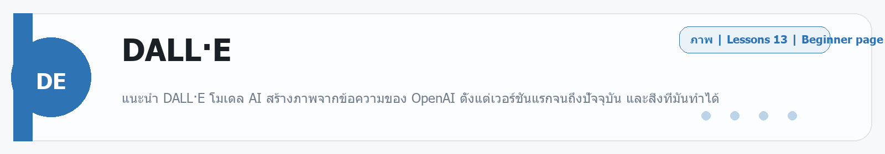

# Cursor
Source: https://ailab.learnnakdev.online/docs/cursor
Pages captured: 6

## Page 1 (หน้า 1 / 3)
```text
Cursor
คู่มืออย่างเป็นทางการ
6 เอกสาร
เริ่มต้น
Cursor คืออะไร — โปรแกรมเขียนโค้ดที่มี AI ในตัว

ภาพรวม Cursor โค้ดเอดิเตอร์สาย AI — Tab, Inline Edit (Cmd-K), Chat และ Agent ·  6 นาที

หน้า 1 / 3
Cursor — โค้ดเอดิเตอร์ที่มี AI ในตัว

เรียบเรียงเป็นภาษาไทยจากเอกสารทางการ cursor.com/docs

Cursor คือ โปรแกรมเขียนโค้ด (code editor) ที่ออกแบบมาให้ทำงานคู่กับ AI พัฒนาโดย Anysphere เป็นเอดิเตอร์ที่ต่อยอดจาก VS Code (หน้าตา/ส่วนขยายคุ้นเคย) แต่เพิ่มความสามารถ AI เข้าไปลึกถึงทุกขั้นตอนการเขียนโค้ด — ตั้งแต่เติมโค้ดอัตโนมัติ ไปจนถึงให้ AI เป็น "เอเจนต์" แก้โค้ดหลายไฟล์ให้เอง

📖 คำศัพท์ที่ควรรู้
คำศัพท์	ความหมายง่าย ๆ
Tab	การเติมโค้ดอัตโนมัติด้วย AI — กด Tab เพื่อรับสิ่งที่มันเดาว่าจะพิมพ์ต่อ
Inline Edit (Cmd/Ctrl-K)	ไฮไลต์โค้ดแล้วสั่งแก้เป็นภาษาคน เช่น "เปลี่ยนเป็น async"
Chat	แชตถาม-ตอบเกี่ยวกับโค้ดในแถบข้าง
Agent	ให้ AI ลงมือแก้/สร้างหลายไฟล์เอง รันคำสั่ง และตรวจงานให้
@-symbols	วิธีอ้างอิงบริบท เช่น @ไฟล์ @โค้ดเบส @web @docs
Rules	กฎ/แนวทางที่บอก AI ให้ทำตามสไตล์โปรเจกต์
MCP	มาตรฐานต่อ AI เข้ากับเครื่องมือ/ข้อมูลภายนอก
⭐ ความสามารถหลัก
Tab — เติมโค้ดอัจฉริยะ ทำนายหลายบรรทัด/หลายจุดพร้อมกัน
Inline Edit (Cmd-K) สั่งแก้โค้ดที่เลือกด้วยภาษาธรรมชาติ
Chat (Ask) ถามเรื่องโค้ด อธิบาย หา bug โดยอ้างอิงโค้ดเบสได้
Agent เอเจนต์ทำงานเอง: แก้หลายไฟล์ รันเทอร์มินัล ติดตั้งแพ็กเกจ แล้ววนแก้จนเสร็จ
เข้าใจทั้งโค้ดเบส ด้วยการทำดัชนี (index) + อ้างอิงด้วย @-symbols (@web, @docs, @ไฟล์)
เลือกโมเดลได้ — Claude, GPT, Gemini ฯลฯ
Rules & MCP ปรับให้เข้ากับโปรเจกต์และต่อเครื่องมือภายนอก
🚀 เริ่มต้นใช้งาน
ดาวน์โหลด Cursor จาก cursor.com (มี macOS / Windows / Linux)
เปิดโปรเจกต์ (เปิดโฟลเดอร์โค้ดของคุณ) — ย้ายจาก VS Code ได้ พร้อมส่วนขยาย/คีย์แมป
ลองใช้: พิมพ์โค้ดแล้วกด Tab, เลือกโค้ดแล้วกด Cmd/Ctrl-K เพื่อสั่งแก้, เปิดแถบ Chat/Agent เพื่อให้ AI ช่วยทั้งงาน
ตั้งค่า Rules ของโปรเจกต์เพื่อให้ AI เขียนตามสไตล์ทีม
📚 สารบัญเอกสาร Cursor (เรียงตาม official docs)
✅ ภาพรวม Cursor (หน้านี้)
⏳ Get Started — ติดตั้งและตั้งค่าเริ่มต้น
⏳ Tab — การเติมโค้ดด้วย AI
⏳ Inline Edit (Cmd-K)
⏳ Chat & Agent — แชตและเอเจนต์
⏳ Context — @-symbols, การทำดัชนีโค้ดเบส, Rules, Memories
⏳ Models — โมเดลที่เลือกได้
⏳ MCP & CLI
⏳ การตั้งค่า, แพ็กเกจ และบัญชี
🔗 อ้างอิง (เอกสารทางการ)
เอกสารหลัก: https://cursor.com/docs
ดาวน์โหลด: https://cursor.com/
 ก่อนหน้า
ถัดไป
Cursor: เริ่มต้นใช้งาน — ติดตั้งและตั้งค่าครั้งแรก
```

## Page 2 (หน้า 2 / 3)
```text
Cursor
คู่มืออย่างเป็นทางการ
6 เอกสาร
เริ่มต้น
Cursor: เริ่มต้นใช้งาน — ติดตั้งและตั้งค่าครั้งแรก

ดาวน์โหลด ติดตั้ง และย้ายค่าจาก VS Code มาใช้ Cursor ·  5 นาที

หน้า 2 / 3
เริ่มต้นใช้งาน Cursor 🚀

เรียบเรียงเป็นภาษาไทยจากเอกสารทางการ cursor.com/docs หมวด Getting Started

Cursor เป็นโปรแกรมแก้โค้ดที่มี AI ในตัว สร้างต่อยอดจาก VS Code ถ้าคุณเคยใช้ VS Code จะคุ้นมือทันที

🧭 ขั้นตอนติดตั้ง
ดาวน์โหลดจาก cursor.com (Windows / macOS / Linux)
ติดตั้งและเปิดโปรแกรม แล้วล็อกอิน/สมัครบัญชี
ตอนเปิดครั้งแรก เลือก import จาก VS Code เพื่อย้ายธีม คีย์ลัด และส่วนขยายมาได้เลย
🗂️ ฟีเจอร์ AI หลัก 3 อย่าง
ฟีเจอร์	ทำอะไร	ปุ่มลัด (ค่าเริ่มต้น)
Tab	เติมโค้ดอัตโนมัติขณะพิมพ์	Tab
Inline Edit	สั่งแก้โค้ดที่เลือกด้วยภาษาคน	Ctrl/Cmd + K
Chat / Agent	คุย/สั่งงานทั้งโปรเจกต์	Ctrl/Cmd + L
▶️ ลองใช้ครั้งแรก
เปิดโฟลเดอร์โปรเจกต์ (File → Open Folder)
รอ Cursor ทำ index โค้ดเบส (เพื่อให้ AI เข้าใจทั้งโปรเจกต์)
ลองพิมพ์โค้ด แล้วกด Tab รับคำแนะนำ
เลือกโค้ดสักท่อน กด Ctrl/Cmd + K แล้วพิมพ์ "แก้ให้เป็น async"
📚 ถัดไป
Tab — เติมโค้ดอัตโนมัติ
Agent & Chat — สั่งงานทั้งโปรเจกต์
🔗 อ้างอิง
เอกสารทางการ: https://cursor.com/docs
 ก่อนหน้า
Cursor คืออะไร — โปรแกรมเขียนโค้ดที่มี AI ในตัว
ถัดไป
Cursor: Tab — เติมโค้ดอัตโนมัติอัจฉริยะ
```

## Page 3 (หน้า 3 / 3)
```text
Cursor
คู่มืออย่างเป็นทางการ
6 เอกสาร
เริ่มต้น
Cursor: Tab — เติมโค้ดอัตโนมัติอัจฉริยะ

ระบบ Tab ของ Cursor ที่ทำนายและเติมโค้ดหลายบรรทัดให้ขณะพิมพ์ ·  4 นาที

หน้า 3 / 3
Tab — เติมโค้ดอัตโนมัติ ⌨️

เรียบเรียงเป็นภาษาไทยจากเอกสารทางการ cursor.com/docs หมวด Tab

Tab คือระบบเติมโค้ดอัตโนมัติของ Cursor ที่ฉลาดกว่าการ autocomplete ทั่วไป — ทำนายทั้งบรรทัดหรือหลายบรรทัดถัดไป ตามบริบทของไฟล์ที่คุณกำลังเขียน

⭐ จุดเด่น
เติมหลายบรรทัด ไม่ใช่แค่คำเดียว
เข้าใจบริบท — ดูโค้ดรอบ ๆ และไฟล์ที่เกี่ยวข้อง
คาดเดาการแก้ไขถัดไป — บางครั้งเสนอให้กระโดดไปแก้จุดต่อไปที่เกี่ยวข้อง (เช่น แก้ชื่อตัวแปรให้ครบทุกที่)
รับ/ปฏิเสธง่าย — กด Tab รับ, Esc หรือพิมพ์ต่อเพื่อข้าม
▶️ วิธีใช้
พิมพ์โค้ดตามปกติ
ข้อความสีจาง = คำแนะนำของ Tab
กด Tab เพื่อรับ
ถ้ามีคำแนะนำให้ "กระโดด" ไปจุดถัดไป กด Tab ต่อเพื่อตามไป
💡 เคล็ดลับ
เขียนคอมเมนต์สั้น ๆ บอกสิ่งที่อยากทำก่อน แล้ว Tab จะเดาโค้ดได้ตรงขึ้น
Tab เหมาะกับงาน "ระหว่างพิมพ์" ส่วนงานใหญ่ทั้งก้อนให้ใช้ Agent
🔗 อ้างอิง
เอกสารทางการ: https://cursor.com/docs
 ก่อนหน้า
Cursor: เริ่มต้นใช้งาน — ติดตั้งและตั้งค่าครั้งแรก
ถัดไป
Cursor: Agent & Chat — สั่งงาน AI ทั้งโปรเจกต์
```

## Page 4 (หน้า 1 / 2)
```text
Cursor
คู่มืออย่างเป็นทางการ
6 เอกสาร
ระดับกลาง
Cursor: Agent & Chat — สั่งงาน AI ทั้งโปรเจกต์

ใช้ Chat ถามโค้ด และ Agent ให้ลงมือแก้ไฟล์/รันคำสั่งให้ทั้งโปรเจกต์ ·  6 นาที

หน้า 1 / 2
Agent & Chat — คุยและสั่งงานทั้งโปรเจกต์ 🤖

เรียบเรียงเป็นภาษาไทยจากเอกสารทางการ cursor.com/docs หมวด Chat / Agent

แผง AI ของ Cursor (เปิดด้วย Ctrl/Cmd + L) ทำได้ทั้งถาม-ตอบ และลงมือแก้โค้ดให้

💬 Chat (Ask) vs 🛠️ Agent
โหมด	ทำอะไร
Ask / Chat	ถามเกี่ยวกับโค้ด อธิบาย หาบั๊ก โดยไม่แก้ไฟล์
Agent	ลงมือแก้ไฟล์ รันคำสั่ง ทำงานหลายขั้นตอนจนจบ
🧠 Agent ทำอะไรได้บ้าง
แก้หลายไฟล์ตามคำสั่งเดียว
ค้นหาไฟล์/โค้ดที่เกี่ยวข้องเอง
รันคำสั่งใน terminal (เช่น ติดตั้งแพ็กเกจ รันเทสต์)
เห็น error แล้วแก้ต่อให้
📎 ใส่บริบทด้วย @

พิมพ์ @ เพื่อชี้สิ่งที่ AI ควรดู:

@ไฟล์ — อ้างอิงไฟล์เฉพาะ
@โฟลเดอร์ — อ้างอิงทั้งโฟลเดอร์
@Web — ให้ค้นข้อมูลจากเว็บ
@Docs — อ้างอิงเอกสารไลบรารี
▶️ ตัวอย่างการใช้
กด Ctrl/Cmd + L เปิดแผง
เลือกโหมด Agent
พิมพ์ "เพิ่มหน้าโปรไฟล์ผู้ใช้ ดึงข้อมูลจาก @api/user.ts"
ตรวจการแก้ไขที่เสนอ แล้วกด Accept ทีละจุดหรือทั้งหมด
💡 เคล็ดลับ
ยิ่งบอกเป้าหมายชัด + ใส่ @ ชี้ไฟล์ที่เกี่ยว ยิ่งได้ผลตรงใจ
งานใหญ่ให้แบ่งเป็นขั้น ๆ จะคุมง่ายกว่า
🔗 อ้างอิง
เอกสารทางการ: https://cursor.com/docs
 ก่อนหน้า
Cursor: Tab — เติมโค้ดอัตโนมัติอัจฉริยะ
ถัดไป
Cursor: Context & Rules — ให้ AI เข้าใจโปรเจกต์ของคุณ
```

## Page 5 (หน้า 2 / 2)
```text
Cursor
คู่มืออย่างเป็นทางการ
6 เอกสาร
ระดับกลาง
Cursor: Context & Rules — ให้ AI เข้าใจโปรเจกต์ของคุณ

การ index โค้ดเบส การใช้ @-symbols และ Rules เพื่อให้ AI ทำตามแนวทางโปรเจกต์ ·  5 นาที

หน้า 2 / 2
Context & Rules — ป้อนบริบทให้ AI 🧩

เรียบเรียงเป็นภาษาไทยจากเอกสารทางการ cursor.com/docs หมวด Context / Rules

คำตอบ AI จะดีแค่ไหน ขึ้นกับ "บริบท" ที่มันเห็น Cursor มีหลายวิธีให้ป้อนบริบท

🗂️ Codebase Indexing

Cursor จะทำ index โค้ดทั้งโปรเจกต์ เพื่อให้ AI ค้นและอ้างอิงไฟล์ที่เกี่ยวข้องได้เอง — ทำให้ตอบเรื่องโปรเจกต์ได้แม่นขึ้นโดยไม่ต้องชี้ไฟล์ทุกครั้ง

📎 @-symbols (ชี้บริบทเอง)
สัญลักษณ์	อ้างถึง
@ไฟล์ / @โฟลเดอร์	โค้ดเฉพาะที่
@Code	โค้ดบางส่วน
@Web	ค้นข้อมูลจากอินเทอร์เน็ต
@Docs	เอกสารไลบรารีภายนอก
@Git	ประวัติ/ความเปลี่ยนแปลง
📜 Rules (กฎประจำโปรเจกต์)

Rules คือแนวทางที่คุณเขียนให้ AI ทำตามเสมอ เก็บไว้ในโปรเจกต์ (เช่นโฟลเดอร์ .cursor/rules) เช่น:

- ใช้ TypeScript เสมอ ห้ามใช้ any
- ตั้งชื่อ component แบบ PascalCase
- คอมเมนต์อธิบายเป็นภาษาไทย
- ใช้ Tailwind สำหรับสไตล์


ทุกครั้งที่ Agent/Chat ทำงาน มันจะอ้างอิงกฎเหล่านี้ ทำให้โค้ดที่ได้สอดคล้องกับสไตล์ทีม

💡 เคล็ดลับ
เขียน Rules สั้น ชัด เป็นข้อ ๆ
ใส่บริบทเฉพาะงานด้วย @ เสริมจาก index
ถ้า AI ตอบหลงทาง มักเพราะบริบทไม่พอ — ชี้ไฟล์ให้ชัดขึ้น
🔗 อ้างอิง
เอกสารทางการ: https://cursor.com/docs
 ก่อนหน้า
Cursor: Agent & Chat — สั่งงาน AI ทั้งโปรเจกต์
ถัดไป
Cursor: Models & MCP — เลือกโมเดลและต่อเครื่องมือภายนอก
```

## Page 6 (หน้า 1 / 1)
```text
Cursor
คู่มืออย่างเป็นทางการ
6 เอกสาร
ขั้นโปร
Cursor: Models & MCP — เลือกโมเดลและต่อเครื่องมือภายนอก

เลือกโมเดล AI ที่ใช้ใน Cursor และเชื่อมเครื่องมือภายนอกผ่าน MCP ·  5 นาที

หน้า 1 / 1
Models & MCP — เลือกสมองและต่อเครื่องมือ 🔌

เรียบเรียงเป็นภาษาไทยจากเอกสารทางการ cursor.com/docs หมวด Models / MCP

🧠 Models — เลือกโมเดลที่ใช้

Cursor ให้เลือกโมเดล AI หลายตัวจากหลายเจ้า (เช่น ตระกูล Claude, GPT, Gemini) ได้จากเมนูเลือกโมเดลในแผง Chat/Agent

โมเดลต่างกันที่ความเก่ง ความเร็ว และบริบทที่รับได้
งานคิดซับซ้อน/แก้หลายไฟล์ → เลือกโมเดลที่เก่งเหตุผล
งานเร็ว ๆ ทั่วไป → เลือกโมเดลที่ไวกว่า
โหมด Auto ให้ Cursor เลือกโมเดลที่เหมาะกับงานให้
🔗 MCP (Model Context Protocol)

MCP คือมาตรฐานกลางที่ให้ Agent ของ Cursor ต่อกับเครื่องมือ/บริการภายนอก เช่น ฐานข้อมูล, ระบบจัดการงาน, เอกสาร, หรือ API ภายในองค์กร

ใช้ทำอะไร
ให้ Agent ดึง/แก้ข้อมูลจริงจากระบบอื่น
ต่อกับบริการที่ทีมใช้ (เช่น issue tracker, ฐานข้อมูล)
ตั้งค่า (ภาพรวม)
เปิดการตั้งค่า MCP ใน Cursor
เพิ่ม MCP server (ระบุคำสั่งรันหรือ URL)
Agent จะเห็น "tools" ใหม่ และเรียกใช้เองเมื่อจำเป็น

⚠️ MCP server เข้าถึงข้อมูลจริงได้ — ติดตั้งเฉพาะตัวที่เชื่อถือได้

🔗 อ้างอิง
เอกสารทางการ: https://cursor.com/docs
เกี่ยวกับ MCP: https://modelcontextprotocol.io/
 ก่อนหน้า
Cursor: Context & Rules — ให้ AI เข้าใจโปรเจกต์ของคุณ
ถัดไป
```


---

## Beginner Guide

### Cursor

Source: daily-ai-lab-ai-tools-32page-beginner-guide.docx


**หมวด:** Chat / Agent / Coding / App
**บทเรียนใน /docs:** 6 หน้า

**ใช้ทำอะไร**
ภาพรวม Cursor โค้ดเอดิเตอร์สาย AI — Tab, Inline Edit (Cmd-K), Chat และ Agent

**พื้นฐานที่ควรรู้**
พื้นฐานที่ควรรู้คือ prompt, context, file, workspace, และการตรวจผลลัพธ์ก่อนนำไปใช้งานจริง. มือใหม่ควรเริ่มจากงานเล็กที่วัดผลได้ เช่น สรุปเอกสาร แก้โค้ดสั้น ๆ หรือทำต้นแบบหน้าเว็บหนึ่งหน้า

**เหมาะกับมือใหม่แบบไหน**
เหมาะกับคนที่ทำงานในโปรเจกต์จริงและต้องการให้ AI ช่วยแก้โค้ดในบริบทไฟล์ทั้ง repo.

**วิธีเริ่มแบบสั้น**
1. เปิด workspace หรือแชท แล้วให้โจทย์เดียวที่ชัดเจนพร้อมบริบทที่จำเป็น
2. แนบไฟล์ ตัวอย่าง หรือเป้าหมายที่อยากได้ เพื่อให้โมเดลอ่านภาพรวมได้เร็ว
3. ตรวจผลลัพธ์รอบแรก แล้วให้แก้แบบเฉพาะจุด เช่น tone, logic, code style หรือ structure

**ราคา/Plan**
Hobby free; Individual/Pro $20/month; Teams $40/user/month; Enterprise custom.

**สิ่งที่ควรจำ**
- จุดแข็ง: เหมาะกับคนที่ทำงานในโปรเจกต์จริงและต้องการให้ AI ช่วยแก้โค้ดในบริบทไฟล์ทั้ง repo.
- ข้อควรระวัง: ระวัง prompt ที่กว้างเกินไปและตรวจโค้ดหรือเอกสารทุกครั้งก่อนนำไปใช้จริง.

**ตัวอย่างเริ่มต้น**
ตัวอย่างงานเริ่มต้น: แก้ฟังก์ชันนี้ให้ปลอดภัยขึ้น พร้อมอธิบายว่าต้องแก้ไฟล์ไหนบ้าง

---

---

<!-- merged-beginner-guide:Cursor -->
## คู่มือพื้นฐานของ Cursor

**หมวด:** Chat / Agent / Coding / App
**บทเรียนใน /docs:** 6 หน้า

**ใช้ทำอะไร**
ภาพรวม Cursor โค้ดเอดิเตอร์สาย AI — Tab, Inline Edit (Cmd-K), Chat และ Agent

**พื้นฐานที่ควรรู้**
พื้นฐานที่ควรรู้คือ prompt, context, file, workspace, และการตรวจผลลัพธ์ก่อนนำไปใช้งานจริง. มือใหม่ควรเริ่มจากงานเล็กที่วัดผลได้ เช่น สรุปเอกสาร แก้โค้ดสั้น ๆ หรือทำต้นแบบหน้าเว็บหนึ่งหน้า

**เหมาะกับมือใหม่แบบไหน**
เหมาะกับคนที่ทำงานในโปรเจกต์จริงและต้องการให้ AI ช่วยแก้โค้ดในบริบทไฟล์ทั้ง repo.

**วิธีเริ่มแบบสั้น**
1. เปิด workspace หรือแชท แล้วให้โจทย์เดียวที่ชัดเจนพร้อมบริบทที่จำเป็น
2. แนบไฟล์ ตัวอย่าง หรือเป้าหมายที่อยากได้ เพื่อให้โมเดลอ่านภาพรวมได้เร็ว
3. ตรวจผลลัพธ์รอบแรก แล้วให้แก้แบบเฉพาะจุด เช่น tone, logic, code style หรือ structure

**ราคา/Plan**
Hobby free; Individual/Pro $20/month; Teams $40/user/month; Enterprise custom.

**สิ่งที่ควรจำ**
- จุดแข็ง: เหมาะกับคนที่ทำงานในโปรเจกต์จริงและต้องการให้ AI ช่วยแก้โค้ดในบริบทไฟล์ทั้ง repo.
- ข้อควรระวัง: ระวัง prompt ที่กว้างเกินไปและตรวจโค้ดหรือเอกสารทุกครั้งก่อนนำไปใช้จริง.

**ตัวอย่างเริ่มต้น**
ตัวอย่างงานเริ่มต้น: แก้ฟังก์ชันนี้ให้ปลอดภัยขึ้น พร้อมอธิบายว่าต้องแก้ไฟล์ไหนบ้าง

---


