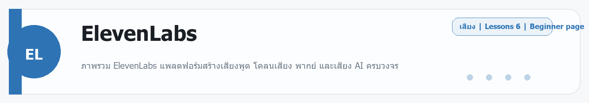
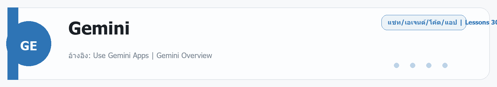

# ElevenLabs
Source: https://ailab.learnnakdev.online/docs/elevenlabs
Pages captured: 6

## Page 1 (หน้า 1 / 2)
```text
ElevenLabs
คู่มืออย่างเป็นทางการ
6 เอกสาร
เริ่มต้น
ElevenLabs คืออะไร — สร้างเสียงพูด AI เหมือนคนจริง

ภาพรวม ElevenLabs แพลตฟอร์มสร้างเสียงพูด โคลนเสียง พากย์ และเสียง AI ครบวงจร ·  6 นาที

หน้า 1 / 2
ElevenLabs — เสียงพูด AI ที่เหมือนคนจริงที่สุด 🎙️

เรียบเรียงเป็นภาษาไทยจากเอกสารทางการ elevenlabs.io/docs

ElevenLabs คือแพลตฟอร์ม AI ด้านเสียงที่ขึ้นชื่อเรื่อง เสียงพูดที่เป็นธรรมชาติเหมือนคนจริง — เปลี่ยนข้อความเป็นเสียงพูด (Text to Speech), โคลนเสียงของคุณเอง, พากย์วิดีโอเป็นภาษาอื่น, สร้างเอฟเฟกต์เสียง ไปจนถึงสร้างผู้ช่วยสนทนาด้วยเสียง รองรับหลายสิบภาษารวมถึงภาษาไทย

📖 คำศัพท์ที่ควรรู้
คำศัพท์	ความหมายง่าย ๆ
TTS (Text to Speech)	เปลี่ยนข้อความเป็นเสียงพูด
Voice cloning	สร้างเสียง AI ที่เลียนเสียงคนจริง
Voice Library	คลังเสียงสำเร็จรูปให้เลือกใช้
Dubbing	แปลง+พากย์เสียงวิดีโอเป็นภาษาอื่น
Credits	หน่วยการใช้งาน (คิดตามจำนวนตัวอักษร/วินาที)
Conversational AI	เอเจนต์ที่ฟัง-คิด-พูดโต้ตอบแบบเรียลไทม์
⭐ ความสามารถหลัก (ตามเมนู official docs)
Text to Speech — อ่านข้อความเป็นเสียงพูดหลายภาษา หลายอารมณ์
Voices & Voice Cloning — เลือกเสียงจากคลัง หรือโคลนเสียงเอง
Dubbing — พากย์วิดีโอข้ามภาษาโดยคงโทนเสียงเดิม
Sound Effects — สร้างเสียงประกอบจากคำบรรยาย
Speech to Text (Scribe) — ถอดเสียงเป็นข้อความ
Conversational AI (Agents) — สร้างผู้ช่วยเสียงโต้ตอบ
API — เรียกใช้ทุกฟีเจอร์ผ่านโค้ด
🚀 เริ่มต้นใช้งาน
สมัครบัญชีฟรีที่ elevenlabs.io
เข้าหน้า Text to Speech เลือกเสียงจาก Voice Library
พิมพ์/วางข้อความ แล้วกดสร้าง — ฟังและดาวน์โหลดไฟล์เสียงได้เลย
อยากได้เสียงเฉพาะตัว? ลอง Voice Cloning หรือเรียกผ่าน API
📚 สารบัญเอกสาร ElevenLabs (ตาม official docs)
✅ ภาพรวม (หน้านี้)
✅ Text to Speech — ข้อความเป็นเสียง
✅ Voices & Voice Cloning — เสียงและการโคลนเสียง
✅ Dubbing — พากย์วิดีโอข้ามภาษา
✅ Conversational AI — เอเจนต์เสียง
✅ API & เครดิต
🔗 อ้างอิง
เอกสารทางการ: https://elevenlabs.io/docs
เว็บหลัก: https://elevenlabs.io/
 ก่อนหน้า
ถัดไป
ElevenLabs: Text to Speech — เปลี่ยนข้อความเป็นเสียงพูด
```

## Page 2 (หน้า 2 / 2)
```text
ElevenLabs
คู่มืออย่างเป็นทางการ
6 เอกสาร
เริ่มต้น
ElevenLabs: Text to Speech — เปลี่ยนข้อความเป็นเสียงพูด

วิธีใช้ Text to Speech ของ ElevenLabs และปรับแต่งโทนเสียงให้เป็นธรรมชาติ ·  6 นาที

หน้า 2 / 2
Text to Speech — ข้อความกลายเป็นเสียงพูด 🔊

เรียบเรียงเป็นภาษาไทยจากเอกสารทางการ elevenlabs.io/docs หมวด Text to Speech

Text to Speech (TTS) คือฟีเจอร์หลักของ ElevenLabs — พิมพ์ข้อความแล้วได้เสียงพูดที่เป็นธรรมชาติ ใช้ทำ voice-over คลิป, หนังสือเสียง, ผู้ช่วยพูด, หรือสื่อการสอน

📖 ค่าที่ปรับได้
ค่า	ทำอะไร
Voice	เลือกเสียงที่จะพูด (จาก Voice Library หรือเสียงที่โคลนเอง)
Model	โมเดลเสียง เช่น Multilingual (หลายภาษา), Flash (เร็ว/หน่วงต่ำ)
Stability	ความนิ่ง/สม่ำเสมอของน้ำเสียง (ต่ำ=หลากหลาย สูง=นิ่ง)
Similarity	ความใกล้เคียงกับเสียงต้นฉบับ
Style	ความมีอารมณ์/สีสันของการพูด
Speed	ความเร็วในการพูด
🌏 ภาษาและโมเดล
โมเดล Multilingual รองรับหลายสิบภาษารวมถึง ภาษาไทย
โมเดล Flash เน้นความเร็ว/หน่วงต่ำ เหมาะกับงานเรียลไทม์
โมเดลจะเดาภาษาจากข้อความที่ใส่อัตโนมัติ
✍️ เคล็ดลับให้เสียงเป็นธรรมชาติ
ใส่ เครื่องหมายวรรคตอน ให้ถูก (จุด คอมมา) ช่วยจังหวะการพูด
อยากให้เว้นจังหวะ ใช้การขึ้นบรรทัด/จุดไข่ปลา
ปรับ Stability ต่ำลงถ้าอยากได้อารมณ์มากขึ้น, สูงขึ้นถ้าอยากได้น้ำเสียงนิ่งสำหรับงานทางการ
ทดลองหลายเสียง/ค่า แล้วเทียบผล
▶️ ขั้นตอน
เข้าหน้า Text to Speech
เลือก Voice และ Model
วางข้อความ (ไทย/อังกฤษ/ผสมได้)
ปรับ Stability/Style ตามต้องการ แล้วกดสร้าง
ฟัง → ดาวน์โหลด (MP3 ฯลฯ)
🔗 อ้างอิง
เอกสารทางการ: https://elevenlabs.io/docs
 ก่อนหน้า
ElevenLabs คืออะไร — สร้างเสียงพูด AI เหมือนคนจริง
ถัดไป
ElevenLabs: Voices & Voice Cloning — เสียงและการโคลนเสียง
```

## Page 3 (หน้า 1 / 2)
```text
ElevenLabs
คู่มืออย่างเป็นทางการ
6 เอกสาร
ระดับกลาง
ElevenLabs: Voices & Voice Cloning — เสียงและการโคลนเสียง

เลือกเสียงจาก Voice Library และโคลนเสียงแบบ Instant / Professional ·  6 นาที

หน้า 1 / 2
Voices & Voice Cloning — เลือกและโคลนเสียง 🎭

เรียบเรียงเป็นภาษาไทยจากเอกสารทางการ elevenlabs.io/docs หมวด Voices

ElevenLabs ให้คุณ เลือกเสียงสำเร็จรูป จากคลัง หรือ สร้างเสียงเฉพาะตัว ด้วยการโคลนเสียง

🗂️ ประเภทของเสียง
ประเภท	คืออะไร
Voice Library	คลังเสียงสำเร็จรูปนับพันให้เลือกใช้
Instant Voice Clone	โคลนเสียงเร็วจากตัวอย่างเสียงสั้น ๆ
Professional Voice Clone	โคลนคุณภาพสูงจากตัวอย่างเสียงยาว (เหมือนมาก)
Voice Design	สร้างเสียงใหม่จากคำบรรยายลักษณะเสียง
⚡ Instant vs Professional
Instant — ใช้ตัวอย่างเสียงไม่กี่นาที ได้ผลทันที เหมาะลองเล่น/งานทั่วไป
Professional — ต้องอัดเสียงตัวอย่างยาวกว่า (และใช้เวลาฝึกโมเดล) แต่ได้เสียงที่เหมือนต้นฉบับมากที่สุด เหมาะงานจริงจัง
⚠️ เรื่องสำคัญ: ความยินยอม

การโคลนเสียงต้องเป็น เสียงของคุณเอง หรือเสียงที่ได้รับ อนุญาตอย่างชัดเจน เท่านั้น — ElevenLabs มีระบบยืนยันและข้อกำหนดเพื่อป้องกันการนำเสียงคนอื่นไปใช้โดยไม่ได้รับอนุญาต

▶️ วิธีโคลนเสียง (Instant)
ไปที่ Voices → Add a new voice → Instant Voice Clone
อัปโหลด/อัดตัวอย่างเสียง (เสียงชัด ไม่มีเสียงรบกวน)
ยืนยันว่าคุณมีสิทธิ์ใช้เสียงนี้
ตั้งชื่อ แล้วนำไปใช้ในหน้า Text to Speech ได้เลย

💡 ตัวอย่างเสียงคุณภาพดี (เงียบ ไม่มี echo พูดชัด) = เสียงโคลนที่ดีกว่า

🔗 อ้างอิง
เอกสารทางการ: https://elevenlabs.io/docs
 ก่อนหน้า
ElevenLabs: Text to Speech — เปลี่ยนข้อความเป็นเสียงพูด
ถัดไป
ElevenLabs: Dubbing — พากย์วิดีโอข้ามภาษา
```

## Page 4 (หน้า 2 / 2)
```text
ElevenLabs
คู่มืออย่างเป็นทางการ
6 เอกสาร
ระดับกลาง
ElevenLabs: Dubbing — พากย์วิดีโอข้ามภาษา

แปลและพากย์เสียงวิดีโอเป็นภาษาอื่นโดยคงโทนเสียงเดิมด้วย ElevenLabs Dubbing ·  5 นาที

หน้า 2 / 2
Dubbing — พากย์วิดีโอเป็นภาษาอื่นอัตโนมัติ 🌐

เรียบเรียงเป็นภาษาไทยจากเอกสารทางการ elevenlabs.io/docs หมวด Dubbing

Dubbing ช่วยแปลงเสียงพูดในวิดีโอ/เสียงให้เป็น ภาษาอื่น โดยพยายามคงโทนและเอกลักษณ์เสียงเดิมไว้ เหมาะกับการทำคอนเทนต์ให้คนต่างภาษาเข้าถึง

⚙️ ทำงานอย่างไร (ภาพรวม)
ถอดเสียง ต้นฉบับเป็นข้อความ
แปล ข้อความเป็นภาษาเป้าหมาย
สร้างเสียงพูดใหม่ ในภาษานั้นด้วยโทนเสียงใกล้เคียงเดิม
จับจังหวะ ให้ตรงกับวิดีโอ
📖 ค่าที่ตั้งได้
ค่า	อธิบาย
Source language	ภาษาต้นฉบับ (ตั้ง auto-detect ได้)
Target language	ภาษาที่อยากพากย์ไป
Number of speakers	จำนวนผู้พูดในคลิป (ช่วยแยกเสียง)
💡 เคล็ดลับ
เสียงต้นฉบับชัด แยกเสียงพูดจากดนตรี/เสียงรบกวนได้ ผลจะดีกว่า
คลิปที่มีหลายคนพูด ให้ระบุจำนวนผู้พูดให้ถูก
มี Dubbing Studio สำหรับแก้บทแปล/จังหวะแบบละเอียดก่อนส่งออก
▶️ ขั้นตอน
เข้าเมนู Dubbing แล้วอัปโหลดไฟล์วิดีโอ/เสียง (หรือวางลิงก์)
เลือกภาษาต้นทาง–ปลายทาง และจำนวนผู้พูด
กดสร้าง แล้วรอประมวลผล
ตรวจ/แก้ใน Dubbing Studio (ถ้าต้องการ) แล้วดาวน์โหลด
🔗 อ้างอิง
เอกสารทางการ: https://elevenlabs.io/docs
 ก่อนหน้า
ElevenLabs: Voices & Voice Cloning — เสียงและการโคลนเสียง
ถัดไป
ElevenLabs: Conversational AI — สร้างเอเจนต์เสียงโต้ตอบ
```

## Page 5 (หน้า 1 / 2)
```text
ElevenLabs
คู่มืออย่างเป็นทางการ
6 เอกสาร
ขั้นโปร
ElevenLabs: Conversational AI — สร้างเอเจนต์เสียงโต้ตอบ

สร้างผู้ช่วย AI ที่ฟัง คิด และพูดโต้ตอบแบบเรียลไทม์ด้วย ElevenLabs Agents ·  6 นาที

หน้า 1 / 2
Conversational AI — ผู้ช่วยเสียงที่คุยโต้ตอบได้ 🗣️

เรียบเรียงเป็นภาษาไทยจากเอกสารทางการ elevenlabs.io/docs หมวด Conversational AI / Agents

Conversational AI ให้คุณสร้าง เอเจนต์เสียง ที่พูดคุยโต้ตอบกับผู้ใช้แบบเรียลไทม์ เช่น บอทรับสาย, ผู้ช่วยตอบคำถามด้วยเสียง, หรือตัวละครพูดได้ในแอป

🧩 องค์ประกอบของเอเจนต์
ส่วน	หน้าที่
Speech to Text	ฟังและถอดเสียงผู้ใช้เป็นข้อความ
LLM	สมองที่เข้าใจและคิดคำตอบ
Text to Speech	เปลี่ยนคำตอบเป็นเสียงพูด
Turn-taking	จัดจังหวะการพูด-ฟังให้เป็นธรรมชาติ (ไม่พูดทับ)
Knowledge base	เอกสาร/ข้อมูลที่ให้เอเจนต์อ้างอิงตอบ
⭐ ปรับแต่งได้
บุคลิก/บทบาท ของเอเจนต์ (system prompt)
เสียง ที่ใช้พูด (เลือก/โคลน)
ฐานความรู้ — อัปโหลดเอกสารให้ตอบตามข้อมูลจริง
เครื่องมือ (tools) — ให้เอเจนต์เรียก API/ทำงานต่อได้
ภาษา — รองรับหลายภาษา
▶️ เริ่มสร้าง (ภาพรวม)
เข้าเมนู Conversational AI → Create agent
ตั้งบทบาท/คำแนะนำ (เช่น "เป็นพนักงานต้อนรับร้านกาแฟ พูดสุภาพ")
เลือกเสียงและภาษา
เพิ่ม Knowledge base ถ้าต้องการให้ตอบตามข้อมูลเฉพาะ
ทดสอบคุยในเว็บ แล้วฝังลงเว็บ/แอป หรือเรียกผ่าน API/SDK
🔗 อ้างอิง
เอกสารทางการ: https://elevenlabs.io/docs
 ก่อนหน้า
ElevenLabs: Dubbing — พากย์วิดีโอข้ามภาษา
ถัดไป
ElevenLabs: API & เครดิต — เรียกใช้ผ่านโค้ด
```

## Page 6 (หน้า 2 / 2)
```text
ElevenLabs
คู่มืออย่างเป็นทางการ
6 เอกสาร
ขั้นโปร
ElevenLabs: API & เครดิต — เรียกใช้ผ่านโค้ด

ภาพรวมการเรียกใช้ ElevenLabs ผ่าน API และวิธีคิดเครดิต ·  5 นาที

หน้า 2 / 2
API & เครดิต — เรียก ElevenLabs จากโค้ด 🧑‍💻

เรียบเรียงเป็นภาษาไทยจากเอกสารทางการ elevenlabs.io/docs/api-reference

ทุกฟีเจอร์ของ ElevenLabs เรียกผ่าน API ได้ เพื่อนำไปฝังในแอป/บริการของคุณ มี SDK ทั้ง Python และ JavaScript

🔑 สิ่งที่ต้องเตรียม
สิ่งที่ต้องมี	อธิบาย
API key	สร้างในหน้าโปรไฟล์ (เก็บเป็นความลับ)
Voice ID	ระบุว่าจะใช้เสียงไหน
Model ID	เลือกโมเดล เช่น multilingual / flash
🧱 ตัวอย่าง Text to Speech (Python)
from elevenlabs import ElevenLabs
client = ElevenLabs(api_key="YOUR_KEY")
audio = client.text_to_speech.convert(
    voice_id="VOICE_ID",
    model_id="eleven_multilingual_v2",
    text="สวัสดีครับ ยินดีต้อนรับ",
)
# นำ audio (bytes) ไปบันทึกเป็นไฟล์ .mp3

💳 เครดิตคิดยังไง
TTS คิดตาม จำนวนตัวอักษร ที่แปลงเป็นเสียง
Dubbing / STT คิดตาม ความยาวเวลา ของสื่อ
แต่ละแพ็กเกจมีโควตาเครดิตต่อเดือนต่างกัน (มีแพ็กเกจฟรีให้เริ่ม)
💡 เคล็ดลับ
ใช้โมเดล Flash เมื่อต้องการความเร็ว/หน่วงต่ำ (เช่น เรียลไทม์)
ใช้ streaming เพื่อเริ่มเล่นเสียงได้ก่อนสร้างเสร็จทั้งก้อน
อย่าฝัง API key ไว้ในฝั่งหน้าเว็บ (client) — เรียกผ่านเซิร์ฟเวอร์ของคุณ
🔗 อ้างอิง
API Reference: https://elevenlabs.io/docs/api-reference
เอกสารทางการ: https://elevenlabs.io/docs
 ก่อนหน้า
ElevenLabs: Conversational AI — สร้างเอเจนต์เสียงโต้ตอบ
ถัดไป
```


---

## Beginner Guide

### ElevenLabs

Source: daily-ai-lab-ai-tools-32page-beginner-guide.docx



**หมวด:** Audio
**บทเรียนใน /docs:** 6 หน้า

**ใช้ทำอะไร**
ภาพรวม ElevenLabs แพลตฟอร์มสร้างเสียงพูด โคลนเสียง พากย์ และเสียง AI ครบวงจร

**พื้นฐานที่ควรรู้**
พื้นฐานที่ควรรู้คือ script, tone, voice style, pronunciation, pacing, และการฟังทดสอบก่อนปล่อยจริง. ถ้าเป็นเพลงหรือพากย์ ควรแยกเป้าหมายให้ชัดว่าต้องการเสียงธรรมชาติ พากย์โฆษณา หรือเพลงเต็ม

**เหมาะกับมือใหม่แบบไหน**
เหมาะกับงานพากย์ บทพูดสั้น และเสียงที่ต้องคุมโทนให้ใกล้มนุษย์.

**วิธีเริ่มแบบสั้น**
1. เขียนสคริปต์หรือเนื้อร้องให้พร้อมก่อนเริ่มสร้างเสียง
2. เลือก voice, tone, speed, และภาษาที่ต้องการใช้จริง
3. ฟังคำอ่านและจังหวะอีกครั้งก่อน export เพื่อหลีกเลี่ยงการแก้รอบหลัง

**ราคา/Plan**
Free starter; Creator/Pro paid tiers; business and scale plans available.

**สิ่งที่ควรจำ**
- จุดแข็ง: เหมาะกับงานพากย์ บทพูดสั้น และเสียงที่ต้องคุมโทนให้ใกล้มนุษย์.
- ข้อควรระวัง: เสียงพังได้จากการออกเสียง คำย่อ และจังหวะ จึงควรทดสอบสั้น ๆ ก่อนทำไฟล์ยาว.

**ตัวอย่างเริ่มต้น**
ลองเริ่มด้วย: อ่านสคริปต์นี้ด้วยน้ำเสียงเป็นมิตร ชัดเจน และไม่รีบเกินไป

---

---

<!-- merged-beginner-guide:ElevenLabs -->
## คู่มือพื้นฐานของ ElevenLabs

**หมวด:** Audio
**บทเรียนใน /docs:** 6 หน้า

**ใช้ทำอะไร**
ภาพรวม ElevenLabs แพลตฟอร์มสร้างเสียงพูด โคลนเสียง พากย์ และเสียง AI ครบวงจร

**พื้นฐานที่ควรรู้**
พื้นฐานที่ควรรู้คือ script, tone, voice style, pronunciation, pacing, และการฟังทดสอบก่อนปล่อยจริง. ถ้าเป็นเพลงหรือพากย์ ควรแยกเป้าหมายให้ชัดว่าต้องการเสียงธรรมชาติ พากย์โฆษณา หรือเพลงเต็ม

**เหมาะกับมือใหม่แบบไหน**
เหมาะกับงานพากย์ บทพูดสั้น และเสียงที่ต้องคุมโทนให้ใกล้มนุษย์.

**วิธีเริ่มแบบสั้น**
1. เขียนสคริปต์หรือเนื้อร้องให้พร้อมก่อนเริ่มสร้างเสียง
2. เลือก voice, tone, speed, และภาษาที่ต้องการใช้จริง
3. ฟังคำอ่านและจังหวะอีกครั้งก่อน export เพื่อหลีกเลี่ยงการแก้รอบหลัง

**ราคา/Plan**
Free starter; Creator/Pro paid tiers; business and scale plans available.

**สิ่งที่ควรจำ**
- จุดแข็ง: เหมาะกับงานพากย์ บทพูดสั้น และเสียงที่ต้องคุมโทนให้ใกล้มนุษย์.
- ข้อควรระวัง: เสียงพังได้จากการออกเสียง คำย่อ และจังหวะ จึงควรทดสอบสั้น ๆ ก่อนทำไฟล์ยาว.

**ตัวอย่างเริ่มต้น**
ลองเริ่มด้วย: อ่านสคริปต์นี้ด้วยน้ำเสียงเป็นมิตร ชัดเจน และไม่รีบเกินไป

---


