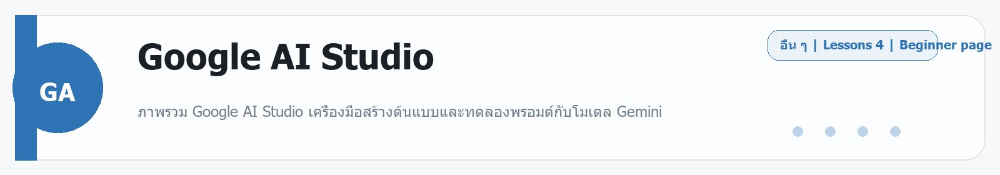
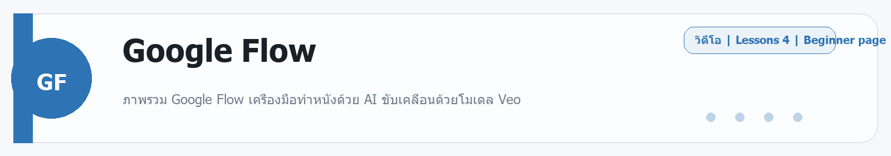

# Google AI Studio
Source: https://ailab.learnnakdev.online/docs/google-ai-studio
Pages captured: 4

## Page 1 (หน้า 1 / 2)
```text
Google AI Studio
คู่มืออย่างเป็นทางการ
4 เอกสาร
เริ่มต้น
Google AI Studio คืออะไร — สนามทดลอง Gemini ฟรี

ภาพรวม Google AI Studio เครื่องมือสร้างต้นแบบและทดลองพรอมต์กับโมเดล Gemini ·  6 นาที

หน้า 1 / 2
Google AI Studio — ทดลอง Gemini ได้ฟรีในเบราว์เซอร์ ✨

เรียบเรียงเป็นภาษาไทยจากเอกสารทางการ ai.google.dev และ aistudio.google.com

Google AI Studio คือเว็บแอปฟรีสำหรับ ทดลองและสร้างต้นแบบกับโมเดล Gemini ของ Google — พิมพ์พรอมต์ ปรับค่าต่าง ๆ เห็นผลทันที แล้วกดเอาโค้ดไปใช้ต่อในแอปจริงได้เลย เหมาะมากสำหรับคนเริ่มต้นที่อยากลองเล่น AI ก่อนเขียนโค้ดจริง

📖 คำศัพท์ที่ควรรู้
คำศัพท์	ความหมายง่าย ๆ
Gemini	โมเดล AI หลักของ Google (ข้อความ รูป เสียง วิดีโอ)
Prompt	คำสั่ง/ข้อความที่เราพิมพ์ให้โมเดลทำงาน
API key	กุญแจสำหรับเรียก Gemini จากโค้ดของเราเอง
Temperature	ค่าความสร้างสรรค์ของคำตอบ (ต่ำ=เป๊ะ สูง=หลากหลาย)
System instructions	คำสั่งกำหนดบทบาท/พฤติกรรมของโมเดล
⭐ จุดเด่น
ฟรีและเริ่มได้ทันที — แค่ล็อกอินด้วยบัญชี Google
ลองพรอมต์แบบเห็นผลสด — ปรับค่าแล้วเทียบผลได้ง่าย
รับ API key ได้ในคลิกเดียว — เอาไปต่อกับโค้ด/แอปจริง
รองรับมัลติโมดัล — ใส่รูป/ไฟล์/เสียงเข้าไปในพรอมต์ได้
มี Starter apps — ตัวอย่างแอปสำเร็จรูปให้ดัดแปลงต่อ
🚀 เริ่มต้นใช้งาน
เข้า aistudio.google.com แล้วล็อกอินด้วย Google
เลือกโมเดล Gemini แล้วลองพิมพ์พรอมต์ในหน้า Chat
ปรับ System instructions และค่า temperature ให้ได้ผลที่ต้องการ
กด Get API key เพื่อนำไปเรียกผ่านโค้ด:
from google import genai
client = genai.Client(api_key="YOUR_KEY")
r = client.models.generate_content(model="gemini-2.5-flash", contents="สวัสดี")
print(r.text)

📚 สารบัญเอกสาร (ตาม official docs)
✅ ภาพรวม (หน้านี้)
⏳ การออกแบบพรอมต์ (Prompt design)
⏳ รับ API key และเรียกใช้ผ่านโค้ด
⏳ มัลติโมดัล — รูป/เสียง/วิดีโอ
⏳ Starter apps และตัวอย่าง
🔗 อ้างอิง
เว็บแอป: https://aistudio.google.com/
เอกสารนักพัฒนา (Gemini API): https://ai.google.dev/
 ก่อนหน้า
ถัดไป
Google AI Studio: การออกแบบพรอมต์
```

## Page 2 (หน้า 2 / 2)
```text
Google AI Studio
คู่มืออย่างเป็นทางการ
4 เอกสาร
เริ่มต้น
Google AI Studio: การออกแบบพรอมต์

ใช้หน้า Prompt ของ AI Studio ทดลองพรอมต์ ตั้ง System instructions และปรับค่า ·  5 นาที

หน้า 2 / 2
การออกแบบพรอมต์ใน AI Studio ✍️

เรียบเรียงเป็นภาษาไทยจากเอกสารทางการ ai.google.dev

AI Studio คือสนามทดลองพรอมต์กับ Gemini — ปรับแล้วเห็นผลทันที

🎛️ ค่าที่ปรับได้
ค่า	ทำอะไร
System instructions	กำหนดบทบาท/พฤติกรรมของโมเดล
Temperature	ความสร้างสรรค์ (ต่ำ=เป๊ะ สูง=หลากหลาย)
Output length	จำกัดความยาวคำตอบ
Top P / Top K	คุมความหลากหลายของการเลือกคำ
Safety settings	ระดับการกรองเนื้อหา
🧱 System Instructions

ตั้งบทบาทให้โมเดล เช่น:

คุณเป็นติวเตอร์ภาษาไทยที่อธิบายเรื่องยากให้เข้าใจง่าย
ตอบเป็นภาษาไทย ใช้ตัวอย่างใกล้ตัว


ช่วยให้คำตอบสม่ำเสมอตามที่ต้องการ

💡 เคล็ดลับเขียนพรอมต์
เจาะจง — บอกบริบท เป้าหมาย และรูปแบบผลที่อยากได้
ยกตัวอย่าง (few-shot) — ใส่ตัวอย่าง input/output ให้โมเดลเลียนแบบ
แบ่งขั้นตอน — งานซับซ้อนให้บอกเป็นสเต็ป
ทดลองปรับ temperature — งานสร้างสรรค์สูงขึ้น, งานข้อเท็จจริงต่ำลง
▶️ ขั้นตอน
เปิดหน้า Chat/Prompt ใน aistudio.google.com
ตั้ง System instructions
พิมพ์พรอมต์ ปรับค่า แล้วดูผล
พอใจแล้วกด Get code / API key เพื่อนำไปใช้จริง
🔗 อ้างอิง
กลยุทธ์การเขียนพรอมต์: https://ai.google.dev/gemini-api/docs/prompting-strategies
 ก่อนหน้า
Google AI Studio คืออะไร — สนามทดลอง Gemini ฟรี
ถัดไป
Google AI Studio: รับ API key และเรียกผ่านโค้ด
```

## Page 3 (หน้า 1 / 2)
```text
Google AI Studio
คู่มืออย่างเป็นทางการ
4 เอกสาร
ระดับกลาง
Google AI Studio: รับ API key และเรียกผ่านโค้ด

สร้าง API key จาก AI Studio แล้วเรียกใช้ Gemini ผ่าน Python/JavaScript ·  5 นาที

หน้า 1 / 2
รับ API key และเรียก Gemini จากโค้ด 🔑

เรียบเรียงเป็นภาษาไทยจากเอกสารทางการ ai.google.dev

เมื่อทดลองพรอมต์ใน AI Studio จนพอใจ ก็เอาไปใช้จริงในแอปด้วย Gemini API

🔑 รับ API key
ใน aistudio.google.com กด Get API key
สร้างคีย์ใหม่ แล้วเก็บไว้เป็นความลับ (อย่าใส่ในโค้ดฝั่ง client)
🐍 ตัวอย่าง Python
from google import genai
client = genai.Client(api_key="YOUR_KEY")
r = client.models.generate_content(
    model="gemini-2.5-flash",
    contents="อธิบาย AI ใน 2 ประโยค",
)
print(r.text)

🟨 ตัวอย่าง JavaScript
import { GoogleGenAI } from "@google/genai";
const ai = new GoogleGenAI({ apiKey: "YOUR_KEY" });
const r = await ai.models.generateContent({
  model: "gemini-2.5-flash",
  contents: "สวัสดี",
});
console.log(r.text);

🆓 ขีดจำกัดฟรี

Gemini API มี free tier ให้ลองใช้ (มีลิมิตต่อนาที/ต่อวัน) เหมาะกับเรียนรู้และต้นแบบ — งานจริงปริมาณมากค่อยอัปเกรด

💡 เคล็ดลับ
ใช้รุ่น Flash สำหรับงานเร็ว/ถูก, รุ่น Pro สำหรับงานคิดหนัก
เก็บ key ไว้ใน environment variable ไม่ commit ลง git
🔗 อ้างอิง
เอกสาร Gemini API: https://ai.google.dev/gemini-api/docs
 ก่อนหน้า
Google AI Studio: การออกแบบพรอมต์
ถัดไป
Google AI Studio: มัลติโมดัล — รูป เสียง วิดีโอ
```

## Page 4 (หน้า 2 / 2)
```text
Google AI Studio
คู่มืออย่างเป็นทางการ
4 เอกสาร
ระดับกลาง
Google AI Studio: มัลติโมดัล — รูป เสียง วิดีโอ

ใส่รูป ไฟล์ เสียง หรือวิดีโอเข้าไปในพรอมต์ Gemini ผ่าน AI Studio ·  4 นาที

หน้า 2 / 2
มัลติโมดัล — ไม่ใช่แค่ข้อความ 🖼️🎙️

เรียบเรียงเป็นภาษาไทยจากเอกสารทางการ ai.google.dev

จุดเด่นของ Gemini คือเป็นโมเดล มัลติโมดัล — เข้าใจได้ทั้งข้อความ รูป เสียง และวิดีโอในพรอมต์เดียว

📥 ใส่อะไรเข้าไปได้บ้าง
ชนิด	ตัวอย่างการใช้
รูปภาพ	"อธิบายภาพนี้" / "อ่านข้อความในภาพ"
PDF / เอกสาร	"สรุปเอกสารนี้"
เสียง	"ถอดเสียงนี้เป็นข้อความ"
วิดีโอ	"สรุปสิ่งที่เกิดในคลิป"
▶️ ใน AI Studio
ในหน้า Prompt กดปุ่ม + / แนบไฟล์
อัปโหลดรูป/ไฟล์/เสียง/วิดีโอ
พิมพ์คำถามเกี่ยวกับสิ่งที่แนบ
ดูผล แล้วเอาโค้ดไปใช้ต่อได้
🧑‍💻 ในโค้ด (แนวคิด)

ส่งไฟล์เข้าไปใน contents ร่วมกับข้อความ — SDK มีตัวช่วยอัปโหลดไฟล์และอ้างอิงในพรอมต์

💡 เคล็ดลับ
ภาพ/วิดีโอความละเอียดพอเหมาะ ช่วยให้โมเดลเข้าใจดีขึ้น
ระบุให้ชัดว่าต้องการให้ "ทำอะไร" กับไฟล์นั้น
🔗 อ้างอิง
เอกสาร Vision/มัลติโมดัล: https://ai.google.dev/gemini-api/docs/vision
 ก่อนหน้า
Google AI Studio: รับ API key และเรียกผ่านโค้ด
ถัดไป
```


---

## Beginner Guide

### Google AI Studio

Source: daily-ai-lab-ai-tools-32page-beginner-guide.docx



**หมวด:** Other
**บทเรียนใน /docs:** 4 หน้า

**ใช้ทำอะไร**
ภาพรวม Google AI Studio เครื่องมือสร้างต้นแบบและทดลองพรอมต์กับโมเดล Gemini

**พื้นฐานที่ควรรู้**
พื้นฐานที่ควรรู้จะแตกต่างกันไปตามเครื่องมือ แต่หลักคิดเดียวกันคือเริ่มจากโจทย์เล็ก ตรวจผลลัพธ์ และค่อยขยาย. เครื่องมือกลุ่มนี้มักเด่นเรื่องการเชื่อม workflow, ทดลองโมเดล, หรือเร่งการสร้างต้นแบบ

**เหมาะกับมือใหม่แบบไหน**
เครื่องมือนี้เหมาะกับผู้เริ่มต้นที่อยากฝึกงาน Other แบบสั้นและดูผลลัพธ์ได้เร็ว

**วิธีเริ่มแบบสั้น**
1. อ่านหน้าคู่มือหรือหน้า product ก่อน เพื่อเข้าใจขอบเขตของเครื่องมือ
2. เริ่มจาก demo หรือ example ที่เล็กที่สุดเพื่อดู behavior จริง
3. ขยายไปงานจริงเมื่อแน่ใจว่า workflow, credits, หรือ permissions พร้อม

**ราคา/Plan**
Free in supported regions; API billing applies when you use a paid Gemini API key/project.

**สิ่งที่ควรจำ**
- จุดแข็ง: เครื่องมือนี้เหมาะกับผู้เริ่มต้นที่อยากฝึกงาน Other แบบสั้นและดูผลลัพธ์ได้เร็ว
- ข้อควรระวัง: เครื่องมือกลุ่มนี้มักเปลี่ยนเร็ว ให้เช็กสถานะโปรดักต์และเพดานใช้งานล่าสุดก่อนนำไปพึ่งงานสำคัญ.

**ตัวอย่างเริ่มต้น**
ลองเริ่มด้วย: ช่วยอธิบายวิธีใช้ Google AI Studio แบบทีละขั้น และบอกข้อจำกัดสำคัญที่มือใหม่ควรรู้ก่อนเริ่ม

---

---

<!-- merged-beginner-guide:Google AI Studio -->
## คู่มือพื้นฐานของ Google AI Studio

**หมวด:** Other
**บทเรียนใน /docs:** 4 หน้า

**ใช้ทำอะไร**
ภาพรวม Google AI Studio เครื่องมือสร้างต้นแบบและทดลองพรอมต์กับโมเดล Gemini

**พื้นฐานที่ควรรู้**
พื้นฐานที่ควรรู้จะแตกต่างกันไปตามเครื่องมือ แต่หลักคิดเดียวกันคือเริ่มจากโจทย์เล็ก ตรวจผลลัพธ์ และค่อยขยาย. เครื่องมือกลุ่มนี้มักเด่นเรื่องการเชื่อม workflow, ทดลองโมเดล, หรือเร่งการสร้างต้นแบบ

**เหมาะกับมือใหม่แบบไหน**
เครื่องมือนี้เหมาะกับผู้เริ่มต้นที่อยากฝึกงาน Other แบบสั้นและดูผลลัพธ์ได้เร็ว

**วิธีเริ่มแบบสั้น**
1. อ่านหน้าคู่มือหรือหน้า product ก่อน เพื่อเข้าใจขอบเขตของเครื่องมือ
2. เริ่มจาก demo หรือ example ที่เล็กที่สุดเพื่อดู behavior จริง
3. ขยายไปงานจริงเมื่อแน่ใจว่า workflow, credits, หรือ permissions พร้อม

**ราคา/Plan**
Free in supported regions; API billing applies when you use a paid Gemini API key/project.

**สิ่งที่ควรจำ**
- จุดแข็ง: เครื่องมือนี้เหมาะกับผู้เริ่มต้นที่อยากฝึกงาน Other แบบสั้นและดูผลลัพธ์ได้เร็ว
- ข้อควรระวัง: เครื่องมือกลุ่มนี้มักเปลี่ยนเร็ว ให้เช็กสถานะโปรดักต์และเพดานใช้งานล่าสุดก่อนนำไปพึ่งงานสำคัญ.

**ตัวอย่างเริ่มต้น**
ลองเริ่มด้วย: ช่วยอธิบายวิธีใช้ Google AI Studio แบบทีละขั้น และบอกข้อจำกัดสำคัญที่มือใหม่ควรรู้ก่อนเริ่ม

---


