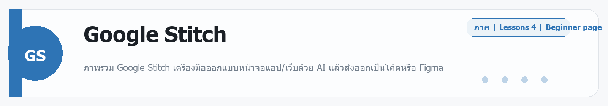

# Google Jules
Source: https://ailab.learnnakdev.online/docs/google-jules
Pages captured: 4

## Page 1 (หน้า 1 / 1)
```text
Google Jules
คู่มืออย่างเป็นทางการ
4 เอกสาร
เริ่มต้น
Google Jules: เริ่มต้นใช้งานและเชื่อม GitHub

เริ่มใช้ Jules เชื่อม repository บน GitHub และมอบหมายงานแรก ·  5 นาที

หน้า 1 / 1
เริ่มต้นใช้งาน Jules 🤖

เรียบเรียงเป็นภาษาไทยจากเอกสารทางการ jules.google

🔗 ขั้นตอนเริ่มต้น
เข้า jules.google แล้วล็อกอินด้วยบัญชี Google
เชื่อมต่อ GitHub — อนุญาตให้ Jules เข้าถึง repository ที่ต้องการ
เลือก repo และ branch ที่จะให้ทำงาน
มอบหมายงานแรกเป็นภาษาคน
🐙 การเชื่อม GitHub

Jules ทำงานผ่าน GitHub เป็นหลัก:

เลือกได้ว่าจะให้เข้าถึง repo ไหนบ้าง (เลือกเฉพาะที่ต้องการได้)
Jules จะ clone โค้ดไปทำงานในเครื่องเสมือนของมันเอง
ผลงานออกมาเป็น Pull Request ให้คุณรีวิว
✍️ มอบหมายงานแรก

เขียนงานให้ชัดเจน เช่น:

"แก้บั๊กที่ปุ่ม submit ในหน้า contact ไม่ทำงาน และเพิ่มการตรวจสอบอีเมล"

Jules จะ:

วางแผน ขั้นตอนการแก้
ขอให้คุณยืนยันแผน (ถ้าตั้งไว้)
ลงมือแก้ + รันเทสต์
เปิด PR
💡 เคล็ดลับ
งานที่ขอบเขตชัดเจน Jules ทำได้ดีกว่างานกว้าง ๆ
ใส่บริบท (ไฟล์ที่เกี่ยว, เกณฑ์ความสำเร็จ) ช่วยให้ผลตรงขึ้น
🔗 อ้างอิง
เอกสารทางการ: https://jules.google/docs
 ก่อนหน้า
ถัดไป
Google Jules คืออะไร — เอเจนต์เขียนโค้ดที่ทำงานให้เบื้องหลัง
```

## Page 2 (หน้า 1 / 2)
```text
Google Jules
คู่มืออย่างเป็นทางการ
4 เอกสาร
ระดับกลาง
Google Jules คืออะไร — เอเจนต์เขียนโค้ดที่ทำงานให้เบื้องหลัง

ภาพรวม Google Jules เอเจนต์เขียนโค้ดอัตโนมัติที่ทำงานแบบ async ผ่าน GitHub ·  6 นาที

หน้า 1 / 2
Google Jules — เอเจนต์เขียนโค้ดที่ทำงานให้เบื้องหลัง 🤖

เรียบเรียงเป็นภาษาไทยจากเอกสารทางการ jules.google

Google Jules คือเอเจนต์เขียนโค้ดอัตโนมัติของ Google ที่ทำงานแบบ asynchronous — คุณมอบหมายงาน (เช่น แก้บั๊ก เพิ่มฟีเจอร์) แล้ว Jules จะไปทำงานในเครื่องเสมือนบนคลาวด์ของมันเอง เขียนโค้ด รันเทสต์ แล้วเปิด Pull Request บน GitHub มาให้คุณรีวิว เหมือนมีเพื่อนร่วมทีมที่รับงานไปทำให้เงียบ ๆ ขับเคลื่อนด้วย Gemini

📖 คำศัพท์ที่ควรรู้
คำศัพท์	ความหมายง่าย ๆ
Asynchronous	สั่งงานแล้วปล่อยให้ทำเอง ไม่ต้องนั่งเฝ้า
Task	งานที่เรามอบหมายให้ Jules ทำ
Pull Request (PR)	ชุดการแก้โค้ดที่ Jules เสนอมาให้รีวิว/รวมเข้าโปรเจกต์
VM / Environment	เครื่องเสมือนบนคลาวด์ที่ Jules ใช้รันโค้ด
Plan	แผนงานที่ Jules วางก่อนลงมือ ให้เราอนุมัติได้
⭐ จุดเด่น
ทำงานเบื้องหลังแบบ async — มอบหมายแล้วไปทำอย่างอื่นต่อได้
ต่อกับ GitHub โดยตรง — ผลงานออกมาเป็น PR พร้อมรีวิว
วางแผนก่อนทำ — เห็นแผนแล้วค่อยอนุมัติ
รันในคลาวด์ — ไม่กินทรัพยากรเครื่องคุณ
ใช้พลัง Gemini สำหรับเข้าใจและแก้โค้ด
🚀 เริ่มต้นใช้งาน
เข้า jules.google แล้วล็อกอินด้วยบัญชี Google
เชื่อมต่อ repository ของคุณบน GitHub
มอบหมายงาน เช่น "แก้บั๊กหน้า login ที่กดปุ่มแล้วไม่ตอบสนอง"
ดูแผนงาน → อนุมัติ → รอ Jules เปิด PR แล้วเข้าไปรีวิว
📚 สารบัญเอกสาร (ตาม official docs)
✅ ภาพรวม (หน้านี้)
⏳ Getting started — เริ่มงานแรก
⏳ เชื่อมต่อ GitHub
⏳ การมอบหมายและติดตาม Task
⏳ Environment / การตั้งค่าเครื่องรันโค้ด
🔗 อ้างอิง
เว็บทางการ: https://jules.google/
 ก่อนหน้า
Google Jules: เริ่มต้นใช้งานและเชื่อม GitHub
ถัดไป
Google Jules: การมอบหมายและติดตาม Task
```

## Page 3 (หน้า 2 / 2)
```text
Google Jules
คู่มืออย่างเป็นทางการ
4 เอกสาร
ระดับกลาง
Google Jules: การมอบหมายและติดตาม Task

วิธีเขียนงานที่ดี ดูแผนของ Jules และรีวิว Pull Request ที่ได้ ·  5 นาที

หน้า 2 / 2
Task — มอบหมายงานให้ Jules 📋

เรียบเรียงเป็นภาษาไทยจากเอกสารทางการ jules.google

🔄 วงจรการทำงานของ Task
คุณเขียนงาน (เป็นภาษาคน)
Jules วางแผน — แสดงขั้นตอนที่จะทำ
อนุมัติ — คุณตรวจแผนแล้วให้เริ่ม
ลงมือ — Jules แก้โค้ดในเครื่องเสมือน รันเทสต์
เปิด PR — ส่งผลงานมาให้รีวิวบน GitHub
รีวิว/ขอแก้ — คุณคอมเมนต์ ให้แก้เพิ่ม หรือ merge
✍️ เขียนงานให้ดี
ทำ	เลี่ยง
ระบุเป้าหมายชัด + เกณฑ์สำเร็จ	"ทำให้ดีขึ้น"
ชี้ไฟล์/ส่วนที่เกี่ยวข้อง	สั่งกว้างทั้งโปรเจกต์
แตกงานใหญ่เป็นงานย่อย	ยัดหลายเรื่องในงานเดียว
👀 รีวิว Pull Request
ดู diff ว่าจะแก้อะไรบ้าง
อ่านสรุปที่ Jules อธิบาย
คอมเมนต์ขอแก้ หรือ approve + merge
ทำงานบน branch แยก จึงปลอดภัยกับ main
💡 เคล็ดลับ
ตรวจแผนก่อนอนุมัติ จะได้ไม่ต้องแก้ทีหลังเยอะ
มอบหมายหลาย task ขนานกันได้ (Jules ทำเบื้องหลัง)
🔗 อ้างอิง
เอกสารทางการ: https://jules.google/docs
 ก่อนหน้า
Google Jules คืออะไร — เอเจนต์เขียนโค้ดที่ทำงานให้เบื้องหลัง
ถัดไป
Google Jules: Environment — ตั้งค่าเครื่องรันโค้ด
```

## Page 4 (หน้า 1 / 1)
```text
Google Jules
คู่มืออย่างเป็นทางการ
4 เอกสาร
ขั้นโปร
Google Jules: Environment — ตั้งค่าเครื่องรันโค้ด

ตั้งค่าสภาพแวดล้อม (dependencies, คำสั่ง setup) ให้ Jules รันและทดสอบโค้ดได้ถูกต้อง ·  4 นาที

หน้า 1 / 1
Environment — สภาพแวดล้อมของ Jules ⚙️

เรียบเรียงเป็นภาษาไทยจากเอกสารทางการ jules.google

Jules ทำงานในเครื่องเสมือน (VM) บนคลาวด์ ของมันเอง เพื่อให้รันและทดสอบโค้ดได้จริง คุณตั้งค่าให้ตรงกับโปรเจกต์ได้

🧰 ตั้งค่าอะไรได้บ้าง
สิ่งที่ตั้ง	ตัวอย่าง
คำสั่ง setup	ติดตั้ง dependencies (เช่น npm install)
เวอร์ชันภาษา/รันไทม์	Node, Python ฯลฯ
ตัวแปรสภาพแวดล้อม	ค่าที่จำเป็นต่อการรัน (ไม่ใส่ความลับสำคัญ)
คำสั่งทดสอบ	เช่น npm test เพื่อให้ Jules ตรวจงานเอง
⭐ ทำไมสำคัญ
ถ้า setup ถูก Jules จะ รันเทสต์เองได้ และมั่นใจว่าโค้ดที่แก้ทำงานจริง
ลดปัญหา "โค้ดผ่านในหัว AI แต่รันไม่ได้จริง"
▶️ แนวทางตั้งค่า
ระบุคำสั่งติดตั้ง dependencies ของโปรเจกต์
ระบุคำสั่งรันเทสต์ (ถ้ามี)
Jules จะใช้ค่าเหล่านี้ทุกครั้งที่ทำงานในเครื่องเสมือน
🔒 ความปลอดภัย
หลีกเลี่ยงการใส่ความลับ (secret) สำคัญลงตรง ๆ
ให้สิทธิ์เข้าถึง repo เท่าที่จำเป็น
🔗 อ้างอิง
เอกสารทางการ: https://jules.google/docs
 ก่อนหน้า
Google Jules: การมอบหมายและติดตาม Task
ถัดไป
```


---

## Beginner Guide

### Google Jules

Source: daily-ai-lab-ai-tools-32page-beginner-guide.docx


**หมวด:** Other
**บทเรียนใน /docs:** 4 หน้า

**ใช้ทำอะไร**
ภาพรวม Google Jules เอเจนต์เขียนโค้ดอัตโนมัติที่ทำงานแบบ async ผ่าน GitHub

**พื้นฐานที่ควรรู้**
พื้นฐานที่ควรรู้จะแตกต่างกันไปตามเครื่องมือ แต่หลักคิดเดียวกันคือเริ่มจากโจทย์เล็ก ตรวจผลลัพธ์ และค่อยขยาย. เครื่องมือกลุ่มนี้มักเด่นเรื่องการเชื่อม workflow, ทดลองโมเดล, หรือเร่งการสร้างต้นแบบ

**เหมาะกับมือใหม่แบบไหน**
เครื่องมือนี้เหมาะกับผู้เริ่มต้นที่อยากฝึกงาน Other แบบสั้นและดูผลลัพธ์ได้เร็ว

**วิธีเริ่มแบบสั้น**
1. อ่านหน้าคู่มือหรือหน้า product ก่อน เพื่อเข้าใจขอบเขตของเครื่องมือ
2. เริ่มจาก demo หรือ example ที่เล็กที่สุดเพื่อดู behavior จริง
3. ขยายไปงานจริงเมื่อแน่ใจว่า workflow, credits, หรือ permissions พร้อม

**ราคา/Plan**
Free 15 tasks/day and 3 concurrent tasks; Pro 100/day; Ultra 300/day; API/preview terms apply.

**สิ่งที่ควรจำ**
- จุดแข็ง: เครื่องมือนี้เหมาะกับผู้เริ่มต้นที่อยากฝึกงาน Other แบบสั้นและดูผลลัพธ์ได้เร็ว
- ข้อควรระวัง: เครื่องมือกลุ่มนี้มักเปลี่ยนเร็ว ให้เช็กสถานะโปรดักต์และเพดานใช้งานล่าสุดก่อนนำไปพึ่งงานสำคัญ.

**ตัวอย่างเริ่มต้น**
ลองเริ่มด้วย: ช่วยอธิบายวิธีใช้ Google Jules แบบทีละขั้น และบอกข้อจำกัดสำคัญที่มือใหม่ควรรู้ก่อนเริ่ม

---

---

<!-- merged-beginner-guide:Google Jules -->
## คู่มือพื้นฐานของ Google Jules

**หมวด:** Other
**บทเรียนใน /docs:** 4 หน้า

**ใช้ทำอะไร**
ภาพรวม Google Jules เอเจนต์เขียนโค้ดอัตโนมัติที่ทำงานแบบ async ผ่าน GitHub

**พื้นฐานที่ควรรู้**
พื้นฐานที่ควรรู้จะแตกต่างกันไปตามเครื่องมือ แต่หลักคิดเดียวกันคือเริ่มจากโจทย์เล็ก ตรวจผลลัพธ์ และค่อยขยาย. เครื่องมือกลุ่มนี้มักเด่นเรื่องการเชื่อม workflow, ทดลองโมเดล, หรือเร่งการสร้างต้นแบบ

**เหมาะกับมือใหม่แบบไหน**
เครื่องมือนี้เหมาะกับผู้เริ่มต้นที่อยากฝึกงาน Other แบบสั้นและดูผลลัพธ์ได้เร็ว

**วิธีเริ่มแบบสั้น**
1. อ่านหน้าคู่มือหรือหน้า product ก่อน เพื่อเข้าใจขอบเขตของเครื่องมือ
2. เริ่มจาก demo หรือ example ที่เล็กที่สุดเพื่อดู behavior จริง
3. ขยายไปงานจริงเมื่อแน่ใจว่า workflow, credits, หรือ permissions พร้อม

**ราคา/Plan**
Free 15 tasks/day and 3 concurrent tasks; Pro 100/day; Ultra 300/day; API/preview terms apply.

**สิ่งที่ควรจำ**
- จุดแข็ง: เครื่องมือนี้เหมาะกับผู้เริ่มต้นที่อยากฝึกงาน Other แบบสั้นและดูผลลัพธ์ได้เร็ว
- ข้อควรระวัง: เครื่องมือกลุ่มนี้มักเปลี่ยนเร็ว ให้เช็กสถานะโปรดักต์และเพดานใช้งานล่าสุดก่อนนำไปพึ่งงานสำคัญ.

**ตัวอย่างเริ่มต้น**
ลองเริ่มด้วย: ช่วยอธิบายวิธีใช้ Google Jules แบบทีละขั้น และบอกข้อจำกัดสำคัญที่มือใหม่ควรรู้ก่อนเริ่ม

---


