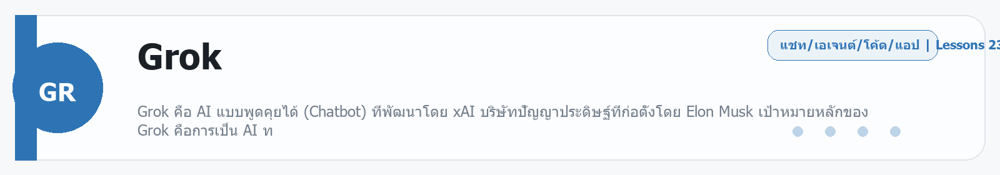

# Google Stitch
Source: https://ailab.learnnakdev.online/docs/google-stitch
Pages captured: 4

## Page 1 (หน้า 1 / 2)
```text
Google Stitch
คู่มืออย่างเป็นทางการ
4 เอกสาร
เริ่มต้น
Google Stitch คืออะไร — ออกแบบ UI ด้วย AI จากคำพูด

ภาพรวม Google Stitch เครื่องมือออกแบบหน้าจอแอป/เว็บด้วย AI แล้วส่งออกเป็นโค้ดหรือ Figma ·  6 นาที

หน้า 1 / 2
Google Stitch — ออกแบบ UI ด้วย AI 🎨

เรียบเรียงเป็นภาษาไทยจากเอกสารทางการ stitch.withgoogle.com

Google Stitch คือเครื่องมือจาก Google Labs ที่ช่วย ออกแบบหน้าจอแอปและเว็บด้วย AI — แค่บรรยายเป็นข้อความ (หรือแนบภาพร่าง) Stitch ก็สร้างหน้า UI ที่สวยและใช้งานได้ให้ พร้อมส่งออกเป็น โค้ด หรือไปแก้ต่อใน Figma ได้ทันที ขับเคลื่อนด้วย Gemini

📖 คำศัพท์ที่ควรรู้
คำศัพท์	ความหมายง่าย ๆ
UI	หน้าตาแอป/เว็บที่ผู้ใช้เห็นและกดใช้งาน
Prompt to UI	สร้างหน้าจอจากคำบรรยายข้อความ
Screen	หน้าจอหนึ่งหน้าในแอป (เช่น หน้า login, หน้าโปรไฟล์)
Standard / Experimental mode	โหมดเร็ว vs โหมดทดลองที่ผลลัพธ์หลากหลายกว่า
Export	ส่งออกดีไซน์เป็นโค้ด (HTML/CSS) หรือไป Figma
⭐ จุดเด่น
บรรยายเป็นคำพูด ได้หน้า UI — ไม่ต้องเริ่มจากศูนย์
แนบภาพร่าง/ภาพอ้างอิง เพื่อกำหนดทิศทางดีไซน์
แก้ด้วยภาษาธรรมชาติ — บอกว่าจะปรับอะไร AI จัดให้
ส่งออกไป Figma หรือเป็นโค้ด เพื่อทำต่อ
มีหลายหน้าจอ สร้างทั้งโฟลว์ของแอปได้
🚀 เริ่มต้นใช้งาน
เข้า stitch.withgoogle.com แล้วล็อกอินด้วย Google
พิมพ์บรรยายแอปที่อยากได้ เช่น "หน้าแอปสั่งกาแฟ มีเมนูและตะกร้า"
เลือกโหมด Standard หรือ Experimental แล้วให้ AI สร้างหน้าจอ
ปรับแก้ด้วยคำสั่ง แล้วกด Export ไป Figma หรือเอาโค้ดไปใช้
📚 สารบัญเอกสาร (ตาม official docs)
✅ ภาพรวม (หน้านี้)
⏳ Prompt to UI — สร้างหน้าจอจากข้อความ
⏳ Standard vs Experimental mode
⏳ การแก้ไขหน้าจอด้วยภาษาธรรมชาติ
⏳ Export ไป Figma / โค้ด
🔗 อ้างอิง
เว็บทางการ: https://stitch.withgoogle.com/
 ก่อนหน้า
ถัดไป
Google Stitch: Prompt to UI — สร้างหน้าจอจากข้อความ
```

## Page 2 (หน้า 2 / 2)
```text
Google Stitch
คู่มืออย่างเป็นทางการ
4 เอกสาร
เริ่มต้น
Google Stitch: Prompt to UI — สร้างหน้าจอจากข้อความ

บรรยายแอปเป็นข้อความ (หรือแนบภาพร่าง) แล้วให้ Stitch สร้างหน้า UI ให้ ·  5 นาที

หน้า 2 / 2
Prompt to UI — พิมพ์แล้วได้หน้าจอ 🎨

เรียบเรียงเป็นภาษาไทยจากเอกสารทางการ stitch.withgoogle.com

หัวใจของ Stitch คือ เปลี่ยนคำบรรยายเป็นหน้า UI ที่สวยและใช้งานได้

✍️ เขียน prompt ให้ได้ผลดี

บอกสิ่งเหล่านี้ให้ครบ:

ประเภทแอป/หน้า — เช่น "หน้าแอปสั่งกาแฟ"
องค์ประกอบ — เช่น "มีเมนู รูปสินค้า ปุ่มเพิ่มลงตะกร้า"
สไตล์/อารมณ์ — เช่น "โทนอุ่น มินิมอล ตัวอักษรกลม"
แพลตฟอร์ม — มือถือหรือเดสก์ท็อป

ตัวอย่าง:

"หน้าแอปจองโรงแรมบนมือถือ มีช่องค้นหา วันที่เข้าพัก การ์ดโรงแรมพร้อมราคา โทนสีฟ้าสะอาดตา"

🖼️ แนบภาพอ้างอิง

นอกจากข้อความ แนบ ภาพร่าง/ภาพตัวอย่าง เพื่อกำหนดทิศทางดีไซน์ได้ — Stitch จะอิงสไตล์จากภาพนั้น

⚡ Standard vs Experimental mode
โหมด	เหมาะกับ
Standard	เร็ว ผลคงเส้นคงวา ใช้งานทั่วไป
Experimental	สร้างสรรค์/หลากหลายกว่า ลองไอเดียใหม่
▶️ ขั้นตอน
เข้า stitch.withgoogle.com แล้วล็อกอิน
พิมพ์ prompt (แนบภาพได้)
เลือกโหมด แล้วให้ Stitch สร้างหน้าจอ
ดูผล แล้วปรับต่อ
🔗 อ้างอิง
เว็บทางการ: https://stitch.withgoogle.com/
 ก่อนหน้า
Google Stitch คืออะไร — ออกแบบ UI ด้วย AI จากคำพูด
ถัดไป
Google Stitch: แก้ไขดีไซน์ด้วยภาษาธรรมชาติ
```

## Page 3 (หน้า 1 / 2)
```text
Google Stitch
คู่มืออย่างเป็นทางการ
4 เอกสาร
ระดับกลาง
Google Stitch: แก้ไขดีไซน์ด้วยภาษาธรรมชาติ

ปรับแก้หน้าจอที่ Stitch สร้าง ด้วยการบอกเป็นคำพูด และจัดการหลายหน้าจอ ·  4 นาที

หน้า 1 / 2
แก้ไขดีไซน์ด้วยคำพูด ✏️

เรียบเรียงเป็นภาษาไทยจากเอกสารทางการ stitch.withgoogle.com

หลัง Stitch สร้างหน้าจอแล้ว คุณ ปรับแก้ได้ด้วยการบอกเป็นภาษาคน ไม่ต้องลากวางเอง

🗣️ ตัวอย่างคำสั่งแก้ไข
"เปลี่ยนสีปุ่มหลักเป็นสีเขียว"
"ทำหัวข้อให้ใหญ่ขึ้นและหนาขึ้น"
"เพิ่มแถบค้นหาด้านบน"
"ย้ายเมนูไปไว้ด้านล่าง"
"ทำให้ดูมินิมอลขึ้น เว้นช่องไฟมากขึ้น"

Stitch จะปรับหน้าจอให้ตามที่บอก แล้วคุณดูผลทันที

🗂️ หลายหน้าจอ (Screens)

แอปจริงมีหลายหน้า — สร้างได้หลาย Screen เช่น หน้า login, หน้าหลัก, หน้าโปรไฟล์ เพื่อประกอบเป็นโฟลว์ทั้งแอป

💡 เคล็ดลับ
แก้ทีละอย่างชัด ๆ จะคุมผลได้ดีกว่าสั่งรวมหลายอย่างพร้อมกัน
ถ้าผลไม่ตรงใจ ลองอธิบายให้เจาะจงขึ้น (บอกขนาด สี ตำแหน่ง)
เก็บเวอร์ชันที่ชอบไว้ก่อนทดลองเปลี่ยนใหญ่
🔗 อ้างอิง
เว็บทางการ: https://stitch.withgoogle.com/
 ก่อนหน้า
Google Stitch: Prompt to UI — สร้างหน้าจอจากข้อความ
ถัดไป
Google Stitch: Export — ส่งออกไป Figma หรือโค้ด
```

## Page 4 (หน้า 2 / 2)
```text
Google Stitch
คู่มืออย่างเป็นทางการ
4 เอกสาร
ระดับกลาง
Google Stitch: Export — ส่งออกไป Figma หรือโค้ด

นำดีไซน์จาก Stitch ไปทำต่อใน Figma หรือเอาโค้ด front-end ไปใช้ ·  4 นาที

หน้า 2 / 2
Export — เอาดีไซน์ไปใช้ต่อ 📤

เรียบเรียงเป็นภาษาไทยจากเอกสารทางการ stitch.withgoogle.com

ดีไซน์จาก Stitch ไม่ได้จบแค่ภาพ — ส่งออกไปทำงานต่อได้จริง

🎯 ส่งออกได้ 2 ทางหลัก
ปลายทาง	เหมาะกับ
Figma	นักออกแบบนำไปปรับแต่ง/ทำ design system ต่อ
โค้ด (HTML/CSS)	นักพัฒนานำหน้าตาไปต่อยอดเป็นเว็บจริง
🎨 ไป Figma
คัดลอกดีไซน์ไปวางใน Figma เพื่อแก้รายละเอียด จัด component และส่งต่อทีม
เหมาะเมื่อทีมมีกระบวนการออกแบบใน Figma อยู่แล้ว
💻 เอาโค้ดไปใช้
ดึงโค้ด front-end ของหน้าจอไปเป็นจุดเริ่มต้น
ประหยัดเวลาขั้น "แปลงดีไซน์เป็นโค้ด"
นำไปต่อใน editor/เฟรมเวิร์กที่ใช้อยู่
💡 เคล็ดลับ
จัดหน้าจอให้เรียบร้อยก่อน export จะได้ผลที่สะอาด
Stitch เหมาะเป็น "จุดเริ่มต้นที่เร็ว" แล้วไปขัดเกลาต่อใน Figma/โค้ด
ตรวจ responsive และรายละเอียดอีกครั้งหลังนำไปใช้
🔗 อ้างอิง
เว็บทางการ: https://stitch.withgoogle.com/
 ก่อนหน้า
Google Stitch: แก้ไขดีไซน์ด้วยภาษาธรรมชาติ
ถัดไป
```


---

## Beginner Guide

### Google Stitch

Source: daily-ai-lab-ai-tools-32page-beginner-guide.docx


**หมวด:** Image
**บทเรียนใน /docs:** 4 หน้า

**ใช้ทำอะไร**
ภาพรวม Google Stitch เครื่องมือออกแบบหน้าจอแอป/เว็บด้วย AI แล้วส่งออกเป็นโค้ดหรือ Figma

**พื้นฐานที่ควรรู้**
พื้นฐานที่ควรรู้คือ subject, style, aspect ratio, reference image, และการคุมรายละเอียดภาพ. ก่อนจะเร่งคุณภาพ ให้ลอง prompt สั้น ๆ 2-3 รอบเพื่อหาภาษาที่โมเดลเข้าใจตรงกัน

**เหมาะกับมือใหม่แบบไหน**
เครื่องมือนี้เหมาะกับผู้เริ่มต้นที่อยากฝึกงาน Image แบบสั้นและดูผลลัพธ์ได้เร็ว

**วิธีเริ่มแบบสั้น**
1. เริ่มจาก subject, style, และ aspect ratio ที่ต้องการก่อน
2. ลอง 2-3 เวอร์ชันแรกเพื่อหาภาษาที่โมเดลเข้าใจตรงกับโจทย์
3. ค่อยเพิ่มรายละเอียด เช่น lighting, material, composition, หรือ reference image

**ราคา/Plan**
Experimental Google Labs tool with no public paid plan shown yet.

**สิ่งที่ควรจำ**
- จุดแข็ง: เครื่องมือนี้เหมาะกับผู้เริ่มต้นที่อยากฝึกงาน Image แบบสั้นและดูผลลัพธ์ได้เร็ว
- ข้อควรระวัง: ภาพที่ดีมักมาจาก prompt ที่ชัด และบางแพลนจำกัดจำนวนหรือความละเอียดของผลลัพธ์.

**ตัวอย่างเริ่มต้น**
ลองเริ่มด้วย: สร้างภาพของ ตัวอย่างงาน โทน clean องค์ประกอบชัดเจน มุมมอง medium shot อัตราส่วน 16:9 รายละเอียดหลักคือ รายละเอียดหลักให้ชัด

---

---

<!-- merged-beginner-guide:Google Stitch -->
## คู่มือพื้นฐานของ Google Stitch

**หมวด:** Image
**บทเรียนใน /docs:** 4 หน้า

**ใช้ทำอะไร**
ภาพรวม Google Stitch เครื่องมือออกแบบหน้าจอแอป/เว็บด้วย AI แล้วส่งออกเป็นโค้ดหรือ Figma

**พื้นฐานที่ควรรู้**
พื้นฐานที่ควรรู้คือ subject, style, aspect ratio, reference image, และการคุมรายละเอียดภาพ. ก่อนจะเร่งคุณภาพ ให้ลอง prompt สั้น ๆ 2-3 รอบเพื่อหาภาษาที่โมเดลเข้าใจตรงกัน

**เหมาะกับมือใหม่แบบไหน**
เครื่องมือนี้เหมาะกับผู้เริ่มต้นที่อยากฝึกงาน Image แบบสั้นและดูผลลัพธ์ได้เร็ว

**วิธีเริ่มแบบสั้น**
1. เริ่มจาก subject, style, และ aspect ratio ที่ต้องการก่อน
2. ลอง 2-3 เวอร์ชันแรกเพื่อหาภาษาที่โมเดลเข้าใจตรงกับโจทย์
3. ค่อยเพิ่มรายละเอียด เช่น lighting, material, composition, หรือ reference image

**ราคา/Plan**
Experimental Google Labs tool with no public paid plan shown yet.

**สิ่งที่ควรจำ**
- จุดแข็ง: เครื่องมือนี้เหมาะกับผู้เริ่มต้นที่อยากฝึกงาน Image แบบสั้นและดูผลลัพธ์ได้เร็ว
- ข้อควรระวัง: ภาพที่ดีมักมาจาก prompt ที่ชัด และบางแพลนจำกัดจำนวนหรือความละเอียดของผลลัพธ์.

**ตัวอย่างเริ่มต้น**
ลองเริ่มด้วย: สร้างภาพของ ตัวอย่างงาน โทน clean องค์ประกอบชัดเจน มุมมอง medium shot อัตราส่วน 16:9 รายละเอียดหลักคือ รายละเอียดหลักให้ชัด

---


