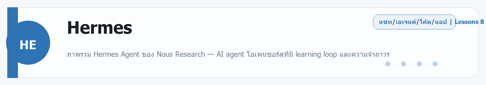
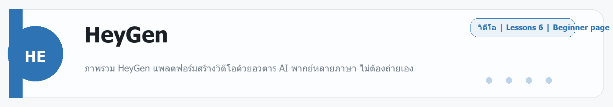

# Hermes
Source: https://ailab.learnnakdev.online/docs/hermes
Pages captured: 8

## Page 1 (หน้า 1 / 3)
```text
Hermes
คู่มืออย่างเป็นทางการ
8 เอกสาร
เริ่มต้น
Hermes Agent คืออะไร — AI Agent ที่เรียนรู้และพัฒนาตัวเอง

ภาพรวม Hermes Agent ของ Nous Research — AI agent โอเพนซอร์สที่มี learning loop และความจำถาวร ·  6 นาที

หน้า 1 / 3
Hermes Agent — AI Agent ที่ "เติบโตไปกับคุณ" ☤

เรียบเรียงเป็นภาษาไทยจากเอกสารทางการ hermes-agent.nousresearch.com/docs

Hermes Agent คือ AI agent โอเพนซอร์ส (MIT License) ที่พัฒนาโดย Nous Research จุดเด่นที่ไม่เหมือนใครคือมี "learning loop" (วงจรเรียนรู้) ในตัว — มันสร้างทักษะ (skills) จากประสบการณ์ ปรับปรุงทักษะระหว่างใช้งาน บันทึกความรู้ไว้เอง ค้นหาบทสนทนาเก่าของตัวเองได้ และค่อย ๆ เข้าใจ "คุณ" มากขึ้นข้ามเซสชัน

สโลแกน: "The agent that grows with you" — เอเจนต์ที่เติบโตไปพร้อมคุณ

📖 คำศัพท์ที่ควรรู้
คำศัพท์	ความหมายง่าย ๆ
Agent	AI ที่ลงมือทำงานเองได้ (ค้นเว็บ คุมเบราว์เซอร์ สร้างรูป ฯลฯ)
Learning loop	วงจรที่ Hermes "เรียนรู้จากการใช้งาน" แล้วเก่งขึ้นเรื่อย ๆ
Skill	ทักษะที่ Hermes สร้าง/ปรับปรุงเองจากประสบการณ์
Memory	ความจำถาวรที่ติดตัวข้ามเซสชัน (ค้นด้วย FTS5 + สรุปด้วย LLM)
Gateway	ตัวรันที่ให้คุยกับ Hermes ผ่านแอปแชตต่าง ๆ
MCP	Model Context Protocol — มาตรฐานต่อ AI เข้ากับเครื่องมือ/ข้อมูลภายนอก
⭐ จุดเด่น
เรียนรู้และพัฒนาตัวเอง — วงจรป้อนกลับปิด (closed feedback loop) สร้างทักษะใหม่ + ปรับปรุงเอง
ความจำถาวร — จำข้อมูลข้ามเซสชัน ค้นหาด้วย FTS5 และสรุปด้วย LLM
เครื่องมือเยอะ — มีเครื่องมือในตัว 60+ อย่าง รวมถึงคุมเว็บ, vision, สร้างรูปภาพ, แปลงข้อความเป็นเสียง
ใช้ได้หลายโมเดล — ต่อกับ Nous Portal, OpenRouter, OpenAI หรือ endpoint ใดก็ได้
เข้าถึงได้ 20+ แพลตฟอร์มแชต — Telegram, Discord, Slack, WhatsApp, Signal, Email ฯลฯ จาก gateway เดียว
รันได้หลายที่ — เครื่องตัวเอง, Docker, SSH, Daytona, Singularity หรือ Modal
รองรับ MCP — ต่อกับ MCP servers เพื่อเพิ่มความสามารถ
🚪 จุดเริ่มใช้งาน 2 ทาง
Terminal UI — สั่ง hermes เพื่อเปิดหน้าจอใช้งานในเทอร์มินัล
Gateway — รัน gateway แล้วคุยกับ Hermes ผ่าน Telegram / Discord / Slack / WhatsApp / Signal / Email

เมื่ออยู่ในบทสนทนาแล้ว มี slash command หลายคำสั่งที่ใช้ร่วมกันได้ทั้งสองโหมด

ติดตั้ง: ดาวน์โหลดตัวติดตั้งแบบ Desktop, หรือรันสคริปต์ตามระบบ (bash สำหรับ Linux/macOS/WSL2, PowerShell สำหรับ Windows) เช่น:

curl -fsSL https://hermes-agent.nousresearch.com/install.sh | bash

📚 สารบัญเอกสาร Hermes (เรียงตาม official docs)
✅ ภาพรวม Hermes (หน้านี้)
⏳ User Stories & Use Cases — ตัวอย่างการใช้งานจริง
⏳ Getting Started — Quickstart เริ่มต้น
⏳ Using Hermes — การใช้งานผ่าน CLI
⏳ Features — ภาพรวมความสามารถ
⏳ Messaging Platforms — เชื่อมแพลตฟอร์มแชต
⏳ Integrations — การต่อกับบริการ/โมเดลภายนอก
⏳ Guides & Tutorials — คู่มือเชิงปฏิบัติ
⏳ Developer Guide — สำหรับนักพัฒนา/การร่วมพัฒนา
⏳ Reference — รายการคำสั่ง CLI
🔗 อ้างอิง (เอกสารทางการ)
เอกสารหลัก: https://hermes-agent.nousresearch.com/docs/
เว็บไซต์: https://hermes-agent.nousresearch.com/
ซอร์สโค้ด (GitHub): https://github.com/nousresearch/hermes-agent
 ก่อนหน้า
ถัดไป
Hermes: User Stories & Use Cases — ใช้ทำอะไรได้บ้าง
```

## Page 2 (หน้า 2 / 3)
```text
Hermes
คู่มืออย่างเป็นทางการ
8 เอกสาร
เริ่มต้น
Hermes: User Stories & Use Cases — ใช้ทำอะไรได้บ้าง

ตัวอย่างการใช้งานจริงของ Hermes Agent ตั้งแต่ผู้ช่วยส่วนตัวถึงงานอัตโนมัติ ·  4 นาที

หน้า 2 / 3
Hermes ใช้ทำอะไรได้บ้าง

เรียบเรียงจากเอกสารทางการ hermes-agent.nousresearch.com/docs หมวด User Stories & Use Cases

เพราะ Hermes เป็น agent ที่ลงมือทำงานได้จริง + เรียนรู้และจำข้ามเซสชัน จึงเหมาะกับงานที่ต้องทำซ้ำและต้องการบริบทต่อเนื่อง

🧑‍💻 ตัวอย่างการใช้งาน
ผู้ช่วยส่วนตัวข้ามแพลตฟอร์ม — คุยสั่งงานผ่าน Telegram/Discord/Slack/WhatsApp ได้จากที่เดียว
ค้นคว้าและสรุป — ค้นเว็บ อ่านหน้าเว็บ/เอกสาร แล้วสรุปให้
งานอัตโนมัติประจำ — สั่งงานที่ทำซ้ำ แล้วให้ Hermes สร้าง "skill" จดจำวิธีทำไว้ใช้รอบหน้า
ผู้ช่วยที่ "รู้จักคุณ" — จำความชอบ/บริบทของคุณข้ามบทสนทนา ทำให้คำตอบตรงขึ้นเรื่อย ๆ
งานที่ต้องใช้หลายเครื่องมือ — ค้นเว็บ + คุมเบราว์เซอร์ + สร้างรูป + แปลงเสียง ในเวิร์กโฟลว์เดียว
💡 จุดที่ต่างจาก chatbot ทั่วไป
มี learning loop — เก่งขึ้นจากการใช้งานจริง
มี ความจำถาวร — ไม่ลืมเมื่อปิดแล้วเปิดใหม่
รันที่ไหนก็ได้ (เครื่องตัวเอง/คลาวด์) และเข้าถึงผ่านแชต 20+ แพลตฟอร์ม

อยากเริ่มเลย? ไปหัวข้อ Getting Started

 ก่อนหน้า
Hermes Agent คืออะไร — AI Agent ที่เรียนรู้และพัฒนาตัวเอง
ถัดไป
Hermes: Getting Started — ติดตั้งและเริ่มใช้
```

## Page 3 (หน้า 3 / 3)
```text
Hermes
คู่มืออย่างเป็นทางการ
8 เอกสาร
เริ่มต้น
Hermes: Getting Started — ติดตั้งและเริ่มใช้

ติดตั้ง Hermes Agent และเริ่มคุยผ่าน Terminal UI หรือ Gateway ·  4 นาที

หน้า 3 / 3
เริ่มต้นใช้งาน Hermes

เรียบเรียงจากเอกสารทางการ hermes-agent.nousresearch.com/docs หมวด Getting Started / Quickstart

⬇️ ติดตั้ง

เลือกทางใดทางหนึ่ง:

ตัวติดตั้งแบบ Desktop — ดาวน์โหลดจากเว็บทางการ
สคริปต์ตามระบบ — bash สำหรับ Linux/macOS/WSL2, PowerShell สำหรับ Windows เช่น:
curl -fsSL https://hermes-agent.nousresearch.com/install.sh | bash

🔑 เชื่อมโมเดล (Provider)

Hermes ต่อกับโมเดลได้หลายแหล่ง — Nous Portal, OpenRouter, OpenAI หรือ endpoint ใดก็ได้ (ดูหัวข้อ Integrations) เตรียม API key ของแหล่งที่เลือกไว้

🚪 เริ่มคุย 2 ทาง
Terminal UI — สั่ง hermes เพื่อเปิดหน้าใช้งานในเทอร์มินัล
Gateway — รัน gateway แล้วคุยผ่าน Telegram / Discord / Slack / WhatsApp / Signal / Email

เมื่ออยู่ในบทสนทนา มี slash command หลายคำสั่งใช้ร่วมกันได้ทั้งสองโหมด (ดูหัวข้อ Reference)

🏃 รันที่ไหนก็ได้

Hermes รันได้บนเครื่องตัวเอง, Docker, SSH, Daytona, Singularity หรือ Modal — เลือกตามความสะดวก

ขั้นต่อไป: ดู Using Hermes (CLI) เพื่อใช้งานผ่านบรรทัดคำสั่ง และ Features เพื่อรู้จักความสามารถทั้งหมด

 ก่อนหน้า
Hermes: User Stories & Use Cases — ใช้ทำอะไรได้บ้าง
ถัดไป
Hermes: Using Hermes (CLI) — ใช้งานผ่านบรรทัดคำสั่ง
```

## Page 4 (หน้า 1 / 3)
```text
Hermes
คู่มืออย่างเป็นทางการ
8 เอกสาร
ระดับกลาง
Hermes: Using Hermes (CLI) — ใช้งานผ่านบรรทัดคำสั่ง

ใช้ Hermes ผ่าน Terminal UI และ slash commands ·  4 นาที

หน้า 1 / 3
ใช้งาน Hermes ผ่าน CLI

เรียบเรียงจากเอกสารทางการ hermes-agent.nousresearch.com/docs หมวด Using Hermes

💻 Terminal UI

สั่ง hermes เพื่อเปิดหน้าใช้งานในเทอร์มินัล — พิมพ์คุยกับ agent ได้เหมือนแชต แต่ทำงานบนเครื่องคุณและเข้าถึงเครื่องมือ/ไฟล์ได้

⌨️ Slash Commands

ภายในบทสนทนา มีคำสั่งขึ้นต้นด้วย / ที่ใช้ควบคุมการทำงาน — และคำสั่งเหล่านี้ ใช้ร่วมกันได้ทั้งใน Terminal UI และผ่าน Gateway (แชตจากแพลตฟอร์มต่าง ๆ)

ตัวอย่างประเภทคำสั่งที่มักมี:

จัดการบทสนทนา/เซสชัน
เรียกดู/จัดการ memory (ความจำ) และ skills
ตั้งค่าโมเดล/พฤติกรรม
เรียกเครื่องมือเฉพาะ

รายการคำสั่งทั้งหมดดูได้ที่หัวข้อ Reference (CLI Commands)

🔁 ทำงานต่อเนื่อง

เพราะ Hermes มีความจำถาวรและ learning loop การใช้ผ่าน CLI ซ้ำ ๆ จะทำให้มันค่อย ๆ เข้าใจสไตล์งานของคุณและสร้าง skill มาช่วยในครั้งถัดไป

 ก่อนหน้า
Hermes: Getting Started — ติดตั้งและเริ่มใช้
ถัดไป
Hermes: Features — ความสามารถทั้งหมด
```

## Page 5 (หน้า 2 / 3)
```text
Hermes
คู่มืออย่างเป็นทางการ
8 เอกสาร
ระดับกลาง
Hermes: Features — ความสามารถทั้งหมด

learning loop, ความจำถาวร, เครื่องมือ 60+ อย่าง, vision, สร้างรูป, TTS และ MCP ·  5 นาที

หน้า 2 / 3
Features — ความสามารถของ Hermes

เรียบเรียงจากเอกสารทางการ hermes-agent.nousresearch.com/docs หมวด Features

🔁 Learning Loop (เรียนรู้-พัฒนาตัวเอง)

หัวใจที่ไม่เหมือนใครของ Hermes — วงจรป้อนกลับปิด (closed feedback loop) ที่ทำให้มัน:

สร้าง skill จากประสบการณ์ แล้วปรับปรุงระหว่างใช้
เตือนตัวเองให้บันทึกความรู้ไว้
ค้นหาบทสนทนาเก่าของตัวเองมาอ้างอิง
เข้าใจ "ตัวคุณ" ลึกขึ้นเรื่อย ๆ ข้ามเซสชัน
🧠 ความจำถาวร (Memory)

จำข้อมูลข้ามเซสชัน ค้นด้วย FTS5 (full-text search) และสรุปด้วย LLM — ปิดแล้วเปิดใหม่ก็ยังจำบริบทได้

🧰 เครื่องมือในตัว 60+ อย่าง

รวมถึง:

Web — ค้นเว็บ + คุมเบราว์เซอร์ (web control)
Vision — เข้าใจรูปภาพ
Image generation — สร้างรูป
Text-to-Speech (TTS) — แปลงข้อความเป็นเสียง
และอีกหลายสิบเครื่องมือสำหรับงานทั่วไป
🔌 รองรับ MCP

ต่อกับ MCP servers เพื่อเพิ่มความสามารถ/เชื่อมเครื่องมือภายนอก

🧮 Multi-model reasoning

ใช้หลายโมเดลในการคิด/ทำงานได้ และต่อกับ provider ได้หลายเจ้า (ดู Integrations)

ความสามารถเหล่านี้เข้าถึงได้ทั้งผ่าน Terminal UI และ Gateway (แชต 20+ แพลตฟอร์ม — ดู Messaging Platforms)

 ก่อนหน้า
Hermes: Using Hermes (CLI) — ใช้งานผ่านบรรทัดคำสั่ง
ถัดไป
Hermes: Messaging Platforms — คุยผ่านแอปแชต
```

## Page 6 (หน้า 3 / 3)
```text
Hermes
คู่มืออย่างเป็นทางการ
8 เอกสาร
ระดับกลาง
Hermes: Messaging Platforms — คุยผ่านแอปแชต

เชื่อม Hermes เข้ากับ Telegram, Discord, Slack, WhatsApp, Signal, Email และอื่น ๆ ·  4 นาที

หน้า 3 / 3
Messaging Platforms — เข้าถึง Hermes จากแอปแชต

เรียบเรียงจากเอกสารทางการ hermes-agent.nousresearch.com/docs หมวด Messaging Platforms

นอกจาก Terminal UI แล้ว Hermes รัน Gateway เพื่อให้คุยกับมันจากแอปแชตที่ใช้ทุกวันได้ — รองรับ 20+ แพลตฟอร์ม จาก gateway เดียว

💬 แพลตฟอร์มที่รองรับ (ตัวอย่าง)
Telegram
Discord
Slack
WhatsApp
Signal
Email
และอื่น ๆ รวมกว่า 20 แพลตฟอร์ม
🔌 หลักการเชื่อม (ภาพรวม)
รัน Gateway ของ Hermes
ตั้งค่า/ใส่ credential ของแพลตฟอร์มที่ต้องการ (เช่น bot token)
ทักหา Hermes ในแอปนั้นได้เลย — และใช้ slash command ชุดเดียวกับ Terminal UI ได้
💡 ข้อดี
คุยกับผู้ช่วยตัวเดิม (ความจำ + skill เดียวกัน) ได้จากทุกที่
เหมาะกับการสั่งงาน/เช็คสถานะระหว่างวันโดยไม่ต้องเปิดเทอร์มินัล

รายละเอียดการตั้งค่าแต่ละแพลตฟอร์มดูในเอกสารทางการ และดูการต่อโมเดลที่หัวข้อ Integrations

 ก่อนหน้า
Hermes: Features — ความสามารถทั้งหมด
ถัดไป
Hermes: Integrations — ต่อกับโมเดลและบริการ
```

## Page 7 (หน้า 1 / 2)
```text
Hermes
คู่มืออย่างเป็นทางการ
8 เอกสาร
ขั้นโปร
Hermes: Integrations — ต่อกับโมเดลและบริการ

เลือก provider โมเดล (Nous Portal, OpenRouter, OpenAI หรือ endpoint ใดก็ได้) และต่อ MCP ·  4 นาที

หน้า 1 / 2
Integrations — ต่อ Hermes เข้ากับโมเดล/บริการ

เรียบเรียงจากเอกสารทางการ hermes-agent.nousresearch.com/docs หมวด Integrations

🧠 Providers (แหล่งโมเดล)

Hermes ไม่ผูกกับโมเดลเดียว — ต่อได้หลายแหล่ง:

Provider	หมายเหตุ
Nous Portal	แพลตฟอร์มของ Nous Research เอง
OpenRouter	เกตเวย์รวมหลายโมเดลในที่เดียว
OpenAI	โมเดล GPT
Endpoint ใดก็ได้	ต่อกับ API ที่เข้ากันได้เอง (รวมถึงโมเดลโลคัล)

เตรียม API key ของแหล่งที่เลือก แล้วตั้งค่าใน Hermes

🔌 MCP (Model Context Protocol)

ต่อ MCP servers เพื่อให้ Hermes เข้าถึงเครื่องมือ/ข้อมูลภายนอกแบบมาตรฐาน — ขยายความสามารถได้โดยไม่ต้องเขียนปลั๊กอินเอง

🏗️ รันที่ไหนก็ได้

นอกจากเครื่องตัวเอง Hermes รันบน Docker, SSH, Daytona, Singularity หรือ Modal ได้ — เลือกโครงสร้างพื้นฐานตามงาน (เช่น รันค้างบน VPS เพื่อให้คุยผ่านแชตได้ตลอด)

ดูการต่อแพลตฟอร์มแชตที่ Messaging Platforms และคำสั่งทั้งหมดที่ Reference

 ก่อนหน้า
Hermes: Messaging Platforms — คุยผ่านแอปแชต
ถัดไป
Hermes: Reference — คำสั่ง CLI และนักพัฒนา
```

## Page 8 (หน้า 2 / 2)
```text
Hermes
คู่มืออย่างเป็นทางการ
8 เอกสาร
ขั้นโปร
Hermes: Reference — คำสั่ง CLI และนักพัฒนา

รายการคำสั่ง CLI / slash commands และแนวทางสำหรับนักพัฒนา ·  3 นาที

หน้า 2 / 2
Reference — คำสั่งและข้อมูลนักพัฒนา

เรียบเรียงจากเอกสารทางการ hermes-agent.nousresearch.com/docs หมวด Reference / Developer Guide

⌨️ CLI Commands

Hermes มีคำสั่งบรรทัดคำสั่งและ slash command (ขึ้นต้นด้วย /) สำหรับควบคุมการทำงาน — ใช้ได้ทั้งใน Terminal UI และผ่าน Gateway

ประเภทคำสั่งหลัก ๆ ที่มี:

เปิด/จัดการบทสนทนาและเซสชัน
ดู/แก้ memory และ skills
ตั้งค่าโมเดล/พฤติกรรม
เรียกเครื่องมือเฉพาะ (web, vision, image, TTS ฯลฯ)

รายการคำสั่งฉบับเต็มและพารามิเตอร์ ดูได้ที่เอกสารทางการ (หน้า CLI Commands)

🛠️ Developer Guide / Contributing

Hermes เป็นโอเพนซอร์ส (MIT License) — นักพัฒนาร่วมพัฒนาได้:

ซอร์สโค้ดอยู่ที่ GitHub: https://github.com/nousresearch/hermes-agent
มีคู่มือสำหรับการตั้งสภาพแวดล้อมพัฒนาและการส่ง contribution
📚 Guides & Tutorials

เอกสารทางการมีคู่มือเชิงปฏิบัติเพิ่มเติม (เช่น การรันโมเดลฟรีบางตัว) ดูได้ในหมวด Guides & Tutorials

🔗 อ้างอิง
เอกสารหลัก: https://hermes-agent.nousresearch.com/docs/
GitHub: https://github.com/nousresearch/hermes-agent
 ก่อนหน้า
Hermes: Integrations — ต่อกับโมเดลและบริการ
ถัดไป
```


---

## Beginner Guide

### Hermes

Source: daily-ai-lab-ai-tools-32page-beginner-guide.docx



**หมวด:** Chat / Agent / Coding / App
**บทเรียนใน /docs:** 8 หน้า

**ใช้ทำอะไร**
ภาพรวม Hermes Agent ของ Nous Research — AI agent โอเพนซอร์สที่มี learning loop และความจำถาวร

**พื้นฐานที่ควรรู้**
พื้นฐานที่ควรรู้คือ prompt, context, file, workspace, และการตรวจผลลัพธ์ก่อนนำไปใช้งานจริง. มือใหม่ควรเริ่มจากงานเล็กที่วัดผลได้ เช่น สรุปเอกสาร แก้โค้ดสั้น ๆ หรือทำต้นแบบหน้าเว็บหนึ่งหน้า

**เหมาะกับมือใหม่แบบไหน**
เครื่องมือนี้เหมาะกับผู้เริ่มต้นที่อยากฝึกงาน Chat / Agent / Coding / App แบบสั้นและดูผลลัพธ์ได้เร็ว

**วิธีเริ่มแบบสั้น**
1. เปิด workspace หรือแชท แล้วให้โจทย์เดียวที่ชัดเจนพร้อมบริบทที่จำเป็น
2. แนบไฟล์ ตัวอย่าง หรือเป้าหมายที่อยากได้ เพื่อให้โมเดลอ่านภาพรวมได้เร็ว
3. ตรวจผลลัพธ์รอบแรก แล้วให้แก้แบบเฉพาะจุด เช่น tone, logic, code style หรือ structure

**ราคา/Plan**
Free; Plus $20/month; Super $100/month; Ultra $200/month.

**สิ่งที่ควรจำ**
- จุดแข็ง: เครื่องมือนี้เหมาะกับผู้เริ่มต้นที่อยากฝึกงาน Chat / Agent / Coding / App แบบสั้นและดูผลลัพธ์ได้เร็ว
- ข้อควรระวัง: ระวัง prompt ที่กว้างเกินไปและตรวจโค้ดหรือเอกสารทุกครั้งก่อนนำไปใช้จริง.

**ตัวอย่างเริ่มต้น**
ตัวอย่างงานเริ่มต้น: ช่วยฉันทำงานนี้ให้จบในรอบแรก: งานเริ่มต้นของฉัน. นี่คือบริบทที่มีอยู่: ฉันมีเป้าหมายชัดและอยากได้ผลลัพธ์ที่ตรวจสอบได้. ขอผลลัพธ์เป็นขั้นตอนชัดเจนและตรวจสอบได้

---

---

<!-- merged-beginner-guide:Hermes -->
## คู่มือพื้นฐานของ Hermes

**หมวด:** Chat / Agent / Coding / App
**บทเรียนใน /docs:** 8 หน้า

**ใช้ทำอะไร**
ภาพรวม Hermes Agent ของ Nous Research — AI agent โอเพนซอร์สที่มี learning loop และความจำถาวร

**พื้นฐานที่ควรรู้**
พื้นฐานที่ควรรู้คือ prompt, context, file, workspace, และการตรวจผลลัพธ์ก่อนนำไปใช้งานจริง. มือใหม่ควรเริ่มจากงานเล็กที่วัดผลได้ เช่น สรุปเอกสาร แก้โค้ดสั้น ๆ หรือทำต้นแบบหน้าเว็บหนึ่งหน้า

**เหมาะกับมือใหม่แบบไหน**
เครื่องมือนี้เหมาะกับผู้เริ่มต้นที่อยากฝึกงาน Chat / Agent / Coding / App แบบสั้นและดูผลลัพธ์ได้เร็ว

**วิธีเริ่มแบบสั้น**
1. เปิด workspace หรือแชท แล้วให้โจทย์เดียวที่ชัดเจนพร้อมบริบทที่จำเป็น
2. แนบไฟล์ ตัวอย่าง หรือเป้าหมายที่อยากได้ เพื่อให้โมเดลอ่านภาพรวมได้เร็ว
3. ตรวจผลลัพธ์รอบแรก แล้วให้แก้แบบเฉพาะจุด เช่น tone, logic, code style หรือ structure

**ราคา/Plan**
Free; Plus $20/month; Super $100/month; Ultra $200/month.

**สิ่งที่ควรจำ**
- จุดแข็ง: เครื่องมือนี้เหมาะกับผู้เริ่มต้นที่อยากฝึกงาน Chat / Agent / Coding / App แบบสั้นและดูผลลัพธ์ได้เร็ว
- ข้อควรระวัง: ระวัง prompt ที่กว้างเกินไปและตรวจโค้ดหรือเอกสารทุกครั้งก่อนนำไปใช้จริง.

**ตัวอย่างเริ่มต้น**
ตัวอย่างงานเริ่มต้น: ช่วยฉันทำงานนี้ให้จบในรอบแรก: งานเริ่มต้นของฉัน. นี่คือบริบทที่มีอยู่: ฉันมีเป้าหมายชัดและอยากได้ผลลัพธ์ที่ตรวจสอบได้. ขอผลลัพธ์เป็นขั้นตอนชัดเจนและตรวจสอบได้

---


