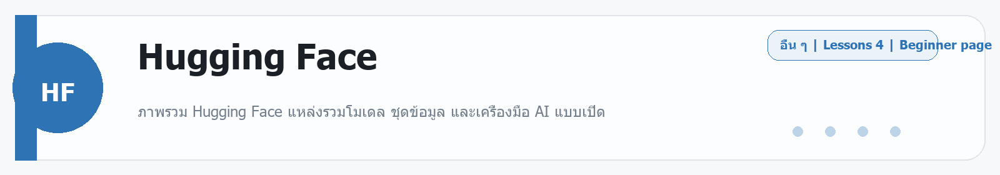

# Hugging Face
Source: https://ailab.learnnakdev.online/docs/hugging-face
Pages captured: 4

## Page 1 (หน้า 1 / 2)
```text
Hugging Face
คู่มืออย่างเป็นทางการ
4 เอกสาร
เริ่มต้น
Hugging Face คืออะไร — ฮับโมเดล AI ที่ใหญ่ที่สุดในโลก

ภาพรวม Hugging Face แหล่งรวมโมเดล ชุดข้อมูล และเครื่องมือ AI แบบเปิด ·  7 นาที

หน้า 1 / 2
Hugging Face — บ้านของโมเดล AI แบบเปิด 🤗

เรียบเรียงเป็นภาษาไทยจากเอกสารทางการ huggingface.co/docs

Hugging Face คือแพลตฟอร์มและชุมชนสำหรับ AI/Machine Learning ที่ใหญ่ที่สุดในโลก — เปรียบเหมือน "GitHub ของวงการ AI" ที่นักวิจัยและนักพัฒนาทั่วโลกมา แชร์โมเดล ชุดข้อมูล และแอปสาธิต ให้ใช้งานฟรี มีโมเดลให้เลือกหลายแสนตัว ตั้งแต่โมเดลภาษา รูปภาพ เสียง ไปจนถึงวิดีโอ

📖 คำศัพท์ที่ควรรู้
คำศัพท์	ความหมายง่าย ๆ
Hub	ศูนย์รวมโมเดล/ชุดข้อมูล/แอป ที่ทุกคนอัปโหลดมาแชร์กัน
Model	โมเดล AI ที่เทรนไว้แล้ว พร้อมนำไปใช้ต่อ
Dataset	ชุดข้อมูลสำหรับเทรนหรือทดสอบโมเดล
Space	แอปสาธิต AI ที่รันบนเว็บได้ทันที (มักทำด้วย Gradio/Streamlit)
Transformers	ไลบรารี Python ยอดนิยมสำหรับโหลด+ใช้โมเดล
Inference	การเรียกใช้โมเดลให้ทำงาน (ทำนายผล)
⭐ ส่วนประกอบหลัก (ตามเมนู official docs)
Hub — เรียกดู ดาวน์โหลด และอัปโหลดโมเดล/ชุดข้อมูล/Spaces
Transformers — ไลบรารีหลักสำหรับโหลดและรันโมเดล (รองรับ PyTorch/TensorFlow/JAX)
Datasets — โหลดและจัดการชุดข้อมูลขนาดใหญ่ได้ง่าย
Spaces — สร้าง/แชร์แอปสาธิต AI บนเว็บฟรี
Inference (API & Endpoints) — เรียกใช้โมเดลผ่าน API โดยไม่ต้องตั้งเซิร์ฟเวอร์เอง
AutoTrain — เทรนโมเดลของคุณเองโดยแทบไม่ต้องเขียนโค้ด
🚀 เริ่มต้นใช้งาน
สมัครบัญชีฟรีที่ huggingface.co
ลองค้นโมเดลใน Models แล้วกด "Use this model"
ใช้ผ่าน Python ด้วยไลบรารี transformers:
from transformers import pipeline
pipe = pipeline("sentiment-analysis")
print(pipe("ฉันชอบเรียน AI มาก!"))

หรือลองเล่นแอปใน Spaces ได้เลยโดยไม่ต้องติดตั้งอะไร
📚 สารบัญเอกสาร Hugging Face (ตาม official docs)
✅ ภาพรวม (หน้านี้)
⏳ Hub — โมเดล ชุดข้อมูล และ Spaces
⏳ Transformers — โหลดและใช้โมเดลด้วยโค้ด
⏳ Datasets — จัดการชุดข้อมูล
⏳ Inference API & Endpoints
⏳ AutoTrain — เทรนโมเดลแบบไม่ต้องเขียนโค้ด
🔗 อ้างอิง
เอกสารทางการ: https://huggingface.co/docs
เว็บหลัก: https://huggingface.co/
 ก่อนหน้า
ถัดไป
Hugging Face: Hub — โมเดล ชุดข้อมูล และ Spaces
```

## Page 2 (หน้า 2 / 2)
```text
Hugging Face
คู่มืออย่างเป็นทางการ
4 เอกสาร
เริ่มต้น
Hugging Face: Hub — โมเดล ชุดข้อมูล และ Spaces

ทำความรู้จัก Hugging Face Hub ศูนย์รวมโมเดล ชุดข้อมูล และแอปสาธิต ·  5 นาที

หน้า 2 / 2
Hugging Face Hub — ศูนย์รวมของทุกอย่าง 🏛️

เรียบเรียงเป็นภาษาไทยจากเอกสารทางการ huggingface.co/docs/hub

Hub คือหัวใจของ Hugging Face — เป็นที่ที่ทุกคนมาแชร์และค้นหา 3 อย่างหลัก

🗂️ สามสิ่งหลักบน Hub
ประเภท	คืออะไร
Models	โมเดล AI ที่เทรนไว้แล้ว พร้อมนำไปใช้
Datasets	ชุดข้อมูลสำหรับเทรน/ทดสอบ
Spaces	แอปสาธิต AI ที่รันบนเว็บได้ทันที
🔍 การค้นหาโมเดล
กรองตาม task (เช่น text generation, image classification, speech)
กรองตามภาษา, ขนาด, ใบอนุญาต (license)
ดู Model Card — หน้าอธิบายโมเดล (วิธีใช้ ข้อจำกัด ตัวอย่าง)
📦 Repository แบบ Git

ทุกโมเดل/ชุดข้อมูลคือ Git repository — มีประวัติเวอร์ชัน, ดาวน์โหลดได้, อัปโหลดของตัวเองได้ รองรับไฟล์ใหญ่ด้วย Git LFS

▶️ เริ่มต้น
สมัครบัญชีที่ huggingface.co
ค้นโมเดลในแท็บ Models เลือกตาม task ที่ต้องการ
อ่าน Model Card แล้วกด "Use this model" เพื่อดูวิธีเรียกใช้
📚 ถัดไป
Transformers — ใช้โมเดลด้วยโค้ด
Inference — เรียกใช้โมเดลผ่าน API
🔗 อ้างอิง
เอกสาร Hub: https://huggingface.co/docs/hub
 ก่อนหน้า
Hugging Face คืออะไร — ฮับโมเดล AI ที่ใหญ่ที่สุดในโลก
ถัดไป
Hugging Face: Transformers — ใช้โมเดลด้วยโค้ด
```

## Page 3 (หน้า 1 / 2)
```text
Hugging Face
คู่มืออย่างเป็นทางการ
4 เอกสาร
ระดับกลาง
Hugging Face: Transformers — ใช้โมเดลด้วยโค้ด

ใช้ไลบรารี transformers โหลดและรันโมเดลจาก Hub ด้วย pipeline ง่าย ๆ ·  6 นาที

หน้า 1 / 2
Transformers — ไลบรารีหลักของ Hugging Face 🐍

เรียบเรียงเป็นภาษาไทยจากเอกสารทางการ huggingface.co/docs/transformers

Transformers คือไลบรารี Python ยอดนิยมที่ใช้โหลดและรันโมเดลจาก Hub ได้ในไม่กี่บรรทัด รองรับ PyTorch / TensorFlow / JAX

⚡ วิธีง่ายที่สุด: pipeline

pipeline ห่อทุกอย่าง (โหลดโมเดล + เตรียมข้อมูล + รัน) ไว้ให้แล้ว

from transformers import pipeline

# วิเคราะห์อารมณ์ข้อความ
clf = pipeline("sentiment-analysis")
print(clf("ฉันชอบเรียน AI มาก!"))

# สร้างข้อความ
gen = pipeline("text-generation", model="gpt2")
print(gen("Once upon a time"))

🧩 task ที่ใช้บ่อย
task	ทำอะไร
text-generation	สร้างข้อความต่อ
sentiment-analysis	วิเคราะห์อารมณ์
translation	แปลภาษา
summarization	สรุปความ
image-classification	จำแนกภาพ
automatic-speech-recognition	ถอดเสียงเป็นข้อความ
🔧 ควบคุมเองมากขึ้น
from transformers import AutoTokenizer, AutoModelForCausalLM
tok = AutoTokenizer.from_pretrained("model-name")
model = AutoModelForCausalLM.from_pretrained("model-name")


ใช้เมื่อต้องการคุมรายละเอียด (เช่น batching, การตั้งค่า generate)

💡 เคล็ดลับ
ติดตั้ง: pip install transformers torch
โมเดลใหญ่ดาวน์โหลดครั้งแรกอาจนาน — จะถูก cache ไว้
ดูตัวอย่างโค้ดได้จาก Model Card ของแต่ละโมเดล
🔗 อ้างอิง
เอกสาร Transformers: https://huggingface.co/docs/transformers
 ก่อนหน้า
Hugging Face: Hub — โมเดล ชุดข้อมูล และ Spaces
ถัดไป
Hugging Face: Inference — เรียกใช้โมเดลผ่าน API
```

## Page 4 (หน้า 2 / 2)
```text
Hugging Face
คู่มืออย่างเป็นทางการ
4 เอกสาร
ระดับกลาง
Hugging Face: Inference — เรียกใช้โมเดลผ่าน API

เรียกใช้โมเดลบน Hugging Face ผ่าน Inference API / Endpoints โดยไม่ต้องตั้งเซิร์ฟเวอร์เอง ·  5 นาที

หน้า 2 / 2
Inference — รันโมเดลโดยไม่ต้องมีเซิร์ฟเวอร์ ☁️

เรียบเรียงเป็นภาษาไทยจากเอกสารทางการ huggingface.co/docs

ถ้าไม่อยากดาวน์โหลดโมเดลมารันเอง Hugging Face มีบริการให้ เรียกโมเดลผ่าน API บนคลาวด์

🗂️ สองแบบหลัก
แบบ	เหมาะกับ
Inference Providers / API	ลองใช้/งานเบา เรียกโมเดลสำเร็จรูปได้ทันที
Inference Endpoints	งานจริงจัง — เซิร์ฟเวอร์เฉพาะของคุณ ปรับสเกลได้
▶️ ตัวอย่างเรียก API
from huggingface_hub import InferenceClient
client = InferenceClient(token="YOUR_HF_TOKEN")
out = client.text_generation("อธิบาย AI สั้น ๆ", model="model-name")
print(out)


หรือผ่าน HTTP:

curl https://router.huggingface.co/... \
  -H "Authorization: Bearer YOUR_HF_TOKEN" \
  -d '{"inputs": "สวัสดี"}'

🔑 Token

ต้องมี Access Token (สร้างในหน้า Settings ของบัญชี) ใส่เป็น Bearer token ในการเรียก

💡 เลือกแบบไหนดี
แค่ลองเล่น / ปริมาณน้อย → Inference API/Providers
ต้องการความเร็วคงที่ + ปริมาณมาก → Inference Endpoints (เสียค่าเซิร์ฟเวอร์)
🔗 อ้างอิง
เอกสาร Inference: https://huggingface.co/docs/inference-providers
 ก่อนหน้า
Hugging Face: Transformers — ใช้โมเดลด้วยโค้ด
ถัดไป
```


---

## Beginner Guide

### Hugging Face

Source: daily-ai-lab-ai-tools-32page-beginner-guide.docx



**หมวด:** Other
**บทเรียนใน /docs:** 4 หน้า

**ใช้ทำอะไร**
ภาพรวม Hugging Face แหล่งรวมโมเดล ชุดข้อมูล และเครื่องมือ AI แบบเปิด

**พื้นฐานที่ควรรู้**
พื้นฐานที่ควรรู้จะแตกต่างกันไปตามเครื่องมือ แต่หลักคิดเดียวกันคือเริ่มจากโจทย์เล็ก ตรวจผลลัพธ์ และค่อยขยาย. เครื่องมือกลุ่มนี้มักเด่นเรื่องการเชื่อม workflow, ทดลองโมเดล, หรือเร่งการสร้างต้นแบบ

**เหมาะกับมือใหม่แบบไหน**
เครื่องมือนี้เหมาะกับผู้เริ่มต้นที่อยากฝึกงาน Other แบบสั้นและดูผลลัพธ์ได้เร็ว

**วิธีเริ่มแบบสั้น**
1. อ่านหน้าคู่มือหรือหน้า product ก่อน เพื่อเข้าใจขอบเขตของเครื่องมือ
2. เริ่มจาก demo หรือ example ที่เล็กที่สุดเพื่อดู behavior จริง
3. ขยายไปงานจริงเมื่อแน่ใจว่า workflow, credits, หรือ permissions พร้อม

**ราคา/Plan**
Free account with credits; compute, inference, and endpoints are usage-based.

**สิ่งที่ควรจำ**
- จุดแข็ง: เครื่องมือนี้เหมาะกับผู้เริ่มต้นที่อยากฝึกงาน Other แบบสั้นและดูผลลัพธ์ได้เร็ว
- ข้อควรระวัง: เครื่องมือกลุ่มนี้มักเปลี่ยนเร็ว ให้เช็กสถานะโปรดักต์และเพดานใช้งานล่าสุดก่อนนำไปพึ่งงานสำคัญ.

**ตัวอย่างเริ่มต้น**
ลองเริ่มด้วย: ช่วยอธิบายวิธีใช้ Hugging Face แบบทีละขั้น และบอกข้อจำกัดสำคัญที่มือใหม่ควรรู้ก่อนเริ่ม

---

---

<!-- merged-beginner-guide:Hugging Face -->
## คู่มือพื้นฐานของ Hugging Face

**หมวด:** Other
**บทเรียนใน /docs:** 4 หน้า

**ใช้ทำอะไร**
ภาพรวม Hugging Face แหล่งรวมโมเดล ชุดข้อมูล และเครื่องมือ AI แบบเปิด

**พื้นฐานที่ควรรู้**
พื้นฐานที่ควรรู้จะแตกต่างกันไปตามเครื่องมือ แต่หลักคิดเดียวกันคือเริ่มจากโจทย์เล็ก ตรวจผลลัพธ์ และค่อยขยาย. เครื่องมือกลุ่มนี้มักเด่นเรื่องการเชื่อม workflow, ทดลองโมเดล, หรือเร่งการสร้างต้นแบบ

**เหมาะกับมือใหม่แบบไหน**
เครื่องมือนี้เหมาะกับผู้เริ่มต้นที่อยากฝึกงาน Other แบบสั้นและดูผลลัพธ์ได้เร็ว

**วิธีเริ่มแบบสั้น**
1. อ่านหน้าคู่มือหรือหน้า product ก่อน เพื่อเข้าใจขอบเขตของเครื่องมือ
2. เริ่มจาก demo หรือ example ที่เล็กที่สุดเพื่อดู behavior จริง
3. ขยายไปงานจริงเมื่อแน่ใจว่า workflow, credits, หรือ permissions พร้อม

**ราคา/Plan**
Free account with credits; compute, inference, and endpoints are usage-based.

**สิ่งที่ควรจำ**
- จุดแข็ง: เครื่องมือนี้เหมาะกับผู้เริ่มต้นที่อยากฝึกงาน Other แบบสั้นและดูผลลัพธ์ได้เร็ว
- ข้อควรระวัง: เครื่องมือกลุ่มนี้มักเปลี่ยนเร็ว ให้เช็กสถานะโปรดักต์และเพดานใช้งานล่าสุดก่อนนำไปพึ่งงานสำคัญ.

**ตัวอย่างเริ่มต้น**
ลองเริ่มด้วย: ช่วยอธิบายวิธีใช้ Hugging Face แบบทีละขั้น และบอกข้อจำกัดสำคัญที่มือใหม่ควรรู้ก่อนเริ่ม

---


