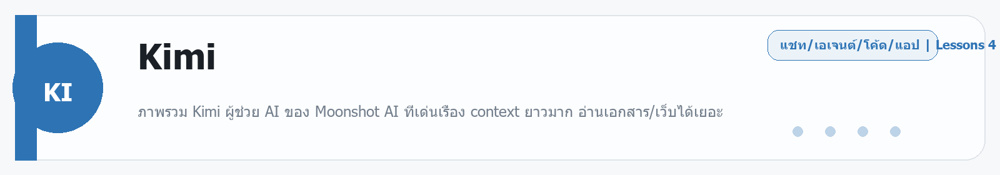

# Kimi
Source: https://ailab.learnnakdev.online/docs/kimi
Pages captured: 4

## Page 1 (หน้า 1 / 2)
```text
Kimi
คู่มืออย่างเป็นทางการ
4 เอกสาร
เริ่มต้น
Kimi คืออะไร — ผู้ช่วย AI สายอ่านยาว จาก Moonshot AI

ภาพรวม Kimi ผู้ช่วย AI ของ Moonshot AI ที่เด่นเรื่อง context ยาวมาก อ่านเอกสาร/เว็บได้เยอะ ·  6 นาที

หน้า 1 / 2
Kimi — ผู้ช่วย AI สายอ่านยาว 🌙

เรียบเรียงเป็นภาษาไทยจากเอกสารทางการของ Moonshot AI Platform และเว็บ kimi.com

Kimi คือผู้ช่วย AI ที่พัฒนาโดย Moonshot AI (月之暗面) บริษัท AI จากจีน จุดเด่นที่ทำให้ Kimi โดดเด่นคือ รองรับ context ที่ยาวมาก — อ่านเอกสารยาว ๆ หลายไฟล์ หรือเนื้อหาเว็บจำนวนมากในครั้งเดียวได้ดี เหมาะกับงานสรุป/วิเคราะห์เอกสารยาว ๆ

โมเดลตระกูลล่าสุดคือ Kimi K2 ซึ่งเป็นโมเดลแบบ open-weights (MoE) ที่เก่งทั้งงานเขียนโค้ดและงาน agent

📖 คำศัพท์ที่ควรรู้
คำศัพท์	ความหมายง่าย ๆ
Context window	"ความจำชั่วคราว" ที่ AI อ่านได้ในครั้งเดียว — ยิ่งยาว ยิ่งใส่เอกสารได้เยอะ
Kimi K2	โมเดลรุ่นเรือธงของ Moonshot (open-weights, สถาปัตยกรรม MoE)
Moonshot AI	บริษัทผู้สร้าง Kimi
API	ช่องทางให้นักพัฒนาเรียกใช้ Kimi ในแอปตัวเอง (เข้ากันได้กับรูปแบบ OpenAI)
Tool use	ให้โมเดลเรียกใช้เครื่องมือ/ฟังก์ชันภายนอก (เช่น ค้นเว็บ)
⭐ จุดเด่น
อ่านยาวได้จริง — รองรับ context ยาวมาก เหมาะกับสรุป/ถาม-ตอบจากเอกสาร PDF, รายงาน, โค้ดเบสยาว ๆ
อ่านไฟล์และลิงก์ — อัปโหลดไฟล์หรือวางลิงก์ แล้วให้ Kimi สรุป/วิเคราะห์
ค้นเว็บได้ — ดึงข้อมูลปัจจุบันมาตอบ
Kimi K2 เก่งงาน agent/โค้ด — ทำงานหลายขั้นตอนและเขียนโค้ดได้ดี
มี API เข้ากันได้กับ OpenAI — ย้ายโค้ดจาก OpenAI มาใช้ได้ง่าย
🚀 เริ่มต้นใช้งาน 2 ทาง

1) ผ่านแอป/เว็บ (ไม่ต้องเขียนโค้ด) — เข้า kimi.com แล้วแชต อัปโหลดไฟล์ หรือวางลิงก์ให้ช่วยสรุป/วิเคราะห์ได้ทันที

2) ผ่าน API (สำหรับนักพัฒนา) บน Moonshot AI Platform:

สมัครและสร้าง API key
เรียก endpoint แบบ Chat Completions (โครงสร้างเหมือน OpenAI) โดยระบุชื่อโมเดล เช่น kimi-k2 / moonshot-v1-*
ใช้ฟีเจอร์เสริม เช่น tool use / function calling และ context caching เพื่อลดต้นทุนเมื่อส่ง context ซ้ำ
📚 สารบัญเอกสาร Kimi (เรียงตาม official docs)
✅ ภาพรวม Kimi (หน้านี้)
⏳ เริ่มต้นใช้งาน — สมัครและสร้าง API key
⏳ Chat Completions API — เรียกใช้พื้นฐาน
⏳ โมเดลที่มี (Kimi K2 / Moonshot v1) และ context window
⏳ Tool Use / Function Calling
⏳ Context Caching — ประหยัดต้นทุนเมื่อใช้ context ซ้ำ
⏳ ราคาและข้อจำกัด
🔗 อ้างอิง (เอกสารทางการ)
Moonshot AI Platform (API): https://platform.moonshot.ai/
เว็บ/แอป Kimi: https://www.kimi.com/
 ก่อนหน้า
ถัดไป
Kimi: ฟีเจอร์แชท — บริบทยาว อ่านไฟล์ และค้นเว็บ
```

## Page 2 (หน้า 2 / 2)
```text
Kimi
คู่มืออย่างเป็นทางการ
4 เอกสาร
เริ่มต้น
Kimi: ฟีเจอร์แชท — บริบทยาว อ่านไฟล์ และค้นเว็บ

ใช้ Kimi คุย อ่านไฟล์ยาว ๆ และค้นข้อมูลจากเว็บ จุดเด่นด้านบริบทยาว ·  5 นาที

หน้า 2 / 2
ฟีเจอร์แชท Kimi 💬

เรียบเรียงเป็นภาษาไทยจากเอกสารทางการของ Kimi (Moonshot AI) — kimi.com

Kimi เป็นผู้ช่วย AI จาก Moonshot AI ที่ขึ้นชื่อเรื่อง บริบทยาวมาก (long context) — อ่านเอกสาร/ไฟล์ขนาดใหญ่ได้ในครั้งเดียว เหมาะกับงานสรุป วิเคราะห์ และค้นคว้า

⭐ จุดเด่น
ฟีเจอร์	อธิบาย
Long context	รับข้อความ/เอกสารยาวมากได้ในบทสนทนาเดียว
อ่านไฟล์	อัปโหลด PDF, Word, รูป ฯลฯ ให้สรุป/ถามต่อ
ค้นเว็บ	ดึงข้อมูลล่าสุดจากอินเทอร์เน็ตมาตอบ
หลายภาษา	เข้าใจและตอบได้หลายภาษา
▶️ การใช้งานทั่วไป
เข้า kimi.com แล้วเริ่มแชท
อัปโหลดไฟล์ (เช่น รายงาน PDF) แล้วถาม "สรุปประเด็นหลักให้หน่อย"
เปิดโหมดค้นเว็บเมื่ออยากได้ข้อมูลปัจจุบัน
ถามต่อเนื่องในบทสนทนาเดียว — Kimi จำบริบทยาว ๆ ได้
💡 เหมาะกับงานแบบไหน
สรุปเอกสาร/งานวิจัยยาว ๆ
เปรียบเทียบหลายไฟล์พร้อมกัน
ค้นคว้าหัวข้อที่ต้องอ้างอิงข้อมูลล่าสุด
📚 ถัดไป
โมเดล Kimi K2
เรียกใช้ผ่าน API
🔗 อ้างอิง
เว็บหลัก: https://www.kimi.com/
แพลตฟอร์มนักพัฒนา: https://platform.moonshot.ai/
 ก่อนหน้า
Kimi คืออะไร — ผู้ช่วย AI สายอ่านยาว จาก Moonshot AI
ถัดไป
Kimi: โมเดล K2 — โมเดลเปิดที่เก่งเรื่องเหตุผลและโค้ด
```

## Page 3 (หน้า 1 / 1)
```text
Kimi
คู่มืออย่างเป็นทางการ
4 เอกสาร
ระดับกลาง
Kimi: โมเดล K2 — โมเดลเปิดที่เก่งเรื่องเหตุผลและโค้ด

ทำความรู้จักตระกูลโมเดล Kimi K2 ของ Moonshot AI และจุดเด่น ·  5 นาที

หน้า 1 / 1
โมเดล Kimi K2 🧠

เรียบเรียงเป็นภาษาไทยจากเอกสารทางการของ Moonshot AI — platform.moonshot.ai

เบื้องหลัง Kimi คือตระกูลโมเดลของ Moonshot AI โดยรุ่นที่เป็นที่รู้จักคือ Kimi K2 ซึ่งเด่นเรื่องการให้เหตุผล การเขียนโค้ด และการทำงานแบบ agentic

⭐ จุดเด่นของ K2
เก่งเหตุผลและโค้ด — เหมาะกับงานคิดเป็นขั้นตอนและเขียนโปรแกรม
Agentic — ออกแบบให้เรียกใช้เครื่องมือ (tool use) และทำงานหลายขั้นตอน
บริบทยาว — รองรับ input ขนาดใหญ่
เป็นโมเดลเปิด (open weights) — บางรุ่นเปิดให้ดาวน์โหลด/รันเองได้ (เช่นผ่าน Hugging Face)
🔢 การเลือกใช้
ใน Kimi (เว็บ) ระบบเลือกโมเดลให้เหมาะกับงานอยู่แล้ว
ผ่าน API คุณระบุชื่อโมเดลเองได้ (ดูชื่อรุ่นล่าสุดในเอกสาร platform)
🆚 รุ่นเก่ง vs รุ่นเร็ว

โดยทั่วไปจะมีรุ่นที่เน้น คุณภาพ/เหตุผล กับรุ่นที่เน้น ความเร็ว/ต้นทุนต่ำ — เลือกตามงาน: งานคิดหนักใช้รุ่นเก่ง, งานสั้น/ปริมาณมากใช้รุ่นเร็ว

🔗 อ้างอิง
แพลตฟอร์มนักพัฒนา: https://platform.moonshot.ai/
โมเดลเปิดบน Hugging Face: https://huggingface.co/moonshotai
 ก่อนหน้า
Kimi: ฟีเจอร์แชท — บริบทยาว อ่านไฟล์ และค้นเว็บ
ถัดไป
Kimi: API — เรียกใช้โมเดล Moonshot ผ่านโค้ด
```

## Page 4 (หน้า 1 / 1)
```text
Kimi
คู่มืออย่างเป็นทางการ
4 เอกสาร
ขั้นโปร
Kimi: API — เรียกใช้โมเดล Moonshot ผ่านโค้ด

เรียกใช้โมเดล Kimi/Moonshot ผ่าน API ที่เข้ากันได้กับ OpenAI ·  5 นาที

หน้า 1 / 1
Kimi API — เรียกใช้จากโค้ด 🧑‍💻

เรียบเรียงเป็นภาษาไทยจากเอกสารทางการ platform.moonshot.ai

Moonshot AI เปิดให้เรียกโมเดล Kimi ผ่าน API ที่เข้ากันได้กับ OpenAI — ถ้าเคยใช้โค้ดแบบ OpenAI มาก่อน แค่เปลี่ยน base URL กับ key ก็ใช้ได้เลย

🔑 สิ่งที่ต้องเตรียม
สิ่งที่ต้องมี	อธิบาย
API key	สร้างในแพลตฟอร์มนักพัฒนา (เก็บเป็นความลับ)
Base URL	เอนด์พอยต์ของ Moonshot
Model	ชื่อรุ่นโมเดลที่จะใช้
🧱 ตัวอย่าง (รูปแบบ OpenAI-compatible)
from openai import OpenAI
client = OpenAI(
    api_key="YOUR_MOONSHOT_KEY",
    base_url="https://api.moonshot.ai/v1",
)
r = client.chat.completions.create(
    model="kimi-k2-...",   # ใส่ชื่อรุ่นตามเอกสารล่าสุด
    messages=[{"role": "user", "content": "สรุปข่าวนี้ให้หน่อย"}],
)
print(r.choices[0].message.content)

💡 เคล็ดลับ
ใช้ความสามารถ บริบทยาว ด้วยการส่งเอกสารเข้าไปใน messages
รองรับ tool use สำหรับงาน agentic
ดูชื่อรุ่น ราคา และลิมิตล่าสุดได้ที่เอกสาร platform
🔗 อ้างอิง
แพลตฟอร์มนักพัฒนา: https://platform.moonshot.ai/
 ก่อนหน้า
Kimi: โมเดล K2 — โมเดลเปิดที่เก่งเรื่องเหตุผลและโค้ด
ถัดไป
```


---

## Beginner Guide

### Kimi

Source: daily-ai-lab-ai-tools-32page-beginner-guide.docx



**หมวด:** Chat / Agent / Coding / App
**บทเรียนใน /docs:** 4 หน้า

**ใช้ทำอะไร**
ภาพรวม Kimi ผู้ช่วย AI ของ Moonshot AI ที่เด่นเรื่อง context ยาวมาก อ่านเอกสาร/เว็บได้เยอะ

**พื้นฐานที่ควรรู้**
พื้นฐานที่ควรรู้คือ prompt, context, file, workspace, และการตรวจผลลัพธ์ก่อนนำไปใช้งานจริง. มือใหม่ควรเริ่มจากงานเล็กที่วัดผลได้ เช่น สรุปเอกสาร แก้โค้ดสั้น ๆ หรือทำต้นแบบหน้าเว็บหนึ่งหน้า

**เหมาะกับมือใหม่แบบไหน**
เครื่องมือนี้เหมาะกับผู้เริ่มต้นที่อยากฝึกงาน Chat / Agent / Coding / App แบบสั้นและดูผลลัพธ์ได้เร็ว

**วิธีเริ่มแบบสั้น**
1. เปิด workspace หรือแชท แล้วให้โจทย์เดียวที่ชัดเจนพร้อมบริบทที่จำเป็น
2. แนบไฟล์ ตัวอย่าง หรือเป้าหมายที่อยากได้ เพื่อให้โมเดลอ่านภาพรวมได้เร็ว
3. ตรวจผลลัพธ์รอบแรก แล้วให้แก้แบบเฉพาะจุด เช่น tone, logic, code style หรือ structure

**ราคา/Plan**
Free Adagio; Moderato $19/month; Allegretto $39/month; Allegro $99/month; Vivace $199/month.

**สิ่งที่ควรจำ**
- จุดแข็ง: เครื่องมือนี้เหมาะกับผู้เริ่มต้นที่อยากฝึกงาน Chat / Agent / Coding / App แบบสั้นและดูผลลัพธ์ได้เร็ว
- ข้อควรระวัง: ระวัง prompt ที่กว้างเกินไปและตรวจโค้ดหรือเอกสารทุกครั้งก่อนนำไปใช้จริง.

**ตัวอย่างเริ่มต้น**
ตัวอย่างงานเริ่มต้น: ช่วยฉันทำงานนี้ให้จบในรอบแรก: งานเริ่มต้นของฉัน. นี่คือบริบทที่มีอยู่: ฉันมีเป้าหมายชัดและอยากได้ผลลัพธ์ที่ตรวจสอบได้. ขอผลลัพธ์เป็นขั้นตอนชัดเจนและตรวจสอบได้

---

---

<!-- merged-beginner-guide:Kimi -->
## คู่มือพื้นฐานของ Kimi

**หมวด:** Chat / Agent / Coding / App
**บทเรียนใน /docs:** 4 หน้า

**ใช้ทำอะไร**
ภาพรวม Kimi ผู้ช่วย AI ของ Moonshot AI ที่เด่นเรื่อง context ยาวมาก อ่านเอกสาร/เว็บได้เยอะ

**พื้นฐานที่ควรรู้**
พื้นฐานที่ควรรู้คือ prompt, context, file, workspace, และการตรวจผลลัพธ์ก่อนนำไปใช้งานจริง. มือใหม่ควรเริ่มจากงานเล็กที่วัดผลได้ เช่น สรุปเอกสาร แก้โค้ดสั้น ๆ หรือทำต้นแบบหน้าเว็บหนึ่งหน้า

**เหมาะกับมือใหม่แบบไหน**
เครื่องมือนี้เหมาะกับผู้เริ่มต้นที่อยากฝึกงาน Chat / Agent / Coding / App แบบสั้นและดูผลลัพธ์ได้เร็ว

**วิธีเริ่มแบบสั้น**
1. เปิด workspace หรือแชท แล้วให้โจทย์เดียวที่ชัดเจนพร้อมบริบทที่จำเป็น
2. แนบไฟล์ ตัวอย่าง หรือเป้าหมายที่อยากได้ เพื่อให้โมเดลอ่านภาพรวมได้เร็ว
3. ตรวจผลลัพธ์รอบแรก แล้วให้แก้แบบเฉพาะจุด เช่น tone, logic, code style หรือ structure

**ราคา/Plan**
Free Adagio; Moderato $19/month; Allegretto $39/month; Allegro $99/month; Vivace $199/month.

**สิ่งที่ควรจำ**
- จุดแข็ง: เครื่องมือนี้เหมาะกับผู้เริ่มต้นที่อยากฝึกงาน Chat / Agent / Coding / App แบบสั้นและดูผลลัพธ์ได้เร็ว
- ข้อควรระวัง: ระวัง prompt ที่กว้างเกินไปและตรวจโค้ดหรือเอกสารทุกครั้งก่อนนำไปใช้จริง.

**ตัวอย่างเริ่มต้น**
ตัวอย่างงานเริ่มต้น: ช่วยฉันทำงานนี้ให้จบในรอบแรก: งานเริ่มต้นของฉัน. นี่คือบริบทที่มีอยู่: ฉันมีเป้าหมายชัดและอยากได้ผลลัพธ์ที่ตรวจสอบได้. ขอผลลัพธ์เป็นขั้นตอนชัดเจนและตรวจสอบได้

---


