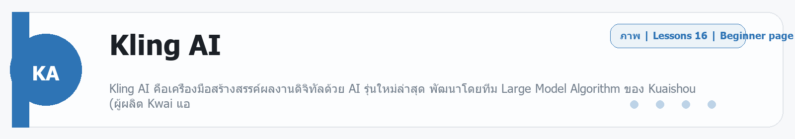
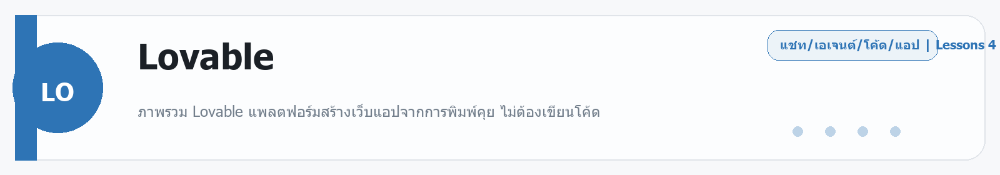

# Kling AI
Source: https://ailab.learnnakdev.online/docs/kling-ai
Pages captured: 16

## Page 1 (หน้า 1 / 3)
```text
Kling AI
คู่มืออย่างเป็นทางการ
16 เอกสาร
เริ่มต้น
ภาพรวมและเริ่มต้นใช้งาน

Kling AI คือเครื่องมือสร้างสรรค์ผลงานดิจิทัลด้วย AI รุ่นใหม่ล่าสุด พัฒนาโดยทีม Large Model Algorithm ของ Kuaishou (ผู้ผลิต Kwai แอ ·  3 นาที

หน้า 1 / 3
01 · ภาพรวมและเริ่มต้นใช้งาน Kling AI

อ้างอิง Official Docs:

Overview
Quick Start
Changelog
1. Kling AI คืออะไร
หัวข้อนี้คืออะไร

Kling AI คือเครื่องมือสร้างสรรค์ผลงานดิจิทัลด้วย AI รุ่นใหม่ล่าสุด พัฒนาโดยทีม Large Model Algorithm ของ Kuaishou (ผู้ผลิต Kwai แอปพลิเคชันวิดีโอชื่อดัง) โดยรวมเทคโนโลยีสองชิ้นหลัก คือ:

@Kolors → เทคโนโลยีสร้างภาพ (Image Generation)
@Kling → เทคโนโลยีสร้างวิดีโอ (Video Generation)

เข้าด้วยกันเป็นแพลตฟอร์มเดียวที่ทำได้ทั้งภาพและวิดีโอ พร้อมเครื่องมือแก้ไขคอนเทนต์แบบควบคุมได้

ใช้ทำอะไรได้บ้าง

Kling AI รองรับสองกลุ่มผู้ใช้หลัก:

[1] สำหรับนักสร้างสรรค์ (บุคคลทั่วไป / องค์กร)

มีแพลตฟอร์มสร้างออนไลน์บนเว็บและมือถือ
เข้าใช้งานได้ที่: kling.ai/app

[2] สำหรับนักพัฒนา (บุคคลทั่วไป / องค์กร)

มี API สำหรับนำไปต่อยอดในระบบของตัวเอง
เข้าถึง API ได้ที่: kling.ai/dev
สรุปสั้นๆ

Kling AI = แพลตฟอร์ม AI สร้างภาพ + วิดีโอ ระดับมืออาชีพ จาก Kuaishou พร้อม API สำหรับนักพัฒนา

2. Quick Start — เริ่มต้นใช้งาน API ใน 5 ขั้นตอน

อ้างอิง: Quick Start Guide

หัวข้อนี้คืออะไร

คู่มือเริ่มต้นแบบละเอียดสำหรับการเชื่อมต่อ API บริการของ Kling AI ตั้งแต่ต้นจนใช้งานได้จริง

วิธีใช้งาน (Step-by-Step)
ขั้นที่ 1: เข้าสู่ KlingAI API Platform
ไปที่ https://kling.ai/dev
ดูหน้า Product ที่ต้องการ:
Video Generation Model → kling.ai/dev/pricing?scrollTo=video
Image Generation Model → kling.ai/dev/pricing?scrollTo=image
Intelligent Scenarios (Virtual Try-On) → kling.ai/dev/pricing?scrollTo=tryon
ขั้นที่ 2: ซื้อ Resource Package (แพ็กเกจทรัพยากร)

มีแพ็กเกจ 3 ประเภทให้เลือก:

Video Generation Package — สำหรับสร้างวิดีโอ
Image Generation Package — สำหรับสร้างภาพ
Virtual Try-On Package — สำหรับลองเสื้อผ้าเสมือนจริง

💡 มี Trial Resource Package (แพ็กเกจทดลอง) สำหรับทดสอบก่อนซื้อจริงด้วย

ขั้นที่ 3: รับ API Credentials (ข้อมูลยืนยันตัวตน)

หลังซื้อแพ็กเกจแล้ว ไปที่หน้า Account เพื่อรับ:

AccessKey (ak) — รหัสประจำตัว
SecretKey (sk) — รหัสลับ

⚠️ เก็บ SecretKey ไว้เป็นความลับ ห้ามแชร์ให้ใคร

ขั้นที่ 4: เชื่อมต่อ API

ใช้ข้อมูลจากขั้นที่ 3 สร้าง JWT Token แล้วเรียก API ได้เลย (ดูรายละเอียดวิธีสร้าง JWT ในไฟล์ 02-api-reference-ทั่วไป.md)

Base URL:

https://api-singapore.klingai.com

ขั้นที่ 5: ทดสอบการทำงาน

เรียก API ง่ายๆ ก่อน เช่น สร้างวิดีโอจาก Text:

import requests

API_TOKEN = "your_jwt_token_here"
BASE_URL = "https://api-singapore.klingai.com"

response = requests.post(
    f"{BASE_URL}/v1/videos/text2video",
    headers={
        "Authorization": f"Bearer {API_TOKEN}",
        "Content-Type": "application/json"
    },
    json={
        "model": "kling-v2-6",
        "prompt": "A cat playing piano in a cozy jazz bar, warm lighting",
        "duration": "5",
        "aspect_ratio": "16:9"
    }
)

data = response.json()
task_id = data["data"]["task_id"]
print(f"Task ID: {task_id}")


จากนั้นใช้ task_id ไป query ดูสถานะจนเสร็จ

ข้อควรระวัง
วิดีโอที่สร้างแล้วจะ ถูกลบภายใน 30 วัน ดาวน์โหลดให้ทันก่อนหมดอายุ
URL ของผลลัพธ์ใช้ได้ ชั่วคราวเท่านั้น ควรบันทึกทันทีที่ได้รับ
การเรียก API แบบ Async — ต้อง poll (ถามซ้ำ) ดูสถานะจนงานเสร็จ
3. Changelog — อัปเดตล่าสุด

อ้างอิง: Changelog

สิ่งที่น่าสนใจในอัปเดตล่าสุด (2026)

🚀 Kling Native 4K (Kling VIDEO 3.0)

Kling รองรับ การสร้างวิดีโอ 4K แบบ Native ด้วยคลิกเดียว เหมาะสำหรับ:

งานโฆษณา
ภาพยนตร์
คอนเทนต์เชิงพาณิชย์

ข้อดีของ Native 4K:

คุณภาพระดับมืออาชีพ ไม่มีการ upscale ที่ทำให้ภาพเสีย
ง่ายต่อการใช้งาน ไม่ต้องมีความรู้ด้านเทคนิค
คุ้มค่ากว่าเครื่องมือ third-party ราคาแพง

💳 เปลี่ยนระบบชำระเงินเป็น Stripe

จาก Checkout มาเป็น Stripe เพื่อความปลอดภัยและสะดวกยิ่งขึ้น

⚠️ หากซื้อในนามองค์กรและต้องการใบกำกับภาษี ต้องเลือก "I'm purchasing as a business" และกรอก Tax ID ตอนชำระเงิน มิฉะนั้นจะถือเป็นการซื้อส่วนตัว และไม่สามารถแก้ไขรายละเอียดใบกำกับภาษีได้ในภายหลัง

 ก่อนหน้า
ถัดไป
API Reference — ข้อมูลทั่วไป
```

## Page 2 (หน้า 2 / 3)
```text
Kling AI
คู่มืออย่างเป็นทางการ
16 เอกสาร
เริ่มต้น
API Reference — ข้อมูลทั่วไป

https://api-singapore.klingai.com ·  5 นาที

หน้า 2 / 3
02 · API Reference — ข้อมูลทั่วไป

อ้างอิง Official Docs:

General Info
Rate Limits
Callback Schema
1. General Information — ข้อมูลทั่วไป

อ้างอิง: General Info

1.1 API Domain (Endpoint หลัก)
https://api-singapore.klingai.com


หมายเหตุ: ที่อยู่ API เดิม (https://api.klingai.com) ถูกเปลี่ยนมาใช้ api-singapore.klingai.com แล้ว ให้ใช้ endpoint ใหม่เสมอ

1.2 API Authentication — การยืนยันตัวตน

Kling AI ใช้ JWT (JSON Web Token) ในการยืนยันตัวตน ซึ่งต่างจาก API Key ธรรมดา ตรงที่ต้องสร้าง Token ใหม่ทุกครั้งที่เรียก API

วิธีสร้าง JWT Token (3 ขั้นตอน)

ขั้นที่ 1: รับ AccessKey และ SecretKey จากหน้า Account ของ Kling AI

ขั้นที่ 2: สร้าง JWT Token โดยใช้การเข้ารหัสแบบ HS256

ข้อมูลใน JWT:

ส่วน	รายละเอียด
Header	alg: HS256, typ: JWT
Payload iss	ใส่ค่า AccessKey
Payload exp	เวลาหมดอายุ = เวลาปัจจุบัน + 1800 วินาที (30 นาที)
Payload nbf	เวลาเริ่มใช้งาน = เวลาปัจจุบัน − 5 วินาที
import time
import jwt  # pip install PyJWT

def encode_jwt_token(ak: str, sk: str) -> str:
    headers = {
        "alg": "HS256",
        "typ": "JWT"
    }
    payload = {
        "iss": ak,                          # AccessKey
        "exp": int(time.time()) + 1800,     # หมดอายุใน 30 นาที
        "nbf": int(time.time()) - 5         # เริ่มใช้ได้ก่อน 5 วินาที
    }
    token = jwt.encode(payload, sk, algorithm="HS256", headers=headers)
    return token

# สร้าง Token
token = encode_jwt_token("your_access_key", "your_secret_key")
print(f"API Token: {token}")


ขั้นที่ 3: ใส่ Token ใน Request Header ทุกครั้งที่เรียก API

Authorization: Bearer <TOKEN_ที่สร้างจากขั้นที่_2>


⚠️ ต้องมีช่องว่างระหว่าง Bearer และ Token เสมอ

1.3 Error Code — รหัสข้อผิดพลาด
HTTP Status	Service Code	ประเภท	ความหมาย	วิธีแก้
200	-	สำเร็จ	Request สำเร็จ	-
401	1000	Authentication Failed	ยืนยันตัวตนล้มเหลว	ตรวจสอบ Authorization Header
401	1001	Authentication Failed	ไม่มี Authorization	ใส่ Authorization Header ให้ถูกต้อง
401	1002	Authentication Failed	Authorization ไม่ถูกต้อง	ตรวจสอบรูปแบบ Authorization
401	1003	Authentication Failed	Token ยังไม่ถึงเวลาใช้ได้	รอให้ Token มีผล หรือสร้างใหม่
401	1004	Authentication Failed	Token หมดอายุแล้ว	สร้าง Token ใหม่
429	1100	Account Exception	บัญชีมีปัญหา	ตรวจสอบการตั้งค่าบัญชี
429	1101	Account Exception	บัญชีติดค้างชำระ	เติมเงินให้เพียงพอ
429	1102	Account Exception	Resource Pack หมดหรือหมดอายุ	ซื้อแพ็กเกจเพิ่ม
403	1103	Account Exception	ไม่มีสิทธิ์ใช้ API/Model นั้น	ตรวจสอบ Permission บัญชี
400	1200	Invalid Parameters	พารามิเตอร์ไม่ถูกต้อง	ตรวจสอบพารามิเตอร์ทั้งหมด
400	1201	Invalid Parameters	Key หรือค่าพารามิเตอร์ผิด	ดูข้อความใน message field
404	1202	Invalid Parameters	HTTP Method ไม่ถูกต้อง	ใช้ Method ให้ตรงตาม Docs
404	1203	Invalid Parameters	Resource ไม่มีอยู่ (เช่น Model)	ดูข้อความใน message field
400	1300	Policy Triggered	ผิด Platform Policy	ตรวจสอบว่าทำอะไรผิดกฎ
400	1301	Policy Triggered	เนื้อหาละเมิด Content Policy	แก้ไข Prompt แล้วส่งใหม่
429	1302	Policy Triggered	เรียก API เร็วเกินไป (Rate Limit)	ลด Frequency หรือติดต่อ Support
429	1303	Policy Triggered	เกิน Concurrency ของแพ็กเกจ	ลด Frequency, รอแล้วลองใหม่
429	1304	Policy Triggered	IP ไม่อยู่ใน Whitelist	ติดต่อ Support
500	5000	Internal Error	Server Error	รอแล้วลองใหม่ หรือติดต่อ Support
503	5001	Internal Error	Server ชั่วคราวไม่พร้อม (บำรุงรักษา)	รอแล้วลองใหม่
504	5002	Internal Error	Server Timeout (งานค้างคิว)	รอแล้วลองใหม่
2. Rate Limits — ข้อจำกัดการใช้งานพร้อมกัน

อ้างอิง: Rate Limits / Concurrency Rules

หัวข้อนี้คืออะไร

Kling API Concurrency หมายถึงจำนวนงาน (Task) สูงสุดที่บัญชีสามารถประมวลผลพร้อมกันได้ในเวลาเดียวกัน ซึ่งขึ้นอยู่กับแพ็กเกจทรัพยากรที่ซื้อไว้

กฎหลักของ Concurrency
มิติ	รายละเอียด
ระดับการนับ	นับที่ระดับบัญชี (Account Level) แยกคำนวณตามประเภท Resource Pack (Video/Image/Try-On)
เวลาที่นับ	นับตั้งแต่งานอยู่ในสถานะ submitted จนกว่าจะ succeed หรือ failed
การคำนวณ Quota	ใช้ค่า Concurrency สูงสุดจากแพ็กเกจที่ Active ทั้งหมด เช่น ถ้ามีแพ็กเกจ A (5 concurrent) และ B (10 concurrent) พร้อมกัน ค่าที่ใช้ = 10

หมายเหตุ: Concurrency Limit ใช้กับ การสร้างงาน (Create Task) เท่านั้น การ Query ดูสถานะไม่นับ

การนับ Concurrency ต่อประเภทงาน
วิดีโอ / Virtual Try-On: งาน 1 ชิ้น = ใช้ 1 Concurrency เสมอ
รูปภาพ: ใช้ Concurrency = ค่าพารามิเตอร์ n ที่ส่งไป เช่น ขอสร้างรูป 9 ภาพ = ใช้ 9 Concurrency
เมื่อเกิน Limit จะได้ Error นี้
{
  "code": 1303,
  "message": "parallel task over resource pack limit",
  "request_id": "9984d27b-a408-4073-ae28-17ca6a13622d"
}

วิธีแก้ที่แนะนำ

1. Backoff Retry Strategy — ถ้าได้รับ Error 1303 ให้รอก่อนแล้วลองใหม่ โดยใช้ Exponential Backoff (รอเพิ่มขึ้นเรื่อยๆ) เริ่มต้นรอ ≥ 1 วินาที

2. Queue Management — ควบคุมอัตราการส่งงานผ่าน Task Queue และปรับตาม Concurrency ที่มีอยู่ในขณะนั้น

3. Callback Schema — รูปแบบการแจ้งผลลัพธ์

อ้างอิง: Callback Protocol

หัวข้อนี้คืออะไร

เนื่องจาก Kling API ทำงานแบบ Asynchronous (ไม่รอผล) เมื่องานเสร็จ ระบบสามารถส่งผลไปยัง URL ที่กำหนด (Callback URL) ได้โดยอัตโนมัติ แทนที่จะต้องมาถามสถานะตลอดเวลา

โครงสร้างข้อมูล Callback (JSON)
{
  "task_id": "string",           // Task ID ที่ระบบสร้างให้
  "task_status": "string",       // สถานะ: submitted | processing | succeed | failed
  "task_status_msg": "string",   // ข้อความสถานะ (แสดงสาเหตุถ้า failed)
  "created_at": 1722769557708,   // เวลาสร้างงาน (Unix timestamp, ms)
  "updated_at": 1722769557708,   // เวลาอัปเดตล่าสุด (Unix timestamp, ms)
  "final_unit_deduction": "string", // จำนวน Unit ที่หักไป
  "task_info": { ... },          // พารามิเตอร์ที่ส่งตอนสร้างงาน
  "external_task_id": "string",  // Task ID ที่ผู้ใช้กำหนดเอง (ถ้ามี)
  "task_result": {
    "images": [                  // ผลลัพธ์งานรูปภาพ
      {
        "index": 0,              // ลำดับรูป
        "url": "string"          // URL รูปที่สร้าง (ชั่วคราว!)
      }
    ],
    "videos": [                  // ผลลัพธ์งานวิดีโอ
      {
        "id": "string",          // Video ID (Unique ทั่วโลก)
        "url": "string",         // URL วิดีโอที่สร้าง (ชั่วคราว!)
        "duration": "string"     // ความยาววิดีโอ (วินาที)
      }
    ]
  }
}

สถานะของงาน (Task Status)
Status	ความหมาย
submitted	งานถูกส่งและรอประมวลผล
processing	กำลังสร้างอยู่
succeed	สำเร็จ — พร้อมดาวน์โหลด
failed	ล้มเหลว — ดูสาเหตุใน task_status_msg
ข้อควรระวัง

⚠️ URL ของรูปภาพและวิดีโอเป็นแบบชั่วคราว — จะถูกลบหลังจากสักระยะ ดาวน์โหลดและบันทึกไว้ทันทีที่ได้รับผล

วิธีใช้ Callback URL

เมื่อสร้างงาน ใส่พารามิเตอร์ callback_url ในคำขอ:

{
  "model": "kling-v2-6",
  "prompt": "...",
  "callback_url": "https://your-server.com/kling-callback"
}


ระบบจะ POST ผลลัพธ์มาที่ URL นั้นโดยอัตโนมัติเมื่องานเสร็จ

 ก่อนหน้า
ภาพรวมและเริ่มต้นใช้งาน
ถัดไป
Video Generation — การสร้างวิดีโอ
```

## Page 3 (หน้า 3 / 3)
```text
Kling AI
คู่มืออย่างเป็นทางการ
16 เอกสาร
เริ่มต้น
Video Generation — การสร้างวิดีโอ

ส่ง Prompt (คำอธิบาย) เป็นข้อความ แล้ว AI จะสร้างวิดีโอให้ตาม Prompt นั้น ·  6 นาที

หน้า 3 / 3
03 · Video Generation — การสร้างวิดีโอ

อ้างอิง Official Docs:

Video Models
Video Omni
Text to Video
Image to Video
Reference to Video
Motion Control
Multi-elements to Video
Extend Video
1. Video Models — โมเดลวิดีโอทั้งหมด

อ้างอิง: Video Models

โมเดลหลัก (แนะนำ)
kling-v3 / kling-v3-omni (รุ่นล่าสุด)
รายการ	รายละเอียด
Mode	std / pro
ความยาว	3–15 วินาที
Text to Video	✅ Single-shot และ Multi-shot
Image to Video	✅ Single-shot, Multi-shot, Start+End Frame
Element Control	✅ Video Character + Multi-image Elements
Motion Control	✅
Voice Control	✅

kling-v3-omni รองรับฟีเจอร์เพิ่มเติม เช่น Multi-shot และ Video Reference

kling-video-o1 (Unified Multimodal)
รายการ	รายละเอียด
Mode	std / pro
ความยาว	3–10 วินาที (เฉพาะ 5s หรือ 10s)
Text to Video	✅
Image to Video	✅ (เฉพาะ Start Frame)
Voice Control	✅
kling-v2-6 (รุ่นก่อนหน้า)
รายการ	รายละเอียด
Mode	std / pro
ความยาว	5s, 10s, และความยาวอื่นๆ
Native Audio	✅ (เฉพาะเวอร์ชัน no-audio)
Motion Control	✅
Voice Control	✅
โมเดลรุ่นเก่า (Legacy)
Model	Modes	ความสามารถหลัก
kling-v2-5-turbo	std/pro 5s, 10s	ความเร็วสูงสุด
kling-v2-1	std/pro 5s, 10s	ครบทุกฟีเจอร์
kling-v2-master	10s only	คุณภาพสูงสุด
kling-v1-6	std/pro 5s, 10s	รองรับ Multi-image to Video
kling-v1-5	std/pro 5s, 10s	Motion Brush + Camera Control
kling-v1	std/pro 5s, 10s	Camera Control
ความละเอียดและ Frame Rate
Model	Mode	Resolution	FPS
kling-v1 (std)	STD	720p	30fps
kling-v1 (pro)	PRO	720p	30fps
kling-v1-5 (pro)	PRO	1080p	30fps
kling-v2-1 (std)	STD	720p	24fps
kling-v2-1 (pro)	PRO	1080p	24fps
kling-v2-5	PRO	1080p	24fps
2. Text to Video — สร้างวิดีโอจากข้อความ

อ้างอิง: Text to Video

หัวข้อนี้คืออะไร

ส่ง Prompt (คำอธิบาย) เป็นข้อความ แล้ว AI จะสร้างวิดีโอให้ตาม Prompt นั้น

API Endpoint
POST https://api-singapore.klingai.com/v1/videos/text2video

Request Header
Authorization: Bearer <JWT_TOKEN>
Content-Type: application/json

Request Body — พารามิเตอร์
พารามิเตอร์	ประเภท	จำเป็น	ค่าเริ่มต้น	คำอธิบาย
model	string	✅	-	ชื่อโมเดล เช่น kling-v2-6, kling-v3
prompt	string	✅	-	คำอธิบายวิดีโอ (Prompt)
negative_prompt	string	❌	-	สิ่งที่ ไม่ต้องการ ให้มีในวิดีโอ
cfg_scale	float	❌	0.5	ระดับที่ AI ยึดตาม Prompt (0–1, มากขึ้น = ตาม Prompt มากขึ้น)
mode	string	❌	std	คุณภาพ: std (มาตรฐาน) หรือ pro (คุณภาพสูง)
duration	string	❌	5	ความยาววิดีโอ: "5" หรือ "10" (วินาที)
aspect_ratio	string	❌	16:9	อัตราส่วนภาพ: 16:9, 9:16, 1:1
callback_url	string	❌	-	URL รับผลลัพธ์อัตโนมัติ
external_task_id	string	❌	-	Task ID ที่กำหนดเอง
ตัวอย่างการใช้งาน
import requests, time, jwt

def get_token(ak, sk):
    payload = {"iss": ak, "exp": int(time.time()) + 1800, "nbf": int(time.time()) - 5}
    return jwt.encode(payload, sk, algorithm="HS256", headers={"alg": "HS256", "typ": "JWT"})

token = get_token("YOUR_AK", "YOUR_SK")
BASE = "https://api-singapore.klingai.com"

# สร้าง Task
resp = requests.post(f"{BASE}/v1/videos/text2video",
    headers={"Authorization": f"Bearer {token}", "Content-Type": "application/json"},
    json={
        "model": "kling-v2-6",
        "prompt": "แมวขาวกำลังเล่นเปียโนในบาร์แจ๊ซบรรยากาศอบอุ่น แสงสีทอง",
        "negative_prompt": "ภาพเบลอ คุณภาพต่ำ",
        "cfg_scale": 0.7,
        "mode": "pro",
        "duration": "5",
        "aspect_ratio": "16:9"
    }
)
task_id = resp.json()["data"]["task_id"]
print(f"Task created: {task_id}")

# Query จนเสร็จ
while True:
    status = requests.get(f"{BASE}/v1/videos/text2video/{task_id}",
        headers={"Authorization": f"Bearer {token}"}).json()
    s = status["data"]["task_status"]
    print(f"Status: {s}")
    if s in ["succeed", "failed"]:
        break
    time.sleep(10)

if s == "succeed":
    url = status["data"]["task_result"]["videos"][0]["url"]
    print(f"Video URL: {url}")

Multi-Shot Text to Video

สำหรับโมเดล kling-v3 / kling-v3-omni รองรับการสร้างวิดีโอแบบหลายช็อต (Multi-shot) โดยใส่คำอธิบายแต่ละฉากในรูปแบบที่กำหนด

3. Image to Video — สร้างวิดีโอจากรูปภาพ

อ้างอิง: Image to Video

หัวข้อนี้คืออะไร

ส่งรูปภาพเป็น "จุดเริ่มต้น" หรือ "จุดเริ่มและจุดจบ" แล้ว AI จะสร้างการเคลื่อนไหวที่เป็นธรรมชาติให้

API Endpoint
POST https://api-singapore.klingai.com/v1/videos/image2video

พารามิเตอร์หลัก
พารามิเตอร์	ประเภท	จำเป็น	คำอธิบาย
model	string	✅	ชื่อโมเดล
image	string	✅	URL หรือ Base64 ของรูป Start Frame
image_tail	string	❌	URL หรือ Base64 ของรูป End Frame
prompt	string	❌	คำอธิบายการเคลื่อนไหว
negative_prompt	string	❌	สิ่งที่ไม่ต้องการ
cfg_scale	float	❌	ระดับยึดตาม Prompt (0–1)
mode	string	❌	std หรือ pro
duration	string	❌	"5" หรือ "10" วินาที
รูปแบบที่รองรับ
Start Frame only — กำหนดเฉพาะภาพเริ่มต้น AI สร้างการเคลื่อนไหวต่อเอง
Start + End Frame — กำหนดทั้งจุดเริ่มและจุดจบ AI สร้าง transition ตรงกลาง (รองรับใน kling-v1-5, kling-v2-1, kling-v3)
ตัวอย่าง
resp = requests.post(f"{BASE}/v1/videos/image2video",
    headers={"Authorization": f"Bearer {token}", "Content-Type": "application/json"},
    json={
        "model": "kling-v2-6",
        "image": "https://example.com/cat.jpg",  # Start Frame
        "prompt": "แมวค่อยๆ หันหน้ามามองกล้อง ขยิบตาอย่างน่ารัก",
        "mode": "pro",
        "duration": "5"
    }
)

4. Reference to Video — สร้างวิดีโอจากรูปอ้างอิงหลายภาพ

อ้างอิง: Reference to Video

หัวข้อนี้คืออะไร

ใช้รูปภาพหลายภาพเป็น "ตัวอ้างอิง" เพื่อให้ AI รักษาความสม่ำเสมอของตัวละคร สไตล์ หรือสิ่งของในวิดีโอ เหมาะสำหรับ:

รักษาหน้าตาของตัวละครให้เหมือนกันตลอด
ควบคุมสไตล์ภาพ
นำวัตถุจากหลายภาพมาอยู่ในวิดีโอเดียวกัน
API Endpoint
POST https://api-singapore.klingai.com/v1/videos/multi-image2video

พารามิเตอร์หลัก
พารามิเตอร์	ประเภท	คำอธิบาย
model	string	ชื่อโมเดล (รองรับ: kling-v1-6, kling-v3, kling-v3-omni)
image_list	array	รายการรูปภาพอ้างอิง (URL หรือ Base64)
prompt	string	คำอธิบายการเคลื่อนไหว
mode	string	std หรือ pro
duration	string	ความยาววิดีโอ
5. Motion Control — ควบคุมการเคลื่อนไหวกล้อง

อ้างอิง: Motion Control

หัวข้อนี้คืออะไร

ควบคุมการเคลื่อนที่ของกล้องในวิดีโอได้อย่างแม่นยำ เช่น ซูมเข้า ซูมออก หมุน เลื่อน — เหมือนเป็นผู้กำกับกล้องจริงๆ

รองรับโมเดล
kling-v2-6 (Motion Control)
kling-v3 (Motion Control)
kling-v1 / kling-v1-5 (Camera Control)
ประเภทการควบคุมกล้อง
ประเภท	รายละเอียด
Simple	เลือกจากท่ากล้องมาตรฐาน เช่น Pan Left/Right, Tilt Up/Down, Zoom In/Out, Roll
Advanced	กำหนดพิกัดกล้องแบบ 6DoF (6 Degrees of Freedom) ได้ละเอียดมาก
Motion Brush	วาดทิศทางการเคลื่อนไหวบนรูปโดยตรง (รองรับใน kling-v1-5)
6. Multi-elements to Video — วิดีโอจากหลาย Element

อ้างอิง: Multi-elements to Video

หัวข้อนี้คืออะไร

นำ "Element" (ตัวละคร สิ่งของ ฉากหลัง ที่สร้างไว้แล้ว) มาผสมกันเป็นวิดีโอเดียว โดยรักษาความสม่ำเสมอของแต่ละ Element

ใช้ทำอะไร
สร้างวิดีโอที่มีตัวละครจาก Element ที่กำหนดไว้ล่วงหน้า
ควบคุมได้ว่าใครหรืออะไรจะอยู่ในวิดีโอ
เหมาะสำหรับงานโฆษณา สื่อการเรียนรู้ หรือ Storytelling
API Endpoint
POST https://api-singapore.klingai.com/v1/videos/multi-elements

7. Extend Video — ต่อวิดีโอให้ยาวขึ้น

อ้างอิง: Extend Video

หัวข้อนี้คืออะไร

ต่อความยาววิดีโอที่มีอยู่แล้วให้ยาวขึ้น โดย AI จะสร้างส่วนต่อเนื่องที่ดูสมเหตุสมผลและกลมกลืนกับต้นฉบับ

ใช้ทำอะไร
ต้องการให้วิดีโอ 5 วินาทียาวขึ้นเป็น 10+ วินาที
สร้างวิดีโอยาวจากช็อตสั้นๆ หลายช็อต
API Endpoint
POST https://api-singapore.klingai.com/v1/videos/extend

พารามิเตอร์หลัก
พารามิเตอร์	ประเภท	คำอธิบาย
video_id	string	ID ของวิดีโอต้นฉบับที่ต้องการต่อ
prompt	string	คำอธิบายส่วนที่ต้องการต่อ (ไม่บังคับ)
cfg_scale	float	ระดับยึดตาม Prompt
ข้อควรระวัง
kling-v1 และ kling-v2-master ไม่รองรับ negative_prompt และ cfg_scale ใน Extend Video
ต้องใช้ video_id ของวิดีโอที่สร้างจาก Kling API เท่านั้น
 ก่อนหน้า
API Reference — ข้อมูลทั่วไป
ถัดไป
Video Features — ฟีเจอร์พิเศษสำหรับวิดีโอ
```

## Page 4 (หน้า 1 / 9)
```text
Kling AI
คู่มืออย่างเป็นทางการ
16 เอกสาร
ระดับกลาง
Video Features — ฟีเจอร์พิเศษสำหรับวิดีโอ

Lip Sync ใช้ AI ทำให้การขยับปากของตัวละครในวิดีโอตรงกับเสียงที่ให้มา ไม่ว่าจะเป็นการพูด ร้องเพลง หรือบทสนทนา ·  4 นาที

หน้า 1 / 9
04 · Video Features — ฟีเจอร์พิเศษสำหรับวิดีโอ

อ้างอิง Official Docs:

Lip Sync
Avatar
Video Effects
Effect Templates
Video Omni
1. Lip Sync — ซิงค์ริมฝีปากกับเสียง

อ้างอิง: Lip Sync

หัวข้อนี้คืออะไร

Lip Sync ใช้ AI ทำให้การขยับปากของตัวละครในวิดีโอตรงกับเสียงที่ให้มา ไม่ว่าจะเป็นการพูด ร้องเพลง หรือบทสนทนา

ใช้ทำอะไร
Dubbing วิดีโอเป็นหลายภาษา
สร้างตัวละคร AI พูดจากข้อความที่กำหนด
ทำให้ตัวละครในวิดีโอขยับปากตรงกับเสียง
API Endpoint
POST https://api-singapore.klingai.com/v1/videos/lip-sync

พารามิเตอร์หลัก
พารามิเตอร์	ประเภท	จำเป็น	คำอธิบาย
video_id	string	✅ (ถ้าไม่ใช้ URL)	ID วิดีโอต้นฉบับจาก Kling
video_url	string	✅ (ถ้าไม่ใช้ ID)	URL วิดีโอที่ต้องการซิงค์
mode	string	✅	วิธีให้เสียง: text2audio (ข้อความ→เสียง) หรือ audio2lip (ใช้เสียงที่มี)
tts_text	string	❌	ข้อความที่ต้องการให้พูด (สำหรับ mode: text2audio)
tts_timbre	string	❌	สไตล์เสียงพูด (timbre)
tts_speed	float	❌	ความเร็วการพูด
audio_url	string	❌	URL เสียงที่ต้องการซิงค์ (สำหรับ mode: audio2lip)
ราคา

ประมาณ $0.10 ต่อทุก 5 วินาที

ข้อควรระวัง
วิดีโอต้นฉบับต้องมีใบหน้าคนที่ชัดเจน
รองรับวิดีโอทั้งที่สร้างจาก Kling และวิดีโออัปโหลดจากภายนอก
รองรับภาษาอังกฤษ จีน ญี่ปุ่น เกาหลี
2. Avatar — ดิจิทัลฮิวแมนจากรูปเดียว

อ้างอิง: Avatar

หัวข้อนี้คืออะไร

สร้างวิดีโอดิจิทัลฮิวแมน (Digital Human) ที่พูดและขยับปากตรงกับเสียงที่กำหนด โดยใช้เพียง รูปภาพหน้าตรงหนึ่งรูป — ราวกับว่ารูปในรูปนั้นมีชีวิตขึ้นมาพูด

ใช้ทำอะไร
สร้างโฆษกเสมือน (Virtual Spokesperson) สำหรับแบรนด์
ทำวิดีโอสอน/บรรยายโดยมีตัวละคร AI
สร้าง AI Presenter จากรูปถ่ายบุคคล
ความสามารถพิเศษ
ฟีเจอร์	รายละเอียด
Kling Avatar 2.0	สร้างวิดีโอต่อเนื่องได้นานถึง 5 นาที
ความละเอียด	1080p / 48 FPS
ภาษาที่รองรับ	อังกฤษ, จีน, ญี่ปุ่น, เกาหลี
Lip Sync	แม่นยำสูง รองรับการร้องเพลง บทสนทนาเร็ว
API Endpoint
POST https://api-singapore.klingai.com/v1/videos/avatar

พารามิเตอร์หลัก
พารามิเตอร์	ประเภท	จำเป็น	คำอธิบาย
avatar_image	string	✅	URL หรือ Base64 รูปหน้าตรงชัดเจน
audio_url	string	✅ (หรือ tts)	URL เสียงที่ต้องการ
tts_text	string	✅ (หรือ audio)	ข้อความที่ต้องการให้พูด
tts_voice	string	❌	เสียงพูดที่ต้องการใช้
prompt	string	❌	คำอธิบายเพิ่มเติม เช่น สไตล์ท่าทาง
ข้อควรระวัง
รูปต้องเป็น ใบหน้าหน้าตรงชัดเจน ไม่มีวัตถุบัง
ความยาววิดีโอขึ้นอยู่กับความยาวเสียง
3. Video Effects — เอฟเฟกต์พิเศษสำหรับวิดีโอ

อ้างอิง: Video Effects

หัวข้อนี้คืออะไร

ใส่เอฟเฟกต์พิเศษลงในวิดีโอที่มีอยู่ หรือสร้างวิดีโอใหม่พร้อมเอฟเฟกต์ ใช้สำหรับทำ Content ที่มีการโต้ตอบ เช่น Hug, Kiss, หรือท่าทางพิเศษระหว่างสองตัวละคร

ประเภทเอฟเฟกต์ที่รองรับ

Dual-character Effects (เอฟเฟกต์คู่ตัวละคร):

hug — กอด
kiss — จูบ
heart_gesture — ท่าหัวใจมือ

รองรับใน kling-v1, kling-v1-5, kling-v1-6

API Endpoint
POST https://api-singapore.klingai.com/v1/videos/effects

พารามิเตอร์หลัก
พารามิเตอร์	ประเภท	จำเป็น	คำอธิบาย
model	string	✅	ชื่อโมเดล
effect_scene	string	✅	ประเภทเอฟเฟกต์ เช่น hug, kiss, heart_gesture
image	string	✅	รูปภาพหรือ URL วิดีโอต้นฉบับ
mode	string	❌	std หรือ pro
4. Effect Templates — แม่แบบเอฟเฟกต์

อ้างอิง: Effect Templates

หัวข้อนี้คืออะไร

Effect Templates คือคลังเอฟเฟกต์สำเร็จรูปที่นักพัฒนานำไปใช้ได้เลย โดยไม่ต้องกำหนดรายละเอียดเอง มีหลายแบบให้เลือก ทั้งเอฟเฟกต์ความเคลื่อนไหว เอฟเฟกต์สไตล์ และเอฟเฟกต์พิเศษ

วิธีใช้งาน
ดูรายการ Effect Template ที่มีในคลัง Effects Center
เลือก Template ID ที่ต้องการ
เรียก API พร้อมระบุ Template ID และรูปภาพหรือวิดีโอ
ระบบสร้างวิดีโอพร้อมเอฟเฟกต์นั้นให้อัตโนมัติ
API Endpoint
POST https://api-singapore.klingai.com/v1/videos/effects

ข้อควรระวัง
Effect Templates อัปเดตเป็นระยะ ตรวจสอบรายการที่มีได้จาก API
บาง Template อาจต้องการรูปในรูปแบบเฉพาะ
5. Video Omni — วิดีโอแบบ Multimodal

อ้างอิง: Video Omni

หัวข้อนี้คืออะไร

Video Omni ใช้โมเดล kling-v3-omni ซึ่งเป็น Multimodal Model ที่ผสมความสามารถต่างๆ ไว้ในโมเดลเดียว รองรับทั้ง Text, Image, Video และ Audio ในคำขอเดียวกัน

ความสามารถพิเศษของ Video Omni
Multi-shot Generation — สร้างวิดีโอที่มีหลายฉากต่อเนื่องกัน
Native Audio Generation — สร้างเสียงประกอบพร้อมกับวิดีโอ (ไม่ต้องใส่เสียงทีหลัง)
Video Reference — ใช้วิดีโออ้างอิงเพื่อควบคุมสไตล์
Element Control — ใช้ตัวละครและสิ่งของจาก Element Library
API Endpoint
POST https://api-singapore.klingai.com/v1/videos/text2video


(ระบุ model: "kling-v3-omni")

ตัวอย่าง Multi-shot
{
  "model": "kling-v3-omni",
  "mode": "pro",
  "duration": "10",
  "multi_shot": [
    {
      "shot_prompt": "ฉากที่ 1: แมวตื่นนอนในยามเช้า แสงแดดส่องผ่านหน้าต่าง",
      "shot_duration": "3"
    },
    {
      "shot_prompt": "ฉากที่ 2: แมวเดินไปที่ชามข้าวแล้วกิน",
      "shot_duration": "4"
    },
    {
      "shot_prompt": "ฉากที่ 3: แมวนอนหลับกลับไปบนโซฟา",
      "shot_duration": "3"
    }
  ]
}

 ก่อนหน้า
Video Generation — การสร้างวิดีโอ
ถัดไป
Audio Generation — การสร้างเสียง
```

## Page 5 (หน้า 2 / 9)
```text
Kling AI
คู่มืออย่างเป็นทางการ
16 เอกสาร
ระดับกลาง
Audio Generation — การสร้างเสียง

สร้างเสียงประกอบ (Sound Effects, Background Music, Ambient Sound) จากคำอธิบายข้อความ — เช่น 'เสียงฝนตกหนักในป่า' หรือ 'เสียงคลื่นท ·  3 นาที

หน้า 2 / 9
05 · Audio Generation — การสร้างเสียง

อ้างอิง Official Docs:

Text to Audio
Video to Audio
Text to Speech
Voice Clone
1. Text to Audio — สร้างเสียงจากข้อความ

อ้างอิง: Text to Audio

หัวข้อนี้คืออะไร

สร้างเสียงประกอบ (Sound Effects, Background Music, Ambient Sound) จากคำอธิบายข้อความ — เช่น "เสียงฝนตกหนักในป่า" หรือ "เสียงคลื่นทะเลยามเย็น"

ใช้ทำอะไร
สร้าง Sound Effect สำหรับวิดีโอ
สร้าง Background Music บรรยากาศ
สร้างเสียงธรรมชาติหรือเสียงสภาพแวดล้อม
API Endpoint
POST https://api-singapore.klingai.com/v1/audio/text2audio

พารามิเตอร์หลัก
พารามิเตอร์	ประเภท	จำเป็น	คำอธิบาย
prompt	string	✅	คำอธิบายเสียงที่ต้องการ
negative_prompt	string	❌	เสียงที่ไม่ต้องการ
duration	float	❌	ความยาวเสียง (วินาที)
callback_url	string	❌	URL รับผลลัพธ์
ตัวอย่าง
resp = requests.post(f"{BASE}/v1/audio/text2audio",
    headers={"Authorization": f"Bearer {token}", "Content-Type": "application/json"},
    json={
        "prompt": "เสียงฝนตกหนักในป่าเขตร้อน มีเสียงฟ้าร้องไกลๆ และกบร้อง",
        "negative_prompt": "เสียงคน",
        "duration": 10.0
    }
)

2. Video to Audio — สร้างเสียงให้กับวิดีโอ

อ้างอิง: Video to Audio

หัวข้อนี้คืออะไร

AI วิเคราะห์เนื้อหาในวิดีโอแล้วสร้างเสียงประกอบที่เหมาะสมให้อัตโนมัติ — เช่น ถ้าวิดีโอมีคนเดิน AI จะสร้างเสียงฝีเท้า ถ้ามีทะเล AI จะสร้างเสียงคลื่น

ใช้ทำอะไร
ใส่เสียงให้วิดีโอที่ไม่มีเสียงมาก่อน
เพิ่ม Sound Effects ให้วิดีโอ AI ที่สร้างมาแล้ว
รองรับวิดีโอจาก Kling และวิดีโอที่ Upload เอง
API Endpoint
POST https://api-singapore.klingai.com/v1/audio/video2audio

พารามิเตอร์หลัก
พารามิเตอร์	ประเภท	จำเป็น	คำอธิบาย
video_id	string	✅ (หรือ URL)	ID วิดีโอจาก Kling
video_url	string	✅ (หรือ ID)	URL วิดีโอ
prompt	string	❌	คำแนะนำเพิ่มเติม
negative_prompt	string	❌	เสียงที่ไม่ต้องการ
ข้อควรระวัง

Kling รองรับการ เพิ่มเสียงให้วิดีโอที่สร้างจาก Kling ทุกโมเดล รวมถึงวิดีโอที่ผู้ใช้อัปโหลดมาเอง

3. Text to Speech (TTS) — แปลงข้อความเป็นเสียงพูด

อ้างอิง: Text to Speech

หัวข้อนี้คืออะไร

แปลงข้อความเป็นเสียงพูดที่ฟังดูเป็นธรรมชาติ เลือกเสียงพูด สไตล์ และความเร็วได้ มีเสียงให้เลือกหลายแบบ (timbre)

ใช้ทำอะไร
สร้าง Voice Over สำหรับวิดีโอ
ใช้กับ Avatar หรือ Lip Sync
สร้าง Audio Book หรือพอดแคสต์
API Endpoint
POST https://api-singapore.klingai.com/v1/audio/tts

พารามิเตอร์หลัก
พารามิเตอร์	ประเภท	จำเป็น	คำอธิบาย
text	string	✅	ข้อความที่ต้องการแปลงเป็นเสียง
voice_id	string	❌	รหัสเสียง (timbre) ที่ต้องการใช้
speed	float	❌	ความเร็วการพูด (ค่าปกติ = 1.0)
volume	float	❌	ระดับเสียง
ตัวอย่าง
resp = requests.post(f"{BASE}/v1/audio/tts",
    headers={"Authorization": f"Bearer {token}", "Content-Type": "application/json"},
    json={
        "text": "สวัสดีครับ ยินดีต้อนรับสู่โลกของ Kling AI ผู้ช่วยสร้างสรรค์ด้วยปัญญาประดิษฐ์",
        "voice_id": "female_warm_01",
        "speed": 1.0
    }
)

4. Voice Clone — โคลนเสียง

อ้างอิง: Voice Clone

หัวข้อนี้คืออะไร

อัปโหลดเสียงต้นฉบับ แล้วระบบจะสร้าง "Custom Voice" ที่ฟังดูเหมือนเสียงต้นฉบับ จากนั้นนำ Custom Voice นั้นไปใช้กับ TTS หรือ Avatar ได้

ใช้ทำอะไร
ทำให้ AI พูดด้วยเสียงของตัวเอง (Brand Voice)
ทำ Dubbing ด้วยเสียงที่คุ้นเคย
สร้าง Digital Twin ของเสียงพูด
วิธีใช้งาน

ขั้นที่ 1: สร้าง Custom Voice

POST https://api-singapore.klingai.com/v1/audio/voice-clone

พารามิเตอร์	ประเภท	จำเป็น	คำอธิบาย
voice_name	string	✅	ชื่อสำหรับ Custom Voice นี้
audio_url	string	✅	URL เสียงต้นฉบับ (ควรยาว 30–120 วินาที, ชัดเจน)

ขั้นที่ 2: ใช้ Custom Voice ใน TTS

หลังสร้างแล้วจะได้ voice_id นำไปใส่ใน TTS พารามิเตอร์ voice_id

ข้อควรระวัง
เสียงต้นฉบับควรมีคุณภาพดี ไม่มีเสียงรบกวน
ความยาวเสียงที่เหมาะสม: 30 วินาที ถึง 2 นาที
ห้ามใช้เสียงบุคคลอื่นโดยไม่ได้รับอนุญาต
Custom Voice ที่สร้างไว้จะถูกเก็บตามนโยบายบัญชี (มักเก็บ 30 วัน)
 ก่อนหน้า
Video Features — ฟีเจอร์พิเศษสำหรับวิดีโอ
ถัดไป
Image Generation — การสร้างและแก้ไขภาพ
```

## Page 6 (หน้า 3 / 9)
```text
Kling AI
คู่มืออย่างเป็นทางการ
16 เอกสาร
ระดับกลาง
Image Generation — การสร้างและแก้ไขภาพ

- 1K (1024x1024 หรือ proportional) ·  5 นาที

หน้า 3 / 9
06 · Image Generation — การสร้างและแก้ไขภาพ

อ้างอิง Official Docs:

Image Models
Image Omni
Image Generation
Reference to Image
Extend Image
AI Multi-Shot
Virtual Try-On
Image Recognize
Element
1. Image Models — โมเดลภาพทั้งหมด

อ้างอิง: Image Models

โมเดลภาพหลัก
Model	ฟีเจอร์หลัก
kling-v3	Text-to-Image, Image-to-Image, 4K Native, Multi-shot Series
kling-v3-omni	Multimodal, รองรับ Reference Image สูงสุด 10 รูป
kling-v2-1	Text-to-Image, Image-to-Image
kling-v1-5	Image Generation ทั่วไป
kling-v1	Image Generation พื้นฐาน
ความละเอียดที่รองรับ
1K (1024x1024 หรือ proportional)
2K
4K Native (เฉพาะ kling-v3 และรุ่นใหม่)
Aspect Ratios (อัตราส่วนภาพ)

1:1, 3:4, 4:3, 16:9, 9:16

2. Image Generation — สร้างภาพจากข้อความ

อ้างอิง: Image Generation

หัวข้อนี้คืออะไร

ส่ง Prompt เป็นข้อความ แล้ว AI สร้างภาพตามคำอธิบายนั้น รองรับสร้างทีละหลายภาพพร้อมกัน

API Endpoint
POST https://api-singapore.klingai.com/v1/images/generations

พารามิเตอร์หลัก
พารามิเตอร์	ประเภท	จำเป็น	ค่าเริ่มต้น	คำอธิบาย
model	string	✅	-	ชื่อโมเดล เช่น kling-v3
prompt	string	✅	-	คำอธิบายภาพ
negative_prompt	string	❌	-	สิ่งที่ไม่ต้องการในภาพ
image_reference	string	❌	-	URL รูปอ้างอิงสไตล์
image_fidelity	float	❌	0.5	ความใกล้เคียงกับรูปอ้างอิง (0–1)
aspect_ratio	string	❌	1:1	อัตราส่วนภาพ
n	int	❌	1	จำนวนภาพที่ต้องการ (1–9)
callback_url	string	❌	-	URL รับผลลัพธ์
ตัวอย่าง
resp = requests.post(f"{BASE}/v1/images/generations",
    headers={"Authorization": f"Bearer {token}", "Content-Type": "application/json"},
    json={
        "model": "kling-v3",
        "prompt": "ภาพถ่ายเหมือนจริงของดอกบัวสีชมพูบานในสระน้ำ แสงยามเช้า หยดน้ำค้างบนกลีบดอก",
        "negative_prompt": "ภาพ cartoon, ภาพวาด, คุณภาพต่ำ",
        "aspect_ratio": "1:1",
        "n": 4
    }
)


⚠️ ระวัง Concurrency: ถ้า n=9 ระบบจะนับเป็น 9 Concurrency พร้อมกัน

3. Image Omni — Multimodal Image Creation

อ้างอิง: Image Omni

หัวข้อนี้คืออะไร

Image Omni ใช้โมเดล kling-v3-omni ที่รองรับการรับ Input หลายรูปแบบพร้อมกัน ทั้งข้อความ รูปภาพหลายรูป และ Reference Images

ความสามารถพิเศษ
รับ Reference Image ได้สูงสุด 10 รูป
สร้างภาพ 4K Native
สร้างภาพเป็น Series (ต่อเนื่องกัน มีสไตล์สม่ำเสมอ)
รองรับการแก้ไขภาพด้วยคำอธิบาย (Image Editing)
ตัวอย่าง
{
  "model": "kling-v3-omni",
  "prompt": "ผสมสไตล์ภาพทั้งสามนี้เข้าด้วยกัน สร้างภาพในสไตล์เดียว",
  "reference_images": [
    "https://example.com/style1.jpg",
    "https://example.com/style2.jpg",
    "https://example.com/style3.jpg"
  ],
  "aspect_ratio": "16:9"
}

4. Reference to Image — สร้างภาพจากรูปอ้างอิงหลายภาพ

อ้างอิง: Reference to Image

หัวข้อนี้คืออะไร

ใช้รูปภาพหลายภาพเป็น Reference แล้ว AI สร้างภาพใหม่ที่รักษาความสม่ำเสมอของตัวละคร สไตล์ หรือองค์ประกอบจากรูปอ้างอิง

ใช้ทำอะไร
สร้างภาพตัวละครในท่าหรือฉากต่างๆ โดยหน้าตายังเหมือนเดิม
ผสมองค์ประกอบจากหลายรูป
สร้างภาพ Variant ที่มีความสม่ำเสมอ
API Endpoint
POST https://api-singapore.klingai.com/v1/images/multi-reference

5. Extend Image — ขยายพื้นที่ภาพ (Outpainting)

อ้างอิง: Extend Image

หัวข้อนี้คืออะไร

ขยายพื้นที่ภาพออกไปนอกขอบเดิม AI จะสร้างเนื้อหาที่กลมกลืนกับภาพต้นฉบับ เหมาะสำหรับเปลี่ยนสัดส่วนภาพหรือทำให้ภาพกว้างขึ้น

ใช้ทำอะไร
แปลงภาพ Portrait (9:16) เป็น Landscape (16:9)
ขยายฉากหลังให้กว้างขึ้น
เพิ่มพื้นที่ว่างรอบๆ วัตถุหลัก
API Endpoint
POST https://api-singapore.klingai.com/v1/images/expand

พารามิเตอร์หลัก
พารามิเตอร์	ประเภท	จำเป็น	คำอธิบาย
image	string	✅	URL หรือ Base64 ภาพต้นฉบับ
prompt	string	❌	คำอธิบายส่วนที่ต้องการขยาย
aspect_ratio	string	✅	อัตราส่วนเป้าหมาย เช่น 16:9
6. AI Multi-Shot — สร้างภาพ Series ต่อเนื่อง

อ้างอิง: AI Multi-Shot

หัวข้อนี้คืออะไร

สร้างภาพหลายภาพที่มีความต่อเนื่องกันในเชิงเนื้อเรื่อง (Narrative) หรือสไตล์ เหมาะสำหรับ Story Board, Comic, หรือ Photo Series

ใช้ทำอะไร
สร้าง Storyboard สำหรับวิดีโอหรือโฆษณา
สร้าง Comic Strip หรือ Manga
สร้าง Photo Series ที่มีตัวละครเดิมในหลายฉาก
พารามิเตอร์หลัก
พารามิเตอร์	ประเภท	คำอธิบาย
result_type	string	single (ภาพเดี่ยว) หรือ series (ชุดภาพ)
n	int	จำนวนภาพ (1-9 สำหรับ single; 2-9 สำหรับ series)
shots	array	คำอธิบายแต่ละภาพในซีรีส์
7. Virtual Try-On — ลองเสื้อผ้าเสมือนจริง

อ้างอิง: Virtual Try-On

หัวข้อนี้คืออะไร

Virtual Try-On คือฟีเจอร์ที่ AI สวมใส่เสื้อผ้าหรือเครื่องแต่งกายให้กับบุคคลในรูปภาพ — แค่ให้รูปคนและรูปเสื้อ AI จะทำให้เหมือนคนนั้นสวมเสื้อนั้นจริงๆ

ใช้ทำอะไร
แสดงสินค้าเสื้อผ้าโดยไม่ต้องถ่ายภาพทุก Look
ให้ลูกค้าลองเสื้อผ้าแบบ Virtual ก่อนซื้อ
สร้าง Catalog สินค้าแฟชั่นต้นทุนต่ำ
API Endpoint
POST https://api-singapore.klingai.com/v1/images/virtual-try-on

พารามิเตอร์หลัก
พารามิเตอร์	ประเภท	จำเป็น	คำอธิบาย
human_image	string	✅	URL หรือ Base64 รูปบุคคล (เห็นร่างกายชัดเจน)
cloth_image	string	✅	URL หรือ Base64 รูปเสื้อผ้า
mode	string	❌	std หรือ pro
ข้อควรระวัง
รูปบุคคลควรมองเห็นร่างกายส่วนบนหรือส่วนที่ต้องการสวมชัดเจน
Virtual Try-On มี Resource Package แยกต่างหากจาก Video และ Image
ตัวอย่าง
resp = requests.post(f"{BASE}/v1/images/virtual-try-on",
    headers={"Authorization": f"Bearer {token}", "Content-Type": "application/json"},
    json={
        "human_image": "https://example.com/person.jpg",
        "cloth_image": "https://example.com/shirt.jpg",
        "mode": "pro"
    }
)

8. Image Recognize — วิเคราะห์รูปภาพ

อ้างอิง: Image Recognize

หัวข้อนี้คืออะไร

AI วิเคราะห์รูปภาพและให้คำอธิบายสิ่งที่เห็นในรูป — เหมือน Reverse Prompt ช่วยให้รู้ว่ารูปนี้มีอะไรบ้าง

ใช้ทำอะไร
สร้าง Prompt อัตโนมัติจากรูปภาพ
วิเคราะห์เนื้อหาของรูปก่อนนำไปใช้งาน
ดึง Description จากรูปเพื่อนำไปสร้างวิดีโอต่อ
API Endpoint
POST https://api-singapore.klingai.com/v1/images/recognize

9. Element — จัดการ Element/ตัวละคร

อ้างอิง: Element

หัวข้อนี้คืออะไร

Element คือการสร้างและจัดเก็บ "ตัวละคร" หรือ "สิ่งของ" ที่กำหนดเองไว้ใน Kling Library เพื่อนำกลับมาใช้ซ้ำในการสร้างภาพและวิดีโอได้ตลอด — รักษาความสม่ำเสมอของหน้าตา สไตล์ หรือสิ่งของตลอดการสร้างสรรค์

ประเภท Element
ประเภท	รายละเอียด
Character Element	ตัวละครบุคคลที่รักษาหน้าตาและสไตล์สม่ำเสมอ
Object Element	สิ่งของหรือวัตถุที่ต้องการใช้ซ้ำ
Multi-image Element	Element ที่สร้างจากหลายรูปอ้างอิง
วิธีใช้งาน

ขั้นที่ 1: สร้าง Element

POST https://api-singapore.klingai.com/v1/elements

พารามิเตอร์	ประเภท	คำอธิบาย
element_name	string	ชื่อ Element
element_type	string	character หรือ object
reference_images	array	รูปอ้างอิง 1–10 รูป
description	string	คำอธิบาย Element

ขั้นที่ 2: ใช้ Element ในการสร้างวิดีโอ/ภาพ

ระบุ element_id ใน Request ของ Text to Video หรือ Image Generation

ข้อสำคัญ
Element ที่สร้างจะถูกเก็บ 30 วัน จากวันสร้าง
ใช้ Element ร่วมกับ kling-v3, kling-v3-omni, kling-v1-6 ขึ้นไป
รองรับสูงสุด หลาย Element ในงานเดียวกัน
 ก่อนหน้า
Audio Generation — การสร้างเสียง
ถัดไป
SDK Examples — ตัวอย่างโค้ด Python & Node.js
```

## Page 7 (หน้า 4 / 9)
```text
Kling AI
คู่มืออย่างเป็นทางการ
16 เอกสาร
ระดับกลาง
SDK Examples — ตัวอย่างโค้ด Python & Node.js

ตัวอย่างโค้ดครบชุดสำหรับเชื่อมต่อ Kling AI API ด้วย Python และ Node.js รวมถึง Helper Functions, Polling Pattern, และการจัดการ File Download ·  8 นาที

หน้า 4 / 9
10 · SDK Examples — ตัวอย่างโค้ด Python & Node.js

อ้างอิง Official Docs:

Quick Start
API General Info
1. ภาพรวม

Kling AI ไม่มี Official SDK (ชุดเครื่องมือสำหรับนักพัฒนา — ไลบรารีและโค้ดตัวอย่างที่ช่วยให้เขียนโปรแกรมง่ายขึ้น) ให้ดาวน์โหลด แต่เนื่องจาก API (ช่องทางเชื่อมต่อโปรแกรม — เหมือนสะพานให้แอพคุยกัน) เป็น REST API (รูปแบบ API มาตรฐานที่ใช้ HTTP) มาตรฐาน จึงใช้ได้กับทุกภาษาโปรแกรมมิ่ง บทนี้รวบรวมตัวอย่างโค้ดสำเร็จรูปครบชุดสำหรับสองภาษาที่นิยมที่สุด:

Python — เหมาะสำหรับ Data Science, Automation (การทำงานอัตโนมัติ), Backend
Node.js / TypeScript — เหมาะสำหรับ Web App, Serverless (รันโค้ดบน Cloud โดยไม่ต้องจัดการ server), Backend API
2. Python — ตัวอย่างโค้ดครบชุด
2.1 ติดตั้ง Dependencies
pip install requests PyJWT

2.2 Helper Module (kling_client.py)

โมดูลนี้รวม Logic ทั้งหมดไว้ที่เดียว นำไปใช้ซ้ำได้ทุกโปรเจกต์

"""
kling_client.py — Kling AI API Client (Python)
ใช้: from kling_client import KlingClient
"""

import time
import requests
import jwt  # pip install PyJWT


BASE_URL = "https://api-singapore.klingai.com"


class KlingClient:
    """Client สำหรับเรียก Kling AI API"""

    def __init__(self, access_key: str, secret_key: str):
        self.access_key = access_key
        self.secret_key = secret_key

    def _get_token(self) -> str:
        """สร้าง JWT Token (JSON Web Token — รหัสยืนยันตัวตนแบบดิจิทัล ใช้ในการพิสูจน์ว่าคุณมีสิทธิ์ใช้งาน) ใหม่ (มีอายุ 30 นาที)"""
        now = int(time.time())
        payload = {
            "iss": self.access_key,
            "exp": now + 1800,
            "nbf": now - 5,
        }
        return jwt.encode(
            payload,
            self.secret_key,
            algorithm="HS256",
            headers={"alg": "HS256", "typ": "JWT"},
        )

    def _headers(self) -> dict:
        return {
            "Authorization": f"Bearer {self._get_token()}",
            "Content-Type": "application/json",
        }

    def _post(self, path: str, body: dict) -> dict:
        resp = requests.post(f"{BASE_URL}{path}", headers=self._headers(), json=body)
        resp.raise_for_status()
        return resp.json()

    def _get(self, path: str) -> dict:
        resp = requests.get(f"{BASE_URL}{path}", headers=self._headers())
        resp.raise_for_status()
        return resp.json()

    def wait_for_task(self, path: str, task_id: str, poll_interval: int = 10, timeout: int = 600) -> dict:
        """
        รอจนกว่างานจะเสร็จหรือล้มเหลว
        - path: เส้นทาง API เช่น "/v1/videos/text2video"
        - task_id: ID ของงานที่ต้องรอ
        - poll_interval: ตรวจสถานะทุกกี่วินาที (default: 10)
        - timeout: หมดเวลากี่วินาที (default: 600 = 10 นาที)
        """
        start = time.time()
        while time.time() - start < timeout:
            result = self._get(f"{path}/{task_id}")
            status = result["data"]["task_status"]
            print(f"[{task_id[:8]}...] Status: {status}")
            if status == "succeed":
                return result["data"]
            elif status == "failed":
                msg = result["data"].get("task_status_msg", "Unknown error")
                raise RuntimeError(f"Task failed: {msg}")
            time.sleep(poll_interval)
        raise TimeoutError(f"Task {task_id} timed out after {timeout}s")

    # ── Video ──────────────────────────────────────────────────────────────

    def text_to_video(self, prompt: str, model: str = "kling-v2-6",
                      mode: str = "std", duration: str = "5",
                      aspect_ratio: str = "16:9", **kwargs) -> dict:
        """สร้างวิดีโอจากข้อความ และรอจนเสร็จ"""
        body = {
            "model": model,
            "prompt": prompt,
            "mode": mode,
            "duration": duration,
            "aspect_ratio": aspect_ratio,
            **kwargs,
        }
        resp = self._post("/v1/videos/text2video", body)
        task_id = resp["data"]["task_id"]
        return self.wait_for_task("/v1/videos/text2video", task_id)

    def image_to_video(self, image_url: str, prompt: str = "",
                       model: str = "kling-v2-6", mode: str = "std",
                       duration: str = "5", **kwargs) -> dict:
        """สร้างวิดีโอจากรูปภาพ และรอจนเสร็จ"""
        body = {
            "model": model,
            "image": image_url,
            "prompt": prompt,
            "mode": mode,
            "duration": duration,
            **kwargs,
        }
        resp = self._post("/v1/videos/image2video", body)
        task_id = resp["data"]["task_id"]
        return self.wait_for_task("/v1/videos/image2video", task_id)

    def extend_video(self, video_id: str, prompt: str = "") -> dict:
        """ต่อความยาววิดีโอ และรอจนเสร็จ"""
        body = {"video_id": video_id, "prompt": prompt}
        resp = self._post("/v1/videos/extend", body)
        task_id = resp["data"]["task_id"]
        return self.wait_for_task("/v1/videos/extend", task_id)

    # ── Image ──────────────────────────────────────────────────────────────

    def generate_image(self, prompt: str, model: str = "kling-v3",
                       n: int = 1, aspect_ratio: str = "1:1", **kwargs) -> dict:
        """สร้างรูปภาพจากข้อความ และรอจนเสร็จ"""
        body = {
            "model": model,
            "prompt": prompt,
            "n": n,
            "aspect_ratio": aspect_ratio,
            **kwargs,
        }
        resp = self._post("/v1/images/generations", body)
        task_id = resp["data"]["task_id"]
        return self.wait_for_task("/v1/images/generations", task_id)

    def virtual_try_on(self, human_image: str, cloth_image: str, mode: str = "std") -> dict:
        """Virtual Try-On (ลองเสื้อผ้าเสมือนจริง) — สวมเสื้อผ้าให้บุคคลในรูป"""
        body = {"human_image": human_image, "cloth_image": cloth_image, "mode": mode}
        resp = self._post("/v1/images/virtual-try-on", body)
        task_id = resp["data"]["task_id"]
        return self.wait_for_task("/v1/images/virtual-try-on", task_id)

    # ── Utility ────────────────────────────────────────────────────────────

    def download(self, url: str, save_path: str) -> None:
        """ดาวน์โหลดไฟล์จาก URL (วิดีโอหรือรูป) บันทึกลงดิสก์"""
        resp = requests.get(url, stream=True)
        resp.raise_for_status()
        with open(save_path, "wb") as f:
            for chunk in resp.iter_content(chunk_size=8192):
                f.write(chunk)
        print(f"Saved: {save_path}")

2.3 ตัวอย่างการใช้งานจริง
สร้างวิดีโอจาก Text
from kling_client import KlingClient

client = KlingClient(
    access_key="YOUR_ACCESS_KEY",
    secret_key="YOUR_SECRET_KEY",
)

# สร้างวิดีโอ
result = client.text_to_video(
    prompt="ทุ่งดอกไม้สีม่วงในยามเช้า หมอกเบาๆ ลอยอยู่ในหุบเขา แสงแรกของวัน",
    model="kling-v3",
    mode="pro",
    duration="5",
    aspect_ratio="16:9",
    negative_prompt="ภาพเบลอ คุณภาพต่ำ เม็ดฝน",
    cfg_scale=0.7,
)

# ดาวน์โหลดวิดีโอ
video_url = result["task_result"]["videos"][0]["url"]
client.download(video_url, "output_video.mp4")
print(f"Video duration: {result['task_result']['videos'][0]['duration']}s")

สร้างรูปภาพหลายภาพพร้อมกัน
result = client.generate_image(
    prompt="ร้านกาแฟสไตล์ญี่ปุ่น ต้นไม้เล็กๆ ในกระถาง หนังสือบนโต๊ะไม้",
    model="kling-v3",
    n=4,
    aspect_ratio="1:1",
    negative_prompt="คน, ตัวละคร, ภาพเบลอ",
)

# ดาวน์โหลดทุกภาพ
for i, img in enumerate(result["task_result"]["images"]):
    client.download(img["url"], f"image_{i}.jpg")

Virtual Try-On
result = client.virtual_try_on(
    human_image="https://example.com/person.jpg",
    cloth_image="https://example.com/shirt.jpg",
    mode="pro",
)

result_url = result["task_result"]["images"][0]["url"]
client.download(result_url, "tryon_result.jpg")

3. Node.js / TypeScript — ตัวอย่างโค้ดครบชุด
3.1 ติดตั้ง Dependencies
npm install jsonwebtoken axios
npm install --save-dev @types/jsonwebtoken

3.2 Helper Module (klingClient.ts)
/**
 * klingClient.ts — Kling AI API Client (TypeScript)
 * ใช้: import { KlingClient } from './klingClient'
 */

import * as jwt from "jsonwebtoken";
import axios, { AxiosInstance } from "axios";
import * as fs from "fs";
import * as https from "https";

const BASE_URL = "https://api-singapore.klingai.com";

interface TaskResult {
  task_id: string;
  task_status: "submitted" | "processing" | "succeed" | "failed";
  task_status_msg?: string;
  task_result?: {
    images?: Array<{ index: number; url: string }>;
    videos?: Array<{ id: string; url: string; duration: string }>;
  };
}

export class KlingClient {
  private accessKey: string;
  private secretKey: string;
  private http: AxiosInstance;

  constructor(accessKey: string, secretKey: string) {
    this.accessKey = accessKey;
    this.secretKey = secretKey;
    this.http = axios.create({ baseURL: BASE_URL });
  }

  private getToken(): string {
    const now = Math.floor(Date.now() / 1000);
    return jwt.sign(
      { iss: this.accessKey, exp: now + 1800, nbf: now - 5 },
      this.secretKey,
      { algorithm: "HS256" }
    );
  }

  private getHeaders() {
    return {
      Authorization: `Bearer ${this.getToken()}`,
      "Content-Type": "application/json",
    };
  }

  private async post<T>(path: string, body: object): Promise<T> {
    const resp = await this.http.post<T>(path, body, {
      headers: this.getHeaders(),
    });
    return resp.data;
  }

  private async get<T>(path: string): Promise<T> {
    const resp = await this.http.get<T>(path, {
      headers: this.getHeaders(),
    });
    return resp.data;
  }

  async waitForTask(
    path: string,
    taskId: string,
    pollInterval = 10000,
    timeout = 600000
  ): Promise<TaskResult> {
    const start = Date.now();
    while (Date.now() - start < timeout) {
      const result = await this.get<{ data: TaskResult }>(`${path}/${taskId}`);
      const { task_status } = result.data;
      console.log(`[${taskId.slice(0, 8)}...] Status: ${task_status}`);

      if (task_status === "succeed") return result.data;
      if (task_status === "failed") {
        throw new Error(`Task failed: ${result.data.task_status_msg}`);
      }
      await new Promise((r) => setTimeout(r, pollInterval));
    }
    throw new Error(`Task ${taskId} timed out`);
  }

  // ── Video ────────────────────────────────────────────────────────────────

  async textToVideo(params: {
    prompt: string;
    model?: string;
    mode?: "std" | "pro";
    duration?: "5" | "10";
    aspect_ratio?: string;
    negative_prompt?: string;
    cfg_scale?: number;
    callback_url?: string;
  }): Promise<TaskResult> {
    const body = { model: "kling-v2-6", mode: "std", duration: "5", aspect_ratio: "16:9", ...params };
    const resp = await this.post<{ data: { task_id: string } }>(
      "/v1/videos/text2video",
      body
    );
    return this.waitForTask("/v1/videos/text2video", resp.data.task_id);
  }

  async imageToVideo(params: {
    image: string;
    prompt?: string;
    model?: string;
    mode?: "std" | "pro";
    duration?: "5" | "10";
    image_tail?: string;
  }): Promise<TaskResult> {
    const body = { model: "kling-v2-6", mode: "std", duration: "5", ...params };
    const resp = await this.post<{ data: { task_id: string } }>(
      "/v1/videos/image2video",
      body
    );
    return this.waitForTask("/v1/videos/image2video", resp.data.task_id);
  }

  // ── Image ────────────────────────────────────────────────────────────────

  async generateImage(params: {
    prompt: string;
    model?: string;
    n?: number;
    aspect_ratio?: string;
    negative_prompt?: string;
  }): Promise<TaskResult> {
    const body = { model: "kling-v3", n: 1, aspect_ratio: "1:1", ...params };
    const resp = await this.post<{ data: { task_id: string } }>(
      "/v1/images/generations",
      body
    );
    return this.waitForTask("/v1/images/generations", resp.data.task_id);
  }

  // ── Utility ──────────────────────────────────────────────────────────────

  async download(url: string, savePath: string): Promise<void> {
    return new Promise((resolve, reject) => {
      const file = fs.createWriteStream(savePath);
      https.get(url, (resp) => {
        resp.pipe(file);
        file.on("finish", () => {
          file.close();
          console.log(`Saved: ${savePath}`);
          resolve();
        });
      }).on("error", reject);
    });
  }
}

3.3 ตัวอย่างการใช้งาน (Node.js)
import { KlingClient } from "./klingClient";

const client = new KlingClient(
  process.env.KLING_ACCESS_KEY!,
  process.env.KLING_SECRET_KEY!
);

async function main() {
  // สร้างวิดีโอ
  console.log("Creating video...");
  const videoResult = await client.textToVideo({
    prompt: "เมืองอนาคตยามค่ำคืน ไฟนีออนสีฟ้าและม่วง รถบินอยู่ในท้องฟ้า",
    model: "kling-v3",
    mode: "pro",
    duration: "5",
    aspect_ratio: "16:9",
  });

  const videoUrl = videoResult.task_result!.videos![0].url;
  await client.download(videoUrl, "output.mp4");

  // สร้างรูปภาพ
  console.log("Creating image...");
  const imgResult = await client.generateImage({
    prompt: "พระอาทิตย์ตกที่ภูเขาไฟฟูจิ สีส้มและม่วงสดใส",
    model: "kling-v3",
    n: 1,
    aspect_ratio: "16:9",
  });

  const imgUrl = imgResult.task_result!.images![0].url;
  await client.download(imgUrl, "output.jpg");
}

main().catch(console.error);

3.4 ใช้กับ Next.js API Route
// pages/api/generate-video.ts
import type { NextApiRequest, NextApiResponse } from "next";
import { KlingClient } from "@/lib/klingClient";

const client = new KlingClient(
  process.env.KLING_ACCESS_KEY!,
  process.env.KLING_SECRET_KEY!
);

export default async function handler(req: NextApiRequest, res: NextApiResponse) {
  if (req.method !== "POST") return res.status(405).end();

  const { prompt, model = "kling-v2-6", duration = "5" } = req.body;

  if (!prompt) return res.status(400).json({ error: "prompt is required" });

  try {
    // สร้างงานโดยไม่รอผล (async) ส่ง task_id กลับทันที
    const token = client["getToken"]();
    const resp = await fetch(`${process.env.KLING_BASE_URL}/v1/videos/text2video`, {
      method: "POST",
      headers: {
        Authorization: `Bearer ${token}`,
        "Content-Type": "application/json",
      },
      body: JSON.stringify({ model, prompt, duration }),
    });

    const data = await resp.json();
    res.status(200).json({ task_id: data.data.task_id });
  } catch (err: any) {
    res.status(500).json({ error: err.message });
  }
}

4. Retry Logic & Exponential Backoff

เมื่อพบ Error 1303 (เกิน Concurrency (จำนวนงานที่รันพร้อมกันสูงสุด)) ควรใช้ Exponential Backoff (การรอแบบเพิ่มเวลาเป็นเท่าตัว — เพื่อไม่ให้ส่งคำขอถี่เกินไป):

import time
import random

def with_retry(fn, max_retries=5, base_delay=1.0):
    """เรียก fn และ retry โดย Exponential Backoff ถ้าเกิน Rate Limit (ขีดจำกัดความถี่)"""
    for attempt in range(max_retries):
        try:
            return fn()
        except Exception as e:
            if "1303" in str(e) and attempt < max_retries - 1:
                delay = base_delay * (2 ** attempt) + random.uniform(0, 1)
                print(f"Rate limited. Retrying in {delay:.1f}s (attempt {attempt+1}/{max_retries})")
                time.sleep(delay)
            else:
                raise

// TypeScript version
async function withRetry<T>(
  fn: () => Promise<T>,
  maxRetries = 5,
  baseDelay = 1000
): Promise<T> {
  for (let attempt = 0; attempt < maxRetries; attempt++) {
    try {
      return await fn();
    } catch (err: any) {
      if (err.message?.includes("1303") && attempt < maxRetries - 1) {
        const delay = baseDelay * 2 ** attempt + Math.random() * 1000;
        console.log(`Rate limited. Retrying in ${(delay / 1000).toFixed(1)}s`);
        await new Promise((r) => setTimeout(r, delay));
      } else {
        throw err;
      }
    }
  }
  throw new Error("Max retries exceeded");
}

5. Environment Variables — ตั้งค่าที่แนะนำ

Environment Variables (ตัวแปรสภาพแวดล้อม — การตั้งค่าที่เปลี่ยนได้ตามสภาพแวดล้อม เช่น dev/production):

# .env
KLING_ACCESS_KEY=your_access_key_here
KLING_SECRET_KEY=your_secret_key_here
KLING_BASE_URL=https://api-singapore.klingai.com

# Python — โหลด .env
import os
from dotenv import load_dotenv  # pip install python-dotenv

load_dotenv()

client = KlingClient(
    access_key=os.environ["KLING_ACCESS_KEY"],
    secret_key=os.environ["KLING_SECRET_KEY"],
)

// Node.js — โหลด .env
import "dotenv/config"; // npm install dotenv

const client = new KlingClient(
  process.env.KLING_ACCESS_KEY!,
  process.env.KLING_SECRET_KEY!
);

6. สรุป
ฟีเจอร์	Python	Node.js/TypeScript
JWT Auth (การยืนยันตัวตนด้วย JWT)	PyJWT	jsonwebtoken
HTTP	requests	axios
Polling (การถามซ้ำๆ จนงานเสร็จ)	time.sleep() loop	setTimeout loop
Download	requests stream	https.get pipe
Env vars	python-dotenv	dotenv

แนะนำ: เก็บ access_key และ secret_key ใน Environment Variables เสมอ ห้ามฝังในโค้ดโดยตรง

 ก่อนหน้า
Image Generation — การสร้างและแก้ไขภาพ
ถัดไป
Webhook Integration — รับผลลัพธ์อัตโนมัติ
```

## Page 8 (หน้า 5 / 9)
```text
Kling AI
คู่มืออย่างเป็นทางการ
16 เอกสาร
ระดับกลาง
Webhook Integration — รับผลลัพธ์อัตโนมัติ

ตั้งค่า Webhook Server รับผลลัพธ์จาก Kling AI แบบ Push แทนการ Polling ซ้ำๆ รวมถึง Signature Verification, Retry Logic, และ Production Patterns ·  7 นาที

หน้า 5 / 9
11 · Webhook Integration — รับผลลัพธ์อัตโนมัติ

อ้างอิง Official Docs:

Callback Protocol
General Info
1. Webhook คืออะไร และทำไมต้องใช้

Webhook (การแจ้งเตือนอัตโนมัติ — เซิร์ฟเวอร์ส่งข้อมูลมาหาแอพของคุณเมื่อมีเหตุการณ์เกิดขึ้น) เป็นวิธีรับผลลัพธ์จาก Kling AI แบบ Push (ผลักข้อมูลมาให้) แทนที่คุณจะต้องถามซ้ำๆ

Kling AI ทำงานแบบ Asynchronous (ไม่รอผล — สั่งแล้วทำงานเบื้องหลัง) — เมื่อสร้างงาน API จะตอบกลับแค่ task_id ทันที แล้วสร้างงานในเบื้องหลัง ซึ่งมีสองวิธีรับผลลัพธ์:

วิธี	คำอธิบาย	เหมาะกับ
Polling (การถามซ้ำๆ — ส่ง request ทุก N วินาทีเพื่อเช็คสถานะ)	ถาม API ซ้ำๆ ทุก N วินาทีจนงานเสร็จ	งาน 1-2 ชิ้นต่อครั้ง, Script ง่ายๆ
Webhook (Callback URL)	Kling ส่งผลมาหาเมื่อเสร็จ ไม่ต้องถาม	Production App (แอพที่ใช้งานจริง), งานจำนวนมาก

ข้อดีของ Webhook:

ไม่เสีย API Request ไปกับการถามสถานะซ้ำๆ
ตอบสนองได้ทันทีเมื่องานเสร็จ (Near Real-time — ใกล้เคียงเวลาจริง)
รองรับงานจำนวนมากพร้อมกันได้ดีกว่า (Scale ได้ดีกว่า)
โค้ดเรียบง่ายกว่าการ Poll
2. วิธีตั้งค่า Webhook URL

เมื่อสร้างงาน ใส่ callback_url (URL ที่ Kling จะส่งผลมาให้) ในคำขอ:

{
  "model": "kling-v2-6",
  "prompt": "ทะเลสาบภูเขาสะท้อนท้องฟ้ายามพระอาทิตย์ขึ้น",
  "duration": "5",
  "callback_url": "https://your-server.com/webhooks/kling"
}


เมื่องานเสร็จ Kling จะ POST (ส่งข้อมูลแบบ HTTP POST) ผลลัพธ์มาที่ callback_url ที่ระบุไว้

3. โครงสร้างข้อมูล Callback

Kling ส่ง JSON (รูปแบบข้อมูลมาตรฐานที่เครื่องอ่านได้) มาแบบนี้:

{
  "task_id": "abc123def456",
  "task_status": "succeed",
  "task_status_msg": "",
  "created_at": 1722769557708,
  "updated_at": 1722769600123,
  "final_unit_deduction": "1",
  "task_info": {
    "model": "kling-v2-6",
    "prompt": "ทะเลสาบภูเขาสะท้อนท้องฟ้ายามพระอาทิตย์ขึ้น",
    "duration": "5",
    "aspect_ratio": "16:9"
  },
  "external_task_id": "my-job-001",
  "task_result": {
    "videos": [
      {
        "id": "vid_xyz789",
        "url": "https://cdn.klingai.com/video/vid_xyz789.mp4",
        "duration": "5"
      }
    ]
  }
}

สถานะที่เป็นไปได้
task_status	ความหมาย
submitted	งานอยู่ในคิว (อาจส่ง Callback ได้)
processing	กำลังสร้าง
succeed	สำเร็จ — ดูผลใน task_result
failed	ล้มเหลว — ดูสาเหตุใน task_status_msg
4. Webhook Server — Python (Flask)
"""
webhook_server.py — Kling AI Webhook Handler (Flask)
ติดตั้ง: pip install flask
รัน: python webhook_server.py
"""

import json
import logging
from flask import Flask, request, jsonify

app = Flask(__name__)
logging.basicConfig(level=logging.INFO)
logger = logging.getLogger("kling_webhook")


@app.route("/webhooks/kling", methods=["POST"])
def kling_callback():
    """รับ Callback (ข้อมูลที่ Kling ส่งกลับมาเมื่องานเสร็จ) จาก Kling AI"""
    try:
        payload = request.get_json(force=True)
        if not payload:
            return jsonify({"error": "Invalid JSON"}), 400

        task_id = payload.get("task_id", "unknown")
        status = payload.get("task_status", "unknown")
        logger.info(f"Received callback | task_id={task_id} status={status}")

        if status == "succeed":
            handle_success(payload)
        elif status == "failed":
            handle_failure(payload)

        # ต้องตอบกลับด้วย 2xx เสมอ ไม่เช่นนั้น Kling จะส่งซ้ำ
        return jsonify({"received": True}), 200

    except Exception as e:
        logger.error(f"Webhook error: {e}")
        return jsonify({"error": str(e)}), 500


def handle_success(payload: dict):
    task_id = payload["task_id"]
    result = payload.get("task_result", {})

    # วิดีโอ
    for video in result.get("videos", []):
        url = video["url"]
        duration = video.get("duration", "?")
        logger.info(f"[SUCCESS] Video ready: {url} ({duration}s)")
        # TODO: บันทึก URL ลงฐานข้อมูล, แจ้งเตือนผู้ใช้, ดาวน์โหลดไฟล์ฯลฯ
        save_result_to_db(task_id, url, "video")

    # รูปภาพ
    for img in result.get("images", []):
        url = img["url"]
        idx = img.get("index", 0)
        logger.info(f"[SUCCESS] Image ready (index {idx}): {url}")
        save_result_to_db(task_id, url, "image")


def handle_failure(payload: dict):
    task_id = payload["task_id"]
    msg = payload.get("task_status_msg", "Unknown error")
    logger.error(f"[FAILED] task_id={task_id} reason={msg}")
    # TODO: บันทึกสถานะ failed ลง DB, แจ้ง User, คืน Credit ฯลฯ


def save_result_to_db(task_id: str, url: str, file_type: str):
    """ตัวอย่าง: บันทึกผลลัพธ์ลง DB (แทนด้วย Logic จริงของคุณ)"""
    logger.info(f"[DB] Saved {file_type} for task {task_id}: {url}")


if __name__ == "__main__":
    app.run(host="0.0.0.0", port=8080, debug=False)

5. Webhook Server — Node.js (Express)
/**
 * webhookServer.ts — Kling AI Webhook Handler (Express)
 * ติดตั้ง: npm install express @types/express
 */

import express, { Request, Response } from "express";

const app = express();
app.use(express.json());

interface KlingCallback {
  task_id: string;
  task_status: "submitted" | "processing" | "succeed" | "failed";
  task_status_msg?: string;
  created_at: number;
  updated_at: number;
  final_unit_deduction?: string;
  external_task_id?: string;
  task_info?: Record<string, unknown>;
  task_result?: {
    videos?: Array<{ id: string; url: string; duration: string }>;
    images?: Array<{ index: number; url: string }>;
  };
}

app.post("/webhooks/kling", async (req: Request, res: Response) => {
  const payload = req.body as KlingCallback;

  if (!payload?.task_id) {
    return res.status(400).json({ error: "Invalid payload" });
  }

  const { task_id, task_status } = payload;
  console.log(`[Webhook] task_id=${task_id} status=${task_status}`);

  try {
    if (task_status === "succeed") {
      await handleSuccess(payload);
    } else if (task_status === "failed") {
      await handleFailure(payload);
    }

    // ต้องตอบ 2xx ไม่เช่นนั้น Kling จะ retry (ส่งซ้ำ)
    res.status(200).json({ received: true });
  } catch (err) {
    console.error("Webhook handler error:", err);
    res.status(500).json({ error: "Internal error" });
  }
});

async function handleSuccess(payload: KlingCallback) {
  const { task_id, task_result } = payload;

  for (const video of task_result?.videos ?? []) {
    console.log(`[SUCCESS] Video: ${video.url} (${video.duration}s)`);
    await saveToDatabase(task_id, video.url, "video");
    await notifyUser(task_id, video.url);
  }

  for (const image of task_result?.images ?? []) {
    console.log(`[SUCCESS] Image[${image.index}]: ${image.url}`);
    await saveToDatabase(task_id, image.url, "image");
  }
}

async function handleFailure(payload: KlingCallback) {
  const { task_id, task_status_msg } = payload;
  console.error(`[FAILED] task=${task_id} reason=${task_status_msg}`);
  await markJobFailed(task_id, task_status_msg ?? "Unknown");
}

// Stubs (ฟังก์ชันโครงร่าง) — แทนด้วย Logic จริง
async function saveToDatabase(taskId: string, url: string, type: string) {
  console.log(`[DB] Save ${type} for ${taskId}: ${url}`);
}

async function notifyUser(taskId: string, url: string) {
  console.log(`[Notify] User for task ${taskId}: ${url}`);
}

async function markJobFailed(taskId: string, reason: string) {
  console.log(`[DB] Mark failed: ${taskId} — ${reason}`);
}

app.listen(8080, () => console.log("Webhook server listening on :8080"));

6. Next.js API Route (Serverless Webhook)

Serverless Webhook (Webhook แบบไม่ต้องดูแล server — Cloud รันให้อัตโนมัติ):

// app/api/webhooks/kling/route.ts (Next.js App Router)

import { NextRequest, NextResponse } from "next/server";

export async function POST(req: NextRequest) {
  const payload = await req.json();

  const { task_id, task_status, task_result } = payload;
  console.log(`Kling callback: ${task_id} → ${task_status}`);

  if (task_status === "succeed") {
    const videoUrl = task_result?.videos?.[0]?.url;
    if (videoUrl) {
      // บันทึก URL ลง Supabase / Database
      await fetch(`${process.env.NEXT_PUBLIC_APP_URL}/api/jobs/${task_id}`, {
        method: "PATCH",
        headers: { "Content-Type": "application/json" },
        body: JSON.stringify({ status: "done", url: videoUrl }),
      });
    }
  } else if (task_status === "failed") {
    console.error(`Job failed: ${task_id} — ${payload.task_status_msg}`);
  }

  return NextResponse.json({ received: true });
}

7. ทดสอบ Webhook ใน Local Development

ใช้ ngrok (เครื่องมือเปิด localhost ให้เข้าถึงจากอินเทอร์เน็ตได้) หรือ localtunnel เพื่อ expose (เปิดเผย) localhost ออกสู่อินเทอร์เน็ต:

# ติดตั้ง ngrok แล้วรัน
ngrok http 8080
# จะได้ URL เช่น: https://abc123.ngrok.io

# ใช้ URL นั้นเป็น callback_url ใน Kling API

# ทดสอบส่ง Payload (ข้อมูลที่ส่ง) ปลอมไปที่ Server ของคุณเอง
import requests

fake_payload = {
    "task_id": "test-task-001",
    "task_status": "succeed",
    "task_result": {
        "videos": [{"id": "v1", "url": "https://example.com/video.mp4", "duration": "5"}]
    }
}

resp = requests.post("http://localhost:8080/webhooks/kling", json=fake_payload)
print(resp.status_code, resp.json())

8. Retry Policy ของ Kling AI

Kling จะ retry (ส่งซ้ำ) ส่ง Callback ถ้า Server ตอบกลับด้วย Non-2xx หรือไม่ตอบกลับเลย:

รอบ	ระยะเวลารอก่อน Retry
ครั้งที่ 1	ทันที
ครั้งที่ 2	~1 นาที
ครั้งที่ 3	~5 นาที
ครั้งที่ 4	~30 นาที

ข้อควรระวัง:

ออกแบบ Handler ให้ Idempotent (ทนทานต่อการรับข้อมูลซ้ำ — รับ Payload เดิมซ้ำๆ ต้องไม่เกิดข้อผิดพลาด)
ตรวจสอบว่า Task ID นี้ประมวลผลไปแล้วหรือยังก่อนทำงาน
PROCESSED_TASKS = set()  # ใน Production ใช้ DB หรือ Redis (ฐานข้อมูลในหน่วยความจำ)

@app.route("/webhooks/kling", methods=["POST"])
def kling_callback():
    payload = request.get_json()
    task_id = payload.get("task_id")

    # Idempotency check (ตรวจสอบว่าเคยทำงานนี้ไปแล้วหรือยัง)
    if task_id in PROCESSED_TASKS:
        logger.info(f"Duplicate callback ignored: {task_id}")
        return jsonify({"received": True}), 200

    PROCESSED_TASKS.add(task_id)
    # ... process normally

9. Polling vs Webhook เปรียบเทียบ
# แนวทาง Polling (ง่ายแต่ไม่ Scale)
while True:
    result = client.get(f"/v1/videos/text2video/{task_id}")
    if result["status"] in ["succeed", "failed"]:
        break
    time.sleep(10)  # เสีย 1 request ทุก 10 วินาที

# แนวทาง Webhook (Scale ดีกว่า — ไม่ต้องถามเลย)
# แค่ระบุ callback_url ตอนสร้างงาน แล้วรอรับ POST
requests.post("/v1/videos/text2video", json={
    "prompt": "...",
    "callback_url": "https://your-server.com/webhooks/kling"
})
# เสร็จ! ไม่ต้องทำอะไรเพิ่ม — Kling จะส่งผลมาเอง

10. สรุป Checklist
 ตั้งค่า callback_url ที่ Public (เข้าถึงได้จากอินเทอร์เน็ต) และ HTTPS (การเชื่อมต่อแบบเข้ารหัส)
 Server ตอบกลับด้วย HTTP 200 เสมอเมื่อรับ Callback สำเร็จ
 ออกแบบ Handler ให้ Idempotent (ทนทานต่อการรับซ้ำ)
 บันทึก URL ผลลัพธ์ลง DB ทันที (URL มีอายุชั่วคราว — หมดแล้วใช้ไม่ได้!)
 ทดสอบด้วย ngrok ใน Local
 มี Fallback Polling (การ Poll สำรอง) สำหรับ Task ที่ไม่ได้รับ Callback
 ก่อนหน้า
SDK Examples — ตัวอย่างโค้ด Python & Node.js
ถัดไป
Error Handling & Troubleshooting — แก้ปัญหาการใช้งาน
```

## Page 9 (หน้า 6 / 9)
```text
Kling AI
คู่มืออย่างเป็นทางการ
16 เอกสาร
ระดับกลาง
Error Handling & Troubleshooting — แก้ปัญหาการใช้งาน

คู่มือแก้ปัญหาครบชุดสำหรับ Kling AI API ตั้งแต่ข้อผิดพลาด Authentication, Rate Limit, Content Policy จนถึงปัญหาคุณภาพผลลัพธ์ ·  8 นาที

หน้า 6 / 9
12 · Error Handling & Troubleshooting — แก้ปัญหาการใช้งาน

อ้างอิง Official Docs:

General Info / Error Codes
Rate Limits
1. โครงสร้าง Error Response

เมื่อเกิดข้อผิดพลาด Kling API จะตอบกลับในรูปแบบนี้:

{
  "code": 1303,
  "message": "parallel task over resource pack limit",
  "request_id": "9984d27b-a408-4073-ae28-17ca6a13622d"
}

Field	คำอธิบาย
code	รหัสข้อผิดพลาด (ดูตารางด้านล่าง)
message	ข้อความอธิบายข้อผิดพลาด
request_id	ID ของ Request (คำขอ) นี้ (ใช้แจ้ง Support)
2. ตาราง Error Codes ครบชุด
กลุ่มที่ 1: Authentication Errors (1000-1004)

Authentication (การยืนยันตัวตน — ขั้นตอนพิสูจน์ว่าเป็นใคร):

HTTP	Code	ข้อผิดพลาด	สาเหตุ	วิธีแก้
401	1000	Authentication Failed	ยืนยันตัวตนล้มเหลว	ตรวจสอบ Authorization Header
401	1001	Missing Authorization	ไม่มี Authorization Header	ใส่ Authorization: Bearer <token>
401	1002	Invalid Authorization	Format ไม่ถูกต้อง	ต้องเป็น Bearer <JWT> มีช่องว่าง
401	1003	Token Not Yet Valid	Token ยังไม่ถึงเวลาใช้งาน (nbf — not before, กำหนดเวลาเริ่มใช้ได้)	ตรวจสอบนาฬิกาเครื่อง / nbf ตั้งค่าถูกไหม
401	1004	Token Expired	Token หมดอายุ (exp — expiration, เวลาหมดอายุ)	สร้าง JWT Token ใหม่ก่อนเรียก API
กลุ่มที่ 2: Account Errors (1100-1103)
HTTP	Code	ข้อผิดพลาด	สาเหตุ	วิธีแก้
429	1100	Account Exception	บัญชีมีปัญหาทั่วไป	ตรวจสอบสถานะบัญชีใน Dashboard (หน้าควบคุม)
429	1101	Insufficient Balance	เครดิตหรือเงินในบัญชีไม่พอ	เติมเงิน / ซื้อ Resource Pack
429	1102	Resource Pack Expired	แพ็กเกจหมดหรือหมดอายุ	ซื้อแพ็กเกจใหม่
403	1103	Insufficient Permission	ไม่มีสิทธิ์ใช้ Model/Feature นี้	ตรวจสอบว่า Account มี Permission (สิทธิ์) หรือไม่
กลุ่มที่ 3: Request Errors (1200-1203)
HTTP	Code	ข้อผิดพลาด	สาเหตุ	วิธีแก้
400	1200	Invalid Parameters	พารามิเตอร์ (ค่าที่ส่งไป) ผิดหรือขาด	ตรวจสอบทุกพารามิเตอร์ตาม Docs
400	1201	Invalid Parameter Value	ค่าพารามิเตอร์ไม่ถูกต้อง	ดูข้อความใน message field
404	1202	Wrong HTTP Method	ใช้ GET แทน POST ฯลฯ	ใช้ Method (วิธีส่งคำขอ) ให้ตรงตามเอกสาร
404	1203	Resource Not Found	Model / Task ID ไม่มีอยู่	ตรวจสอบชื่อ Model และ Task ID
กลุ่มที่ 4: Policy Errors (1300-1304)
HTTP	Code	ข้อผิดพลาด	สาเหตุ	วิธีแก้
400	1300	Platform Policy Violation	ละเมิดนโยบายแพลตฟอร์ม	ตรวจสอบว่า Request ไม่ละเมิดกฎ
400	1301	Content Policy Violation	Prompt มีเนื้อหาต้องห้าม	แก้ไข Prompt ให้ผ่าน Content Policy
429	1302	Rate Limit Exceeded	เรียก API บ่อยเกินไป	ลดความถี่, ใช้ Exponential Backoff (การรอแบบเพิ่มเวลาเป็นเท่าตัว)
429	1303	Concurrency Limit	งานพร้อมกันเกิน Limit ของแพ็กเกจ	รอ, ใช้ Queue (คิวงาน — รอคิวก่อนส่ง), หรืออัปเกรดแพ็กเกจ
429	1304	IP Not Whitelisted	IP ไม่ได้รับอนุญาต	ติดต่อ Support เพิ่ม IP
กลุ่มที่ 5: Server Errors (5000-5002)
HTTP	Code	ข้อผิดพลาด	สาเหตุ	วิธีแก้
500	5000	Internal Server Error	ปัญหาภายใน Kling Server	รอสักครู่แล้วลองใหม่
503	5001	Service Unavailable	Server ปิดชั่วคราว (บำรุงรักษา)	ดู Status Page แล้วลองใหม่
504	5002	Gateway Timeout	งานค้างในคิวนานเกินไป	รอแล้วลองใหม่ หรือส่ง Task ใหม่
3. สาเหตุที่พบบ่อยและวิธีแก้
3.1 JWT Token ไม่ทำงาน

อาการ: Error 401 (code 1001–1004)

สาเหตุที่พบบ่อย:

ลืมใส่ Bearer นำหน้า Token
Token หมดอายุ (อายุแค่ 30 นาที)
สร้าง Token จาก AccessKey/SecretKey ผิดคู่
นาฬิกาเครื่องคลาดเคลื่อนมากกว่า 5 วินาที
import time

# ❌ ผิด — ไม่มี "Bearer "
headers = {"Authorization": token}

# ✅ ถูก
headers = {"Authorization": f"Bearer {token}"}

# ✅ ตรวจสอบนาฬิกาเครื่อง
print(f"Unix time: {int(time.time())}")
# ถ้าต่างจาก Kling Server มากกว่า 5 วินาที ให้ sync NTP (ระบบเทียบเวลาผ่านอินเทอร์เน็ต)

# ✅ สร้าง Token ใหม่ทุกครั้งที่เรียก API (ไม่ Cache นาน)
def get_fresh_token(ak, sk):
    now = int(time.time())
    return jwt.encode(
        {"iss": ak, "exp": now + 1800, "nbf": now - 5},
        sk, algorithm="HS256"
    )

3.2 Error 1303 — Concurrency Limit

อาการ: งานล้มเหลวทันที พร้อมข้อความ parallel task over resource pack limit

สาเหตุ: ส่งงานพร้อมกันมากเกินกว่า Concurrency (จำนวนงานที่รันพร้อมกันสูงสุด) ที่แพ็กเกจรองรับ

import time
import random
import requests

def create_with_backoff(client, prompt, max_retries=5):
    """ส่งงานพร้อม Exponential Backoff สำหรับ 1303"""
    for attempt in range(max_retries):
        try:
            resp = client.post("/v1/videos/text2video", {"prompt": prompt, ...})
            return resp
        except Exception as e:
            if "1303" in str(e) and attempt < max_retries - 1:
                wait = (2 ** attempt) + random.uniform(0, 1)
                print(f"Concurrency limit hit. Waiting {wait:.1f}s...")
                time.sleep(wait)
            else:
                raise
    raise RuntimeError("Max retries exceeded")


วิธีจัดการระยะยาว:

import asyncio
from asyncio import Semaphore

# จำกัดจำนวนงานที่ส่งพร้อมกัน ให้ไม่เกิน Concurrency ของแพ็กเกจ
MAX_CONCURRENT = 5  # ตามแพ็กเกจที่ซื้อ

semaphore = Semaphore(MAX_CONCURRENT)  # Semaphore — ตัวควบคุมการเข้าถึงพร้อมกัน

async def create_video_safe(prompt):
    async with semaphore:
        return await create_video_async(prompt)

# ส่งหลายงานพร้อมกันโดยไม่เกิน Limit
tasks = [create_video_safe(p) for p in prompts]
results = await asyncio.gather(*tasks)

3.3 Content Policy (Error 1301)

อาการ: Error 400 พร้อมข้อความเกี่ยวกับ content policy

เนื้อหาต้องห้ามใน Prompt:

ภาพบุคคลที่ระบุตัวตนได้โดยไม่ได้รับอนุญาต
เนื้อหาทางเพศหรือความรุนแรงชัดเจน
เนื้อหาที่ละเมิดลิขสิทธิ์
เนื้อหาที่ขัดต่อกฎหมาย

วิธีแก้:

ลบคำที่อาจ trigger (กระตุ้น filter) ออกจาก Prompt
ใช้คำอธิบายทั่วไปแทนการระบุชื่อบุคคลจริง
เพิ่ม negative_prompt เพื่อระบุสิ่งที่ไม่ต้องการชัดเจน
3.4 รูปภาพ/วิดีโอไม่แสดง (URL หมดอายุ)

อาการ: ดาวน์โหลด URL แล้วได้ 403 หรือ 404

สาเหตุ: URL ของผลลัพธ์เป็นแบบชั่วคราว (expiring URL — URL ที่หมดอายุหลังจากเวลาที่กำหนด) มีอายุจำกัด

import requests
import shutil
from pathlib import Path

def download_and_save(url: str, path: str) -> bool:
    """ดาวน์โหลดและบันทึกทันที ไม่พึ่ง URL นาน"""
    try:
        resp = requests.get(url, stream=True, timeout=60)
        resp.raise_for_status()
        Path(path).parent.mkdir(parents=True, exist_ok=True)
        with open(path, "wb") as f:
            shutil.copyfileobj(resp.raw, f)
        return True
    except Exception as e:
        print(f"Download failed: {e}")
        return False

# ทำทันทีเมื่อได้รับ URL
result = client.wait_for_task(...)
video_url = result["task_result"]["videos"][0]["url"]
download_and_save(video_url, "output.mp4")  # ดาวน์โหลดเดี๋ยวนี้เลย!

4. Comprehensive Error Handler

Error Handler (ตัวจัดการข้อผิดพลาด) แบบครบวงจร:

class KlingAPIError(Exception):
    def __init__(self, code: int, message: str, request_id: str = ""):
        self.code = code
        self.message = message
        self.request_id = request_id
        super().__init__(f"[{code}] {message} (request_id: {request_id})")


class KlingAuthError(KlingAPIError): pass
class KlingAccountError(KlingAPIError): pass
class KlingRateLimitError(KlingAPIError): pass
class KlingPolicyError(KlingAPIError): pass
class KlingServerError(KlingAPIError): pass


def handle_kling_response(resp: dict) -> dict:
    """ตรวจสอบ Response (การตอบกลับ) และ raise Exception (โยนข้อผิดพลาด) ที่เหมาะสม"""
    code = resp.get("code", 0)
    msg = resp.get("message", "")
    req_id = resp.get("request_id", "")

    if code == 0 or "data" in resp:
        return resp  # สำเร็จ

    if 1000 <= code <= 1004:
        raise KlingAuthError(code, msg, req_id)
    elif 1100 <= code <= 1103:
        raise KlingAccountError(code, msg, req_id)
    elif code in (1302, 1303):
        raise KlingRateLimitError(code, msg, req_id)
    elif 1300 <= code <= 1304:
        raise KlingPolicyError(code, msg, req_id)
    elif code >= 5000:
        raise KlingServerError(code, msg, req_id)
    else:
        raise KlingAPIError(code, msg, req_id)


# ตัวอย่างการใช้งาน
try:
    result = handle_kling_response(api_response)
    video_url = result["data"]["task_result"]["videos"][0]["url"]
except KlingAuthError as e:
    print(f"Auth problem: {e}. Refreshing token...")
    # refresh token logic
except KlingRateLimitError as e:
    print(f"Rate limit: {e}. Adding to retry queue...")
    # queue for retry
except KlingPolicyError as e:
    print(f"Content policy: {e}. Please revise the prompt.")
    # notify user
except KlingServerError as e:
    print(f"Server error: {e}. Will retry in 30s...")
    # schedule retry
except KlingAPIError as e:
    print(f"Unknown error [{e.code}]: {e.message}")

5. ปัญหาคุณภาพผลลัพธ์
วิดีโอไม่เป็นไปตาม Prompt
ปัญหา	สาเหตุ	วิธีแก้
วิดีโอไม่ตรงกับ Prompt	cfg_scale (ค่าควบคุมความใกล้เคียงกับ Prompt) ต่ำเกินไป	เพิ่ม cfg_scale เป็น 0.7–0.9
เนื้อหาไม่พึงประสงค์ปรากฏ	ไม่ได้ระบุ negative_prompt	เพิ่ม negative_prompt ระบุสิ่งที่ไม่ต้องการ
ภาพเบลอหรือคุณภาพต่ำ	ใช้ mode std (มาตรฐาน)	เปลี่ยนเป็น mode pro (คุณภาพสูง)
การเคลื่อนไหวกระตุก	Model ไม่รองรับฉากนี้	ลองโมเดลใหม่กว่า เช่น kling-v3
ตัวละครหน้าตาเปลี่ยนระหว่างวิดีโอ	ไม่ได้ใช้ Element (องค์ประกอบ — ไฟล์ที่กำหนดหน้าตาตัวละครไว้)	สร้าง Character Element ก่อนใช้งาน
รูปภาพไม่ตรง Prompt
ปัญหา	วิธีแก้
สีผิด	ระบุสีในภาษาอังกฤษ เช่น vivid red, sky blue
องค์ประกอบขาดหาย	แยก Prompt ออกเป็นส่วนๆ ชัดเจน
สไตล์ไม่ตรง	ระบุ Art Style (สไตล์ศิลปะ) ชัดเจน เช่น photorealistic, oil painting, anime style
Resolution (ความละเอียด) ต่ำ	ใช้ kling-v3 และระบุ 4K ใน Prompt หรือใช้ Extend Image
6. Debugging Checklist

เมื่อพบปัญหา ให้ตรวจสอบตามลำดับนี้:

[ ] 1. ตรวจสอบ HTTP Status Code (รหัสสถานะ HTTP)
[ ] 2. อ่าน "message" ใน Response Body
[ ] 3. ตรวจสอบ JWT Token ว่าไม่หมดอายุ
[ ] 4. ตรวจสอบว่า Access Key / Secret Key ถูกต้อง
[ ] 5. ตรวจสอบ Resource Pack ว่ายังมี Quota (โควตา — จำนวนที่กำหนดไว้) เหลือ
[ ] 6. ตรวจสอบ Concurrency ว่าไม่เกิน Limit
[ ] 7. ตรวจสอบ Prompt ว่าไม่ละเมิด Content Policy
[ ] 8. ตรวจสอบพารามิเตอร์ว่าถูกต้องตาม Docs
[ ] 9. ลองใช้ model ที่รองรับ feature ที่ต้องการ
[ ] 10. ติดต่อ Support พร้อม request_id

7. Log & Monitoring แนะนำ

Monitoring (การติดตามระบบ) แนะนำ:

import logging
import time

logging.basicConfig(
    level=logging.INFO,
    format="%(asctime)s | %(levelname)s | %(message)s"
)
logger = logging.getLogger("kling")

def monitored_api_call(fn, *args, **kwargs):
    """Wrapper (ฟังก์ชันห่อหุ้ม) สำหรับ Log (บันทึก) ทุก API Call"""
    start = time.time()
    try:
        result = fn(*args, **kwargs)
        elapsed = time.time() - start
        logger.info(f"API call OK | fn={fn.__name__} | elapsed={elapsed:.1f}s")
        return result
    except KlingRateLimitError as e:
        logger.warning(f"Rate limit | fn={fn.__name__} | code={e.code}")
        raise
    except KlingAPIError as e:
        elapsed = time.time() - start
        logger.error(f"API error | fn={fn.__name__} | code={e.code} | msg={e.message} | elapsed={elapsed:.1f}s")
        raise

8. สรุป Best Practices
สร้าง JWT ใหม่ทุกครั้ง หรือ Cache (เก็บไว้ใช้ซ้ำชั่วคราว) ไม่เกิน 25 นาที
ใช้ Exponential Backoff สำหรับ Error 1302 และ 1303
ดาวน์โหลดไฟล์ทันที เมื่อได้รับ URL จากผลลัพธ์
บันทึก request_id ทุกครั้งเพื่อใช้แจ้ง Support
ออกแบบ Idempotent Webhook (Webhook ที่ทนทานต่อการรับข้อมูลซ้ำ) รองรับ Retry ของ Kling
Monitor Quota (ติดตามปริมาณที่ใช้ไป) ก่อน Deploy Production
ทดสอบ Error Cases ทุกประเภท ใน Staging (สภาพแวดล้อมทดสอบ — ก่อนขึ้น production) ก่อน Production
 ก่อนหน้า
Webhook Integration — รับผลลัพธ์อัตโนมัติ
ถัดไป
Camera Control & Cinematography — ควบคุมกล้องอย่างมืออาชีพ
```

## Page 10 (หน้า 7 / 9)
```text
Kling AI
คู่มืออย่างเป็นทางการ
16 เอกสาร
ระดับกลาง
Camera Control & Cinematography — ควบคุมกล้องอย่างมืออาชีพ

เรียนรู้การควบคุมการเคลื่อนไหวกล้องใน Kling AI ตั้งแต่ท่ากล้องมาตรฐาน ไปจนถึงการกำหนดพิกัด 6DoF แบบ Advanced เหมือนเป็นผู้กำกับภาพยนตร์ ·  7 นาที

หน้า 7 / 9
13 · Camera Control & Cinematography — ควบคุมกล้องอย่างมืออาชีพ

อ้างอิง Official Docs:

Motion Control
Video Models
1. ภาพรวม Camera Control

Kling AI มีระบบควบคุมกล้องสามระดับ ให้เลือกตามความต้องการ:

ระดับ	ชื่อ	รายละเอียด	เหมาะกับ
1	Simple Camera Control (ควบคุมกล้องแบบง่าย)	เลือกจากท่ากล้องมาตรฐาน	ผู้เริ่มต้น
2	Advanced Camera Control (6DoF) (ควบคุมกล้องขั้นสูง 6 องศาอิสระ)	กำหนดพิกัดกล้องทุกแกนเอง	ระดับกลาง-สูง
3	Motion Brush (แปรงควบคุมการเคลื่อนไหว)	วาดทิศทางบนรูปโดยตรง	ควบคุมรายละเอียด
โมเดลที่รองรับ Camera Control
โมเดล	Simple	Advanced (6DoF)	Motion Brush
kling-v1	✅	❌	❌
kling-v1-5	✅	❌	✅
kling-v2-1	✅	✅	❌
kling-v2-6	✅	✅	❌
kling-v3	✅	✅	❌
2. Simple Camera Control — ท่ากล้องมาตรฐาน
ท่ากล้องที่รองรับ
ท่ากล้อง	ค่าพารามิเตอร์	คำอธิบาย	ใช้ทำอะไร
Move Left	move_left	กล้องเลื่อนซ้าย	ติดตามวัตถุที่เคลื่อนไปทางขวา
Move Right	move_right	กล้องเลื่อนขวา	ติดตามวัตถุที่เคลื่อนไปทางซ้าย
Move Up	move_up	กล้องเลื่อนขึ้น	เปิดเผยฉากด้านบน
Move Down	move_down	กล้องเลื่อนลง	เปิดเผยฉากด้านล่าง
Push In (Zoom In)	push_in	กล้องเข้าหาวัตถุ	เน้นจุดสนใจ, Dramatic effect (ผลสะดุดตา)
Pull Out (Zoom Out)	pull_out	กล้องถอยออก	เปิดเผยฉากกว้าง
Pan Left	pan_left	กล้องหมุนซ้าย	สำรวจฉากแนวนอน
Pan Right	pan_right	กล้องหมุนขวา	สำรวจฉากแนวนอน
Tilt Up	tilt_up	กล้องเงยขึ้น	แสดงความยิ่งใหญ่
Tilt Down	tilt_down	กล้องก้มลง	มองจากมุมสูงลงมา
Roll Clockwise	roll_clockwise	กล้องหมุนตามเข็ม	ฉากไม่ปกติ, ตื่นเต้น
Roll Counter-Clockwise	roll_counterclockwise	กล้องหมุนทวนเข็ม	ฉากไม่ปกติ, ตื่นเต้น
API Example — Simple Camera Control
import requests, jwt, time

def get_token(ak, sk):
    now = int(time.time())
    return jwt.encode({"iss": ak, "exp": now+1800, "nbf": now-5}, sk, algorithm="HS256")

BASE = "https://api-singapore.klingai.com"
token = get_token("YOUR_AK", "YOUR_SK")
headers = {"Authorization": f"Bearer {token}", "Content-Type": "application/json"}

# ตัวอย่าง: กล้องซูมเข้าหาหอไอเฟล
resp = requests.post(f"{BASE}/v1/videos/image2video",
    headers=headers,
    json={
        "model": "kling-v2-6",
        "image": "https://example.com/eiffel_tower.jpg",
        "prompt": "กล้องค่อยๆ ซูมเข้าหาหอไอเฟล ยามพระอาทิตย์ตกสีทอง",
        "mode": "pro",
        "duration": "5",
        "camera_control": {
            "type": "simple",
            "config": {
                "horizontal": 0,      # -10 ถึง 10 (ลบ = ซ้าย, บวก = ขวา)
                "vertical": 0,        # -10 ถึง 10
                "zoom": 8,            # -10 ถึง 10 (ลบ = ออก, บวก = เข้า)
                "tilt": 0,            # -10 ถึง 10
                "roll": 0,            # -10 ถึง 10
                "pan": 0              # -10 ถึง 10
            }
        }
    }
)
task_id = resp.json()["data"]["task_id"]
print(f"Task: {task_id}")

3. Advanced Camera Control — 6DoF

6DoF (Six Degrees of Freedom — หกองศาอิสระ) คือการกำหนดตำแหน่งและทิศทางของกล้องอย่างละเอียดในทุกแกน ให้ผลลัพธ์ที่แม่นยำกว่า Simple มาก

6 แกนของ 6DoF

3 แกนการเคลื่อนที่ (Translation — การเลื่อนตำแหน่ง):

แกน	ชื่อพารามิเตอร์	ทิศทาง
X	horizontal	ซ้าย (-) / ขวา (+)
Y	vertical	ลง (-) / ขึ้น (+)
Z	zoom	ออก (-) / เข้า (+)

3 แกนการหมุน (Rotation — การหมุนทิศทาง):

แกน	ชื่อพารามิเตอร์	ทิศทาง
X	tilt	ก้ม (-) / เงย (+)
Y	pan	ซ้าย (-) / ขวา (+)
Z	roll	ทวนเข็ม (-) / ตามเข็ม (+)
ค่าพารามิเตอร์
ช่วงค่าทั้งหมด: -10 ถึง 10
ค่า 0 = ไม่เคลื่อนไหวในแกนนั้น
ยิ่งค่ามาก ยิ่งเคลื่อนไหวเร็วและมาก
ตัวอย่าง Shot (มุมกล้อง) ต่างๆ ด้วย 6DoF
# ====================================
# 1. DOLLY IN — กล้องเดินเข้าหาวัตถุ
# (Zoom ลึก + เงยขึ้นเล็กน้อย)
# ====================================
camera_dolly_in = {
    "type": "advanced",
    "config": {
        "horizontal": 0,
        "vertical": 0,
        "zoom": 8,      # เข้า
        "tilt": 2,      # เงยขึ้นนิดหน่อย
        "roll": 0,
        "pan": 0
    }
}

# ====================================
# 2. CRANE SHOT — กล้องลอยขึ้น
# (เลื่อนขึ้น + ก้มลง)
# ====================================
camera_crane = {
    "type": "advanced",
    "config": {
        "horizontal": 0,
        "vertical": 8,   # ขึ้น
        "zoom": 0,
        "tilt": -3,      # ก้มลงเล็กน้อย
        "roll": 0,
        "pan": 0
    }
}

# ====================================
# 3. ARC SHOT — กล้องวนรอบวัตถุ
# (เลื่อนขวา + หมุนซ้าย)
# ====================================
camera_arc = {
    "type": "advanced",
    "config": {
        "horizontal": 5,  # เลื่อนขวา
        "vertical": 0,
        "zoom": 0,
        "tilt": 0,
        "roll": 0,
        "pan": -5         # หันซ้ายรักษาวัตถุไว้กลางเฟรม
    }
}

# ====================================
# 4. DUTCH ANGLE — มุมเอียงสร้างความตึงเครียด
# ====================================
camera_dutch = {
    "type": "advanced",
    "config": {
        "horizontal": 0,
        "vertical": 0,
        "zoom": 2,        # ซูมเข้าเล็กน้อย
        "tilt": 0,
        "roll": 5,        # หมุนตามเข็ม
        "pan": 0
    }
}

# ====================================
# 5. ESTABLISHING SHOT — เปิดเผยฉากกว้าง
# ====================================
camera_establishing = {
    "type": "advanced",
    "config": {
        "horizontal": 3,   # เลื่อนขวา
        "vertical": 2,     # ขึ้นเล็กน้อย
        "zoom": -5,        # ถอยออก
        "tilt": -2,        # ก้มลงดูฉาก
        "roll": 0,
        "pan": -2          # หันซ้าย
    }
}

4. Motion Brush — วาดทิศทางการเคลื่อนไหว

Motion Brush (แปรงควบคุมการเคลื่อนไหว) รองรับเฉพาะ kling-v1-5 และใช้ได้กับ Image-to-Video เท่านั้น

หลักการทำงาน
กำหนด หลายพื้นที่ (Zones — โซน) บนรูปภาพ
แต่ละพื้นที่กำหนด ทิศทางการเคลื่อนไหว ของ Pixel (พิกเซล — จุดภาพ) ในบริเวณนั้น
AI จะสร้างการเคลื่อนไหวตามที่วาดไว้
โครงสร้างพารามิเตอร์
{
  "model": "kling-v1-5",
  "image": "https://example.com/scene.jpg",
  "prompt": "คำอธิบายการเคลื่อนไหว",
  "motion_brush": {
    "static_mask": "base64_of_mask_image",
    "dynamic_masks": [
      {
        "mask": "base64_of_mask_1",
        "trajectories": [
          {"x": 100, "y": 200},
          {"x": 150, "y": 180},
          {"x": 200, "y": 160}
        ]
      },
      {
        "mask": "base64_of_mask_2",
        "trajectories": [
          {"x": 300, "y": 100},
          {"x": 320, "y": 90},
          {"x": 340, "y": 80}
        ]
      }
    ]
  }
}

พารามิเตอร์	ประเภท	คำอธิบาย
static_mask	Base64 (รูปแบบเข้ารหัสข้อมูลภาพ)	Mask (หน้ากาก — พื้นที่ที่กำหนด) สีขาว = พื้นที่ที่ ไม่ต้องการให้เคลื่อนไหว
dynamic_masks	Array (รายการ)	รายการ Mask + Trajectory (เส้นทางการเคลื่อนไหว) สำหรับแต่ละพื้นที่ที่ต้องการเคลื่อนไหว
mask	Base64	Mask สีขาวกำหนดพื้นที่ที่ต้องการควบคุม
trajectories	Array	จุดพิกัด (x, y) ของเส้นทางการเคลื่อนไหว (อย่างน้อย 2 จุด)
5. เทคนิค Cinematography (ศิลปะการถ่ายภาพยนตร์) กับ Kling AI
5.1 Classic Shots สำหรับโฆษณา
# PRODUCT REVEAL — แสดงสินค้าอย่างน่าประทับใจ
product_reveal = {
    "model": "kling-v2-6",
    "image": "https://example.com/product.jpg",
    "prompt": "สินค้าหมุนช้าๆ บนโต๊ะ แสง Studio สีขาว หมุนรอบ 360 องศา",
    "mode": "pro",
    "duration": "5",
    "camera_control": {
        "type": "advanced",
        "config": {
            "horizontal": 0, "vertical": 0, "zoom": 3,
            "tilt": 0, "roll": 0, "pan": 5
        }
    }
}

5.2 Cinematic Openings (การเปิดฉากแบบภาพยนตร์) สำหรับภาพยนตร์
# AERIAL TO GROUND — กล้องลงจากฟ้า
aerial_to_ground = {
    "prompt": "กล้องลงมาจากท้องฟ้าเข้าหาป่าทึบ ผ่านเมฆบางๆ จนเห็นต้นไม้ชัดเจน",
    "camera_control": {
        "type": "advanced",
        "config": {
            "horizontal": 0,
            "vertical": -8,   # ลงมา
            "zoom": 6,        # เข้าหา
            "tilt": 3,        # เงยขึ้นเล็กน้อยตอนลง
            "roll": 0,
            "pan": 0
        }
    }
}

5.3 คำแนะนำตาม Genre (ประเภท)
ประเภท	ท่ากล้องที่เหมาะ	ค่า zoom แนะนำ
โฆษณาสินค้า	Push In, Arc (วนรอบ), Zoom In	+5 ถึง +8
ภาพยนตร์ดราม่า	Slow Push In, Crane Up (กล้องลอยขึ้น)	+2 ถึง +4
Action/Thriller	Dutch Angle (มุมเอียงตื่นเต้น), Quick Pan	Roll ±5
Documentary (สารคดี)	Pan, Tilt, Steady Push	±3
ดนตรี/MV	Dynamic Arc, Roll	หลากหลาย
อสังหาริมทรัพย์	Crane, Dolly (กล้องเดินหน้าหลัง), Pan	-3 ถึง +5
อาหาร/Lifestyle	Push In, Tilt Down	+4 ถึง +7
6. Prompt Engineering สำหรับ Camera Movement

การระบุการเคลื่อนไหวกล้องใน Prompt ช่วยเสริมให้ผลดีขึ้น:

คำศัพท์ที่ใช้ใน Prompt
# การเคลื่อนที่
- "camera slowly pushes in" / "กล้องค่อยๆ ซูมเข้า"
- "camera pulls back to reveal" / "กล้องถอยออกเผยให้เห็น"
- "camera pans from left to right" / "กล้องแพนจากซ้ายไปขวา"
- "bird's eye view descending" / "มุมมองจากฟ้าลงมา"
- "handheld camera movement" / "กล้องสั่นเล็กน้อยแบบมือถือ"
- "smooth tracking shot" / "กล้อง Tracking (ติดตามวัตถุ) เรียบ"
- "360-degree orbit around subject" / "กล้องวนรอบวัตถุ 360 องศา"

ตัวอย่าง Prompt ครบชุด
# Cinematic Drone Shot (การถ่ายภาพยนตร์ด้วยโดรน)
resp = requests.post(f"{BASE}/v1/videos/text2video",
    headers=headers,
    json={
        "model": "kling-v3",
        "prompt": (
            "Cinematic aerial drone shot, camera slowly descends from misty mountain top "
            "revealing a small village below, golden hour lighting, epic wide angle, "
            "smooth camera movement, 4K ultra quality, cinematic color grading"
        ),
        "negative_prompt": "shaky camera, blur, low quality, distortion",
        "mode": "pro",
        "duration": "5",
        "aspect_ratio": "16:9",
        "cfg_scale": 0.8,
        "camera_control": {
            "type": "advanced",
            "config": {
                "horizontal": 0, "vertical": -7, "zoom": 5,
                "tilt": -2, "roll": 0, "pan": 0
            }
        }
    }
)

7. สรุปตารางอ้างอิงด่วน
ค่า Camera Control สำหรับ Shot Types
Shot Type	horizontal	vertical	zoom	tilt	pan	roll
Static (นิ่ง)	0	0	0	0	0	0
Zoom In (ซูมเข้า)	0	0	+7	0	0	0
Zoom Out (ซูมออก)	0	0	-7	0	0	0
Pan Right (แพนขวา)	0	0	0	0	+6	0
Pan Left (แพนซ้าย)	0	0	0	0	-6	0
Tilt Up (เงยขึ้น)	0	0	0	+6	0	0
Crane Up (ลอยขึ้น)	0	+7	0	-3	0	0
Dolly In (เดินเข้า)	0	0	+5	+2	0	0
Arc Right (วนขวา)	+5	0	0	0	-5	0
Dutch Angle (มุมเอียง)	0	0	+2	0	0	+5

เคล็ดลับ: ผสม 2–3 แกนพร้อมกันเพื่อให้ได้การเคลื่อนไหวที่เป็นธรรมชาติและน่าสนใจกว่าการใช้แกนเดียว

 ก่อนหน้า
Error Handling & Troubleshooting — แก้ปัญหาการใช้งาน
ถัดไป
Kolors — โมเดลภาพจาก Kuaishou
```

## Page 11 (หน้า 8 / 9)
```text
Kling AI
คู่มืออย่างเป็นทางการ
16 เอกสาร
ระดับกลาง
Kolors — โมเดลภาพจาก Kuaishou

Kolors คือโมเดล Text-to-Image ระดับโลกจาก Kuaishou ที่อยู่เบื้องหลัง Kling AI รองรับภาษาไทย-จีน-อังกฤษ, 4K Native, และการควบคุมสไตล์ขั้นสูง ·  6 นาที

หน้า 8 / 9
14 · Kolors — โมเดลภาพจาก Kuaishou

อ้างอิง Official Docs:

Image Models
Image Generation
Image Omni
1. Kolors คืออะไร

Kolors คือ Text-to-Image Foundation Model (โมเดลพื้นฐานสร้างภาพจากข้อความ — AI ที่แปลงคำอธิบายเป็นรูปภาพ) ที่พัฒนาโดย Kuaishou Technology (บริษัทแม่ของ Kling AI) เปิดตัวในปี 2024 ด้วยความสามารถที่โดดเด่นจนได้รับการยอมรับระดับโลก

Kolors เป็นโมเดลเบื้องหลังของความสามารถด้านภาพทั้งหมดใน Kling AI และยังเปิดให้ใช้งานผ่าน Kling API (ช่องทางเชื่อมต่อโปรแกรม) โดยตรง

จุดเด่นของ Kolors
รองรับหลายภาษา: เข้าใจ Prompt ภาษาไทย, จีน, อังกฤษ, ญี่ปุ่น, เกาหลี และอื่นๆ ได้ดี
4K Native (4K ดั้งเดิม — สร้างความละเอียด 4K ได้โดยตรงโดยไม่ต้องขยาย): สร้างภาพความละเอียดสูงโดยไม่ต้อง Upscale (ขยายภาพหลังสร้าง)
Text Rendering (การแสดงข้อความในภาพ): แสดงข้อความในภาพได้อย่างถูกต้อง (โดยเฉพาะอักษรจีนและอังกฤษ)
Photorealism (ความสมจริงแบบถ่ายภาพ): ภาพถ่ายเหมือนจริงระดับสูง
Artistic Versatility (ความหลากหลายทางศิลปะ): รองรับสไตล์หลากหลาย ตั้งแต่ถ่ายภาพ ไปจนถึงอนิเมะและ Art
2. โมเดลในตระกูล Kolors/Kling Image
ตาราง Model Comparison (เปรียบเทียบโมเดล)
Model ID	Resolution (ความละเอียด)	ความสามารถหลัก	Use Case (กรณีการใช้งาน)
kling-v3	1K / 2K / 4K	Text-to-Image, Img-to-Img, 4K, Multi-shot Series	งานทั่วไป, 4K Production
kling-v3-omni	1K / 2K / 4K	Multimodal (รับหลายประเภทข้อมูล), รับ Reference 10+ รูป, Series	Complex workflows (งานซับซ้อน)
kling-v2-1	1K / 2K	Text-to-Image, Img-to-Img	งานทั่วไป
kling-v1-5	1K	Image Generation พื้นฐาน	งานเบื้องต้น
kling-v1	1K	Image Generation พื้นฐาน	Legacy (รุ่นเก่า)
ความละเอียดที่รองรับ
ระดับ	ความละเอียดจริง	ใช้กับ
1K	~1024×1024 หรือ proportional	งานทั่วไป, ต้นทุนต่ำ
2K	~2048×2048 หรือ proportional	งาน Print (งานพิมพ์), Detail สูง
4K	~4096×4096 หรือ proportional	Production, Cinema, Billboard (ป้ายโฆษณาขนาดใหญ่)
3. Text-to-Image API — สร้างภาพจากข้อความ
Endpoint (จุดเชื่อมต่อ API)
POST https://api-singapore.klingai.com/v1/images/generations

พารามิเตอร์ครบชุด
พารามิเตอร์	ประเภท	จำเป็น	ค่าเริ่มต้น	คำอธิบาย
model	string	✅	-	ชื่อโมเดล เช่น kling-v3
prompt	string	✅	-	คำอธิบายภาพ (รองรับไทย/จีน/อังกฤษ)
negative_prompt	string	❌	-	สิ่งที่ไม่ต้องการในภาพ
image	string	❌	-	URL/Base64 รูปอ้างอิง (Image-to-Image)
image_fidelity	float	❌	0.5	ความใกล้เคียงกับรูปอ้างอิง (0–1)
human_fidelity	float	❌	0.2	ความใกล้เคียงใบหน้ากับรูปอ้างอิง (0–1)
n	int	❌	1	จำนวนภาพ (1–9)
aspect_ratio	string	❌	1:1	1:1, 16:9, 9:16, 4:3, 3:4
callback_url	string	❌	-	URL รับผลลัพธ์อัตโนมัติ (Webhook)
external_task_id	string	❌	-	Task ID ที่กำหนดเอง
4. ตัวอย่างการใช้งาน Kolors
4.1 Photorealistic — ภาพถ่ายเหมือนจริง
import requests, jwt, time

def get_token(ak, sk):
    now = int(time.time())
    return jwt.encode({"iss": ak, "exp": now+1800, "nbf": now-5}, sk, algorithm="HS256")

BASE = "https://api-singapore.klingai.com"
token = get_token("YOUR_AK", "YOUR_SK")
headers = {"Authorization": f"Bearer {token}", "Content-Type": "application/json"}

# ภาพถ่ายเหมือนจริง
resp = requests.post(f"{BASE}/v1/images/generations",
    headers=headers,
    json={
        "model": "kling-v3",
        "prompt": (
            "Professional product photography, luxury perfume bottle on marble surface, "
            "soft studio lighting, shallow depth of field, bokeh background, "
            "8K ultra detailed, commercial photography style"
        ),
        "negative_prompt": "cartoon, illustration, painting, low quality, blur",
        "aspect_ratio": "1:1",
        "n": 1
    }
)
task_id = resp.json()["data"]["task_id"]

4.2 Thai Language Prompt — ใช้ภาษาไทย
# Kolors เข้าใจภาษาไทยได้ดี
resp = requests.post(f"{BASE}/v1/images/generations",
    headers=headers,
    json={
        "model": "kling-v3",
        "prompt": (
            "ภาพถ่ายเหมือนจริงของวัดไทยโบราณ ยามพระอาทิตย์ตก "
            "ทองของพระอาทิตย์สาดส่องบนยอดเจดีย์สีทอง "
            "น้ำในบ่อสะท้อนภาพ บรรยากาศสงบ ศักดิ์สิทธิ์"
        ),
        "negative_prompt": "คน, นักท่องเที่ยว, ภาพเบลอ, คุณภาพต่ำ",
        "aspect_ratio": "16:9",
        "n": 2
    }
)

4.3 Artistic Styles — สไตล์ศิลปะต่างๆ
# Anime/Manga Style (สไตล์อนิเมะ/มังงะ)
anime_prompt = {
    "model": "kling-v3",
    "prompt": (
        "Anime style illustration, young girl with long black hair standing in a sunflower field, "
        "Studio Ghibli inspired, soft watercolor tones, dreamy atmosphere, detailed background"
    ),
    "negative_prompt": "realistic, 3D render, ugly, deformed",
    "aspect_ratio": "9:16",
    "n": 1
}

# Oil Painting Style (สไตล์ภาพวาดสีน้ำมัน)
oil_painting_prompt = {
    "model": "kling-v3",
    "prompt": (
        "Classical oil painting style, portrait of elderly fisherman at sea, "
        "Rembrandt lighting, rich warm tones, detailed brushwork, museum quality"
    ),
    "negative_prompt": "digital art, photo, modern style",
    "aspect_ratio": "3:4",
    "n": 1
}

# Cyberpunk Style (สไตล์ไซเบอร์พังก์ — อนาคตมืดหม่นเต็มไปด้วยไฟนีออน)
cyberpunk_prompt = {
    "model": "kling-v3",
    "prompt": (
        "Cyberpunk cityscape at night, neon signs in Thai script, flying vehicles, "
        "rain-slicked streets reflecting lights, ultra detailed, cinematic"
    ),
    "negative_prompt": "daylight, natural, low quality",
    "aspect_ratio": "16:9",
    "n": 1
}

5. Image-to-Image — แปลงหรืออ้างอิงรูปเดิม

Image-to-Image (การสร้างภาพโดยอ้างอิงรูปที่มีอยู่ — ใช้รูปเก่าเป็นฐานแล้วปรับตาม Prompt):

# ใช้รูปอ้างอิงเพื่อควบคุมสไตล์
resp = requests.post(f"{BASE}/v1/images/generations",
    headers=headers,
    json={
        "model": "kling-v3",
        "prompt": "ภาพเดิมแต่เป็นสไตล์อนิเมะ สีสดใส เส้นคมชัด",
        "image": "https://example.com/original_photo.jpg",
        "image_fidelity": 0.6,   # 0 = อิสระ, 1 = ใกล้เคียงมาก
        "aspect_ratio": "1:1",
        "n": 1
    }
)

# ใช้รูปอ้างอิงใบหน้า (สำหรับ Portrait — ภาพบุคคล)
resp = requests.post(f"{BASE}/v1/images/generations",
    headers=headers,
    json={
        "model": "kling-v3",
        "prompt": "สาวในชุดกีฬา วิ่งในสวนสาธารณะ แสงบ่าย",
        "image": "https://example.com/face_reference.jpg",
        "image_fidelity": 0.3,
        "human_fidelity": 0.8,   # รักษาหน้าตาให้ใกล้เคียงรูปอ้างอิง
        "aspect_ratio": "9:16",
        "n": 1
    }
)

6. 4K Native Image Generation
# สร้างภาพ 4K ด้วย kling-v3
resp = requests.post(f"{BASE}/v1/images/generations",
    headers=headers,
    json={
        "model": "kling-v3",
        "prompt": (
            "4K ultra high resolution, aerial photograph of tropical island, "
            "crystal clear turquoise water, white sand beach, lush green jungle, "
            "golden hour lighting, professional drone photography"
        ),
        "negative_prompt": "low resolution, blur, grain, oversaturated",
        "aspect_ratio": "16:9",
        "n": 1
        # หมายเหตุ: ระบุ 4K ใน Prompt และ Kling จะใช้ resolution สูงสุดที่รองรับ
    }
)


หมายเหตุ: การสร้างภาพ 4K ใช้เวลานานกว่าและใช้ Concurrency (การใช้ทรัพยากรพร้อมกัน) มากกว่าปกติ

7. Prompt Engineering สำหรับ Kolors
โครงสร้าง Prompt ที่ดี
[Subject (หัวเรื่อง)] + [Action/State (การกระทำ/สถานะ)] + [Environment (สภาพแวดล้อม)] + [Lighting (แสง)] + [Style (สไตล์)] + [Quality (คุณภาพ)]


ตัวอย่าง:

[หมาไซบีเรียน] [กำลังวิ่งอยู่] [บนหิมะในป่าสน] [แสงทองยามพระอาทิตย์ตก]
[สไตล์ภาพถ่ายมืออาชีพ] [8K ultra detailed, award winning photography]

Style Keywords ที่ควรรู้
สไตล์	Keyword ภาษาอังกฤษ
ภาพถ่ายเหมือนจริง	photorealistic, DSLR photo, 8K, ultra detailed
อนิเมะ	anime style, manga, Studio Ghibli, Makoto Shinkai
ภาพวาดสีน้ำ	watercolor painting, soft colors, brush strokes
ภาพวาดน้ำมัน	oil painting, classical art, Rembrandt style
Digital Art (งานศิลปะดิจิทัล)	digital illustration, concept art, artstation
3D Render (การเรนเดอร์ 3 มิติ)	3D render, Blender, Octane render, CGI
Cyberpunk	cyberpunk, neon lights, futuristic, sci-fi
Vintage (วินเทจ — สไตล์ย้อนยุค)	vintage photo, retro style, film grain, 1970s
Lighting Keywords (คำศัพท์เกี่ยวกับแสง)
แสง	คำที่ใช้
แสงทอง	golden hour, warm sunlight, soft golden light
แสง Studio	studio lighting, softbox, professional lighting
แสงจันทร์	moonlight, night scene, moonlit
แสงเทียน	candlelight, warm ambient, low key
แสงนีออน	neon lights, cyberpunk lighting, colorful neon
8. Multi-Shot Image Series (AI Multi-Shot — ชุดภาพหลายเฟรมที่ต่อเนื่องกัน)

Kolors สามารถสร้างภาพหลายภาพที่มีความต่อเนื่องกัน เหมาะสำหรับ Storyboard (บอร์ดเรื่อง — ภาพร่างแสดงลำดับฉาก) หรือ Comic Strip (การ์ตูนแบบช่อง)

# สร้าง Storyboard 4 ช่อง
resp = requests.post(f"{BASE}/v1/images/ai-multi-shot",
    headers=headers,
    json={
        "model": "kling-v3",
        "result_type": "series",
        "n": 4,
        "shots": [
            {
                "prompt": "ฉากที่ 1: นักสืบเดินเข้ามาในห้องที่มืดมิด มีแสงไฟเดียวส่องกระทบโต๊ะ"
            },
            {
                "prompt": "ฉากที่ 2: นักสืบพบซองจดหมายลึกลับบนโต๊ะ"
            },
            {
                "prompt": "ฉากที่ 3: นักสืบอ่านจดหมาย สีหน้าตกใจ"
            },
            {
                "prompt": "ฉากที่ 4: นักสืบโทรศัพท์ เงาของใครบางคนอยู่หลังหน้าต่าง"
            }
        ],
        "style": "noir graphic novel, high contrast black and white, dramatic shadows"
    }
)

9. เปรียบเทียบ Kolors กับโมเดลอื่น
รายการ	Kolors/Kling	Midjourney	DALL-E 3	Stable Diffusion
ภาษาไทย/จีน	ดีมาก	ดี	ดี	ต้องแปลเอง
4K Native	✅	✅	❌	✅ (ต้องตั้งค่า)
API	✅	✅ (จำกัด)	✅	✅
Text ในภาพ	ดี	ดี	ดีมาก	พอใช้
Video Generation (การสร้างวิดีโอ)	✅ (Kling)	❌	❌	บางส่วน
Pricing (ราคา)	Pay per use (จ่ายตามใช้)	Subscription (รายเดือน)	Pay per use	Self-host ได้ (ติดตั้งเองได้)
10. สรุป

Kolors/Kling Image Models เหมาะกับ:

Content Creator (ผู้สร้างคอนเทนต์) ที่ต้องการภาพคุณภาพสูงจาก Prompt ภาษาไทยหรือจีน
นักพัฒนา ที่สร้างระบบ AI สร้างภาพสำหรับแพลตฟอร์มไทย
ธุรกิจ E-Commerce ที่ต้องการภาพสินค้าต้นทุนต่ำ
นักออกแบบ ที่ต้องการต้นแบบไอเดีย (Concept Art — ภาพแนวคิด) รวดเร็ว
Production House (บริษัทผลิตสื่อ) ที่ต้องการ Storyboard หรือ Previs (Pre-visualization — ภาพจำลองก่อนถ่ายจริง) จากข้อความ
 ก่อนหน้า
Camera Control & Cinematography — ควบคุมกล้องอย่างมืออาชีพ
ถัดไป
Use Cases — ตัวอย่างการใช้งานจริง
```

## Page 12 (หน้า 9 / 9)
```text
Kling AI
คู่มืออย่างเป็นทางการ
16 เอกสาร
ระดับกลาง
Use Cases — ตัวอย่างการใช้งานจริง

ตัวอย่างการนำ Kling AI ไปใช้จริงในหลากหลายอุตสาหกรรม ตั้งแต่งานโฆษณา แฟชั่น E-Commerce ภาพยนตร์ การศึกษา ไปจนถึงงาน Social Media ·  8 นาที

หน้า 9 / 9
15 · Use Cases — ตัวอย่างการใช้งานจริง
1. E-Commerce & Retail — ขายออนไลน์
1.1 สร้างภาพสินค้า (Product Photography — การถ่ายภาพสินค้า)

แทนการจ้างถ่ายภาพสินค้าราคาแพง ใช้ Kling AI สร้างภาพ Lifestyle (ภาพใช้งานจริงในชีวิตประจำวัน) ของสินค้า

import requests, jwt, time

def get_token(ak, sk):
    now = int(time.time())
    return jwt.encode({"iss": ak, "exp": now+1800, "nbf": now-5}, sk, algorithm="HS256")

BASE = "https://api-singapore.klingai.com"
headers = {"Authorization": f"Bearer {get_token('AK', 'SK')}", "Content-Type": "application/json"}

# สร้างภาพสินค้า Lifestyle
product_images = [
    {
        "scene": "ในสวนดอกไม้",
        "prompt": "luxury skincare cream jar placed on a marble surface surrounded by fresh flowers, soft natural lighting, professional product photography, shallow depth of field"
    },
    {
        "scene": "ใน Loft อพาร์ตเมนต์",
        "prompt": "luxury skincare cream jar on modern minimalist table, loft apartment background, warm ambient lighting, bokeh (เอฟเฟกต์หลังเบลอ), lifestyle product photo"
    },
]

for scene in product_images:
    resp = requests.post(f"{BASE}/v1/images/generations",
        headers=headers,
        json={
            "model": "kling-v3",
            "prompt": scene["prompt"],
            "negative_prompt": "text, watermark, bad quality, distortion",
            "aspect_ratio": "1:1",
            "n": 4
        }
    )
    task_id = resp.json()["data"]["task_id"]
    print(f"Scene '{scene['scene']}': {task_id}")

1.2 Virtual Try-On (การลองเสื้อผ้าเสมือนจริง) สำหรับแฟชั่น

ให้ลูกค้าเห็นภาพตัวเองสวมเสื้อก่อนซื้อ

def batch_virtual_try_on(person_image: str, clothing_images: list) -> list:
    """แสดงเสื้อผ้าหลายแบบบนคนคนเดียวกัน"""
    results = []
    for cloth_url in clothing_images:
        resp = requests.post(f"{BASE}/v1/images/virtual-try-on",
            headers=headers,
            json={
                "human_image": person_image,
                "cloth_image": cloth_url,
                "mode": "pro"
            }
        )
        results.append(resp.json()["data"]["task_id"])
    return results

# ตัวอย่างใช้งาน
clothing_catalog = [
    "https://shop.com/shirt_red.jpg",
    "https://shop.com/shirt_blue.jpg",
    "https://shop.com/dress_white.jpg",
]

task_ids = batch_virtual_try_on(
    person_image="https://shop.com/model_photo.jpg",
    clothing_images=clothing_catalog
)

1.3 วิดีโอโฆษณาสินค้า
# สร้างวิดีโอ 5 วินาทีแสดงสินค้า
ad_video = requests.post(f"{BASE}/v1/videos/image2video",
    headers=headers,
    json={
        "model": "kling-v3",
        "image": "https://shop.com/product_hero.jpg",
        "prompt": (
            "กล้องค่อยๆ หมุนรอบผลิตภัณฑ์อย่างช้าๆ แสง Studio สีขาวนวล "
            "สินค้าลอยอยู่บนพื้นหลังขาว ดูหรูหรา"
        ),
        "mode": "pro",
        "duration": "5",
        "camera_control": {
            "type": "advanced",
            "config": {"horizontal": 0, "vertical": 0, "zoom": 3, "tilt": 0, "pan": 5, "roll": 0}
        }
    }
)

2. Marketing & Advertising — งานโฆษณา
2.1 วิดีโอโฆษณาระดับ TV Commercial (โฆษณาทางโทรทัศน์)
# สร้างโฆษณา 10 วินาที
tv_commercial = {
    "model": "kling-v3",
    "prompt": (
        "Cinematic TV commercial for luxury car brand. "
        "Sleek black sports car driving through misty mountain road at dawn, "
        "dramatic lighting, rain on windshield, epic cinematic music implied, "
        "slow motion droplets, professional color grade (การปรับสีระดับมืออาชีพ), 4K"
    ),
    "negative_prompt": "low quality, amateur, text, watermark",
    "mode": "pro",
    "duration": "10",
    "aspect_ratio": "16:9",
    "cfg_scale": 0.8,
    "camera_control": {
        "type": "advanced",
        "config": {"horizontal": 2, "vertical": 0, "zoom": 4, "tilt": 1, "pan": -2, "roll": 0}
    }
}

resp = requests.post(f"{BASE}/v1/videos/text2video", headers=headers, json=tv_commercial)
task_id = resp.json()["data"]["task_id"]

2.2 Social Media Content — สร้างคอนเทนต์จำนวนมาก
# สร้างภาพ Social Media หลายขนาดพร้อมกัน
social_prompts = [
    {"ratio": "1:1",  "platform": "Instagram Feed"},
    {"ratio": "9:16", "platform": "Instagram Story / TikTok"},
    {"ratio": "16:9", "platform": "Facebook / YouTube Thumbnail (ภาพปกวิดีโอ)"},
]

base_prompt = (
    "Thai street food market at night, colorful lights, "
    "various delicious dishes, warm atmosphere, vibrant"
)

tasks = []
for item in social_prompts:
    resp = requests.post(f"{BASE}/v1/images/generations",
        headers=headers,
        json={
            "model": "kling-v3",
            "prompt": base_prompt,
            "aspect_ratio": item["ratio"],
            "n": 3  # สร้าง 3 ตัวเลือกต่อขนาด
        }
    )
    task_id = resp.json()["data"]["task_id"]
    tasks.append({"platform": item["platform"], "task_id": task_id})
    print(f"Created for {item['platform']}: {task_id}")

2.3 Avatar โฆษกเสมือน (Virtual Spokesperson — โฆษก AI)
# สร้างโฆษกที่พูดนำเสนอสินค้า
spokesperson = {
    "avatar_image": "https://brand.com/spokesperson.jpg",
    "tts_text": (
        "สวัสดีค่ะ วันนี้เราขอแนะนำผลิตภัณฑ์ใหม่ล่าสุดของเรา "
        "ครีมบำรุงผิวสูตรพิเศษที่พัฒนาจากนวัตกรรมเกาหลี "
        "ลองใช้แล้วผิวจะเนียนนุ่มขึ้นภายใน 7 วัน"
    ),
    "tts_voice": "female_professional",  # TTS — Text-to-Speech (แปลงข้อความเป็นเสียง)
    "mode": "pro"
}

resp = requests.post(f"{BASE}/v1/videos/avatar", headers=headers, json=spokesperson)
task_id = resp.json()["data"]["task_id"]

3. Film & Video Production — ภาพยนตร์และสื่อ
3.1 Storyboard จาก Script (สร้างบอร์ดเรื่องจากบทภาพยนตร์)
# สร้าง Storyboard (บอร์ดเรื่อง — ภาพร่างลำดับฉาก) จาก Script ภาพยนตร์
script_scenes = [
    "ฉากเปิด: ตัดมาที่เมืองกรุงเทพฯ ยามค่ำคืน ไฟตึกระฟ้าสว่างไสว มองจากมุมสูง",
    "ฉากที่ 2: ตัวเอกชายหนุ่มเดินออกจากลิฟต์ ในตึกสำนักงานสมัยใหม่ หน้าเคร่งเครียด",
    "ฉากที่ 3: Close-up (ภาพระยะใกล้) มือตัวเอกกดรหัสเปิดห้องลับ",
    "ฉากที่ 4: ข้างในพบกับโต๊ะเต็มไปด้วยข้อมูลลับ ภาพผู้คนถูกติดตาม",
]

storyboard_tasks = []
for i, scene in enumerate(script_scenes):
    resp = requests.post(f"{BASE}/v1/images/generations",
        headers=headers,
        json={
            "model": "kling-v3",
            "prompt": f"Storyboard frame, cinematic composition, noir thriller style. {scene}",
            "negative_prompt": "color, bright, cheerful",
            "aspect_ratio": "16:9",
            "n": 1
        }
    )
    task_id = resp.json()["data"]["task_id"]
    storyboard_tasks.append({"scene": i+1, "task_id": task_id})

3.2 Pre-visualization (Previs — ภาพจำลองก่อนถ่ายจริง) สำหรับฉากซีจี
# สร้างภาพ Reference (อ้างอิง) สำหรับทีม VFX (Visual Effects — เอฟเฟกต์ภาพ)
vfx_reference = requests.post(f"{BASE}/v1/images/generations",
    headers=headers,
    json={
        "model": "kling-v3",
        "prompt": (
            "Epic battle scene in ancient Thai kingdom, "
            "hundreds of warriors in traditional armor, "
            "explosions and magical energy, dramatic camera angle from low angle, "
            "cinematic lighting, concept art for VFX reference"
        ),
        "aspect_ratio": "16:9",
        "n": 4
    }
)

3.3 สร้างฉากหลัง (Virtual Background — ฉากหลังเสมือนจริง)
# สร้างฉากหลังสำหรับ Green Screen Studio (สตูดิโอฉากหลังสีเขียว)
backgrounds = [
    "Modern Bangkok skyline at sunset, golden hour, ultra detailed",
    "Traditional Thai temple with lotus pond, misty morning",
    "Futuristic space station interior, sci-fi, blue lighting",
    "Tropical beach with crystal clear water, paradise",
]

for bg in backgrounds:
    resp = requests.post(f"{BASE}/v1/images/generations",
        headers=headers,
        json={
            "model": "kling-v3",
            "prompt": f"{bg}, no people, clean background, ultra high resolution",
            "negative_prompt": "people, person, human, text, watermark",
            "aspect_ratio": "16:9",
            "n": 2
        }
    )

4. Education & Training — การศึกษา
4.1 สร้างวิดีโอประกอบบทเรียน
# วิดีโออธิบายแนวคิดวิทยาศาสตร์
science_videos = [
    {
        "topic": "การหมุนของโลก",
        "prompt": (
            "Planet Earth rotating slowly in space, stars in background, "
            "sunlight illuminating one side, North pole visible, "
            "educational 3D animation (แอนิเมชัน 3 มิติเพื่อการศึกษา) style, clean and clear"
        )
    },
    {
        "topic": "วงจรน้ำ",
        "prompt": (
            "Water cycle animation: evaporation from ocean, cloud formation, "
            "rain falling on mountains, rivers flowing back to sea, "
            "educational diagram style, labeled, colorful"
        )
    }
]

for video in science_videos:
    resp = requests.post(f"{BASE}/v1/videos/text2video",
        headers=headers,
        json={
            "model": "kling-v3",
            "prompt": video["prompt"],
            "mode": "std",
            "duration": "5",
            "aspect_ratio": "16:9"
        }
    )
    print(f"Topic '{video['topic']}': {resp.json()['data']['task_id']}")

4.2 ภาพประกอบหนังสือเรียน
# สร้างภาพประกอบสำหรับหนังสือเรียนประวัติศาสตร์
history_illustrations = [
    "Ancient Ayutthaya kingdom, Thai warriors in traditional battle armor, historical painting style",
    "King Naresuan the Great on elephant, epic battle scene, Thai history illustration",
    "Rattanakosin era Bangkok, Grand Palace under construction, historical artwork",
]

for illus in history_illustrations:
    resp = requests.post(f"{BASE}/v1/images/generations",
        headers=headers,
        json={
            "model": "kling-v3",
            "prompt": f"{illus}, detailed historical illustration, educational style",
            "aspect_ratio": "4:3",
            "n": 3
        }
    )

5. Real Estate — อสังหาริมทรัพย์
5.1 Virtual Staging — ตกแต่งห้องเสมือนจริง

Virtual Staging (การตกแต่งห้องเสมือนจริง — ใส่เฟอร์นิเจอร์ดิจิทัลในภาพห้องว่าง):

# แปลงห้องว่างเปล่าให้ดูเหมือนมีเฟอร์นิเจอร์
staging = requests.post(f"{BASE}/v1/images/generations",
    headers=headers,
    json={
        "model": "kling-v3",
        "prompt": (
            "Modern living room interior design, Scandinavian style, "
            "white walls, oak wood floor, comfortable sofa, plants, "
            "natural light from large windows, interior design magazine quality"
        ),
        "image": "https://realestate.com/empty_room.jpg",
        "image_fidelity": 0.7,  # รักษาโครงสร้างห้องไว้
        "aspect_ratio": "16:9",
        "n": 4
    }
)

5.2 Drone Tour Video (วิดีโอนำเสนอบ้านด้วยโดรน)
# สร้างวิดีโอนำเสนอบ้าน
property_tour = requests.post(f"{BASE}/v1/videos/image2video",
    headers=headers,
    json={
        "model": "kling-v3",
        "image": "https://realestate.com/house_exterior.jpg",
        "prompt": (
            "กล้องโดรนบินเข้าหาบ้านจากด้านหน้า ผ่านสวนสวยงาม "
            "เข้ามาดูรายละเอียดหน้าบ้าน แสงบ่ายสดใส"
        ),
        "mode": "pro",
        "duration": "5",
        "camera_control": {
            "type": "advanced",
            "config": {"horizontal": 0, "vertical": -3, "zoom": 6, "tilt": -2, "pan": 0, "roll": 0}
        }
    }
)

6. Healthcare & Wellness — สุขภาพ
# สร้างภาพประกอบสุขภาพ (ไม่มีเนื้อหาทางการแพทย์ที่เสี่ยง)
wellness_content = [
    "Person meditating in peaceful garden, morning sun, calm atmosphere, wellness lifestyle",
    "Healthy colorful salad bowl top view, fresh vegetables, professional food photography",
    "Woman doing yoga on beach at sunrise, peaceful, motivational, lifestyle photo",
    "Family exercising together in park, happy, active lifestyle, natural lighting",
]

for content in wellness_content:
    resp = requests.post(f"{BASE}/v1/images/generations",
        headers=headers,
        json={
            "model": "kling-v3",
            "prompt": content,
            "negative_prompt": "medical equipment, hospital, injury, blood",
            "aspect_ratio": "16:9",
            "n": 2
        }
    )

7. Architecture & Interior Design (สถาปัตยกรรมและการออกแบบภายใน)
# Architectural Visualization (การจำลองภาพสถาปัตยกรรม)
arch_viz = requests.post(f"{BASE}/v1/images/generations",
    headers=headers,
    json={
        "model": "kling-v3",
        "prompt": (
            "Architectural visualization of modern Thai resort villa, "
            "tropical garden, infinity pool overlooking ocean, "
            "sustainable design with natural materials, golden hour, "
            "professional architectural rendering (การเรนเดอร์สถาปัตยกรรม), photorealistic"
        ),
        "negative_prompt": "cartoon, sketch, low quality",
        "aspect_ratio": "16:9",
        "n": 4
    }
)

8. ตารางสรุป Use Cases
อุตสาหกรรม	Feature ที่ใช้	ผลลัพธ์ที่ได้
E-Commerce	Image Gen, Virtual Try-On, Image-to-Video	ภาพสินค้า, ลองเสื้อผ้า Virtual, วิดีโอโฆษณา
Marketing	Text-to-Video, Avatar (โฆษก AI), Image Gen	โฆษณา TV, โฆษกเสมือน, คอนเทนต์ Social
ภาพยนตร์	Image Gen, Text-to-Video, Multi-Shot	Storyboard, Previs, VFX Reference
การศึกษา	Text-to-Video, Image Gen	วิดีโอประกอบ, ภาพประกอบ
อสังหาฯ	Image-to-Image, Image-to-Video	Virtual Staging, Drone Tour
สุขภาพ	Image Gen	ภาพประกอบ Wellness
สถาปัตยกรรม	Image Gen, Image-to-Video	Architectural Viz, Walkthrough (วิดีโอเดินชม)
9. เคล็ดลับ Production
ลดต้นทุน
# 1. ใช้ mode="std" สำหรับ Draft (งานร่าง), mode="pro" สำหรับ Final (งานจริง)
# 2. สร้างภาพหลายตัวเลือก (n=4) แล้วเลือกดีที่สุด ถูกกว่าสร้างครั้งละ 1 ใบ
# 3. ใช้ Image-to-Video แทน Text-to-Video เมื่อมีรูปต้นแบบ (ควบคุมได้มากกว่า)
# 4. Cache (เก็บไว้ใช้ซ้ำชั่วคราว) ผลลัพธ์ที่ดีไว้ ไม่ต้องสร้างใหม่

DRAFT_CONFIG = {"mode": "std", "model": "kling-v2-1"}
FINAL_CONFIG = {"mode": "pro", "model": "kling-v3"}

เพิ่มคุณภาพ
# Prompt Template (แม่แบบ Prompt) สำหรับงาน Commercial คุณภาพสูง
COMMERCIAL_TEMPLATE = """
{main_subject}, {action_or_state},
{environment_details},
{lighting}: {lighting_details},
{style}: professional commercial photography,
award winning, magazine quality, 8K ultra detailed,
no text, no watermark, no people (unless specified)
"""

prompt = COMMERCIAL_TEMPLATE.format(
    main_subject="luxury watch",
    action_or_state="placed on black marble surface",
    environment_details="dark minimalist background, water droplets",
    lighting="dramatic studio lighting",
    lighting_details="single key light, rim light",
    style="product photography"
)

 ก่อนหน้า
Kolors — โมเดลภาพจาก Kuaishou
ถัดไป
Kling Skills — ใช้ Kling AI ใน AI Agent
```

## Page 13 (หน้า 1 / 4)
```text
Kling AI
คู่มืออย่างเป็นทางการ
16 เอกสาร
ขั้นโปร
Kling Skills — ใช้ Kling AI ใน AI Agent

Kling Skills คือชุดเครื่องมือ (Tool Suite) ที่ทำให้นักพัฒนานำความสามารถของ Kling AI มาใช้ใน AI Agent ได้โดยตรง ผ่านมาตรฐาน MCP (Mo ·  3 นาที

หน้า 1 / 4
07 · Kling Skills — ใช้ Kling AI ใน AI Agent

อ้างอิง: Kling Skills Suite

1. Kling Skills Suite คืออะไร
หัวข้อนี้คืออะไร

Kling Skills คือชุดเครื่องมือ (Tool Suite) ที่ทำให้นักพัฒนานำความสามารถของ Kling AI มาใช้ใน AI Agent ได้โดยตรง ผ่านมาตรฐาน MCP (Model Context Protocol) — เหมาะสำหรับผู้ที่ใช้ Claude, ChatGPT, หรือ AI Agent อื่นๆ แล้วอยากให้ Agent นั้นสร้างวิดีโอหรือภาพจาก Kling ได้โดยอัตโนมัติ

ใช้ทำอะไร

แทนที่จะต้องเรียก Kling API โดยตรง ทำให้ AI Agent ทำได้:

Video Generation: Text-to-Video, Image-to-Video, Video Editing (Omni 3.0)
รองรับโมเดล: kling-v3, kling-v3-omni เป็นต้น
Image Generation: Text-to-Image, Image-to-Image, 4K Image
รองรับโมเดล: kling-v3, kling-v3-omni เป็นต้น
Element/Character Management: สร้างและจัดการตัวละครที่ใช้ซ้ำได้
2. การติดตั้ง (Installation)
URL ติดตั้ง
https://clawhub.ai/klingai-dev/klingai


เปิดลิงก์นี้แล้วคลิก One-click Bind เพื่อผูกบัญชี Kling AI กับ Agent โดยอัตโนมัติ

ข้อกำหนดสภาพแวดล้อม
Node.js 18+ (ไม่ต้องติดตั้ง Dependency เพิ่มเติม)
วิธียืนยันตัวตน (Authentication Methods)

มีสองวิธี:

วิธีที่ 1: One-click Bind (แนะนำ)
เปิด URL ติดตั้งข้างต้น ระบบจะขอ Login ด้วยบัญชี Kling AI แล้วผูกอัตโนมัติ

วิธีที่ 2: Manual AK/SK
รันคำสั่งนี้ใน Terminal:

node kling.mjs account --import-credentials \
  --access_key_id <YOUR_AK> \
  --secret_access_key <YOUR_SK>

3. ข้อมูลเพิ่มเติม
Regions (ภูมิภาค)

ถ้าไม่ได้ตั้งค่า KLING_API_BASE ระบบจะตรวจจับและ Cache Endpoint ที่เหมาะสมให้อัตโนมัติ (จีน หรือ Global)

การเชื่อมต่อกับ Platform ต่างๆ
Platform	รายละเอียด
ClawHub	หน้าติดตั้งหลัก สำหรับ Agent ทั่วไป
Claude (MCP)	ใช้ผ่าน Claude MCP ได้โดยตรง
4. Notes — ข้อควรระวัง
มีค่าใช้จ่ายทุกครั้งที่สั่งสร้าง ก่อนส่ง Task ให้ตรวจสอบว่า Prompt ถูกต้องก่อน เพราะเมื่อส่งแล้วจะถูกหักเครดิตทันที
เวลาสร้างโดยประมาณ:
สร้างวิดีโอ: 1–5 นาที
สร้างภาพ: 20–60 วินาที
สร้าง Element: 1–3 นาที
อายุไฟล์: ผลลัพธ์ที่สร้างจะเก็บไว้ 30 วัน ดาวน์โหลดก่อนหมดอายุ
รองรับสองภาษา: โต้ตอบกับ Agent ได้ทั้งภาษาไทย/จีน และอังกฤษ ระบบตรวจจับภาษาผู้ใช้อัตโนมัติ
5. ตัวอย่างการใช้งานใน Claude

หลังติดตั้ง Kling Skills แล้ว สามารถพิมพ์คำขอแบบนี้ได้เลย:

"สร้างวิดีโอ 5 วินาทีจากข้อความ: แมวขาวเดินอยู่บนหาดทราย ยามพระอาทิตย์ตก บรรยากาศสงบ ใช้โมเดล kling-v3 quality pro"

"สร้างภาพ 4K ของดอกกุหลาบแดงบนโต๊ะไม้ แสง bokeh นุ่มนวล"

Claude จะเรียก Kling API ให้อัตโนมัติและส่งผลลัพธ์กลับมา

 ก่อนหน้า
Use Cases — ตัวอย่างการใช้งานจริง
ถัดไป
Pricing & Billing — ราคาและการชำระเงิน
```

## Page 14 (หน้า 2 / 4)
```text
Kling AI
คู่มืออย่างเป็นทางการ
16 เอกสาร
ขั้นโปร
Pricing & Billing — ราคาและการชำระเงิน

Kling AI มีระบบราคาสองระบบแยกกัน: ·  3 นาที

หน้า 2 / 4
08 · Pricing & Billing — ราคาและการชำระเงิน

อ้างอิง Official Docs:

Billing Info
Prepaid Resource Packs
1. ระบบราคาของ Kling AI

Kling AI มีระบบราคาสองระบบแยกกัน:

ระบบ	สำหรับ	รายละเอียด
Subscription Plans	ผู้ใช้ทั่วไป (kling.ai/app)	รายเดือน/รายปี, ใช้ Credits
API Resource Packages	นักพัฒนา (kling.ai/dev)	Prepaid, ใช้ Units

⚠️ สองระบบนี้ แยกจากกันโดยสิ้นเชิง — Credits ของ Subscription ไม่สามารถใช้กับ API ได้

2. Subscription Plans — แผนสมาชิก (สำหรับผู้ใช้ทั่วไป)
แผนราคา (2026)
แผน	ราคา/เดือน	ราคา/ปี (ประหยัด ~34%)
Free	ฟรี	-
Standard	~$10/เดือน	~$6.60/เดือน
Pro	~$37/เดือน	~$24.42/เดือน
Premier	~$92/เดือน	~$60.72/เดือน
Ultra	~$180/เดือน	ไม่มีแผนรายปี

ราคาอาจแตกต่างกันตามภูมิภาค ตรวจสอบราคาปัจจุบันที่ kling.ai/pricing

Credits ของแผนสมาชิก
Credits รายเดือน หมดอายุเมื่อครบรอบบิล ไม่สะสมข้ามเดือน
Credits จากการซื้อเพิ่ม (Add-on) มีอายุ 2 ปี
แผน Free ได้ 66 Credits/วัน แต่หมดอายุภายใน 24 ชั่วโมง
ต้นทุน Credits ต่อการใช้งาน (Kling 3.0)
คุณภาพ	Credits ต่อวินาที
720p ไม่มีเสียง	6 credits/วินาที
1080p + Native Audio	12 credits/วินาที
3. API Billing — การชำระเงินสำหรับ API

อ้างอิง: Billing Info

วิธีชำระเงิน

API ของ Kling ใช้ระบบ Prepaid (ชำระล่วงหน้า) โดย:

ซื้อ Resource Package ล่วงหน้า
แต่ละงานที่สร้างสำเร็จจะหัก Units จาก Package
ถ้า Package หมด ต้องซื้อเพิ่มก่อนถึงจะใช้งานได้ต่อ
ระบบชำระเงิน
ใช้ Stripe (อัปเกรดจาก Checkout แล้ว)
รองรับบัตรเครดิต/เดบิต ทั่วโลก

⚠️ สำหรับการซื้อในนามองค์กร (ต้องการใบกำกับภาษี)
ต้องเลือก "I'm purchasing as a business" และกรอก Tax ID ขณะชำระเงิน
ถ้าไม่ทำตอนนี้จะถือเป็นการซื้อส่วนตัว และ:

อาจมีภาษีเพิ่มเติม
ไม่สามารถแก้ไขรายละเอียดใบกำกับได้
ไม่สามารถ Refund ได้
4. Prepaid Resource Packages — แพ็กเกจทรัพยากรสำหรับ API

อ้างอิง: Prepaid Resource Packs

ประเภท Resource Package

มีแพ็กเกจแยกตาม Use Case:

ประเภท	ใช้สำหรับ
Video Generation Package	Text to Video, Image to Video, Video Effects, Lip Sync, Avatar, Extend Video ฯลฯ
Image Generation Package	Image Generation, Reference to Image, Extend Image, AI Multi-Shot ฯลฯ
Virtual Try-On Package	Virtual Try-On โดยเฉพาะ
ตัวอย่างราคา Package (โดยประมาณ)
Package	ราคา	Units
Trial Package	~$9.80	หน่วยทดลอง
Starter	ราคาถูกสุด	หน่วยน้อย
Large	~$7,560	60,000 units

ราคาและ Units ที่แน่นอน ตรวจสอบได้ที่ kling.ai/dev/pricing

Concurrency ของ Package

แพ็กเกจแต่ละระดับให้ Concurrency ต่างกัน — Package ใหญ่กว่า = Concurrency สูงกว่า = ทำงานพร้อมกันได้มากกว่า

ถ้ามี Package หลายอัน ระบบจะใช้ค่า Concurrency สูงสุด จากทุก Package ที่ Active อยู่

Trial Resource Package

มีให้สำหรับ ทดสอบก่อนซื้อจริง มีจำนวน Units จำกัด เหมาะสำหรับ:

ทดสอบการเชื่อมต่อ API
ตรวจสอบคุณภาพผลลัพธ์
ทดสอบ Workflow ก่อน Production
5. Query User Info — ตรวจสอบข้อมูลบัญชี

อ้างอิง: Query User Info

ดูยอด Units คงเหลือ
GET https://api-singapore.klingai.com/v1/account/info

resp = requests.get(f"{BASE}/v1/account/info",
    headers={"Authorization": f"Bearer {token}"}
)
info = resp.json()
print(info)  # แสดง Units คงเหลือ, Package ที่ Active, ฯลฯ

 ก่อนหน้า
Kling Skills — ใช้ Kling AI ใน AI Agent
ถัดไป
Protocols — นโยบายและข้อกำหนด
```

## Page 15 (หน้า 3 / 4)
```text
Kling AI
คู่มืออย่างเป็นทางการ
16 เอกสาร
ขั้นโปร
Protocols — นโยบายและข้อกำหนด

Kling AI เก็บรวบรวมข้อมูลเพื่อให้บริการ API ซึ่งรวมถึง: ·  3 นาที

หน้า 3 / 4
09 · Protocols — นโยบายและข้อกำหนด

อ้างอิง Official Docs:

Privacy Policy of API Service
Terms of API Service
API Service Level Agreement (SLA)
1. Privacy Policy of API Service — นโยบายความเป็นส่วนตัว

อ้างอิง: Privacy Policy

สรุปประเด็นสำคัญ

Kling AI เก็บรวบรวมข้อมูลเพื่อให้บริการ API ซึ่งรวมถึง:

ข้อมูลบัญชี: ชื่อ, อีเมล, ข้อมูลการชำระเงิน
ข้อมูลการใช้งาน: Request ที่ส่ง, Output ที่สร้าง, Logs
เนื้อหา Input/Output: Prompt, รูปภาพ, วิดีโอที่ส่งหรือสร้าง
การเก็บข้อมูล
ผลลัพธ์ (รูปภาพ/วิดีโอ) ถูกเก็บในระบบ 30 วัน แล้วลบอัตโนมัติ
URL ของผลลัพธ์ใช้ได้เพียงชั่วคราว ต้องดาวน์โหลดก่อนหมดอายุ
ข้อมูลอาจถูกใช้เพื่อปรับปรุงโมเดล AI (ตามที่ระบุในนโยบาย)
สิทธิ์ของผู้ใช้
สามารถขอลบข้อมูลส่วนตัวได้
ติดต่อทีม Support หากมีข้อสงสัย

⚠️ อ่านนโยบายฉบับเต็มได้ที่: kling.ai/document-api/protocols/privacyPolicy

2. Terms of API Service — ข้อกำหนดการใช้บริการ API

อ้างอิง: Terms of Service

ประเด็นสำคัญที่ควรรู้

สิ่งที่ทำได้:

นำ API ไปใช้กับแอปพลิเคชันเชิงพาณิชย์ (ตามแผนที่เลือก)
สร้างคอนเทนต์สำหรับลูกค้าหรือสาธารณะ
ใช้ Output ที่สร้างได้ในทางการค้า

สิ่งที่ห้ามทำ:

สร้างเนื้อหาที่ละเมิดกฎหมาย, ลามกอนาจาร, หรือก่อความเกลียดชัง
ใช้เพื่อปลอมแปลง Deepfake โดยมิชอบ
แชร์ API Key หรือ Credentials ให้ผู้อื่น
Resell การเข้าถึง API โดยตรง (ไม่ใช่ผ่านแอปที่สร้างขึ้น)

เรื่องการคืนเงิน:

โดยทั่วไป Resource Package ไม่สามารถ Refund ได้ หลังใช้งานแล้ว
หากซื้อในนามบุคคล (ไม่ใช่องค์กร) และยังไม่ได้ใช้ อาจขอ Refund ได้ภายในระยะเวลาที่กำหนด

⚠️ อ่านข้อกำหนดฉบับเต็มได้ที่: kling.ai/document-api/protocols/paidServiceProtocol

3. API Service Level Agreement (SLA) — ข้อตกลงระดับบริการ

อ้างอิง: SLA

ระดับการรับประกันบริการ
รายการ	เป้าหมาย
Uptime	99.9%
Planned Maintenance	แจ้งล่วงหน้า
Response Time	Standard ~30s, Pro ~60s (โดยประมาณ)
กรณีระบบล่ม

ถ้าระบบมีปัญหาและ Uptime ต่ำกว่า SLA ผู้ใช้อาจมีสิทธิ์ได้รับการชดเชย ตามเงื่อนไขที่ระบุในข้อตกลง

การแจ้งเตือน Maintenance
Scheduled Maintenance จะแจ้งล่วงหน้าผ่านช่องทางทางการ
Emergency Maintenance อาจเกิดขึ้นได้โดยไม่แจ้งล่วงหน้า

⚠️ อ่าน SLA ฉบับเต็มได้ที่: kling.ai/document-api/protocols/paidLevelProtocol

4. Content Safety Policy — นโยบายความปลอดภัยของเนื้อหา

นอกเหนือจากข้อกำหนดทางกฎหมาย Kling AI มี Content Security Policy อัตโนมัติที่ตรวจสอบ Input และ Output:

Prompt หรือรูปภาพที่ละเมิดนโยบายจะถูกปฏิเสธ (Error 1301)
เนื้อหาที่สร้างได้ถูก Scan ก่อนส่งคืนผู้ใช้
ถ้าได้รับ Error 1301 บ่อยครั้ง ให้ตรวจสอบ Prompt และแก้ไขเนื้อหา

อ้างอิงเพิ่มเติม: Content Policy Error 1301

 ก่อนหน้า
Pricing & Billing — ราคาและการชำระเงิน
ถัดไป
Prompt Engineering — เขียน Prompt ให้ได้ผลลัพธ์ที่ดี
```

## Page 16 (หน้า 4 / 4)
```text
Kling AI
คู่มืออย่างเป็นทางการ
16 เอกสาร
ขั้นโปร
Prompt Engineering — เขียน Prompt ให้ได้ผลลัพธ์ที่ดี

เทคนิคขั้นสูงในการเขียน Prompt สำหรับ Kling AI ทั้ง Text-to-Video และ Image Generation รวม Prompt Frameworks, คำศัพท์มืออาชีพ และตัวอย่างจริง ·  9 นาที

หน้า 4 / 4
16 · Prompt Engineering — เขียน Prompt ให้ได้ผลลัพธ์ที่ดี
1. ทำไม Prompt ถึงสำคัญ

Prompt (คำสั่งหรือคำอธิบายที่ส่งให้ AI) คือภาษาที่คุณคุยกับ AI — ยิ่ง Prompt ชัดเจนและละเอียด AI ยิ่งเข้าใจสิ่งที่ต้องการและสร้างผลลัพธ์ได้ตรงกว่า

ตัวอย่างความแตกต่าง:

Prompt ไม่ดี	Prompt ดี
แมว	แมวเปอร์เซียขาวนอนหลับบนผ้าไหมสีแดง แสงบ่ายส่องผ่านหน้าต่าง ถ่ายด้วยเลนส์ macro (มาโคร — ถ่ายระยะใกล้มาก) ระยะใกล้
เมืองในอนาคต	Cyberpunk Bangkok 2150, neon signs in Thai script, flying vehicles between skyscrapers, rain-slicked streets, night scene, cinematic 4K, atmospheric fog
2. CIVAS Framework — โครงสร้าง Prompt สำหรับวิดีโอ

Composition (องค์ประกอบภาพ) · Image Reference (รูปอ้างอิง) · Visual Style (สไตล์ภาพ) · Action (การกระทำ) · Scene (ฉาก)

[ประเภทการถ่าย] [หัวเรื่องหลัก] [การกระทำ/สถานะ],
[ฉากหลัง/สถานที่],
[แสงและบรรยากาศ],
[สไตล์ภาพ],
[การเคลื่อนไหวกล้อง],
[คุณภาพ]

ตัวอย่าง CIVAS
[Close-up shot (ถ่ายระยะใกล้)] [นักดนตรีหญิงวัยกลางคน] [กำลังเล่นไวโอลินอย่างรู้สึก],
[เวทีคอนเสิร์ตขนาดใหญ่ ผู้ชมเต็มห้อง],
[แสงสปอตไลท์สีทอง ควันเบาๆ บนเวที],
[ถ่ายแบบ Cinematic 35mm film (ฟิล์ม 35 มม. ให้ความรู้สึกภาพยนตร์)],
[กล้องค่อยๆ ซูมออกเผยให้เห็นผู้ชม],
[8K ultra quality, award-winning cinematography]

3. Prompt สำหรับ Text-to-Video
3.1 โครงสร้างขั้นพื้นฐาน
[ใคร/อะไร] + [กำลังทำอะไร] + [ที่ไหน] + [เมื่อไหร่/บรรยากาศ] + [สไตล์]

3.2 ตัวอย่าง Prompt วิดีโอตามประเภท
Nature & Landscape (ธรรมชาติและภูมิทัศน์)
Aerial drone footage of rice terraces in northern Thailand,
golden hour light casting long shadows,
farmers in colorful traditional clothing working in the fields,
misty mountains in background,
smooth cinematic movement, 4K, ultra wide angle

Character Animation (แอนิเมชันตัวละคร)
Young Thai woman in traditional Lanna costume,
gracefully performing classical Thai dance,
ornate gold jewelry catching light,
temple courtyard background with tropical flowers,
slow motion 120fps (เฟรมต่อวินาที — ยิ่งมากยิ่งเนียน), cinematic lighting, photorealistic

Product Commercial (โฆษณาสินค้า)
Luxury sports car parked at edge of cliff overlooking ocean at sunset,
camera orbits (วนรอบ) slowly around the car revealing its sleek design,
reflections on polished surface, dramatic sky,
commercial photography quality, cinematic color grade

Abstract & Artistic (นามธรรมและศิลปะ)
Abstract fluid simulation of liquid metal morphing into butterfly,
iridescent colors (สีรุ้งที่เปลี่ยนตามมุมมอง), metallic surfaces, macro photography,
hyper slow motion (สโลว์โมชันมาก), studio black background,
ultra detailed 8K, particle effects (เอฟเฟกต์อนุภาค)

3.3 คำศัพท์กล้องและการถ่ายทำ
ประเภทช็อต	คำที่ใช้
ภาพรวม	establishing shot (ช็อตเปิดฉาก), wide angle, aerial view, bird's eye
ระยะกลาง	medium shot, waist-up shot
ระยะใกล้	close-up, extreme close-up, macro shot
ตามตัว	tracking shot (ถ่ายตามวัตถุ), follow cam, dolly shot
วนรอบ	orbit shot, 360-degree shot, arc shot
ลงจากฟ้า	crane shot, descending drone, top-down to eye level
3.4 คำศัพท์แสง
แสง	คำที่ใช้
แสงทอง	golden hour, magic hour, warm sunlight
แสงฟ้า	blue hour, twilight, cool ambient
กลางคืน	night scene, city lights, moonlight, neon glow
Studio	three-point lighting, key light, rim light (แสงขอบ), soft box
ดราม่า	chiaroscuro (แสงเงาแบบคลาสสิก — สว่างมากตัดกับมืดมาก), single source light, hard shadows
สว่างและอากาศดี	overcast sky (ท้องฟ้าเมฆ), diffused light, soft natural
3.5 คำศัพท์สไตล์
สไตล์	คำที่ใช้
ภาพยนตร์	cinematic, anamorphic lens flare (แสงหักเหจากเลนส์ภาพยนตร์), 35mm film
Documentary (สารคดี)	documentary style, handheld camera, raw footage
โฆษณา	commercial photography, advertising quality
Music Video	music video aesthetic, stylized, high contrast
Animation (แอนิเมชัน)	CGI animation, Pixar style, anime style
4. Prompt สำหรับ Image Generation
4.1 โครงสร้างมาตรฐาน
[Subject] + [Descriptors (คำอธิบายเพิ่มเติม)] + [Environment] + [Lighting] + [Art Style] + [Quality Tags (คำกำกับคุณภาพ)]

4.2 Quality Tags ที่ควรใส่เสมอ
# สำหรับงาน Commercial
"professional quality, award winning, magazine cover, ultra detailed, 8K"

# สำหรับงาน Artistic
"artstation trending, highly detailed, masterpiece, concept art"

# สำหรับภาพถ่าย
"DSLR photo, f/1.8, ISO 400, RAW, professional photographer"

# สำหรับ Illustration (งานวาดภาพ)
"digital illustration, clean lines, vibrant colors, smooth shading"

4.3 Negative Prompt ที่แนะนำ
# Negative Prompt (สิ่งที่ไม่ต้องการให้มีในภาพ) สำหรับงานทั่วไป
general_negative = "low quality, blurry, out of focus, noisy, grain, distorted, deformed, ugly, bad anatomy, watermark, text, signature, extra limbs"

# สำหรับภาพถ่าย Realistic
photo_negative = "cartoon, anime, illustration, painting, drawing, sketch, CGI, digital art, plastic look, overexposed, underexposed"

# สำหรับงาน Art/Illustration
art_negative = "photo, realistic, 3D render, blurry, low quality, ugly, deformed"

# สำหรับ Portrait (ภาพบุคคล)
portrait_negative = "multiple people, crowd, extra face, bad face, asymmetric eyes, blurry face"

4.4 ตัวอย่าง Prompt รูปภาพตามอุตสาหกรรม
E-Commerce สินค้า
ecommerce_prompts = {
    "เครื่องสำอาง": (
        "Luxury cosmetics product photography, rose gold lipstick tube "
        "standing on white marble, surrounded by rose petals, "
        "professional studio lighting, shallow depth of field (ระยะชัดตื้น — พื้นหลังเบลอ), "
        "clean white background, commercial quality, 8K"
    ),
    "เสื้อผ้า": (
        "Fashion editorial photography, elegant white silk dress, "
        "model on minimalist background, high fashion lighting, "
        "Vogue magazine quality, clean composition"
    ),
    "อาหาร": (
        "Thai green curry in rustic clay bowl, overhead flat lay (ถ่ายจากด้านบนลงมา), "
        "fresh herbs garnish, ingredients scattered artfully, "
        "professional food photography, warm lighting, appetizing"
    ),
}

Real Estate & Interior (อสังหาริมทรัพย์และการออกแบบภายใน)
interior_prompt = (
    "Luxury condo living room, floor-to-ceiling windows overlooking Bangkok skyline, "
    "modern minimalist furniture, neutral tones, natural daylight, "
    "interior design magazine quality, architectural photography, wide angle lens"
)

Portrait & People (ภาพบุคคล)
portrait_prompt = (
    "Professional headshot of confident Thai businesswoman in her 30s, "
    "wearing navy blazer, warm genuine smile, "
    "neutral grey studio background, three-point lighting, "
    "high-end corporate photography, Canon 85mm f/1.4, shallow DOF"
)

5. เทคนิค Prompt ขั้นสูง
5.1 Prompt Weighting — เน้นความสำคัญ

บาง Model รองรับการเน้นคำโดยวงเล็บ หรือใช้คำซ้ำเพื่อเพิ่มน้ำหนัก (Weighting — การให้น้ำหนักความสำคัญ):

# เน้นแสงทอง
"golden hour lighting, warm golden light, soft golden glow, magical golden atmosphere"

# เน้นรายละเอียด
"ultra detailed, highly detailed, intricate details, fine details"

5.2 Chained Descriptions — ต่อคำอธิบายซ้อนกัน

Chained Descriptions (การอธิบายแบบลูกโซ่ — เพิ่มรายละเอียดซ้อนกันไปเรื่อยๆ):

"ancient temple in misty jungle → stone covered in moss and vines →
carved reliefs telling ancient stories → single beam of sunlight piercing through canopy"

5.3 เลียนแบบสไตล์ศิลปิน (Artist Style Reference — อ้างอิงสไตล์ศิลปิน)
style_references = {
    "ภาพยนตร์ Roger Deakins": "shot by Roger Deakins, intimate natural lighting, muted palette",
    "Wes Anderson style": "Wes Anderson aesthetic, symmetrical composition (องค์ประกอบสมมาตร), pastel colors, whimsical",
    "Studio Ghibli": "Studio Ghibli animation style, painterly backgrounds, soft colors, magical",
    "Annie Leibovitz Portrait": "Annie Leibovitz portrait style, dramatic lighting, powerful composition",
    "National Geographic": "National Geographic photography, documentary style, authentic emotion",
}

5.4 Negative Prompt Strategies (กลยุทธ์ Negative Prompt)
# ใช้ Negative Prompt แก้ปัญหาที่พบบ่อย
fixes = {
    "แขน/มือผิดรูป": "extra fingers, missing fingers, deformed hands, bad hands, extra limbs",
    "ใบหน้าแปลก": "bad face, asymmetric face (ใบหน้าไม่สมมาตร), deformed face, ugly, distorted features",
    "ฉากหลังรกรุงรัง": "cluttered background, busy background, distracting elements",
    "ภาพเบลอ": "blurry, out of focus, motion blur, soft focus",
    "แสงไม่ดี": "overexposed (รับแสงมากเกินไป), underexposed (รับแสงน้อยเกินไป), harsh lighting, flat lighting",
    "คุณภาพต่ำ": "low resolution, pixelated (แตกเป็นพิกเซล), jpeg artifacts, low quality, amateur",
}

6. Prompt Templates สำเร็จรูป
Template สำหรับโฆษณา Video
AD_VIDEO_TEMPLATE = """
{shot_type} shot of {product_name} - {product_description}.
{environment}: {environment_detail}.
{lighting_type} lighting, {atmosphere}.
Camera {camera_movement}, revealing {reveal_element}.
{brand_aesthetic}, commercial quality, {resolution}.
No text, no people (unless specified), photorealistic.
"""

# ใช้งาน
prompt = AD_VIDEO_TEMPLATE.format(
    shot_type="Medium close-up",
    product_name="Thai herbal tea blend",
    product_description="golden liquid pouring into clear glass with ice",
    environment="outdoor bamboo garden",
    environment_detail="morning dew on leaves, soft natural light",
    lighting_type="Diffused soft",
    atmosphere="refreshing, peaceful",
    camera_movement="slowly zooms in",
    reveal_element="steam rising from hot tea version",
    brand_aesthetic="premium wellness brand aesthetic",
    resolution="4K ultra detailed"
)

Template สำหรับ Portrait
PORTRAIT_TEMPLATE = """
{shot_type} portrait of {subject_description},
{clothing}: {clothing_detail},
{expression} expression, {pose} pose,
{background}: {background_detail},
{lighting}: {lighting_detail},
{photography_style}, {camera_spec}, {quality_tags},
{negative_elements}
"""

prompt = PORTRAIT_TEMPLATE.format(
    shot_type="Professional headshot",
    subject_description="Thai woman in her late 20s",
    clothing="wearing elegant traditional Thai silk dress",
    clothing_detail="deep red with gold embroidery",
    expression="confident and warm",
    pose="slight 3/4 angle (มุม 3 ส่วน 4 — ผินหน้าเฉียงเล็กน้อย)",
    background="out-of-focus garden",
    background_detail="soft green bokeh",
    lighting="Golden hour backlight (แสงหลัง)",
    lighting_detail="soft hair light, reflector fill",
    photography_style="fashion editorial photography",
    camera_spec="shot on Canon R5 with 85mm f/1.4",
    quality_tags="magazine quality, ultra detailed, 8K",
    negative_elements=""
)

7. ข้อผิดพลาดที่พบบ่อยและวิธีแก้
ปัญหา	สาเหตุ	วิธีแก้
ผลลัพธ์ random (สุ่ม) มาก	Prompt สั้นและคลุมเครือ	เพิ่มรายละเอียด ระบุสิ่งที่ต้องการชัดเจน
มีข้อความในภาพโดยไม่ต้องการ	ไม่ได้บอกว่าไม่ต้องการ	เพิ่ม no text, no watermark ใน Negative
AI เพิ่มคนที่ไม่ต้องการ	ไม่ได้ระบุ	เพิ่ม no people, empty ใน Negative หรือ Prompt
สีผิดจากที่ต้องการ	ไม่ระบุสีชัดเจน	ระบุ Pantone หรือ hex code (รหัสสี) เช่น deep navy blue #001F5B
Style ไม่ตรง	ไม่ระบุ Style Reference	เพิ่ม Artist/Style reference ที่ชัดเจน
วิดีโอขยับน้อยเกินไป	Prompt ไม่มีคำอธิบายการเคลื่อนไหว	เพิ่มคำอธิบายการเคลื่อนไหวชัดเจน
cfg_scale (ค่าควบคุมความใกล้เคียงกับ Prompt) ไม่ส่งผล	ค่าน้อยเกินไป	เพิ่ม cfg_scale เป็น 0.7–0.9
8. A/B Testing Prompts

A/B Testing (การทดสอบเปรียบเทียบ — ลองหลายแบบแล้วดูว่าแบบไหนดีกว่า):

import requests, time

def test_prompts(base_config: dict, prompt_variants: list) -> list:
    """ทดสอบ Prompt หลายแบบพร้อมกัน"""
    tasks = []
    for i, prompt in enumerate(prompt_variants):
        config = {**base_config, "prompt": prompt, "external_task_id": f"test_{i}"}
        resp = requests.post(
            "https://api-singapore.klingai.com/v1/images/generations",
            headers=headers,
            json=config
        )
        task_id = resp.json()["data"]["task_id"]
        tasks.append({"variant": i, "prompt": prompt[:50], "task_id": task_id})
        print(f"Variant {i}: {task_id}")
    return tasks

# ทดสอบ Prompt หลายแบบ
base = {"model": "kling-v3", "aspect_ratio": "16:9", "n": 1}
variants = [
    "tropical beach at sunset",
    "tropical beach at golden hour, warm colors, peaceful atmosphere",
    "stunning tropical paradise beach, golden sunset sky, crystal clear turquoise water, professional travel photography, 8K",
]

results = test_prompts(base, variants)
# เปรียบเทียบผลลัพธ์แล้วเลือก Prompt ที่ดีที่สุด

9. สรุปหลักการ 10 ข้อ
ระบุให้ชัดเจน — ยิ่งละเอียดยิ่งดี แต่ไม่ต้องยาวเกินไป
ลำดับสำคัญ — สิ่งสำคัญที่สุดใส่ก่อน
ใช้ Negative Prompt — ระบุสิ่งที่ไม่ต้องการทุกครั้ง
ระบุสไตล์ — Photography, Painting, Anime ฯลฯ
ระบุแสง — แสงเป็นปัจจัยสำคัญที่สุดในภาพ
ระบุการเคลื่อนไหว — สำหรับวิดีโอ ต้องบอกว่าอะไรเคลื่อนไหวอย่างไร
ใช้ Quality Tags — 8K, ultra detailed, professional, award winning
ทดสอบและปรับ (Iterate — วนซ้ำปรับปรุง) — สร้างหลายแบบแล้วเลือกที่ดีที่สุด
เรียนรู้จากผลลัพธ์ — ดูว่า Prompt ไหนให้ผลดีแล้ว Pattern คืออะไร
ภาษาอังกฤษให้ผลดีกว่า — สำหรับ Style และ Technical Terms (คำศัพท์เทคนิค) ให้ใช้ภาษาอังกฤษ
 ก่อนหน้า
Protocols — นโยบายและข้อกำหนด
ถัดไป
```


---

## Beginner Guide

### Kling AI

Source: daily-ai-lab-ai-tools-32page-beginner-guide.docx



**หมวด:** Image
**บทเรียนใน /docs:** 16 หน้า

**ใช้ทำอะไร**
Kling AI คือเครื่องมือสร้างสรรค์ผลงานดิจิทัลด้วย AI รุ่นใหม่ล่าสุด พัฒนาโดยทีม Large Model Algorithm ของ Kuaishou (ผู้ผลิต Kwai แอ

**พื้นฐานที่ควรรู้**
พื้นฐานที่ควรรู้คือ subject, style, aspect ratio, reference image, และการคุมรายละเอียดภาพ. ก่อนจะเร่งคุณภาพ ให้ลอง prompt สั้น ๆ 2-3 รอบเพื่อหาภาษาที่โมเดลเข้าใจตรงกัน

**เหมาะกับมือใหม่แบบไหน**
เครื่องมือนี้เหมาะกับผู้เริ่มต้นที่อยากฝึกงาน Image แบบสั้นและดูผลลัพธ์ได้เร็ว

**วิธีเริ่มแบบสั้น**
1. เริ่มจาก subject, style, และ aspect ratio ที่ต้องการก่อน
2. ลอง 2-3 เวอร์ชันแรกเพื่อหาภาษาที่โมเดลเข้าใจตรงกับโจทย์
3. ค่อยเพิ่มรายละเอียด เช่น lighting, material, composition, หรือ reference image

**ราคา/Plan**
Free tier with watermark; memberships unlock higher quality and 4K export.

**สิ่งที่ควรจำ**
- จุดแข็ง: เครื่องมือนี้เหมาะกับผู้เริ่มต้นที่อยากฝึกงาน Image แบบสั้นและดูผลลัพธ์ได้เร็ว
- ข้อควรระวัง: ภาพที่ดีมักมาจาก prompt ที่ชัด และบางแพลนจำกัดจำนวนหรือความละเอียดของผลลัพธ์.

**ตัวอย่างเริ่มต้น**
ลองเริ่มด้วย: สร้างภาพของ ตัวอย่างงาน โทน clean องค์ประกอบชัดเจน มุมมอง medium shot อัตราส่วน 16:9 รายละเอียดหลักคือ รายละเอียดหลักให้ชัด

---

---

<!-- merged-beginner-guide:Kling AI -->
## คู่มือพื้นฐานของ Kling AI

**หมวด:** Image
**บทเรียนใน /docs:** 16 หน้า

**ใช้ทำอะไร**
Kling AI คือเครื่องมือสร้างสรรค์ผลงานดิจิทัลด้วย AI รุ่นใหม่ล่าสุด พัฒนาโดยทีม Large Model Algorithm ของ Kuaishou (ผู้ผลิต Kwai แอ

**พื้นฐานที่ควรรู้**
พื้นฐานที่ควรรู้คือ subject, style, aspect ratio, reference image, และการคุมรายละเอียดภาพ. ก่อนจะเร่งคุณภาพ ให้ลอง prompt สั้น ๆ 2-3 รอบเพื่อหาภาษาที่โมเดลเข้าใจตรงกัน

**เหมาะกับมือใหม่แบบไหน**
เครื่องมือนี้เหมาะกับผู้เริ่มต้นที่อยากฝึกงาน Image แบบสั้นและดูผลลัพธ์ได้เร็ว

**วิธีเริ่มแบบสั้น**
1. เริ่มจาก subject, style, และ aspect ratio ที่ต้องการก่อน
2. ลอง 2-3 เวอร์ชันแรกเพื่อหาภาษาที่โมเดลเข้าใจตรงกับโจทย์
3. ค่อยเพิ่มรายละเอียด เช่น lighting, material, composition, หรือ reference image

**ราคา/Plan**
Free tier with watermark; memberships unlock higher quality and 4K export.

**สิ่งที่ควรจำ**
- จุดแข็ง: เครื่องมือนี้เหมาะกับผู้เริ่มต้นที่อยากฝึกงาน Image แบบสั้นและดูผลลัพธ์ได้เร็ว
- ข้อควรระวัง: ภาพที่ดีมักมาจาก prompt ที่ชัด และบางแพลนจำกัดจำนวนหรือความละเอียดของผลลัพธ์.

**ตัวอย่างเริ่มต้น**
ลองเริ่มด้วย: สร้างภาพของ ตัวอย่างงาน โทน clean องค์ประกอบชัดเจน มุมมอง medium shot อัตราส่วน 16:9 รายละเอียดหลักคือ รายละเอียดหลักให้ชัด

---


