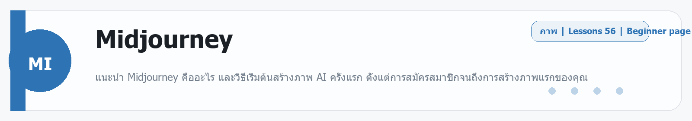

# Lovable
Source: https://ailab.learnnakdev.online/docs/lovable
Pages captured: 4

## Page 1 (หน้า 1 / 3)
```text
Lovable
คู่มืออย่างเป็นทางการ
4 เอกสาร
เริ่มต้น
Lovable คืออะไร — สร้างเว็บแอปเต็มระบบด้วยการแชท

ภาพรวม Lovable แพลตฟอร์มสร้างเว็บแอปจากการพิมพ์คุย ไม่ต้องเขียนโค้ด ·  6 นาที

หน้า 1 / 3
Lovable — แชทแล้วได้เว็บแอปทั้งระบบ 💗

เรียบเรียงเป็นภาษาไทยจากเอกสารทางการ docs.lovable.dev

Lovable คือแพลตฟอร์มสร้างเว็บแอปด้วย AI แบบ "พิมพ์คุยแล้วได้แอป" — คุณบอกเป็นภาษาคนว่าอยากได้แอปแบบไหน Lovable ก็สร้างทั้งหน้าตา (frontend) และระบบหลังบ้าน (backend) ให้ พร้อมต่อฐานข้อมูลและระบบล็อกอินได้ในตัว เหมาะกับคนที่อยากทำเว็บจริงโดยไม่ต้องเขียนโค้ดเป็น

📖 คำศัพท์ที่ควรรู้
คำศัพท์	ความหมายง่าย ๆ
Prompt	ข้อความที่เราบอก AI ว่าอยากได้อะไร
Frontend	หน้าตาเว็บที่ผู้ใช้เห็น
Backend	ระบบหลังบ้าน เช่น ฐานข้อมูล/การยืนยันตัวตน
Supabase	บริการฐานข้อมูล+auth ที่ Lovable ต่อให้ในตัว
Publish	เผยแพร่แอปขึ้นออนไลน์ให้คนอื่นเข้าใช้
Chat / Edit mode	โหมดคุยปรับแอป vs โหมดแก้รายละเอียดเจาะจง
⭐ จุดเด่น
พิมพ์ภาษาคน ได้แอปจริง — ไม่ต้องเขียนโค้ด
ครบทั้ง frontend + backend ในที่เดียว
ต่อ Supabase สำหรับฐานข้อมูลและล็อกอิน
ต่อ GitHub เพื่อ sync โค้ดออกไปแก้ต่อได้
เผยแพร่ได้ทันที พร้อมตั้งโดเมนของตัวเอง
🚀 เริ่มต้นใช้งาน
เข้า lovable.dev แล้วสมัครบัญชี
พิมพ์บอกแอปที่อยากได้ เช่น "เว็บจดโน้ตที่ล็อกอินได้ และบันทึกโน้ตของแต่ละคน"
ดู Lovable สร้างแอป แล้วคุยปรับแต่งต่อ (เปลี่ยนสี เพิ่มหน้า ฯลฯ)
เชื่อม Supabase ถ้าต้องเก็บข้อมูล แล้วกด Publish เพื่อขึ้นออนไลน์
📚 สารบัญเอกสาร Lovable (ตาม official docs)
✅ ภาพรวม (หน้านี้)
⏳ Quickstart — สร้างแอปแรก
⏳ เทคนิคการเขียน Prompt ให้ได้ผลดี
⏳ Integrations — Supabase, GitHub
⏳ Publishing & Custom domains
🔗 อ้างอิง
เอกสารทางการ: https://docs.lovable.dev/
เว็บหลัก: https://lovable.dev/
 ก่อนหน้า
ถัดไป
Lovable: เทคนิคการเขียน Prompt ให้ได้แอปดี
```

## Page 2 (หน้า 2 / 3)
```text
Lovable
คู่มืออย่างเป็นทางการ
4 เอกสาร
เริ่มต้น
Lovable: เทคนิคการเขียน Prompt ให้ได้แอปดี

วิธีสั่งงาน Lovable ให้ได้แอปตรงใจ และใช้ Chat vs Edit mode ·  5 นาที

หน้า 2 / 3
เขียน Prompt ให้ Lovable 💬

เรียบเรียงเป็นภาษาไทยจากเอกสารทางการ docs.lovable.dev

แอปจะออกมาดีแค่ไหนขึ้นกับวิธีสั่ง — Lovable เข้าใจภาษาคน แต่ยิ่งชัดยิ่งดี

✍️ หลักการสั่งงาน
เริ่มจากภาพรวม — บอกว่าเป็นแอปอะไร ทำอะไรได้
แล้วค่อยลงรายละเอียด — เพิ่มฟีเจอร์ทีละอย่าง
เจาะจง — บอกหน้าตา ข้อมูลที่เก็บ พฤติกรรมที่ต้องการ
ทีละก้าว — อย่าสั่งเปลี่ยนสิบอย่างในข้อความเดียว

ตัวอย่าง:

"สร้างเว็บจดบันทึก ผู้ใช้ล็อกอินได้ แต่ละคนเห็นเฉพาะโน้ตของตัวเอง โน้ตมีหัวข้อ เนื้อหา และวันที่"

💬 Chat mode vs ✏️ Edit
โหมด	ใช้ทำอะไร
Chat / Default	คุยปรับแอป เพิ่มฟีเจอร์ แก้พฤติกรรม
Edit เจาะจง	ชี้ element ที่จะแก้ตรง ๆ (เช่น ข้อความ/สีปุ่ม)
💡 เคล็ดลับ
ถ้าผลไม่ตรงใจ อธิบายให้เจาะจงขึ้น แทนการสั่งซ้ำเดิม
บอก "ทำไม" ด้วย เช่น "ปุ่มควรเด่นขึ้นเพราะเป็นปุ่มหลัก"
ตรวจทีละฟีเจอร์ว่าทำงานก่อนไปต่อ
🔗 อ้างอิง
เอกสารทางการ: https://docs.lovable.dev/
 ก่อนหน้า
Lovable คืออะไร — สร้างเว็บแอปเต็มระบบด้วยการแชท
ถัดไป
Lovable: Publishing & Custom Domains — เผยแพร่แอป
```

## Page 3 (หน้า 3 / 3)
```text
Lovable
คู่มืออย่างเป็นทางการ
4 เอกสาร
เริ่มต้น
Lovable: Publishing & Custom Domains — เผยแพร่แอป

เผยแพร่แอป Lovable ขึ้นออนไลน์และตั้งโดเมนของตัวเอง ·  4 นาที

หน้า 3 / 3
Publishing — เอาแอปขึ้นออนไลน์ 🚀

เรียบเรียงเป็นภาษาไทยจากเอกสารทางการ docs.lovable.dev

เมื่อแอปพร้อมแล้ว เผยแพร่ให้คนอื่นเข้าใช้ได้ในไม่กี่คลิก

🌐 เผยแพร่ (Publish)
กดปุ่ม Publish ในโปรเจกต์
Lovable จะ deploy แอปและให้ ลิงก์สาธารณะ มา
แชร์ลิงก์ให้คนอื่นใช้ได้ทันที

ทุกครั้งที่แก้แอปแล้วอยากให้อัปเดตขึ้นเว็บจริง ก็กด Publish ใหม่

🔗 Custom Domain (โดเมนของคุณเอง)

อยากใช้ชื่อโดเมนตัวเอง (เช่น myapp.com) แทนลิงก์เริ่มต้น:

ไปที่ตั้งค่าโดเมนในโปรเจกต์
เพิ่มโดเมนที่คุณมี
ตั้งค่า DNS ตามที่ระบบบอก
รอเชื่อมต่อสำเร็จ
💡 เคล็ดลับ
ทดสอบฟีเจอร์สำคัญก่อน Publish (โดยเฉพาะล็อกอิน/ข้อมูล)
ตรวจสิทธิ์การเข้าถึงข้อมูลให้รัดกุมก่อนเปิดสาธารณะ
Custom domain ช่วยให้แอปดูเป็นมืออาชีพขึ้น
🔗 อ้างอิง
เอกสารทางการ: https://docs.lovable.dev/
 ก่อนหน้า
Lovable: เทคนิคการเขียน Prompt ให้ได้แอปดี
ถัดไป
Lovable: Integrations — Supabase และ GitHub
```

## Page 4 (หน้า 1 / 1)
```text
Lovable
คู่มืออย่างเป็นทางการ
4 เอกสาร
ระดับกลาง
Lovable: Integrations — Supabase และ GitHub

เชื่อม Lovable กับ Supabase สำหรับฐานข้อมูล/ล็อกอิน และ sync โค้ดกับ GitHub ·  5 นาที

หน้า 1 / 1
Integrations — ต่อ Supabase และ GitHub 🔌

เรียบเรียงเป็นภาษาไทยจากเอกสารทางการ docs.lovable.dev

Lovable สร้างหน้าตาได้ แต่แอปจริงต้องมีที่เก็บข้อมูลและระบบสมาชิก — ตรงนี้ใช้ Supabase

🗄️ Supabase (ฐานข้อมูล + Auth)

Supabase คือบริการฐานข้อมูล + ระบบล็อกอินที่ Lovable ต่อให้ในตัว

Database — เก็บข้อมูลแอป (เช่น โน้ต ผู้ใช้ คำสั่งซื้อ)
Authentication — ระบบสมัคร/ล็อกอิน
Storage — เก็บไฟล์/รูป

วิธีเชื่อม (ภาพรวม):

กดเชื่อม Supabase ในโปรเจกต์ Lovable
อนุญาต/สร้างโปรเจกต์ Supabase
สั่ง Lovable เพิ่มฟีเจอร์ที่ใช้ข้อมูล เช่น "ให้บันทึกโน้ตลงฐานข้อมูล และให้ผู้ใช้เห็นเฉพาะของตัวเอง"
🐙 GitHub (sync โค้ด)

เชื่อม GitHub เพื่อ:

sync โค้ด ออกไปเก็บใน repository
แก้โค้ดเองนอก Lovable แล้วซิงก์กลับ
ทำงานร่วมกับนักพัฒนาในทีม
💡 เคล็ดลับ
ต่อ Supabase ตั้งแต่ตอนเริ่มเก็บข้อมูลจริง
ใช้ GitHub เป็น backup และทางออกถ้าอยากย้ายไปแก้เองภายหลัง
ระวังเรื่องสิทธิ์การเข้าถึงข้อมูล (ให้ผู้ใช้เห็นเฉพาะของตัวเอง)
🔗 อ้างอิง
เอกสารทางการ: https://docs.lovable.dev/
 ก่อนหน้า
Lovable: Publishing & Custom Domains — เผยแพร่แอป
ถัดไป
```


---

## Beginner Guide

### Lovable

Source: daily-ai-lab-ai-tools-32page-beginner-guide.docx


**หมวด:** Chat / Agent / Coding / App
**บทเรียนใน /docs:** 4 หน้า

**ใช้ทำอะไร**
ภาพรวม Lovable แพลตฟอร์มสร้างเว็บแอปจากการพิมพ์คุย ไม่ต้องเขียนโค้ด

**พื้นฐานที่ควรรู้**
พื้นฐานที่ควรรู้คือ prompt, context, file, workspace, และการตรวจผลลัพธ์ก่อนนำไปใช้งานจริง. มือใหม่ควรเริ่มจากงานเล็กที่วัดผลได้ เช่น สรุปเอกสาร แก้โค้ดสั้น ๆ หรือทำต้นแบบหน้าเว็บหนึ่งหน้า

**เหมาะกับมือใหม่แบบไหน**
เครื่องมือนี้เหมาะกับผู้เริ่มต้นที่อยากฝึกงาน Chat / Agent / Coding / App แบบสั้นและดูผลลัพธ์ได้เร็ว

**วิธีเริ่มแบบสั้น**
1. เปิด workspace หรือแชท แล้วให้โจทย์เดียวที่ชัดเจนพร้อมบริบทที่จำเป็น
2. แนบไฟล์ ตัวอย่าง หรือเป้าหมายที่อยากได้ เพื่อให้โมเดลอ่านภาพรวมได้เร็ว
3. ตรวจผลลัพธ์รอบแรก แล้วให้แก้แบบเฉพาะจุด เช่น tone, logic, code style หรือ structure

**ราคา/Plan**
Free; Pro $25/month; Business $50/month; student discount available.

**สิ่งที่ควรจำ**
- จุดแข็ง: เครื่องมือนี้เหมาะกับผู้เริ่มต้นที่อยากฝึกงาน Chat / Agent / Coding / App แบบสั้นและดูผลลัพธ์ได้เร็ว
- ข้อควรระวัง: ระวัง prompt ที่กว้างเกินไปและตรวจโค้ดหรือเอกสารทุกครั้งก่อนนำไปใช้จริง.

**ตัวอย่างเริ่มต้น**
ตัวอย่างงานเริ่มต้น: ช่วยฉันทำงานนี้ให้จบในรอบแรก: งานเริ่มต้นของฉัน. นี่คือบริบทที่มีอยู่: ฉันมีเป้าหมายชัดและอยากได้ผลลัพธ์ที่ตรวจสอบได้. ขอผลลัพธ์เป็นขั้นตอนชัดเจนและตรวจสอบได้

---

---

<!-- merged-beginner-guide:Lovable -->
## คู่มือพื้นฐานของ Lovable

**หมวด:** Chat / Agent / Coding / App
**บทเรียนใน /docs:** 4 หน้า

**ใช้ทำอะไร**
ภาพรวม Lovable แพลตฟอร์มสร้างเว็บแอปจากการพิมพ์คุย ไม่ต้องเขียนโค้ด

**พื้นฐานที่ควรรู้**
พื้นฐานที่ควรรู้คือ prompt, context, file, workspace, และการตรวจผลลัพธ์ก่อนนำไปใช้งานจริง. มือใหม่ควรเริ่มจากงานเล็กที่วัดผลได้ เช่น สรุปเอกสาร แก้โค้ดสั้น ๆ หรือทำต้นแบบหน้าเว็บหนึ่งหน้า

**เหมาะกับมือใหม่แบบไหน**
เครื่องมือนี้เหมาะกับผู้เริ่มต้นที่อยากฝึกงาน Chat / Agent / Coding / App แบบสั้นและดูผลลัพธ์ได้เร็ว

**วิธีเริ่มแบบสั้น**
1. เปิด workspace หรือแชท แล้วให้โจทย์เดียวที่ชัดเจนพร้อมบริบทที่จำเป็น
2. แนบไฟล์ ตัวอย่าง หรือเป้าหมายที่อยากได้ เพื่อให้โมเดลอ่านภาพรวมได้เร็ว
3. ตรวจผลลัพธ์รอบแรก แล้วให้แก้แบบเฉพาะจุด เช่น tone, logic, code style หรือ structure

**ราคา/Plan**
Free; Pro $25/month; Business $50/month; student discount available.

**สิ่งที่ควรจำ**
- จุดแข็ง: เครื่องมือนี้เหมาะกับผู้เริ่มต้นที่อยากฝึกงาน Chat / Agent / Coding / App แบบสั้นและดูผลลัพธ์ได้เร็ว
- ข้อควรระวัง: ระวัง prompt ที่กว้างเกินไปและตรวจโค้ดหรือเอกสารทุกครั้งก่อนนำไปใช้จริง.

**ตัวอย่างเริ่มต้น**
ตัวอย่างงานเริ่มต้น: ช่วยฉันทำงานนี้ให้จบในรอบแรก: งานเริ่มต้นของฉัน. นี่คือบริบทที่มีอยู่: ฉันมีเป้าหมายชัดและอยากได้ผลลัพธ์ที่ตรวจสอบได้. ขอผลลัพธ์เป็นขั้นตอนชัดเจนและตรวจสอบได้

---


