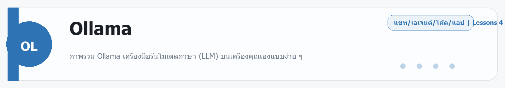
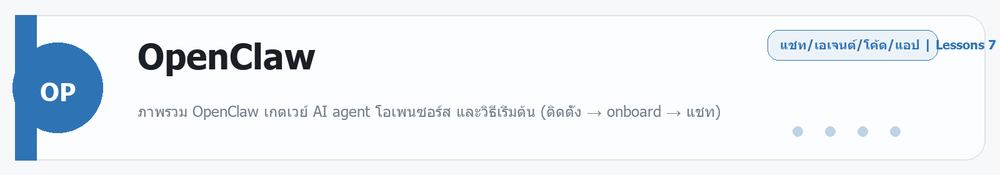

# Ollama
Source: https://ailab.learnnakdev.online/docs/ollama
Pages captured: 4

## Page 1 (หน้า 1 / 2)
```text
Ollama
คู่มืออย่างเป็นทางการ
4 เอกสาร
เริ่มต้น
Ollama คืออะไร — รันโมเดล AI โอเพนซอร์สบนเครื่องตัวเอง

ภาพรวม Ollama เครื่องมือรันโมเดลภาษา (LLM) บนเครื่องคุณเองแบบง่าย ๆ ·  6 นาที

หน้า 1 / 2
Ollama — รันโมเดล AI บนเครื่องตัวเอง 🦙

เรียบเรียงเป็นภาษาไทยจากเอกสารทางการ ollama.com และ GitHub: ollama/ollama

Ollama คือเครื่องมือที่ทำให้ รันโมเดลภาษา (LLM) แบบโอเพนซอร์สบนเครื่องคุณเอง ได้ง่ายมาก — ดาวน์โหลดโมเดล แล้วสั่งรันด้วยคำสั่งเดียว ทำงานได้แบบ ออฟไลน์ ข้อมูลไม่ออกจากเครื่อง เหมาะกับงานที่ห่วงความเป็นส่วนตัวหรืออยากประหยัดค่า API

📖 คำศัพท์ที่ควรรู้
คำศัพท์	ความหมายง่าย ๆ
LLM	โมเดลภาษาขนาดใหญ่ (เช่น Llama, Mistral, Qwen)
Local / ออฟไลน์	รันบนเครื่องคุณ ไม่ต้องต่อเน็ต ไม่ส่งข้อมูลออก
Pull	ดาวน์โหลดโมเดลมาเก็บไว้ในเครื่อง
Model tag	ชื่อ+ขนาดของโมเดล เช่น llama3.2, qwen2.5:7b
REST API	ช่องให้โปรแกรมอื่นเรียก Ollama (ที่ localhost:11434)
⭐ จุดเด่น
ติดตั้งง่าย รันคำสั่งเดียว — ollama run <โมเดล>
ออฟไลน์ + เป็นส่วนตัว — ข้อมูลอยู่ในเครื่อง
โมเดลให้เลือกเยอะ — Llama, Mistral, Qwen, Gemma, DeepSeek, Phi ฯลฯ
มี API ในตัว — ต่อกับแอป/โค้ดได้ (รองรับรูปแบบที่เข้ากันกับ OpenAI)
ข้ามแพลตฟอร์ม — macOS, Windows, Linux
🚀 เริ่มต้นใช้งาน
ดาวน์โหลดและติดตั้งจาก ollama.com
เปิดเทอร์มินัลแล้วรันโมเดล (จะดาวน์โหลดให้อัตโนมัติครั้งแรก):
ollama run llama3.2

พิมพ์คุยได้เลย — หรือเรียกผ่าน API:
curl http://localhost:11434/api/generate -d '{"model":"llama3.2","prompt":"สวัสดี"}'

ดาวน์โหลดโมเดลเก็บไว้: ollama pull qwen2.5 · ดูที่มี: ollama list

ขนาดโมเดล (เช่น 7b, 70b) ยิ่งใหญ่ยิ่งเก่งแต่กินแรม/การ์ดจอมากขึ้น — เลือกให้พอดีกับเครื่อง

📚 สารบัญเอกสาร Ollama (ตาม official docs)
✅ ภาพรวม (หน้านี้)
⏳ ติดตั้งและคำสั่งพื้นฐาน (run, pull, list, rm)
⏳ REST API & OpenAI-compatible API
⏳ Modelfile — สร้าง/ปรับแต่งโมเดลเอง
⏳ การใช้ GPU และการปรับแต่งประสิทธิภาพ
🔗 อ้างอิง
เว็บ/ดาวน์โหลด: https://ollama.com/
เอกสาร/ซอร์สโค้ด: https://github.com/ollama/ollama
 ก่อนหน้า
ถัดไป
Ollama: คำสั่งพื้นฐาน — run, pull, list, rm
```

## Page 2 (หน้า 2 / 2)
```text
Ollama
คู่มืออย่างเป็นทางการ
4 เอกสาร
เริ่มต้น
Ollama: คำสั่งพื้นฐาน — run, pull, list, rm

คำสั่งหลักของ Ollama สำหรับดาวน์โหลด รัน และจัดการโมเดลในเครื่อง ·  5 นาที

หน้า 2 / 2
คำสั่งพื้นฐานของ Ollama 🧰

เรียบเรียงเป็นภาษาไทยจากเอกสารทางการ github.com/ollama/ollama

หลังติดตั้ง Ollama แล้ว ใช้งานผ่านเทอร์มินัลด้วยคำสั่งไม่กี่ตัว

⌨️ คำสั่งที่ใช้บ่อย
คำสั่ง	ทำอะไร
ollama run <model>	รันโมเดล (ดาวน์โหลดให้อัตโนมัติถ้ายังไม่มี) แล้วเริ่มแชท
ollama pull <model>	ดาวน์โหลดโมเดลมาเก็บไว้เฉย ๆ
ollama list	ดูโมเดลที่มีในเครื่อง
ollama ps	ดูโมเดลที่กำลังรันอยู่
ollama rm <model>	ลบโมเดลออกจากเครื่อง
ollama cp <src> <dst>	คัดลอกโมเดล (ไว้ปรับแต่งต่อ)
ollama show <model>	ดูรายละเอียดโมเดล
🏷️ การระบุรุ่น/ขนาด (tag)

ใส่ขนาดต่อท้ายด้วย : เช่น

ollama run llama3.2:1b      # รุ่นเล็ก เบา
ollama run qwen2.5:7b       # รุ่นกลาง
ollama run llama3.3:70b     # รุ่นใหญ่ ต้องการเครื่องแรง

▶️ ตัวอย่างใช้งาน
ollama run llama3.2
>>> สวัสดี ช่วยอธิบาย AI ให้หน่อย
# พิมพ์ /bye เพื่อออกจากแชท

💡 เคล็ดลับ
รุ่นยิ่งใหญ่ยิ่งฉลาดแต่กิน RAM/VRAM มากขึ้น — เริ่มจากรุ่นเล็กก่อน
ลบโมเดลที่ไม่ใช้ด้วย ollama rm เพื่อประหยัดพื้นที่
🔗 อ้างอิง
เอกสาร/ซอร์สโค้ด: https://github.com/ollama/ollama
 ก่อนหน้า
Ollama คืออะไร — รันโมเดล AI โอเพนซอร์สบนเครื่องตัวเอง
ถัดไป
Ollama: REST API & OpenAI-compatible
```

## Page 3 (หน้า 1 / 2)
```text
Ollama
คู่มืออย่างเป็นทางการ
4 เอกสาร
ระดับกลาง
Ollama: REST API & OpenAI-compatible

เรียกใช้โมเดลที่รันด้วย Ollama จากโค้ดผ่าน REST API ·  5 นาที

หน้า 1 / 2
เรียก Ollama จากโค้ดผ่าน API 🔌

เรียบเรียงเป็นภาษาไทยจากเอกสารทางการ github.com/ollama/ollama

เมื่อ Ollama ทำงาน มันเปิดเซิร์ฟเวอร์ API ในเครื่องที่ http://localhost:11434 ให้โปรแกรมอื่นเรียกใช้โมเดลได้

🧱 เอนด์พอยต์หลัก
เอนด์พอยต์	ใช้ทำอะไร
POST /api/generate	สร้างข้อความจาก prompt เดียว
POST /api/chat	สนทนาแบบหลายข้อความ (มี role)
POST /api/embeddings	สร้าง embedding ของข้อความ
GET /api/tags	ดูโมเดลที่มีในเครื่อง
▶️ ตัวอย่าง generate
curl http://localhost:11434/api/generate -d '{
  "model": "llama3.2",
  "prompt": "อธิบาย AI ใน 2 ประโยค",
  "stream": false
}'

▶️ ตัวอย่าง chat
curl http://localhost:11434/api/chat -d '{
  "model": "llama3.2",
  "messages": [{"role":"user","content":"สวัสดี"}]
}'

🔄 OpenAI-compatible

Ollama ยังมีเอนด์พอยต์ที่ เข้ากันได้กับ OpenAI ที่ /v1/... — ใช้ SDK ของ OpenAI ได้โดยชี้ base URL มาที่ http://localhost:11434/v1 ทำให้ย้ายโค้ดเดิมมาได้ง่าย

💡 เคล็ดลับ
ตั้ง "stream": true เพื่อรับผลทีละส่วน (ตอบเร็วขึ้น)
รันบนเครื่อง = ข้อมูลไม่ออกไปไหน เหมาะกับงานที่ห่วงความเป็นส่วนตัว
🔗 อ้างอิง
เอกสาร API: https://github.com/ollama/ollama/blob/main/docs/api.md
 ก่อนหน้า
Ollama: คำสั่งพื้นฐาน — run, pull, list, rm
ถัดไป
Ollama: Modelfile — ปรับแต่งโมเดลของคุณเอง
```

## Page 4 (หน้า 2 / 2)
```text
Ollama
คู่มืออย่างเป็นทางการ
4 เอกสาร
ระดับกลาง
Ollama: Modelfile — ปรับแต่งโมเดลของคุณเอง

ใช้ Modelfile กำหนดบุคลิก พารามิเตอร์ และระบบของโมเดลที่ปรับแต่งเอง ·  5 นาที

หน้า 2 / 2
Modelfile — สร้างโมเดลเวอร์ชันของคุณ 🛠️

เรียบเรียงเป็นภาษาไทยจากเอกสารทางการ github.com/ollama/ollama

Modelfile คือไฟล์สูตร (คล้าย Dockerfile) ที่ใช้สร้างโมเดลเวอร์ชันปรับแต่งของคุณเอง — กำหนดบุคลิก, ค่าพารามิเตอร์, และข้อความระบบ โดยต่อยอดจากโมเดลที่มีอยู่

📄 ตัวอย่าง Modelfile
FROM llama3.2

# ตั้งบุคลิก/บทบาท
SYSTEM "คุณเป็นติวเตอร์ภาษาไทยที่อธิบายเรื่องยากให้เข้าใจง่าย พูดสุภาพ"

# ปรับพารามิเตอร์
PARAMETER temperature 0.7
PARAMETER num_ctx 8192

🔧 คำสั่งหลักใน Modelfile
คำสั่ง	ทำอะไร
FROM	โมเดลฐานที่ใช้ต่อยอด
SYSTEM	ข้อความระบบ (บุคลิก/บทบาท)
PARAMETER	ตั้งค่า เช่น temperature, num_ctx
TEMPLATE	รูปแบบ prompt ของโมเดล
ADAPTER	ใส่ LoRA adapter (ขั้นสูง)
▶️ สร้างและใช้งาน
# สร้างโมเดลจาก Modelfile
ollama create my-tutor -f ./Modelfile

# รันโมเดลที่ปรับแต่งเอง
ollama run my-tutor

💡 เหมาะกับอะไร
ทำผู้ช่วยเฉพาะทาง (เช่น ติวเตอร์, ผู้ช่วยเขียนโค้ด) ที่มีบุคลิกคงที่
ล็อกค่าพารามิเตอร์ให้ทีมใช้เหมือนกัน
🔗 อ้างอิง
เอกสาร Modelfile: https://github.com/ollama/ollama/blob/main/docs/modelfile.md
 ก่อนหน้า
Ollama: REST API & OpenAI-compatible
ถัดไป
```


---

## Beginner Guide

### Ollama

Source: daily-ai-lab-ai-tools-32page-beginner-guide.docx



**หมวด:** Chat / Agent / Coding / App
**บทเรียนใน /docs:** 4 หน้า

**ใช้ทำอะไร**
ภาพรวม Ollama เครื่องมือรันโมเดลภาษา (LLM) บนเครื่องคุณเองแบบง่าย ๆ

**พื้นฐานที่ควรรู้**
พื้นฐานที่ควรรู้คือ prompt, context, file, workspace, และการตรวจผลลัพธ์ก่อนนำไปใช้งานจริง. มือใหม่ควรเริ่มจากงานเล็กที่วัดผลได้ เช่น สรุปเอกสาร แก้โค้ดสั้น ๆ หรือทำต้นแบบหน้าเว็บหนึ่งหน้า

**เหมาะกับมือใหม่แบบไหน**
เหมาะกับคนที่ต้องการรันโมเดลในเครื่องเพื่อความเป็นส่วนตัวและควบคุมสภาพแวดล้อมเอง.

**วิธีเริ่มแบบสั้น**
1. เปิด workspace หรือแชท แล้วให้โจทย์เดียวที่ชัดเจนพร้อมบริบทที่จำเป็น
2. แนบไฟล์ ตัวอย่าง หรือเป้าหมายที่อยากได้ เพื่อให้โมเดลอ่านภาพรวมได้เร็ว
3. ตรวจผลลัพธ์รอบแรก แล้วให้แก้แบบเฉพาะจุด เช่น tone, logic, code style หรือ structure

**ราคา/Plan**
Free locally; cloud models are optional and usage-based.

**สิ่งที่ควรจำ**
- จุดแข็ง: เหมาะกับคนที่ต้องการรันโมเดลในเครื่องเพื่อความเป็นส่วนตัวและควบคุมสภาพแวดล้อมเอง.
- ข้อควรระวัง: ระวัง prompt ที่กว้างเกินไปและตรวจโค้ดหรือเอกสารทุกครั้งก่อนนำไปใช้จริง.

**ตัวอย่างเริ่มต้น**
ตัวอย่างงานเริ่มต้น: ช่วยเลือกโมเดลโลคัลที่เหมาะกับเครื่องสเปกนี้และอธิบายวิธีเริ่มต้น

---

---

<!-- merged-beginner-guide:Ollama -->
## คู่มือพื้นฐานของ Ollama

**หมวด:** Chat / Agent / Coding / App
**บทเรียนใน /docs:** 4 หน้า

**ใช้ทำอะไร**
ภาพรวม Ollama เครื่องมือรันโมเดลภาษา (LLM) บนเครื่องคุณเองแบบง่าย ๆ

**พื้นฐานที่ควรรู้**
พื้นฐานที่ควรรู้คือ prompt, context, file, workspace, และการตรวจผลลัพธ์ก่อนนำไปใช้งานจริง. มือใหม่ควรเริ่มจากงานเล็กที่วัดผลได้ เช่น สรุปเอกสาร แก้โค้ดสั้น ๆ หรือทำต้นแบบหน้าเว็บหนึ่งหน้า

**เหมาะกับมือใหม่แบบไหน**
เหมาะกับคนที่ต้องการรันโมเดลในเครื่องเพื่อความเป็นส่วนตัวและควบคุมสภาพแวดล้อมเอง.

**วิธีเริ่มแบบสั้น**
1. เปิด workspace หรือแชท แล้วให้โจทย์เดียวที่ชัดเจนพร้อมบริบทที่จำเป็น
2. แนบไฟล์ ตัวอย่าง หรือเป้าหมายที่อยากได้ เพื่อให้โมเดลอ่านภาพรวมได้เร็ว
3. ตรวจผลลัพธ์รอบแรก แล้วให้แก้แบบเฉพาะจุด เช่น tone, logic, code style หรือ structure

**ราคา/Plan**
Free locally; cloud models are optional and usage-based.

**สิ่งที่ควรจำ**
- จุดแข็ง: เหมาะกับคนที่ต้องการรันโมเดลในเครื่องเพื่อความเป็นส่วนตัวและควบคุมสภาพแวดล้อมเอง.
- ข้อควรระวัง: ระวัง prompt ที่กว้างเกินไปและตรวจโค้ดหรือเอกสารทุกครั้งก่อนนำไปใช้จริง.

**ตัวอย่างเริ่มต้น**
ตัวอย่างงานเริ่มต้น: ช่วยเลือกโมเดลโลคัลที่เหมาะกับเครื่องสเปกนี้และอธิบายวิธีเริ่มต้น

---


