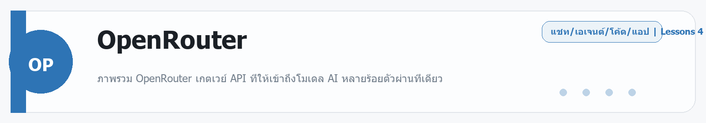

# OpenRouter
Source: https://ailab.learnnakdev.online/docs/openrouter
Pages captured: 4

## Page 1 (หน้า 1 / 2)
```text
OpenRouter
คู่มืออย่างเป็นทางการ
4 เอกสาร
เริ่มต้น
OpenRouter คืออะไร — API เดียว เรียกได้ทุกโมเดล AI

ภาพรวม OpenRouter เกตเวย์ API ที่ให้เข้าถึงโมเดล AI หลายร้อยตัวผ่านที่เดียว ·  6 นาที

หน้า 1 / 2
OpenRouter — API เดียว ใช้ได้ทุกโมเดล 🔀

เรียบเรียงเป็นภาษาไทยจากเอกสารทางการ openrouter.ai/docs

OpenRouter คือ เกตเวย์ (gateway) รวม API ของโมเดล AI หลายร้อยตัว จากหลายเจ้า (OpenAI, Anthropic, Google, Meta, Mistral ฯลฯ) ไว้ในที่เดียว — คุณเขียนโค้ดแบบเดียว แล้วสลับใช้โมเดลไหนก็ได้ ไม่ต้องสมัครหลายบัญชี ไม่ต้องแก้โค้ดทุกครั้งที่เปลี่ยนโมเดล

📖 คำศัพท์ที่ควรรู้
คำศัพท์	ความหมายง่าย ๆ
Gateway	ตัวกลางที่ส่งคำขอของคุณต่อไปยังผู้ให้บริการโมเดลจริง
Provider	เจ้าของโมเดลตัวจริง (เช่น OpenAI, Anthropic)
Routing	การเลือกว่าจะส่งงานไปที่ provider ไหน (เร็วสุด/ถูกสุด/สำรอง)
Credits	เครดิตเติมเงินไว้ จ่ายตามการใช้งานจริง
OpenAI-compatible	ใช้รูปแบบ API แบบเดียวกับ OpenAI เปลี่ยน URL ก็ใช้ได้เลย
⭐ จุดเด่น
โมเดลเยอะมากในที่เดียว — สลับรุ่น/ยี่ห้อได้โดยเปลี่ยนแค่ชื่อโมเดล
เข้ากันได้กับ OpenAI API — ย้ายโค้ดเดิมมาได้แทบทันที
Routing อัจฉริยะ — เลือก provider ที่เร็ว/ถูก หรือสำรองอัตโนมัติเมื่อเจ้าหนึ่งล่ม
บิลรวมที่เดียว — เติมเครดิตครั้งเดียว ใช้ได้ทุกโมเดล
มีฟีเจอร์ขั้นสูง — Prompt Caching, Structured Outputs, Tool Calling
🚀 เริ่มต้นใช้งาน
สมัครและสร้าง API key ที่ openrouter.ai
เรียกใช้แบบเดียวกับ OpenAI — แค่เปลี่ยน base URL:
curl https://openrouter.ai/api/v1/chat/completions \
  -H "Authorization: Bearer $OPENROUTER_API_KEY" \
  -d '{"model":"anthropic/claude-opus-4-8","messages":[{"role":"user","content":"สวัสดี"}]}'

อยากเปลี่ยนโมเดล? แก้แค่ค่า model เช่น openai/gpt-4o, google/gemini-2.5-pro
📚 สารบัญเอกสาร OpenRouter (ตาม official docs)
✅ ภาพรวม (หน้านี้)
⏳ Quickstart — เรียก API ครั้งแรก
⏳ Models — รายชื่อและการตั้งชื่อโมเดล
⏳ Provider Routing — เลือก/สำรอง provider
⏳ Prompt Caching & Structured Outputs
⏳ Tool Calling (Function Calling)
⏳ API Reference
🔗 อ้างอิง
เอกสารทางการ: https://openrouter.ai/docs
รายชื่อโมเดล: https://openrouter.ai/models
 ก่อนหน้า
ถัดไป
OpenRouter: Quickstart — เรียก API ครั้งแรก
```

## Page 2 (หน้า 2 / 2)
```text
OpenRouter
คู่มืออย่างเป็นทางการ
4 เอกสาร
เริ่มต้น
OpenRouter: Quickstart — เรียก API ครั้งแรก

สร้าง API key และเรียกโมเดลแรกผ่าน OpenRouter แบบ OpenAI-compatible ·  5 นาที

หน้า 2 / 2
Quickstart — เริ่มเรียก OpenRouter 🚀

เรียบเรียงเป็นภาษาไทยจากเอกสารทางการ openrouter.ai/docs/quickstart

🔑 ขั้นตอนเริ่มต้น
สมัครที่ openrouter.ai แล้วเติมเครดิต
สร้าง API key ในหน้า Keys
เลือกโมเดลที่อยากใช้จาก openrouter.ai/models
🧱 เรียกแบบ OpenAI-compatible

OpenRouter ใช้รูปแบบเดียวกับ OpenAI — เปลี่ยนแค่ base URL และ key:

from openai import OpenAI
client = OpenAI(
    base_url="https://openrouter.ai/api/v1",
    api_key="YOUR_OPENROUTER_KEY",
)
r = client.chat.completions.create(
    model="anthropic/claude-opus-4-8",
    messages=[{"role": "user", "content": "สวัสดี"}],
)
print(r.choices[0].message.content)

🏷️ การตั้งชื่อโมเดล

รูปแบบคือ ผู้ให้บริการ/ชื่อโมเดล เช่น

anthropic/claude-opus-4-8
openai/gpt-4o
google/gemini-2.5-pro
meta-llama/llama-3.3-70b-instruct

อยากเปลี่ยนโมเดล? แก้แค่ค่า model — โค้ดที่เหลือเหมือนเดิม

💡 เคล็ดลับ
ใส่ HTTP headers HTTP-Referer และ X-Title (ไม่บังคับ) เพื่อให้แอปคุณปรากฏใน leaderboard ของ OpenRouter
ดูราคาแต่ละโมเดลก่อนใช้ (คิดตาม token)
🔗 อ้างอิง
Quickstart: https://openrouter.ai/docs/quickstart
 ก่อนหน้า
OpenRouter คืออะไร — API เดียว เรียกได้ทุกโมเดล AI
ถัดไป
OpenRouter: Models & Provider Routing — เลือกและสำรองโมเดล
```

## Page 3 (หน้า 1 / 1)
```text
OpenRouter
คู่มืออย่างเป็นทางการ
4 เอกสาร
ระดับกลาง
OpenRouter: Models & Provider Routing — เลือกและสำรองโมเดล

การเลือกโมเดล การกำหนด provider routing และระบบสำรองเมื่อ provider ล่ม ·  5 นาที

หน้า 1 / 1
Models & Provider Routing 🔀

เรียบเรียงเป็นภาษาไทยจากเอกสารทางการ openrouter.ai/docs

โมเดลตัวเดียวกันอาจมีหลาย provider ให้บริการ OpenRouter ช่วย เลือก provider ที่ดีที่สุด และ สำรองอัตโนมัติ เมื่อเจ้าหนึ่งมีปัญหา

🎯 Provider Routing ทำงานยังไง
ค่าเริ่มต้น: เลือก provider ที่เหมาะ (ราคา/ความเร็ว/ความพร้อม)
ถ้า provider แรกล่มหรือช้า → fallback ไปเจ้าถัดไปให้อัตโนมัติ
คุณกำหนดเงื่อนไขเองได้ เช่น เรียงลำดับ provider, ตัด provider ที่ไม่ต้องการ
⚙️ ตัวอย่างกำหนดเอง

ส่งฟิลด์ provider เพิ่มในคำขอ เช่น

{
  "model": "meta-llama/llama-3.3-70b-instruct",
  "provider": { "sort": "throughput" },
  "messages": [ ... ]
}

sort: "price" — เน้นถูกสุด
sort: "throughput" — เน้นเร็วสุด
ระบุ order เพื่อกำหนดลำดับ provider เอง
🧭 Model Routing (เลือกโมเดลอัตโนมัติ)

มีโมเดลพิเศษ เช่น openrouter/auto ที่ให้ OpenRouter เลือกโมเดลที่เหมาะกับคำถามให้เอง

💡 เคล็ดลับ
งาน production ควรตั้ง fallback ไว้กันล่ม
ดู uptime/latency ของแต่ละ provider ได้ในหน้าโมเดล
🔗 อ้างอิง
Provider Routing: https://openrouter.ai/docs/features/provider-routing
 ก่อนหน้า
OpenRouter: Quickstart — เรียก API ครั้งแรก
ถัดไป
OpenRouter: ฟีเจอร์ขั้นสูง — Caching, Structured Outputs, Tools
```

## Page 4 (หน้า 1 / 1)
```text
OpenRouter
คู่มืออย่างเป็นทางการ
4 เอกสาร
ขั้นโปร
OpenRouter: ฟีเจอร์ขั้นสูง — Caching, Structured Outputs, Tools

ฟีเจอร์ขั้นสูงของ OpenRouter: prompt caching, structured outputs และ tool calling ·  5 นาที

หน้า 1 / 1
ฟีเจอร์ขั้นสูงของ OpenRouter ⚙️

เรียบเรียงเป็นภาษาไทยจากเอกสารทางการ openrouter.ai/docs

OpenRouter รองรับฟีเจอร์ขั้นสูงที่ใช้ได้ข้ามโมเดล (ตามที่โมเดลนั้นรองรับ)

💾 Prompt Caching

ถ้าส่งบริบทเดิมซ้ำ ๆ (เช่น system prompt ยาว) caching ช่วยลดต้นทุนและเพิ่มความเร็ว โดยไม่ต้องประมวลผลส่วนเดิมใหม่ทุกครั้ง — รองรับตามที่ provider/โมเดลรองรับ

📐 Structured Outputs

บังคับให้คำตอบออกมาตรงตาม โครงสร้าง JSON (schema) ที่กำหนด เหมาะกับงานที่ต้องนำผลไปใช้ต่อในโปรแกรม

{
  "model": "...",
  "response_format": {
    "type": "json_schema",
    "json_schema": { "name": "person", "schema": { ... } }
  }
}

🛠️ Tool Calling (Function Calling)

ให้โมเดลเรียก "เครื่องมือ" ที่คุณกำหนด (เช่น ค้นฐานข้อมูล, เรียก API) — โมเดลจะบอกว่าจะเรียกเครื่องมือไหนพร้อมพารามิเตอร์ แล้วคุณรันให้และส่งผลกลับ ใช้รูปแบบเดียวกับ OpenAI tools

🖼️ อื่น ๆ
Multimodal — บางโมเดลรับรูปภาพได้
Streaming — รับผลทีละส่วน
Web search — บางโมเดล/โหมดเสริมการค้นเว็บ
💡 เคล็ดลับ
ฟีเจอร์ใช้ได้เฉพาะเมื่อ "โมเดลที่เลือก" รองรับ — เช็คในหน้าโมเดล
ใช้ structured outputs เมื่อต้องการผลที่ parse ได้แน่นอน
🔗 อ้างอิง
Features: https://openrouter.ai/docs/features
 ก่อนหน้า
OpenRouter: Models & Provider Routing — เลือกและสำรองโมเดล
ถัดไป
```


---

## Beginner Guide

### OpenRouter

Source: daily-ai-lab-ai-tools-32page-beginner-guide.docx



**หมวด:** Chat / Agent / Coding / App
**บทเรียนใน /docs:** 4 หน้า

**ใช้ทำอะไร**
ภาพรวม OpenRouter เกตเวย์ API ที่ให้เข้าถึงโมเดล AI หลายร้อยตัวผ่านที่เดียว

**พื้นฐานที่ควรรู้**
พื้นฐานที่ควรรู้คือ prompt, context, file, workspace, และการตรวจผลลัพธ์ก่อนนำไปใช้งานจริง. มือใหม่ควรเริ่มจากงานเล็กที่วัดผลได้ เช่น สรุปเอกสาร แก้โค้ดสั้น ๆ หรือทำต้นแบบหน้าเว็บหนึ่งหน้า

**เหมาะกับมือใหม่แบบไหน**
เหมาะกับคนที่อยากทดลองหลายโมเดลผ่าน API เดียวโดยไม่ล็อกกับผู้ให้บริการรายเดียว.

**วิธีเริ่มแบบสั้น**
1. เปิด workspace หรือแชท แล้วให้โจทย์เดียวที่ชัดเจนพร้อมบริบทที่จำเป็น
2. แนบไฟล์ ตัวอย่าง หรือเป้าหมายที่อยากได้ เพื่อให้โมเดลอ่านภาพรวมได้เร็ว
3. ตรวจผลลัพธ์รอบแรก แล้วให้แก้แบบเฉพาะจุด เช่น tone, logic, code style หรือ structure

**ราคา/Plan**
Free tier with limits; pay-as-you-go and enterprise plans.

**สิ่งที่ควรจำ**
- จุดแข็ง: เหมาะกับคนที่อยากทดลองหลายโมเดลผ่าน API เดียวโดยไม่ล็อกกับผู้ให้บริการรายเดียว.
- ข้อควรระวัง: ระวัง prompt ที่กว้างเกินไปและตรวจโค้ดหรือเอกสารทุกครั้งก่อนนำไปใช้จริง.

**ตัวอย่างเริ่มต้น**
ตัวอย่างงานเริ่มต้น: สรุปแนวทางเลือกโมเดลสำหรับงานนี้และเปรียบเทียบข้อดีข้อเสียแบบสั้น

---

---

<!-- merged-beginner-guide:OpenRouter -->
## คู่มือพื้นฐานของ OpenRouter

**หมวด:** Chat / Agent / Coding / App
**บทเรียนใน /docs:** 4 หน้า

**ใช้ทำอะไร**
ภาพรวม OpenRouter เกตเวย์ API ที่ให้เข้าถึงโมเดล AI หลายร้อยตัวผ่านที่เดียว

**พื้นฐานที่ควรรู้**
พื้นฐานที่ควรรู้คือ prompt, context, file, workspace, และการตรวจผลลัพธ์ก่อนนำไปใช้งานจริง. มือใหม่ควรเริ่มจากงานเล็กที่วัดผลได้ เช่น สรุปเอกสาร แก้โค้ดสั้น ๆ หรือทำต้นแบบหน้าเว็บหนึ่งหน้า

**เหมาะกับมือใหม่แบบไหน**
เหมาะกับคนที่อยากทดลองหลายโมเดลผ่าน API เดียวโดยไม่ล็อกกับผู้ให้บริการรายเดียว.

**วิธีเริ่มแบบสั้น**
1. เปิด workspace หรือแชท แล้วให้โจทย์เดียวที่ชัดเจนพร้อมบริบทที่จำเป็น
2. แนบไฟล์ ตัวอย่าง หรือเป้าหมายที่อยากได้ เพื่อให้โมเดลอ่านภาพรวมได้เร็ว
3. ตรวจผลลัพธ์รอบแรก แล้วให้แก้แบบเฉพาะจุด เช่น tone, logic, code style หรือ structure

**ราคา/Plan**
Free tier with limits; pay-as-you-go and enterprise plans.

**สิ่งที่ควรจำ**
- จุดแข็ง: เหมาะกับคนที่อยากทดลองหลายโมเดลผ่าน API เดียวโดยไม่ล็อกกับผู้ให้บริการรายเดียว.
- ข้อควรระวัง: ระวัง prompt ที่กว้างเกินไปและตรวจโค้ดหรือเอกสารทุกครั้งก่อนนำไปใช้จริง.

**ตัวอย่างเริ่มต้น**
ตัวอย่างงานเริ่มต้น: สรุปแนวทางเลือกโมเดลสำหรับงานนี้และเปรียบเทียบข้อดีข้อเสียแบบสั้น

---


