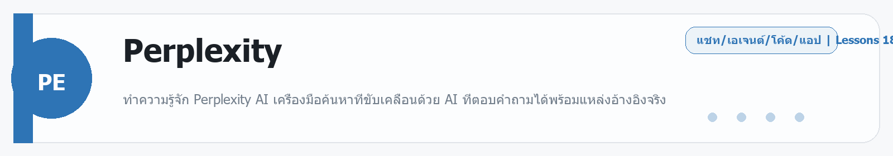

# Perplexity
Source: https://ailab.learnnakdev.online/docs/perplexity
Pages captured: 18

## Page 1 (หน้า 1 / 3)
```text
Perplexity
คู่มืออย่างเป็นทางการ
18 เอกสาร
เริ่มต้น
Perplexity คืออะไร

ทำความรู้จัก Perplexity AI เครื่องมือค้นหาที่ขับเคลื่อนด้วย AI ที่ตอบคำถามได้พร้อมแหล่งอ้างอิงจริง ·  5 นาที

หน้า 1 / 3
Perplexity คืออะไร

Perplexity AI คือเครื่องมือค้นหาข้อมูล (Search Engine) รุ่นใหม่ที่ใช้ปัญญาประดิษฐ์ (AI — Artificial Intelligence) ในการค้นหาและสรุปข้อมูลจากอินเทอร์เน็ต แทนที่จะแสดงลิสต์ลิงก์เหมือน Google Perplexity จะ ตอบคำถามของคุณโดยตรง พร้อมแนบแหล่งอ้างอิง (Citations — ลิงก์เว็บไซต์ที่ใช้เป็นข้อมูลในการตอบ) ให้ตรวจสอบได้ทันที

ทำไม Perplexity ถึงแตกต่างจาก Google?
ฟีเจอร์	Google	Perplexity
วิธีแสดงผล	รายการลิงก์	คำตอบสรุปพร้อมแหล่งอ้างอิง
การตอบคำถาม	ต้องคลิกเข้าไปอ่านเอง	ตอบตรงๆ ในหน้าเดียว
แหล่งที่มา	มีลิงก์ แต่ไม่ระบุว่าใช้ข้อมูลจากไหน	ระบุชัดเจนว่าข้อมูลมาจากเว็บไหน
การโต้ตอบ	ค้นหาใหม่ทุกครั้ง	ถามต่อได้เหมือนสนทนา
Perplexity ทำงานอย่างไร?

เมื่อคุณพิมพ์คำถามลงใน Perplexity ระบบจะ:

ค้นหาอินเทอร์เน็ต — สแกนเว็บไซต์หลายแหล่งแบบเรียลไทม์ (Real-time — ข้อมูลสดจากอินเทอร์เน็ตในเวลานั้นเลย)
วิเคราะห์เนื้อหา — AI อ่านและเปรียบเทียบข้อมูลจากหลายแหล่ง
สรุปคำตอบ — เขียนคำตอบที่กระชับ เข้าใจง่าย
แนบ Citations — ระบุแหล่งที่มาทุกชิ้น ให้ผู้ใช้คลิกตรวจสอบได้
ใครควรใช้ Perplexity?

Perplexity เหมาะสำหรับ:

นักเรียน / นักศึกษา — ค้นคว้าเรื่องเรียน หาข้อมูลงานวิจัย
นักธุรกิจ — ติดตามข่าวสาร วิเคราะห์ตลาด หาข้อมูลคู่แข่ง
นักพัฒนา (Developers) — ใช้ API (Application Programming Interface — ช่องทางให้โปรแกรมเชื่อมต่อและใช้งานบริการ) เพื่อสร้างแอปพลิเคชันที่มีความสามารถค้นหาข้อมูล
ผู้ที่ต้องการข้อมูลแม่นยำ — เพราะทุกคำตอบมีแหล่งอ้างอิงพิสูจน์ได้
ผลิตภัณฑ์หลักของ Perplexity

Perplexity มีให้บริการสองรูปแบบหลัก:

1. Perplexity.ai (เว็บไซต์และแอป)

เครื่องมือค้นหาที่ใช้งานผ่านเบราว์เซอร์หรือแอปมือถือ เหมาะสำหรับผู้ใช้ทั่วไปที่ต้องการค้นหาข้อมูลในชีวิตประจำวัน

2. Perplexity API (ส่วนเชื่อมต่อสำหรับนักพัฒนา)

ช่องทางให้นักพัฒนาซอฟต์แวร์นำความสามารถของ Perplexity ไปใช้ในแอปพลิเคชันของตัวเอง มี 4 API หลัก:

Agent API — API สำหรับสร้าง AI Agent (ตัวแทน AI ที่ทำงานหลายขั้นตอนเองได้) ใช้โมเดลจากหลายผู้ให้บริการในที่เดียว
Search API — API สำหรับค้นหาเว็บแบบ Raw (ดิบ — ได้ผลลัพธ์เป็นรายการลิงก์และข้อความ ไม่ใช่คำตอบสรุป) เหมาะสำหรับนักพัฒนาที่ต้องการข้อมูลดิบ
Sonar API — API สำหรับถามตอบด้วย AI พร้อมการค้นหาเว็บในตัว คล้ายกับการใช้ Perplexity ผ่าน API
Embeddings API — API สำหรับแปลงข้อความเป็นเวกเตอร์ (Vector — ตัวเลขที่แทนความหมายของข้อความ) ใช้ในระบบค้นหาความหมาย
จุดเด่นของ Perplexity
ข้อมูลสด — ดึงข้อมูลจากอินเทอร์เน็ตแบบเรียลไทม์ ไม่ใช่ข้อมูลที่หยุดอยู่กับที่
โปร่งใส — ทุกคำตอบมีแหล่งอ้างอิงให้ตรวจสอบ
ง่ายต่อการใช้ — ถามเป็นภาษาธรรมชาติได้เลย ไม่ต้องจำคีย์เวิร์ด
ต่อยอดได้ — มี API สำหรับนักพัฒนาที่ต้องการสร้างแอปเอง
สรุป

Perplexity คือก้าวต่อไปของการค้นหาข้อมูล ผสมผสานความสะดวกของ AI Chatbot เข้ากับความน่าเชื่อถือของการค้นหาเว็บจริง ทำให้ได้คำตอบที่รวดเร็ว แม่นยำ และสามารถตรวจสอบแหล่งที่มาได้เสมอ ไม่ว่าจะใช้เป็นเครื่องมือส่วนตัวหรือนำไปพัฒนาเป็นแอปพลิเคชันผ่าน API ก็ทำได้ทั้งหมด

 ก่อนหน้า
ถัดไป
เริ่มต้นใช้งาน API
```

## Page 2 (หน้า 2 / 3)
```text
Perplexity
คู่มืออย่างเป็นทางการ
18 เอกสาร
เริ่มต้น
เริ่มต้นใช้งาน API

คู่มือเริ่มต้นสำหรับนักพัฒนา ตั้งแต่การสมัครบัญชีจนถึงการเรียก API ครั้งแรก ·  6 นาที

หน้า 2 / 3
เริ่มต้นใช้งาน API (Quickstart Guide)

คู่มือนี้จะพาคุณตั้งค่าและเรียกใช้ Perplexity API ครั้งแรกตั้งแต่ต้นจนจบ ใช้เวลาไม่ถึง 10 นาที

ขั้นตอนที่ 1 — สร้าง API Key

API Key (กุญแจ API — รหัสลับที่ใช้พิสูจน์ตัวตนเมื่อเรียกใช้ API) คือสิ่งแรกที่คุณต้องมี

ไปที่ console.perplexity.ai
สมัครบัญชีหรือล็อกอิน
ไปที่เมนู API Keys
กด "Generate New Key" (สร้างกุญแจใหม่)
คัดลอกและบันทึก ค่า Key ไว้ทันที เพราะระบบจะแสดงเพียงครั้งเดียวตอนสร้าง

สำคัญมาก: อย่าแชร์ API Key ให้ใคร และอย่านำไปใส่ใน Code ที่จะ Upload ขึ้น GitHub (เพราะคนอื่นจะเอาไปใช้ได้และคุณจะโดนเก็บเงิน)

ขั้นตอนที่ 2 — ติดตั้ง SDK

SDK (Software Development Kit — ชุดเครื่องมือสำหรับนักพัฒนา ที่ทำให้เรียก API ได้ง่ายขึ้น) มีให้เลือกสองภาษาหลัก:

Python
pip install perplexityai

TypeScript / Node.js
npm install @perplexity-ai/perplexity_ai

ขั้นตอนที่ 3 — ตั้งค่า Environment Variable

Environment Variable (ตัวแปรสภาพแวดล้อม — ที่เก็บข้อมูลลับในระบบ แยกออกจาก Code) คือวิธีที่ปลอดภัยที่สุดในการเก็บ API Key

macOS / Linux
export PERPLEXITY_API_KEY="pplx-xxxxxxxxxxxxxxxxxxxxxxxxxxxxxxxx"

Windows (Command Prompt)
set PERPLEXITY_API_KEY=pplx-xxxxxxxxxxxxxxxxxxxxxxxxxxxxxxxx

Windows (PowerShell)
$env:PERPLEXITY_API_KEY = "pplx-xxxxxxxxxxxxxxxxxxxxxxxxxxxxxxxx"

ขั้นตอนที่ 4 — เรียก API ครั้งแรก
ตัวอย่างด้วย Python (Agent API)
from perplexityai import Perplexity

client = Perplexity()  # ดึง API Key จาก Environment Variable อัตโนมัติ

response = client.agent.create(
    preset="pro-search",  # ใช้ Preset สำเร็จรูป (ชุดการตั้งค่าที่เตรียมไว้แล้ว)
    input="AI ช่วยอะไรได้บ้างในปี 2026?"
)

print(response.output_text)

ตัวอย่างด้วย TypeScript
import { Perplexity } from "@perplexity-ai/perplexity_ai";

const client = new Perplexity();

const response = await client.agent.create({
  preset: "pro-search",
  input: "AI ช่วยอะไรได้บ้างในปี 2026?",
});

console.log(response.output_text);

ตัวอย่างด้วย cURL (Command Line)
curl -X POST https://api.perplexity.ai/v1/agent \
  -H "Authorization: Bearer $PERPLEXITY_API_KEY" \
  -H "Content-Type: application/json" \
  -d '{
    "preset": "pro-search",
    "input": "AI ช่วยอะไรได้บ้างในปี 2026?"
  }'

ทำความเข้าใจ Response (คำตอบที่ได้กลับมา)

เมื่อเรียก API สำเร็จ คุณจะได้ JSON (รูปแบบข้อมูลมาตรฐาน) กลับมา มีโครงสร้างหลักดังนี้:

{
  "id": "resp_abc123",
  "output_text": "คำตอบจาก AI...",
  "citations": [
    {
      "url": "https://example.com/article",
      "title": "ชื่อบทความ"
    }
  ],
  "usage": {
    "input_tokens": 50,
    "output_tokens": 200,
    "total_cost": 0.00025
  }
}

output_text — คำตอบที่ AI สร้างขึ้น
citations (แหล่งอ้างอิง) — รายการเว็บที่ใช้ในการตอบ
usage — จำนวน Token (หน่วยข้อความ — คำหรือส่วนของคำที่ AI นับ) และค่าใช้จ่าย
เลือก API ที่ใช่สำหรับงานของคุณ

Perplexity มี 4 API หลัก เลือกตามงาน:

งานที่ต้องการทำ	API ที่แนะนำ
สร้าง AI Agent ที่ทำงานหลายขั้นตอน	Agent API
ค้นหาเว็บและได้ผลลัพธ์ดิบ (ลิงก์/สรุป)	Search API
ถามตอบด้วย AI พร้อมค้นหาเว็บ	Sonar API
แปลงข้อความเป็น Vector สำหรับ RAG	Embeddings API

RAG (Retrieval-Augmented Generation — การสร้างข้อความโดยดึงข้อมูลจากฐานความรู้ของเราเอง) คือเทคนิคยอดนิยมที่ผสมฐานข้อมูลของเรากับ AI

สรุปขั้นตอน
สร้าง API Key ที่ console.perplexity.ai
ติดตั้ง SDK (Python หรือ TypeScript)
ตั้งค่า PERPLEXITY_API_KEY เป็น Environment Variable
เรียก API ด้วย Code ตัวอย่าง
รับ Response และนำไปใช้งานต่อ

ขั้นตอนต่อไปคือเรียนรู้แต่ละ API อย่างละเอียดในบทถัดไป

 ก่อนหน้า
Perplexity คืออะไร
ถัดไป
API Keys และ API Groups
```

## Page 3 (หน้า 3 / 3)
```text
Perplexity
คู่มืออย่างเป็นทางการ
18 เอกสาร
เริ่มต้น
API Keys และ API Groups

วิธีสร้างและจัดการ API Keys รวมถึงการใช้ API Groups เพื่อบริหารทีมและการเรียกเก็บเงิน ·  5 นาที

หน้า 3 / 3
API Keys และ API Groups

ก่อนเรียกใช้ Perplexity API ทุกครั้ง คุณต้องมี API Key (กุญแจ API — รหัสลับที่พิสูจน์ตัวตนว่าคุณมีสิทธิ์ใช้บริการ) และเข้าใจระบบ API Groups (กลุ่ม API — พื้นที่ทำงานขององค์กรสำหรับจัดการทีมและการเรียกเก็บเงิน)

API Key คืออะไร?

API Key คือรหัสลับในรูปแบบตัวอักษร เช่น pplx-abc123xyz... ที่คุณแนบไปกับทุก Request (คำขอ — การส่งข้อมูลไปยัง API) เพื่อพิสูจน์ว่าเป็นคุณ

วิธีสร้าง API Key
ไปที่ console.perplexity.ai
เลือกเมนู API Keys ในแถบด้านซ้าย
กด "Generate New Key"
ตั้งชื่อ Key เพื่อให้จำได้ว่าใช้กับโปรเจกต์ไหน
คัดลอกค่า Key ทันที — ระบบจะแสดงค่าเต็มครั้งเดียวตอนสร้าง หลังจากนั้นจะซ่อนไว้

นโยบายความปลอดภัยใหม่ (เมษายน 2026): ค่า Key เต็มจะแสดงให้เห็น เฉพาะตอนสร้างเท่านั้น หลังจากนั้นจะแสดงแค่ส่วนต้นและส่วนท้าย เพื่อป้องกันการรั่วไหล

วิธีใช้ API Key ใน Code

วิธีที่ปลอดภัยที่สุดคือใช้ Environment Variable (ตัวแปรสภาพแวดล้อม — เก็บข้อมูลลับแยกจาก Code):

Python
import os
from perplexityai import Perplexity

# SDK จะดึง PERPLEXITY_API_KEY จาก Environment อัตโนมัติ
client = Perplexity()

# หรือระบุ API Key ตรงๆ (ไม่แนะนำสำหรับ Production)
client = Perplexity(api_key="pplx-xxxxxxxx")

TypeScript
import { Perplexity } from "@perplexity-ai/perplexity_ai";

// ดึง Key จาก Environment อัตโนมัติ
const client = new Perplexity();

// หรือระบุตรงๆ
const client = new Perplexity({ apiKey: "pplx-xxxxxxxx" });

HTTP Header (cURL)
curl -H "Authorization: Bearer $PERPLEXITY_API_KEY" \
     https://api.perplexity.ai/v1/agent

การ Revoke API Key (ยกเลิก)

ถ้า Key รั่วไหลหรือไม่ต้องการใช้แล้ว:

ไปที่หน้า API Keys ใน Console
กด "Revoke" ข้างชื่อ Key นั้น
Key จะหมดอายุทันที — Code ที่ใช้ Key นั้นจะเรียก API ไม่ได้อีก

แนวทางที่ดี: สร้าง Key แยกสำหรับแต่ละโปรเจกต์ เพื่อง่ายต่อการยกเลิกเฉพาะโปรเจกต์นั้นโดยไม่กระทบโปรเจกต์อื่น

API Groups คืออะไร?

API Group คือพื้นที่ทำงาน (Workspace) ขององค์กรใน Perplexity Console ช่วยให้:

จัดการการชำระเงิน — ตั้งวิธีชำระและดูใบแจ้งหนี้
บริหาร API Keys — สร้าง ยกเลิก และดูประวัติการใช้งาน
เชิญสมาชิกทีม — กำหนดสิทธิ์ให้นักพัฒนาในทีม
ติดตามค่าใช้จ่าย — ดูยอดใช้งานแยกตาม Key หรือตาม API
สิทธิ์ (Permissions) ในทีม
บทบาท	สิทธิ์
Owner (เจ้าของ)	ทำได้ทุกอย่าง รวมถึงการจ่ายเงิน
Admin (ผู้ดูแล)	จัดการ Key และสมาชิก ไม่มีสิทธิ์จ่ายเงิน
Developer (นักพัฒนา)	ดูและสร้าง Key เฉพาะของตัวเอง
ความปลอดภัยของ API Key — สิ่งที่ควรทำและไม่ควรทำ
ควรทำ
เก็บ Key ใน Environment Variable หรือ Secret Manager (ระบบเก็บความลับ)
ใช้ Key แยกสำหรับ Development และ Production
ตรวจสอบ Usage (การใช้งาน) สม่ำเสมอเพื่อดูความผิดปกติ
Rotate Key (หมุนเวียน — เปลี่ยนเป็น Key ใหม่) ทุก 3-6 เดือน
ไม่ควรทำ
อย่า ใส่ Key ตรงใน Code ที่จะ Push ขึ้น GitHub
อย่า แชร์ Key ผ่าน Line, Email, หรือ Chat
อย่า ใช้ Key เดียวกันทั้งหมดทุกโปรเจกต์
อย่า ใส่ Key ใน Client-side Code (โค้ดที่รันในเบราว์เซอร์ของผู้ใช้) เพราะคนอื่นจะมองเห็นได้
การซื้อผ่าน AWS Marketplace

สำหรับองค์กรที่ต้องการรวมค่าใช้จ่าย Perplexity เข้ากับบิล AWS สามารถสมัครผ่าน AWS Marketplace (ตลาดบริการของ Amazon) ได้ ซึ่งช่วยให้:

ชำระเงินผ่าน AWS Billing เดียว
ได้รับส่วนลด Enterprise ตามสัญญา AWS
จัดการตาม Policy (นโยบาย) ของ AWS ได้
สรุป
API Key คือรหัสลับที่ต้องเก็บให้ดี สร้างได้ที่ console.perplexity.ai
ระบบแสดงค่า Key เต็มเพียงครั้งเดียวตอนสร้าง — คัดลอกทันที
ใช้ Environment Variable เสมอ อย่าใส่ Key ตรงใน Code
API Groups ช่วยบริหารทีม กำหนดสิทธิ์ และดูค่าใช้จ่าย
Revoke Key ทันทีหากสงสัยว่ารั่วไหล
 ก่อนหน้า
เริ่มต้นใช้งาน API
ถัดไป
Agent API — สร้าง AI Agent
```

## Page 4 (หน้า 1 / 5)
```text
Perplexity
คู่มืออย่างเป็นทางการ
18 เอกสาร
ระดับกลาง
Agent API — สร้าง AI Agent

คู่มือ Agent API สำหรับสร้าง AI Agent ที่ค้นหาเว็บ ใช้โมเดลหลายผู้ให้บริการ และทำงานหลายขั้นตอนอัตโนมัติ ·  8 นาที

หน้า 1 / 5
Agent API — สร้าง AI Agent

Agent API คือหัวใจหลักของ Perplexity สำหรับนักพัฒนา เป็น API ที่ให้คุณสร้าง AI Agent (ตัวแทน AI — โปรแกรม AI ที่สามารถตัดสินใจและทำงานหลายขั้นตอนได้เอง) ที่ฉลาดกว่าการถามตอบธรรมดา

Agent API คืออะไร?

Agent API เป็น Multi-provider API (API ที่รองรับโมเดลจากหลายผู้ให้บริการ) ที่รวบรวมโมเดล AI จาก:

Anthropic — Claude Opus, Sonnet, Haiku
OpenAI — GPT-5 family
Google — Gemini 3 family
xAI — Grok 4.x
NVIDIA — Nemotron
Perplexity — Sonar (โมเดลของ Perplexity เอง)

คุณไม่ต้องมี API Key ของแต่ละบริการ ใช้แค่ Perplexity API Key เดียว ก็เรียกโมเดลทั้งหมดได้ โดยจ่ายราคาเดียวกับต้นทาง ไม่มีค่าบริการเพิ่มเติม

Endpoint (จุดเชื่อมต่อ)
POST https://api.perplexity.ai/v1/agent


หรือใช้ alias (ชื่อทางเลือก) สำหรับความเข้ากันได้กับ OpenAI SDK:

POST https://api.perplexity.ai/v1/responses

ตัวอย่างการใช้งาน
Python — ใช้ Preset สำเร็จรูป
from perplexityai import Perplexity

client = Perplexity()

response = client.agent.create(
    preset="pro-search",  # Preset (ชุดการตั้งค่าสำเร็จรูป)
    input="สรุปข่าว AI ที่สำคัญในสัปดาห์นี้"
)

print(response.output_text)
# แสดงข้อความตอบ
print(response.citations)
# แสดงแหล่งอ้างอิงที่ใช้

Python — ระบุโมเดลเอง
response = client.agent.create(
    model="openai/gpt-5.1",  # ระบุโมเดลตรงๆ
    tools=[{"type": "web_search"}],  # เปิดใช้การค้นหาเว็บ
    input="เปรียบเทียบ Python vs JavaScript สำหรับ Backend",
    instructions="ตอบเป็นภาษาไทย ใช้หัวข้อและตารางประกอบ"
)

TypeScript
import { Perplexity } from "@perplexity-ai/perplexity_ai";

const client = new Perplexity();

const response = await client.agent.create({
  preset: "deep-research",
  input: "วิเคราะห์แนวโน้มตลาด EV ในประเทศไทยปี 2026",
});

console.log(response.output_text);

Parameters หลัก (พารามิเตอร์ — ค่าที่ส่งเข้าไปเพื่อควบคุมการทำงาน)
พารามิเตอร์	ประเภท	คำอธิบาย
preset	string	ชุดการตั้งค่าสำเร็จรูป (แทน model+tools)
model	string	ชื่อโมเดล เช่น "openai/gpt-5.1"
models	array	รายการโมเดลสำรอง สำหรับ Fallback
input	string	คำถามหรือคำสั่งของผู้ใช้
instructions	string	System Prompt (คำสั่งพื้นฐาน — กำหนดบทบาทและพฤติกรรมของ AI)
tools	array	เครื่องมือที่ให้ AI ใช้ได้ เช่น web_search
max_steps	integer	จำนวนขั้นตอนสูงสุดที่ AI ทำได้
stream	boolean	เปิด Streaming (รับคำตอบทีละส่วน)
Tools ที่ Agent ใช้ได้

Tools (เครื่องมือ — ความสามารถพิเศษที่ให้ AI ใช้ระหว่างตอบคำถาม) ที่มีให้ใช้:

web_search (ค้นหาเว็บ)
tools=[{
    "type": "web_search",
    "search_context_size": "high",  # low / medium / high
    "recency_filter": "week",  # hour / day / week / month / year
    "search_domain_filter": ["site:thairath.co.th", "-site:gossip.com"]
}]

fetch_url (ดึงเนื้อหาเว็บ)
tools=[{"type": "fetch_url"}]  # ให้ AI อ่านเนื้อหาจาก URL ที่ระบุ

finance_search (ค้นหาข้อมูลการเงิน)
tools=[{"type": "finance_search"}]  # ราคาหุ้น กำไร นักวิเคราะห์

people_search (ค้นหาข้อมูลบุคคล)
tools=[{"type": "people_search"}]  # โปรไฟล์สาธารณะของบุคคล

ราคา (Pricing)

Agent API คิดราคาแยกเป็นสองส่วน:

1. ราคาโมเดล — คิดตาม Token (หน่วยข้อความ) ที่ใช้ ราคาเท่ากับต้นทางทุกผู้ให้บริการ

2. ราคา Tools — คิดต่อครั้งที่เรียกใช้:

web_search — $0.005 ต่อครั้ง
fetch_url — $0.0005 ต่อครั้ง
people_search — $0.005 ต่อครั้ง
finance_search — $0.005 ต่อครั้ง
sandbox — $0.03 ต่อ Session (20 นาที)
ตรวจสอบค่าใช้จ่ายใน Response

Response จะมี usage field ที่แสดงข้อมูลค่าใช้จ่ายชัดเจน:

{
  "output_text": "คำตอบของ AI...",
  "usage": {
    "input_tokens": 150,
    "output_tokens": 800,
    "tool_calls": 3,
    "total_cost": 0.0085
  },
  "model": "openai/gpt-5.1"
}

ความแตกต่างระหว่าง Agent API กับ API อื่นๆ
	Agent API	Search API	Sonar API
โมเดล AI	หลายผู้ให้บริการ	ไม่มี	Sonar (Perplexity)
ค้นหาเว็บ	มี (เป็น Tool)	เป็นหลัก	มี (ในตัว)
ผลลัพธ์	คำตอบสรุป	รายการลิงก์ดิบ	คำตอบสรุป
เหมาะกับ	งานซับซ้อน หลายขั้นตอน	ต้องการข้อมูลดิบ	ถามตอบทั่วไป
สรุป

Agent API คือ API ที่ทรงพลังที่สุดของ Perplexity เหมาะสำหรับ:

สร้าง Research Assistant (ผู้ช่วยวิจัย) ที่ค้นหาและสรุปข้อมูลเอง
สร้าง Chatbot ที่มีข้อมูลสด
ทำงานวิเคราะห์หลายขั้นตอนโดยใช้โมเดล AI ที่ดีที่สุดในตลาด
สร้าง Application ที่ต้องการความยืดหยุ่นในการเลือกโมเดล
 ก่อนหน้า
API Keys และ API Groups
ถัดไป
Agent API — Presets (ชุดการตั้งค่าสำเร็จรูป)
```

## Page 5 (หน้า 2 / 5)
```text
Perplexity
คู่มืออย่างเป็นทางการ
18 เอกสาร
ระดับกลาง
Agent API — Presets (ชุดการตั้งค่าสำเร็จรูป)

เรียนรู้ Presets ทั้ง 4 แบบของ Agent API ว่าแต่ละแบบใช้โมเดลอะไร เหมาะกับงานประเภทใด และวิธีเลือกให้ถูกต้อง ·  6 นาที

หน้า 2 / 5
Agent API — Presets (ชุดการตั้งค่าสำเร็จรูป)

Presets (พรีเซ็ต — ชุดการตั้งค่าสำเร็จรูป) คือวิธีที่ง่ายที่สุดในการใช้ Agent API Perplexity ได้เตรียม Presets ไว้ 4 แบบ แต่ละแบบรวมโมเดล + เครื่องมือ + การตั้งค่า ไว้เป็นชุดเดียวที่ทดสอบและปรับแต่งมาเป็นอย่างดีแล้ว

ทำไมต้องใช้ Presets?

แทนที่จะต้องระบุโมเดล เครื่องมือ และจำนวนขั้นตอนเอง คุณแค่เรียก Preset ชื่อเดียว แล้วได้การตั้งค่าที่ Perplexity เลือกมาให้เหมาะกับงานประเภทนั้นที่สุด

ข้อดีเพิ่มเติม: เมื่อ Perplexity อัปเดต Preset ให้ดีขึ้น Code ของคุณก็ได้รับการปรับปรุงอัตโนมัติโดยไม่ต้องแก้ไขอะไรเลย

Presets ทั้ง 4 แบบ
1. fast-search (ค้นหาเร็ว)
รายละเอียด	ค่า
โมเดล	google/gemini-3-flash-preview
Max Steps (จำนวนขั้นตอนสูงสุด)	1
Tools	web_search
เหมาะกับ	คำถามตรงๆ ที่ต้องการคำตอบเร็ว
response = client.agent.create(
    preset="fast-search",
    input="อากาศกรุงเทพวันนี้เป็นอย่างไร?"
)


ใช้เมื่อ: ต้องการความเร็วมากกว่าความลึก เช่น ค้นหาข้อมูลง่ายๆ ราคาสินค้า หรือข่าวล่าสุด

2. pro-search (ค้นหาระดับมืออาชีพ)
รายละเอียด	ค่า
โมเดล	openai/gpt-5.1
Max Steps	3
Tools	web_search, fetch_url
เหมาะกับ	คำถามส่วนใหญ่ที่ต้องการความแม่นยำ
response = client.agent.create(
    preset="pro-search",
    input="เปรียบเทียบข้อดีข้อเสียของ React vs Vue.js ในปี 2026"
)


ใช้เมื่อ: งานปกติทั่วไปที่ต้องการความสมดุลระหว่างความเร็วและคุณภาพ แนะนำสำหรับการใช้งานทั่วไป

3. deep-research (วิจัยเชิงลึก)
รายละเอียด	ค่า
โมเดล	openai/gpt-5.2
Max Steps	10
Tools	web_search, fetch_url
เหมาะกับ	งานวิจัยที่ต้องการความครอบคลุม
response = client.agent.create(
    preset="deep-research",
    input="วิเคราะห์ผลกระทบของ AI ต่อตลาดแรงงานในประเทศไทย 2026-2030"
)


ใช้เมื่อ: ต้องการรายงานที่ครอบคลุม ค้นหาหลายมิติ หรืองานวิเคราะห์ที่ซับซ้อน

4. advanced-deep-research (วิจัยระดับสูงสุด)
รายละเอียด	ค่า
โมเดล	anthropic/claude-opus-4-6
Max Steps	10
Tools	web_search, fetch_url
เหมาะกับ	งานวิจัยระดับมืออาชีพที่ต้องการคุณภาพสูงสุด
response = client.agent.create(
    preset="advanced-deep-research",
    input="สรุปงานวิจัยล่าสุดเกี่ยวกับการรักษามะเร็งด้วย CAR-T Cell Therapy"
)


ใช้เมื่อ: งานระดับองค์กร รายงานที่ต้องการความแม่นยำสูงสุด หรือหัวข้อที่ซับซ้อนมาก

การเปรียบเทียบ Presets
Preset	ความเร็ว	ความลึก	ค่าใช้จ่าย
fast-search	เร็วมาก	ต่ำ	ต่ำ
pro-search	เร็ว	ปานกลาง	ปานกลาง
deep-research	ช้า	สูง	สูง
advanced-deep-research	ช้ามาก	สูงสุด	สูงสุด
Dynamic vs Frozen Preset
Dynamic Preset (แนะนำ)

เรียกชื่อ Preset ตรงๆ — ได้การตั้งค่าล่าสุดจาก Perplexity เสมอ:

# วิธีนี้: เมื่อ Perplexity อัปเดต pro-search คุณได้รับการปรับปรุงอัตโนมัติ
response = client.agent.create(
    preset="pro-search",
    input="คำถามของฉัน"
)

Frozen Preset (ตรึงค่าไว้)

คัดลอกการตั้งค่าปัจจุบันของ Preset ลงใน Code โดยตรง — ไม่เปลี่ยนแปลงแม้ Perplexity อัปเดต:

# วิธีนี้: ใช้เมื่อต้องการผลลัพธ์ที่คาดเดาได้ 100% และไม่ต้องการให้เปลี่ยน
response = client.agent.create(
    model="openai/gpt-5.1",  # โมเดลตายตัว
    tools=[{"type": "web_search"}, {"type": "fetch_url"}],
    max_steps=3,
    input="คำถามของฉัน"
)


แนะนำ Dynamic สำหรับงานส่วนใหญ่ และ Frozen สำหรับระบบ Production ที่ต้องการความเสถียรสูง

การผสม Preset กับ Instructions

คุณสามารถใช้ Preset ร่วมกับ instructions (System Prompt) เพื่อกำหนดพฤติกรรมเพิ่มเติมได้:

response = client.agent.create(
    preset="pro-search",
    instructions="""
    คุณเป็นผู้เชี่ยวชาญด้านการเงิน ตอบเป็นภาษาไทยเสมอ
    ใช้ตารางและหัวข้อประกอบคำตอบ
    ถ้าหาข้อมูลไม่พบ บอกตรงๆ อย่าเดา
    """,
    input="วิเคราะห์หุ้น ADVANC สัปดาห์นี้"
)


สำคัญ: instructions จะ แทนที่ System Prompt ของ Preset ทั้งหมด ไม่ใช่เพิ่มเติม ดังนั้นต้องเขียน Instructions ให้ครบถ้วน

สรุป
fast-search → ต้องการคำตอบเร็ว ข้อมูลง่ายๆ
pro-search → งานทั่วไป ความสมดุลระหว่างเร็วและดี (แนะนำเป็นค่าเริ่มต้น)
deep-research → วิจัยครอบคลุม หลายมิติ
advanced-deep-research → คุณภาพสูงสุด งานระดับมืออาชีพ

เลือก Preset ให้ตรงกับงาน จะช่วยประหยัดค่าใช้จ่ายและเวลารอคอยได้อย่างมาก

 ก่อนหน้า
Agent API — สร้าง AI Agent
ถัดไป
Agent API — โมเดลและ Model Fallback
```

## Page 6 (หน้า 3 / 5)
```text
Perplexity
คู่มืออย่างเป็นทางการ
18 เอกสาร
ระดับกลาง
Agent API — โมเดลและ Model Fallback

รายชื่อโมเดลทั้งหมดใน Agent API จากทุกผู้ให้บริการ และวิธีตั้งค่า Model Fallback เพื่อให้ระบบทำงานได้ต่อเนื่อง ·  7 นาที

หน้า 3 / 5
Agent API — โมเดลและ Model Fallback

Agent API ของ Perplexity รองรับโมเดล AI จากผู้ให้บริการชั้นนำหลายราย โดยคิดราคาตามต้นทางของแต่ละโมเดลโดยไม่มีค่าบริการเพิ่มเติม นอกจากนี้ยังมีระบบ Model Fallback (การสำรองโมเดล — เปลี่ยนโมเดลสำรองอัตโนมัติเมื่อโมเดลหลักไม่พร้อมใช้งาน) เพื่อให้ระบบทำงานได้ต่อเนื่อง

รายชื่อโมเดลที่รองรับ
Perplexity (โมเดลของตัวเอง)
โมเดล	จุดเด่น	ราคา Input	ราคา Output
sonar	โมเดลค้นหาของ Perplexity รองรับ Web Search ในตัว	$0.25/1M tokens	$2.50/1M tokens
Anthropic — Claude Family
โมเดล	จุดเด่น	ราคา Input	ราคา Output
anthropic/claude-opus-4-6	ความสามารถสูงสุด วิเคราะห์ซับซ้อนได้ดี	$5/1M	$25/1M
anthropic/claude-sonnet-4-6	สมดุลระหว่างความสามารถและความเร็ว	$3/1M	$15/1M
anthropic/claude-haiku-4-6	เร็วที่สุด ราคาถูกที่สุด	$1/1M	$5/1M
OpenAI — GPT-5 Family
โมเดล	จุดเด่น	ราคา Input	ราคา Output
openai/gpt-5.5	Flagship (หลัก) ความสามารถสูงสุดของ OpenAI	$5/1M	-
openai/gpt-5.1-mini	Mini (ขนาดกลาง) ความสามารถดีราคาประหยัด	$0.40/1M	-
openai/gpt-5.0-nano	Nano (ขนาดเล็ก) เร็วมากราคาถูกมาก	$0.20/1M	-
Google — Gemini 3 Family
โมเดล	จุดเด่น	ราคา Input
google/gemini-3-pro	Long-context (บริบทยาว) ดีที่สุดสำหรับเอกสารยาว	$4/1M
google/gemini-3-flash	ความเร็วสูง เหมาะกับ Real-time	$0.25/1M
google/gemini-3-flash-preview	Preview (ทดสอบ) เวอร์ชันใหม่ล่าสุด	$0.25/1M
xAI — Grok Family
โมเดล	จุดเด่น	ราคา Input	ราคา Output
xai/grok-4.3	รองรับ Reasoning (การให้เหตุผล) และ Multi-agent	$1.25/1M	$2.50/1M
xai/grok-4.20	เวอร์ชันเสถียรพร้อมความสามารถ Multi-agent	$1.25/1M	$2.50/1M
NVIDIA
โมเดล	จุดเด่น	ราคา Input	ราคา Output
nvidia/nemotron-3-super	Open-weight (น้ำหนักเปิด — โมเดลที่เปิดเผยพารามิเตอร์) รองรับ Reasoning	$0.25/1M	$2.50/1M
ระบุโมเดลใน Code
from perplexityai import Perplexity

client = Perplexity()

# ระบุโมเดลเดี่ยว
response = client.agent.create(
    model="anthropic/claude-sonnet-4-6",
    input="อธิบายการทำงานของ Quantum Computing"
)

# ดู GET /v1/models เพื่อรายชื่อโมเดลล่าสุด

Model Fallback — ระบบสำรองโมเดล

Model Fallback คือฟีเจอร์ที่ช่วยให้แอปของคุณทำงานต่อเนื่องแม้โมเดลหลักจะไม่พร้อม โดยระบบจะลองโมเดลตัวถัดไปในลำดับโดยอัตโนมัติ

วิธีใช้ Model Fallback

แทนที่จะใช้ model (ตัวเดียว) ใช้ models (array — รายการ) แทน:

response = client.agent.create(
    models=[
        "openai/gpt-5.5",          # ลองตัวนี้ก่อน
        "anthropic/claude-opus-4-6",  # ถ้าตัวแรกไม่ได้ ลองตัวนี้
        "xai/grok-4.3",            # ถ้าตัวที่สองไม่ได้ ลองตัวนี้
        "sonar"                     # สำรองสุดท้าย
    ],
    input="วิเคราะห์ข้อมูลนี้..."
)

# ดูว่าโมเดลไหนถูกใช้จริงๆ
print(response.model)  # เช่น "anthropic/claude-opus-4-6"

TypeScript
const response = await client.agent.create({
  models: [
    "openai/gpt-5.5",
    "anthropic/claude-opus-4-6",
    "xai/grok-4.3",
  ],
  input: "คำถามของฉัน",
});

console.log(`ใช้โมเดล: ${response.model}`);

กฎการใช้ models array
ลำดับสำคัญ — ระบบลองจาก Index 0 ไปเรื่อยๆ จนกว่าจะสำเร็จ
สูงสุด 5 โมเดล — ใส่ได้ไม่เกิน 5 ตัวใน array
models แทน model — ถ้าใส่ทั้งคู่ ระบบจะใช้ models เสมอ
เก็บเงินตามโมเดลจริง — จ่ายราคาของโมเดลที่ตอบสำเร็จ ไม่ใช่โมเดลทั้งหมด
แนวทางการเลือกลำดับ Fallback
เน้นความสามารถ → ค่าใช้จ่าย
models=[
    "anthropic/claude-opus-4-6",  # ดีที่สุด แพงที่สุด
    "openai/gpt-5.5",
    "anthropic/claude-sonnet-4-6",
    "openai/gpt-5.1-mini",        # ถูกที่สุด
]

เน้นความเร็ว → คุณภาพ
models=[
    "google/gemini-3-flash",  # เร็วที่สุด
    "openai/gpt-5.1-mini",
    "openai/gpt-5.5",         # ช้าแต่ดีที่สุด
]

เน้นผู้ให้บริการหลากหลาย (ความพร้อมสูงสุด)
models=[
    "openai/gpt-5.5",              # OpenAI
    "anthropic/claude-sonnet-4-6", # Anthropic
    "google/gemini-3-flash",       # Google
    "xai/grok-4.3",               # xAI
]

ดูรายชื่อโมเดลล่าสุด (GET /v1/models)

Endpoint ใหม่ (เมษายน 2026) ที่ให้ดูรายชื่อโมเดลที่มีอยู่ในรูปแบบ OpenAI-compatible:

curl https://api.perplexity.ai/v1/models \
  -H "Authorization: Bearer $PERPLEXITY_API_KEY"


Response จะเป็น JSON รายชื่อโมเดลทั้งหมดที่ใช้ได้ในขณะนั้น

สรุปจุดสำคัญ
Agent API รองรับโมเดลจาก Perplexity, Anthropic, OpenAI, Google, xAI, NVIDIA
ราคาตามต้นทาง ไม่มีค่าบริการเพิ่ม
ใช้ models array เพื่อตั้ง Fallback Chain สูงสุด 5 โมเดล
เก็บเงินตามโมเดลที่ใช้จริงเท่านั้น
Response บอกว่าใช้โมเดลไหนใน field model
 ก่อนหน้า
Agent API — Presets (ชุดการตั้งค่าสำเร็จรูป)
ถัดไป
Agent API — Output Control (ควบคุมผลลัพธ์)
```

## Page 7 (หน้า 4 / 5)
```text
Perplexity
คู่มืออย่างเป็นทางการ
18 เอกสาร
ระดับกลาง
Agent API — Output Control (ควบคุมผลลัพธ์)

วิธีควบคุมรูปแบบผลลัพธ์จาก Agent API ทั้ง Streaming, Structured Outputs, และ JSON Schema ·  7 นาที

หน้า 4 / 5
Agent API — Output Control (ควบคุมผลลัพธ์)

Output Control (การควบคุมผลลัพธ์) หมายถึงการกำหนดว่าต้องการรับ Response จาก Agent API ในรูปแบบใด — จะรับทีละนิดแบบ Real-time หรือรับเป็นโครงสร้าง JSON ที่เจาะจง

วิธีที่ 1 — Streaming (การรับข้อมูลแบบสตรีม)

Streaming (สตรีมมิ่ง — การรับข้อมูลทีละส่วนขณะที่ AI กำลังสร้างคำตอบ) ช่วยให้ผู้ใช้เห็นคำตอบทีละประโยคแทนที่จะรอจนกว่าจะเสร็จ เหมาะสำหรับ Chat Interface หรือ Real-time Dashboard

เปิด Streaming ด้วย Python
from perplexityai import Perplexity

client = Perplexity()

# ตั้ง stream=True เพื่อรับข้อมูลแบบ Real-time
stream = client.agent.create(
    preset="pro-search",
    input="อธิบายการทำงานของ Neural Network แบบละเอียด",
    stream=True  # เปิด Streaming
)

# วนรับข้อมูลทีละส่วน
for event in stream:
    if event.type == "response.output_text.delta":
        # delta คือข้อความส่วนใหม่ที่เพิ่งสร้าง
        print(event.delta, end="", flush=True)
    elif event.type == "response.completed":
        # รับทั้งหมดแล้ว
        print("\n--- เสร็จสิ้น ---")
        print(f"ค่าใช้จ่าย: ${event.response.usage.total_cost}")

เปิด Streaming ด้วย TypeScript
import { Perplexity } from "@perplexity-ai/perplexity_ai";

const client = new Perplexity();

const stream = await client.agent.create({
  preset: "pro-search",
  input: "อธิบาย Quantum Computing",
  stream: true,
});

for await (const event of stream) {
  if (event.type === "response.output_text.delta") {
    process.stdout.write(event.delta);  // แสดงทีละส่วน
  }
}

Event Types (ประเภทเหตุการณ์) ใน Streaming
Event Type	ความหมาย
response.output_text.delta	ข้อความใหม่ที่ AI เพิ่งสร้าง (ทีละส่วน)
response.output_text.done	ข้อความทั้งหมดสร้างเสร็จแล้ว
response.tool_call.delta	AI กำลังเรียกใช้ Tool (เช่น กำลังค้นหาเว็บ)
response.completed	คำตอบทั้งหมดเสร็จสมบูรณ์
response.failed	เกิดข้อผิดพลาด
วิธีที่ 2 — Structured Outputs (ผลลัพธ์มีโครงสร้าง)

Structured Outputs (ผลลัพธ์แบบมีโครงสร้าง — บังคับให้ AI ตอบในรูปแบบ JSON ที่กำหนดเอง) ใช้ JSON Schema (แบบแผนข้อมูล JSON) ระบุว่าต้องการข้อมูลในรูปแบบใด

ตัวอย่าง: ดึงข้อมูลสินค้าเป็น JSON
import json
from perplexityai import Perplexity

client = Perplexity()

# กำหนด Schema (โครงสร้าง) ของข้อมูลที่ต้องการ
product_schema = {
    "type": "object",
    "properties": {
        "product_name": {
            "type": "string",
            "description": "ชื่อสินค้า"
        },
        "price_thb": {
            "type": "number",
            "description": "ราคาในบาท"
        },
        "availability": {
            "type": "boolean",
            "description": "มีสินค้าในสต็อกหรือไม่"
        },
        "features": {
            "type": "array",
            "items": {"type": "string"},
            "description": "รายการคุณสมบัติ"
        }
    },
    "required": ["product_name", "price_thb", "availability"]
}

response = client.agent.create(
    preset="pro-search",
    input="หาข้อมูล iPhone 17 Pro Max ล่าสุด",
    response_format={
        "type": "json_schema",
        "json_schema": {
            "name": "product_info",  # ชื่อต้องเป็น alphanumeric 1-64 ตัว
            "schema": product_schema
        }
    }
)

# แปลง JSON string เป็น Python dict
data = json.loads(response.output_text)
print(f"สินค้า: {data['product_name']}")
print(f"ราคา: {data['price_thb']} บาท")

ตัวอย่าง Schema ที่ใช้บ่อย
Schema สำหรับวิเคราะห์บทความข่าว
news_schema = {
    "type": "object",
    "properties": {
        "headline": {"type": "string"},
        "summary": {"type": "string"},
        "sentiment": {
            "type": "string",
            "enum": ["positive", "negative", "neutral"]  # enum คือค่าที่อนุญาต
        },
        "key_points": {
            "type": "array",
            "items": {"type": "string"},
            "maxItems": 5
        },
        "sources_count": {"type": "integer"}
    }
}

Schema สำหรับเปรียบเทียบสินค้า
comparison_schema = {
    "type": "object",
    "properties": {
        "products": {
            "type": "array",
            "items": {
                "type": "object",
                "properties": {
                    "name": {"type": "string"},
                    "pros": {"type": "array", "items": {"type": "string"}},
                    "cons": {"type": "array", "items": {"type": "string"}},
                    "price_range": {"type": "string"},
                    "rating": {"type": "number", "minimum": 0, "maximum": 5}
                }
            }
        },
        "recommendation": {"type": "string"}
    }
}

ข้อควรระวังกับ Structured Outputs
Schema ใหม่ใช้เวลา 10-30 วินาที

ครั้งแรกที่ใช้ Schema ใหม่ ระบบต้องเตรียม Schema ก่อน อาจใช้เวลา 10-30 วินาที ครั้งต่อไปจะเร็วกว่า

อย่าขอ URLs ใน JSON Response
# ไม่แนะนำ — อาจได้ลิงก์ที่ไม่ถูกต้อง
schema_with_urls = {
    "properties": {
        "source_url": {"type": "string"}  # หลีกเลี่ยงการขอ URL ใน Schema
    }
}

# แนะนำ — ใช้ citations จาก API response แทน
print(response.citations)  # ลิงก์ที่ถูกต้องและตรวจสอบได้

เพิ่ม Hint ใน Prompt
response = client.agent.create(
    preset="pro-search",
    input="""ค้นหาและสรุปข้อมูลบริษัท Tesla
    กรุณาตอบเป็น JSON object มี fields: company_name, founded_year, ceo, main_products (array), market_cap_usd""",
    response_format={
        "type": "json_schema",
        "json_schema": {"name": "company_info", "schema": company_schema}
    }
)

เมื่อไหรควรใช้ Streaming vs Structured Outputs?
สถานการณ์	แนะนำ
Chat Interface แสดงคำตอบทีละประโยค	Streaming
Dashboard แสดงสถานะ Real-time	Streaming
เก็บข้อมูลลง Database	Structured Outputs
ส่งข้อมูลให้ระบบอื่นประมวลผล	Structured Outputs
รายงานที่ต้องการ Format เจาะจง	Structured Outputs
ถามตอบทั่วไปไม่ต้องการ Format พิเศษ	ไม่ต้องใช้ทั้งสอง
สรุป
Streaming — ใช้เมื่อต้องการแสดงคำตอบ Real-time ทีละส่วน ตั้งด้วย stream=True
Structured Outputs — ใช้เมื่อต้องการ JSON ที่มีโครงสร้างแน่นอน ตั้งด้วย response_format
ใช้ citations จาก Response แทนการขอ URL ใน Schema
Schema ใหม่ใช้เวลาเตรียม 10-30 วินาทีในครั้งแรก
 ก่อนหน้า
Agent API — โมเดลและ Model Fallback
ถัดไป
Agent API — คู่มือเขียน Prompt
```

## Page 8 (หน้า 5 / 5)
```text
Perplexity
คู่มืออย่างเป็นทางการ
18 เอกสาร
ระดับกลาง
Agent API — คู่มือเขียน Prompt

เทคนิคและแนวทางเขียน Prompt ที่ดีสำหรับ Agent API เพื่อให้ได้คำตอบที่แม่นยำและมีคุณภาพสูง ·  6 นาที

หน้า 5 / 5
Agent API — คู่มือเขียน Prompt

Prompt (คำสั่งป้อนข้อมูล — ข้อความที่คุณส่งให้ AI เป็นคำถามหรือคำสั่ง) ที่ดีคือกุญแจสำคัญที่ทำให้ Agent API ให้ผลลัพธ์ที่แม่นยำและมีประโยชน์ บทนี้รวมเทคนิคที่สำคัญที่สุดจากทีม Perplexity

พารามิเตอร์หลักสำหรับ Prompt

Agent API มีสองพารามิเตอร์หลักสำหรับส่งข้อมูลให้ AI:

instructions (System Prompt)

กำหนดบทบาท น้ำเสียง และกฎพื้นฐานที่ใช้ตลอด Session (การใช้งานครั้งเดียว)

instructions = """
คุณเป็นนักวิเคราะห์ข้อมูลธุรกิจมืออาชีพ
- ตอบเป็นภาษาไทยเสมอ
- ใช้ตัวเลขและข้อมูลที่วัดได้
- อ้างอิงแหล่งที่มาทุกครั้ง
- ถ้าข้อมูลไม่ครบหรือไม่แน่ใจ บอกตรงๆ อย่าเดา
"""

input (User Message)

คำถามหรือคำสั่งของผู้ใช้ในแต่ละครั้ง ควรเขียนให้เจาะจงและมีบริบทเพียงพอ

หลักการที่ 1 — ยิ่งเจาะจงยิ่งดี

Prompt ที่คลุมเครือ:

"บอกเรื่อง AI"


Prompt ที่เจาะจงและดีกว่า:

"สรุปการพัฒนา Large Language Model ที่สำคัญในปี 2025-2026 โดยเน้น 3 โมเดลหลักที่มีผลต่ออุตสาหกรรม พร้อมตัวเลขประสิทธิภาพ"

หลักการที่ 2 — ระบุรูปแบบที่ต้องการ
response = client.agent.create(
    preset="pro-search",
    instructions="ตอบเป็นภาษาไทย ใช้โครงสร้าง: สรุปสั้น > ประเด็นหลัก (bullet) > ข้อสรุป",
    input="เปรียบเทียบ PostgreSQL vs MongoDB สำหรับแอปพลิเคชัน E-commerce"
)


ตัวอย่างรูปแบบที่ระบุได้:

"ตอบเป็นตาราง"
"ใช้หัวข้อ ## และ ###"
"สรุปไม่เกิน 3 ประเด็น"
"ตอบเป็นข้อๆ เรียงตามความสำคัญ"
"เขียนในรูปแบบรายงานธุรกิจ"
หลักการที่ 3 — ระบุจำนวนผลลัพธ์

AI จะเลือกความยาวตอบเองถ้าไม่ระบุ ทำให้ไม่สม่ำเสมอ ควรระบุให้ชัดเจน:

# คลุมเครือ — AI เลือกเองว่าจะให้กี่ข้อ
input = "แนะนำเครื่องมือ AI สำหรับนักการตลาด"

# เจาะจง — ดีกว่า
input = "แนะนำเครื่องมือ AI สำหรับนักการตลาดที่ดีที่สุด 5 อันดับ พร้อมราคาและจุดเด่นของแต่ละตัว"

หลักการที่ 4 — ใช้ Parameters สำหรับข้อจำกัด ไม่ใช่ Text

สำหรับการกรองแหล่งที่มา วันที่ หรือภาษา ใช้ Parameters (พารามิเตอร์ — ค่าที่ตั้งในโค้ด) แทนการเขียนใน Prompt เพราะ Parameters บังคับใช้ทุกครั้งที่ AI ค้นหา

# ไม่แนะนำ — เขียนในข้อความ
input = "ค้นหาข่าวจาก thairath.co.th เท่านั้น ไม่เกิน 3 เดือนที่ผ่านมา"

# แนะนำ — ใช้ Parameters ของ Tool
response = client.agent.create(
    preset="pro-search",
    input="ข่าวการเมืองล่าสุด",
    tools=[{
        "type": "web_search",
        "search_domain_filter": ["thairath.co.th"],  # จำกัดแหล่งเว็บ
        "recency_filter": "month"  # ข่าวไม่เกิน 1 เดือน
    }]
)

หลักการที่ 5 — ป้องกัน Hallucination (การสร้างข้อมูลเท็จ)

Hallucination (ฮัลลูซิเนชัน — เมื่อ AI สร้างข้อมูลที่ไม่มีจริงหรือไม่มีแหล่งอ้างอิง) เป็นปัญหาที่แก้ได้ด้วยการเพิ่ม Instruction ที่ชัดเจน:

instructions = """
กฎสำคัญ:
1. ถ้าค้นหาแล้วไม่พบข้อมูลที่ตรงกับคำถาม บอกว่า "ไม่พบข้อมูลที่เกี่ยวข้อง" อย่าเดา
2. ถ้าพบข้อมูลที่ใกล้เคียงแต่ไม่ตรง เช่น ปีที่ต่างกัน หรือบริษัทใกล้เคียงกัน ให้แจ้งให้ทราบว่าข้อมูลอาจไม่ตรงกับที่ถาม
3. อ้างอิงทุกข้อมูลสำคัญด้วย [ชื่อแหล่งอ้างอิง]
"""

ตัวอย่าง Instructions สำหรับ Use Cases ต่างๆ
Customer Support Bot (บอทช่วยลูกค้า)
instructions = """
คุณเป็น Customer Support ของบริษัท XYZ
- ตอบสุภาพและเป็นมิตรเสมอ
- ถ้าไม่ทราบคำตอบ แนะนำให้ลูกค้าติดต่อ support@xyz.com
- ไม่ให้ข้อมูลที่เป็นความลับของบริษัท
- ตอบเป็นภาษาไทยหรืออังกฤษตามภาษาที่ลูกค้าใช้
"""

Research Assistant (ผู้ช่วยวิจัย)
instructions = """
คุณเป็นนักวิจัยที่มีความเชี่ยวชาญ
- ค้นหาข้อมูลจากแหล่งที่เชื่อถือได้ (วารสารวิชาการ, สถาบันวิจัย, รัฐบาล)
- ระบุปีที่ตีพิมพ์ของงานวิจัยที่อ้างอิง
- แยกแยะระหว่าง "ข้อเท็จจริง" กับ "ความเห็น" หรือ "การคาดการณ์"
- สรุปประเด็นหลักในภาษาที่เข้าใจง่าย
"""

Financial Analyst (นักวิเคราะห์การเงิน)
instructions = """
คุณเป็นนักวิเคราะห์การเงินมืออาชีพ
- อ้างอิงข้อมูลราคาหุ้นและตัวเลขทางการเงินจากแหล่งที่น่าเชื่อถือ
- เพิ่มข้อความ "ข้อมูลนี้ไม่ใช่คำแนะนำการลงทุน" ทุกครั้ง
- แสดงทั้งปัจจัยบวกและปัจจัยลบในการวิเคราะห์
"""

การใช้ max_steps แทน Prompt

สำหรับการควบคุมความลึกของการค้นหา ใช้ max_steps แทนการเขียนใน Prompt:

# ต้องการค้นหาลึกมาก
response = client.agent.create(
    model="anthropic/claude-sonnet-4-6",
    tools=[{"type": "web_search"}, {"type": "fetch_url"}],
    max_steps=10,  # ให้ค้นหาได้ถึง 10 ขั้นตอน
    input="วิเคราะห์ตลาด EV ในเอเชียตะวันออกเฉียงใต้อย่างละเอียด"
)

# ต้องการคำตอบเร็ว
response = client.agent.create(
    model="google/gemini-3-flash",
    tools=[{"type": "web_search"}],
    max_steps=1,  # ค้นหาแค่ครั้งเดียว
    input="ราคาทองคำวันนี้"
)

สรุปหลักการสำคัญ
หลักการ	ตัวอย่างที่ดี
เจาะจง	"5 อันดับ AI Tools สำหรับนักออกแบบ พร้อมราคา"
ระบุรูปแบบ	"ตอบเป็นตาราง 3 คอลัมน์: ชื่อ / จุดเด่น / ราคา"
ระบุจำนวน	"สรุป 3 ประเด็นหลักเท่านั้น"
ใช้ Parameters	กรองโดเมนและวันที่ผ่าน tool parameters
ป้องกัน Hallucination	"ถ้าไม่มีข้อมูล บอกตรงๆ อย่าเดา"
ควบคุมขั้นตอน	ใช้ max_steps แทน Prompt
 ก่อนหน้า
Agent API — Output Control (ควบคุมผลลัพธ์)
ถัดไป
Search API — ค้นหาเว็บแบบ Raw
```

## Page 9 (หน้า 1 / 10)
```text
Perplexity
คู่มืออย่างเป็นทางการ
18 เอกสาร
ขั้นโปร
Search API — ค้นหาเว็บแบบ Raw

Search API ให้ผลการค้นหาเว็บแบบดิบ (ลิงก์ + สรุปสั้น) เหมาะสำหรับนักพัฒนาที่ต้องการข้อมูลดิบเพื่อประมวลผลต่อ ·  7 นาที

หน้า 1 / 10
Search API — ค้นหาเว็บแบบ Raw

Search API (API ค้นหา) ของ Perplexity แตกต่างจาก Agent API ตรงที่ ไม่มี AI สรุปคำตอบ — แต่ให้ผลลัพธ์การค้นหาเป็นรายการลิงก์ชื่อเรื่อง และตัวอย่างข้อความโดยตรง เหมาะสำหรับนักพัฒนาที่ต้องการนำข้อมูลดิบ (Raw Data — ข้อมูลที่ยังไม่ผ่านการสรุปหรือประมวลผล) ไปใช้ในระบบของตัวเอง

Endpoint
POST https://api.perplexity.ai/v1/search

ทำไมต้องใช้ Search API?
ต้องการ	ใช้
คำตอบสรุปจาก AI + แหล่งอ้างอิง	Agent API หรือ Sonar API
รายการลิงก์และ Snippet แบบดิบ	Search API
สร้างระบบค้นหาเองและต้องการ Index ดิบ	Search API
ประมวลผลผลลัพธ์เองก่อนแสดงผู้ใช้	Search API
ตัวอย่างการใช้งาน
Python — การค้นหาพื้นฐาน
from perplexityai import Perplexity

client = Perplexity()

results = client.search.create(
    query="AI tools for Thai businesses 2026",  # คำค้นหา
    num_results=10  # จำนวนผลลัพธ์ (1-20, ค่าเริ่มต้น 10)
)

for result in results.results:
    print(f"ชื่อ: {result.title}")
    print(f"URL: {result.url}")
    print(f"สรุป: {result.snippet}")
    print(f"วันที่: {result.date}")
    print("---")

TypeScript
import { Perplexity } from "@perplexity-ai/perplexity_ai";

const client = new Perplexity();

const results = await client.search.create({
  query: "AI tools for Thai businesses 2026",
  num_results: 10,
});

results.results.forEach((result) => {
  console.log(`${result.title}: ${result.url}`);
});

โครงสร้างผลลัพธ์ (Response Structure)

แต่ละผลลัพธ์ใน results array มีข้อมูลดังนี้:

{
  "results": [
    {
      "title": "ชื่อบทความหรือหน้าเว็บ",
      "url": "https://example.com/article",
      "snippet": "ตัวอย่างข้อความ 1-3 ประโยคจากเว็บไซต์...",
      "date": "2026-05-15",
      "last_updated": "2026-06-01"
    }
  ],
  "query": "คำค้นหาที่ส่งไป",
  "total_results": 847000
}

Field	ความหมาย
title	ชื่อหน้าเว็บหรือบทความ
url	ลิงก์เต็มของหน้าเว็บ
snippet	ตัวอย่างข้อความสั้นๆ จากหน้าเว็บ
date	วันที่เผยแพร่ (ถ้ามี)
last_updated	วันที่อัปเดตล่าสุด (ถ้ามี)
การกรองผลลัพธ์
กรองตามภูมิภาค (Country Filter)
results = client.search.create(
    query="ราคาที่ดินกรุงเทพ 2026",
    country="TH",  # ISO country code — TH = ประเทศไทย
    num_results=10
)

กรองตามโดเมน (Domain Filter)
results = client.search.create(
    query="บทความ AI",
    search_domain_filter=[
        "thairath.co.th",         # อนุญาตเฉพาะโดเมนนี้
        "bangkokpost.com",
        "-pantip.com"             # บล็อกโดเมนนี้ (ใส่ - นำหน้า)
    ],
    num_results=10
)


กฎการกรองโดเมน:

ใส่โดเมนปกติ = อนุญาตเฉพาะโดเมนนั้น (Allowlist — รายการที่อนุญาต)
ใส่ -domain.com = บล็อกโดเมนนั้น (Denylist — รายการที่ปฏิเสธ)
ใส่ได้สูงสุด 20 โดเมนต่อ Request
กรองตามภาษา (Language Filter)
results = client.search.create(
    query="artificial intelligence news",
    search_language_filter=["th", "en"],  # ISO 639-1 language codes
    num_results=10
)


รหัสภาษาที่ใช้บ่อย: th (ไทย), en (อังกฤษ), zh (จีน), ja (ญี่ปุ่น), ko (เกาหลี)

การค้นหาหลายคำพร้อมกัน (Multi-Query Search)

ส่งคำค้นหาสูงสุด 5 คำในครั้งเดียว:

results = client.search.create(
    queries=[  # ใช้ queries (พหูพจน์) แทน query
        "AI startup Thailand 2026",
        "venture capital Southeast Asia AI",
        "Thai tech unicorn companies",
        "AI regulation Thailand"
    ],
    num_results=5  # จำนวนผลต่อคำค้นหา
)

# ผลลัพธ์แยกตามแต่ละคำค้นหา
for i, query_results in enumerate(results.results_per_query):
    print(f"\nผลลัพธ์สำหรับ Query #{i+1}:")
    for result in query_results:
        print(f"  - {result.title}")

การควบคุม Content Budget (งบประมาณเนื้อหา)

Content Budget (งบประมาณเนื้อหา — จำนวน Token สูงสุดที่ดึงเนื้อหาจากแต่ละหน้า) ช่วยควบคุม Token ที่ใช้และค่าใช้จ่าย:

# วิธีที่ 1: ใช้ Preset ที่กำหนดไว้
results = client.search.create(
    query="AI technology trends",
    search_context_size="high"  # low / medium / high
)

# วิธีที่ 2: ระบุ Token เอง (ละเอียดกว่า)
results = client.search.create(
    query="AI technology trends",
    max_tokens=50000,           # Token รวมทั้งหมด
    max_tokens_per_page=5000    # Token ต่อหน้าเว็บ
)
# หมายเหตุ: ใช้ search_context_size หรือ max_tokens ได้ แต่ไม่ใช้พร้อมกัน

search_context_size	เหมาะกับ
low	ต้องการสรุปสั้น ประหยัด Token
medium	ข้อมูลพอสมควร (ค่าเริ่มต้น)
high	ต้องการเนื้อหาละเอียด เต็มๆ
ราคา Search API
$5.00 ต่อ 1,000 Requests (คำขอ)
ไม่มีค่า Token เพิ่มเติม (ต่างจาก Agent API)
ไม่ต้องสมัคร Subscription (สมาชิก) เพิ่ม จ่ายตามที่ใช้

ตัวอย่างการคำนวณ:

ค้นหา 100 ครั้งต่อวัน × 30 วัน = 3,000 Requests
3,000 × ($5/1,000) = $15 ต่อเดือน
Best Practices สำหรับ Search API
1. ใช้คำค้นหาที่เจาะจง
# คลุมเครือ
query = "AI"

# เจาะจง
query = "large language model performance benchmark 2026 comparison"

2. Implement Retry ด้วย Exponential Backoff

Exponential Backoff (การรอนานขึ้นเรื่อยๆ เมื่อเกิด Error — ป้องกันการ Request ซ้ำถี่เกินไป):

import time
import random
from perplexityai import Perplexity, RateLimitError

def search_with_retry(client, query, max_retries=3):
    for attempt in range(max_retries):
        try:
            return client.search.create(query=query)
        except RateLimitError:
            if attempt < max_retries - 1:
                # รอนานขึ้นเรื่อยๆ: 1s, 2s, 4s + ความสุ่มเล็กน้อย
                wait_time = (2 ** attempt) + random.uniform(0, 1)
                time.sleep(wait_time)
    raise Exception("ค้นหาไม่สำเร็จหลังจากลอง 3 ครั้ง")

3. ใช้ Async สำหรับงานหลายคำค้นหา
import asyncio
from perplexityai import AsyncPerplexity

async def search_multiple(queries):
    client = AsyncPerplexity()
    tasks = [client.search.create(query=q) for q in queries]
    results = await asyncio.gather(*tasks)
    return results

สรุป

Search API เหมาะสำหรับ:

สร้าง Custom Search Engine (เครื่องมือค้นหาที่ปรับแต่งเอง) โดยใช้ index ของ Perplexity
ดึงข้อมูลดิบเพื่อประมวลผลด้วยโมเดล AI ของตัวเอง
สร้างระบบ News Aggregator (รวบรวมข่าว)
Research Tools ที่ต้องการผลลัพธ์หลายแหล่งพร้อมกัน
ราคาคงที่ง่ายต่อการวางแผนงบประมาณ ($5/1,000 requests)
 ก่อนหน้า
Agent API — คู่มือเขียน Prompt
ถัดไป
Search API — การกรองขั้นสูง
```

## Page 10 (หน้า 2 / 10)
```text
Perplexity
คู่มืออย่างเป็นทางการ
18 เอกสาร
ขั้นโปร
Search API — การกรองขั้นสูง

การกรองผลการค้นหาขั้นสูงด้วยวันที่ โดเมน ภาษา และภูมิภาค เพื่อผลลัพธ์ที่แม่นยำและตรงเป้าหมาย ·  6 นาที

หน้า 2 / 10
Search API — การกรองขั้นสูง

Search API มีตัวเลือกการกรองที่หลากหลาย ช่วยให้นักพัฒนาควบคุมผลการค้นหาได้อย่างละเอียด บทนี้อธิบายทุก Filter (ตัวกรอง) ที่มีพร้อมตัวอย่างการใช้งานจริง

Date / Time Filters (กรองตามวันที่)
Recency Filter — กรองตามความสดใหม่

Recency Filter (ตัวกรองความสดใหม่ — จำกัดผลลัพธ์ให้เป็นเนื้อหาที่เผยแพร่ในช่วงเวลาที่กำหนด):

results = client.search.create(
    query="AI news Thailand",
    recency_filter="week"  # hour / day / week / month / year
)

ค่า	ความหมาย
hour	ชั่วโมงที่ผ่านมา
day	วันที่ผ่านมา
week	สัปดาห์ที่ผ่านมา
month	เดือนที่ผ่านมา
year	ปีที่ผ่านมา
Date Range Filter — กรองตามช่วงวันที่เจาะจง
results = client.search.create(
    query="Thailand GDP economic growth",
    date_range_start="01/01/2025",  # วันเริ่มต้น MM/DD/YYYY
    date_range_end="12/31/2025"     # วันสิ้นสุด MM/DD/YYYY
)


หมายเหตุ: ใช้รูปแบบ MM/DD/YYYY (เดือน/วัน/ปี แบบอเมริกัน) เท่านั้น

Domain Filters (กรองตามโดเมน)
Allowlist Mode — อนุญาตเฉพาะโดเมนที่ระบุ
# ค้นหาเฉพาะในสื่อไทยที่น่าเชื่อถือ
results = client.search.create(
    query="ข่าวเศรษฐกิจไทย",
    search_domain_filter=[
        "thairath.co.th",
        "bangkokpost.com",
        "nationthailand.com",
        "bot.or.th",              # ธนาคารแห่งประเทศไทย
        "nesdc.go.th"             # สภาพัฒน์
    ]
)

Denylist Mode — บล็อกโดเมนที่ไม่ต้องการ
# บล็อกเว็บที่ไม่น่าเชื่อถือ
results = client.search.create(
    query="Thailand investment opportunities",
    search_domain_filter=[
        "-reddit.com",    # บล็อก Reddit (ใส่ - นำหน้า)
        "-quora.com",     # บล็อก Quora
        "-pinterest.com"  # บล็อก Pinterest
    ]
)

Mixed Mode — ผสม Allowlist และ Denylist
# อนุญาตโดเมนหลักและบล็อกส่วนย่อย
results = client.search.create(
    query="python tutorial",
    search_domain_filter=[
        "docs.python.org",    # อนุญาต
        "stackoverflow.com",  # อนุญาต
        "-stackoverflow.com/questions/tagged/jquery"  # บล็อก tag เฉพาะ
    ]
)


ข้อจำกัด: สูงสุด 20 โดเมนต่อ Request

Language Filters (กรองตามภาษา)
# ค้นหาเฉพาะบทความภาษาไทยและอังกฤษ
results = client.search.create(
    query="วิทยาศาสตร์และเทคโนโลยี",
    search_language_filter=["th", "en"]  # รหัสภาษา ISO 639-1
)


รหัสภาษาที่ใช้บ่อย:

รหัส	ภาษา
th	ไทย
en	อังกฤษ
zh	จีน
ja	ญี่ปุ่น
ko	เกาหลี
fr	ฝรั่งเศส
de	เยอรมัน
es	สเปน

ข้อจำกัด: สูงสุด 10 ภาษาต่อ Request

Country / Region Filters (กรองตามประเทศ)
# ผลลัพธ์เกี่ยวข้องกับประเทศไทย
results = client.search.create(
    query="business news",
    country="TH"  # ISO 3166-1 alpha-2 country code
)


รหัสประเทศที่ใช้บ่อยในเอเชีย:

รหัส	ประเทศ
TH	ไทย
SG	สิงคโปร์
MY	มาเลเซีย
ID	อินโดนีเซีย
VN	เวียดนาม
JP	ญี่ปุ่น
KR	เกาหลีใต้
CN	จีน
US	สหรัฐอเมริกา
GB	สหราชอาณาจักร
ใช้ Filter หลายตัวพร้อมกัน
# ตัวอย่างจริง: ค้นหาข่าวธุรกิจไทยจากสื่อน่าเชื่อถือในสัปดาห์นี้
results = client.search.create(
    query="startup funding Thailand Series A",
    country="TH",
    search_language_filter=["th", "en"],
    search_domain_filter=[
        "techsauce.co",
        "krasia.com",
        "techinasia.com",
        "bangkokpost.com"
    ],
    recency_filter="week",
    num_results=10
)

print(f"พบ {len(results.results)} ผลลัพธ์")
for r in results.results:
    print(f"\n{r.title}")
    print(f"URL: {r.url}")
    print(f"วันที่: {r.date}")
    print(f"สรุป: {r.snippet[:200]}...")

People Search — ค้นหาข้อมูลบุคคล

People Search (การค้นหาบุคคล — ค้นหาโปรไฟล์สาธารณะของบุคคลเช่น LinkedIn, บทความ, ประวัติสาธารณะ):

People Search มีทั้งใน Search API และเป็น Tool ใน Agent API

# ใน Agent API
response = client.agent.create(
    model="openai/gpt-5.1",
    tools=[{"type": "people_search"}],  # เปิด Tool ค้นหาบุคคล
    input="หาข้อมูลสาธารณะของ [ชื่อบุคคล] CEO [ชื่อบริษัท]"
)


ข้อควรระวังด้านความเป็นส่วนตัว: People Search ดึงข้อมูลสาธารณะเท่านั้น ไม่ควรใช้เพื่อเก็บข้อมูลส่วนตัวที่บุคคลไม่ได้เปิดเผย

การวิเคราะห์ผลลัพธ์
ตรวจสอบคุณภาพผลลัพธ์
results = client.search.create(
    query="AI regulation 2026",
    num_results=20
)

# แยกผลลัพธ์ตามปีที่เผยแพร่
current_year = 2026
recent = [r for r in results.results if r.date and "2026" in r.date]
older = [r for r in results.results if r.date and "2026" not in r.date]

print(f"ผลลัพธ์ปี 2026: {len(recent)} รายการ")
print(f"ผลลัพธ์เก่ากว่า: {len(older)} รายการ")

สรุปตัวกรองทั้งหมด
Filter	Parameter	ตัวอย่างค่า
ความสดใหม่	recency_filter	"week", "month"
ช่วงวันที่	date_range_start/end	"01/01/2026"
โดเมน	search_domain_filter	["site.com", "-blocked.com"]
ภาษา	search_language_filter	["th", "en"]
ประเทศ	country	"TH", "US"
จำนวนผล	num_results	1-20
ขนาด Content	search_context_size	"low", "medium", "high"

การรวม Filter หลายตัวจะช่วยให้ผลลัพธ์แม่นยำและตรงเป้าหมายมากขึ้น ลดเวลาในการกรองข้อมูลหลังจากได้รับผลลัพธ์

 ก่อนหน้า
Search API — ค้นหาเว็บแบบ Raw
ถัดไป
Embeddings API — แปลงข้อความเป็น Vector
```

## Page 11 (หน้า 3 / 10)
```text
Perplexity
คู่มืออย่างเป็นทางการ
18 เอกสาร
ขั้นโปร
Embeddings API — แปลงข้อความเป็น Vector

Embeddings API แปลงข้อความเป็นตัวเลข Vector สำหรับระบบค้นหาความหมาย RAG Pipeline และ Machine Learning ·  8 นาที

หน้า 3 / 10
Embeddings API — แปลงข้อความเป็น Vector

Embeddings API (API สร้าง Embedding — บริการแปลงข้อความเป็นตัวเลขที่แทนความหมาย) คือเครื่องมือสำหรับนักพัฒนาที่ต้องการสร้างระบบค้นหาความหมาย (Semantic Search) หรือ RAG Pipeline (ระบบดึงข้อมูลจากฐานความรู้ประกอบกับ AI)

Embedding คืออะไร?

Embedding (เวกเตอร์ความหมาย) คือการแปลงข้อความให้เป็นตัวเลขหลายมิติ เช่น ข้อความ "หมาน่ารัก" และ "สุนัขน่ารัก" จะได้ Embedding ที่ใกล้เคียงกันมาก แม้ใช้คำต่างกัน เพราะมีความหมายเดียวกัน

ประโยชน์:

ค้นหาเอกสารด้วย "ความหมาย" ไม่ใช่แค่ "คำที่ตรงกัน"
สร้าง RAG (Retrieval-Augmented Generation — การสร้างข้อความโดยดึงข้อมูลจากฐานความรู้ของเรา) เพื่อให้ AI ตอบจากเอกสารของเรา
จัดกลุ่มเอกสารตามความหมาย (Clustering)
ตรวจสอบความคล้ายคลึงของข้อความ (Similarity)
โมเดลที่รองรับ

Perplexity มีโมเดล Embedding 4 แบบ แบ่งเป็น 2 ประเภท:

Standard Embeddings (Embedding มาตรฐาน)

เหมาะสำหรับข้อความที่แยกกันอยู่ เช่น คำถามหรือเอกสารแยกชิ้น

โมเดล	Dimensions (มิติ)	Context Window	ราคา
pplx-embed-v1-0.6b	1,024 มิติ	32K tokens	$0.004/1M tokens
pplx-embed-v1-4b	2,560 มิติ	32K tokens	$0.03/1M tokens
Contextualized Embeddings (Embedding แบบมีบริบท)

เหมาะสำหรับข้อความที่อยู่ในเอกสารเดียวกัน เช่น ย่อหน้าหลายย่อหน้าในบทความ

โมเดล	Dimensions	Context Window	ราคา
pplx-embed-context-v1-0.6b	1,024 มิติ	32K tokens	$0.008/1M tokens
pplx-embed-context-v1-4b	2,560 มิติ	32K tokens	$0.05/1M tokens

เลือก 0.6b หรือ 4b?

0.6b — เร็วกว่า ราคาถูกกว่า เหมาะกับระบบขนาดใหญ่ที่เน้นความเร็ว
4b — คุณภาพสูงกว่า มิติมากกว่า เหมาะกับงานที่ต้องการความแม่นยำสูง
Endpoint
POST https://api.perplexity.ai/v1/embeddings

ตัวอย่างการใช้งาน
Python — สร้าง Embedding พื้นฐาน
from perplexityai import Perplexity

client = Perplexity()

# สร้าง Embedding สำหรับข้อความเดี่ยว
response = client.embeddings.create(
    model="pplx-embed-v1-0.6b",
    input="Perplexity AI คืออะไร"
)

embedding_vector = response.data[0].embedding  # รับ Vector กลับมา
print(f"จำนวนมิติ: {len(embedding_vector)}")  # 1024

Python — สร้าง Embedding หลายข้อความพร้อมกัน
# Batch Embeddings (ประมวลผลหลายข้อความในครั้งเดียว)
texts = [
    "วิธีเรียน Python สำหรับผู้เริ่มต้น",
    "Python tutorial for beginners",
    "เทคนิคการทำอาหารไทย",
    "แผนที่ท่องเที่ยวเชียงใหม่"
]

response = client.embeddings.create(
    model="pplx-embed-v1-0.6b",
    input=texts  # ส่งทีเดียวได้สูงสุด 512 ข้อความ
)

# ดู Embedding ของแต่ละข้อความ
for i, item in enumerate(response.data):
    print(f"ข้อความ {i+1}: {len(item.embedding)} มิติ")

Contextualized Embeddings — สำหรับย่อหน้าในเอกสาร
document_paragraphs = [
    "บทที่ 1: ประวัติของ AI เริ่มต้นในปี 1950...",
    "ในปี 1956 John McCarthy บัญญัติคำว่า Artificial Intelligence...",
    "ช่วงปี 1970-1980 เรียกว่า AI Winter เพราะขาดเงินทุนวิจัย...",
    "Deep Learning ฟื้นฟู AI ขึ้นมาอีกครั้งในปี 2012..."
]

# ใช้ Contextualized Model สำหรับย่อหน้าที่เชื่อมโยงกัน
response = client.embeddings.create(
    model="pplx-embed-context-v1-0.6b",  # โมเดล Contextualized
    input=document_paragraphs
)

การคำนวณ Similarity (ความคล้ายคลึง)

สำคัญมาก: Embeddings ของ Perplexity เป็น Unnormalized (ยังไม่ถูก Normalize — ค่ายังไม่ถูกปรับให้อยู่ในระดับเดียวกัน) ต้องใช้ Cosine Similarity สำหรับการเปรียบเทียบ

import numpy as np
from perplexityai import Perplexity

client = Perplexity()

def get_embedding(text, model="pplx-embed-v1-0.6b"):
    response = client.embeddings.create(model=model, input=[text])
    return np.array(response.data[0].embedding)

def cosine_similarity(v1, v2):
    """Cosine Similarity — วัดมุมระหว่างสองเวกเตอร์ (0 = ต่างกันมาก, 1 = เหมือนกัน)"""
    dot_product = np.dot(v1, v2)
    norm1 = np.linalg.norm(v1)  # ขนาดของ Vector 1
    norm2 = np.linalg.norm(v2)  # ขนาดของ Vector 2
    return dot_product / (norm1 * norm2)

# ทดสอบความคล้ายคลึง
query = get_embedding("วิธีเรียน Python")
doc1 = get_embedding("สอน Python เบื้องต้น")  # ความหมายใกล้เคียง
doc2 = get_embedding("วิธีปลูกต้นไม้")           # ความหมายต่างกัน

print(f"ความคล้ายกับ doc1: {cosine_similarity(query, doc1):.4f}")  # สูง ~0.9
print(f"ความคล้ายกับ doc2: {cosine_similarity(query, doc2):.4f}")  # ต่ำ ~0.2

การสร้าง RAG System ด้วย Embeddings

RAG (Retrieval-Augmented Generation — การดึงข้อมูลจากฐานความรู้ก่อนให้ AI ตอบ) ช่วยให้ AI ตอบจากเอกสารของเรา ไม่ใช่จากความรู้ของ AI ล้วนๆ:

import numpy as np
from perplexityai import Perplexity

client = Perplexity()

# ขั้นตอนที่ 1: สร้าง Embeddings สำหรับฐานความรู้
knowledge_base = [
    "ราคา Product A คือ 500 บาท มีประกัน 1 ปี",
    "Product B เหมาะสำหรับผู้ใช้ที่ต้องการความเร็วสูง ราคา 1,200 บาท",
    "นโยบายคืนสินค้าภายใน 30 วัน ไม่มีค่าใช้จ่าย",
    "ติดต่อ Support ได้ทุกวัน 09:00-18:00 น."
]

# สร้าง Embedding ทีละชิ้น (หรือทำเป็น Batch)
kb_embeddings = []
response = client.embeddings.create(
    model="pplx-embed-v1-0.6b",
    input=knowledge_base
)
kb_embeddings = [item.embedding for item in response.data]
kb_matrix = np.array(kb_embeddings)

def find_relevant_docs(question, top_k=2):
    """ค้นหาเอกสารที่เกี่ยวข้องกับคำถาม"""
    q_response = client.embeddings.create(
        model="pplx-embed-v1-0.6b",
        input=[question]
    )
    q_embedding = np.array(q_response.data[0].embedding)

    # คำนวณ Cosine Similarity กับทุกเอกสาร
    norms = np.linalg.norm(kb_matrix, axis=1) * np.linalg.norm(q_embedding)
    similarities = np.dot(kb_matrix, q_embedding) / norms

    # เลือก Top K เอกสารที่คล้ายที่สุด
    top_indices = np.argsort(similarities)[-top_k:][::-1]
    return [knowledge_base[i] for i in top_indices]

# ขั้นตอนที่ 2: ใช้ Agent API ตอบโดยอ้างอิงเอกสาร
def rag_answer(question):
    relevant_docs = find_relevant_docs(question)
    context = "\n".join(relevant_docs)

    response = client.agent.create(
        model="openai/gpt-5.1-mini",
        instructions=f"ตอบคำถามโดยใช้ข้อมูลต่อไปนี้เท่านั้น:\n{context}",
        input=question
    )
    return response.output_text

print(rag_answer("สินค้าราคาเท่าไหร่?"))

Best Practices สำหรับ Embeddings
Batch สูงสุด 512 ข้อความ ต่อ Request เพื่อลดจำนวน API calls
Cache Embeddings ที่คำนวณแล้วไว้ใน Database อย่าคำนวณซ้ำ
ใช้โมเดลเดียวกันตลอด — อย่าผสมโมเดล pplx-embed-v1-0.6b กับ 4b ในระบบเดียวกัน
ใช้ Cosine Similarity เสมอ สำหรับ int8 encoding (ค่าเริ่มต้น)
Matryoshka Reduction — ถ้าต้องการประหยัด Storage สามารถลดมิติจาก 2560 เหลือ 512 ได้โดยคุณภาพลดลงเล็กน้อย
สรุป

Embeddings API เหมาะสำหรับ:

สร้าง Semantic Search (ค้นหาด้วยความหมาย)
RAG Pipeline สำหรับ Chatbot ที่ตอบจากเอกสารของคุณ
จัดกลุ่มเอกสารอัตโนมัติ
ตรวจสอบเนื้อหา Duplicate (ซ้ำกัน)
Recommendation System (ระบบแนะนำ)

ราคาเริ่มต้นเพียง $0.004 ต่อ 1 ล้าน Token ถือว่าคุ้มค่ามากสำหรับการสร้างระบบ RAG

 ก่อนหน้า
Search API — การกรองขั้นสูง
ถัดไป
OpenAI Compatibility — ใช้ OpenAI SDK กับ Perplexity
```

## Page 12 (หน้า 4 / 10)
```text
Perplexity
คู่มืออย่างเป็นทางการ
18 เอกสาร
ขั้นโปร
OpenAI Compatibility — ใช้ OpenAI SDK กับ Perplexity

วิธีใช้ OpenAI SDK ที่มีอยู่แล้วเชื่อมต่อกับ Perplexity API โดยเปลี่ยนแค่ Base URL และ API Key ·  5 นาที

หน้า 4 / 10
OpenAI Compatibility — ใช้ OpenAI SDK กับ Perplexity

Perplexity Agent API รองรับ OpenAI Responses API (มาตรฐาน API ของ OpenAI — ทำให้ใช้ได้กับ Library ที่เขียนมาสำหรับ OpenAI ได้เลย) อย่างสมบูรณ์ ถ้าคุณมีโค้ดที่ใช้ OpenAI อยู่แล้ว สามารถเปลี่ยนมาใช้ Perplexity ได้โดยเปลี่ยนแค่ 2 บรรทัด

การตั้งค่า — เปลี่ยนแค่ 2 ค่า
Python (openai library)
from openai import OpenAI

# เดิม (OpenAI)
# client = OpenAI(api_key="sk-...")

# ใหม่ (เปลี่ยนเป็น Perplexity)
client = OpenAI(
    base_url="https://api.perplexity.ai/v1",  # เปลี่ยน URL
    api_key="pplx-xxxxxxxxxxxxxxxx"           # เปลี่ยน API Key
)

# ใช้งานได้เหมือนเดิมทุกประการ
response = client.responses.create(
    model="openai/gpt-5.1",   # ระบุโมเดลที่ต้องการ
    input="อธิบาย Machine Learning ให้เข้าใจง่าย"
)

print(response.output_text)

TypeScript / Node.js
import OpenAI from "openai";

// เดิม (OpenAI)
// const client = new OpenAI({ apiKey: "sk-..." });

// ใหม่ (เปลี่ยนเป็น Perplexity)
const client = new OpenAI({
  baseURL: "https://api.perplexity.ai/v1",  // เปลี่ยน baseURL
  apiKey: "pplx-xxxxxxxxxxxxxxxx",          // เปลี่ยน apiKey
});

const response = await client.responses.create({
  model: "anthropic/claude-sonnet-4-6",
  input: "อธิบาย Machine Learning",
});

console.log(response.output_text);

Endpoint Aliases (ชื่อทางเลือก)

Perplexity รับทั้งสอง Endpoint นี้:

Endpoint	หมายเหตุ
POST /v1/agent	Endpoint หลักของ Perplexity (แนะนำ)
POST /v1/responses	Alias สำหรับความเข้ากันได้กับ OpenAI SDK

เมื่อใช้ OpenAI SDK (client.responses.create()), SDK จะส่งไปที่ /v1/responses ซึ่ง Perplexity รับและประมวลผลเหมือนกับ /v1/agent ทุกประการ

ฟีเจอร์ที่รองรับด้วย OpenAI SDK
ใช้งานได้ปกติ
# 1. Basic Request / Response
response = client.responses.create(
    model="openai/gpt-5.1",
    input="คำถามของฉัน"
)

# 2. กำหนด Instructions (System Prompt)
response = client.responses.create(
    model="openai/gpt-5.1",
    instructions="คุณเป็นผู้เชี่ยวชาญด้านการเงิน ตอบเป็นภาษาไทย",
    input="วิเคราะห์แนวโน้มทองคำ"
)

# 3. Streaming
stream = client.responses.create(
    model="openai/gpt-5.1",
    input="อธิบายยาว",
    stream=True
)
for event in stream:
    if hasattr(event, 'delta'):
        print(event.delta, end="")

# 4. Third-party Models
response = client.responses.create(
    model="anthropic/claude-sonnet-4-6",  # ใช้โมเดล Anthropic ผ่าน OpenAI SDK
    input="สวัสดีครับ"
)

ใช้ Preset ผ่าน extra_body
# Presets ต้องส่งผ่าน extra_body เมื่อใช้ OpenAI SDK
response = client.responses.create(
    model="openai/gpt-5.1",  # model ยังต้องระบุ แต่ preset จะ override
    input="ค้นหาข้อมูลล่าสุดเกี่ยวกับ AI",
    extra_body={
        "preset": "pro-search"  # ส่ง preset ผ่าน extra_body
    }
)

ความแตกต่างระหว่าง Native SDK และ OpenAI SDK
ฟีเจอร์	Native Perplexity SDK	OpenAI SDK
Type Safety (ความปลอดภัยของ Type)	สมบูรณ์	บางส่วน
Preset Support	preset="pro-search" ตรงๆ	ต้องผ่าน extra_body
Model Fallback	models=[...] ตรงๆ	ต้องผ่าน extra_body
Finance Search Tool	รองรับตรงๆ	ต้องผ่าน extra_body
Migration จาก OpenAI	ต้องแก้โค้ดเล็กน้อย	แทบไม่ต้องแก้

แนะนำ:

Native SDK — สำหรับโปรเจกต์ใหม่ที่ต้องการฟีเจอร์เต็ม
OpenAI SDK — สำหรับโปรเจกต์ที่มีอยู่แล้วที่ต้องการย้ายมา Perplexity เร็วๆ
ตัวอย่างการ Migrate โปรเจกต์จาก OpenAI
ก่อน (OpenAI)
from openai import OpenAI

client = OpenAI(api_key="sk-proj-...")

def ask_ai(question: str) -> str:
    response = client.responses.create(
        model="gpt-5.5",
        input=question,
    )
    return response.output_text

result = ask_ai("วันนี้อากาศเป็นอย่างไร?")
print(result)

หลัง (เปลี่ยนเป็น Perplexity — แก้แค่ 2 บรรทัด)
from openai import OpenAI

client = OpenAI(
    base_url="https://api.perplexity.ai/v1",  # <-- เปลี่ยนบรรทัดนี้
    api_key="pplx-xxxxxxxx"                   # <-- และบรรทัดนี้
)

# ส่วนนี้ไม่ต้องแก้เลย!
def ask_ai(question: str) -> str:
    response = client.responses.create(
        model="openai/gpt-5.5",  # เพิ่ม "openai/" นำหน้าชื่อโมเดล
        input=question,
    )
    return response.output_text

result = ask_ai("วันนี้อากาศเป็นอย่างไร?")
print(result)

การใช้กับ LangChain และ Framework อื่นๆ

Framework ที่ใช้ OpenAI SDK เป็นฐาน (เช่น LangChain, LlamaIndex) สามารถใช้ Perplexity ได้โดยตั้งค่า:

from langchain_openai import ChatOpenAI

# ใช้ Perplexity ผ่าน LangChain
llm = ChatOpenAI(
    openai_api_base="https://api.perplexity.ai/v1",
    openai_api_key="pplx-xxxxxxxx",
    model_name="openai/gpt-5.1"
)

# ใช้งานได้เหมือน ChatOpenAI ปกติ
response = llm.invoke("อธิบาย Perplexity AI")

สรุป
Perplexity รองรับ OpenAI SDK อย่างสมบูรณ์ เปลี่ยนแค่ base_url และ api_key
ใช้ /v1/responses หรือ /v1/agent ก็ได้ ผลลัพธ์เหมือนกัน
ฟีเจอร์พิเศษของ Perplexity (Presets, Model Fallback) ส่งผ่าน extra_body เมื่อใช้ OpenAI SDK
สำหรับโปรเจกต์ใหม่แนะนำ Native Perplexity SDK เพื่อ Type Safety และฟีเจอร์เต็ม
 ก่อนหน้า
Embeddings API — แปลงข้อความเป็น Vector
ถัดไป
ราคาและแผนการชำระเงิน
```

## Page 13 (หน้า 5 / 10)
```text
Perplexity
คู่มืออย่างเป็นทางการ
18 เอกสาร
ขั้นโปร
ราคาและแผนการชำระเงิน

ตารางราคาทั้งหมดของ Perplexity API ครอบคลุม Agent API, Search API, Sonar API, Embeddings และตัวเลือกการชำระเงิน ·  6 นาที

หน้า 5 / 10
ราคาและแผนการชำระเงิน

Perplexity API ใช้ระบบ Pay-as-you-go (จ่ายตามที่ใช้จริง — ไม่มีค่าสมาชิกขั้นต่ำ) สามารถเริ่มใช้ได้ทันทีโดยไม่ต้องสมัคร Subscription (การสมัครสมาชิกรายเดือน)

Agent API
ราคาโมเดล (คิดตาม Token — หน่วยข้อความที่ AI ประมวลผล)

โมเดลทุกตัวเก็บเงิน ราคาเดียวกับต้นทาง ไม่มี Markup (ค่าบริการเพิ่ม)

Perplexity Models:

โมเดล	Input (บาทป้อนเข้า)	Output (คำตอบออกมา)
sonar	$0.25 / 1M tokens	$2.50 / 1M tokens

Anthropic Models (Claude):

โมเดล	Input	Output
claude-opus-4-6	$5.00 / 1M	$25.00 / 1M
claude-sonnet-4-6	$3.00 / 1M	$15.00 / 1M
claude-haiku-4-6	$1.00 / 1M	$5.00 / 1M

OpenAI Models (GPT-5):

โมเดล	Input	Output
gpt-5.5	$5.00 / 1M	ตามราคา OpenAI
gpt-5.1-mini	$0.40 / 1M	ตามราคา OpenAI
gpt-5.0-nano	$0.20 / 1M	ตามราคา OpenAI

Google Models (Gemini 3):

โมเดล	Input
gemini-3-pro	$4.00 / 1M
gemini-3-flash	$0.25 / 1M

xAI Models (Grok):

โมเดล	Input	Output
grok-4.3 / grok-4.20	$1.25 / 1M	$2.50 / 1M

NVIDIA:

โมเดล	Input	Output
nemotron-3-super	$0.25 / 1M	$2.50 / 1M
ราคา Tools ใน Agent API (คิดต่อการเรียกใช้)
Tool	ราคา
web_search (ค้นหาเว็บ)	$0.005 ต่อครั้ง
fetch_url (ดึงเนื้อหาเว็บ)	$0.0005 ต่อครั้ง
people_search (ค้นหาบุคคล)	$0.005 ต่อครั้ง
finance_search (ค้นหาข้อมูลการเงิน)	$0.005 ต่อครั้ง
sandbox (สภาพแวดล้อมทดสอบโค้ด)	$0.03 ต่อ Session 20 นาที
Search API

ราคาคงที่ ง่ายต่อการวางแผน:

	ราคา
ราคาต่อ Request	$5.00 ต่อ 1,000 Requests
ค่า Token เพิ่มเติม	ไม่มี
ค่า Subscription	ไม่มี

ตัวอย่างประมาณการ:

ค้นหา 500 ครั้ง/วัน × 30 วัน = 15,000 Requests = $75/เดือน
ค้นหา 100 ครั้ง/วัน × 30 วัน = 3,000 Requests = $15/เดือน
Sonar API

Sonar API (API ถามตอบด้วย AI ของ Perplexity พร้อมค้นหาเว็บ) มีราคาสองส่วน:

ราคา Token
โมเดล	Input	Output
sonar	$1 / 1M	$1 / 1M
sonar-pro	$3 / 1M	$15 / 1M
sonar-reasoning-pro	$2 / 1M	$8 / 1M
sonar-deep-research	$2 / 1M + ค่าพิเศษ	$8 / 1M
ราคาต่อ Request (Sonar Deep Research มีค่าพิเศษเพิ่มเติม)
ส่วนประกอบ	ราคา
Citation tokens (Token แหล่งอ้างอิง)	$2 / 1M
Search queries (การค้นหาเพิ่มเติม)	$5 / 1M
Reasoning tokens (Token ที่ใช้ให้เหตุผล)	$3 / 1M
ค่า Request ตาม Context Size
Context Size	Sonar	Sonar Pro
Low	$5 / 1,000 req	$14 / 1,000 req
Medium	$8 / 1,000 req	$18 / 1,000 req
High	$12 / 1,000 req	$22 / 1,000 req
Embeddings API
โมเดล	ราคา
pplx-embed-v1-0.6b	$0.004 / 1M tokens
pplx-embed-v1-4b	$0.03 / 1M tokens
pplx-embed-context-v1-0.6b	$0.008 / 1M tokens
pplx-embed-context-v1-4b	$0.05 / 1M tokens

ตัวอย่าง: สร้าง Embedding ให้กับเอกสาร 1 ล้านคำ (~1.3 ล้าน tokens) ด้วยโมเดล 0.6b = $5.20

ตัวเลือกการชำระเงิน
1. Pay-as-you-go (จ่ายตามใช้)
เติมเงินล่วงหน้าผ่าน console.perplexity.ai
ไม่มีการ Subscribe รายเดือน
เริ่มต้นได้ทันที
2. AWS Marketplace
ชำระผ่าน AWS Billing Account เดียว
เหมาะสำหรับองค์กรที่ใช้ AWS อยู่แล้ว
อาจได้รับส่วนลด Enterprise
3. Enterprise (องค์กร)
ติดต่อทีมขายของ Perplexity โดยตรง
ราคา Custom (กำหนดเองตามปริมาณการใช้งาน)
SLA (Service Level Agreement — สัญญาระดับการให้บริการ)
การสนับสนุนพิเศษ
เปรียบเทียบค่าใช้จ่ายจริง
Scenario 1: Research Bot ขนาดเล็ก
1,000 คำถาม/เดือน ด้วย pro-search preset
ใช้ gpt-5.1-mini: ~500 input tokens, ~300 output tokens/คำถาม
1,000 × (500×$0.0004 + 300×output + 3×$0.005 tools) ≈ $20-40/เดือน
Scenario 2: ระบบค้นหาข่าว
10,000 Search requests/เดือน ด้วย Search API
10,000 × ($5/1,000) = $50/เดือน
Scenario 3: RAG System
Index เอกสาร 10 ล้าน tokens ด้วย Embeddings
10M × $0.004/1M = $40 ค่า Indexing ครั้งเดียว
ค้นหา Query 100,000 ครั้ง/เดือน (100 tokens/query) = 10M tokens = $40/เดือน
Tips ประหยัดค่าใช้จ่าย
เลือก Preset ให้เหมาะกับงาน — fast-search ถูกกว่า advanced-deep-research มาก
ใช้โมเดลขนาดเล็กสำหรับงานง่าย — gemini-3-flash หรือ gpt-5.0-nano สำหรับคำถามตรงๆ
Cache คำตอบ ที่ถามซ้ำบ่อยๆ
ลด max_steps สำหรับคำถามที่ไม่ต้องการการค้นหาลึก
ใช้ search_context_size: "low" ถ้าไม่ต้องการเนื้อหาละเอียด
สรุปเปรียบเทียบ API
API	โมเดลราคาต่ำสุด	เหมาะกับ
Agent API	$0.20/1M tokens	งานซับซ้อน หลายโมเดล
Search API	$5/1,000 req	ค้นหาดิบ ราคาคงที่
Sonar API	$1/1M tokens	ถามตอบ + ค้นหาเว็บ
Embeddings API	$0.004/1M tokens	RAG, Semantic Search
 ก่อนหน้า
OpenAI Compatibility — ใช้ OpenAI SDK กับ Perplexity
ถัดไป
Rate Limits และ Usage Tiers
```

## Page 14 (หน้า 6 / 10)
```text
Perplexity
คู่มืออย่างเป็นทางการ
18 เอกสาร
ขั้นโปร
Rate Limits และ Usage Tiers

ข้อจำกัดในการเรียกใช้ API ระดับการใช้งาน และวิธีจัดการ Rate Limit อย่างมืออาชีพในแอปพลิเคชัน ·  6 นาที

หน้า 6 / 10
Rate Limits และ Usage Tiers

Rate Limits (ขีดจำกัดอัตราการเรียก — จำนวนสูงสุดที่เรียก API ได้ในช่วงเวลาหนึ่ง) เป็นมาตรการที่ Perplexity ใช้เพื่อให้บริการมีเสถียรภาพสำหรับผู้ใช้ทุกคน การเข้าใจและจัดการ Rate Limits อย่างถูกต้องเป็นทักษะสำคัญสำหรับนักพัฒนา

Usage Tiers (ระดับการใช้งาน)

Usage Tier (ระดับการใช้งาน — ระดับที่กำหนดว่าคุณเรียก API ได้มากแค่ไหน) จะเพิ่มขึ้นอัตโนมัติตามปริมาณการใช้งานและประวัติการจ่ายเงิน

Tier	เงื่อนไข	Rate Limit ตัวอย่าง
Tier 1 (เริ่มต้น)	สมัครใหม่	จำกัดสูง (ทดสอบ)
Tier 2	ใช้งานสม่ำเสมอ + จ่ายเงินตรงเวลา	เพิ่มขึ้น
Tier 3	ยอดใช้สูงขึ้น	เพิ่มขึ้นอีก
Enterprise	ติดต่อทีมขาย	ไม่มีขีดจำกัด (Custom)

หมายเหตุ: ดู Rate Limits ปัจจุบันของ API Key ของคุณได้ที่ console.perplexity.ai ในหน้า API Keys เนื่องจากตัวเลขอาจเปลี่ยนแปลงตาม Tier และนโยบายปัจจุบัน

ประเภทของ Rate Limits
RPM (Requests Per Minute)

จำนวน Request สูงสุดที่ส่งได้ใน 1 นาที

RPD (Requests Per Day)

จำนวน Request สูงสุดที่ส่งได้ใน 1 วัน (24 ชั่วโมง)

TPM (Tokens Per Minute)

จำนวน Token สูงสุดที่ประมวลผลได้ใน 1 นาที (Input + Output รวมกัน)

Error Code เมื่อ Rate Limit

เมื่อเกินขีดจำกัด API จะส่ง HTTP 429 กลับมา:

{
  "error": {
    "type": "rate_limit_error",
    "message": "Rate limit exceeded. Please wait before retrying.",
    "retry_after": 30  // วินาทีที่ต้องรอ
  }
}

การจัดการ Rate Limits ใน Code
วิธีที่ 1 — Exponential Backoff (รอนานขึ้นเรื่อยๆ)

Exponential Backoff (การถอยถอน — รอนานขึ้นทุกครั้งที่ Request ล้มเหลว ป้องกันการ Spam Server):

import time
import random
from perplexityai import Perplexity, RateLimitError, APIStatusError

client = Perplexity()

def call_with_backoff(func, max_retries=5):
    """เรียก API โดยมีการลองซ้ำแบบ Exponential Backoff"""
    for attempt in range(max_retries):
        try:
            return func()
        except RateLimitError as e:
            if attempt == max_retries - 1:
                raise  # ลองครบแล้วยังไม่ได้ ส่ง Error ต่อไป

            # คำนวณเวลารอ: 1s, 2s, 4s, 8s, 16s + ความสุ่มเล็กน้อย (Jitter)
            wait_time = (2 ** attempt) + random.uniform(0, 1)
            print(f"Rate limit hit. รอ {wait_time:.1f} วินาที... (ครั้งที่ {attempt+1})")
            time.sleep(wait_time)
        except APIStatusError as e:
            if e.status_code == 429:  # HTTP 429 = Too Many Requests
                wait_time = int(e.response.headers.get("Retry-After", 30))
                time.sleep(wait_time)
            else:
                raise

# การใช้งาน
result = call_with_backoff(
    lambda: client.agent.create(preset="pro-search", input="คำถาม")
)

วิธีที่ 2 — Semaphore สำหรับงาน Concurrent (ทำพร้อมกันหลายอัน)

Semaphore (สัญญาณควบคุม — จำกัดจำนวนงานที่ทำพร้อมกันได้):

import asyncio
from perplexityai import AsyncPerplexity

async def search_many(queries, max_concurrent=5):
    """ค้นหาพร้อมกัน แต่จำกัดไม่เกิน 5 Request พร้อมกัน"""
    client = AsyncPerplexity()
    semaphore = asyncio.Semaphore(max_concurrent)  # อนุญาต 5 พร้อมกัน

    async def search_one(query):
        async with semaphore:  # รอให้มีที่ว่างก่อนส่ง Request
            return await client.search.create(query=query)

    tasks = [search_one(q) for q in queries]
    results = await asyncio.gather(*tasks)
    return results

# ค้นหา 50 คำพร้อมกัน แต่ส่งได้แค่ 5 Request พร้อมกัน
queries = [f"AI topic {i}" for i in range(50)]
results = asyncio.run(search_many(queries))

วิธีที่ 3 — Rate Limiter แบบ Token Bucket

Token Bucket (ถังโทเคน — เทคนิควัดอัตราการส่ง Request ให้ไม่เกินขีดจำกัด):

import time

class RateLimiter:
    """จำกัดการเรียก API ไม่เกิน X ครั้งต่อนาที"""

    def __init__(self, max_requests_per_minute):
        self.max_rpm = max_requests_per_minute
        self.min_interval = 60.0 / max_requests_per_minute  # วินาทีต่อ request
        self.last_request_time = 0

    def wait_if_needed(self):
        current_time = time.time()
        elapsed = current_time - self.last_request_time

        if elapsed < self.min_interval:
            sleep_time = self.min_interval - elapsed
            time.sleep(sleep_time)

        self.last_request_time = time.time()

# การใช้งาน
limiter = RateLimiter(max_requests_per_minute=50)

for query in large_query_list:
    limiter.wait_if_needed()  # รอถ้าจำเป็น
    result = client.search.create(query=query)

การตรวจสอบ Usage ปัจจุบัน

Response ของ API มีข้อมูล Header ที่บอก Rate Limit ปัจจุบัน:

import httpx  # HTTP Client

response = httpx.post(
    "https://api.perplexity.ai/v1/search",
    headers={"Authorization": f"Bearer {api_key}"},
    json={"query": "test"}
)

# ดู Rate Limit จาก Response Headers
print(response.headers.get("x-ratelimit-limit-requests"))    # ขีดจำกัด
print(response.headers.get("x-ratelimit-remaining-requests"))  # คงเหลือ
print(response.headers.get("x-ratelimit-reset-requests"))      # เวลา Reset

แนวทางปฏิบัติที่ดี (Best Practices)
1. ไม่ต้อง Poll แบบต่อเนื่อง
# ไม่แนะนำ — Spam API ทำให้โดน Rate Limit
while True:
    result = client.search.create(query="latest news")
    time.sleep(1)  # รอแค่ 1 วินาที ยังเร็วเกินไป

# แนะนำ — ใช้ Webhook หรือ Scheduled Job
# รันทุก 15 นาที ด้วย cron job แทน

2. Cache ผลลัพธ์
import functools
import time

cache = {}
CACHE_TTL = 300  # 5 นาที

def cached_search(query):
    """Cache ผลลัพธ์ 5 นาที ถ้าถามคำเดิมซ้ำ"""
    cache_key = query.lower().strip()

    if cache_key in cache:
        result, timestamp = cache[cache_key]
        if time.time() - timestamp < CACHE_TTL:
            return result  # คืน Cache

    result = client.search.create(query=query)  # เรียก API จริง
    cache[cache_key] = (result, time.time())
    return result

3. ใช้ Batch สำหรับงานหลายชิ้น
# ไม่แนะนำ — ส่งทีละอัน
for doc in documents:
    embedding = client.embeddings.create(model="pplx-embed-v1-0.6b", input=[doc])

# แนะนำ — Batch สูงสุด 512 ชิ้นต่อ Request
BATCH_SIZE = 512
for i in range(0, len(documents), BATCH_SIZE):
    batch = documents[i:i+BATCH_SIZE]
    embeddings = client.embeddings.create(model="pplx-embed-v1-0.6b", input=batch)

สรุป
Rate Limits แบ่งตาม Tier และเพิ่มขึ้นตามประวัติการใช้งาน
ใช้ Exponential Backoff เมื่อเจอ HTTP 429
ใช้ Semaphore สำหรับงาน Concurrent เพื่อควบคุมจำนวน Request พร้อมกัน
Cache ผลลัพธ์เพื่อลดการเรียก API ที่ไม่จำเป็น
Batch งานหลายชิ้นในครั้งเดียวเมื่อทำได้ (เช่น Embeddings)
ตรวจสอบ Rate Limit ปัจจุบันที่ console.perplexity.ai
 ก่อนหน้า
ราคาและแผนการชำระเงิน
ถัดไป
Integrations และ SDKs — เชื่อมต่อกับ Framework ต่างๆ
```

## Page 15 (หน้า 7 / 10)
```text
Perplexity
คู่มืออย่างเป็นทางการ
18 เอกสาร
ขั้นโปร
Integrations และ SDKs — เชื่อมต่อกับ Framework ต่างๆ

รายชื่อ Framework, Library, และเครื่องมือกว่า 20 ตัวที่รองรับ Perplexity API พร้อมวิธีเชื่อมต่อ ·  7 นาที

หน้า 7 / 10
Integrations และ SDKs — เชื่อมต่อกับ Framework ต่างๆ

Perplexity API รองรับการเชื่อมต่อกับ Framework (กรอบการพัฒนา — ชุดเครื่องมือสำเร็จรูปสำหรับพัฒนา Software) และเครื่องมือยอดนิยมกว่า 20 รายการ ทำให้นักพัฒนาสามารถใช้ความสามารถของ Perplexity ในสภาพแวดล้อมที่คุ้นเคยอยู่แล้ว

Official SDKs (SDK ทางการ)
Python SDK
pip install perplexityai

from perplexityai import Perplexity, AsyncPerplexity

# Synchronous (รอผลลัพธ์ก่อนทำงานต่อ)
client = Perplexity()

# Asynchronous (ทำงานพร้อมกันได้หลายอัน)
async_client = AsyncPerplexity()

TypeScript / JavaScript SDK
npm install @perplexity-ai/perplexity_ai

import { Perplexity } from "@perplexity-ai/perplexity_ai";
const client = new Perplexity();

Dart / Flutter SDK
# pubspec.yaml
dependencies:
  perplexity_ai: ^1.0.0

import 'package:perplexity_ai/perplexity_ai.dart';
final client = Perplexity();

AI Framework Integrations
LangChain (เฟรมเวิร์กสร้าง AI Application)

LangChain (แลงเชน — Framework ยอดนิยมสำหรับสร้าง AI Application โดยเชื่อมต่อ LLM กับ Tools ต่างๆ):

from langchain_openai import ChatOpenAI
from langchain.schema import HumanMessage

# ใช้ Perplexity ผ่าน LangChain
llm = ChatOpenAI(
    openai_api_base="https://api.perplexity.ai/v1",
    openai_api_key="pplx-xxxxxxxx",
    model_name="openai/gpt-5.1"
)

messages = [HumanMessage(content="สรุปข่าว AI วันนี้")]
response = llm(messages)
print(response.content)

LiteLLM (เรียก AI หลายผู้ให้บริการด้วย Code เดียว)

LiteLLM (ไลต์แอลแอลเอ็ม — Library ที่ใช้ Interface เดียวเรียก AI จากหลายผู้ให้บริการได้):

from litellm import completion

response = completion(
    model="perplexity/sonar-pro",
    messages=[{"role": "user", "content": "ข่าวเด่นวันนี้"}],
    api_key="pplx-xxxxxxxx"
)

Vercel AI SDK (สำหรับ Web Application)

Vercel AI SDK (เวอร์เซล เอไอ เอสดีเค — SDK สำหรับสร้าง AI Feature ใน Next.js และ React):

// app/api/chat/route.ts
import { createOpenAI } from "@ai-sdk/openai";
import { streamText } from "ai";

const perplexity = createOpenAI({
  baseURL: "https://api.perplexity.ai/v1",
  apiKey: process.env.PERPLEXITY_API_KEY,
});

export async function POST(req: Request) {
  const { messages } = await req.json();

  const result = streamText({
    model: perplexity("openai/gpt-5.1"),
    messages,
  });

  return result.toDataStreamResponse();
}

AI Agent Frameworks
AG2 (AutoGen 2 — Framework สร้าง Multi-Agent System)
from autogen import AssistantAgent, UserProxyAgent

config = {
    "config_list": [{
        "model": "openai/gpt-5.1",
        "base_url": "https://api.perplexity.ai/v1",
        "api_key": "pplx-xxxxxxxx"
    }]
}

assistant = AssistantAgent("assistant", llm_config=config)

Agno (Framework สำหรับ Autonomous AI Agents)
from agno.agent import Agent
from agno.models.openai import OpenAILike

agent = Agent(
    model=OpenAILike(
        id="openai/gpt-5.1",
        base_url="https://api.perplexity.ai/v1",
        api_key="pplx-xxxxxxxx"
    )
)

Mastra (TypeScript Agent Framework)
import { createAgent } from "@mastra/core";

const agent = createAgent({
  model: {
    provider: "openai",
    name: "openai/gpt-5.1",
    apiKey: process.env.PERPLEXITY_API_KEY,
    baseURL: "https://api.perplexity.ai/v1",
  },
});

RAG และ Search Frameworks
Haystack (Framework สร้าง Search Pipeline)

Haystack (เฮย์สแตก — Framework เฉพาะทางสำหรับสร้างระบบค้นหาและ Question Answering):

from haystack.components.generators import OpenAIGenerator

generator = OpenAIGenerator(
    model="openai/gpt-5.1",
    api_base_url="https://api.perplexity.ai/v1",
    api_key=Secret.from_env_var("PERPLEXITY_API_KEY")
)

AnythingLLM (Platform จัดการ LLM)

AnythingLLM (แอนนี่ธิงแอลแอลเอ็ม — Platform แบบ No-code สำหรับสร้าง Knowledge Base และ Chatbot):

ไปที่ Settings > LLM Preference
เลือก "Generic OpenAI"
ใส่ Base URL: https://api.perplexity.ai/v1
ใส่ API Key ของ Perplexity
No-Code / Low-Code Tools
n8n (เครื่องมือ Workflow Automation แบบ Visual)

n8n (เอ็น-เอท-เอ็น — เครื่องมือสร้าง Automation Workflow โดยลากและวาง Node):

n8n มี Perplexity Node สำเร็จรูป:

เพิ่ม Node "Perplexity" ใน Workflow
ใส่ API Key
เลือก Operation: Search / Chat Completion
เชื่อมต่อกับ Node อื่น เช่น Google Sheets, Slack, Email
Composio (เชื่อม AI กับ App กว่า 250 ตัว)

Composio (คอมโพสิโอ — Platform เชื่อม AI กับ Application ต่างๆ เช่น Gmail, GitHub, Notion):

from composio_openai import ComposioToolSet, App
from openai import OpenAI

toolset = ComposioToolSet()
tools = toolset.get_tools(apps=[App.GITHUB])

# ใช้ Perplexity เป็น LLM + Composio Tools
client = OpenAI(
    base_url="https://api.perplexity.ai/v1",
    api_key="pplx-xxxxxxxx"
)

IDE และ Code Editor Integrations
Cursor (AI Code Editor)

Cursor (เคอร์เซอร์ — Code Editor ที่มี AI ช่วยเขียนโค้ด):

เปิด Settings > Models
เพิ่ม Custom Model
Base URL: https://api.perplexity.ai/v1
API Key: กุญแจ Perplexity ของคุณ
OpenCode และ Claude Code

Perplexity รองรับการใช้งานใน Terminal-based AI coding tools เช่น OpenCode และ Claude Code ผ่าน OpenAI-compatible configuration

MCP Server (Model Context Protocol)

MCP (Model Context Protocol — มาตรฐานเปิดสำหรับให้ AI เชื่อมต่อกับเครื่องมือและข้อมูลต่างๆ) ของ Perplexity:

// mcp_config.json
{
  "mcpServers": {
    "perplexity": {
      "command": "npx",
      "args": ["-y", "@perplexity-ai/mcp-server"],
      "env": {
        "PERPLEXITY_API_KEY": "pplx-xxxxxxxx"
      }
    }
  }
}

สรุป Integrations ทั้งหมด
หมวดหมู่	Framework / Tool
Official SDKs	Python, TypeScript, Dart/Flutter
AI Frameworks	LangChain, LiteLLM, Vercel AI SDK
Agent Frameworks	AG2, Agno, CAMEL-AI, Mastra
Search / RAG	Haystack, AnythingLLM
Automation	n8n, Composio, Pipedream
Code Editors	Cursor, OpenCode, Claude Code
Infrastructure	LiveKit Agents (Voice AI), SuperPlane
Protocol	MCP Server

ไม่ว่าจะทำงานบน Stack ใด Perplexity มีทางเชื่อมต่อให้เสมอ ทำให้นำความสามารถค้นหาและ AI มาใช้ในโปรเจกต์ของคุณได้โดยไม่ต้องเปลี่ยน Tool ที่ใช้อยู่

 ก่อนหน้า
Rate Limits และ Usage Tiers
ถัดไป
Sonar API — ถามตอบ AI พร้อมค้นหาเว็บ
```

## Page 16 (หน้า 8 / 10)
```text
Perplexity
คู่มืออย่างเป็นทางการ
18 เอกสาร
ขั้นโปร
Sonar API — ถามตอบ AI พร้อมค้นหาเว็บ

Sonar API ให้คุณถามตอบด้วย AI ของ Perplexity พร้อมการค้นหาเว็บในตัว เหมาะสำหรับ Chat Application และ Question Answering ·  7 นาที

หน้า 8 / 10
Sonar API — ถามตอบ AI พร้อมค้นหาเว็บ

Sonar API คือ API ของ Perplexity ที่ให้ความสามารถ "ถามตอบด้วย AI พร้อมการค้นหาเว็บแบบเรียลไทม์" เหมือนกับการใช้ Perplexity.ai โดยตรง แต่เรียกผ่าน API ได้ เหมาะสำหรับสร้าง Chat Application หรือระบบ Question Answering

Sonar Models (โมเดลในตระกูล Sonar)
โมเดล	จุดเด่น	ค้นหาเว็บ	Pro Search
sonar	เร็ว ประหยัด ทั่วไป	ใช่	ไม่
sonar-pro	คุณภาพสูง ค้นหาลึก	ใช่	ใช่
sonar-reasoning-pro	มีขั้นตอน Reasoning	ใช่	ใช่
sonar-deep-research	วิจัยเชิงลึกอัตโนมัติ	ใช่ (หลายรอบ)	ใช่
Endpoint
POST https://api.perplexity.ai/chat/completions


Sonar API ใช้ Chat Completions (รูปแบบการสนทนา — Messages เป็น Array ของ role/content) เหมือน OpenAI Chat API

ตัวอย่างการใช้งาน
Python — การถามตอบพื้นฐาน
from perplexityai import Perplexity

client = Perplexity()

# รูปแบบ Messages (ข้อความในรูปแบบสนทนา)
response = client.chat.completions.create(
    model="sonar",
    messages=[
        {
            "role": "system",
            "content": "คุณเป็นผู้ช่วยที่เป็นประโยชน์ ตอบเป็นภาษาไทย"
        },
        {
            "role": "user",
            "content": "ข่าวเทคโนโลยีที่น่าสนใจที่สุดในสัปดาห์นี้คืออะไร?"
        }
    ]
)

print(response.choices[0].message.content)
print("แหล่งอ้างอิง:", response.citations)

Python — การสนทนาต่อเนื่อง (Multi-turn Conversation)
# Multi-turn (หลายรอบ) — ถามต่อเนื่องได้
conversation_history = [
    {"role": "system", "content": "คุณเป็นผู้เชี่ยวชาญด้าน AI"}
]

# รอบที่ 1
conversation_history.append({
    "role": "user",
    "content": "Large Language Model คืออะไร?"
})

response1 = client.chat.completions.create(
    model="sonar-pro",
    messages=conversation_history
)
answer1 = response1.choices[0].message.content

# เพิ่มคำตอบเข้า History
conversation_history.append({
    "role": "assistant",
    "content": answer1
})

# รอบที่ 2 — ถามต่อ
conversation_history.append({
    "role": "user",
    "content": "แล้ว GPT-5 ต่างจาก GPT-4 อย่างไร?"
})

response2 = client.chat.completions.create(
    model="sonar-pro",
    messages=conversation_history
)
print(response2.choices[0].message.content)

cURL
curl -X POST https://api.perplexity.ai/chat/completions \
  -H "Authorization: Bearer $PERPLEXITY_API_KEY" \
  -H "Content-Type: application/json" \
  -d '{
    "model": "sonar",
    "messages": [
      {
        "role": "user",
        "content": "ราคา Bitcoin วันนี้เท่าไหร่?"
      }
    ]
  }'

โครงสร้าง Response
{
  "id": "chatcmpl-abc123",
  "model": "sonar",
  "choices": [
    {
      "index": 0,
      "message": {
        "role": "assistant",
        "content": "คำตอบจาก AI..."
      },
      "finish_reason": "stop"
    }
  ],
  "citations": [
    "https://coinmarketcap.com/currencies/bitcoin/",
    "https://www.coindesk.com/price/bitcoin/"
  ],
  "usage": {
    "prompt_tokens": 12,
    "completion_tokens": 150,
    "total_tokens": 162
  }
}

Field	ความหมาย
choices[0].message.content	คำตอบจาก AI
citations	รายการ URL ที่ใช้อ้างอิง
usage	จำนวน Token ที่ใช้
Search Filters สำหรับ Sonar

Sonar รองรับ Search Filters ผ่าน parameter พิเศษ:

response = client.chat.completions.create(
    model="sonar-pro",
    messages=[{"role": "user", "content": "ข่าวเศรษฐกิจไทย"}],
    # Search Filters
    search_domain_filter=["bangkokpost.com", "thairath.co.th"],
    search_recency_filter="week",  # hour / day / week / month / year
)

Pro Search Mode

Pro Search (การค้นหาแบบละเอียด — ใช้หลายขั้นตอนในการค้นหา ค้นหาซ้ำจากหลายมุมมอง ได้ผลลัพธ์แม่นยำกว่า) เปิดให้ใช้ด้วยโมเดล sonar-pro:

# Pro Search ใช้โมเดล sonar-pro
response = client.chat.completions.create(
    model="sonar-pro",  # sonar-pro เปิด Pro Search อัตโนมัติ
    messages=[{
        "role": "user",
        "content": "วิเคราะห์ผลกระทบของ AI ต่อการจ้างงานในประเทศไทย พร้อมตัวเลขสถิติ"
    }]
)

Sonar Deep Research

Sonar Deep Research (การวิจัยเชิงลึกอัตโนมัติ — โมเดลที่ค้นหาเว็บหลายรอบอัตโนมัติ วิเคราะห์ และสังเคราะห์ข้อมูลเป็นรายงาน) เหมาะกับงานวิจัยที่ต้องการความครอบคลุมสูง:

response = client.chat.completions.create(
    model="sonar-deep-research",
    messages=[{
        "role": "user",
        "content": """
        สรุปสถานการณ์ความปลอดภัยของ AI ในปัจจุบัน
        ครอบคลุม: นโยบายภาครัฐ, งานวิจัยล่าสุด, และความเสี่ยงที่นักวิชาการกังวล
        """
    }]
)
# หมายเหตุ: Deep Research อาจใช้เวลานานกว่า 30-60 วินาที

Sonar Reasoning Pro

Sonar Reasoning Pro (โมเดลให้เหตุผลก่อนตอบ — ใช้ Chain-of-Thought เพื่อวิเคราะห์ก่อนสรุปคำตอบ):

response = client.chat.completions.create(
    model="sonar-reasoning-pro",
    messages=[{
        "role": "user",
        "content": """
        ถ้าลงทุน 100,000 บาทในหุ้นที่ให้ผลตอบแทน 8% ต่อปี เป็นเวลา 10 ปี
        จะได้เงินรวมเท่าไหร่? อธิบายการคำนวณด้วย
        """
    }]
)
# จะเห็น <think>...</think> tags ใน response แสดงขั้นตอนความคิด

เปรียบเทียบ Sonar API กับ Agent API
	Sonar API	Agent API
โมเดลที่ใช้	Sonar (Perplexity เท่านั้น)	หลายผู้ให้บริการ
Interface	Chat Completions (messages[])	Input / Instructions
Web Search	ในตัว อัตโนมัติ	ผ่าน web_search Tool
ความยืดหยุ่น	ปานกลาง	สูงมาก
เหมาะกับ	Chat App ทั่วไป	Application ซับซ้อน
Compatibility	OpenAI Chat API	OpenAI Responses API
Media Attachments (แนบไฟล์)

Sonar Pro รองรับการแนบรูปภาพ:

response = client.chat.completions.create(
    model="sonar-pro",
    messages=[{
        "role": "user",
        "content": [
            {
                "type": "image_url",
                "image_url": {"url": "https://example.com/chart.png"}
            },
            {
                "type": "text",
                "text": "วิเคราะห์กราฟนี้และบอกแนวโน้ม"
            }
        ]
    }]
)

สรุป

Sonar API เหมาะสำหรับ:

Chatbot ที่ต้องการข้อมูลสดจากอินเทอร์เน็ต
Question Answering System พร้อม Citations
Research Tool ที่ต้องการความลึก (ใช้ sonar-deep-research)
Application ที่ใช้ OpenAI Chat API อยู่แล้ว และต้องการเพิ่มความสามารถค้นหาเว็บ
โปรเจกต์ที่ต้องการ Interface แบบ Messages[] (OpenAI-compatible)
 ก่อนหน้า
Integrations และ SDKs — เชื่อมต่อกับ Framework ต่างๆ
ถัดไป
Cookbook และตัวอย่างโปรเจกต์
```

## Page 17 (หน้า 9 / 10)
```text
Perplexity
คู่มืออย่างเป็นทางการ
18 เอกสาร
ขั้นโปร
Cookbook และตัวอย่างโปรเจกต์

คอลเลกชันตัวอย่างโปรเจกต์จริงและ Cookbook สำหรับใช้ Perplexity API ในสถานการณ์ต่างๆ ·  8 นาที

หน้า 9 / 10
Cookbook และตัวอย่างโปรเจกต์

Cookbook (คุกบุ๊ค — คอลเลกชันสูตรและตัวอย่าง Code ที่พร้อมใช้งาน) ของ Perplexity รวบรวมตัวอย่างโปรเจกต์จริงที่ครอบคลุม Use Cases หลากหลาย ตั้งแต่งานพื้นฐานจนถึงระบบที่ซับซ้อน

Cookbook Guides (คู่มือสูตรสำเร็จ)
1. Academic Search (การค้นหาวิชาการ)
from perplexityai import Perplexity

client = Perplexity()

def academic_research(topic: str, year_from: int = 2020):
    """ค้นหางานวิจัยวิชาการในหัวข้อที่กำหนด"""
    response = client.agent.create(
        preset="deep-research",
        instructions="""
        คุณเป็นนักวิจัยวิชาการ
        - เน้นแหล่งข้อมูลจากวารสารวิชาการ (Academic Journals) และสถาบันวิจัย
        - ระบุ DOI (Digital Object Identifier — รหัสอ้างอิงบทความวิชาการ) ถ้ามี
        - แยกส่วน "งานวิจัย" ออกจาก "ความเห็น"
        - สรุปผลลัพธ์หลักเป็นข้อๆ
        """,
        input=f"งานวิจัยล่าสุดเกี่ยวกับ {topic} ตั้งแต่ปี {year_from}",
        tools=[{
            "type": "web_search",
            "search_domain_filter": [
                "scholar.google.com",
                "pubmed.ncbi.nlm.nih.gov",
                "arxiv.org",
                "researchgate.net"
            ],
            "recency_filter": "year"
        }]
    )
    return response

result = academic_research("Large Language Model Thai language")
print(result.output_text)

2. Async Research Manager (ผู้จัดการงานวิจัยแบบ Async)
import asyncio
from perplexityai import AsyncPerplexity

async def parallel_research(topics: list[str]) -> dict:
    """วิจัยหลายหัวข้อพร้อมกัน"""
    client = AsyncPerplexity()

    async def research_one(topic):
        response = await client.agent.create(
            preset="pro-search",
            input=f"สรุปข้อมูลสำคัญเกี่ยวกับ: {topic}"
        )
        return {"topic": topic, "result": response.output_text}

    tasks = [research_one(topic) for topic in topics]
    results = await asyncio.gather(*tasks)

    return {r["topic"]: r["result"] for r in results}

# วิจัย 5 หัวข้อพร้อมกัน
topics = [
    "AI in Healthcare Thailand",
    "EV Market Southeast Asia 2026",
    "Renewable Energy Thailand",
    "Digital Baht CBDC",
    "AI Regulation ASEAN"
]

research_results = asyncio.run(parallel_research(topics))
for topic, result in research_results.items():
    print(f"\n## {topic}")
    print(result[:300] + "...")

3. RAG Pattern (ตอบจากเอกสารของคุณเอง)

RAG (Retrieval-Augmented Generation — สร้างคำตอบโดยดึงข้อมูลจากฐานความรู้ก่อน) เป็น Pattern ที่ใช้บ่อยที่สุดสำหรับ Enterprise Chatbot:

import json
import numpy as np
from perplexityai import Perplexity

client = Perplexity()

class SimpleRAGSystem:
    """ระบบ RAG อย่างง่ายด้วย Perplexity Embeddings"""

    def __init__(self):
        self.documents = []
        self.embeddings = []

    def add_documents(self, docs: list[str]):
        """เพิ่มเอกสารเข้าฐานความรู้"""
        response = client.embeddings.create(
            model="pplx-embed-v1-0.6b",
            input=docs
        )
        self.documents.extend(docs)
        self.embeddings.extend([item.embedding for item in response.data])
        print(f"เพิ่มเอกสารแล้ว {len(docs)} ชิ้น (รวม {len(self.documents)} ชิ้น)")

    def find_relevant(self, query: str, top_k: int = 3) -> list[str]:
        """ค้นหาเอกสารที่เกี่ยวข้อง"""
        q_response = client.embeddings.create(
            model="pplx-embed-v1-0.6b",
            input=[query]
        )
        q_vec = np.array(q_response.data[0].embedding)
        kb_matrix = np.array(self.embeddings)

        norms = np.linalg.norm(kb_matrix, axis=1) * np.linalg.norm(q_vec)
        similarities = np.dot(kb_matrix, q_vec) / norms

        top_indices = np.argsort(similarities)[-top_k:][::-1]
        return [self.documents[i] for i in top_indices]

    def answer(self, question: str) -> str:
        """ตอบคำถามโดยอ้างอิงจากเอกสาร"""
        context_docs = self.find_relevant(question)
        context = "\n---\n".join(context_docs)

        response = client.agent.create(
            model="openai/gpt-5.1-mini",
            instructions=f"""ตอบคำถามโดยใช้เฉพาะข้อมูลต่อไปนี้:

{context}

ถ้าข้อมูลไม่เพียงพอ บอกว่า "ไม่พบข้อมูลในฐานความรู้" """,
            input=question
        )
        return response.output_text

# การใช้งาน
rag = SimpleRAGSystem()
rag.add_documents([
    "บริษัทก่อตั้งปี 2020 มีพนักงาน 150 คน สำนักงานใหญ่อยู่กรุงเทพ",
    "สินค้าหลักคือซอฟต์แวร์ HR ราคาเริ่มต้น 2,000 บาท/เดือน",
    "ให้บริการลูกค้า 24/7 ติดต่อผ่าน support@company.co.th",
    "นโยบายคืนเงินภายใน 14 วันสำหรับแผน Basic ไม่มีการคืนเงินสำหรับแผน Enterprise"
])

print(rag.answer("บริษัทก่อตั้งเมื่อไหร่?"))
print(rag.answer("ราคาซอฟต์แวร์เท่าไหร่?"))

4. Domain Filtering (กรองแหล่งข้อมูล)
def news_aggregator(topic: str, sources: list[str] = None) -> list[dict]:
    """รวบรวมข่าวจากแหล่งที่กำหนด"""

    default_thai_news = [
        "thairath.co.th",
        "bangkokpost.com",
        "nationthailand.com",
        "prachatai.com"
    ]

    domain_filter = sources or default_thai_news

    results = client.search.create(
        query=topic,
        search_domain_filter=domain_filter,
        recency_filter="day",
        num_results=10
    )

    return [{
        "title": r.title,
        "url": r.url,
        "snippet": r.snippet,
        "date": r.date
    } for r in results.results]

# ใช้งาน
tech_news = news_aggregator("AI Technology", sources=["techsauce.co", "krasia.com"])
for news in tech_news[:3]:
    print(f"\n{news['title']}")
    print(f"URL: {news['url']}")

5. Citation Parser (แยกวิเคราะห์แหล่งอ้างอิง)
from urllib.parse import urlparse

def search_with_citations(query: str) -> dict:
    """ค้นหาและจัดระเบียบแหล่งอ้างอิง"""

    response = client.agent.create(
        preset="pro-search",
        input=query
    )

    # แยกวิเคราะห์ Citations
    parsed_citations = []
    for citation_url in response.citations:
        parsed = urlparse(citation_url)
        parsed_citations.append({
            "url": citation_url,
            "domain": parsed.netloc,  # ชื่อเว็บไซต์
            "path": parsed.path       # เส้นทางในเว็บ
        })

    return {
        "answer": response.output_text,
        "citations": parsed_citations,
        "source_count": len(parsed_citations),
        "unique_domains": list(set(c["domain"] for c in parsed_citations))
    }

result = search_with_citations("สถานะเศรษฐกิจไทยปี 2026")
print(f"คำตอบจาก {result['source_count']} แหล่ง")
print(f"โดเมนที่ใช้: {', '.join(result['unique_domains'])}")

ตัวอย่างแอปพลิเคชัน Showcase

Perplexity มีตัวอย่างโปรเจกต์สำเร็จรูปมากกว่า 28 โปรเจกต์:

ชื่อโปรเจกต์	คำอธิบาย	Tech Stack
Agent Research Assistant	ผู้ช่วยวิจัยอัตโนมัติ	Python + Streamlit
Discord Bot	บอท Discord ตอบคำถามด้วย AI	Python + Discord.py
Disease Info App	แอปข้อมูลสุขภาพและโรค	React + TypeScript
Financial News Tracker	ติดตามข่าวการเงิน	Python + FastAPI
Legal Research Tool	เครื่องมือค้นคว้ากฎหมาย	Next.js
Academic Paper Finder	ค้นหางานวิจัย	Python
Real-time News Dashboard	Dashboard ข่าวสด	React + WebSocket
เทมเพลตสำหรับเริ่มต้นโปรเจกต์
Python CLI Tool
#!/usr/bin/env python3
"""
เทมเพลตโปรแกรม CLI ที่ใช้ Perplexity
"""
import argparse
from perplexityai import Perplexity

def main():
    parser = argparse.ArgumentParser(description="AI Research Tool")
    parser.add_argument("query", help="คำถามหรือหัวข้อที่ต้องการค้นหา")
    parser.add_argument("--preset", default="pro-search",
                       choices=["fast-search", "pro-search", "deep-research", "advanced-deep-research"])
    parser.add_argument("--lang", default="th", help="ภาษาของคำตอบ (th/en)")
    args = parser.parse_args()

    client = Perplexity()

    response = client.agent.create(
        preset=args.preset,
        instructions=f"ตอบเป็นภาษา{'ไทย' if args.lang == 'th' else 'อังกฤษ'}",
        input=args.query
    )

    print("\n" + "="*60)
    print(response.output_text)
    print("="*60)
    print(f"\nแหล่งอ้างอิง ({len(response.citations)} แหล่ง):")
    for i, citation in enumerate(response.citations, 1):
        print(f"  {i}. {citation}")

if __name__ == "__main__":
    main()


การใช้งาน:

python research_tool.py "แนวโน้ม AI ในไทยปี 2026" --preset deep-research
python research_tool.py "Python vs JavaScript" --lang th

สรุป

Perplexity Cookbook ครอบคลุม:

Academic Search — ค้นหางานวิจัยจากแหล่งวิชาการ
Async Research — วิจัยหลายหัวข้อพร้อมกัน
RAG System — ตอบจากฐานความรู้ของตัวเอง
Domain Filtering — รวบรวมข่าวจากแหล่งที่เชื่อถือ
Citation Parser — วิเคราะห์แหล่งอ้างอิง

ดาวน์โหลด Code ตัวอย่างทั้งหมดได้ที่ GitHub Repository ของ Perplexity

 ก่อนหน้า
Sonar API — ถามตอบ AI พร้อมค้นหาเว็บ
ถัดไป
Changelog — อัปเดตและฟีเจอร์ใหม่
```

## Page 18 (หน้า 10 / 10)
```text
Perplexity
คู่มืออย่างเป็นทางการ
18 เอกสาร
ขั้นโปร
Changelog — อัปเดตและฟีเจอร์ใหม่

ประวัติการอัปเดต Perplexity API ล่าสุด รวมถึงโมเดลใหม่ ฟีเจอร์ใหม่ และการเปลี่ยนแปลงสำคัญ ·  5 นาที

หน้า 10 / 10
Changelog — อัปเดตและฟีเจอร์ใหม่

Changelog (บันทึกการเปลี่ยนแปลง — รายการอัปเดตและฟีเจอร์ใหม่ที่เพิ่งเผยแพร่) ของ Perplexity API ช่วยให้นักพัฒนาติดตามการเปลี่ยนแปลงและวางแผนการอัปเกรดระบบได้

พฤษภาคม 2026
Finance Search Tool — เครื่องมือค้นหาข้อมูลการเงิน

Finance Search (ค้นหาข้อมูลการเงิน — Tool ที่ดึงข้อมูลหุ้น กำไร และการวิเคราะห์จากนักวิเคราะห์) เปิดตัวเป็น Tool ใน Agent API:

response = client.agent.create(
    model="openai/gpt-5.1",
    tools=[{"type": "finance_search"}],  # Tool ใหม่
    input="วิเคราะห์ผลประกอบการ GULF Energy Development ไตรมาส 1/2026"
)


ข้อมูลที่ดึงได้:

Stock Quotes (ราคาหุ้นแบบ Real-time)
Earnings (กำไรขาดทุน)
Analyst Estimates (การคาดการณ์จากนักวิเคราะห์)
Corporate Actions (เหตุการณ์ของบริษัท เช่น ปันผล แยกหุ้น)
เมษายน 2026
โมเดลใหม่

รองรับโมเดลเพิ่มเติม:

Claude Opus 4.7 (Anthropic) — รุ่นใหม่ความสามารถสูงสุด
GPT-5.5 (OpenAI) — Flagship รุ่นใหม่
Grok 4.20 Reasoning (xAI) — รองรับ Multi-step Reasoning
ความปลอดภัย API Key

นโยบายใหม่: ค่า API Key เต็มจะแสดงเฉพาะ ครั้งแรกที่สร้าง เท่านั้น หลังจากนั้นระบบจะแสดงเพียงส่วนต้นและส่วนท้ายเพื่อความปลอดภัย

ผลกระทบ: ถ้าทำ Key หาย ต้องสร้าง Key ใหม่ ดังนั้นควรบันทึก Key ทันทีหลังสร้าง

GET /v1/models Endpoint ใหม่
# ดูรายชื่อโมเดลที่รองรับทั้งหมด
curl https://api.perplexity.ai/v1/models \
  -H "Authorization: Bearer $PERPLEXITY_API_KEY"


Response คืน JSON รายชื่อโมเดลในรูปแบบ OpenAI-compatible

Integrations ใหม่
n8n — Node สำเร็จรูปใน n8n Workflow Automation
OpenClaw — Terminal-based AI Coding Agent
AWS Marketplace — ชำระผ่าน AWS Billing ได้แล้ว
มีนาคม 2026
โมเดลเพิ่มเติม

รองรับ:

GPT-5.4 (OpenAI)
NVIDIA Nemotron 3 Super
Claude Sonnet 4.6 (Anthropic)
Gemini 3.1 Pro Preview (Google)
Deprecated Models (โมเดลที่ยกเลิกแล้ว)

Deprecated (เลิกใช้แล้ว — โมเดลที่ถูกแทนที่ด้วยรุ่นใหม่):

Gemini 2.5 Flash → ใช้ Gemini 3 Flash แทน
Gemini 2.5 Pro → ใช้ Gemini 3 Pro แทน
Gemini 3-pro-preview (รุ่นเก่า)
Endpoint ใหม่ — /v1/agent เป็น Canonical

/v1/agent กลายเป็น Endpoint หลักอย่างเป็นทางการ
/v1/responses ยังใช้ได้ (Backward-compatible alias)

กุมภาพันธ์ 2026
Agent API — เปิดให้ใช้งาน Generally Available

GA (Generally Available) (พร้อมใช้งานทั่วไป — ออกจาก Beta และพร้อมสำหรับการใช้งาน Production):

Agent API ออกจากช่วง Beta เป็น GA พร้อมฟีเจอร์ครบถ้วน:

Multi-provider model support
Tools: web_search, fetch_url, people_search
Model Fallback
Presets: fast-search, pro-search, deep-research, advanced-deep-research
Streaming responses
Embeddings API — เปิดให้ใช้งาน Generally Available

Embeddings API ออกจาก Beta พร้อมด้วย:

Standard Embeddings (0.6b และ 4b)
Contextualized Embeddings
Matryoshka Dimension Reduction
Batch support สูงสุด 512 texts
สิ่งที่ควรรู้เมื่ออัปเกรด
จาก Sonar API เก่า → Agent API ใหม่

ถ้าเคยใช้ Sonar API เวอร์ชันเก่า (ก่อน 2026) และต้องการย้ายมา Agent API:

# เก่า (Sonar API เก่า)
response = client.chat.completions.create(
    model="sonar-medium-online",  # โมเดลเก่า
    messages=[{"role": "user", "content": "คำถาม"}]
)

# ใหม่ (Agent API)
response = client.agent.create(
    preset="pro-search",  # ใช้ Preset แทน
    input="คำถาม"
)
# หรือ
response = client.agent.create(
    model="sonar",  # Sonar ใหม่
    tools=[{"type": "web_search"}],
    input="คำถาม"
)

โมเดลที่ Deprecated — สิ่งที่ต้องทำ

ถ้า Code ใช้โมเดลเก่าที่ Deprecated แล้ว จะได้รับ Error:

{"error": "Model 'gemini-2.5-flash' is deprecated. Use 'google/gemini-3-flash' instead."}


ให้อัปเดตชื่อโมเดลใน Code ตามตาราง:

โมเดลเก่า	โมเดลใหม่ที่แนะนำ
gemini-2.5-flash	google/gemini-3-flash
gemini-2.5-pro	google/gemini-3-pro
sonar-medium-online	sonar หรือ sonar-pro
sonar-large-online	sonar-pro
Feature Roadmap (แผนฟีเจอร์ในอนาคต)

ฟีเจอร์ที่ Perplexity วางแผนพัฒนา:

Memory Management (การจัดการความจำ — ให้ AI จำบทสนทนาเก่าได้) สำหรับ Agent API
Custom Tool Integration (เชื่อมต่อ Tool ของลูกค้าเอง) ใน Agent API
Batch Processing API (ประมวลผลเป็น Batch ใหญ่ในราคาถูก)
Fine-tuning Support (ปรับแต่งโมเดลด้วยข้อมูลของเราเอง)
วิธีติดตาม Changelog
เว็บไซต์: docs.perplexity.ai/changelog
Discord: ชุมชน Perplexity Developer Discord
Blog: blog.perplexity.ai สำหรับประกาศสำคัญ
Status Page: status.perplexity.ai ติดตามสถานะระบบ
สรุปการเปลี่ยนแปลงสำคัญในปี 2026
เดือน	การเปลี่ยนแปลงสำคัญ
กุมภาพันธ์ 2026	Agent API และ Embeddings API เปิด GA
มีนาคม 2026	เพิ่มโมเดลหลายรายการ, ยกเลิก Gemini 2.5
เมษายน 2026	API Key Show-once, GET /v1/models, n8n integration
พฤษภาคม 2026	Finance Search Tool เปิดตัว
 ก่อนหน้า
Cookbook และตัวอย่างโปรเจกต์
ถัดไป
```


---

## Beginner Guide

### Perplexity

Source: daily-ai-lab-ai-tools-32page-beginner-guide.docx



**หมวด:** Chat / Agent / Coding / App
**บทเรียนใน /docs:** 18 หน้า

**ใช้ทำอะไร**
ทำความรู้จัก Perplexity AI เครื่องมือค้นหาที่ขับเคลื่อนด้วย AI ที่ตอบคำถามได้พร้อมแหล่งอ้างอิงจริง

**พื้นฐานที่ควรรู้**
พื้นฐานที่ควรรู้คือ prompt, context, file, workspace, และการตรวจผลลัพธ์ก่อนนำไปใช้งานจริง. มือใหม่ควรเริ่มจากงานเล็กที่วัดผลได้ เช่น สรุปเอกสาร แก้โค้ดสั้น ๆ หรือทำต้นแบบหน้าเว็บหนึ่งหน้า

**เหมาะกับมือใหม่แบบไหน**
เหมาะกับการค้นข้อมูลที่ต้องมีแหล่งอ้างอิงชัดเจนและตอบเร็ว.

**วิธีเริ่มแบบสั้น**
1. เปิด workspace หรือแชท แล้วให้โจทย์เดียวที่ชัดเจนพร้อมบริบทที่จำเป็น
2. แนบไฟล์ ตัวอย่าง หรือเป้าหมายที่อยากได้ เพื่อให้โมเดลอ่านภาพรวมได้เร็ว
3. ตรวจผลลัพธ์รอบแรก แล้วให้แก้แบบเฉพาะจุด เช่น tone, logic, code style หรือ structure

**ราคา/Plan**
Free; Pro $20/month or $17/month annual; enterprise plans also available.

**สิ่งที่ควรจำ**
- จุดแข็ง: เหมาะกับการค้นข้อมูลที่ต้องมีแหล่งอ้างอิงชัดเจนและตอบเร็ว.
- ข้อควรระวัง: ระวัง prompt ที่กว้างเกินไปและตรวจโค้ดหรือเอกสารทุกครั้งก่อนนำไปใช้จริง.

**ตัวอย่างเริ่มต้น**
ตัวอย่างงานเริ่มต้น: ค้นหัวข้อนี้และสรุปเฉพาะข้อเท็จจริงที่มีแหล่งอ้างอิงแนบมาด้วย

---

---

<!-- merged-beginner-guide:Perplexity -->
## คู่มือพื้นฐานของ Perplexity

**หมวด:** Chat / Agent / Coding / App
**บทเรียนใน /docs:** 18 หน้า

**ใช้ทำอะไร**
ทำความรู้จัก Perplexity AI เครื่องมือค้นหาที่ขับเคลื่อนด้วย AI ที่ตอบคำถามได้พร้อมแหล่งอ้างอิงจริง

**พื้นฐานที่ควรรู้**
พื้นฐานที่ควรรู้คือ prompt, context, file, workspace, และการตรวจผลลัพธ์ก่อนนำไปใช้งานจริง. มือใหม่ควรเริ่มจากงานเล็กที่วัดผลได้ เช่น สรุปเอกสาร แก้โค้ดสั้น ๆ หรือทำต้นแบบหน้าเว็บหนึ่งหน้า

**เหมาะกับมือใหม่แบบไหน**
เหมาะกับการค้นข้อมูลที่ต้องมีแหล่งอ้างอิงชัดเจนและตอบเร็ว.

**วิธีเริ่มแบบสั้น**
1. เปิด workspace หรือแชท แล้วให้โจทย์เดียวที่ชัดเจนพร้อมบริบทที่จำเป็น
2. แนบไฟล์ ตัวอย่าง หรือเป้าหมายที่อยากได้ เพื่อให้โมเดลอ่านภาพรวมได้เร็ว
3. ตรวจผลลัพธ์รอบแรก แล้วให้แก้แบบเฉพาะจุด เช่น tone, logic, code style หรือ structure

**ราคา/Plan**
Free; Pro $20/month or $17/month annual; enterprise plans also available.

**สิ่งที่ควรจำ**
- จุดแข็ง: เหมาะกับการค้นข้อมูลที่ต้องมีแหล่งอ้างอิงชัดเจนและตอบเร็ว.
- ข้อควรระวัง: ระวัง prompt ที่กว้างเกินไปและตรวจโค้ดหรือเอกสารทุกครั้งก่อนนำไปใช้จริง.

**ตัวอย่างเริ่มต้น**
ตัวอย่างงานเริ่มต้น: ค้นหัวข้อนี้และสรุปเฉพาะข้อเท็จจริงที่มีแหล่งอ้างอิงแนบมาด้วย

---


