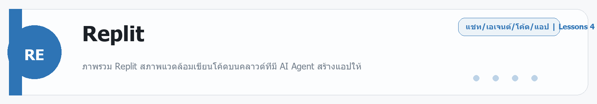
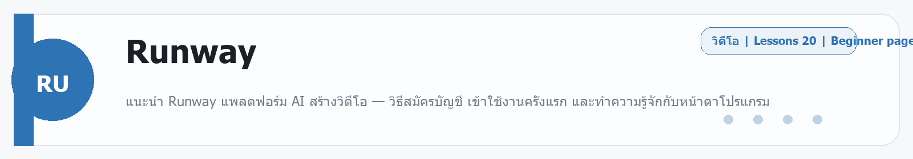

# Replit
Source: https://ailab.learnnakdev.online/docs/replit
Pages captured: 4

## Page 1 (หน้า 1 / 3)
```text
Replit
คู่มืออย่างเป็นทางการ
4 เอกสาร
เริ่มต้น
Replit คืออะไร — เขียนและรันโค้ดบนคลาวด์ พร้อม AI Agent

ภาพรวม Replit สภาพแวดล้อมเขียนโค้ดบนคลาวด์ที่มี AI Agent สร้างแอปให้ ·  6 นาที

หน้า 1 / 3
Replit — เขียน รัน และเผยแพร่โค้ดบนคลาวด์ 🌐

เรียบเรียงเป็นภาษาไทยจากเอกสารทางการ docs.replit.com

Replit คือสภาพแวดล้อมเขียนโปรแกรมบนคลาวด์ (Cloud IDE) ที่เปิดเบราว์เซอร์ก็เขียนและรันโค้ดได้ทันที ไม่ต้องติดตั้งอะไร รองรับหลายภาษา และมี Replit Agent ผู้ช่วย AI ที่ สร้างแอปทั้งระบบให้จากการบอกเป็นข้อความ ตั้งแต่เขียนโค้ด ต่อฐานข้อมูล ไปจนถึงดีพลอยขึ้นออนไลน์

📖 คำศัพท์ที่ควรรู้
คำศัพท์	ความหมายง่าย ๆ
Repl / Workspace	พื้นที่โปรเจกต์สำหรับเขียน-รันโค้ดบนคลาวด์
Replit Agent	ผู้ช่วย AI ที่สร้าง/แก้แอปให้จากคำสั่งภาษาคน
Deployment	การเผยแพร่แอปขึ้นออนไลน์ให้คนเข้าใช้
Database	ฐานข้อมูลในตัว (เก็บข้อมูลแอป)
Hosting	บริการโฮสต์ให้แอปออนไลน์ตลอด
⭐ จุดเด่น
เปิดเบราว์เซอร์ก็เขียนโค้ดได้ — ไม่ต้องตั้งค่าเครื่อง
Replit Agent — บอกเป็นข้อความ ได้แอปทั้งระบบ
รองรับหลายภาษา — Python, JavaScript, ฯลฯ
ดีพลอยในตัว — เผยแพร่ขึ้นออนไลน์ได้จากที่เดียว
ทำงานร่วมกันได้แบบเรียลไทม์ เหมือน Google Docs ของโค้ด
🚀 เริ่มต้นใช้งาน
สมัครที่ replit.com
ลองใช้ Replit Agent โดยพิมพ์บอกแอปที่อยากได้ เช่น "เว็บแบบสำรวจความเห็นพร้อมสรุปผล"
ดู Agent สร้างโปรเจกต์ + รันให้ดู แล้วพิมพ์สั่งปรับแก้
กด Deploy เพื่อเผยแพร่ขึ้นออนไลน์
📚 สารบัญเอกสาร Replit (ตาม official docs)
✅ ภาพรวม (หน้านี้)
⏳ Replit Agent — สร้างแอปด้วย AI
⏳ Workspace — เครื่องมือเขียนโค้ด
⏳ Database & Auth
⏳ Deployments & Hosting
🔗 อ้างอิง
เอกสารทางการ: https://docs.replit.com/
เว็บหลัก: https://replit.com/
 ก่อนหน้า
ถัดไป
Replit: Replit Agent — สร้างแอปด้วย AI
```

## Page 2 (หน้า 2 / 3)
```text
Replit
คู่มืออย่างเป็นทางการ
4 เอกสาร
เริ่มต้น
Replit: Replit Agent — สร้างแอปด้วย AI

ใช้ Replit Agent สร้างแอปทั้งระบบจากการบอกเป็นข้อความ ·  5 นาที

หน้า 2 / 3
Replit Agent — บอกเป็นข้อความ ได้แอปทั้งระบบ 🤖

เรียบเรียงเป็นภาษาไทยจากเอกสารทางการ docs.replit.com

Replit Agent คือผู้ช่วย AI ที่สร้างแอปให้คุณตั้งแต่ต้นจนจบ — เขียนโค้ด ติดตั้งสิ่งที่ต้องใช้ ต่อฐานข้อมูล และเตรียมให้ดีพลอยได้

▶️ เริ่มต้น
ล็อกอินที่ replit.com
เริ่มโปรเจกต์ใหม่ด้วย Replit Agent
พิมพ์บอกแอปที่อยากได้ เช่น "เว็บแบบสำรวจความเห็น พร้อมหน้าสรุปผลเป็นกราฟ"
ดู Agent วางแผน → เขียนโค้ด → รันให้ดู
พิมพ์สั่งปรับแก้ต่อ แล้ว Deploy
🧠 Agent ทำอะไรได้
สร้างโปรเจกต์ใหม่ทั้งโครง
เขียน/แก้โค้ดหลายไฟล์
ติดตั้ง dependencies ที่จำเป็น
ต่อฐานข้อมูล/ระบบล็อกอิน
ช่วยแก้ error ที่เจอ
💡 เคล็ดลับ
อธิบายเป้าหมายให้ชัด + ยกตัวอย่างการใช้งาน
แตกงานใหญ่เป็นขั้น ๆ
ตรวจผลแต่ละขั้นก่อนสั่งต่อ
บอก error ตรง ๆ ถ้าเจอ Agent จะช่วยไล่แก้
🔗 อ้างอิง
เอกสารทางการ: https://docs.replit.com/
 ก่อนหน้า
Replit คืออะไร — เขียนและรันโค้ดบนคลาวด์ พร้อม AI Agent
ถัดไป
Replit: Workspace — เครื่องมือเขียนโค้ดบนคลาวด์
```

## Page 3 (หน้า 3 / 3)
```text
Replit
คู่มืออย่างเป็นทางการ
4 เอกสาร
เริ่มต้น
Replit: Workspace — เครื่องมือเขียนโค้ดบนคลาวด์

ทำความรู้จัก Workspace ของ Replit ทั้งตัวแก้โค้ด terminal และการรันบนคลาวด์ ·  5 นาที

หน้า 3 / 3
Workspace — ห้องทำงานบนคลาวด์ 💻

เรียบเรียงเป็นภาษาไทยจากเอกสารทางการ docs.replit.com

Workspace คือพื้นที่เขียน-รันโค้ดของ Replit ที่ทำงานบนเบราว์เซอร์ ไม่ต้องติดตั้งอะไรบนเครื่อง

🗂️ ส่วนสำคัญ
ส่วน	ทำอะไร
Editor	เขียน/แก้โค้ด (มี autocomplete, AI ช่วย)
Console / Output	ดูผลลัพธ์ของโปรแกรม
Shell / Terminal	รันคำสั่ง ติดตั้งแพ็กเกจ
Files	จัดการไฟล์ในโปรเจกต์
Run ▶️	รันแอปแล้วดูผลทันที
🌐 รันบนคลาวด์
กดปุ่ม Run แล้วโค้ดรันบนเซิร์ฟเวอร์ของ Replit
เห็นผลผ่านหน้าต่าง preview ในเบราว์เซอร์
รองรับหลายภาษา (Python, JavaScript ฯลฯ)
👥 ทำงานร่วมกัน

Replit ให้หลายคนแก้โค้ดเดียวกัน พร้อมกันแบบเรียลไทม์ (คล้าย Google Docs ของโค้ด) เหมาะกับเรียน สอน หรือทำโปรเจกต์เป็นทีม

💡 เคล็ดลับ
ใช้ AI ในตัวช่วยอธิบาย/แก้โค้ด
ทุกอย่างอยู่บนคลาวด์ — เปิดเครื่องไหนก็ทำงานต่อได้
ใช้ Shell ติดตั้งไลบรารีเพิ่มได้อิสระ
🔗 อ้างอิง
เอกสารทางการ: https://docs.replit.com/
 ก่อนหน้า
Replit: Replit Agent — สร้างแอปด้วย AI
ถัดไป
Replit: Deployments & Database — เผยแพร่และเก็บข้อมูล
```

## Page 4 (หน้า 1 / 1)
```text
Replit
คู่มืออย่างเป็นทางการ
4 เอกสาร
ระดับกลาง
Replit: Deployments & Database — เผยแพร่และเก็บข้อมูล

เผยแพร่แอป Replit ขึ้นออนไลน์ และใช้ฐานข้อมูล/ระบบล็อกอินในตัว ·  5 นาที

หน้า 1 / 1
Deployments & Database — เอาแอปขึ้นจริง 🚀

เรียบเรียงเป็นภาษาไทยจากเอกสารทางการ docs.replit.com

🌐 Deployments (เผยแพร่)

เมื่อแอปพร้อม เผยแพร่ให้คนเข้าใช้ออนไลน์ได้:

กด Deploy ในโปรเจกต์
เลือกประเภทการ deploy ให้เหมาะกับแอป:
Autoscale — ปรับขนาดตามผู้ใช้ (เว็บทั่วไป)
Static — เว็บที่เป็นไฟล์นิ่ง (เร็ว ประหยัด)
Reserved VM — เซิร์ฟเวอร์เฉพาะ ทำงานตลอด (เช่นบอท)
ได้ URL สาธารณะ และโฮสต์ให้ตลอด
🗄️ Database (ฐานข้อมูล)

Replit มีฐานข้อมูลให้ใช้ในตัว:

เก็บข้อมูลแอป (เช่น ผู้ใช้ โพสต์ คำสั่งซื้อ)
ต่อใช้ได้จากโค้ดโดยตรง
เหมาะกับทั้งงานเล็กและงานจริง
🔐 Auth (ระบบสมาชิก)

มีตัวช่วยทำ ระบบล็อกอิน ให้ผู้ใช้สมัคร/เข้าสู่ระบบ โดยไม่ต้องเขียนเองทั้งหมด

💡 เคล็ดลับ
เลือกประเภท deploy ให้ตรงกับงาน (เว็บนิ่งใช้ Static จะถูกกว่า)
ตรวจฐานข้อมูลและสิทธิ์ก่อนเปิดสาธารณะ
ใช้ Replit Agent ช่วยตั้งค่า deploy ได้
🔗 อ้างอิง
เอกสารทางการ: https://docs.replit.com/
 ก่อนหน้า
Replit: Workspace — เครื่องมือเขียนโค้ดบนคลาวด์
ถัดไป
```


---

## Beginner Guide

### Replit

Source: daily-ai-lab-ai-tools-32page-beginner-guide.docx



**หมวด:** Chat / Agent / Coding / App
**บทเรียนใน /docs:** 4 หน้า

**ใช้ทำอะไร**
ภาพรวม Replit สภาพแวดล้อมเขียนโค้ดบนคลาวด์ที่มี AI Agent สร้างแอปให้

**พื้นฐานที่ควรรู้**
พื้นฐานที่ควรรู้คือ prompt, context, file, workspace, และการตรวจผลลัพธ์ก่อนนำไปใช้งานจริง. มือใหม่ควรเริ่มจากงานเล็กที่วัดผลได้ เช่น สรุปเอกสาร แก้โค้ดสั้น ๆ หรือทำต้นแบบหน้าเว็บหนึ่งหน้า

**เหมาะกับมือใหม่แบบไหน**
เหมาะกับคนที่อยากเขียนและ deploy แอปในเบราว์เซอร์โดยไม่ต้องตั้งเครื่องเยอะ.

**วิธีเริ่มแบบสั้น**
1. เปิด workspace หรือแชท แล้วให้โจทย์เดียวที่ชัดเจนพร้อมบริบทที่จำเป็น
2. แนบไฟล์ ตัวอย่าง หรือเป้าหมายที่อยากได้ เพื่อให้โมเดลอ่านภาพรวมได้เร็ว
3. ตรวจผลลัพธ์รอบแรก แล้วให้แก้แบบเฉพาะจุด เช่น tone, logic, code style หรือ structure

**ราคา/Plan**
Starter free; Core $20/month billed annually; Pro $100/month billed annually; Enterprise custom.

**สิ่งที่ควรจำ**
- จุดแข็ง: เหมาะกับคนที่อยากเขียนและ deploy แอปในเบราว์เซอร์โดยไม่ต้องตั้งเครื่องเยอะ.
- ข้อควรระวัง: ระวัง prompt ที่กว้างเกินไปและตรวจโค้ดหรือเอกสารทุกครั้งก่อนนำไปใช้จริง.

**ตัวอย่างเริ่มต้น**
ตัวอย่างงานเริ่มต้น: สร้างเว็บแอปง่าย ๆ สำหรับเก็บรายการงานและอธิบายวิธีรัน

---

---

<!-- merged-beginner-guide:Replit -->
## คู่มือพื้นฐานของ Replit

**หมวด:** Chat / Agent / Coding / App
**บทเรียนใน /docs:** 4 หน้า

**ใช้ทำอะไร**
ภาพรวม Replit สภาพแวดล้อมเขียนโค้ดบนคลาวด์ที่มี AI Agent สร้างแอปให้

**พื้นฐานที่ควรรู้**
พื้นฐานที่ควรรู้คือ prompt, context, file, workspace, และการตรวจผลลัพธ์ก่อนนำไปใช้งานจริง. มือใหม่ควรเริ่มจากงานเล็กที่วัดผลได้ เช่น สรุปเอกสาร แก้โค้ดสั้น ๆ หรือทำต้นแบบหน้าเว็บหนึ่งหน้า

**เหมาะกับมือใหม่แบบไหน**
เหมาะกับคนที่อยากเขียนและ deploy แอปในเบราว์เซอร์โดยไม่ต้องตั้งเครื่องเยอะ.

**วิธีเริ่มแบบสั้น**
1. เปิด workspace หรือแชท แล้วให้โจทย์เดียวที่ชัดเจนพร้อมบริบทที่จำเป็น
2. แนบไฟล์ ตัวอย่าง หรือเป้าหมายที่อยากได้ เพื่อให้โมเดลอ่านภาพรวมได้เร็ว
3. ตรวจผลลัพธ์รอบแรก แล้วให้แก้แบบเฉพาะจุด เช่น tone, logic, code style หรือ structure

**ราคา/Plan**
Starter free; Core $20/month billed annually; Pro $100/month billed annually; Enterprise custom.

**สิ่งที่ควรจำ**
- จุดแข็ง: เหมาะกับคนที่อยากเขียนและ deploy แอปในเบราว์เซอร์โดยไม่ต้องตั้งเครื่องเยอะ.
- ข้อควรระวัง: ระวัง prompt ที่กว้างเกินไปและตรวจโค้ดหรือเอกสารทุกครั้งก่อนนำไปใช้จริง.

**ตัวอย่างเริ่มต้น**
ตัวอย่างงานเริ่มต้น: สร้างเว็บแอปง่าย ๆ สำหรับเก็บรายการงานและอธิบายวิธีรัน

---


