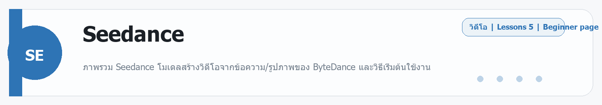

# Runway
Source: https://ailab.learnnakdev.online/docs/runway
Pages captured: 20

## Page 1 (หน้า 1 / 3)
```text
Runway
คู่มืออย่างเป็นทางการ
20 เอกสาร
เริ่มต้น
เริ่มต้นใช้งาน Runway

แนะนำ Runway แพลตฟอร์ม AI สร้างวิดีโอ — วิธีสมัครบัญชี เข้าใช้งานครั้งแรก และทำความรู้จักกับหน้าตาโปรแกรม ·  5 นาที

หน้า 1 / 3
เริ่มต้นใช้งาน Runway

เรียบเรียงจาก Runway Help Center สำหรับผู้เริ่มต้นที่ต้องการใช้ Runway สร้างวิดีโอด้วย AI

Runway คืออะไร?

Runway คือแพลตฟอร์ม AI สำหรับสร้างและแก้ไขวิดีโอ รูปภาพ และมีเดียประเภทอื่นๆ โดยใช้ปัญญาประดิษฐ์ (Artificial Intelligence) ที่ไม่ต้องมีความรู้ด้านการตัดต่อวิดีโอมาก่อนก็ใช้ได้

Runway มีเครื่องมือหลักหลายตัว เช่น:

Gen-4 / Gen-4.5 (โมเดลสร้างวิดีโอรุ่นล่าสุด — ทรงพลังและสมจริงมาก)
Act-Two (ระบบ AI แสดงการเคลื่อนไหวของตัวละคร)
Image-to-Video (แปลงภาพนิ่งให้เป็นวิดีโอ)
Video-to-Video (แก้ไขหรือเปลี่ยนสไตล์วิดีโอที่มีอยู่)
Motion Brush (แปรงควบคุมการเคลื่อนไหว — วาดบนส่วนที่ต้องการให้ขยับ)
ทำไมต้องใช้ Runway?
ข้อดี	รายละเอียด
ไม่ต้องโหลดซอฟต์แวร์	ทำงานบนเว็บเบราว์เซอร์ได้เลย
ใช้งานง่าย	พิมพ์คำอธิบาย แล้ว AI สร้างวิดีโอให้
หลากหลายเครื่องมือ	ตั้งแต่สร้างวิดีโอ ตัดพื้นหลัง ไปจนถึงเพิ่มเสียง
รองรับมืออาชีพ	ใช้ในวงการภาพยนตร์ โฆษณา และคอนเทนต์ครีเอเตอร์
วิธีสมัครบัญชี Runway
ขั้นตอนที่ 1: เข้าเว็บไซต์

ไปที่ runwayml.com แล้วคลิก "Get Started for Free" (เริ่มต้นใช้ฟรี)

ขั้นตอนที่ 2: สร้างบัญชี

คุณสามารถสมัครด้วย:

Google Account (บัญชี Google)
อีเมล และสร้างรหัสผ่านด้วยตัวเอง
ขั้นตอนที่ 3: เลือกแผน

Runway มีแผนดังนี้:

Free (ฟรี) — ได้ Credits (เครดิต — หน่วยที่ใช้สร้างวิดีโอ) จำนวนหนึ่งต่อเดือน
Standard / Pro / Unlimited (แผนชำระเงิน) — ได้ Credits มากขึ้น และปลดล็อกฟีเจอร์เพิ่มเติม

เคล็ดลับ: ถ้าเพิ่งเริ่มต้น แนะนำให้ใช้ Free Plan ก่อน เพื่อทดลองเครื่องมือต่างๆ

ขั้นตอนที่ 4: เข้าสู่ Workspace

หลังจากล็อกอิน คุณจะเข้าสู่ Workspace (พื้นที่ทำงาน — หน้าหลักของ Runway) ซึ่งแสดงเครื่องมือทั้งหมดที่ใช้ได้

ทำความรู้จักกับ Workspace

Workspace (พื้นที่ทำงาน) ของ Runway ประกอบด้วย:

แถบนำทางหลัก (Navigation Bar)
Home — หน้าหลัก ดูผลงานล่าสุดและเครื่องมือแนะนำ
Assets (สินทรัพย์สื่อ — ไฟล์รูปและวิดีโอที่อัปโหลดไว้) — จัดการไฟล์ของคุณ
Projects (โปรเจกต์ — งานที่สร้าง) — จัดระเบียบงานแยกเป็นโปรเจกต์
Tools (เครื่องมือ) — รายการ AI Tools ทั้งหมด
Dashboard (แดชบอร์ด — หน้าสรุปภาพรวม)

แสดงข้อมูลสำคัญ เช่น:

Credits (เครดิต) ที่เหลืออยู่
งานที่สร้างล่าสุด
เครื่องมือที่ใช้บ่อย
Credits คืออะไร?

Credits (เครดิต — หน่วยทรัพยากรในการสร้างสื่อ) คือหน่วยที่ใช้สำหรับการสร้างวิดีโอและรูปภาพใน Runway

การสร้างวิดีโอ 1 คลิป ใช้ Credits ต่างกันขึ้นอยู่กับโมเดลและความยาว
Credits จะถูกหักทุกครั้งที่กด Generate (สร้าง)
ถ้า Credits หมด ต้องซื้อเพิ่มหรืออัปเกรดแผน
ตัวอย่างการใช้ Credits:
งาน	Credits ที่ใช้ (โดยประมาณ)
สร้างวิดีโอ 5 วินาที (Gen-4.5)	60 credits
สร้างรูปภาพ (Gen4 Image)	5-8 credits
Text-to-Speech (เปลี่ยนข้อความเป็นเสียง)	1 credit ต่อ 50 ตัวอักษร
ขั้นตอนแรกที่ควรทำหลังสมัคร
ทดลอง Text-to-Video — พิมพ์คำอธิบายวิดีโอที่ต้องการ แล้วดูว่า AI สร้างอะไรออกมา
อัปโหลดรูปภาพ — ลองใช้ Image-to-Video เพื่อแปลงรูปของคุณให้เคลื่อนไหว
ดู Templates (แม่แบบ — ตัวอย่างงานที่สร้างสำเร็จรูป) — เพื่อแรงบันดาลใจ
เช็ค Credits — ดูว่าเหลือเท่าไหร่ก่อนเริ่มสร้างงานจริง
เคล็ดลับสำหรับผู้เริ่มต้น
เริ่มจากคำอธิบายสั้นๆ ก่อน แล้วค่อยๆ เพิ่มรายละเอียด
ถ้าผลลัพธ์ไม่ถูกใจ ลองเปลี่ยนคำอธิบาย (Prompt) แล้ว Generate ใหม่
ดูตัวอย่างงานของคนอื่นใน Community (ชุมชน) เพื่อเรียนรู้เทคนิค
บันทึกผลงานที่ชอบไว้ใน Projects เพื่อจัดระเบียบ
สรุป

Runway เป็นเครื่องมือ AI ที่ใช้งานง่ายสำหรับการสร้างวิดีโอและสื่อดิจิทัล ไม่ต้องมีประสบการณ์การตัดต่อมาก่อน เพียงแค่สมัครบัญชี เลือกเครื่องมือที่ต้องการ และพิมพ์คำอธิบายสิ่งที่ต้องการสร้าง AI ก็จะทำงานให้ บทต่อไปเราจะเรียนรู้เกี่ยวกับ Gen-4 Alpha และวิธีสร้างวิดีโอจากข้อความ

 ก่อนหน้า
ถัดไป
Gen-4 / Gen-4.5 — สร้างวิดีโอจากข้อความ
```

## Page 2 (หน้า 2 / 3)
```text
Runway
คู่มืออย่างเป็นทางการ
20 เอกสาร
เริ่มต้น
Gen-4 / Gen-4.5 — สร้างวิดีโอจากข้อความ

เรียนรู้การใช้ Gen-4 และ Gen-4.5 โมเดล AI รุ่นล่าสุดของ Runway สำหรับสร้างวิดีโอจากข้อความ (Text-to-Video) พร้อมเทคนิคเขียน Prompt ภาษาอังกฤษให้ได้ผลลัพธ์ดีที่สุด ·  7 นาที

หน้า 2 / 3
Gen-4 / Gen-4.5 — สร้างวิดีโอจากข้อความ (Text-to-Video)

Gen-4.5 คือโมเดล AI สร้างวิดีโอรุ่นล่าสุดของ Runway ที่ได้รับการยกย่องว่าเป็น "วิดีโอโมเดลที่ดีที่สุดในโลก" ณ ปัจจุบัน

Gen-4.5 คืออะไร?

Gen-4.5 (Generation 4.5 — โมเดลสร้างวิดีโอรุ่นที่ 4.5 ของ Runway) คือโมเดล AI ที่สามารถสร้างวิดีโอความละเอียดสูงจากข้อความเพียงอย่างเดียว หรือจากรูปภาพ + ข้อความประกอบ

ความสามารถหลักของ Gen-4.5:
สร้างวิดีโอจากคำอธิบายข้อความล้วน (Text-to-Video)
แปลงรูปภาพให้เป็นวิดีโอ (Image-to-Video)
รองรับวิดีโอความยาว 5-10 วินาที
ความละเอียดสูงสุด 1280x720 (Landscape) หรือ 720x1280 (Portrait)
โมเดลในตระกูล Gen-4:
โมเดล	ความเร็ว	คุณภาพ	Credits/วินาที
Gen-4.5	ปานกลาง	สูงสุด	12 credits
Gen-4 Turbo	เร็ว	ดี	5 credits
วิธีใช้ Text-to-Video
ขั้นตอนที่ 1: เลือกเครื่องมือ
ล็อกอินเข้า Runway
ในหน้า Home คลิก "Video" หรือ "Text/Image to Video"
เลือกโมเดล Gen-4.5 จากเมนูด้านบน
ขั้นตอนที่ 2: เขียน Prompt

Prompt (พรอมต์ — คำอธิบายหรือคำสั่งให้ AI) คือหัวใจสำคัญของการสร้างวิดีโอ

โครงสร้าง Prompt ที่ดี:

[Subject] + [Action] + [Setting] + [Style/Mood] + [Camera movement]


ตัวอย่าง Prompt ดีๆ:

A golden retriever puppy running through a field of sunflowers,
warm afternoon light, cinematic, slow motion, tracking shot


(ลูกสุนัขโกลเด้นรีทรีฟเวอร์วิ่งผ่านทุ่งทานตะวัน แสงยามบ่าย โทนภาพยนตร์ สโลว์โมชั่น กล้องติดตาม)

A futuristic city at night with neon lights reflecting on wet streets,
cyberpunk aesthetic, aerial drone shot, rain


(เมืองอนาคตในค่ำคืนที่มีไฟนีออนสะท้อนบนถนนเปียก สไตล์ไซเบอร์พังก์ มุมกล้องโดรนจากด้านบน ฝนตก)

ขั้นตอนที่ 3: ปรับการตั้งค่า

Duration (ระยะเวลา — ความยาวของวิดีโอ):

5 seconds (5 วินาที) — ใช้ Credits น้อยกว่า เหมาะสำหรับทดลอง
10 seconds (10 วินาที) — ได้วิดีโอยาวขึ้น ใช้ Credits มากกว่า

Aspect Ratio (อัตราส่วนภาพ — สัดส่วนความกว้างต่อความสูง):

16:9 (1280x720) — มาตรฐาน Landscape เหมาะสำหรับ YouTube, TV
9:16 (720x1280) — Portrait เหมาะสำหรับ TikTok, Instagram Reels
ขั้นตอนที่ 4: Generate
คลิกปุ่ม "Generate" (สร้าง)
รอ AI ประมวลผล (ประมาณ 30-90 วินาที)
ดูผลลัพธ์ที่ได้
เทคนิคการเขียน Prompt ให้ได้ผลดี
คำศัพท์ที่ช่วยให้วิดีโอสวย

การเคลื่อนไหวกล้อง (Camera Movement):

คำศัพท์	ความหมาย
dolly in	กล้องเคลื่อนเข้าหาวัตถุ
pan left/right	กล้องหมุนซ้าย/ขวา
tracking shot	กล้องติดตามวัตถุที่เคลื่อนไหว
aerial shot	มุมกล้องจากสูง
close-up	ภาพระยะใกล้
wide shot	ภาพมุมกว้าง

สไตล์ภาพ (Visual Style):

คำศัพท์	ความหมาย
cinematic	สไตล์ภาพยนตร์
photorealistic	สมจริงเหมือนถ่ายรูปจริง
anime style	สไตล์การ์ตูนญี่ปุ่น
oil painting	สไตล์ภาพวาดสีน้ำมัน
8K ultra HD	ความละเอียดสูงมาก

แสงและบรรยากาศ (Lighting & Atmosphere):

คำศัพท์	ความหมาย
golden hour	แสงช่วงพระอาทิตย์ตก
soft lighting	แสงนุ่มนวล
dramatic lighting	แสงดราม่า
foggy	มีหมอก
volumetric light	แสงที่มีปริมาตร ดูลึก
ตัวอย่าง Prompt และผลลัพธ์
ตัวอย่างที่ 1: ธรรมชาติ

Prompt ที่ดี:

Majestic waterfall in a lush tropical forest,
mist rising, golden hour lighting,
slow motion water flow, cinematic wide shot


Prompt ที่ควรหลีกเลี่ยง:

น้ำตกสวย


(สั้นเกินไป ขาดรายละเอียด)

ตัวอย่างที่ 2: บุคคล

Prompt ที่ดี:

A young woman with long dark hair walking through
a cherry blossom park in Tokyo, spring afternoon,
soft pink petals falling, medium shot, film grain

Negative Prompt — บอก AI ว่าไม่ต้องการอะไร

Negative Prompt (พรอมต์เชิงลบ — คำอธิบายสิ่งที่ไม่ต้องการในวิดีโอ) ช่วยป้องกันไม่ให้ AI สร้างสิ่งที่ไม่ต้องการ

ตัวอย่าง Negative Prompt:

blurry, distorted, low quality, watermark, text overlay,
unrealistic proportions, extra limbs


(ไม่ชัด, บิดเบี้ยว, คุณภาพต่ำ, ลายน้ำ, ข้อความซ้อน, สัดส่วนไม่ถูกต้อง, แขนขาเกิน)

Gen-4 Turbo — ตัวเลือกประหยัด Credits

ถ้าต้องการทดลองและไม่อยากเสีย Credits มาก ใช้ Gen-4 Turbo (เทอร์โบ — รุ่นเร็ว ประหยัดทรัพยากร) แทน

เร็วกว่า Gen-4.5 ประมาณ 2 เท่า
ใช้ Credits เพียง 5 credits/วินาที (เทียบกับ 12 credits/วินาที ของ Gen-4.5)
คุณภาพยังดีมาก เหมาะสำหรับงาน draft หรือทดลอง concept
ข้อจำกัดและสิ่งที่ควรรู้
Runway ไม่สามารถสร้าง ภาพที่มีความรุนแรง เนื้อหาผู้ใหญ่ หรือเนื้อหาที่ละเมิดลิขสิทธิ์
ใบหน้าคนจริง อาจถูกกรองหากไม่ผ่านนโยบาย Content Moderation (การตรวจสอบเนื้อหา)
ข้อความในวิดีโอ ยังอ่านยากหรือผิดเพี้ยนได้ (AI ยังสร้างตัวอักษรได้ไม่สมบูรณ์แบบ)
Credits ที่ใช้ไปจะไม่คืนแม้ผลลัพธ์ไม่ถูกใจ
สรุป

Gen-4.5 คือโมเดลสร้างวิดีโอที่ทรงพลังที่สุดของ Runway ปัจจุบัน กุญแจสำคัญคือการเขียน Prompt ที่ละเอียดและมีรายละเอียดเพียงพอ ยิ่ง Prompt ดี ผลลัพธ์ยิ่งสวย ลองฝึกเขียน Prompt หลายๆ แบบและเปรียบเทียบผลลัพธ์เพื่อหาสูตรที่เหมาะกับงานของคุณ

 ก่อนหน้า
เริ่มต้นใช้งาน Runway
ถัดไป
Image to Video — แปลงรูปภาพให้เคลื่อนไหว
```

## Page 3 (หน้า 3 / 3)
```text
Runway
คู่มืออย่างเป็นทางการ
20 เอกสาร
เริ่มต้น
Image to Video — แปลงรูปภาพให้เคลื่อนไหว

เรียนรู้การใช้ฟีเจอร์ Image-to-Video ของ Runway เพื่อแปลงรูปภาพนิ่งให้กลายเป็นวิดีโอที่มีชีวิตชีวา พร้อมเทคนิคเลือกรูปให้ได้ผลลัพธ์ดีที่สุด ·  6 นาที

หน้า 3 / 3
Image to Video — แปลงรูปภาพให้เคลื่อนไหว

Image-to-Video (การแปลงภาพนิ่งเป็นวิดีโอ) คือหนึ่งในฟีเจอร์ที่ได้รับความนิยมมากที่สุดของ Runway — เพียงแค่อัปโหลดรูปภาพ AI ก็จะสร้างวิดีโอที่สมจริงให้

Image-to-Video คืออะไร?

Image-to-Video คือกระบวนการที่ AI วิเคราะห์รูปภาพนิ่งของคุณ แล้วสร้างการเคลื่อนไหวที่เป็นธรรมชาติให้กับภาพนั้น

ตัวอย่างเช่น:

รูปทะเลนิ่งๆ → วิดีโอคลื่นทะเลที่กระเพื่อม
รูปคนยืนอยู่ → วิดีโอคนเดินหรือขยับ
รูปป่าไม้ → วิดีโอใบไม้สั่นไหวในลม
รูปอาหาร → วิดีโอไอน้ำขึ้นจากอาหารร้อน
โมเดลที่ใช้ใน Image-to-Video
Gen-4.5 (แนะนำ)
คุณภาพสูงสุด การเคลื่อนไหวสมจริงมาก
ใช้ 12 credits/วินาที
รองรับ Landscape (1280x720) และ Portrait (720x1280)
Gen-4 Turbo
เร็วกว่า ประหยัดมากกว่า
ใช้ 5 credits/วินาที
เหมาะสำหรับทดลองหรืองาน draft
วิธีใช้ Image-to-Video
ขั้นตอนที่ 1: เตรียมรูปภาพ

รูปที่ดีสำหรับ Image-to-Video ควร:

มีความละเอียดอย่างน้อย 640x640 pixels (พิกเซล — จุดภาพ)
ไม่ควรเกิน 4K resolution (4,096 x 4,096 pixels)
รูปแบบไฟล์: JPEG, PNG, หรือ WebP
ขนาดไฟล์ไม่เกิน 16MB
ขั้นตอนที่ 2: อัปโหลดรูป
ในหน้า Runway คลิก "Image to Video"
คลิก "Upload Image" (อัปโหลดรูปภาพ) หรือลากไฟล์มาวาง
รอให้รูปอัปโหลดเสร็จ
ขั้นตอนที่ 3: เพิ่ม Prompt (ไม่บังคับแต่แนะนำ)

แม้ว่าจะไม่ต้องใส่ Prompt ก็ได้ แต่การเพิ่มคำอธิบายจะช่วยให้วิดีโอตรงใจมากขึ้น

ตัวอย่าง Prompt สำหรับ Image-to-Video:

หากรูปเป็นชายหาด:

Gentle ocean waves rolling in, warm breeze,
seagulls flying in the background, golden sunset


(คลื่นทะเลเบาๆ ลมอุ่น นกนางนวลบินอยู่เบื้องหลัง พระอาทิตย์ตกสีทอง)

หากรูปเป็นตัวละคร:

Character smiling and waving at camera,
natural movement, soft lighting


(ตัวละครยิ้มและโบกมือหากล้อง การเคลื่อนไหวธรรมชาติ แสงนุ่มนวล)

ขั้นตอนที่ 4: ตั้งค่า Duration และ Aspect Ratio
Duration (ระยะเวลา): 5 หรือ 10 วินาที
Aspect Ratio (อัตราส่วนภาพ): เลือกให้ตรงกับรูปต้นฉบับ

สำคัญ: ถ้า Aspect Ratio ไม่ตรงกัน Runway จะ Auto-crop (ตัดขอบรูปอัตโนมัติจากกลาง) ซึ่งอาจทำให้ส่วนสำคัญของรูปหายไป

ขั้นตอนที่ 5: Generate

คลิก "Generate" แล้วรอผล

เทคนิคเลือกรูปให้ได้ผลดี
รูปที่เหมาะสม
รูปที่มีวัตถุชัดเจนและแยกจากพื้นหลังได้
รูปที่มีองค์ประกอบที่เคลื่อนไหวได้ตามธรรมชาติ (น้ำ, ใบไม้, ผม)
รูปที่มีแสงและเงาที่ดี
รูปที่ไม่มีข้อความหรือลายน้ำ (Watermark)
รูปที่ควรหลีกเลี่ยง
รูปที่มีคุณภาพต่ำหรือเบลอมาก
รูปที่มีองค์ประกอบซับซ้อนเกินไป
รูปที่ถ่ายในแสงน้อย (Dark/Low light)
รูปการ์ตูนหรือ Illustration ที่มีเส้นสายซับซ้อน
Motion Brush กับ Image-to-Video

Motion Brush (แปรงควบคุมการเคลื่อนไหว) สามารถใช้ร่วมกับ Image-to-Video เพื่อควบคุมว่าส่วนไหนของรูปควรเคลื่อนไหว (อ่านรายละเอียดเพิ่มเติมในบท Motion Brush)

First Frame / Last Frame — ควบคุมจุดเริ่มต้นและจุดสิ้นสุด

First Frame (เฟรมแรก — ภาพแรกของวิดีโอ) และ Last Frame (เฟรมสุดท้าย — ภาพสุดท้ายของวิดีโอ) ให้คุณกำหนดได้ว่าวิดีโอจะเริ่มและจบที่ภาพไหน

วิธีใช้:

อัปโหลด First Frame (รูปเริ่มต้น)
อัปโหลด Last Frame (รูปจุดสิ้นสุด)
AI จะสร้างการเคลื่อนไหวเชื่อมระหว่างสองภาพ

ประโยชน์:

สร้าง Transition (การเปลี่ยนผ่าน) ระหว่างสองฉาก
ควบคุมว่าตัวละครจะเริ่มและจบในท่าไหน
สร้าง Morphing (การแปลงร่าง) จากวัตถุหนึ่งไปอีกวัตถุหนึ่ง
ตัวอย่างการใช้งานจริง
สำหรับนักการตลาด (Marketers)
แปลงรูปสินค้าให้เป็นวิดีโอโฆษณา
สร้าง Lifestyle video (วิดีโอไลฟ์สไตล์) จากรูปถ่ายสต็อก
ทำ Animated thumbnail (ภาพขนาดย่อเคลื่อนไหว) สำหรับ YouTube
สำหรับนักสร้างคอนเทนต์
แปลงรูปศิลปะ Digital Art ให้มีชีวิต
สร้าง Instagram Reels จากรูปถ่ายเที่ยว
ทำ Animated profile picture (รูปโปรไฟล์เคลื่อนไหว)
สำหรับนักออกแบบ
สร้าง Mockup Video (วิดีโอตัวอย่าง) จากภาพ Mockup นิ่ง
แปลงภาพ UI design ให้เป็น Interactive demo
ทำ Storyboard animation (แอนิเมชั่นสตอรีบอร์ด)
ข้อจำกัด
AI จะพยายามสร้างการเคลื่อนไหวที่เป็นธรรมชาติ แต่บางครั้งอาจมีความผิดเพี้ยนในส่วนที่ซับซ้อน
ใบหน้าคนจริงบางครั้งอาจดูแปลกหลังจากสร้างการเคลื่อนไหว
รูปที่มีรายละเอียดมากๆ อาจทำให้ผลลัพธ์คาดเดาได้ยาก
สรุป

Image-to-Video เป็นฟีเจอร์ที่ทรงพลังมากสำหรับการสร้างคอนเทนต์วิดีโอโดยไม่ต้องถ่ายเองตั้งแต่ต้น กุญแจสำคัญคือเลือกรูปที่มีคุณภาพดีและมีองค์ประกอบที่เคลื่อนไหวได้ตามธรรมชาติ ร่วมกับการเขียน Prompt ที่ชัดเจนเพื่อควบคุมทิศทางการเคลื่อนไหว

 ก่อนหน้า
Gen-4 / Gen-4.5 — สร้างวิดีโอจากข้อความ
ถัดไป
Video to Video — แก้ไขและเปลี่ยนสไตล์วิดีโอ
```

## Page 4 (หน้า 1 / 5)
```text
Runway
คู่มืออย่างเป็นทางการ
20 เอกสาร
ระดับกลาง
Video to Video — แก้ไขและเปลี่ยนสไตล์วิดีโอ

เรียนรู้การใช้ Video-to-Video เพื่อเปลี่ยนสไตล์วิดีโอ แก้ไขเนื้อหา หรือนำวิดีโอที่มีอยู่มาเป็นพื้นฐานในการสร้างวิดีโอใหม่ด้วย AI ·  7 นาที

หน้า 1 / 5
Video to Video — แก้ไขและเปลี่ยนสไตล์วิดีโอ

Video-to-Video (วิดีโอสู่วิดีโอ) ช่วยให้คุณนำวิดีโอที่มีอยู่มาแปลงสไตล์ เปลี่ยนสภาพแวดล้อม หรือแก้ไของค์ประกอบต่างๆ โดยใช้ AI

Video-to-Video คืออะไร?

Video-to-Video (V2V) คือกระบวนการที่นำวิดีโอต้นฉบับมาเป็น "กระดูกสันหลัง" ของการเคลื่อนไหว แล้วให้ AI แทนที่รูปแบบภาพตามที่คุณต้องการ

ตัวอย่างการใช้งาน:

วิดีโอคนเต้นรำ → เปลี่ยนเป็นหุ่นยนต์เต้น
วิดีโอถนนในเมือง → เปลี่ยนเป็นถนนในโลกอนาคต
วิดีโอคน → เปลี่ยนเป็นตัวการ์ตูน
วิดีโอกลางวัน → เปลี่ยนเป็นกลางคืน
โมเดลที่ใช้ใน Video-to-Video
Aleph 2 (Aleph 2 — โมเดล V2V ทรงพลัง)

Aleph 2 (อเลฟ 2) คือโมเดล AI ที่ออกแบบมาเฉพาะสำหรับ Video-to-Video โดยเฉพาะ มีความสามารถสูงในการรักษาการเคลื่อนไหวจากวิดีโอต้นฉบับ พร้อมเปลี่ยนสไตล์ภาพ

ใช้ 28 credits/วินาที (ขั้นต่ำ 56 credits)
เหมาะสำหรับงานที่ต้องการคุณภาพสูง
Gen-4 Aleph
รุ่นที่ผสมความสามารถของ Gen-4 กับ Aleph
รักษาอัตลักษณ์ของวิดีโอต้นฉบับได้ดี
วิธีใช้ Video-to-Video
ขั้นตอนที่ 1: เตรียมวิดีโอต้นฉบับ

ข้อกำหนดวิดีโอ:

รูปแบบไฟล์: MP4, MOV, MKV, WebM
Codec (โคเดก — รูปแบบการบีบอัดวิดีโอ): H.264, H.265, AV1
ขนาดไฟล์: ไม่เกิน 32MB (ผ่าน URL) หรือ 200MB (ผ่าน Ephemeral Upload)
ความยาว: 2-10 วินาทีแนะนำสำหรับผลลัพธ์ดีที่สุด
ขั้นตอนที่ 2: อัปโหลดวิดีโอ
คลิก "Video to Video" ในเมนู
อัปโหลดวิดีโอต้นฉบับ
รอให้วิดีโออัปโหลดและประมวลผลเสร็จ
ขั้นตอนที่ 3: เขียน Prompt เพื่อกำหนดสไตล์ใหม่

Prompt ในโหมด V2V จะบอก AI ว่าต้องการให้วิดีโอหน้าตาเป็นอย่างไร

ตัวอย่าง Prompt V2V:

เปลี่ยนเป็นสไตล์อนิเมะ:

Anime style, vibrant colors, Studio Ghibli aesthetic,
hand-drawn look, detailed backgrounds


เปลี่ยนเป็นสไตล์อนาคต:

Futuristic cyberpunk city, neon lights,
holographic displays, rainy night,
blade runner aesthetic


เปลี่ยนเป็นสีน้ำมัน:

Oil painting style, impressionist brushstrokes,
rich textures, museum quality artwork

ขั้นตอนที่ 4: ปรับ Style Strength

Style Strength (ความเข้มของสไตล์ — ระดับที่ AI เปลี่ยนแปลงจากต้นฉบับ) เป็นค่าที่บอก AI ว่าควรเปลี่ยนแปลงมากน้อยแค่ไหน

ค่าต่ำ (Low) — วิดีโอยังคล้ายต้นฉบับ มีแค่สไตล์เล็กน้อย
ค่ากลาง (Medium) — สมดุลระหว่างต้นฉบับและสไตล์ใหม่
ค่าสูง (High) — AI เปลี่ยนแปลงมาก อาจแตกต่างจากต้นฉบับมาก
เทคนิคการใช้ Video-to-Video ให้ได้ผลดี
เลือกวิดีโอที่มีการเคลื่อนไหวที่ชัดเจน

วิดีโอที่ดีสำหรับ V2V ควรมีการเคลื่อนไหวที่ชัดเจนและสม่ำเสมอ หลีกเลี่ยงวิดีโอที่สั่น (Shaky) หรือมีการตัดต่อถี่มาก

ใช้ Prompt ที่สอดคล้องกับเนื้อหาวิดีโอ

ถ้าวิดีโอมีคน ให้ระบุในพรอมต์ว่าต้องการให้ตัวละครมีลักษณะอย่างไรในสไตล์ใหม่

ทดลองหลาย Style Strength

ทดลอง Style Strength หลายระดับเพื่อหาจุดสมดุลที่พอใจ

กรณีการใช้งานจริง
ใช้ใน Production (การผลิตสื่อมืออาชีพ)

Film & TV (ภาพยนตร์และโทรทัศน์):

เปลี่ยนสภาพแวดล้อม Background ของฉาก
เพิ่มเอฟเฟกต์พิเศษให้วิดีโอ Live Action (การแสดงสด)

Advertising (โฆษณา):

ปรับสไตล์โฆษณาเดิมให้เข้ากับแคมเปญใหม่
สร้างเวอร์ชันต่างๆ ของโฆษณาสำหรับกลุ่มเป้าหมายต่างกัน

Content Creation (การสร้างคอนเทนต์):

สร้าง Lofi aesthetic (สไตล์ Lo-fi — ภาพย้อนยุคนุ่มนวล) จากวิดีโอธรรมดา
แปลงวิดีโอ Vlog เป็นสไตล์ภาพยนตร์
ข้อควรระวัง
ความสม่ำเสมอ (Consistency): วิดีโอยาวๆ อาจมีความไม่สม่ำเสมอในสไตล์ระหว่างเฟรม
Flickering (การกระพริบ — ภาพที่สั่นหรือกระพริบ): อาจเกิดขึ้นถ้า Style Strength สูงเกินไป
รายละเอียดเล็กๆ: AI อาจเปลี่ยนแปลงรายละเอียดเล็กๆ ที่ไม่ต้องการ
ลิขสิทธิ์: ห้ามใช้วิดีโอที่มีลิขสิทธิ์ของผู้อื่นโดยไม่ได้รับอนุญาต
เปรียบเทียบ V2V กับ T2V
หัวข้อ	Video-to-Video (V2V)	Text-to-Video (T2V)
ต้นทาง	วิดีโอที่มีอยู่	ข้อความอย่างเดียว
การควบคุม	ควบคุมการเคลื่อนไหวได้ดี	ขึ้นกับ AI ล้วน
เหมาะสำหรับ	แก้ไขหรือเปลี่ยนสไตล์งานเก่า	สร้างใหม่ตั้งแต่ต้น
Credits	สูงกว่าเล็กน้อย	ปกติ
สรุป

Video-to-Video เปิดโอกาสให้นำวิดีโอที่มีอยู่มาแปลงโฉมใหม่ได้อย่างสร้างสรรค์ ไม่ว่าจะเป็นการเปลี่ยนสไตล์ศิลป์ เปลี่ยนสภาพแวดล้อม หรือสร้าง Visual Effect พิเศษ เครื่องมือนี้มีประโยชน์มากสำหรับทั้งนักสร้างคอนเทนต์และมืออาชีพด้านสื่อ

 ก่อนหน้า
Image to Video — แปลงรูปภาพให้เคลื่อนไหว
ถัดไป
Motion Brush — ควบคุมการเคลื่อนไหวด้วยแปรง
```

## Page 5 (หน้า 2 / 5)
```text
Runway
คู่มืออย่างเป็นทางการ
20 เอกสาร
ระดับกลาง
Motion Brush — ควบคุมการเคลื่อนไหวด้วยแปรง

เรียนรู้การใช้ Motion Brush เครื่องมือวาดการเคลื่อนไหวบนรูปภาพ เพื่อควบคุมว่าส่วนไหนของภาพควรขยับและในทิศทางใด ·  6 นาที

หน้า 2 / 5
Motion Brush — ควบคุมการเคลื่อนไหวด้วยแปรง

Motion Brush (แปรงควบคุมการเคลื่อนไหว — วาดบนส่วนที่ต้องการให้ขยับ) คือเครื่องมือที่ทำให้คุณระบุได้อย่างแม่นยำว่าส่วนไหนของภาพควรเคลื่อนไหว และในทิศทางใด

Motion Brush คืออะไร?

ปกติเมื่อใช้ Image-to-Video AI จะตัดสินใจเองว่าส่วนไหนควรเคลื่อนไหว แต่ Motion Brush ให้อำนาจควบคุมนั้นแก่คุณ

ด้วย Motion Brush คุณสามารถ:

วาดบนส่วนที่ต้องการให้ขยับ และกำหนดทิศทาง
ทิ้งส่วนที่ไม่ต้องการให้ขยับ ให้นิ่ง
สร้างการเคลื่อนไหวที่ซับซ้อน เช่น ผมสั่นแต่ใบหน้านิ่ง
วิธีใช้ Motion Brush
ขั้นตอนที่ 1: อัปโหลดรูปภาพ
เปิด Image-to-Video ใน Runway
อัปโหลดรูปภาพที่ต้องการ
คลิกปุ่ม "Motion Brush" ที่ปรากฏหลังอัปโหลดรูป
ขั้นตอนที่ 2: เลือก Brush Layer

Motion Brush รองรับการวาดหลายชั้น (Layer) แยกกัน แต่ละ Layer มีสี:

Layer 1 (สีน้ำเงิน) — วาดบริเวณที่ 1
Layer 2 (สีเขียว) — วาดบริเวณที่ 2
Layer 3 (สีเหลือง) — วาดบริเวณที่ 3
และ Layer อื่นๆ

แต่ละ Layer สามารถกำหนดทิศทางการเคลื่อนไหวแยกกันได้

ขั้นตอนที่ 3: วาดบริเวณที่ต้องการ
เลือก Layer ที่ต้องการ
ใช้เมาส์หรือนิ้ว (สำหรับอุปกรณ์ Touch) วาดทับบนส่วนที่ต้องการให้เคลื่อนไหว
ปรับขนาดแปรง (Brush Size) ตามต้องการ
ขั้นตอนที่ 4: กำหนดทิศทางการเคลื่อนไหว

สำหรับแต่ละ Layer กำหนด:

Horizontal (แกนนอน — การเคลื่อนที่ซ้าย-ขวา):

ค่าบวก (+) = เคลื่อนไปทางขวา
ค่าลบ (-) = เคลื่อนไปทางซ้าย

Vertical (แกนตั้ง — การเคลื่อนที่ขึ้น-ลง):

ค่าบวก (+) = เคลื่อนลง
ค่าลบ (-) = เคลื่อนขึ้น

Rotation (การหมุน):

ค่าบวก = หมุนตามเข็มนาฬิกา
ค่าลบ = หมุนทวนเข็มนาฬิกา

Speed (ความเร็วการเคลื่อนไหว):

ค่า 0 = นิ่งสนิท
ค่าสูง = เคลื่อนไหวเร็ว
ขั้นตอนที่ 5: ดูตัวอย่างและ Generate
คลิก "Preview" (ดูตัวอย่าง) เพื่อดูว่าการเคลื่อนไหวจะเป็นอย่างไร
ถ้าพอใจ คลิก "Generate"
ตัวอย่างการใช้งาน Motion Brush
ตัวอย่างที่ 1: ผมปลิว

รูปต้นฉบับ: หญิงสาวถ่ายรูปในสวน

Motion Brush:

Layer 1: วาดที่ผม → ทิศทาง Horizontal ±2, เล็กน้อย
Layer 2: วาดที่ร่างกาย → ค่า 0 ทุกแกน (นิ่ง)
Layer 3: วาดที่ใบไม้รอบๆ → ทิศทาง Horizontal เล็กน้อย

ผลลัพธ์: ผมและใบไม้สั่นไหวตามลม แต่ใบหน้าคมชัดนิ่ง

ตัวอย่างที่ 2: เมฆเคลื่อน

รูปต้นฉบับ: ท้องฟ้าพร้อมเมฆ

Motion Brush:

Layer 1: วาดที่เมฆ → Horizontal +3 (เคลื่อนไปขวา)
Layer 2: วาดที่พื้นดินและต้นไม้ → ค่า 0 (นิ่ง)

ผลลัพธ์: เมฆลอยผ่าน พื้นหลังนิ่ง

ตัวอย่างที่ 3: น้ำไหล

รูปต้นฉบับ: แม่น้ำในป่า

Motion Brush:

Layer 1: วาดที่ผิวน้ำ → Vertical +2 (เคลื่อนลงตามกระแสน้ำ)
Layer 2: วาดที่หิน ต้นไม้ ริมฝั่ง → ค่า 0 (นิ่ง)

ผลลัพธ์: น้ำไหลดูสมจริง ขอบฝั่งนิ่ง

เคล็ดลับการใช้ Motion Brush
1. วาดให้ครอบคลุมบริเวณที่ต้องการ

อย่าวาดแค่ขอบๆ ให้วาดทับทั้งพื้นที่ที่ต้องการเคลื่อนไหว

2. แยก Layer สำหรับการเคลื่อนไหวต่างทิศทาง

ถ้ามีวัตถุ 2 ชิ้นที่เคลื่อนไหวต่างกัน ให้วาดแยก Layer

3. ทดลองค่าทิศทางเล็กๆ ก่อน

ค่าทิศทาง ±1 ถึง ±3 มักให้ผลลัพธ์ที่เป็นธรรมชาติที่สุด

4. ใช้ Erase Brush แก้ไข

ถ้าวาดผิดพื้นที่ ใช้ Erase Brush (แปรงลบ) ลบออกแล้ววาดใหม่

ข้อจำกัดของ Motion Brush
ทำงานได้กับ Image-to-Video เท่านั้น ไม่รองรับ Video-to-Video โดยตรง
บริเวณที่วาดทับกันระหว่าง Layer อาจให้ผลลัพธ์ที่ไม่แน่นอน
การเคลื่อนไหวที่ซับซ้อนมากอาจทำให้ภาพดูแปลกหรือบิดเบี้ยว
ผลลัพธ์อาจแตกต่างกันในแต่ละครั้งที่ Generate แม้ใช้การตั้งค่าเดิม
เปรียบเทียบ: ใช้ Motion Brush vs. ไม่ใช้
สถานการณ์	ไม่ใช้ Motion Brush	ใช้ Motion Brush
คนในรูปเคลื่อนไหว	AI อาจขยับทั้งรูป	ควบคุมให้เฉพาะส่วนที่ต้องการขยับ
พื้นหลังนิ่ง	อาจขยับด้วย	กำหนดให้นิ่งได้
ผลลัพธ์	ขึ้นกับ AI	ควบคุมได้มากกว่า
ความยาก	ง่าย	ต้องฝึก
สรุป

Motion Brush คือเครื่องมือที่ให้ความสร้างสรรค์และการควบคุมสูงในการสร้างวิดีโอจากรูปภาพ แม้จะต้องเรียนรู้เพิ่มเติม แต่เมื่อใช้คล่องแล้วจะสร้างวิดีโอที่ดูเป็นมืออาชีพมากขึ้น เหมาะสำหรับการสร้าง Portrait animation (แอนิเมชั่นบุคคล), Landscape video (วิดีโอภูมิทัศน์), และ Product showcase (การนำเสนอสินค้า)

 ก่อนหน้า
Video to Video — แก้ไขและเปลี่ยนสไตล์วิดีโอ
ถัดไป
Camera Controls — ควบคุมการเคลื่อนไหวกล้อง
```

## Page 6 (หน้า 3 / 5)
```text
Runway
คู่มืออย่างเป็นทางการ
20 เอกสาร
ระดับกลาง
Camera Controls — ควบคุมการเคลื่อนไหวกล้อง

เรียนรู้การใช้ Camera Controls ใน Runway เพื่อกำหนดทิศทางและการเคลื่อนไหวของกล้องในวิดีโอ AI ทำให้วิดีโอดูมีชีวิตชีวาและเป็นมืออาชีพยิ่งขึ้น ·  6 นาที

หน้า 3 / 5
Camera Controls — ควบคุมการเคลื่อนไหวกล้อง

Camera Controls (ระบบควบคุมกล้อง) ใน Runway ให้คุณกำหนดได้ว่ากล้องจะเคลื่อนไหวอย่างไรในวิดีโอที่ AI สร้าง — เหมือนกับการเป็นผู้กำกับภาพด้วยตัวเอง

ทำไมต้องควบคุมกล้อง?

การเคลื่อนไหวกล้องที่ดีทำให้วิดีโอ:

ดูเป็นมืออาชีพและน่าสนใจมากขึ้น
บอกเล่าเรื่องราวได้ดีกว่า
สื่ออารมณ์ที่ต้องการ
ประเภทการเคลื่อนไหวกล้องใน Runway
1. Pan (แพน — การหมุนกล้องซ้าย-ขวาในแนวนอน)

กล้องหมุนไปทางซ้ายหรือขวา โดยตัวกล้องอยู่นิ่ง

ใช้เมื่อ: ถ่ายภาพพาโนรามา หรือติดตามวัตถุที่เคลื่อนที่ในแนวนอน

Pan left (แพนซ้าย) — กล้องหมุนไปทางซ้าย
Pan right (แพนขวา) — กล้องหมุนไปทางขวา

2. Tilt (ทิลต์ — การหมุนกล้องขึ้น-ลง)

กล้องหมุนขึ้นหรือลง

ใช้เมื่อ: ถ่ายตึกสูง, เปิดเผยสภาพแวดล้อม, หรือสื่ออารมณ์ยิ่งใหญ่

Tilt up (ทิลต์ขึ้น) — กล้องหมุนขึ้น
Tilt down (ทิลต์ลง) — กล้องหมุนลง

3. Zoom (ซูม — การขยาย/ลดขนาดภาพ)

ขยายภาพเข้าหาวัตถุหรือถอยออก

ใช้เมื่อ: เน้นรายละเอียด หรือเปิดเผยฉากกว้าง

Zoom in (ซูมเข้า) — ภาพขยายใหญ่ขึ้น
Zoom out (ซูมออก) — ภาพเล็กลง เห็นบริบทมากขึ้น

4. Dolly (ดอลลี่ — การเคลื่อนกล้องเข้า-ออกจริงๆ)

กล้องเคลื่อนที่ทางกายภาพเข้าหาหรือออกจากวัตถุ (ต่างจาก Zoom ที่เป็นแค่การขยายเลนส์)

Dolly in (ดอลลี่เข้า) — กล้องเคลื่อนเข้าหาวัตถุ
Dolly out (ดอลลี่ออก) — กล้องถอยออกจากวัตถุ

5. Truck (ทรัค — การเคลื่อนกล้องขนานในแนวนอน)

กล้องเคลื่อนที่ขนานกับวัตถุ ไปทางซ้ายหรือขวา

Truck left — กล้องเคลื่อนไปทางซ้าย
Truck right — กล้องเคลื่อนไปทางขวา

6. Pedestal (เพเดสทัล — การเคลื่อนกล้องขึ้น-ลงตรงๆ)

กล้องเคลื่อนขึ้นหรือลงตรงๆ ในแนวตั้ง

Pedestal up — กล้องขึ้น
Pedestal down — กล้องลง

7. Roll (โรล — การหมุนกล้องรอบแกนหน้า-หลัง)

กล้องหมุน เอียง ซ้ายหรือขวา ทำให้ภาพเอียง

ใช้เมื่อ: สื่ออารมณ์ความไม่สมดุล หรือสร้างเอฟเฟกต์พิเศษ

วิธีใช้ Camera Controls ใน Runway
ผ่าน Prompt

วิธีที่ง่ายที่สุดคือเขียนใน Prompt โดยตรง:

Slow dolly in toward the subject, cinematic movement
(กล้องค่อยๆ เคลื่อนเข้าหาวัตถุ การเคลื่อนไหวสไตล์ภาพยนตร์)

Camera slowly pans right to reveal the cityscape
(กล้องค่อยๆ แพนไปขวาเพื่อเปิดเผยทิวทัศน์เมือง)

ผ่าน Camera Controls Panel
หลังอัปโหลดรูปหรือกำหนด Prompt แล้ว
ค้นหาส่วน "Camera Motion" หรือ "Camera Controls"
เลือกประเภทการเคลื่อนไหวที่ต้องการ
ปรับ Intensity (ความเข้มข้น — ความเร็วและระยะของการเคลื่อนไหว)
การผสมการเคลื่อนไหวกล้อง

สามารถผสมหลายประเภทพร้อมกันได้:

Slow dolly in + slight pan right + tilt up


(กล้องเคลื่อนเข้าช้าๆ พร้อมแพนเล็กน้อยไปขวา และก้มขึ้น)

การผสมที่นิยมในภาพยนตร์:

Dolly in + Zoom out = Dolly Zoom / Vertigo Effect (เอฟเฟกต์เวียนหัว — เบื้องหลังขยายขณะที่วัตถุหน้าใหญ่ขึ้น)
Pan + Tilt = Arc shot (ภาพโค้ง)
Truck + Tilt up = Walking reveal (เปิดเผยสิ่งยิ่งใหญ่)
ตัวอย่าง Camera Movements สำหรับแต่ละอารมณ์
อารมณ์ที่ต้องการ	การเคลื่อนไหวกล้องที่แนะนำ
ยิ่งใหญ่ / ยิ่งใหญ่	Slow tilt up, Wide aerial shot
ลึกลับ / น่ากลัว	Slow dolly in, Low angle
โรแมนติก	Slow pan, Soft focus
ตื่นเต้น / Action	Fast zoom, Shaky cam
สันติ / ผ่อนคลาย	Static shot, Slow pan
เปิดเผยสิ่งที่ซ่อนอยู่	Slow dolly out, Reveal shot
Camera Movements ที่ใช้ใน Prompt

คำที่ใช้บ่อยใน Prompt:

establishing shot (ภาพสถาปัตย์ — ภาพเปิดฉากที่แสดงสภาพแวดล้อม)
tracking shot (การติดตาม — กล้องติดตามวัตถุ)
overhead shot / bird's eye view (มุมมองนกบิน — มองจากด้านบน)
worm's eye view (มุมมองหนอน — มองจากด้านล่าง)
POV shot (Point of View — มุมมองบุคคลที่ 1)
over-the-shoulder shot (มุมมองเหนือไหล่)
crane shot (ภาพเครน — กล้องเคลื่อนขึ้นลงแนวตั้ง)
steadicam (สเตดิแคม — กล้องเคลื่อนที่แบบไม่สั่น)
handheld (กล้องถือมือ — สั่นเล็กน้อย ดูสมจริง)

เคล็ดลับจากผู้กำกับ
ใช้ "Slow" เสมอสำหรับงานมืออาชีพ
Slow, smooth dolly in
(กล้องเคลื่อนเข้าช้าๆ นุ่มนวล)


วิดีโอที่ดูแพงมักใช้การเคลื่อนไหวกล้องที่ช้าและนุ่มนวล

หลีกเลี่ยงการเคลื่อนไหวหลายอย่างพร้อมกันมากเกินไป

ถ้าใส่การเคลื่อนไหวมากเกินไปพร้อมกัน AI อาจสร้างผลลัพธ์ที่น่าสับสน

ระบุ Speed ในคำอธิบาย
"very slow" (ช้ามาก)
"gradually" (ค่อยๆ)
"rapidly" (รวดเร็ว)
"swift" (ฉับพลัน)
สรุป

Camera Controls เป็นทักษะที่เพิ่มมิติให้วิดีโอ AI ของคุณอย่างมีนัยสำคัญ เรียนรู้ภาษาของการเคลื่อนไหวกล้องจากภาพยนตร์และโฆษณา แล้วนำมาใช้ใน Prompt จะทำให้ผลงานดูเป็นมืออาชีพกว่าเดิมหลายเท่า

 ก่อนหน้า
Motion Brush — ควบคุมการเคลื่อนไหวด้วยแปรง
ถัดไป
Act-One และ Act-Two — แอนิเมชั่นตัวละครด้วย AI
```

## Page 7 (หน้า 4 / 5)
```text
Runway
คู่มืออย่างเป็นทางการ
20 เอกสาร
ระดับกลาง
Act-One และ Act-Two — แอนิเมชั่นตัวละครด้วย AI

เรียนรู้การใช้ Act-One และ Act-Two เครื่องมือสร้างแอนิเมชั่นตัวละครจากการแสดงจริง นำการแสดงออกทางใบหน้าและการเคลื่อนไหวร่างกายมาใส่ตัวละคร AI ได้อย่างสมจริง ·  8 นาที

หน้า 4 / 5
Act-One และ Act-Two — แอนิเมชั่นตัวละครด้วย AI

Act-One และ Act-Two คือเทคโนโลยีที่ทำให้ตัวละคร AI เคลื่อนไหวตามการแสดงของนักแสดงจริง — เหมือน Motion Capture แต่ง่ายกว่ามาก

Act-One คืออะไร?

Act-One (แอกต์วัน — ระบบแอนิเมชั่นตัวละครรุ่นแรก) คือเครื่องมือที่ถ่ายทอดการแสดงออกทางใบหน้า (Facial Expression) จากวิดีโอของนักแสดงจริง ไปยังตัวละคร AI หรือตัวการ์ตูน

ความสามารถหลัก:

Transfer facial expressions (ถ่ายทอดสีหน้า) จากคนสู่ตัวละคร
รองรับตัวละครทั้งแบบ Realistic (สมจริง) และ Cartoon (การ์ตูน)
ทำงานกับรูปตัวละครเพียงรูปเดียว ไม่ต้อง 3D model
Act-Two คืออะไร?

Act-Two (แอกต์ทู — ระบบแอนิเมชั่นตัวละครรุ่นที่สอง) คือรุ่นที่พัฒนาต่อจาก Act-One โดยเพิ่มความสามารถในการถ่ายทอดการเคลื่อนไหวร่างกาย (Full Body Performance) ไม่ใช่แค่ใบหน้าเท่านั้น

ความสามารถเพิ่มเติม:

Full body motion transfer (ถ่ายทอดการเคลื่อนไหวร่างกายทั้งหมด)
ท่าทาง มือ ลำตัว และการเดิน
เหมาะสำหรับ Character animation ที่ซับซ้อน
วิธีใช้ Act-One
ขั้นตอนที่ 1: เตรียมวิดีโอนักแสดง (Driver Video)

Driver Video (วิดีโอต้นแบบการแสดง — วิดีโอที่นักแสดงจริงแสดงการเคลื่อนไหว) คือวิดีโอของตัวเองหรือนักแสดงที่จะถ่ายทอดการแสดงออก

ข้อกำหนด Driver Video:

ใบหน้าต้องมองเห็นชัดเจน และอยู่กลางภาพ
แสงดี ไม่มีเงาบังใบหน้า
ไม่สวมหน้ากาก หรือสิ่งที่บดบังใบหน้า
ความยาวแนะนำ: 5-30 วินาที
ไม่ควรมีการตัดต่อถี่

เคล็ดลับถ่าย Driver Video:

- ถ่ายด้วยกล้องหน้า (Front camera) ในมุมตรง
- แสงจากด้านหน้า หรือ Ring light
- พื้นหลังเรียบง่าย
- พูดและแสดงสีหน้าชัดๆ หรี่ตา ยิ้ม

ขั้นตอนที่ 2: เตรียมรูปตัวละคร (Character Image)

Character Image (รูปตัวละคร) คือรูปของตัวละครที่จะรับการแสดงออก

ข้อกำหนด Character Image:

ใบหน้าหันตรงหรือเอียงเล็กน้อย
ใบหน้าชัดเจน มองเห็นลักษณะ
รองรับทั้งรูปคนจริง, การ์ตูน, Illustration
ขั้นตอนที่ 3: ใช้งาน
ไปที่ "Act-One" ในเมนูเครื่องมือ
อัปโหลด Driver Video
อัปโหลด Character Image
คลิก "Generate"

AI จะนำการแสดงออกจาก Driver Video ไปใส่ตัวละครใน Character Image

วิธีใช้ Act-Two
ขั้นตอนที่ 1: เตรียม Performance Video

Performance Video สำหรับ Act-Two ต้องแสดงร่างกายทั้งตัว หรืออย่างน้อยครึ่งบน

ข้อกำหนด:

ร่างกายมองเห็นชัด ไม่ถูกบัง
แสงสม่ำเสมอ
ความเร็ว Shutter (ชัตเตอร์) ต้องพอให้ภาพไม่เบลอ
เดิน วิ่ง หรือแสดงท่าทางที่ต้องการ
ขั้นตอนที่ 2: Character Reference

สำหรับ Act-Two ต้องใช้รูปตัวละครที่แสดงร่างกายทั้งตัวหรืออย่างน้อยครึ่งบน

ขั้นตอนที่ 3: Generate

กระบวนการเดียวกันกับ Act-One แต่ผลลัพธ์จะรวมการเคลื่อนไหวร่างกายด้วย

ตัวอย่างการใช้งานจริง
Animation Production (การผลิตแอนิเมชั่น)
สร้างตัวละครการ์ตูน (Cartoon Character) ที่แสดงอารมณ์จริงๆ
ไม่ต้องมี Animator (นักทำแอนิเมชั่น) ระดับมืออาชีพ
ลดต้นทุนการผลิตแอนิเมชั่นอย่างมาก
Virtual Influencer (อินฟลูเอนเซอร์เสมือนจริง)
สร้างตัวละคร AI ที่แสดงออกตามผู้สร้าง
นำเสนอสินค้าผ่านตัวการ์ตูน
Educational Content (คอนเทนต์การศึกษา)
สร้างตัวละครที่สอนเนื้อหาด้วยการแสดงออกที่น่าสนใจ
Mascot (มาสคอต — ตัวแทนแบรนด์) ที่พูดและแสดงอารมณ์ได้
Gaming (เกม)
สร้าง NPC (Non-Player Character — ตัวละครที่ไม่ใช่ผู้เล่น) ที่แสดงออกสมจริง
Cutscene (ฉากระหว่างเกม) ด้วยตัวละคร AI
GWM-1 Avatars — ระบบ Avatar แบบ Real-time

GWM-1 Avatars (avatars ขับเคลื่อนด้วย General World Model รุ่นที่ 1) คือระบบสร้าง Avatar แบบ Real-time (เรียลไทม์ — ทันทีทันใด) สำหรับการสนทนาผ่านวิดีโอ

ความสามารถ:

สร้างตัวละครที่พูดและแสดงอารมณ์แบบ Real-time
ใช้สำหรับ Customer Support (บริการลูกค้า), Virtual Assistant (ผู้ช่วยเสมือน)
เข้าถึงผ่าน API สำหรับนักพัฒนา

ราคา GWM-1: 2 credits เริ่มต้น + 2 credits ทุก 6 วินาที

เปรียบเทียบ Act-One, Act-Two และ GWM-1
ฟีเจอร์	Act-One	Act-Two	GWM-1
ใบหน้า	✓	✓	✓
ร่างกายทั้งตัว	—	✓	บางส่วน
Real-time	—	—	✓
ใช้กับ API	—	—	✓
เหมาะสำหรับ	Short clips	Animation	Live interaction
ข้อจำกัดและ Content Policy
ไม่สามารถใช้ ใบหน้าคนจริงโดยไม่ได้รับอนุญาต
ห้ามสร้าง Deepfake (ดีปเฟก — วิดีโอปลอมที่ใช้ใบหน้าคนจริงโดยไม่ยินยอม)
ต้องมีสิทธิ์ในวิดีโอ Driver ที่ใช้
ระบบ Content Moderation ของ Runway จะกรองเนื้อหาที่ไม่เหมาะสม
สรุป

Act-One และ Act-Two เปลี่ยนแปลงวิธีการทำแอนิเมชั่นอย่างสิ้นเชิง จากที่เคยต้องใช้ทีม Animator และซอฟต์แวร์ 3D ราคาแพง ตอนนี้ใครก็สามารถสร้างตัวละครที่มีชีวิตชีวาได้ด้วยการถ่ายวิดีโอตัวเองแค่ไม่กี่วินาที เหมาะสำหรับทั้งมืออาชีพในวงการแอนิเมชั่นและนักสร้างคอนเทนต์ทั่วไป

 ก่อนหน้า
Camera Controls — ควบคุมการเคลื่อนไหวกล้อง
ถัดไป
Audio Features — เสียงและดนตรีด้วย AI
```

## Page 8 (หน้า 5 / 5)
```text
Runway
คู่มืออย่างเป็นทางการ
20 เอกสาร
ระดับกลาง
Audio Features — เสียงและดนตรีด้วย AI

เรียนรู้ฟีเจอร์เสียงทั้งหมดของ Runway ได้แก่ Text-to-Speech, Voice Cloning, Sound Effects, Voice Isolation และ Video Dubbing สำหรับสร้างเสียงประกอบคอนเทนต์ ·  7 นาที

หน้า 5 / 5
Audio Features — เสียงและดนตรีด้วย AI

Runway มีระบบเสียงที่ครบครัน ตั้งแต่การสร้างเสียงพูด (Text-to-Speech) ไปจนถึงการแยกเสียง (Voice Isolation) และพากย์เสียงใหม่ (Dubbing) — ทั้งหมดใช้ AI

ฟีเจอร์เสียงที่มีใน Runway

Runway ใช้เทคโนโลยีเสียงจาก ElevenLabs (อีเลฟเวนแล็บส์ — บริษัท AI เสียงชั้นนำ) ร่วมกับโมเดลของตัวเอง

รายการฟีเจอร์เสียง:
Text-to-Speech (TTS) — แปลงข้อความเป็นเสียงพูด
Voice Cloning (โคลนเสียง) — สร้างเสียงที่เหมือนเสียงจริง
Sound Effects (เสียงเอฟเฟกต์) — สร้างเสียงสภาพแวดล้อมและเสียงประกอบ
Voice Isolation (แยกเสียงคน) — แยกเสียงคนออกจากเสียงรบกวน
Voice Dubbing (พากย์เสียง) — เปลี่ยนเสียงในวิดีโอ
Speech-to-Speech (แปลงเสียงพูดเป็นเสียงพูดอีกแบบ)
Custom Voices (เสียงที่กำหนดเอง) — สำหรับนักพัฒนา API
1. Text-to-Speech (TTS)

Text-to-Speech (การแปลงข้อความเป็นเสียงพูด) สร้างเสียงพูดจากข้อความที่พิมพ์

ราคา: 1 credit ต่อ 50 ตัวอักษร (ประหยัดมาก)

วิธีใช้:
ไปที่ Audio Tools หรือ Voice ในเมนู
พิมพ์ข้อความที่ต้องการให้อ่าน
เลือก Voice (เสียง) ที่ต้องการ
ปรับ Speed (ความเร็ว) และ Tone (โทนเสียง)
คลิก Generate
เลือกเสียงได้หลายแบบ:
เสียงชาย/หญิง
สำเนียงหลายภาษา
โทนเสียง: Professional, Casual, Warm, Authoritative
2. Voice Cloning (การโคลนเสียง)

Voice Cloning (โคลนเสียง — สร้างเสียงที่เหมือนเสียงต้นแบบ) ให้คุณสร้างเสียงที่มีลักษณะเหมือนเสียงที่กำหนด

ใช้งานผ่าน API เท่านั้น (สำหรับนักพัฒนา)

หมายเหตุสำคัญ: ต้องมีสิทธิ์ในเสียงต้นแบบที่ใช้ ห้ามโคลนเสียงผู้อื่นโดยไม่ได้รับอนุญาต

3. Sound Effects (เสียงเอฟเฟกต์)

Sound Effects (เสียงเอฟเฟกต์ — เสียงประกอบฉาก) ใช้ AI สร้างเสียงประกอบจากคำอธิบาย

ตัวอย่าง:

Heavy rain on a window, distant thunder
(ฝนหนักกระทบกระจก เสียงฟ้าร้องในระยะไกล)

Crowd cheering at a football stadium
(ฝูงชนเชียร์ในสนามฟุตบอล)

Spaceship engine humming
(เสียงเครื่องยนต์ยานอวกาศ)

4. Voice Isolation (การแยกเสียงพูด)

Voice Isolation (การแยกเสียงคนออกจากเสียงรบกวน) ใช้ AI แยกเสียงพูดออกจากเสียง Background ที่ไม่ต้องการ

ราคา: 1 credit ต่อ 6 วินาที

ใช้เมื่อ:

บันทึกเสียงในสถานที่มีเสียงรบกวน
ต้องการแยกเสียงพูดออกจากดนตรี
ทำความสะอาดเสียงสัมภาษณ์ที่มีเสียงรบกวน

วิธีใช้:

อัปโหลดไฟล์เสียงหรือวิดีโอ
เลือก "Voice Isolation"
คลิก Process
ดาวน์โหลดเสียงที่แยกแล้ว
5. Video Dubbing (การพากย์วิดีโอ)

Video Dubbing (การพากย์วิดีโอ — เปลี่ยนหรือเพิ่มเสียงในวิดีโอ) ช่วยให้เปลี่ยนเสียงในวิดีโอได้โดยยังรักษาการเคลื่อนไหวริมฝีปาก

ราคา: 1 credit ต่อ 2 วินาที

ตัวอย่างการใช้งาน:

แปลวิดีโอภาษาอังกฤษเป็นภาษาไทย พร้อมเสียงภาษาไทย
เปลี่ยนเสียงพูดในวิดีโอ
เพิ่มเสียงในวิดีโอที่ไม่มีเสียง
6. Speech-to-Speech

Speech-to-Speech (การแปลงเสียงพูดเป็นเสียงพูดอีกแบบ) ใช้เสียงพูดต้นฉบับแล้วแปลงให้มีเสียงใหม่ตามที่กำหนด

ใช้เมื่อ:

ต้องการให้เสียงตัวเองฟังดูเป็นมืออาชีพมากขึ้น
เปลี่ยนสำเนียง (Accent)
ทำให้เสียงสอดคล้องกับตัวละคร
Audio ใน Veo3 — วิดีโอพร้อมเสียง

Veo3 และ Veo3.1 (โมเดลสร้างวิดีโอจาก Google ที่มีใน Runway API) รองรับการสร้างวิดีโอ พร้อมเสียง ในคราวเดียว

ราคา Veo3:

พร้อมเสียง: 40 credits/วินาที
ไม่มีเสียง: 20 credits/วินาที
ตัวอย่างการใช้ Audio Features ในงานจริง
สร้าง Explainer Video (วิดีโออธิบาย)
สร้างวิดีโอด้วย Gen-4.5 (ไม่มีเสียง)
เขียน Script (บทพูด)
ใช้ TTS สร้างเสียงพูดจาก Script
รวมวิดีโอและเสียงด้วยโปรแกรมตัดต่อ
Podcast / Educational Audio
เขียนเนื้อหา
ใช้ TTS สร้างเสียงอ่านเนื้อหา
เพิ่ม Sound Effects ประกอบ
แปลวิดีโอต่างประเทศ
ใช้ Voice Isolation แยกเสียงพูดออก
แปลบทพูด
ใช้ TTS สร้างเสียงภาษาใหม่
ใช้ Video Dubbing ใส่เสียงใหม่เข้าไปในวิดีโอ
เปรียบเทียบราคาเสียง
ฟีเจอร์	ราคา
Text-to-Speech	1 credit / 50 ตัวอักษร
Voice Dubbing	1 credit / 2 วินาที
Voice Isolation	1 credit / 6 วินาที
Sound Effects	ตาม generation
Veo3 (มีเสียง)	40 credits / วินาที
Veo3 (ไม่มีเสียง)	20 credits / วินาที
เคล็ดลับการใช้เสียง
TTS: ใส่เครื่องหมายวรรคตอนในข้อความเพื่อให้เสียงหยุดพักถูกต้อง
Voice Isolation: ยิ่งเสียงต้นฉบับดี ผลลัพธ์ยิ่งดี — เสียงที่ตัดในห้องเงียบได้ผลดีที่สุด
Dubbing: ข้อความที่แปลควรมีความยาวใกล้เคียงต้นฉบับเพื่อให้ปากขยับสอดคล้อง
สรุป

ฟีเจอร์เสียงของ Runway เปิดโอกาสสร้างคอนเทนต์วิดีโอที่สมบูรณ์แบบโดยไม่ต้องพึ่งนักพากย์หรืออุปกรณ์บันทึกเสียงราคาแพง ไม่ว่าจะเป็นการสร้างเสียงพูด แยกเสียงรบกวน หรือพากย์วิดีโอใหม่ทั้งหมด ทั้งหมดทำได้จากเบราว์เซอร์

 ก่อนหน้า
Act-One และ Act-Two — แอนิเมชั่นตัวละครด้วย AI
ถัดไป
Inpainting และ Outpainting — ลบและขยายภาพด้วย AI
```

## Page 9 (หน้า 1 / 12)
```text
Runway
คู่มืออย่างเป็นทางการ
20 เอกสาร
ขั้นโปร
Inpainting และ Outpainting — ลบและขยายภาพด้วย AI

เรียนรู้ Inpainting สำหรับลบและแทนที่ส่วนในภาพ และ Outpainting สำหรับขยายภาพออกไปนอกกรอบเดิม ด้วย AI ของ Runway ·  7 นาที

หน้า 1 / 12
Inpainting และ Outpainting — ลบและขยายภาพด้วย AI

Inpainting และ Outpainting คือเครื่องมือแก้ไขภาพระดับมืออาชีพที่ใช้ AI — ลบสิ่งที่ไม่ต้องการออก หรือขยายภาพออกไปไกลกว่าขอบเดิม

Inpainting คืออะไร?

Inpainting (การลบและแทนที่ส่วนในรูปภาพ — เหมือน Photoshop แต่ใช้ AI) คือกระบวนการที่เลือกพื้นที่บางส่วนของรูปภาพ แล้วให้ AI ลบสิ่งที่อยู่ตรงนั้นออกและสร้างเนื้อหาใหม่มาแทนที่

ตัวอย่างการใช้ Inpainting:

ลบคนที่ไม่ต้องการออกจากรูปถ่าย
ลบ Watermark (ลายน้ำ) หรือ Logo ที่ไม่ต้องการ
เปลี่ยนสิ่งของในรูป เช่น เปลี่ยนรถยนต์จากสีแดงเป็นสีน้ำเงิน
แทนที่พื้นหลังบางส่วน
Outpainting คืออะไร?

Outpainting (การขยายรูปภาพออกไปนอกกรอบ) คือกระบวนการที่ขยายภาพออกไปนอกขอบเดิม โดย AI สร้างเนื้อหาที่สมเหตุสมผลและสอดคล้องกับภาพต้นฉบับ

ตัวอย่างการใช้ Outpainting:

รูปภาพขนาดแนวตั้ง (Portrait) → ขยายให้เป็นแนวนอน (Landscape) สำหรับ YouTube
รูปที่ถ่ายมาแน่นเกินไป → เพิ่มพื้นที่รอบๆ
เปลี่ยน Aspect Ratio โดยไม่ครอป
วิธีใช้ Inpainting
ขั้นตอนที่ 1: อัปโหลดรูปภาพ
ไปที่เครื่องมือ "Inpainting" หรือ "Erase & Replace"
อัปโหลดรูปภาพที่ต้องการแก้ไข
ขั้นตอนที่ 2: วาด Mask (หน้ากาก)

Mask (หน้ากาก — บริเวณที่ต้องการให้ AI เปลี่ยนแปลง) คือพื้นที่สีขาวที่วาดทับส่วนที่ต้องการลบหรือเปลี่ยน

เครื่องมือที่ใช้:

Brush (แปรง) — วาดด้วยมือ ปรับขนาดได้
Lasso (ลาสโซ — การวาดเส้นรอบพื้นที่) — วาดเส้นล้อมรอบบริเวณที่ต้องการ
Auto-select (เลือกอัตโนมัติ) — AI ช่วยเลือกพื้นที่
ขั้นตอนที่ 3: เขียน Prompt (ไม่บังคับ)

ถ้าต้องการให้ AI แทนที่ด้วยสิ่งที่กำหนด ใส่ Prompt:

Replace with a blue sky and white clouds
(แทนที่ด้วยท้องฟ้าสีน้ำเงินและเมฆขาว)


ถ้าต้องการแค่ลบออก ไม่ต้องใส่ Prompt — AI จะสร้างพื้นหลังที่สอดคล้องกับบริเวณรอบๆ

ขั้นตอนที่ 4: Generate

AI จะเติมพื้นที่ที่ Mask ไว้ให้ดูสมบูรณ์และกลมกลืน

วิธีใช้ Outpainting
ขั้นตอนที่ 1: อัปโหลดรูปภาพ
ไปที่ "Outpainting" หรือ "Expand Image"
อัปโหลดรูปภาพต้นฉบับ
ขั้นตอนที่ 2: เลือก Aspect Ratio ใหม่

เลือก Aspect Ratio ที่ต้องการ:

จาก 1:1 → 16:9 (เพิ่มพื้นที่ด้านข้าง)
จาก 9:16 → 1:1 (เพิ่มพื้นที่บน-ล่าง)
กำหนดขนาดเองได้
ขั้นตอนที่ 3: กำหนดทิศทางการขยาย

เลือกว่าต้องการขยายไปทางไหน:

ขยายทั้ง 4 ด้าน
ขยายเฉพาะด้านขวา
ขยายเฉพาะด้านบน
ฯลฯ
ขั้นตอนที่ 4: เขียน Prompt (แนะนำ)

Prompt ช่วยให้ AI รู้ว่าควรสร้างอะไรในพื้นที่ใหม่:

Continue the forest landscape with more trees and mountains in the distance
(สร้างต่อป่าไม้ด้วยต้นไม้มากขึ้นและภูเขาในระยะไกล)

เทคนิคการใช้งานให้ได้ผลดี
Inpainting Tips
วาด Mask ให้ครอบคลุม — ถ้า Mask เล็กเกินไป AI อาจไม่ลบทั้งหมด
เพิ่มพื้นที่รอบขอบ — วาด Mask ให้เผื่อพื้นที่รอบวัตถุที่ต้องการลบเล็กน้อย
ใช้ Prompt ถ้าต้องการผลลัพธ์เฉพาะ — ถ้าไม่ใส่ AI จะสร้างตามดุลยพินิจ
ลองหลายครั้ง — ผลลัพธ์อาจแตกต่างกันในแต่ละครั้ง
Outpainting Tips
เริ่มจากรูปที่มีขอบที่ชัดเจน — รูปที่มีพื้นหลังชัดเจนจะได้ผลดีกว่า
Prompt ควรสอดคล้องกับรูปเดิม — ถ้าขยายรูปทะเล ให้บอกว่าต้องการทะเลต่อ ไม่ใช่ป่าไม้
ขยายทีละน้อย — ขยายครั้งละไม่มาก แล้วค่อยขยายต่อ จะได้ผลดีกว่าขยายครั้งเดียวมาก
Background Removal (การลบพื้นหลัง)

Background Removal (การลบพื้นหลัง) เป็นฟีเจอร์ที่เกี่ยวข้องกับ Inpainting ซึ่งลบพื้นหลังออกจากรูปภาพโดยอัตโนมัติ

วิธีใช้:

อัปโหลดรูปภาพ
เลือก "Remove Background"
AI จะลบพื้นหลังออก เหลือแค่วัตถุหรือบุคคลหลัก
ดาวน์โหลดในรูปแบบ PNG (พีเอ็นจี — รูปแบบไฟล์ภาพที่รองรับพื้นหลังโปร่งใส) พร้อม Alpha Channel (แอลฟาแชนแนล — ความโปร่งใสของภาพ)

ประโยชน์:

นำรูปคนหรือสินค้าไปวางบนพื้นหลังใหม่
สร้าง Thumbnail สำหรับ YouTube
ทำ Product photography (ภาพถ่ายสินค้า) ที่สะอาด
กรณีใช้งานจริง
E-commerce (การค้าออนไลน์)
ลบพื้นหลังสินค้าออก ใส่พื้นหลังใหม่ที่สวยงาม
ลบสิ่งที่ไม่ต้องการออกจากรูปสินค้า
Portrait Photography (การถ่ายภาพบุคคล)
ลบคนที่เดินผ่านออกจากรูป
เปลี่ยนหรือทำสวยพื้นหลัง
Real Estate (อสังหาริมทรัพย์)
ลบวัตถุที่ไม่ต้องการออกจากรูปบ้าน
ขยายภาพห้องให้ดูกว้างขึ้น
Social Media
เปลี่ยน Aspect Ratio รูปให้เหมาะกับแต่ละ Platform
สร้างรูปที่มี Negative Space (พื้นที่ว่าง) สำหรับใส่ข้อความ
ความแตกต่างกับ Photoshop
หัวข้อ	Runway AI	Photoshop
ต้องมีทักษะ	ไม่ต้อง	ต้องการ
ความเร็ว	เร็วมาก	ขึ้นกับความชำนาญ
คุณภาพ	ดี แต่ AI อาจผิดพลาด	ควบคุมได้ 100%
ราคา	Credits	ค่าสมัครสมาชิก
เหมาะสำหรับ	Quick edits	งานละเอียด
สรุป

Inpainting, Outpainting และ Background Removal เป็นเครื่องมือที่เพิ่มประสิทธิภาพการแก้ไขรูปภาพอย่างมาก แม้จะไม่ได้ทดแทน Photoshop สำหรับงานที่ต้องการความละเอียดสูง แต่สำหรับการแก้ไขที่รวดเร็วและงานทั่วไป เครื่องมือเหล่านี้ประหยัดเวลาได้มากและผลลัพธ์ก็ดีมากสำหรับการใช้งาน Digital content

 ก่อนหน้า
Audio Features — เสียงและดนตรีด้วย AI
ถัดไป
Frame Interpolation — ทำให้วิดีโอลื่นไหล
```

## Page 10 (หน้า 2 / 12)
```text
Runway
คู่มืออย่างเป็นทางการ
20 เอกสาร
ขั้นโปร
Frame Interpolation — ทำให้วิดีโอลื่นไหล

เรียนรู้ Frame Interpolation เทคโนโลยี AI ที่สร้างเฟรมระหว่างกลางเพื่อเพิ่มความลื่นไหลของวิดีโอ จาก 24fps เป็น 60fps หรือมากกว่า ·  6 นาที

หน้า 2 / 12
Frame Interpolation — ทำให้วิดีโอลื่นไหล

Frame Interpolation (การสร้างเฟรมระหว่างกลาง — ทำให้วิดีโอลื่นไหลขึ้น) คือเทคนิค AI ที่สร้างเฟรมภาพใหม่ระหว่างเฟรมที่มีอยู่ เพื่อเพิ่มความนุ่มนวลในการเคลื่อนไหว

Frame Interpolation คืออะไร?

วิดีโอปกติมี Frame Rate (เฟรมเรต — จำนวนภาพต่อวินาที) มาตรฐาน เช่น:

24fps (24 frames per second) — มาตรฐานภาพยนตร์
30fps — มาตรฐานวิดีโอทั่วไป
60fps — วิดีโอที่ลื่นไหลมาก

Frame Interpolation ใช้ AI วิเคราะห์เฟรมที่มีอยู่ แล้วสร้างเฟรมใหม่ระหว่างกลาง ทำให้วิดีโอลื่นขึ้นโดยไม่ต้องถ่ายใหม่

ตัวอย่าง:

วิดีโอ 24fps → เพิ่มเฟรมระหว่างกลาง → 48fps หรือ 60fps
วิดีโอ Slow motion ที่ดูสะดุด → หลังทำ Interpolation → เคลื่อนไหวลื่นไหล
เมื่อไหร่ควรใช้ Frame Interpolation?
ใช้เมื่อ:
วิดีโอที่สร้างด้วย AI มีการเคลื่อนไหวกระตุก (Choppy)
ต้องการทำ Slow motion จากวิดีโอ Frame rate ต่ำ
อัปเกรดวิดีโอเก่าให้ดูทันสมัยและลื่นขึ้น
สร้าง Cinematic smooth video สำหรับภาพยนตร์หรือโฆษณา
ไม่ควรใช้เมื่อ:
วิดีโอมีการตัดต่อถี่ (Jump cuts) — Interpolation อาจทำให้ดูแปลก
ต้องการรักษา Film look แบบ 24fps (บางคนชอบความ "กระตุก" นิดๆ ของภาพยนตร์)
วิดีโอมีข้อความเยอะ — Interpolation อาจทำให้ข้อความเบลอ
วิธีใช้ Frame Interpolation ใน Runway
ขั้นตอนที่ 1: อัปโหลดวิดีโอ
ไปที่เครื่องมือ "Interpolate" หรือ "Frame Interpolation"
อัปโหลดวิดีโอที่ต้องการปรับ
ขั้นตอนที่ 2: เลือก Output Frame Rate

เลือก Frame Rate ที่ต้องการ:

2x — เพิ่มเฟรมเป็น 2 เท่า (เช่น 24fps → 48fps)
4x — เพิ่มเฟรมเป็น 4 เท่า (เช่น 24fps → 96fps)
หรือเลือก Target FPS ที่ต้องการโดยตรง
ขั้นตอนที่ 3: Process

คลิก Generate และรอ AI ประมวลผล

ความเข้าใจ Frame Rate
ค่า Frame Rate และการใช้งาน
Frame Rate	การใช้งาน
24fps	มาตรฐานภาพยนตร์ ให้ความรู้สึก Cinematic
25fps	มาตรฐาน PAL (ยุโรป)
30fps	วิดีโอทั่วไป, YouTube, News
60fps	วิดีโอเกม, Sports, Reality Shows
120fps	Slow motion, VR
ทำไม 24fps ถึงดูเป็น "ภาพยนตร์"?

ตา-สมองของมนุษย์คุ้นเคยกับ 24fps ว่าคือ "ภาพยนตร์" เพราะภาพยนตร์ถ่ายด้วย 24fps มาตลอด 100 ปี วิดีโอ 60fps จะดูเหมือน "Reality TV" หรือ "ถ่ายสดๆ" ซึ่งบางคนมองว่าไม่ดูหรูหรา

Slow Motion และ Frame Interpolation

Slow Motion (สโลว์โมชั่น — การเคลื่อนไหวช้า) สร้างได้สองวิธี:

วิธีที่ 1: ถ่ายวิดีโอ High Frame Rate แล้วเล่นช้า
ถ่าย 120fps แล้วเล่นที่ 24fps = Slow motion 5x
คุณภาพดีที่สุด แต่ต้องการกล้องที่รองรับ
วิธีที่ 2: Frame Interpolation (AI เติมเฟรม)
ถ่าย 24fps ธรรมดา
ใช้ AI เพิ่มเฟรมระหว่างกลาง แล้วเล่นช้า
คุณภาพดีมากสำหรับการเคลื่อนไหวที่สม่ำเสมอ
อาจมีความผิดเพี้ยนเล็กน้อยในการเคลื่อนไหวเร็วๆ
Video Enhancement (การเพิ่มคุณภาพวิดีโอ)

นอกจาก Frame Interpolation Runway ยังมีเครื่องมือเพิ่มคุณภาพวิดีโออื่นๆ:

Upscaling (การเพิ่มความละเอียด)

Video Upscaling (การขยายความละเอียดวิดีโอ) เพิ่มความละเอียดจาก SD ไป HD หรือจาก HD ไป 4K

Grain Removal (การลบเม็ดภาพ)

ลบ Film Grain (เม็ดภาพจากฟิล์ม) หรือ Digital Noise (สัญญาณรบกวนดิจิทัล) ออกจากวิดีโอ

Color Correction (การปรับสีวิดีโอ)

ปรับสีและความสว่างอัตโนมัติ

Image Upscaling — สำหรับรูปภาพ

Magnific Precision Upscaler v2 (แม็กนิฟิคอัปสเกลเลอร์ — เครื่องมือเพิ่มความละเอียดรูปภาพ) เป็นเครื่องมือแยกสำหรับรูปภาพ

ราคา:

ขยายขนาดทั่วไป: 25 credits
ขยายเกิน 4096 pixels: 150 credits

ใช้เมื่อ:

รูปมีขนาดเล็กเกินไปสำหรับพิมพ์
ต้องการรูปที่ชัดเจนขึ้นสำหรับ Presentation
ปรับรูปเก่าให้ดูทันสมัย
เปรียบเทียบ Frame Interpolation กับ Re-shooting
วิธี	ต้นทุน	เวลา	คุณภาพ
Frame Interpolation AI	Credits	นาที	ดี (อาจมี artifact)
Shoot ใหม่ด้วยกล้อง High FPS	สูง	วันถึงสัปดาห์	ดีที่สุด
ซอฟต์แวร์ interpolation ทั่วไป	ถูก	ชั่วโมง	ปานกลาง
เคล็ดลับขั้นสูง
Combine ด้วย Slow Motion
ถ่ายวิดีโอ 60fps → ใช้ Frame Interpolation เป็น 120fps → เล่นที่ 30fps
= Slow motion ที่ลื่นไหลมาก

ใช้ Frame Interpolation กับ AI Generated Video

วิดีโอที่ Gen-4.5 สร้างมักอยู่ที่ 24fps ถ้าต้องการให้ลื่นขึ้น ใช้ Frame Interpolation เพิ่มเป็น 60fps ก่อนใช้งาน

สรุป

Frame Interpolation เป็นเครื่องมือที่มีประโยชน์มากสำหรับการ Post-processing (การประมวลผลหลังถ่ายทำ) วิดีโอ ทั้งวิดีโอที่ถ่ายเองและวิดีโอที่ AI สร้าง ช่วยให้วิดีโอดูลื่นไหลและเป็นมืออาชีพมากขึ้นโดยไม่ต้องถ่ายใหม่

 ก่อนหน้า
Inpainting และ Outpainting — ลบและขยายภาพด้วย AI
ถัดไป
Image Generation — สร้างรูปภาพด้วย AI
```

## Page 11 (หน้า 3 / 12)
```text
Runway
คู่มืออย่างเป็นทางการ
20 เอกสาร
ขั้นโปร
Image Generation — สร้างรูปภาพด้วย AI

เรียนรู้การสร้างรูปภาพด้วย AI ผ่าน Runway ไม่ว่าจะเป็น Gen4 Image, GPT Image 2, Gemini Image Pro รวมถึงการใช้ Reference Images เพื่อควบคุมสไตล์ ·  7 นาที

หน้า 3 / 12
Image Generation — สร้างรูปภาพด้วย AI

Runway ให้เข้าถึงโมเดลสร้างรูปภาพหลายตัวในที่เดียว ทั้ง Gen4 Image, GPT Image 2 และ Gemini Image Pro — เพื่อตอบโจทย์ทุกสไตล์

โมเดลสร้างรูปภาพใน Runway
1. Gen4 Image (โมเดลสร้างภาพของ Runway เอง)

โมเดลที่ Runway พัฒนาเอง เหมาะสำหรับงาน Cinematic และ Artistic

ราคา:

Gen4 Image (720p): 5 credits
Gen4 Image (1080p): 8 credits
Gen4 Image Turbo (ทุกความละเอียด): 2 credits

จุดเด่น:

รองรับ Reference Images (รูปอ้างอิง) สำหรับกำหนดสไตล์
ใช้ "@mention" ในพรอมต์เพื่อระบุ Reference ที่ต้องการ
2. GPT Image 2 (โมเดลจาก OpenAI)

GPT Image 2 (จีพีที อิมเมจ 2 — โมเดลสร้างภาพของ OpenAI) เป็น Text-to-Image โมเดลที่รู้จักในชื่อ DALL-E รุ่นถัดไป

ราคา: 1-41 credits ขึ้นกับคุณภาพและความละเอียด

3. Gemini Image 3 Pro (โมเดลจาก Google)

Gemini Image 3 Pro (เจมินี อิมเมจ 3 โปร — โมเดลสร้างภาพของ Google) เป็นโมเดลที่เก่งในการสร้างภาพสมจริงและมีรายละเอียดสูง

ราคา: 20-40 credits ขึ้นกับความละเอียด

วิธีสร้างรูปภาพด้วย Runway
ขั้นตอนที่ 1: เลือกโมเดล
ไปที่เมนู "Image" หรือ "Text to Image"
เลือกโมเดลที่ต้องการจากรายการ
ขั้นตอนที่ 2: เขียน Prompt

Text-to-Image Prompt (พรอมต์สร้างภาพจากข้อความ) ที่ดีควรมี:

[Subject] + [Description] + [Style] + [Lighting] + [Composition]


ตัวอย่าง Prompt ที่ดี:

สำหรับ Portrait (ภาพบุคคล):

A young Japanese woman with short black hair, wearing a red kimono,
standing in a bamboo forest, soft morning light,
photography style, shallow depth of field,
highly detailed, 8K


สำหรับ Landscape (ภาพทิวทัศน์):

Ancient temple ruins in a tropical jungle,
golden sunset light filtering through trees,
atmospheric fog, painterly style,
reminiscent of Studio Ghibli, highly detailed


สำหรับ Product (ภาพสินค้า):

Minimalist perfume bottle on white marble surface,
soft studio lighting, commercial photography style,
ultra detailed, photorealistic

ขั้นตอนที่ 3: เลือก Aspect Ratio และ Resolution

Aspect Ratio (อัตราส่วนภาพ) ที่รองรับ:

1:1 (Square — สี่เหลี่ยมจัตุรัส) — Instagram, Profile pictures
4:3 — มาตรฐานกล้องดิจิทัล
16:9 (Landscape) — YouTube, Desktop wallpaper
9:16 (Portrait) — TikTok, Instagram Stories
ขั้นตอนที่ 4: Generate และ Refine
คลิก "Generate"
ดูผลลัพธ์
ถ้าไม่พอใจ แก้ Prompt แล้ว Generate ใหม่
หรือใช้ "Variations" สร้างรูปที่คล้ายกันแต่แตกต่างเล็กน้อย
การใช้ Reference Images

Reference Images (รูปอ้างอิง — รูปที่ใช้กำหนดสไตล์หรือลักษณะ) ช่วยให้ AI เข้าใจว่าต้องการสไตล์แบบไหน

ใน Gen4 Image:

วิธีที่ 1: Tagged Reference (อ้างอิงที่ระบุ Tag)

อัปโหลด Reference Image
Tag รูปด้วย @name เช่น @mycharacter
ใช้ Tag ใน Prompt: "A character like @mycharacter in a forest"

วิธีที่ 2: Untagged Reference (อ้างอิงทั่วไปสำหรับสไตล์)

อัปโหลด Reference Image โดยไม่ Tag
AI ใช้เป็นแรงบันดาลใจสไตล์ โดยไม่ copy ตรงๆ
Style Keywords ที่มีประโยชน์
สไตล์ศิลปะ
hyperrealistic photography (ภาพถ่ายสมจริงสุดๆ)
oil painting (ภาพวาดสีน้ำมัน)
watercolor (สีน้ำ)
digital art (ศิลปะดิจิทัล)
concept art (ภาพ Concept สำหรับเกม/ภาพยนตร์)
anime (การ์ตูนสไตล์ญี่ปุ่น)
Studio Ghibli (สไตล์สตูดิโอจิบลิ)
comic book (การ์ตูนแบบอเมริกัน)
minimalist illustration (ภาพประกอบสไตล์เรียบง่าย)

แสง
golden hour (แสงพระอาทิตย์ตก)
blue hour (แสงพลบค่ำ)
studio lighting (แสงสตูดิโอ)
Rembrandt lighting (แสงสไตล์เรมบรันด์ — แสงด้านข้าง)
neon lights (ไฟนีออน)
backlit (แสงสวนหลัง)
volumetric lighting (แสงที่มีปริมาตร)

Camera/Composition
close-up portrait (ภาพระยะใกล้บุคคล)
wide angle (มุมกว้าง)
aerial view (มุมนก)
macro photography (มาโคร — ถ่ายระยะใกล้มาก)
bokeh background (พื้นหลังเบลอสวย)
rule of thirds (หลักสามส่วน)

เปรียบเทียบโมเดลสร้างภาพ
โมเดล	จุดเด่น	เหมาะสำหรับ	ราคา
Gen4 Image	Cinematic, รองรับ Reference	ภาพยนตร์, Art	5-8 credits
Gen4 Image Turbo	เร็ว, ราคาถูก	Draft, ทดลอง	2 credits
GPT Image 2	หลากหลาย, คุณภาพสูง	ทั่วไป	1-41 credits
Gemini Image 3 Pro	รายละเอียดสูง, สมจริง	Photography style	20-40 credits
เคล็ดลับการสร้างภาพ
1. ระบุสัดส่วนและขนาด
full body portrait (บุคคลเต็มตัว)
head and shoulders (ศีรษะและไหล่)
landscape shot (ภาพกว้าง)
extreme close-up (ระยะใกล้มาก)

2. ระบุจำนวนวัตถุ

AI มักสับสนเมื่อต้องสร้างหลายวัตถุ ระบุให้ชัด:

One person standing alone (คนเดียว ยืนอยู่คนเดียว)
Two people facing each other (สองคน หันหน้าเข้าหากัน)

3. หลีกเลี่ยงคำที่ขัดแย้งกัน
ไม่ดี: "dark but bright" (มืดแต่สว่าง)
ดีกว่า: "moody dark background with single bright spotlight"

สรุป

Runway เป็น Platform ที่รวบรวมโมเดลสร้างรูปภาพชั้นนำหลายตัวไว้ในที่เดียว การรู้จักจุดเด่นของแต่ละโมเดลและการเขียน Prompt ที่ดีจะช่วยให้ได้รูปภาพตรงใจมากขึ้น สำหรับงานที่ต้องการรายละเอียดสูง แนะนำ Gemini Image 3 Pro และสำหรับงานที่ต้องการ Cinematic feel แนะนำ Gen4 Image

 ก่อนหน้า
Frame Interpolation — ทำให้วิดีโอลื่นไหล
ถัดไป
Export และรูปแบบไฟล์ — ดาวน์โหลดและใช้งานผลงาน
```

## Page 12 (หน้า 4 / 12)
```text
Runway
คู่มืออย่างเป็นทางการ
20 เอกสาร
ขั้นโปร
Export และรูปแบบไฟล์ — ดาวน์โหลดและใช้งานผลงาน

เรียนรู้รูปแบบไฟล์ที่ Runway รองรับในการ Export วิธีดาวน์โหลดผลงาน และการจัดการ Assets ในระบบ รวมถึงข้อจำกัดเรื่องเวลาของ URL ที่ต้องระวัง ·  5 นาที

หน้า 4 / 12
Export และรูปแบบไฟล์ — ดาวน์โหลดและใช้งานผลงาน

ผลงานที่สร้างด้วย Runway ต้องดาวน์โหลดและเก็บเองภายใน 24-48 ชั่วโมง เพราะ Link จะหมดอายุ

รูปแบบไฟล์ Output ที่ Runway รองรับ
วิดีโอ Output
รูปแบบ	คำอธิบาย	ใช้งาน
MP4 (H.264)	มาตรฐานวิดีโอ รองรับทุกแพลตฟอร์ม	ใช้งานทั่วไป, YouTube, Social
MP4 (H.265/HEVC)	บีบอัดดีกว่า ขนาดเล็กกว่า	Storage ประหยัด
WebM	สำหรับเว็บ	Streaming บนเว็บ
รูปภาพ Output
รูปแบบ	คำอธิบาย
PNG (พีเอ็นจี)	คุณภาพสูง, รองรับพื้นหลังโปร่งใส (Transparency)
JPEG/JPG	ขนาดเล็กกว่า, เหมาะสำหรับเว็บ
WebP	บีบอัดดี คุณภาพสูง
เสียง Output
รูปแบบ	คำอธิบาย
MP3	มาตรฐาน เล็ก เหมาะใช้ทั่วไป
WAV	คุณภาพสูงสุด ไม่บีบอัด ขนาดใหญ่
AAC	Apple format, คุณภาพดี
FLAC	Lossless compression, คุณภาพเทียบเท่า WAV
วิธีดาวน์โหลดผลงาน
ดาวน์โหลดจาก Web UI
หลัง Generate เสร็จ ผลงานจะแสดงในหน้า
คลิกปุ่ม "Download" (ดาวน์โหลด)
เลือกรูปแบบไฟล์ถ้ามีให้เลือก
ไฟล์จะบันทึกลงเครื่อง
ดาวน์โหลดจาก Assets
ไปที่หน้า "Assets"
ค้นหาผลงานที่ต้องการ
คลิกขวาหรือคลิกไอคอน Download
ข้อสำคัญ: URL หมดอายุ!

สำคัญมาก: URL ของผลงานที่ Runway สร้างจะ หมดอายุภายใน 24-48 ชั่วโมง

ซึ่งหมายความว่า:

ถ้าไม่ดาวน์โหลดทันเวลา ไฟล์จะเข้าถึงไม่ได้
ห้ามแชร์ URL ตรงๆ ให้ผู้อื่นใช้ในแอปพลิเคชัน — URL จะหมดอายุ
ต้องดาวน์โหลดและเก็บไว้ใน Storage (พื้นที่เก็บข้อมูล) ของตัวเองเสมอ
สำหรับนักพัฒนา API:

หลังจากสร้างผลงานผ่าน API ต้องดาวน์โหลดและเก็บใน Storage ของตัวเองทันที เช่น:

AWS S3 (Amazon Simple Storage Service — บริการเก็บไฟล์ของ Amazon)
Google Cloud Storage (พื้นที่เก็บข้อมูลของ Google)
Azure Blob Storage (บริการเก็บไฟล์ของ Microsoft)
หรือ Server Storage ของตัวเอง
การจัดการ Assets
Assets Library (ห้องสมุดสินทรัพย์)

Runway มีระบบจัดการ Assets สำหรับ:

รูปภาพที่อัปโหลด
วิดีโอที่สร้าง
ไฟล์เสียง
Reference Images
จัดระเบียบด้วย Projects

Projects (โปรเจกต์ — กลุ่มงานที่จัดไว้ด้วยกัน) ช่วยจัดระเบียบผลงาน:

แยกงานแต่ละโปรเจกต์
แชร์ Assets กันในทีม
ค้นหาผลงานเก่าได้ง่าย
Resolution และ Quality Settings
ความละเอียดวิดีโอที่ Runway สร้างได้
โมเดล	ความละเอียด	Format
Gen-4.5	1280x720 (HD), 720x1280 (Portrait HD)	Landscape/Portrait
Gen-4 Turbo	1280x720, 720x1280	Landscape/Portrait
Veo3	สูงสุด 1080p	หลาย Ratio
ความละเอียดรูปภาพ
โมเดล	ความละเอียด
Gen4 Image (720p)	1280x720 หรือ 720x1280
Gen4 Image (1080p)	1920x1080 หรือ 1080x1920
Magnific Upscaler	สูงสุด 4096px (มาตรฐาน)
Attribution (การระบุแหล่งที่มา)

เมื่อใช้ Runway API สร้างผลงาน ต้องแสดง Attribution ในแอปพลิเคชัน:

"Powered by Runway" พร้อม Link ไปที่ runwayml.com

Runway ให้ Logo สำหรับดาวน์โหลด:

Dark Version (พื้นหลังสีขาว)
Light Version (พื้นหลังสีดำ)

รูปแบบ: PNG และ SVG (เอสวีจี — รูปแบบภาพแบบ Vector ที่ขยายได้ไม่เสียคุณภาพ)

Workflow ที่แนะนำ
สำหรับ Content Creator
1. สร้างผลงานใน Runway
2. ดาวน์โหลดทันที
3. เก็บใน Cloud Storage (Dropbox, Google Drive, iCloud)
4. นำไปแก้ไขเพิ่มเติมใน Video Editor
5. Export สำหรับ Platform ปลายทาง

สำหรับนักพัฒนา API
1. เรียก API สร้างผลงาน
2. รับ Task ID
3. Poll จนกว่าจะ SUCCEEDED
4. ดาวน์โหลดจาก Output URL ทันที
5. เก็บใน Storage ของตัวเอง
6. ลบ URL ชั่วคราวออก ใช้ URL จาก Storage แทน

เตรียมไฟล์สำหรับแต่ละ Platform
YouTube
Resolution: 1920x1080 (Full HD) หรือ 3840x2160 (4K)
Format: MP4 (H.264)
Frame Rate: 24, 25, หรือ 30fps
Instagram / TikTok
Resolution: 1080x1920 (9:16 Portrait)
Format: MP4
ความยาว: 15-60 วินาที
Instagram Feed
Resolution: 1080x1080 (1:1) หรือ 1080x1350 (4:5)
Format: MP4 หรือ MOV
Twitter/X
Resolution: สูงสุด 1280x720
Format: MP4
ขนาดไฟล์: ไม่เกิน 512MB
การใช้ Ephemeral Uploads สำหรับไฟล์ใหญ่

Ephemeral Upload (การอัปโหลดชั่วคราว — วิธีส่งไฟล์ขนาดใหญ่ให้ Runway API) ใช้เมื่อ Input ไฟล์ใหญ่เกินกว่าที่ URL ธรรมดาจะรองรับ

URL ปกติ: อัปโหลดได้สูงสุด 32MB
Ephemeral Upload: อัปโหลดได้สูงสุด 200MB
URI ที่ได้จะ runway:// URI ใช้งานได้ 24 ชั่วโมง
สรุป

การ Export และจัดการไฟล์เป็นขั้นตอนสำคัญที่มักถูกมองข้าม จุดที่ต้องระวังที่สุดคือเรื่อง URL หมดอายุ ต้องดาวน์โหลดและเก็บผลงานทันทีหลังสร้าง นอกจากนี้ควรเลือกรูปแบบไฟล์ให้เหมาะกับ Platform ปลายทางเพื่อคุณภาพที่ดีที่สุด

 ก่อนหน้า
Image Generation — สร้างรูปภาพด้วย AI
ถัดไป
แผนและราคา — Credits และการชำระเงิน
```

## Page 13 (หน้า 5 / 12)
```text
Runway
คู่มืออย่างเป็นทางการ
20 เอกสาร
ขั้นโปร
แผนและราคา — Credits และการชำระเงิน

รายละเอียดแผนบริการ Runway ทั้งหมด ราคา Credits สำหรับแต่ละโมเดล วิธีซื้อเครดิตเพิ่ม และการตั้งค่า Autobilling เพื่อให้บริการไม่ขัดข้อง ·  7 นาที

หน้า 5 / 12
แผนและราคา — Credits และการชำระเงิน

ทำความเข้าใจระบบ Credits ของ Runway และวิธีเลือกแผนให้คุ้มค่าที่สุดสำหรับการใช้งานของคุณ

ระบบ Credits ของ Runway

Credits (เครดิต — หน่วยทรัพยากรที่ใช้สร้างสื่อ) คือสกุลเงินหลักใน Runway

Credits ซื้อได้ที่ $0.01 ต่อ 1 credit (หรือ 100 credits = $1 หรือประมาณ 35 บาท)
ซื้อขั้นต่ำ $10 (1,000 credits) ต่อครั้ง
ใช้ Stripe (สไตรป์ — ระบบชำระเงินออนไลน์ยอดนิยม) สำหรับชำระ
ราคา Credits ตามโมเดล
โมเดลวิดีโอ (Video Generation)
โมเดล	Credits/วินาที	หมายเหตุ
Gen-4.5	12 credits/วินาที	คุณภาพสูงสุด
Gen-4 Turbo	5 credits/วินาที	เร็ว ประหยัด
Gen-3 Turbo	5 credits/วินาที	รุ่นก่อน
Aleph 2	28 credits/วินาที	V2V ทรงพลัง (ขั้นต่ำ 56 credits)
Veo3 (มีเสียง)	40 credits/วินาที	วิดีโอ + เสียง
Veo3 (ไม่มีเสียง)	20 credits/วินาที	วิดีโออย่างเดียว
Seedance 2	36-40 credits/วินาที	ขึ้นกับ Resolution
Seedance 2 Fast	29 credits/วินาที	รุ่นเร็ว
ตัวอย่างต้นทุนวิดีโอ
งาน	Credits	ราคา (USD)	ราคา (THB)
วิดีโอ 5 วิ (Gen-4.5)	60 credits	$0.60	~21 บาท
วิดีโอ 10 วิ (Gen-4.5)	120 credits	$1.20	~42 บาท
วิดีโอ 5 วิ (Gen-4 Turbo)	25 credits	$0.25	~9 บาท
วิดีโอ 5 วิ (Veo3 มีเสียง)	200 credits	$2.00	~70 บาท
โมเดลรูปภาพ (Image Generation)
โมเดล	Credits	หมายเหตุ
Gen4 Image (720p)	5 credits
Gen4 Image (1080p)	8 credits
Gen4 Image Turbo	2 credits	ทุก Resolution
GPT Image 2	1-41 credits	ขึ้นกับคุณภาพ/ขนาด
Gemini Image 3 Pro	20-40 credits	ขึ้นกับ Resolution
เสียง (Audio)
ฟีเจอร์	Credits
Text-to-Speech	1 credit / 50 ตัวอักษร
Voice Dubbing	1 credit / 2 วินาที
Voice Isolation	1 credit / 6 วินาที
อื่นๆ
ฟีเจอร์	Credits
Magnific Upscaler (ทั่วไป)	25 credits
Magnific Upscaler (เกิน 4096px)	150 credits
GWM-1 Avatars	2 credits เริ่มต้น + 2 credits/6 วินาที
แผนบริการ Runway
สำหรับผู้ใช้ทั่วไป (runwayml.com)

Runway มีแผนสำหรับผู้ใช้ Web App:

Free — Credits จำกัด ทดลองใช้งาน
Standard — Credits ประจำเดือน + ซื้อเพิ่มได้
Pro — Credits มากขึ้น + ฟีเจอร์ขั้นสูง
Unlimited — Credits ไม่จำกัดสำหรับบางโมเดล
สำหรับนักพัฒนา API (dev.runwayml.com)

ระบบ Pay-as-you-go (จ่ายตามที่ใช้) ผ่าน Credits:

ซื้อ Credits ตามต้องการ
ไม่มีค่า Subscription รายเดือนสำหรับ API
ต้องซื้อ Credits ขั้นต่ำ $10 ก่อนเริ่มใช้
Usage Tiers — ระดับการใช้งาน API

Usage Tier (ระดับการใช้งาน — ชั้นที่กำหนดขีดจำกัดการใช้งาน API) กำหนดว่าองค์กรสามารถสร้างงานได้มากแค่ไหนต่อวัน

ระดับจะอัปเกรดอัตโนมัติเมื่อใช้จ่ายถึงเกณฑ์ที่กำหนด:

Tier	Concurrency สูงสุด	สร้างได้/วัน	วงเงิน/เดือน	อัปเกรดเมื่อ
Tier 1 (เริ่มต้น)	1-2	50-200	$100	เริ่มต้น
Tier 2	3	500-1,000	$500	ใช้ $50
Tier 3	5	1,000-2,000	$2,000	ใช้ $100
Tier 4	10	5,000-10,000	$20,000	ใช้ $1,000
Tier 5	20	25,000-30,000	$100,000	ใช้ $5,000

Concurrency (คอนเคอร์เรนซี — จำนวนงานที่ประมวลผลพร้อมกันได้) คือจำนวน Task ที่รันพร้อมกันได้สูงสุด

Autobilling — ชำระอัตโนมัติ

Autobilling (การชำระเงินอัตโนมัติ) ป้องกันไม่ให้บริการหยุดชะงักเพราะ Credits หมด

วิธีตั้งค่า Autobilling
เข้า Developer Portal → Billing
เพิ่ม Payment Method (วิธีชำระเงิน) ผ่าน Stripe
ตั้งค่า:
"Recharge below" (เติมเมื่อต่ำกว่า): จำนวน Credits ที่ trigger การเติม
"Recharge amount" (เติมครั้งละ): Credits ที่จะซื้อ (ขั้นต่ำ 1,000 credits หรือ $10)
บันทึก
ระบบตรวจสอบทุกชั่วโมง

Runway ตรวจสอบ Credits ทุกชั่วโมง เมื่อต่ำกว่าเกณฑ์จะชำระอัตโนมัติ

ถ้าการชำระล้มเหลว
Runway แจ้งทางอีเมล
ลอง Retry หลังจาก 24 ชั่วโมง
ลอง 3 ครั้งรวมระยะเวลา 72 ชั่วโมง
ถ้าล้มเหลวทั้งหมด Autobilling จะหยุดชั่วคราว
Organizations and Roles — องค์กรและสิทธิ์

Organization (องค์กร — บัญชีหลักสำหรับ API) คือภาชนะที่เก็บ API Keys, Credit, และสมาชิกทีม

เพิ่มสมาชิก
เชิญทาง Email ผ่าน Developer Portal
สมาชิกใหม่จะมีสิทธิ์เท่ากับเจ้าของ (ยกเว้นลบเจ้าของไม่ได้)
ลบสมาชิก ≠ ลบ API Key ของเขา ต้องลบ Key แยกต่างหาก
API Keys
สร้างได้หลาย Keys สำหรับแต่ละ Environment (Dev, Staging, Production)
Key แสดงครั้งเดียวตอนสร้าง — ต้องบันทึกทันที
ห้าม Hardcode (เขียนตรงๆ ในโค้ด) — ใช้ Environment Variable แทน
Tips ประหยัด Credits
ใช้ Turbo สำหรับ Draft
ใช้ Gen-4 Turbo (5 credits/วิ) สำหรับทดลอง Concept
เปลี่ยนเป็น Gen-4.5 (12 credits/วิ) เฉพาะ Final output
สร้างวิดีโอสั้น แล้วต่อ
วิดีโอ 5 วิ ใช้ Credits ครึ่งหนึ่งของ 10 วิ
ถ้าต้องการวิดีโอยาว ลองสร้างหลายคลิปสั้นๆ แล้วนำไปต่อด้วยโปรแกรมตัดต่อ
ทดสอบ Prompt ก่อน Generate จริง
ใช้ Resolution ต่ำก่อนเพื่อทดสอบ Concept
เมื่อ Prompt ดีพอแล้วค่อย Generate ความละเอียดสูง
ตั้ง Autobilling อย่างรอบคอบ
อย่าตั้ง Recharge Amount สูงเกินไปจนไม่จำเป็น
ตรวจสอบ Usage รายวันช่วงแรกเพื่อประเมินการใช้จริง
สรุป

ระบบ Credits ของ Runway ให้ความยืดหยุ่นสูง — จ่ายตามที่ใช้จริง ไม่ต้อง Commit ล่วงหน้า สำหรับผู้เริ่มต้นแนะนำ Free Plan เพื่อทดลอง แล้วค่อยซื้อ Credits เพิ่มเมื่อต้องการ สำหรับนักพัฒนา API ให้ตั้ง Autobilling เพื่อป้องกันบริการหยุดชะงัก และเลือกโมเดลที่เหมาะกับงานเพื่อประหยัด Credits ในระยะยาว

 ก่อนหน้า
Export และรูปแบบไฟล์ — ดาวน์โหลดและใช้งานผลงาน
ถัดไป
Runway API — เริ่มต้นสำหรับนักพัฒนา
```

## Page 14 (หน้า 6 / 12)
```text
Runway
คู่มืออย่างเป็นทางการ
20 เอกสาร
ขั้นโปร
Runway API — เริ่มต้นสำหรับนักพัฒนา

คู่มือเริ่มต้นใช้งาน Runway API สำหรับนักพัฒนา ตั้งแต่การสร้างบัญชี สร้าง API Key ซื้อ Credits ไปจนถึงการเรียก API ครั้งแรกด้วย Node.js และ Python ·  10 นาที

หน้า 6 / 12
Runway API — เริ่มต้นสำหรับนักพัฒนา

Runway API ให้นักพัฒนาสามารถนำความสามารถสร้างวิดีโอและรูปภาพ AI ของ Runway ไปใช้ในแอปพลิเคชันของตัวเองผ่าน HTTP Requests

Runway API คืออะไร?

Runway API (Application Programming Interface — ส่วนต่อประสานโปรแกรม) ช่วยให้นักพัฒนา:

เรียกใช้โมเดล AI ของ Runway จากโค้ดของตัวเอง
สร้างวิดีโอ รูปภาพ และเสียงอัตโนมัติ
รวม AI Generation เข้ากับ Web App, Mobile App, หรือ Automation Workflow
ขั้นตอนที่ 1: สร้างบัญชีนักพัฒนา
ไปที่ dev.runwayml.com
สมัครบัญชีหรือล็อกอินด้วย Runway Account เดิม
สร้าง Organization (องค์กร — บัญชีหลักสำหรับ API)

Organization คือภาชนะที่เก็บ API Keys และ Credits ขององค์กรหรือโปรเจกต์

ขั้นตอนที่ 2: สร้าง API Key

API Key (กุญแจ API — รหัสลับสำหรับยืนยันตัวตนกับ API) ใช้ยืนยันว่าคุณคือใครเมื่อเรียก API

ในหน้า Developer Portal คลิก "API Keys"
คลิก "Create new key"
ตั้งชื่อ Key (เช่น "production", "development")
คัดลอก Key ทันที — Key จะแสดงเพียงครั้งเดียว!
ความปลอดภัยของ API Key

ข้อห้ามเด็ดขาด:

ห้าม Commit API Key ลงใน Git Repository
ห้าม Hardcode ใน Source Code
ห้าม แชร์ใน Slack, Discord, หรือสถานที่สาธารณะ

วิธีที่ถูกต้อง:

ใช้ Environment Variables (ตัวแปรสภาพแวดล้อม) เก็บ Key
ใช้ Secret Manager เช่น AWS Secrets Manager, HashiCorp Vault
สร้าง Key แยกสำหรับแต่ละ Environment (Dev/Staging/Production)
# ตั้งค่า Environment Variable
export RUNWAYML_API_SECRET="your_api_key_here"

# Windows PowerShell
$env:RUNWAYML_API_SECRET = "your_api_key_here"

ขั้นตอนที่ 3: เพิ่ม Credits

ก่อนเรียก API ได้ต้องมี Credits ในบัญชี:

ไปที่ Billing ใน Developer Portal
เพิ่ม Payment Method (Visa, Mastercard ผ่าน Stripe)
ซื้อ Credits ขั้นต่ำ $10 (1,000 credits)
ขั้นตอนที่ 4: ติดตั้ง SDK

SDK (Software Development Kit — ชุดเครื่องมือสำหรับนักพัฒนา) ช่วยให้เรียก API ง่ายขึ้น

Node.js / TypeScript
npm install --save @runwayml/sdk
# หรือ
yarn add @runwayml/sdk
# หรือ
pnpm add @runwayml/sdk


ต้องการ: Node.js 18 หรือสูงกว่า

Python
pip install runwayml


ต้องการ: Python 3.8 หรือสูงกว่า

ขั้นตอนที่ 5: เรียก API ครั้งแรก
Image-to-Video ด้วย Node.js
import RunwayML from '@runwayml/sdk';

const client = new RunwayML();
// SDK จะอ่าน RUNWAYML_API_SECRET จาก Environment Variable อัตโนมัติ

// สร้างวิดีโอจากรูปภาพ
const imageToVideo = await client.imageToVideo.create({
  model: 'gen4_turbo',
  promptImage: 'https://example.com/your-image.jpg',
  promptText: 'Camera slowly pans right, golden sunset',
  duration: 5,
  ratio: '1280:720',
});

// รอให้งานเสร็จ
const task = await client.tasks.waitForTaskOutput(imageToVideo.id);
console.log('Video URL:', task.output[0]);

Image-to-Video ด้วย Python
import runwayml

client = runwayml.RunwayML()
# SDK อ่าน RUNWAYML_API_SECRET จาก Environment Variable อัตโนมัติ

# สร้างวิดีโอ
image_to_video = client.image_to_video.create(
    model='gen4_turbo',
    prompt_image='https://example.com/your-image.jpg',
    prompt_text='Camera slowly pans right, golden sunset',
    duration=5,
    ratio='1280:720',
)

# รอผล
task = client.tasks.wait_for_task_output(image_to_video.id)
print('Video URL:', task.output[0])

ทำความเข้าใจ Async Tasks

Runway API ทำงานแบบ Asynchronous (อะซิงโครนัส — ประมวลผลในเบื้องหลัง ไม่บล็อกโปรแกรม):

เรียก API → ได้ Task ID กลับมาทันที
Task ทำงานอยู่เบื้องหลัง (PENDING → RUNNING)
เมื่อเสร็จ Status เปลี่ยนเป็น SUCCEEDED พร้อม Output URLs
ถ้าล้มเหลว Status เป็น FAILED พร้อม Error message
Task Status ทั้งหมด:
Status	ความหมาย
PENDING	รอประมวลผล
RUNNING	กำลังสร้าง
SUCCEEDED	สำเร็จ มี Output
FAILED	ล้มเหลว
CANCELED	ถูกยกเลิก
การตรวจสอบ Status ด้วย Manual Polling
// Node.js — ตรวจสอบ Status ด้วยตัวเอง
async function waitForTask(taskId) {
  while (true) {
    const task = await client.tasks.retrieve(taskId);

    if (task.status === 'SUCCEEDED') {
      return task.output;
    } else if (task.status === 'FAILED') {
      throw new Error(`Task failed: ${task.failureCode}`);
    }

    // รอ 5 วินาทีก่อน Poll ครั้งต่อไป
    await new Promise(resolve => setTimeout(resolve, 5000));
  }
}

ใช้ Built-in Wait Method (แนะนำ)

SDK มีฟังก์ชัน waitForTaskOutput() / wait_for_task_output() ที่จัดการ Polling ให้อัตโนมัติ:

Timeout เริ่มต้น: 10 นาที
สามารถกำหนด Custom Timeout ได้
// รอพร้อม Custom Timeout
const task = await client.tasks.waitForTaskOutput(taskId, {
  timeout: 300000 // 5 นาที (มิลลิวินาที)
});

Text-to-Video

นอกจาก Image-to-Video ยังสร้างจากข้อความล้วนได้:

// ไม่ต้องใส่ promptImage → เป็น Text-to-Video
const task = await client.imageToVideo.create({
  model: 'gen4.5',
  promptText: 'A futuristic cityscape at night with flying cars',
  duration: 5,
  ratio: '1280:720',
});

Text-to-Image
const imageTask = await client.textToImage.create({
  model: 'gen4_image',
  promptText: 'A beautiful sunset over mountains, photorealistic',
  ratio: '1280:720',
});

const result = await client.tasks.waitForTaskOutput(imageTask.id);
console.log('Image URL:', result.output[0]);

API Version Header

ทุก Request ต้องระบุ API Version ผ่าน Header:

X-Runway-Version: 2024-11-06


SDK จัดการ Header นี้อัตโนมัติ แต่ถ้าเรียกตรงผ่าน HTTP ต้องใส่เอง:

curl -X POST https://api.runwayml.com/v1/image_to_video \
  -H "Authorization: Bearer YOUR_API_KEY" \
  -H "X-Runway-Version: 2024-11-06" \
  -H "Content-Type: application/json" \
  -d '{
    "model": "gen4_turbo",
    "promptImage": "https://example.com/image.jpg",
    "duration": 5,
    "ratio": "1280:720"
  }'

สรุป

Runway API เปิดโอกาสให้นักพัฒนานำ AI Video Generation ไปสร้างผลิตภัณฑ์ใหม่ๆ ขั้นตอนหลักคือ: สร้าง Organization → สร้าง API Key → เพิ่ม Credits → ติดตั้ง SDK → เรียก API บทต่อไปจะอธิบายรายละเอียด SDK และการจัดการ Error อย่างละเอียด

 ก่อนหน้า
แผนและราคา — Credits และการชำระเงิน
ถัดไป
Runway API SDKs — Node.js และ Python
```

## Page 15 (หน้า 7 / 12)
```text
Runway
คู่มืออย่างเป็นทางการ
20 เอกสาร
ขั้นโปร
Runway API SDKs — Node.js และ Python

คู่มือการใช้งาน Runway SDK สำหรับ Node.js และ Python อย่างละเอียด รวมถึงการจัดการ Task, Error Handling และเทคนิคการใช้งานขั้นสูง ·  10 นาที

หน้า 7 / 12
Runway API SDKs — Node.js และ Python

SDK (Software Development Kit — ชุดเครื่องมือสำหรับนักพัฒนา) ของ Runway ช่วยให้เรียก API ได้ง่ายขึ้น มี Type Safety และ Error Handling ในตัว

ทำไมต้องใช้ SDK แทนการเรียก HTTP ตรงๆ?
SDK	HTTP Request ตรงๆ
มี Type Safety (TypeScript/Python)	ต้องจัดการเอง
จัดการ Retry อัตโนมัติ	ต้องเขียนเอง
มี Helper สำหรับ Polling	ต้องเขียน Loop เอง
Error ที่ Typed	ต้องแปลง JSON เอง
อัปเดตตาม API Version	ต้องอัปเดตโค้ดเอง
Node.js SDK
การติดตั้ง
npm install --save @runwayml/sdk

yarn add @runwayml/sdk

pnpm add @runwayml/sdk


Requirement: Node.js 18+, TypeScript (แนะนำ)

การตั้งค่าเริ่มต้น
import RunwayML from '@runwayml/sdk';

// วิธีที่ 1: อ่านจาก Environment Variable อัตโนมัติ (แนะนำ)
const client = new RunwayML();

// วิธีที่ 2: ระบุ Key ตรงๆ (สำหรับทดสอบเท่านั้น)
const client = new RunwayML({
  apiKey: 'your_api_key_here' // ห้ามทำในโปรดักชั่น!
});

API Endpoints → SDK Methods
API Endpoint	Node.js Method
POST /v1/image_to_video	client.imageToVideo.create()
POST /v1/text_to_image	client.textToImage.create()
GET /v1/tasks/{id}	client.tasks.retrieve(id)
POST /v1/uploads	client.uploads.createEphemeral()
Python SDK
การติดตั้ง
pip install runwayml

# หรือด้วย uv (เร็วกว่า)
uv add runwayml


Requirement: Python 3.8+, มี MyPy type annotations

การตั้งค่าเริ่มต้น
import runwayml

# วิธีที่ 1: อ่านจาก Environment Variable อัตโนมัติ
client = runwayml.RunwayML()

# วิธีที่ 2: ระบุ Key ตรงๆ (สำหรับทดสอบเท่านั้น)
client = runwayml.RunwayML(api_key='your_api_key_here')

API Endpoints → Python Methods
API Endpoint	Python Method
POST /v1/image_to_video	client.image_to_video.create()
POST /v1/text_to_image	client.text_to_image.create()
GET /v1/tasks/{id}	client.tasks.retrieve(id)
POST /v1/uploads	client.uploads.create_ephemeral()
ตัวอย่างโค้ดที่ใช้บ่อย
Video Generation พื้นฐาน
// Node.js/TypeScript
import RunwayML from '@runwayml/sdk';

const client = new RunwayML();

async function generateVideo(imageUrl: string, prompt: string) {
  // เริ่มสร้างวิดีโอ
  const task = await client.imageToVideo.create({
    model: 'gen4_turbo',
    promptImage: imageUrl,
    promptText: prompt,
    duration: 5,
    ratio: '1280:720',
  });

  console.log(`Task started: ${task.id}`);

  // รอจนเสร็จ (timeout 5 นาที)
  const result = await client.tasks.waitForTaskOutput(task.id, {
    timeout: 300_000
  });

  return result.output[0]; // URL ของวิดีโอที่สร้าง
}

// ใช้งาน
const videoUrl = await generateVideo(
  'https://example.com/photo.jpg',
  'Gentle waves moving, soft morning light'
);
console.log('Video ready:', videoUrl);

# Python
import runwayml

client = runwayml.RunwayML()

def generate_video(image_url: str, prompt: str) -> str:
    # เริ่มสร้างวิดีโอ
    task = client.image_to_video.create(
        model='gen4_turbo',
        prompt_image=image_url,
        prompt_text=prompt,
        duration=5,
        ratio='1280:720',
    )

    print(f"Task started: {task.id}")

    # รอจนเสร็จ
    result = client.tasks.wait_for_task_output(task.id, timeout=300)

    return result.output[0]  # URL ของวิดีโอ

video_url = generate_video(
    'https://example.com/photo.jpg',
    'Gentle waves moving, soft morning light'
)
print(f'Video ready: {video_url}')

Error Handling — การจัดการข้อผิดพลาด
ประเภท Error ที่ SDK Throw:

TaskFailedError (Task ล้มเหลว):

import { TaskFailedError } from '@runwayml/sdk';

try {
  const result = await client.tasks.waitForTaskOutput(taskId);
} catch (error) {
  if (error instanceof TaskFailedError) {
    console.error('Generation failed:', error.task.failureCode);
    // เช่น: SAFETY.INPUT.TEXT, INTERNAL.BAD_OUTPUT.01
  }
}


TaskTimeoutError (Task ใช้เวลานานเกินกำหนด):

import { TaskTimeoutError } from '@runwayml/sdk';

try {
  const result = await client.tasks.waitForTaskOutput(taskId, {
    timeout: 120_000 // 2 นาที
  });
} catch (error) {
  if (error instanceof TaskTimeoutError) {
    console.log('Task timed out, checking manually...');
    // สามารถ Retrieve task.id แล้วตรวจสอบภายหลัง
  }
}


HTTP Errors (ข้อผิดพลาด HTTP):

import { APIError } from '@runwayml/sdk';

try {
  const task = await client.imageToVideo.create({ ... });
} catch (error) {
  if (error instanceof APIError) {
    console.error('HTTP Error:', error.status, error.message);

    if (error.status === 429) {
      // Rate limit — รอแล้วลองใหม่
    } else if (error.status === 400) {
      // Input ผิด — แก้ไขก่อนลองใหม่
    }
  }
}

Ephemeral Uploads — อัปโหลดไฟล์ขนาดใหญ่

Ephemeral Upload (การอัปโหลดชั่วคราว) ใช้เมื่อไฟล์ใหญ่เกิน 32MB

// Node.js
import { createReadStream } from 'fs';

// อัปโหลดไฟล์จาก disk
const upload = await client.uploads.createEphemeral(
  createReadStream('/path/to/video.mp4'),
  { filename: 'video.mp4' }
);

// ใช้ runway:// URI ใน API request
const task = await client.imageToVideo.create({
  model: 'gen4_turbo',
  promptImage: upload.id, // runway:// URI
  promptText: 'Ocean waves',
  duration: 5,
  ratio: '1280:720',
});

# Python
with open('/path/to/image.jpg', 'rb') as f:
    upload = client.uploads.create_ephemeral(f, filename='image.jpg')

task = client.image_to_video.create(
    model='gen4_turbo',
    prompt_image=upload.id,  # runway:// URI
    prompt_text='Ocean waves',
    duration=5,
    ratio='1280:720',
)


ข้อจำกัด Ephemeral Upload:

URI ใช้ได้ 24 ชั่วโมงเท่านั้น
ขนาดไฟล์: 512 bytes - 200MB
ถ้าล้มเหลว ต้องเริ่ม Upload ใหม่ (ห้าม Retry เดิม)
Data URI — ฝัง Base64 ในโค้ดตรงๆ

Data URI (ดาต้า URI — การเข้ารหัสไฟล์เป็น Base64 แล้วฝังในโค้ด) ใช้เมื่อต้องการส่งรูปภาพโดยไม่ต้องใช้ URL ภายนอก

import { readFileSync } from 'fs';

// แปลงรูปเป็น Base64 Data URI
const imageBuffer = readFileSync('/path/to/image.jpg');
const base64 = imageBuffer.toString('base64');
const dataUri = `data:image/jpeg;base64,${base64}`;

const task = await client.imageToVideo.create({
  model: 'gen4_turbo',
  promptImage: dataUri,
  promptText: 'Ocean waves',
  duration: 5,
  ratio: '1280:720',
});


ข้อจำกัด Data URI:

รูปภาพ: สูงสุด 5MB
วิดีโอ: สูงสุด 16MB
Base64 ทำให้ขนาดไฟล์เพิ่มขึ้น ~33%
Retry Strategy — กลยุทธ์ลองซ้ำ

SDK จัดการ Retry อัตโนมัติสำหรับ Error บางประเภท แต่สำหรับ Rate Limit (429) และ Server Error (502-504) แนะนำให้ใช้ Exponential Backoff with Jitter:

async function withRetry<T>(fn: () => Promise<T>, maxRetries = 3): Promise<T> {
  for (let attempt = 0; attempt < maxRetries; attempt++) {
    try {
      return await fn();
    } catch (error) {
      if (attempt === maxRetries - 1) throw error;

      const baseDelay = Math.pow(2, attempt) * 1000; // 1s, 2s, 4s
      const jitter = Math.random() * baseDelay * 0.5; // เพิ่ม randomness
      await new Promise(r => setTimeout(r, baseDelay + jitter));
    }
  }
  throw new Error('Max retries exceeded');
}

// ใช้งาน
const result = await withRetry(() =>
  client.imageToVideo.create({ ... })
);


Jitter (จิตเตอร์ — ความสุ่มที่เพิ่มในเวลารอ) ป้องกัน Thundering Herd (ฝูงสัตว์ฟาดฟ้า — ปัญหาที่ Client หลายตัว Retry พร้อมกันจนท่วม Server)

การจัดการ Concurrency

เมื่อต้องสร้างหลายวิดีโอพร้อมกัน ระวัง Concurrency Limit (ขีดจำกัดการทำงานพร้อมกัน):

// สร้าง 5 วิดีโอพร้อมกัน (ถ้า Concurrency Limit >= 5)
const promises = imageUrls.map(url =>
  client.imageToVideo.create({
    model: 'gen4_turbo',
    promptImage: url,
    promptText: 'Ocean waves',
    duration: 5,
    ratio: '1280:720',
  })
);

const tasks = await Promise.all(promises);

// รอทุกวิดีโอ
const results = await Promise.all(
  tasks.map(task => client.tasks.waitForTaskOutput(task.id))
);


หมายเหตุ: ถ้าส่งเกิน Concurrency Limit งานจะถูก Queue (คิว) ไว้รอ ไม่ได้ Error ทันที

สรุป

Runway SDK สำหรับ Node.js และ Python ครอบคลุมทุกความต้องการ ตั้งแต่การ Generate พื้นฐานไปจนถึงการจัดการ Error, Upload ไฟล์ขนาดใหญ่ และการทำงานพร้อมกันหลาย Task แนะนำให้ใช้ waitForTaskOutput() เสมอแทนการเขียน Polling เอง และอย่าลืมจัดการ Error อย่างเหมาะสมเพื่อให้แอปพลิเคชันแข็งแกร่ง

 ก่อนหน้า
Runway API — เริ่มต้นสำหรับนักพัฒนา
ถัดไป
API Models Reference — รายการโมเดลทั้งหมด
```

## Page 16 (หน้า 8 / 12)
```text
Runway
คู่มืออย่างเป็นทางการ
20 เอกสาร
ขั้นโปร
API Models Reference — รายการโมเดลทั้งหมด

รายการโมเดล AI ทั้งหมดที่ Runway API รองรับ พร้อม Parameters รายละเอียด Input/Output และราคา สำหรับนักพัฒนาที่ต้องการเลือกโมเดลที่เหมาะกับงาน ·  12 นาที

หน้า 8 / 12
API Models Reference — รายการโมเดลทั้งหมด

คู่มืออ้างอิงโมเดล AI ทั้งหมดใน Runway API พร้อม Parameters และรายละเอียดการใช้งาน

หมวดโมเดลวิดีโอ (Video Generation)
gen4.5 — โมเดลหลักคุณภาพสูง

Model ID: gen4.5

Input: Text + Image (Image บังคับ 1 รูป) หรือ Text อย่างเดียว (Text-to-Video)

Parameters:

Parameter	Type	Required	Description
model	string	✓	"gen4.5"
promptText	string	✓	คำอธิบายวิดีโอ (สูงสุด 1000 ตัวอักษร)
promptImage	string	—	URL หรือ Data URI ของรูปภาพ
duration	number	✓	5 หรือ 10 (วินาที)
ratio	string	✓	"1280:720" หรือ "720:1280"
seed	number	—	Seed สำหรับ Reproducibility (การสร้างผลลัพธ์ซ้ำ)
contentModeration	object	—	ปรับ Moderation settings

ราคา: 12 credits/วินาที

gen4_turbo — เร็วและประหยัด

Model ID: gen4_turbo

Input: Image เท่านั้น (ไม่รองรับ Text-only)

Parameters เหมือน gen4.5 แต่:

รองรับเฉพาะ Image Input
ไม่รองรับ duration: 10

ราคา: 5 credits/วินาที

aleph2 — Video-to-Video

Model ID: aleph2

Input: Video + Text/Image (สำหรับแก้ไขวิดีโอ)

Parameters:

Parameter	Type	Required	Description
model	string	✓	"aleph2"
promptText	string	✓	คำอธิบายสไตล์ใหม่
promptVideo	string	✓	URL หรือ URI ของวิดีโอต้นฉบับ
duration	number	✓	ความยาววิดีโอ (วินาที)

ราคา: 28 credits/วินาที (ขั้นต่ำ 56 credits = 2 วินาที)

gen4_aleph — Gen-4 x Video-to-Video

Model ID: gen4_aleph

รวมความสามารถของ Gen-4 กับ Aleph สำหรับ Video-to-Video ที่รักษาอัตลักษณ์ดีขึ้น

veo3 — วิดีโอพร้อมเสียง (Google)

Model ID: veo3

Input: Text + Image (optional)

จุดเด่น: สร้างวิดีโอ พร้อมเสียง ในคำสั่งเดียว

ราคา:

มีเสียง: 40 credits/วินาที
ไม่มีเสียง: 20 credits/วินาที
veo3.1 / veo3.1_fast — รุ่นอัปเกรด

Model IDs: veo3.1, veo3.1_fast

รุ่นอัปเกรดจาก Veo3 พร้อมคุณภาพที่ดีขึ้น โดย veo3.1_fast เร็วกว่าและใช้ Credits น้อยกว่า

seedance2 / seedance2_fast — ความยืดหยุ่นสูง

Model IDs: seedance2, seedance2_fast

Input: Text, Image, หรือ Video

ราคา:

seedance2: 36-40 credits/วินาที (ขึ้นกับ Resolution)
seedance2_fast: 29 credits/วินาที
act_two — Character Animation

Model ID: act_two

Input: Image (ตัวละคร) + Video (การแสดง)

ใช้สำหรับ: ถ่ายทอดการเคลื่อนไหวจาก Performance Video ไปยังตัวละคร

happyhorse_1_0 — Text/Image-to-Video

Model ID: happyhorse_1_0

โมเดลทางเลือกสำหรับ Text หรือ Image เป็น Video

หมวดโมเดลรูปภาพ (Image Generation)
gen4_image — Gen-4 Image

Model ID: gen4_image

Parameters:

Parameter	Type	Required	Description
model	string	✓	"gen4_image"
promptText	string	✓	คำอธิบายรูปภาพ
promptImages	array	—	รูปอ้างอิง (ใส่หลายรูปได้)
ratio	string	✓	Aspect Ratio ที่ต้องการ
resolution	string	—	"720p" หรือ "1080p"

ราคา:

720p: 5 credits
1080p: 8 credits

การใช้ Reference Images พร้อม Tag:

{
  "model": "gen4_image",
  "promptText": "A photo of @person1 standing in a park",
  "promptImages": [
    {
      "uri": "https://example.com/person.jpg",
      "tag": "person1"
    }
  ],
  "ratio": "1280:720"
}

gen4_image_turbo — รุ่นเร็ว

Model ID: gen4_image_turbo

ราคา: 2 credits (ทุก Resolution)

gpt_image_2 — OpenAI Image

Model ID: gpt_image_2

โมเดลจาก OpenAI ที่มีคุณภาพสูงและหลากหลาย

ราคา: 1-41 credits (ขึ้นกับ quality และ resolution)

gemini_image3_pro — Google Image

Model ID: gemini_image3_pro

โมเดลจาก Google ที่เก่งด้านภาพสมจริง

ราคา: 20-40 credits (ขึ้นกับ resolution)

gemini_2.5_flash — Google Fast Image

Model ID: gemini_2.5_flash

รุ่นเร็วจาก Google สำหรับงานที่ต้องการความเร็ว

magnific_precision_upscaler_v2 — Image Upscaling

Model ID: magnific_precision_upscaler_v2

Input: รูปภาพที่ต้องการเพิ่มความละเอียด

ราคา:

ทั่วไป: 25 credits
เกิน 4096px: 150 credits
หมวดโมเดล Real-time (Avatars)
gwm1_avatars — Live Avatar

Model ID: gwm1_avatars

ใช้สำหรับ: สร้าง Avatar ที่โต้ตอบแบบ Real-time ผ่าน API Characters

ราคา: 2 credits เริ่มต้น + 2 credits ทุก 6 วินาที

หมวดโมเดลเสียง (Audio)
elevenlabs_tts — Text-to-Speech

Model ID: elevenlabs_tts (หรือชื่อ ElevenLabs ที่ระบุ)

ราคา: 1 credit / 50 ตัวอักษร

Parameters:

Parameter	Type	Description
text	string	ข้อความที่ต้องการอ่าน
voice	string	เสียงที่เลือก
speed	number	ความเร็ว (0.5 - 2.0)
voice_isolation — Voice Isolation

ราคา: 1 credit / 6 วินาที

voice_dubbing — Video Dubbing

ราคา: 1 credit / 2 วินาที

Input/Output Format Summary
รูปแบบ Input ที่รองรับ

รูปภาพ:

JPEG/JPG, PNG, WebP
ขนาดสูงสุดผ่าน URL: 16MB
ขนาดสูงสุดผ่าน Data URI: 5MB
ขนาดสูงสุดผ่าน Ephemeral Upload: 200MB
ความละเอียดแนะนำ: 640x640 - 4096x4096

วิดีโอ:

MP4, MOV, MKV, WebM, 3GPP, OGG
Codec: H.264, H.265, AV1, VP8, VP9, ProRes
ขนาดสูงสุดผ่าน URL: 32MB
ขนาดสูงสุดผ่าน Ephemeral Upload: 200MB

เสียง:

MP3, WAV, FLAC, M4A, AAC
ขนาดสูงสุดผ่าน URL: 32MB
รูปแบบ Output

วิดีโอ: MP4 (H.264/H.265) เป็นหลัก
รูปภาพ: PNG หรือ JPEG
เสียง: MP3 หรือ WAV

Output URL
URL ที่ได้จะ หมดอายุใน 24-48 ชั่วโมง
ต้องดาวน์โหลดและเก็บใน Storage ของตัวเองทันที
Auto-cropping พฤติกรรม

ถ้า Input Image ไม่ตรงกับ Output Ratio ที่กำหนด Runway จะ:

Auto-crop จากกลางภาพ (Center crop)
ไม่บีบหรือยืดภาพ

ตัวอย่าง:

รูป 1080x1080 (1:1) → Output 1280:720 (16:9)
Runway จะครอปส่วนบนและล่างออก เก็บแค่กลาง

วิธีป้องกัน: ใช้รูป Input ที่มี Ratio ใกล้เคียงกับ Output ที่ต้องการ

Content Moderation Parameters

สำหรับบางงานที่ต้องการควบคุม Moderation เพิ่มเติม:

{
  "model": "gen4.5",
  "promptText": "...",
  "contentModeration": {
    "publicFigureRecognition": "disabled"
  }
}


หมายเหตุ: แม้ปรับ Moderation ก็ยังต้องเป็นไปตาม Terms of Service ของ Runway

สรุปการเลือกโมเดล
เลือกตาม Use Case:
Use Case	โมเดลแนะนำ
คุณภาพสูงสุด (วิดีโอ)	gen4.5
เร็ว ประหยัด (วิดีโอ)	gen4_turbo
Video-to-Video	aleph2, gen4_aleph
วิดีโอ + เสียงในคำสั่งเดียว	veo3
รูปภาพคุณภาพสูง	gemini_image3_pro
รูปภาพราคาถูก	gen4_image_turbo
Character Animation	act_two
Live Avatar	gwm1_avatars
Text-to-Speech	elevenlabs_tts
 ก่อนหน้า
Runway API SDKs — Node.js และ Python
ถัดไป
API Error Handling — จัดการข้อผิดพลาด
```

## Page 17 (หน้า 9 / 12)
```text
Runway
คู่มืออย่างเป็นทางการ
20 เอกสาร
ขั้นโปร
API Error Handling — จัดการข้อผิดพลาด

คู่มือจัดการ HTTP Errors, Task Failures และการตั้งค่า Retry Strategy อย่างถูกต้องสำหรับ Runway API เพื่อให้แอปพลิเคชันทำงานได้เสถียร ·  8 นาที

หน้า 9 / 12
API Error Handling — จัดการข้อผิดพลาด

การจัดการ Error อย่างถูกต้องเป็นสิ่งจำเป็นสำหรับแอปพลิเคชัน Production ที่ใช้ Runway API

ประเภท Error ใน Runway API

Error แบ่งออกเป็น 2 ประเภทหลัก:

HTTP Errors — ข้อผิดพลาดระดับ Request/Response
Task Failures — Task สร้างสำเร็จแต่ Generation ล้มเหลว
HTTP Errors
400 — Bad Request (ข้อมูลที่ส่งไม่ถูกต้อง)

เกิดเมื่อ: Input validation ล้มเหลว — มีปัญหากับ Parameter ที่ส่งมา

ตัวอย่าง:

รูปภาพใหญ่เกินกำหนด
รูปแบบไฟล์ที่ไม่รองรับ
Parameter ที่จำเป็นขาดหายไป
Codec วิดีโอที่ไม่รองรับ

วิธีแก้:

อ่าน Error message ใน Response body
ตรวจสอบ Input ตาม API Documentation
ห้าม Retry — แก้ Input ก่อนเสมอ
try {
  await client.imageToVideo.create({ ... });
} catch (error) {
  if (error.status === 400) {
    console.error('Input error:', error.message);
    // ตรวจสอบ Input แล้วแก้ไข ห้าม Retry
  }
}

401 — Unauthorized (ไม่ได้รับอนุญาต)

เกิดเมื่อ: API Key ไม่ถูกต้องหรือหมดอายุ

วิธีแก้:

ตรวจสอบว่า RUNWAYML_API_SECRET ตั้งค่าถูกต้อง
ตรวจสอบว่า Key ยังไม่ถูก Revoke (ยกเลิก)
สร้าง Key ใหม่ถ้าจำเป็น
404 — Not Found (ไม่พบ)

เกิดเมื่อ: Task ID ที่ Query ไม่มีในระบบ

วิธีแก้:

ตรวจสอบว่าใช้ Task ID ที่ถูกต้อง
Task อาจถูกลบหลังจากเวลาผ่านไปนาน
429 — Rate Limit Exceeded (เกินขีดจำกัด)

เกิดเมื่อ: สร้าง Request มากเกินไปในช่วงเวลาสั้น หรือเกิน Daily Generation Limit

วิธีแก้:

ต้อง Retry หลังรอระยะหนึ่ง
ใช้ Exponential Backoff (การถอยรอแบบเอกซ์โปเนนเชียล — รอนานขึ้นเรื่อยๆ ในแต่ละครั้งที่ Retry)
async function retryOn429<T>(fn: () => Promise<T>): Promise<T> {
  const maxRetries = 5;

  for (let i = 0; i < maxRetries; i++) {
    try {
      return await fn();
    } catch (error) {
      if (error.status === 429 && i < maxRetries - 1) {
        const delay = Math.pow(2, i) * 1000; // 1s, 2s, 4s, 8s, 16s
        const jitter = Math.random() * delay * 0.5;
        await sleep(delay + jitter);
        continue;
      }
      throw error;
    }
  }
}

502, 503, 504 — Server Errors (เซิร์ฟเวอร์มีปัญหา)

เกิดเมื่อ: Runway Server มีปัญหาหรือโหลดสูง

วิธีแก้:

ต้อง Retry ด้วย Exponential Backoff
SDK จัดการ Retry อัตโนมัติสำหรับ Error เหล่านี้
Task Failures — Task ล้มเหลว

เมื่อ Task Status เป็น FAILED จะมี failureCode บอกสาเหตุ:

SAFETY.INPUT.* — Input ละเมิดนโยบาย

รหัส Error: SAFETY.INPUT.TEXT, SAFETY.INPUT.IMAGE, SAFETY.INPUT.VIDEO

ความหมาย: Input ที่ส่งมา (ข้อความหรือรูป) ละเมิดนโยบาย Content Moderation

ควรทำ:

ห้าม Retry — ผลลัพธ์จะเหมือนเดิม
Credits ที่ใช้ จะไม่คืน
ตรวจสอบและแก้ไข Prompt หรือ Image ก่อน
if (task.failureCode?.startsWith('SAFETY.INPUT.')) {
  console.error('Content moderation violation:', task.failureCode);
  // แก้ไข prompt หรือ image แล้วลองใหม่
  // ห้าม Retry ด้วย input เดิม
}

SAFETY.OUTPUT.* — Output ละเมิดนโยบาย

รหัส Error: SAFETY.OUTPUT.VIDEO, SAFETY.OUTPUT.IMAGE

ความหมาย: Generation สำเร็จ แต่ผลลัพธ์ถูก Block โดย Moderation

ควรทำ:

ปรับ Prompt ให้ต่างออกไป แล้วลองใหม่
หรือปรับ contentModeration settings
INPUT_PREPROCESSING.SAFETY.TEXT — Prompt ไม่ผ่าน

ความหมาย: ข้อความ Prompt ถูกกรองก่อน Processing

ควรทำ:

ห้าม Retry ด้วย Prompt เดิม
แก้ไข Prompt แล้วลองใหม่
INTERNAL.BAD_OUTPUT.01 — Output คุณภาพต่ำ

ความหมาย: Generation เสร็จแต่ผลลัพธ์ถูก Reject เพราะคุณภาพต่ำหรือมีปัญหา

สาเหตุที่พบบ่อย:

Input มี Logo, Watermark, หรือข้อความซ้อนอยู่
Prompt ขอให้สร้างข้อความยาวๆ ในภาพ

ควรทำ:

ลบ Logo/Watermark ออกจาก Input
ปรับ Prompt แล้ว Retry ได้
INPUT_PREPROCESSING.INTERNAL — ปัญหาภายใน

ความหมาย: ระบบ Preprocessing มีปัญหาชั่วคราว

ควรทำ:

Retry ได้ แต่รอ Delay ก่อน
ASSET.INVALID — ไฟล์ไม่ตรงตามเงื่อนไข

ความหมาย: ไฟล์ที่ส่งมาไม่ตรงตาม Spec (ขนาด, Duration, ความละเอียด)

ควรทำ:

ห้าม Retry ด้วยไฟล์เดิม
แก้ไขไฟล์ให้ตรง Spec แล้วลองใหม่
INTERNAL — ปัญหาภายในทั่วไป

ความหมาย: ข้อผิดพลาดภายในระบบที่ไม่ระบุ

ควรทำ:

Retry ได้ พร้อม Delay
null failureCode — ไม่รู้สาเหตุ

ความหมาย: Task ล้มเหลวแต่ไม่มีรหัส Error

ควรทำ:

Retry ได้ พร้อม Delay
สรุปตาราง Error Codes
Error Code	Retry ได้?	Credits คืน?	วิธีแก้
SAFETY.INPUT.*	ห้าม	ไม่คืน	แก้ Input
SAFETY.OUTPUT.*	ปรับ Prompt แล้ว Retry	ไม่คืน	ปรับ Prompt
INPUT_PREPROCESSING.SAFETY.TEXT	ห้าม	—	แก้ Prompt
INPUT_PREPROCESSING.INTERNAL	ได้ (+ Delay)	—	Retry พร้อม Delay
INTERNAL.BAD_OUTPUT.01	ปรับแล้ว Retry	—	ลบ Watermark
ASSET.INVALID	ห้าม (แก้ไฟล์ก่อน)	—	แก้ไฟล์
INTERNAL / null	ได้ (+ Delay)	—	Retry พร้อม Delay
ตัวอย่าง Full Error Handling
import RunwayML, { TaskFailedError, TaskTimeoutError, APIError } from '@runwayml/sdk';

const client = new RunwayML();

async function generateVideoSafely(imageUrl: string, prompt: string) {
  // ขั้นตอน 1: สร้าง Task
  let task;
  try {
    task = await client.imageToVideo.create({
      model: 'gen4_turbo',
      promptImage: imageUrl,
      promptText: prompt,
      duration: 5,
      ratio: '1280:720',
    });
  } catch (error) {
    if (error instanceof APIError) {
      if (error.status === 400) {
        throw new Error(`Invalid input: ${error.message}`);
      } else if (error.status === 429) {
        // Rate limited — ควร Retry ด้วย backoff
        throw new Error('Rate limited, please retry later');
      } else if (error.status >= 500) {
        // Server error — Retry
        throw new Error('Server error, please retry');
      }
    }
    throw error;
  }

  // ขั้นตอน 2: รอผล
  try {
    const result = await client.tasks.waitForTaskOutput(task.id, {
      timeout: 300_000
    });
    return result.output[0];

  } catch (error) {
    if (error instanceof TaskFailedError) {
      const code = error.task.failureCode;

      if (code?.startsWith('SAFETY.INPUT.')) {
        throw new Error('Content policy violation in input');
      } else if (code === 'ASSET.INVALID') {
        throw new Error('Invalid media file - check format and size');
      } else if (code === 'INTERNAL.BAD_OUTPUT.01') {
        throw new Error('Remove watermarks from input and retry');
      } else {
        // INTERNAL หรือ null — Retry ได้
        throw new Error(`Generation failed: ${code || 'unknown'}`);
      }
    }

    if (error instanceof TaskTimeoutError) {
      console.warn(`Task ${task.id} timed out, check status manually`);
      throw error;
    }

    throw error;
  }
}

การ Monitor Errors ในระบบ Production

แนะนำให้ Track Metrics เหล่านี้:

Error Rate (อัตราข้อผิดพลาด) — จำนวน Error ต่อจำนวน Request ทั้งหมด
Safety Violation Rate — ถ้าสูงเกิน แสดงว่า User Input มีปัญหา
Timeout Rate — ถ้าสูง อาจต้องเพิ่ม Timeout หรือเช็ค System Load
Throttled Count — จำนวนครั้งที่ถูก Rate Limit

ระวัง: ถ้ามี Safety Violations มากเกินไป Runway อาจ Suspend Account (ระงับบัญชี)

Account Suspension (การระงับบัญชี)

เมื่อไหร่ถูก Suspend:

มี Safety Violations ต่อเนื่องจำนวนมาก
ใช้งานนอกเหนือ Terms of Service

ป้องกัน:

ทำ Pre-filtering ของ User Input ก่อนส่ง API
ตรวจสอบ Content ที่ผู้ใช้ส่งมา
ดู Blocked Content categories ใน Help Center

หากถูก Suspend:

ติดต่อ Runway ผ่าน Help Center เพื่อ Appeal
สรุป

การจัดการ Error ที่ดีคือความแตกต่างระหว่างแอปพลิเคชันที่น่าเชื่อถือกับแอปที่ล่มบ่อย จำหลักสำคัญ: Error จาก Safety Violations ห้าม Retry ด้วย Input เดิม, Server Errors ให้ Retry พร้อม Exponential Backoff และต้องดาวน์โหลด Output ก่อน URL หมดอายุ

 ก่อนหน้า
API Models Reference — รายการโมเดลทั้งหมด
ถัดไป
API Characters และ Avatars — สร้าง AI Digital Persona
```

## Page 18 (หน้า 10 / 12)
```text
Runway
คู่มืออย่างเป็นทางการ
20 เอกสาร
ขั้นโปร
API Characters และ Avatars — สร้าง AI Digital Persona

เรียนรู้การใช้ Runway Characters API สำหรับสร้าง Digital Persona แบบ Real-time ที่พูดและแสดงอารมณ์ได้ เหมาะสำหรับ Customer Support, Education และ Brand Engagement ·  10 นาที

หน้า 10 / 12
API Characters และ Avatars — สร้าง AI Digital Persona

Runway Characters ช่วยให้นักพัฒนาสร้าง Digital Persona (ตัวตนดิจิทัล) ที่สามารถสนทนาแบบ Real-time ได้ จากรูปภาพเพียงรูปเดียว

Runway Characters คืออะไร?

Runway Characters (รันเวย์ แคแรคเตอร์ส — ระบบตัวละครดิจิทัลแบบ Real-time) เป็น Platform สำหรับสร้าง Conversational AI Persona ที่:

พูดและแสดงอารมณ์ได้แบบ Real-time
สร้างจากรูปภาพเดียว (ไม่ต้อง 3D model หรือ Fine-tuning)
รองรับทั้งตัวละครคน การ์ตูน และ Non-human character
ขับเคลื่อนด้วย GWM-1 (General World Model รุ่น 1 ของ Runway)
Use Cases หลัก
Customer Support (บริการลูกค้า)
Branded Avatar ที่แทน Brand ของคุณ
ตอบคำถามลูกค้าแบบ Real-time
ทำงานได้ตลอด 24 ชั่วโมง
Educational Content (การศึกษา)
ครู AI ที่มีอารมณ์และบุคลิกภาพ
Tutor (ติวเตอร์) ที่ตอบสนองต่อคำถามนักเรียน
Training Program ที่น่าสนใจ
Brand Engagement (การมีส่วนร่วมกับแบรนด์)
Mascot ที่พูดได้
Virtual Ambassador (แบรนด์แอมบาสเดอร์เสมือนจริง)
Interactive Product Demo
Gaming (เกม)
NPC ที่สนทนาได้จริงๆ
Game Master (ผู้ดำเนินเกม) AI
Story-driven interaction
สถาปัตยกรรม Runway Characters
User (ผู้ใช้) ←→ Your App (แอปของคุณ) ←→ Runway Characters API ←→ GWM-1 Model


ระบบทำงานผ่าน WebRTC (เว็บอาร์ทีซี — เทคโนโลยีสำหรับการสื่อสาร Real-time ผ่านเบราว์เซอร์) หรือ LiveKit (ไลฟ์คิต — Framework สำหรับ Real-time Video/Audio)

เริ่มต้นใช้ Characters API
Quickstart (เริ่มเร็ว)
# ติดตั้ง Runway Avatars SDK
npm install @runwayml/avatars-sdk-react

Components พื้นฐาน (React)
import { RunwayAvatar } from '@runwayml/avatars-sdk-react';

function MyApp() {
  return (
    <RunwayAvatar
      apiKey={process.env.RUNWAY_API_KEY}
      characterId="your-character-id"
      onMessage={(message) => {
        console.log('Avatar said:', message);
      }}
    />
  );
}

การสร้าง Custom Character
ขั้นตอนที่ 1: เตรียมรูปตัวละคร

ข้อกำหนดรูป Character:

ใบหน้าหันตรงหรือเอียงเล็กน้อย
แสงดี เห็นลักษณะใบหน้าชัด
ความละเอียดอย่างน้อย 512x512
รูปแบบ: JPEG, PNG

รองรับทุกประเภทตัวละคร:

คนจริง (Photorealistic)
การ์ตูน / Illustration
สัตว์ หรือ Non-human
ขั้นตอนที่ 2: กำหนด Personality

Personality (บุคลิกภาพ) กำหนดด้วย System Prompt:

const character = await runwayClient.characters.create({
  imageUri: 'https://example.com/character.jpg',
  name: 'Aria',
  personality: `
    You are Aria, a friendly customer support AI for TechCorp.
    You are helpful, professional, and speak in a warm tone.
    You specialize in software troubleshooting.
  `,
  voice: 'warm_female_voice_id',
  language: 'en-US'
});

ขั้นตอนที่ 3: Knowledge Base (ฐานความรู้)

Knowledge Base (ฐานความรู้ — เอกสารที่ตัวละครจะรู้) คือเอกสารที่ตัวละครใช้ตอบคำถาม

// เพิ่มเอกสารในฐานความรู้
await runwayClient.characters.documents.upload(characterId, {
  file: fs.createReadStream('/path/to/manual.pdf'),
  name: 'Product Manual'
});


ประเภทเอกสารที่รองรับ:

PDF
TXT
Markdown
Word Documents
Custom Voices (เสียงที่กำหนดเอง)
การสร้าง Custom Voice

Custom Voice (เสียงที่กำหนดเอง) ให้ตัวละครมีเสียงเฉพาะตัว

// สร้าง Custom Voice จากตัวอย่างเสียง
const voice = await runwayClient.characters.voices.create({
  name: 'MyBrandVoice',
  samples: [
    { uri: 'https://example.com/voice-sample-1.mp3' },
    { uri: 'https://example.com/voice-sample-2.mp3' },
  ]
});

console.log('Voice ID:', voice.id);

ข้อจำกัด Custom Voice
ต้องมีสิทธิ์ในเสียงต้นแบบ
ห้ามโคลนเสียงผู้อื่นโดยไม่ได้รับอนุญาต
เสียงต้นแบบควรมีความยาวรวมอย่างน้อย 30 วินาที
Embedded Widget (วิดเจ็ตฝังตัว)

Embedded Widget (วิดเจ็ตฝังตัว — Component ที่ฝังในเว็บไซต์ได้ง่าย) ช่วยให้เพิ่ม Avatar ลงในเว็บไซต์ได้โดยไม่ต้องพัฒนา UI เอง

<!-- เพิ่ม Script Tag -->
<script src="https://cdn.runwayml.com/avatars-widget.js"></script>

<!-- วาง Widget -->
<div
  id="runway-avatar"
  data-character-id="your-character-id"
  data-api-key="your-public-key"
  style="width: 400px; height: 600px;"
></div>

Tool Calling — ให้ Avatar ทำงานกับระบบของคุณ

Tool Calling (การเรียกใช้เครื่องมือ — ให้ AI Avatar ทำงานกับ API ภายนอก) ช่วยให้ Avatar ทำได้มากกว่าแค่พูดคุย

Client Tools (เครื่องมือฝั่ง Client)

ทำงานในเบราว์เซอร์หรือ Client application:

const widget = new RunwayAvatarWidget({
  characterId: 'your-character-id',
  tools: [
    {
      name: 'search_products',
      description: 'Search for products in the catalog',
      parameters: {
        query: { type: 'string', description: 'Search query' }
      },
      handler: async ({ query }) => {
        const results = await searchProductDatabase(query);
        return results;
      }
    }
  ]
});

Server Tools (เครื่องมือฝั่ง Server)

ทำงานบน Backend Server ของคุณ — ปลอดภัยกว่าสำหรับ Sensitive data:

// กำหนด Server Tool
const tools = [
  {
    name: 'get_order_status',
    description: 'Get the status of a customer order',
    parameters: {
      orderId: { type: 'string' }
    },
    // URL ที่ Runway จะ call เพื่อรับผล
    serverUrl: 'https://api.yourcompany.com/order-status'
  }
];

// Runway จะ POST ไปที่ serverUrl ด้วย parameters

Video Meeting Integration

Video Meeting (วิดีโอมีตติ้ง — การประชุมวิดีโอ) ช่วยให้ Avatar เข้าร่วมการประชุมวิดีโอได้

// เริ่ม Video Meeting Session
const meeting = await runwayClient.characters.videoMeeting.start({
  characterId: 'your-character-id',
  roomUrl: 'https://meet.example.com/room/123',
  // หรือ
  callId: 'webrtc-call-id'
});

LiveKit Integration

LiveKit (ไลฟ์คิต — Platform สำหรับ Real-time Audio/Video) สำหรับนักพัฒนาที่ต้องการควบคุม Audio/Video Pipeline เอง

import { RunwayAvatarLiveKit } from '@runwayml/avatars-sdk-react';

function LiveAvatarRoom() {
  return (
    <RunwayAvatarLiveKit
      livekitUrl={process.env.LIVEKIT_URL}
      token={livekitToken}
      characterId="your-character-id"
    />
  );
}

Camera and Screen Sharing

Avatar สามารถ "มองเห็น" สิ่งที่ผู้ใช้แชร์:

// เปิด Camera Sharing
await avatarSession.enableCameraShare({
  onCapture: (frame) => {
    // Avatar จะรับ Visual context จาก Camera
  }
});

// เปิด Screen Sharing
await avatarSession.enableScreenShare({
  sourceId: 'entire-screen'
});

ราคา Characters API

GWM-1 Avatars Pricing:

2 credits เมื่อเริ่มต้น Session
2 credits ต่อ 6 วินาที ของการโต้ตอบ

ตัวอย่าง:

การสนทนา 1 นาที = 2 + (60/6 × 2) = 2 + 20 = 22 credits
การสนทนา 10 นาที = 2 + (600/6 × 2) = 2 + 200 = 202 credits
Troubleshooting — การแก้ปัญหา
Avatar ไม่พูด / เสียงเงียบ
ตรวจสอบ Browser Permissions สำหรับ Audio
ตรวจสอบว่า Character มี Voice ที่กำหนด
ตรวจสอบ Network Connection
Avatar ใบปากไม่สอดคล้องกับเสียง (Lip Sync)
ตรวจสอบ Network Latency (ความหน่วงของเครือข่าย)
ลด Video Quality ถ้า Connection ช้า
Character ไม่ตอบสนองต่อคำถาม
ตรวจสอบ Personality Prompt ว่าครอบคลุมพอ
ตรวจสอบ Knowledge Base ว่ามีข้อมูลที่เกี่ยวข้อง
สรุป

Runway Characters API เปิดโอกาสสร้างประสบการณ์ที่ไม่เหมือนใคร ตั้งแต่ Customer Support Avatar ไปจนถึง Interactive Game Character ด้วย Tool Calling ตัวละครไม่ได้แค่พูดได้ แต่ทำงานกับระบบจริงของคุณได้ด้วย ซึ่งทำให้ Use Case ขยายออกไปไม่มีที่สิ้นสุด

 ก่อนหน้า
API Error Handling — จัดการข้อผิดพลาด
ถัดไป
API Versioning และ Changelog — การจัดการเวอร์ชัน
```

## Page 19 (หน้า 11 / 12)
```text
Runway
คู่มืออย่างเป็นทางการ
20 เอกสาร
ขั้นโปร
API Versioning และ Changelog — การจัดการเวอร์ชัน

ทำความเข้าใจระบบ Versioning ของ Runway API วิธีระบุเวอร์ชัน นโยบาย Breaking Changes และการ Migrate ไปยังเวอร์ชันใหม่อย่างปลอดภัย ·  6 นาที

หน้า 11 / 12
API Versioning และ Changelog — การจัดการเวอร์ชัน

Runway ใช้ระบบ Versioning ผ่าน HTTP Header เพื่อให้แอปพลิเคชันของคุณทำงานได้ต่อเนื่องแม้ API จะมีการเปลี่ยนแปลง

ระบบ Versioning ของ Runway API
วิธีระบุเวอร์ชัน

Runway ใช้ X-Runway-Version HTTP Header (เฮดเดอร์) เพื่อระบุเวอร์ชัน API:

X-Runway-Version: 2024-11-06


รูปแบบเวอร์ชัน: YYYY-MM-DD (ปี-เดือน-วัน)

SDK จัดการให้อัตโนมัติ

ถ้าใช้ Official SDK ไม่ต้องระบุ Header เอง SDK เวอร์ชันใหม่จะส่ง Version ที่ถูกต้องให้อัตโนมัติ

ถ้าเรียก HTTP ตรงๆ (cURL, fetch, Axios):

curl -X POST https://api.runwayml.com/v1/image_to_video \
  -H "Authorization: Bearer YOUR_API_KEY" \
  -H "X-Runway-Version: 2024-11-06" \
  -H "Content-Type: application/json" \
  -d '{ ... }'

เวอร์ชัน: 2024-11-06

เวอร์ชันปัจจุบัน ณ เวลาที่เอกสารนี้เขียน

เวอร์ชันนี้ครอบคลุม:

Image-to-Video Generation (Gen-4.5, Gen-4 Turbo, Gen-3 Turbo)
Text-to-Image (Gen4 Image, GPT Image 2, Gemini Image Pro)
Characters/Avatars API
Audio Generation
Uploads API
เมื่อไหร่ Runway สร้างเวอร์ชันใหม่?

Runway สร้างเวอร์ชันใหม่เฉพาะเมื่อมี Breaking Changes (การเปลี่ยนแปลงที่ทำให้โค้ดเก่าหยุดทำงาน) เท่านั้น:

Breaking Changes ที่ทำให้มีเวอร์ชันใหม่:
เปลี่ยน Type ของ Parameter — เช่น เปลี่ยนจาก string URL เป็น object
เปลี่ยนชื่อ Parameter — เช่น promptImage เป็น inputImage
ลบ Feature — นำ Endpoint หรือ Parameter ออก
ไม่สร้างเวอร์ชันใหม่เมื่อ:
เพิ่ม Parameter ใหม่ (Backward compatible)
เพิ่ม Model ใหม่
ปรับปรุงคุณภาพ
นโยบายรองรับเวอร์ชันเก่า

"เราจะรองรับเวอร์ชัน API เก่าเป็นเวลา 4 เดือน หลังจากมีเวอร์ชันใหม่"

ตัวอย่าง Timeline:

วันที่ 1 มกราคม  — เปิดตัวเวอร์ชัน 2025-01-01
วันที่ 1 พฤษภาคม — เวอร์ชัน 2024-11-06 หมดการรองรับ (4 เดือนต่อมา)


ดังนั้น: ต้อง Migrate ไปยังเวอร์ชันใหม่ภายใน 4 เดือน

หมายเหตุเกี่ยวกับ /v1/ ใน URL

เส้นทาง /v1/ ใน URL ของ Endpoint ไม่ใช่ Version Number — มันสงวนไว้สำหรับใช้ในอนาคตหาก Runway ต้องการเปิดตัว Endpoint ใหม่พร้อมกันหลายชุด

ดังนั้น URL จะยังคงเป็น /v1/image_to_video แม้จะมีเวอร์ชัน API ใหม่

API Changelog (บันทึกการเปลี่ยนแปลง)
การดู Changelog

Changelog ทั้งหมดอยู่ที่ docs.dev.runwayml.com/api-details/api_changelog/

โมเดลล่าสุดที่เพิ่มเข้ามา (ณ กลางปี 2025)
GWM-1 — General World Model สำหรับ Avatar
Gen-4.5 — อัปเกรดจาก Gen-4
Aleph 2.0 — Video-to-Video รุ่นใหม่
Act-Two — Character Animation รุ่นที่ 2
Veo3, Veo3.1 — โมเดลจาก Google พร้อมเสียง
วิธี Migrate ไปยังเวอร์ชันใหม่
ขั้นตอนที่ 1: ตรวจสอบ Breaking Changes

อ่าน Changelog อย่างละเอียดเพื่อหา Parameter ที่เปลี่ยนแปลง

ขั้นตอนที่ 2: อัปเดต SDK
# Node.js
npm update @runwayml/sdk

# Python
pip install --upgrade runwayml


SDK เวอร์ชันใหม่จะส่ง API Version ที่ถูกต้องให้อัตโนมัติ

ขั้นตอนที่ 3: ใช้ TypeScript/Python Type Checker

Type Checker จะบอกว่าโค้ดไหนต้องแก้ไข:

# TypeScript
npx tsc --noEmit

# Python
mypy your_app.py

ขั้นตอนที่ 4: ทดสอบใน Staging Environment

Staging Environment (สภาพแวดล้อมทดสอบ — ระบบที่เหมือน Production แต่ใช้ทดสอบ) ก่อน Deploy จริง:

อัปเดต SDK ใน Staging ก่อน
ทดสอบ Generation ทุกประเภทที่ใช้
ตรวจสอบ Error Handling
Monitor 24-48 ชั่วโมง
Deploy ไป Production
Best Practices สำหรับ Version Management
1. Pin SDK Version ใน package.json
{
  "dependencies": {
    "@runwayml/sdk": "1.2.3"
  }
}


อย่าใช้ ^1.2.3 หรือ ~1.2.3 ใน Production เพราะอาจ Auto-upgrade

2. Subscribe รับ Notification

ติดตาม Runway Developer Newsletter หรือ GitHub Releases เพื่อรับแจ้งเตือนเมื่อมีเวอร์ชันใหม่

3. มี Key แยกสำหรับ Staging และ Production
# Staging
RUNWAYML_API_SECRET=key_staging_...

# Production
RUNWAYML_API_SECRET=key_prod_...


ทำให้ทดสอบ Migration ได้โดยไม่กระทบ Production

Go-Live Checklist — รายการตรวจก่อน Launch

ก่อน Launch แอปพลิเคชันไปใช้งานจริง ตรวจสอบ:

การจัดการ Usage
 ตรวจสอบ Tier ว่ารองรับปริมาณที่คาดหวังได้
 ตั้งค่า Autobilling
 กำหนด Threshold ที่เหมาะสม
การทดสอบ Integration
 ทดสอบ Rate Limiting (429 error)
 ทดสอบ Server Outage (503 error)
 ตรวจสอบ Input Validation ทุกกรณี
 ทดสอบ Timeout scenarios
ความปลอดภัย
 API Key ไม่อยู่ใน Code (ใช้ Environment Variable หรือ Secret Manager)
 มี Key แยกสำหรับ Dev/Staging/Production
 ตรวจสอบ git grep "key_" ก่อน Deploy
 ปิดการใช้ Key ที่ไม่ต้องการแล้ว
Monitoring
 ติดตาม Error Rate
 ติดตาม Daily Generation Count
 ติดตาม Throttled Task Count
 ตั้งค่า Alerting สำหรับ Error Rate สูง
 ตรวจสอบว่า Email จาก Runway ไม่ถูก Spam
Compliance
 ตรวจสอบ Content Policy
 มี Pre-filtering สำหรับ User Input
 แสดง Attribution "Powered by Runway"
สรุป

ระบบ Versioning ของ Runway ออกแบบมาให้ Stable และ Predictable นักพัฒนาสามารถวางใจได้ว่าโค้ดที่เขียนวันนี้จะยังทำงานได้อีกอย่างน้อย 4 เดือนหลังมีเวอร์ชันใหม่ สิ่งสำคัญคือ Subscribe รับ Changelog notifications และมีแผน Migration ก่อนเวอร์ชันเก่าจะ Deprecate

 ก่อนหน้า
API Characters และ Avatars — สร้าง AI Digital Persona
ถัดไป
Runway Research — โมเดล AI ล้ำสมัยและงานวิจัย
```

## Page 20 (หน้า 12 / 12)
```text
Runway
คู่มืออย่างเป็นทางการ
20 เอกสาร
ขั้นโปร
Runway Research — โมเดล AI ล้ำสมัยและงานวิจัย

ทำความรู้จักงานวิจัยและโมเดล AI ล้ำสมัยของ Runway ตั้งแต่ GWM-1 (General World Model) ไปจนถึงงานวิจัย 3D Gaussian Splatting และ Vision-Language Models ·  8 นาที

หน้า 12 / 12
Runway Research — โมเดล AI ล้ำสมัยและงานวิจัย

Runway ไม่ใช่แค่ Product บริษัท — พวกเขาทำงานวิจัย AI ขั้นสูงที่ขับเคลื่อนอนาคตของ Generative Media

วิสัยทัศน์ของ Runway Research

Runway Research มุ่งเน้นการสร้าง "General-purpose Multimodal Simulators" (ตัวจำลองหลายโมดัลทั่วไป — AI ที่เข้าใจและสร้างสื่อหลายประเภทได้) ที่สามารถ:

เข้าใจโลกจริงผ่านวิดีโอ
สร้างสื่อที่สมจริงทุกประเภท
โต้ตอบกับโลกจริงได้ในแบบ Real-time
โมเดลหลักจาก Runway Research
GWM-1 — General World Model

GWM-1 (จีดับเบิลยูเอ็ม-1 — General World Model รุ่นที่ 1 "โมเดลโลกทั่วไป") คือโมเดล AI ที่ Runway บรรยายว่า:

"A state-of-the-art General World Model built to interact with the real world"
(โมเดลโลกทั่วไประดับ State-of-the-art ที่สร้างขึ้นเพื่อโต้ตอบกับโลกจริง)

ความสามารถ:

สร้างวิดีโอ + เสียงแบบ Real-time
สร้าง Digital Persona ที่สนทนาได้
เข้าใจ Context แบบ Multimodal (หลายโหมด — ข้อความ, รูปภาพ, วิดีโอ)

การใช้งาน: ขับเคลื่อน Runway Characters API (GWM-1 Avatars)

Gen-4.5 — โมเดลวิดีโอที่ดีที่สุด

Gen-4.5 ตาม Runway Research คือ:

"The world's best video model, featuring state-of-the-art motion quality"
(วิดีโอโมเดลที่ดีที่สุดในโลก มีคุณภาพการเคลื่อนไหวระดับ State-of-the-art)

เทคโนโลยีเบื้องหลัง:

Diffusion Model (โมเดล Diffusion — AI ที่เรียนรู้ "การลบสัญญาณรบกวน" เพื่อสร้างภาพ)
Video-native Training (ฝึกด้วยวิดีโอจริงจำนวนมหาศาล)
Motion-aware Architecture (สถาปัตยกรรมที่เข้าใจการเคลื่อนไหว)
Aleph 2.0 — โมเดล Video Editing

Aleph 2.0 (อเลฟ 2.0) คือโมเดลที่ออกแบบเฉพาะสำหรับ Video Editing และ Video-to-Video

จุดเด่น:

รักษาการเคลื่อนไหวจาก Input Video
เปลี่ยนสไตล์ได้อย่างสม่ำเสมอ
ทำงานได้กับ Complex Scenes
Act-Two — Character Performance

Act-Two (แอกต์ทู) พัฒนาต่อจาก Act-One โดยเพิ่ม Full Body Motion Transfer

งานวิจัยเบื้องหลัง:

Pose Estimation (การประมาณท่าทาง — ตรวจจับท่าทางร่างกาย)
Motion Retargeting (การถ่ายทอดการเคลื่อนไหวระหว่างโครงสร้างต่างกัน)
Appearance Preservation (การรักษาหน้าตาตัวละคร)
งานวิจัยล่าสุด
Autoregressive-to-Diffusion Vision Language Models (A2D)

ตีพิมพ์: กันยายน 2025

A2D (เอทูดี — Autoregressive-to-Diffusion) คือการผสมสองสถาปัตยกรรม:

Autoregressive Model (โมเดลอัตโนมัติ — สร้างข้อมูลทีละ Token) เหมาะสำหรับการเข้าใจภาษา
Diffusion Model (โมเดล Diffusion) เหมาะสำหรับสร้างรูปภาพคุณภาพสูง

เป้าหมาย: สร้าง Vision Language Model ที่ทำได้ทั้งเข้าใจและสร้างสื่อในโมเดลเดียว

Dual-Process Image Generation

ตีพิมพ์: มิถุนายน 2025

แรงบันดาลใจจาก Dual-process Theory (ทฤษฎีกระบวนการคู่) ในจิตวิทยา:

System 1 (ระบบ 1) — การประมวลผลเร็ว ใช้สัญชาตญาณ
System 2 (ระบบ 2) — การประมวลผลช้า ใช้การคิด

งานวิจัยนี้สร้าง Distillation scheme (วิธีถ่ายทอดความรู้) ที่ทำให้ Image Generator เรียนรู้งานใหม่ได้เร็วขึ้น

StochasticSplats — 3D Gaussian Splatting

ตีพิมพ์: มีนาคม 2025

3D Gaussian Splatting (3 มิติเกาส์เซียน Splatting — เทคนิคการแสดงผล 3D ที่ใช้จุดฟุ้งแทนรูปทรงหลายเหลี่ยม) คือเทคโนโลยี 3D Rendering ที่:

เร็วกว่า NeRF (Neural Radiance Fields) อย่างมาก
ได้ภาพสมจริงจากรูปถ่ายหลายมุม

งานวิจัย StochasticSplats แก้ปัญหา Sorting artifacts (ข้อบกพร่องจากการเรียงลำดับ — ปัญหาที่ทำให้ภาพดูผิดปกติ) ใน 3DGS ด้วย Stochastic Rasterization (การแรสเตอร์แบบสุ่ม)

หัวข้อวิจัยหลักของ Runway
1. Video as Primary Modality

Runway มองวิดีโอเป็น "ภาษาหลัก" ของ AI ไม่ใช่แค่ Output — แต่เป็น Interface กับโลก

วิดีโอมีข้อมูลที่รูปภาพไม่มี:

เวลาและการเปลี่ยนแปลง
เหตุและผล (Causality)
ฟิสิกส์และการเคลื่อนไหว
2. Vision-Language Models

VLM (วีแอลเอ็ม — Vision-Language Model) คือ AI ที่เข้าใจทั้งภาพและข้อความพร้อมกัน

Runway วิจัย VLM สำหรับ:

ทำความเข้าใจเนื้อหาวิดีโอ
สร้างคำอธิบายวิดีโออัตโนมัติ
ควบคุมการ Generation ด้วยข้อความ
3. Real-time Video Generation

การสร้างวิดีโอแบบ Real-time เป็นความท้าทายใหญ่ เพราะ Diffusion Model ปกติใช้เวลาหลายวินาที

Runway วิจัย:

Model Distillation (การย่อโมเดล) — ทำให้โมเดลเล็กลงแต่ยังดี
Caching techniques — ใช้ข้อมูลซ้ำเพื่อลดการคำนวณ
Streaming generation (การสร้างแบบสตรีม) — แสดงผลทีละเฟรม
4. Robot Policy Evaluation

Runway วิจัยการใช้ World Models ประเมินนโยบายการทำงานของหุ่นยนต์ — ใช้วิดีโอ Simulation แทนการทดสอบจริง

ความสัมพันธ์กับ Product

งานวิจัยของ Runway ไม่ได้อยู่แค่ในกระดาษ — มันถูกนำมาใช้ใน Product จริง:

งานวิจัย	Product ที่ได้รับประโยชน์
World Models	GWM-1 Avatars
Video Diffusion	Gen-4.5, Aleph 2.0
Motion Transfer	Act-Two
3DGS	เครื่องมือ 3D ในอนาคต
Real-time generation	Characters / Live Avatar
ดูงานวิจัยล่าสุด

ติดตามงานวิจัยของ Runway ได้ที่:

runwayml.com/research/ — หน้า Research หลัก
Papers เผยแพร่ที่ arXiv.org
Runway Blog สำหรับบทความอธิบายภาษาง่าย
แนวโน้มของ Runway ในอนาคต

จากทิศทางงานวิจัย คาดได้ว่า Runway จะพัฒนา:

วิดีโอยาวขึ้น — ปัจจุบันสูงสุด 10 วิ → อนาคตอาจยาวเป็นนาที
การควบคุมที่แม่นยำขึ้น — ควบคุมการเคลื่อนไหวทุกรายละเอียด
3D / Spatial content — จาก 2D วิดีโอไปสู่ 3D Scene
Real-time interaction — โต้ตอบกับ AI ในวิดีโอแบบ Real-time
Multimodal understanding — AI ที่เข้าใจบริบทของวิดีโอได้ลึกขึ้น
สรุป

Runway Research เป็นหัวใจที่ขับเคลื่อน Product ทั้งหมด การติดตามงานวิจัยของพวกเขาช่วยให้เข้าใจว่าเครื่องมือ AI วิดีโอจะพัฒนาไปในทิศทางใด และเตรียมตัวรับกับฟีเจอร์ใหม่ๆ ที่กำลังจะมาในอนาคต

 ก่อนหน้า
API Versioning และ Changelog — การจัดการเวอร์ชัน
ถัดไป
```


---

## Beginner Guide

### Runway

Source: daily-ai-lab-ai-tools-32page-beginner-guide.docx


**หมวด:** Video
**บทเรียนใน /docs:** 20 หน้า

**ใช้ทำอะไร**
แนะนำ Runway แพลตฟอร์ม AI สร้างวิดีโอ — วิธีสมัครบัญชี เข้าใช้งานครั้งแรก และทำความรู้จักกับหน้าตาโปรแกรม

**พื้นฐานที่ควรรู้**
พื้นฐานที่ควรรู้คือ duration, aspect ratio, motion, camera direction, และภาพแรก/ภาพท้าย. วิดีโอที่ดีเริ่มจากเป้าหมายชัด: จะเล่าเรื่อง สาธิตสินค้า หรือทำช็อตสั้นสำหรับโซเชียล

**เหมาะกับมือใหม่แบบไหน**
เหมาะกับงานวิดีโอที่ต้องการ mood, motion, และการทดลองช็อตใหม่ ๆ อย่างรวดเร็ว.

**วิธีเริ่มแบบสั้น**
1. กำหนดความยาวคลิป, อัตราส่วนภาพ, และอารมณ์ของช็อตก่อน
2. ถ้ามีภาพต้นทาง ให้ล็อก first frame หรือ storyboard ให้ชัด
3. ตรวจ motion, timing, และ continuity ก่อนนำไปตัดต่อหรือโพสต์

**ราคา/Plan**
Free credits; Standard and Pro paid plans; higher tiers unlock more generation and export power.

**สิ่งที่ควรจำ**
- จุดแข็ง: เหมาะกับงานวิดีโอที่ต้องการ mood, motion, และการทดลองช็อตใหม่ ๆ อย่างรวดเร็ว.
- ข้อควรระวัง: วิดีโอใช้เวลานานและกินเครดิตมากกว่าภาพนิ่ง จึงควรล็อกสคริปต์ก่อนสั่งเรนเดอร์.

**ตัวอย่างเริ่มต้น**
ลองเริ่มด้วย: a cinematic 5-second shot of a product reveal, smooth camera move, glossy reflections, premium ad style

---

---

<!-- merged-beginner-guide:Runway -->
## คู่มือพื้นฐานของ Runway

**หมวด:** Video
**บทเรียนใน /docs:** 20 หน้า

**ใช้ทำอะไร**
แนะนำ Runway แพลตฟอร์ม AI สร้างวิดีโอ — วิธีสมัครบัญชี เข้าใช้งานครั้งแรก และทำความรู้จักกับหน้าตาโปรแกรม

**พื้นฐานที่ควรรู้**
พื้นฐานที่ควรรู้คือ duration, aspect ratio, motion, camera direction, และภาพแรก/ภาพท้าย. วิดีโอที่ดีเริ่มจากเป้าหมายชัด: จะเล่าเรื่อง สาธิตสินค้า หรือทำช็อตสั้นสำหรับโซเชียล

**เหมาะกับมือใหม่แบบไหน**
เหมาะกับงานวิดีโอที่ต้องการ mood, motion, และการทดลองช็อตใหม่ ๆ อย่างรวดเร็ว.

**วิธีเริ่มแบบสั้น**
1. กำหนดความยาวคลิป, อัตราส่วนภาพ, และอารมณ์ของช็อตก่อน
2. ถ้ามีภาพต้นทาง ให้ล็อก first frame หรือ storyboard ให้ชัด
3. ตรวจ motion, timing, และ continuity ก่อนนำไปตัดต่อหรือโพสต์

**ราคา/Plan**
Free credits; Standard and Pro paid plans; higher tiers unlock more generation and export power.

**สิ่งที่ควรจำ**
- จุดแข็ง: เหมาะกับงานวิดีโอที่ต้องการ mood, motion, และการทดลองช็อตใหม่ ๆ อย่างรวดเร็ว.
- ข้อควรระวัง: วิดีโอใช้เวลานานและกินเครดิตมากกว่าภาพนิ่ง จึงควรล็อกสคริปต์ก่อนสั่งเรนเดอร์.

**ตัวอย่างเริ่มต้น**
ลองเริ่มด้วย: a cinematic 5-second shot of a product reveal, smooth camera move, glossy reflections, premium ad style

---


