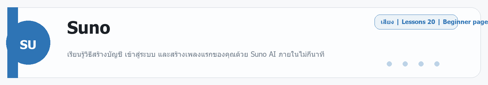

# Seedance
Source: https://ailab.learnnakdev.online/docs/seedance
Pages captured: 5

## Page 1 (หน้า 1 / 3)
```text
Seedance
คู่มืออย่างเป็นทางการ
5 เอกสาร
เริ่มต้น
Seedance คืออะไร — โมเดลสร้างวิดีโอ AI ของ ByteDance

ภาพรวม Seedance โมเดลสร้างวิดีโอจากข้อความ/รูปภาพของ ByteDance และวิธีเริ่มต้นใช้งาน ·  6 นาที

หน้า 1 / 3
Seedance — โมเดลสร้างวิดีโอ AI ของ ByteDance

เรียบเรียงเป็นภาษาไทยจากเอกสารทางการ BytePlus ModelArk — Video Generation และหน้าโมเดล Seedance ของ ByteDance

Seedance คือตระกูลโมเดล AI สำหรับ สร้างวิดีโอ (video generation) ที่พัฒนาโดย ByteDance (บริษัทเดียวกับ TikTok) เป็นเครื่องยนต์เบื้องหลังแอป Dreamina / Jimeng (即梦) และให้บริการผ่าน API บนแพลตฟอร์ม BytePlus ModelArk รวมถึงผู้ให้บริการบุคคลที่สาม เช่น fal.ai, Replicate, PiAPI

📖 คำศัพท์ที่ควรรู้
คำศัพท์	ความหมายง่าย ๆ
Text-to-Video (T2V)	สร้างวิดีโอจาก "ข้อความ" (พรอมป์)
Image-to-Video (I2V)	สร้างวิดีโอจาก "รูปภาพ" ที่ให้ไป (เช่น ทำให้ภาพนิ่งเคลื่อนไหว)
Reference-to-Video	สร้างวิดีโอโดยอ้างอิงหลายสื่อ (รูป/วิดีโอ/เสียง) เป็นตัวกำหนดทิศทาง
Prompt	คำสั่งบรรยายสิ่งที่อยากให้วิดีโอเป็น
ModelArk	แพลตฟอร์ม API ของ BytePlus ที่ใช้เรียกโมเดล Seedance
Task	งานสร้างวิดีโอ 1 ครั้ง — สั่งสร้างแล้ว "รอ" จนเสร็จ (แบบ asynchronous)
⭐ ความสามารถหลัก
สร้างวิดีโอจากข้อความ — พิมพ์บรรยายฉาก แล้วได้วิดีโอออกมา
สร้างวิดีโอจากรูปภาพ — ใส่รูปเริ่มต้น (และกำหนดเฟรมแรก/สุดท้ายได้)
อ้างอิงหลายสื่อ (multimodal reference) — รุ่นใหม่รับได้ถึง 12 ไฟล์ต่อคำขอ (รูปสูงสุด 9, วิดีโอ 3, เสียง 3) ความยาวอินพุตวิดีโอ/เสียงไม่เกิน ~15 วินาที
เสียงในตัว (native audio) — รุ่น 2.0 สังเคราะห์เสียงให้เข้ากับวิดีโอได้
ฟิสิกส์สมจริง + การคุมกล้องแบบภาพยนตร์ — การเคลื่อนไหวและมุมกล้องดูเป็นธรรมชาติ
คุณภาพสูง — รองรับความละเอียดระดับ 2K ในรุ่นล่าสุด
🧩 รุ่นของโมเดล (โดยสังเขป)
รุ่น	จุดเด่น
Seedance 1.0 Lite	เร็ว/ประหยัด เหมาะกับงานทั่วไป (T2V, I2V)
Seedance 1.0 Pro	คุณภาพสูงขึ้น รายละเอียด/ความต่อเนื่องดีกว่า
Seedance 2.0	มัลติโมดัล (รูป+วิดีโอ+เสียง), เสียงในตัว, คุมกล้องระดับภาพยนตร์, อ้างอิงหลายสื่อ

โมเดล/ชื่อรุ่นที่เรียกผ่าน API ให้ยึดตามรายการล่าสุดในเอกสาร ModelArk

🚀 เริ่มต้นใช้งานได้ 2 ทาง

1) ผ่านแอป (ไม่ต้องเขียนโค้ด) — ใช้ผ่าน Dreamina / Jimeng พิมพ์พรอมป์หรืออัปโหลดรูปแล้วกดสร้าง เหมาะกับครีเอเตอร์ทั่วไป

2) ผ่าน API (สำหรับนักพัฒนา) บน BytePlus ModelArk — รูปแบบการทำงานเป็นแบบ asynchronous task:

สร้าง Task — ส่งคำขอ (พรอมป์ + รูป/พารามิเตอร์) ไปที่ endpoint สร้างวิดีโอ → ได้ task_id
ตรวจสถานะ (poll) — เรียกดูสถานะ Task เป็นระยะจนกลายเป็น succeeded
รับผลลัพธ์ — ได้ URL วิดีโอกลับมาเพื่อดาวน์โหลด/นำไปใช้

พารามิเตอร์ที่พบบ่อย: prompt (ข้อความ), ภาพอ้างอิง (first/last frame), อัตราส่วนภาพ, ความยาว, ความละเอียด, seed

📚 สารบัญเอกสาร Seedance (เรียงตาม official docs)

หน้านี้คือ "ภาพรวม" ส่วนหัวข้อถัดไปจะทยอยแปลเพิ่มให้ครบตามลำดับเอกสารทางการ:

✅ ภาพรวม Seedance (หน้านี้)
⏳ การเรียก Video Generation API — สร้าง Task
⏳ การตรวจสอบสถานะและรับผลลัพธ์ (Query Task)
⏳ พารามิเตอร์ของคำขอ (ค่าและช่วงที่รับได้)
⏳ Text-to-Video / Image-to-Video / Reference-to-Video
⏳ ราคา โควต้า และข้อควรระวัง
🔗 อ้างอิง (เอกสารทางการ)
BytePlus ModelArk — Video Generation API: https://docs.byteplus.com/en/docs/ModelArk/
Seedance (ByteDance) บน fal.ai / Replicate / PiAPI (ผู้ให้บริการ API บุคคลที่สาม)
 ก่อนหน้า
ถัดไป
Seedance: Text-to-Video — สร้างวิดีโอจากข้อความ
```

## Page 2 (หน้า 2 / 3)
```text
Seedance
คู่มืออย่างเป็นทางการ
5 เอกสาร
เริ่มต้น
Seedance: Text-to-Video — สร้างวิดีโอจากข้อความ

สร้างคลิปวิดีโอจากคำบรรยายข้อความด้วยโมเดล Seedance ของ ByteDance ·  5 นาที

หน้า 2 / 3
Text-to-Video — บรรยายเป็นข้อความ ได้วิดีโอ 🎥

เรียบเรียงเป็นภาษาไทยจากเอกสารทางการของ Seedance (ByteDance / BytePlus ModelArk)

Seedance คือโมเดลสร้างวิดีโอด้วย AI ของ ByteDance โหมด Text-to-Video (T2V) ให้คุณพิมพ์บรรยายฉากเป็นข้อความ แล้วโมเดลสร้างคลิปวิดีโอให้ตามนั้น

📖 ค่าที่ปรับได้บ่อย
ค่า	ความหมาย
Prompt	คำบรรยายฉากที่อยากได้
Resolution	ความละเอียด (เช่น 480p / 1080p)
Duration	ความยาวคลิป (วินาที)
Aspect ratio	สัดส่วนภาพ (16:9, 9:16, 1:1)
✍️ เขียน Prompt ให้ดี

บอกองค์ประกอบเหล่านี้ให้ครบจะได้ผลตรงใจกว่า:

ประธาน/ตัวละคร — ใคร/อะไรอยู่ในเฟรม
การกระทำ — กำลังทำอะไร
ฉาก/บรรยากาศ — ที่ไหน เวลาใด แสงแบบไหน
มุมและการเคลื่อนกล้อง — เช่น โคลสอัป, แพนช้า ๆ
สไตล์ภาพ — เช่น เหมือนจริง, การ์ตูน, ฟิล์ม

ตัวอย่าง:

"เด็กผู้หญิงวิ่งเล่นในทุ่งดอกไม้ยามเย็น แสงสีทอง กล้องแพนตามช้า ๆ ภาพเหมือนจริง 16:9"

📚 ถัดไป
Image-to-Video — ใช้ภาพเป็นจุดเริ่ม
เทคนิคการเขียน Prompt
🔗 อ้างอิง
BytePlus ModelArk (Seedance): https://www.byteplus.com/
 ก่อนหน้า
Seedance คืออะไร — โมเดลสร้างวิดีโอ AI ของ ByteDance
ถัดไป
Seedance: Image-to-Video — เปลี่ยนภาพนิ่งให้เป็นวิดีโอ
```

## Page 3 (หน้า 3 / 3)
```text
Seedance
คู่มืออย่างเป็นทางการ
5 เอกสาร
เริ่มต้น
Seedance: Image-to-Video — เปลี่ยนภาพนิ่งให้เป็นวิดีโอ

ใส่ภาพเป็นจุดเริ่ม แล้วให้ Seedance สร้างวิดีโอเคลื่อนไหวต่อจากภาพนั้น ·  5 นาที

หน้า 3 / 3
Image-to-Video — ภาพนิ่งกลายเป็นคลิป 🖼️→🎬

เรียบเรียงเป็นภาษาไทยจากเอกสารทางการของ Seedance (ByteDance / BytePlus ModelArk)

โหมด Image-to-Video (I2V) ให้คุณ อัปโหลดภาพเป็นจุดเริ่ม แล้วเขียนข้อความบอกว่าอยากให้ภาพนั้นเคลื่อนไหวอย่างไร โมเดลจะสร้างวิดีโอที่ต่อเนื่องจากภาพ เหมาะกับการทำให้ภาพถ่าย/ภาพวาดมีชีวิต

📖 สิ่งที่ต้องเตรียม
สิ่งที่ใส่	อธิบาย
ภาพเริ่มต้น	ภาพที่จะใช้เป็นเฟรมแรก
Prompt	บอกการเคลื่อนไหว/กล้องที่อยากได้
Duration / Resolution	ความยาวและความละเอียดของคลิป
💡 เคล็ดลับ
ใช้ภาพที่ คมชัดและองค์ประกอบชัดเจน ผลจะดีกว่า
บรรยายเฉพาะ การเคลื่อนไหว ที่อยากได้ (เช่น "ผมพลิ้วตามลม กล้องซูมเข้าช้า ๆ")
ถ้าอยากให้ตัวละคร/ฉากคงเดิม ภาพเริ่มต้นคือกุญแจสำคัญ

ตัวอย่าง:

ภาพ: ทิวทัศน์ภูเขา + Prompt: "เมฆเคลื่อนผ่านยอดเขาช้า ๆ แสงแดดค่อย ๆ สาดลงมา กล้องแพนขึ้น"

📚 ถัดไป
เทคนิคการเขียน Prompt
เรียกใช้ผ่าน API
🔗 อ้างอิง
BytePlus ModelArk (Seedance): https://www.byteplus.com/
 ก่อนหน้า
Seedance: Text-to-Video — สร้างวิดีโอจากข้อความ
ถัดไป
Seedance: เทคนิคการเขียน Prompt ให้ได้วิดีโอสวย
```

## Page 4 (หน้า 1 / 1)
```text
Seedance
คู่มืออย่างเป็นทางการ
5 เอกสาร
ระดับกลาง
Seedance: เทคนิคการเขียน Prompt ให้ได้วิดีโอสวย

โครงสร้างและเคล็ดลับการเขียน prompt สำหรับสร้างวิดีโอด้วย Seedance ·  6 นาที

หน้า 1 / 1
เทคนิคเขียน Prompt สำหรับ Seedance ✍️

เรียบเรียงเป็นภาษาไทยจากคู่มือ Prompt ของ Seedance (ByteDance / BytePlus ModelArk)

วิดีโอจะออกมาดีแค่ไหนขึ้นกับ prompt เป็นหลัก หน้านี้รวมโครงสร้างที่ใช้ได้จริง

🧩 โครงสร้าง Prompt ที่แนะนำ

เรียงลำดับประมาณนี้จะช่วยให้โมเดลเข้าใจง่าย:

ประธาน (Subject) — ใคร/อะไร เช่น "หญิงสาวใส่ชุดสีแดง"
การกระทำ (Action) — กำลังทำอะไร เช่น "เดินเล่นริมทะเล"
ฉาก (Scene) — ที่ไหน เวลาใด เช่น "ชายหาดยามพระอาทิตย์ตก"
กล้อง (Camera) — มุม/การเคลื่อน เช่น "กล้องตามจากด้านหลัง แพนช้า ๆ"
สไตล์/แสง (Style) — เช่น "โทนฟิล์ม แสงสีทอง เหมือนจริง"
✅ ทำ
เจาะจงและเป็นรูปธรรม (บอกสี แสง อารมณ์)
ระบุการเคลื่อนกล้องชัดเจน
ใช้คำบรรยายภาพ ไม่ใช่คำสั่งนามธรรม
❌ เลี่ยง
prompt สั้น/กว้างเกินไป เช่น "วิดีโอสวย ๆ"
ยัดหลายฉาก/หลายเหตุการณ์ในคลิปเดียว
คำขัดแย้งกันเอง (เช่น "กลางวัน" + "แสงดาว")
🎯 ตัวอย่างเปรียบเทียบ
แบบกว้าง (ไม่ดี)	แบบเจาะจง (ดี)
"แมวน่ารัก"	"ลูกแมวสีส้มกระโดดเล่นบนโซฟา แสงนุ่มจากหน้าต่าง กล้องโคลสอัป สโลว์โมชัน"
🔗 อ้างอิง
BytePlus ModelArk (Seedance): https://www.byteplus.com/
 ก่อนหน้า
Seedance: Image-to-Video — เปลี่ยนภาพนิ่งให้เป็นวิดีโอ
ถัดไป
Seedance: เรียกใช้ผ่าน API
```

## Page 5 (หน้า 1 / 1)
```text
Seedance
คู่มืออย่างเป็นทางการ
5 เอกสาร
ขั้นโปร
Seedance: เรียกใช้ผ่าน API

ภาพรวมการเรียกใช้โมเดล Seedance ผ่าน API สำหรับนักพัฒนา ·  5 นาที

หน้า 1 / 1
เรียกใช้ Seedance ผ่าน API 🧑‍💻

เรียบเรียงเป็นภาษาไทยจากเอกสารทางการของ Seedance (ByteDance / BytePlus ModelArk)

นอกจากใช้ผ่านหน้าเว็บ Seedance ยังเรียกผ่าน API เพื่อสร้างวิดีโออัตโนมัติในแอปของคุณได้ (ให้บริการผ่าน BytePlus ModelArk / Volcengine และแพลตฟอร์มพาร์ตเนอร์)

📖 ภาพรวมการทำงาน

การสร้างวิดีโอเป็นงานที่ใช้เวลา จึงมักทำงานแบบ asynchronous:

ส่งคำขอ (create task) — ส่ง prompt + พารามิเตอร์ (resolution, duration, aspect ratio; ถ้า I2V ก็แนบภาพ)
ได้ task ID กลับมา
เช็คสถานะ (poll) จนงานเสร็จ
รับลิงก์วิดีโอ ที่สร้างเสร็จ
🔑 สิ่งที่ต้องเตรียม
สิ่งที่ต้องมี	อธิบาย
API key	กุญแจยืนยันตัวตน (สร้างในแดชบอร์ดผู้ให้บริการ)
Model ID	ระบุรุ่นโมเดล Seedance ที่จะใช้
Endpoint	URL ของบริการ (ตามผู้ให้บริการ เช่น ModelArk)
🧱 ขั้นตอนทั่วไป (pseudo)
POST /video/generation   { model, prompt, resolution, duration, ratio, [image] }
  -> { task_id }
GET  /video/generation/{task_id}
  -> { status: "succeeded", video_url }


รายละเอียด endpoint, ชื่อพารามิเตอร์ และโควตา ดูได้จากเอกสารของผู้ให้บริการที่คุณใช้ (BytePlus ModelArk / Volcengine / พาร์ตเนอร์เช่น fal, Replicate)

🔗 อ้างอิง
BytePlus ModelArk: https://www.byteplus.com/
Volcengine (ภาษาจีน): https://www.volcengine.com/
 ก่อนหน้า
Seedance: เทคนิคการเขียน Prompt ให้ได้วิดีโอสวย
ถัดไป
```


---

## Beginner Guide

### Seedance

Source: daily-ai-lab-ai-tools-32page-beginner-guide.docx


**หมวด:** Video
**บทเรียนใน /docs:** 5 หน้า

**ใช้ทำอะไร**
ภาพรวม Seedance โมเดลสร้างวิดีโอจากข้อความ/รูปภาพของ ByteDance และวิธีเริ่มต้นใช้งาน

**พื้นฐานที่ควรรู้**
พื้นฐานที่ควรรู้คือ duration, aspect ratio, motion, camera direction, และภาพแรก/ภาพท้าย. วิดีโอที่ดีเริ่มจากเป้าหมายชัด: จะเล่าเรื่อง สาธิตสินค้า หรือทำช็อตสั้นสำหรับโซเชียล

**เหมาะกับมือใหม่แบบไหน**
เครื่องมือนี้เหมาะกับผู้เริ่มต้นที่อยากฝึกงาน Video แบบสั้นและดูผลลัพธ์ได้เร็ว

**วิธีเริ่มแบบสั้น**
1. กำหนดความยาวคลิป, อัตราส่วนภาพ, และอารมณ์ของช็อตก่อน
2. ถ้ามีภาพต้นทาง ให้ล็อก first frame หรือ storyboard ให้ชัด
3. ตรวจ motion, timing, และ continuity ก่อนนำไปตัดต่อหรือโพสต์

**ราคา/Plan**
Usage-based model access through ByteDance ecosystem and API pricing.

**สิ่งที่ควรจำ**
- จุดแข็ง: เครื่องมือนี้เหมาะกับผู้เริ่มต้นที่อยากฝึกงาน Video แบบสั้นและดูผลลัพธ์ได้เร็ว
- ข้อควรระวัง: วิดีโอใช้เวลานานและกินเครดิตมากกว่าภาพนิ่ง จึงควรล็อกสคริปต์ก่อนสั่งเรนเดอร์.

**ตัวอย่างเริ่มต้น**
ลองเริ่มด้วย: สร้างคลิป 5 วินาทีเกี่ยวกับ ตัวอย่างงาน โทน clean การเคลื่อนไหว smooth อัตราส่วน 16:9 และบรรยากาศ focused

---

---

<!-- merged-beginner-guide:Seedance -->
## คู่มือพื้นฐานของ Seedance

**หมวด:** Video
**บทเรียนใน /docs:** 5 หน้า

**ใช้ทำอะไร**
ภาพรวม Seedance โมเดลสร้างวิดีโอจากข้อความ/รูปภาพของ ByteDance และวิธีเริ่มต้นใช้งาน

**พื้นฐานที่ควรรู้**
พื้นฐานที่ควรรู้คือ duration, aspect ratio, motion, camera direction, และภาพแรก/ภาพท้าย. วิดีโอที่ดีเริ่มจากเป้าหมายชัด: จะเล่าเรื่อง สาธิตสินค้า หรือทำช็อตสั้นสำหรับโซเชียล

**เหมาะกับมือใหม่แบบไหน**
เครื่องมือนี้เหมาะกับผู้เริ่มต้นที่อยากฝึกงาน Video แบบสั้นและดูผลลัพธ์ได้เร็ว

**วิธีเริ่มแบบสั้น**
1. กำหนดความยาวคลิป, อัตราส่วนภาพ, และอารมณ์ของช็อตก่อน
2. ถ้ามีภาพต้นทาง ให้ล็อก first frame หรือ storyboard ให้ชัด
3. ตรวจ motion, timing, และ continuity ก่อนนำไปตัดต่อหรือโพสต์

**ราคา/Plan**
Usage-based model access through ByteDance ecosystem and API pricing.

**สิ่งที่ควรจำ**
- จุดแข็ง: เครื่องมือนี้เหมาะกับผู้เริ่มต้นที่อยากฝึกงาน Video แบบสั้นและดูผลลัพธ์ได้เร็ว
- ข้อควรระวัง: วิดีโอใช้เวลานานและกินเครดิตมากกว่าภาพนิ่ง จึงควรล็อกสคริปต์ก่อนสั่งเรนเดอร์.

**ตัวอย่างเริ่มต้น**
ลองเริ่มด้วย: สร้างคลิป 5 วินาทีเกี่ยวกับ ตัวอย่างงาน โทน clean การเคลื่อนไหว smooth อัตราส่วน 16:9 และบรรยากาศ focused

---


