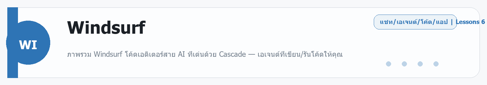

# Windsurf
Source: https://ailab.learnnakdev.online/docs/windsurf
Pages captured: 6

## Page 1 (หน้า 1 / 3)
```text
Windsurf
คู่มืออย่างเป็นทางการ
6 เอกสาร
เริ่มต้น
Windsurf คืออะไร — AI IDE ที่มีเอเจนต์ Cascade

ภาพรวม Windsurf โค้ดเอดิเตอร์สาย AI ที่เด่นด้วย Cascade — เอเจนต์ที่เขียน/รันโค้ดให้คุณ ·  6 นาที

หน้า 1 / 3
Windsurf — AI IDE ที่ "อยู่ในโฟลว์" ด้วย Cascade 🏄

เรียบเรียงเป็นภาษาไทยจากเอกสารทางการของ Windsurf/Cognition (docs.windsurf.com — ปัจจุบันอยู่ภายใต้ Cognition/Devin)

Windsurf คือ โปรแกรมเขียนโค้ด (AI IDE) ที่สร้างมาเพื่อให้คุณ "อยู่ในโฟลว์การทำงาน" เดิมพัฒนาโดย Codeium ปัจจุบันอยู่ภายใต้ Cognition (ทีมเดียวกับ Devin) จุดเด่นคือ Cascade — แผงเอเจนต์ AI ที่แชต เขียนโค้ด และรันโค้ดให้ได้ในที่เดียว พร้อมเข้าใจโค้ดเบสของคุณโดยอัตโนมัติ

📖 คำศัพท์ที่ควรรู้
คำศัพท์	ความหมายง่าย ๆ
Cascade	แผงเอเจนต์ AI (ด้านขวา) ที่แชต + เขียนโค้ด + รันโค้ดให้ได้เอง
Tab / Autocomplete	การเติมโค้ดอัตโนมัติด้วย AI
Command	สั่งงานด้วยภาษาคนผ่าน command palette
Context Awareness	Windsurf เข้าใจโค้ดเบสทั้งหมดเพื่อช่วยได้ตรงจุด
MCP	ต่อเครื่องมือ/ข้อมูลภายนอกเข้ากับเอเจนต์
Memories & Rules	ความจำ + กฎ ที่ปรับพฤติกรรม AI ให้เข้ากับโปรเจกต์
⭐ ความสามารถหลัก
Cascade — เอเจนต์ทำงานเอง แชตสั่งงาน แล้วมันเขียน/แก้โค้ดหลายไฟล์ รันคำสั่ง และไล่แก้จนเสร็จ
Tab / Autocomplete เติมโค้ดอัจฉริยะระหว่างพิมพ์
Command สั่งแก้/สร้างโค้ดด้วยภาษาคน
เข้าใจโค้ดเบสอัตโนมัติ (Context Awareness) ช่วยได้ตรงบริบทโดยไม่ต้องอธิบายเยอะ
MCP ขยายความสามารถเอเจนต์ด้วยเครื่องมือภายนอก
Memories & Rules ปรับสไตล์/พฤติกรรมให้เข้ากับทีม
Workflows & App Deploys ทำงานเป็นชุดขั้นตอน และดีพลอยแอปได้
🚀 เริ่มต้นใช้งาน
ดาวน์โหลด Windsurf จาก windsurf.com (มี macOS / Windows / Linux)
เปิดโฟลเดอร์โปรเจกต์ของคุณ (นำเข้าจาก VS Code ได้ พร้อมส่วนขยาย/ธีม/คีย์แมป)
เปิด Cascade (แผงด้านขวา) แล้วพิมพ์สั่งงานเป็นภาษาคน เช่น "เพิ่มหน้า login พร้อมตรวจสอบฟอร์ม"
ใช้ Tab ขณะพิมพ์เพื่อเติมโค้ด และตั้งค่า Rules/Memories ให้ AI ทำตามสไตล์โปรเจกต์
📚 สารบัญเอกสาร Windsurf (เรียงตาม official docs)
✅ ภาพรวม Windsurf (หน้านี้)
⏳ Getting Started — ติดตั้งและตั้งค่า
⏳ Cascade — การใช้งานเอเจนต์
⏳ Usage & Terminal — การใช้งานทั่วไปและเทอร์มินัล
⏳ Context Awareness — การเข้าใจโค้ดเบส
⏳ MCP — ต่อเครื่องมือภายนอก
⏳ Memories & Rules — ปรับพฤติกรรม AI
⏳ Workflows & App Deploys
⏳ Advanced & Recommended Plugins
🔗 อ้างอิง (เอกสารทางการ)
เอกสารหลัก: https://docs.windsurf.com/
ดาวน์โหลด: https://windsurf.com/
 ก่อนหน้า
ถัดไป
Windsurf: เริ่มต้นใช้งาน — ติดตั้งและตั้งค่าครั้งแรก
```

## Page 2 (หน้า 2 / 3)
```text
Windsurf
คู่มืออย่างเป็นทางการ
6 เอกสาร
เริ่มต้น
Windsurf: เริ่มต้นใช้งาน — ติดตั้งและตั้งค่าครั้งแรก

ดาวน์โหลด ติดตั้ง และตั้งค่า Windsurf Editor ครั้งแรก ·  5 นาที

หน้า 2 / 3
เริ่มต้นใช้งาน Windsurf 🏄

เรียบเรียงเป็นภาษาไทยจากเอกสารทางการ windsurf.com/docs หมวด Getting Started

Windsurf Editor เป็นโปรแกรมแก้โค้ดที่มี AI ในตัว (พัฒนาต่อจากฐาน VS Code) ถ้าคุณเคยใช้ VS Code มาก่อนจะคุ้นมือทันที

🧭 ขั้นตอนติดตั้ง
ดาวน์โหลดจาก windsurf.com (มีให้ทั้ง Windows, macOS, Linux)
ติดตั้งและเปิดโปรแกรม
ล็อกอิน/สมัครบัญชี Windsurf
ถ้าเคยใช้ VS Code: เลือก import settings เพื่อย้ายธีม คีย์ลัด และส่วนขยายมาได้เลย
🗂️ ส่วนสำคัญในหน้าจอ
ส่วน	ทำอะไร
Editor	พื้นที่เขียนโค้ดหลัก (เหมือน VS Code)
Cascade	ผู้ช่วย AI แบบเอเจนต์ (แถบด้านขวา)
Tab	ระบบเติมโค้ดอัตโนมัติขณะพิมพ์
Command Palette	กด Ctrl/Cmd + Shift + P เรียกคำสั่งทั้งหมด
▶️ ลองใช้ครั้งแรก
เปิดโฟลเดอร์โปรเจกต์ของคุณ (File → Open Folder)
กดเปิด Cascade แล้วพิมพ์สั่งงานเป็นภาษาคน เช่น "อธิบายว่าไฟล์นี้ทำอะไร"
พิมพ์โค้ดทั่วไป แล้วสังเกต Tab เสนอโค้ดให้เติม — กด Tab เพื่อรับ
📚 ถัดไป
Cascade — ผู้ช่วย AI แบบเอเจนต์
Tab — เติมโค้ดอัตโนมัติ
🔗 อ้างอิง
เอกสารทางการ: https://docs.windsurf.com/
 ก่อนหน้า
Windsurf คืออะไร — AI IDE ที่มีเอเจนต์ Cascade
ถัดไป
Windsurf: Tab — เติมโค้ดอัตโนมัติขณะพิมพ์
```

## Page 3 (หน้า 3 / 3)
```text
Windsurf
คู่มืออย่างเป็นทางการ
6 เอกสาร
เริ่มต้น
Windsurf: Tab — เติมโค้ดอัตโนมัติขณะพิมพ์

ระบบ Tab ของ Windsurf ที่ทำนายและเติมโค้ดให้ขณะพิมพ์ ·  4 นาที

หน้า 3 / 3
Tab — เติมโค้ดอัตโนมัติ ⌨️

เรียบเรียงเป็นภาษาไทยจากเอกสารทางการ windsurf.com/docs หมวด Tab

Tab คือระบบเติมโค้ดอัตโนมัติของ Windsurf ที่ทำนายสิ่งที่คุณกำลังจะพิมพ์ แล้วเสนอโค้ดให้รับด้วยปุ่ม Tab — เหมือนมีคนช่วยพิมพ์ให้ครึ่งหนึ่ง

⭐ จุดเด่น
ทำนายทั้งบรรทัด/หลายบรรทัด ไม่ใช่แค่คำเดียว
เข้าใจบริบทไฟล์ — เติมให้สอดคล้องกับโค้ดรอบ ๆ
คาดเดาการแก้ไขถัดไป — บางครั้งเสนอให้กระโดดไปแก้จุดที่เกี่ยวข้องต่อ
รับ/ปฏิเสธง่าย — กด Tab รับ, พิมพ์ต่อเพื่อข้าม
▶️ วิธีใช้
พิมพ์โค้ดตามปกติ
เมื่อมีข้อความสีจาง ๆ ขึ้นมา = คำแนะนำของ Tab
กด Tab เพื่อรับ หรือพิมพ์ต่อเพื่อไม่รับ

Tab ต่างจาก Cascade ตรงที่ Tab ช่วย "ระหว่างพิมพ์" ส่วน Cascade รับงานเป็นภารกิจใหญ่ทั้งก้อน

🔗 อ้างอิง
เอกสารทางการ: https://docs.windsurf.com/
 ก่อนหน้า
Windsurf: เริ่มต้นใช้งาน — ติดตั้งและตั้งค่าครั้งแรก
ถัดไป
Windsurf: Cascade — ผู้ช่วย AI แบบเอเจนต์
```

## Page 4 (หน้า 1 / 2)
```text
Windsurf
คู่มืออย่างเป็นทางการ
6 เอกสาร
ระดับกลาง
Windsurf: Cascade — ผู้ช่วย AI แบบเอเจนต์

ทำความรู้จัก Cascade เอเจนต์ AI ที่เข้าใจทั้งโปรเจกต์และลงมือแก้โค้ดให้ ·  6 นาที

หน้า 1 / 2
Cascade — เอเจนต์ AI ของ Windsurf 🌊

เรียบเรียงเป็นภาษาไทยจากเอกสารทางการ windsurf.com/docs หมวด Cascade

Cascade คือผู้ช่วย AI แบบเอเจนต์ที่เป็นหัวใจของ Windsurf — ไม่ใช่แค่แชตตอบคำถาม แต่ เข้าใจทั้งโปรเจกต์ และลงมือแก้ไฟล์ รันคำสั่ง และทำงานหลายขั้นตอนให้จนจบ

📖 คำศัพท์ที่ควรรู้
คำศัพท์	ความหมายง่าย ๆ
Agent	AI ที่ทำงานหลายขั้นตอนเอง ไม่ใช่แค่ตอบทีละข้อความ
Context	ข้อมูลรอบ ๆ ที่ AI ใช้ตัดสินใจ (ไฟล์ที่เปิด โครงโปรเจกต์)
Write mode	โหมดที่ Cascade แก้ไฟล์ให้จริง
Chat mode	โหมดถาม-ตอบโดยไม่แก้ไฟล์
Flows	การทำงานต่อเนื่องที่ Cascade ผสานการแก้โค้ด+คำสั่งเข้าด้วยกัน
⭐ ทำอะไรได้บ้าง
เข้าใจทั้งโค้ดเบส — ค้นและอ้างอิงไฟล์ที่เกี่ยวข้องเอง
แก้หลายไฟล์พร้อมกัน ตามคำสั่งเดียว
รันคำสั่งใน terminal ให้ (เช่น ติดตั้งแพ็กเกจ รันเทสต์)
ทำงานต่อเนื่อง — รู้ว่าก่อนหน้าทำอะไรไปแล้ว
เลือกได้ระหว่าง Write mode (แก้ให้จริง) และ Chat mode (แค่คุย)
▶️ วิธีใช้
เปิดแถบ Cascade (ด้านขวา)
พิมพ์สั่งงานเป็นภาษาคน เช่น "เพิ่มหน้าโปรไฟล์ผู้ใช้ พร้อมปุ่มแก้ไข"
Cascade จะเสนอแผน+การแก้ไข — กด Accept หรือ Reject ทีละจุด
ให้รันคำสั่งต่อ เช่น "รันเทสต์ให้หน่อย"

💡 ยิ่งอธิบายเป้าหมายชัด และชี้ไฟล์/ฟังก์ชันที่เกี่ยวข้อง Cascade ยิ่งทำได้ตรงใจ

🔗 อ้างอิง
เอกสารทางการ: https://docs.windsurf.com/
 ก่อนหน้า
Windsurf: Tab — เติมโค้ดอัตโนมัติขณะพิมพ์
ถัดไป
Windsurf: Memories & Rules — ให้ AI จำสไตล์โปรเจกต์
```

## Page 5 (หน้า 2 / 2)
```text
Windsurf
คู่มืออย่างเป็นทางการ
6 เอกสาร
ระดับกลาง
Windsurf: Memories & Rules — ให้ AI จำสไตล์โปรเจกต์

ใช้ Memories และ Rules กำหนดให้ Cascade จำบริบทและทำตามแนวทางของโปรเจกต์ ·  5 นาที

หน้า 2 / 2
Memories & Rules — สอน Windsurf ให้รู้ใจโปรเจกต์ 🧠

เรียบเรียงเป็นภาษาไทยจากเอกสารทางการ windsurf.com/docs หมวด Memories

เวลาทำงานโปรเจกต์เดิมซ้ำ ๆ คุณคงไม่อยากบอก AI ใหม่ทุกครั้งว่า "ใช้ TypeScript นะ" "ตั้งชื่อแบบนี้นะ" — Memories และ Rules ช่วยให้ Cascade จำสิ่งเหล่านี้ได้เอง

📖 สองอย่างนี้ต่างกันยังไง
สิ่งที่ใช้	คืออะไร
Rules	กฎที่ "คุณเขียนเอง" ให้ AI ทำตามเสมอ (เช่น สไตล์โค้ด ภาษาที่ใช้)
Memories	สิ่งที่ Cascade "จำเอง" ระหว่างทำงาน เพื่อใช้ต่อในอนาคต
⭐ ใช้ทำอะไร
กำหนดมาตรฐานโค้ด (เช่น "ใช้ 2 spaces", "คอมเมนต์เป็นภาษาไทย")
บอกบริบทโปรเจกต์ (เช่น "นี่คือเว็บ Next.js + Supabase")
ให้ AI จำสิ่งที่ตกลงกันไว้ ไม่ต้องพูดซ้ำ
▶️ วิธีตั้ง Rules
สร้างไฟล์กฎของโปรเจกต์ (เช่น ผ่านเมนู Rules ใน Windsurf)
เขียนแนวทางเป็นข้อ ๆ เช่น
- ใช้ TypeScript เสมอ
- ตั้งชื่อ component แบบ PascalCase
- คอมเมนต์อธิบายเป็นภาษาไทย

Cascade จะอ้างอิงกฎเหล่านี้ทุกครั้งที่ทำงาน
🔗 อ้างอิง
เอกสารทางการ: https://docs.windsurf.com/
 ก่อนหน้า
Windsurf: Cascade — ผู้ช่วย AI แบบเอเจนต์
ถัดไป
Windsurf: MCP — ต่อเครื่องมือภายนอกให้ Cascade
```

## Page 6 (หน้า 1 / 1)
```text
Windsurf
คู่มืออย่างเป็นทางการ
6 เอกสาร
ขั้นโปร
Windsurf: MCP — ต่อเครื่องมือภายนอกให้ Cascade

เชื่อม Cascade กับเครื่องมือ/บริการภายนอกผ่าน Model Context Protocol (MCP) ·  5 นาที

หน้า 1 / 1
MCP — เปิดทางให้ Cascade ใช้เครื่องมือภายนอก 🔌

เรียบเรียงเป็นภาษาไทยจากเอกสารทางการ windsurf.com/docs หมวด MCP

MCP (Model Context Protocol) คือมาตรฐานกลางที่ให้ผู้ช่วย AI อย่าง Cascade ต่อกับเครื่องมือและบริการภายนอก ได้ เช่น ฐานข้อมูล, GitHub, ระบบเอกสาร หรือ API ของบริษัทคุณเอง — ทำให้ AI ไม่ได้รู้แค่โค้ดในเครื่อง แต่ดึงข้อมูล/สั่งงานระบบอื่นได้ด้วย

📖 คำศัพท์ที่ควรรู้
คำศัพท์	ความหมายง่าย ๆ
MCP Server	ตัวกลางที่เปิดให้ AI เข้าถึงเครื่องมือ/ข้อมูลหนึ่ง ๆ
Tool	ความสามารถที่ MCP server เปิดให้ใช้ (เช่น query ฐานข้อมูล)
Client	ฝั่งที่เรียกใช้ (ในที่นี้คือ Windsurf/Cascade)
⭐ ใช้ทำอะไร
ให้ Cascade ค้น/แก้ข้อมูลในฐานข้อมูลจริง
ต่อกับ GitHub, ระบบจัดการงาน, หรือบริการภายในองค์กร
เพิ่มความสามารถใหม่ ๆ ให้ AI โดยไม่ต้องรอฟีเจอร์ในตัว
▶️ วิธีเริ่ม (ภาพรวม)
เปิดการตั้งค่า MCP ใน Windsurf
เพิ่ม MCP server ที่ต้องการ (ระบุคำสั่งรันหรือ URL ของ server)
เมื่อเชื่อมแล้ว Cascade จะเห็น "tools" ใหม่ และเรียกใช้ได้เองเมื่อจำเป็น

⚠️ MCP server เข้าถึงข้อมูลจริงได้ — ติดตั้งเฉพาะตัวที่เชื่อถือได้ และระวังสิทธิ์การเข้าถึง

🔗 อ้างอิง
เอกสารทางการ: https://docs.windsurf.com/
เกี่ยวกับ MCP: https://modelcontextprotocol.io/
 ก่อนหน้า
Windsurf: Memories & Rules — ให้ AI จำสไตล์โปรเจกต์
ถัดไป
```


---

## Beginner Guide

### Windsurf

Source: daily-ai-lab-ai-tools-32page-beginner-guide.docx



**หมวด:** Chat / Agent / Coding / App
**บทเรียนใน /docs:** 6 หน้า

**ใช้ทำอะไร**
ภาพรวม Windsurf โค้ดเอดิเตอร์สาย AI ที่เด่นด้วย Cascade — เอเจนต์ที่เขียน/รันโค้ดให้คุณ

**พื้นฐานที่ควรรู้**
พื้นฐานที่ควรรู้คือ prompt, context, file, workspace, และการตรวจผลลัพธ์ก่อนนำไปใช้งานจริง. มือใหม่ควรเริ่มจากงานเล็กที่วัดผลได้ เช่น สรุปเอกสาร แก้โค้ดสั้น ๆ หรือทำต้นแบบหน้าเว็บหนึ่งหน้า

**เหมาะกับมือใหม่แบบไหน**
เหมาะกับการคุยกับโค้ดฐานจริงและให้ agent ช่วยไล่ไฟล์หลายจุด.

**วิธีเริ่มแบบสั้น**
1. เปิด workspace หรือแชท แล้วให้โจทย์เดียวที่ชัดเจนพร้อมบริบทที่จำเป็น
2. แนบไฟล์ ตัวอย่าง หรือเป้าหมายที่อยากได้ เพื่อให้โมเดลอ่านภาพรวมได้เร็ว
3. ตรวจผลลัพธ์รอบแรก แล้วให้แก้แบบเฉพาะจุด เช่น tone, logic, code style หรือ structure

**ราคา/Plan**
Free tier plus paid editor plans with higher model/agent limits.

**สิ่งที่ควรจำ**
- จุดแข็ง: เหมาะกับการคุยกับโค้ดฐานจริงและให้ agent ช่วยไล่ไฟล์หลายจุด.
- ข้อควรระวัง: ระวัง prompt ที่กว้างเกินไปและตรวจโค้ดหรือเอกสารทุกครั้งก่อนนำไปใช้จริง.

**ตัวอย่างเริ่มต้น**
ตัวอย่างงานเริ่มต้น: ช่วย refactor โค้ดชุดนี้ให้สะอาดขึ้น แต่เปลี่ยนพฤติกรรมเดิมให้น้อยที่สุด

---

---

<!-- merged-beginner-guide:Windsurf -->
## คู่มือพื้นฐานของ Windsurf

**หมวด:** Chat / Agent / Coding / App
**บทเรียนใน /docs:** 6 หน้า

**ใช้ทำอะไร**
ภาพรวม Windsurf โค้ดเอดิเตอร์สาย AI ที่เด่นด้วย Cascade — เอเจนต์ที่เขียน/รันโค้ดให้คุณ

**พื้นฐานที่ควรรู้**
พื้นฐานที่ควรรู้คือ prompt, context, file, workspace, และการตรวจผลลัพธ์ก่อนนำไปใช้งานจริง. มือใหม่ควรเริ่มจากงานเล็กที่วัดผลได้ เช่น สรุปเอกสาร แก้โค้ดสั้น ๆ หรือทำต้นแบบหน้าเว็บหนึ่งหน้า

**เหมาะกับมือใหม่แบบไหน**
เหมาะกับการคุยกับโค้ดฐานจริงและให้ agent ช่วยไล่ไฟล์หลายจุด.

**วิธีเริ่มแบบสั้น**
1. เปิด workspace หรือแชท แล้วให้โจทย์เดียวที่ชัดเจนพร้อมบริบทที่จำเป็น
2. แนบไฟล์ ตัวอย่าง หรือเป้าหมายที่อยากได้ เพื่อให้โมเดลอ่านภาพรวมได้เร็ว
3. ตรวจผลลัพธ์รอบแรก แล้วให้แก้แบบเฉพาะจุด เช่น tone, logic, code style หรือ structure

**ราคา/Plan**
Free tier plus paid editor plans with higher model/agent limits.

**สิ่งที่ควรจำ**
- จุดแข็ง: เหมาะกับการคุยกับโค้ดฐานจริงและให้ agent ช่วยไล่ไฟล์หลายจุด.
- ข้อควรระวัง: ระวัง prompt ที่กว้างเกินไปและตรวจโค้ดหรือเอกสารทุกครั้งก่อนนำไปใช้จริง.

**ตัวอย่างเริ่มต้น**
ตัวอย่างงานเริ่มต้น: ช่วย refactor โค้ดชุดนี้ให้สะอาดขึ้น แต่เปลี่ยนพฤติกรรมเดิมให้น้อยที่สุด

---


