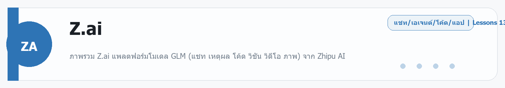

# Z.ai
Source: https://ailab.learnnakdev.online/docs/z-ai
Pages captured: 13

## Page 1 (หน้า 1 / 4)
```text
Z.ai
คู่มืออย่างเป็นทางการ
13 เอกสาร
เริ่มต้น
Z.ai คืออะไร — แพลตฟอร์มโมเดล GLM จาก Zhipu AI

ภาพรวม Z.ai แพลตฟอร์มโมเดล GLM (แชท เหตุผล โค้ด วิชัน วิดีโอ ภาพ) จาก Zhipu AI ·  6 นาที

หน้า 1 / 4
Z.ai — แพลตฟอร์มโมเดล GLM 🧠

เรียบเรียงเป็นภาษาไทยจากเอกสารทางการ docs.z.ai และ z.ai

Z.ai คือแพลตฟอร์ม AI ระดับโลกจาก Zhipu AI ผู้พัฒนาตระกูลโมเดล GLM — ใช้ได้ทั้งแชทฟรีบนเว็บ และเรียกผ่าน API สำหรับนักพัฒนา ครอบคลุมงานข้อความ เหตุผล เขียนโค้ด อ่านรูป (vision) สร้างวิดีโอ และสร้างภาพ จุดเด่นคือ โมเดลเก่งด้านโค้ด/เอเจนต์ในราคาประหยัด และ API ที่เข้ากันได้ทั้งรูปแบบ OpenAI และ Anthropic

📖 คำศัพท์ที่ควรรู้
คำศัพท์	ความหมายง่าย ๆ
GLM	ตระกูลโมเดลของ Zhipu AI (เช่น GLM-4.6)
Zhipu AI	บริษัทผู้พัฒนา (z.ai คือแบรนด์สากล)
API key	กุญแจสำหรับเรียกโมเดลจากโค้ด
OpenAI/Anthropic-compatible	ใช้รูปแบบ API เดียวกับ OpenAI/Anthropic เปลี่ยน URL ก็ใช้ได้
Thinking / Reasoning	โหมดให้โมเดลคิดเป็นขั้นตอนก่อนตอบ
GLM Coding Plan	แพ็กเกจรายเดือนสำหรับสายเขียนโค้ด
⭐ ใช้ทำอะไรได้ (ตามเมนู official docs)
แชท / เหตุผล / โค้ด — โมเดล GLM-4.6, GLM-4.5 series
Vision — อ่านและเข้าใจรูปภาพ (GLM-4.5V)
สร้างวิดีโอ — CogVideoX
สร้างภาพ — CogView
เครื่องมือ — Function/Tool calling, Web Search, Structured Output
Agents — งานหลายขั้นตอนแบบเอเจนต์
Coding Plan — ใช้กับ Claude Code/Cline ฯลฯ
🚀 เริ่มต้นใช้งาน
ลองแชทฟรีที่ chat.z.ai
นักพัฒนา: สมัครและสร้าง API key ที่ z.ai → ดู Quick Start
📚 สารบัญเอกสาร Z.ai (ตาม official docs)
✅ ภาพรวม (หน้านี้)
✅ Quick Start — เรียก API ครั้งแรก
✅ Models — ตระกูลโมเดล GLM
✅ Chat Completion
✅ Streaming
✅ Tool / Function Calling
✅ Structured Output
✅ Vision — เข้าใจรูปภาพ
✅ Web Search
✅ Reasoning — โหมดคิดลึก
✅ Video & Image — CogVideoX / CogView
✅ Agents
✅ GLM Coding Plan
🔗 อ้างอิง
เอกสารทางการ: https://docs.z.ai/
แชทฟรี: https://chat.z.ai/
 ก่อนหน้า
ถัดไป
Z.ai: Quick Start — เรียก API ครั้งแรก
```

## Page 2 (หน้า 2 / 4)
```text
Z.ai
คู่มืออย่างเป็นทางการ
13 เอกสาร
เริ่มต้น
Z.ai: Quick Start — เรียก API ครั้งแรก

สร้าง API key และเรียกโมเดล GLM ครั้งแรก ทั้งแบบ OpenAI และ Anthropic-compatible ·  5 นาที

หน้า 2 / 4
Quick Start — เริ่มเรียก Z.ai 🚀

เรียบเรียงเป็นภาษาไทยจากเอกสารทางการ docs.z.ai

🔑 ขั้นตอนเริ่มต้น
สมัครบัญชีที่ z.ai
สร้าง API key ในหน้าจัดการคีย์
เลือกโมเดล (เช่น glm-4.6) แล้วเรียกผ่าน API
🧱 เรียกแบบ OpenAI-compatible

Z.ai รองรับรูปแบบ OpenAI — เปลี่ยนแค่ base URL และ key:

from openai import OpenAI
client = OpenAI(
    api_key="YOUR_ZAI_KEY",
    base_url="https://api.z.ai/api/paas/v4/",
)
r = client.chat.completions.create(
    model="glm-4.6",
    messages=[{"role": "user", "content": "สวัสดี ช่วยอธิบาย AI หน่อย"}],
)
print(r.choices[0].message.content)

🟧 เรียกแบบ Anthropic-compatible

Z.ai ยังมีเอนด์พอยต์ที่เข้ากันได้กับ Anthropic (เหมาะกับเครื่องมือสายโค้ดอย่าง Claude Code) — ชี้ base URL มาที่ https://api.z.ai/api/anthropic แล้วใช้ key ของ z.ai

🌐 cURL
curl https://api.z.ai/api/paas/v4/chat/completions \
  -H "Authorization: Bearer YOUR_ZAI_KEY" \
  -H "Content-Type: application/json" \
  -d '{"model":"glm-4.6","messages":[{"role":"user","content":"สวัสดี"}]}'

💡 เคล็ดลับ
เก็บ API key ใน environment variable อย่า commit ลง git
ลองโมเดลฟรี/เบา (เช่น GLM-4.5-Flash) ตอนพัฒนา แล้วค่อยขยับเป็นรุ่นใหญ่
ดู rate limit และ error codes ในเอกสารหมวด Guides
🔗 อ้างอิง
Quick Start: https://docs.z.ai/guides/overview/quick-start
 ก่อนหน้า
Z.ai คืออะไร — แพลตฟอร์มโมเดล GLM จาก Zhipu AI
ถัดไป
Z.ai: Models — ตระกูลโมเดล GLM
```

## Page 3 (หน้า 3 / 4)
```text
Z.ai
คู่มืออย่างเป็นทางการ
13 เอกสาร
เริ่มต้น
Z.ai: Models — ตระกูลโมเดล GLM

รู้จักโมเดล GLM-4.6, GLM-4.5 series, GLM-4.5V (vision) และโมเดลสร้างภาพ/วิดีโอ ·  6 นาที

หน้า 3 / 4
Models — เลือกโมเดล GLM ให้ถูกงาน 🧩

เรียบเรียงเป็นภาษาไทยจากเอกสารทางการ docs.z.ai

Z.ai มีโมเดลหลายตัวในตระกูล GLM เลือกตามงานและงบ

📋 โมเดลภาษา (LLM)
โมเดล	จุดเด่น	เหมาะกับ
GLM-4.6	รุ่นเรือธง เก่งโค้ด/เหตุผล/เอเจนต์ บริบทยาว	งานยาก งานเขียนโปรแกรม เอเจนต์
GLM-4.5	เก่งรอบด้าน สมดุลคุณภาพ/ราคา	งานทั่วไปจริงจัง
GLM-4.5-Air	เบากว่า เร็วกว่า ถูกกว่า	งานปริมาณมาก
GLM-4.5-Flash	รุ่นประหยัด/ฟรี	ลองเล่น ต้นแบบ
GLM-4.5V	Vision — เข้าใจรูปภาพ	งานที่มีรูป/เอกสารภาพ
🎨 โมเดลสร้างสื่อ
โมเดล	ทำอะไร
CogVideoX	สร้างวิดีโอจากข้อความ/ภาพ
CogView	สร้างภาพจากข้อความ
🧭 เลือกยังไงดี
งานคิดหนัก/เขียนโค้ด/เอเจนต์ → GLM-4.6
งานทั่วไปเน้นคุ้มราคา → GLM-4.5 / Air
ต้นแบบ/ลองเล่น → GLM-4.5-Flash
มีรูปให้วิเคราะห์ → GLM-4.5V
💡 เคล็ดลับ
ระบุชื่อรุ่นใน model ตามที่เอกสารล่าสุดกำหนด
ราคา/บริบทสูงสุดของแต่ละรุ่น ดูได้ในหน้า Models ของ official docs
หลายรุ่นรองรับ โหมดคิดลึก (reasoning) ดู Reasoning
🔗 อ้างอิง
เอกสาร Models: https://docs.z.ai/guides/llm/glm-4.6
 ก่อนหน้า
Z.ai: Quick Start — เรียก API ครั้งแรก
ถัดไป
Z.ai: Chat Completion — สนทนากับโมเดล
```

## Page 4 (หน้า 4 / 4)
```text
Z.ai
คู่มืออย่างเป็นทางการ
13 เอกสาร
เริ่มต้น
Z.ai: Chat Completion — สนทนากับโมเดล

พื้นฐานการเรียก Chat Completion ของ GLM พร้อมพารามิเตอร์ที่ใช้บ่อย ·  5 นาที

หน้า 4 / 4
Chat Completion — คุยกับโมเดล GLM 💬

เรียบเรียงเป็นภาษาไทยจากเอกสารทางการ docs.z.ai

เอนด์พอยต์หลักคือ Chat Completion — ส่งข้อความแบบมี role แล้วรับคำตอบ

🧱 โครงสร้าง messages
messages = [
  {"role": "system",    "content": "คุณเป็นติวเตอร์ที่อธิบายง่าย ตอบเป็นภาษาไทย"},
  {"role": "user",      "content": "AI คืออะไร"},
  {"role": "assistant", "content": "AI คือ..."},   # ประวัติก่อนหน้า (ถ้ามี)
  {"role": "user",      "content": "ยกตัวอย่างหน่อย"},
]

role	หมายถึง
system	กำหนดบทบาท/พฤติกรรม
user	ข้อความจากผู้ใช้
assistant	คำตอบก่อนหน้าของโมเดล
🎛️ พารามิเตอร์ที่ใช้บ่อย
พารามิเตอร์	ทำอะไร
model	ชื่อรุ่น เช่น glm-4.6
temperature	ความสร้างสรรค์ (ต่ำ=เป๊ะ สูง=หลากหลาย)
max_tokens	จำกัดความยาวคำตอบ
top_p	คุมความหลากหลายของการเลือกคำ
stream	รับผลทีละส่วน (ดู Streaming)
▶️ ตัวอย่าง
r = client.chat.completions.create(
    model="glm-4.6",
    messages=messages,
    temperature=0.6,
    max_tokens=1024,
)
print(r.choices[0].message.content)

💡 เคล็ดลับ
ใส่ system message เพื่อกำหนดโทน/บทบาทให้สม่ำเสมอ
เก็บประวัติบทสนทนาส่งกลับไปทุกครั้งเพื่อให้โมเดลจำบริบท
🔗 อ้างอิง
เอกสารทางการ: https://docs.z.ai/
 ก่อนหน้า
Z.ai: Models — ตระกูลโมเดล GLM
ถัดไป
Z.ai: Streaming — รับคำตอบทีละส่วน
```

## Page 5 (หน้า 1 / 5)
```text
Z.ai
คู่มืออย่างเป็นทางการ
13 เอกสาร
ระดับกลาง
Z.ai: Streaming — รับคำตอบทีละส่วน

เปิดโหมด stream เพื่อรับคำตอบ GLM แบบทยอยมา (SSE) ลดเวลารอ ·  4 นาที

หน้า 1 / 5
Streaming — เห็นคำตอบทยอยมา ⚡

เรียบเรียงเป็นภาษาไทยจากเอกสารทางการ docs.z.ai

แทนที่จะรอจนตอบเสร็จทั้งก้อน Streaming ส่งคำตอบมาทีละชิ้น (token) ผ่าน SSE — ทำให้ผู้ใช้เห็นข้อความค่อย ๆ พิมพ์ออกมา รู้สึกเร็วขึ้น เหมาะกับงานแชท

▶️ ตัวอย่าง (Python)
stream = client.chat.completions.create(
    model="glm-4.6",
    messages=[{"role": "user", "content": "เล่านิทานสั้น ๆ"}],
    stream=True,
)
for chunk in stream:
    delta = chunk.choices[0].delta.content
    if delta:
        print(delta, end="", flush=True)

🧩 ทำงานยังไง
ตั้ง stream=True
เซิร์ฟเวอร์ส่ง chunk มาเรื่อย ๆ
แต่ละ chunk มี delta (ส่วนต่อของข้อความ)
นำ delta มาต่อกันจนจบ
💡 เคล็ดลับ
เหมาะกับ UI แชต/คำตอบยาว — ผู้ใช้ไม่ต้องจ้องหน้าจอว่าง
จัดการ error ระหว่างสตรีม (เช่น การเชื่อมต่อหลุด) ด้วย
ฝั่งเว็บใช้ EventSource/fetch stream อ่าน SSE
🔗 อ้างอิง
เอกสารทางการ: https://docs.z.ai/
 ก่อนหน้า
Z.ai: Chat Completion — สนทนากับโมเดล
ถัดไป
Z.ai: Vision — เข้าใจรูปภาพด้วย GLM-4.5V
```

## Page 6 (หน้า 2 / 5)
```text
Z.ai
คู่มืออย่างเป็นทางการ
13 เอกสาร
ระดับกลาง
Z.ai: Vision — เข้าใจรูปภาพด้วย GLM-4.5V

ส่งรูปให้ GLM-4.5V อ่าน อธิบาย หรือตอบคำถามเกี่ยวกับภาพ ·  4 นาที

หน้า 2 / 5
Vision — ให้โมเดลมองเห็นรูป 👁️

เรียบเรียงเป็นภาษาไทยจากเอกสารทางการ docs.z.ai

โมเดล GLM-4.5V เป็นโมเดลมัลติโมดัล — ส่งรูปเข้าไปแล้วถามได้ เช่น อธิบายภาพ, อ่านข้อความในภาพ, วิเคราะห์แผนภูมิ

🖼️ ใช้ทำอะไรได้
อธิบายว่าในภาพมีอะไร
อ่านข้อความ/ตัวเลขในภาพ (OCR)
ตอบคำถามเกี่ยวกับภาพ
วิเคราะห์กราฟ/ตาราง/หน้าจอ UI
🧱 ส่งรูปเข้าไป (รูปแบบ OpenAI-style)
r = client.chat.completions.create(
    model="glm-4.5v",
    messages=[{
        "role": "user",
        "content": [
            {"type": "text", "text": "ในภาพนี้มีอะไรบ้าง"},
            {"type": "image_url",
             "image_url": {"url": "https://example.com/photo.jpg"}},
        ],
    }],
)
print(r.choices[0].message.content)


ใส่รูปได้ทั้งแบบ URL และแบบ base64 (ตามที่เอกสารกำหนด)

💡 เคล็ดลับ
ใช้รูปคมชัด ผลจะแม่นกว่า
ถามให้เจาะจงว่าต้องการให้ "ทำอะไร" กับรูป
งานเอกสาร/ตารางในภาพ บอกให้ตอบเป็นตาราง/JSON ได้
🔗 อ้างอิง
เอกสารทางการ: https://docs.z.ai/
 ก่อนหน้า
Z.ai: Streaming — รับคำตอบทีละส่วน
ถัดไป
Z.ai: Web Search — ให้โมเดลค้นข้อมูลล่าสุด
```

## Page 7 (หน้า 3 / 5)
```text
Z.ai
คู่มืออย่างเป็นทางการ
13 เอกสาร
ระดับกลาง
Z.ai: Web Search — ให้โมเดลค้นข้อมูลล่าสุด

เปิดเครื่องมือ Web Search ให้ GLM ดึงข้อมูลปัจจุบันจากอินเทอร์เน็ตมาตอบ ·  4 นาที

หน้า 3 / 5
Web Search — ตอบด้วยข้อมูลล่าสุด 🌐

เรียบเรียงเป็นภาษาไทยจากเอกสารทางการ docs.z.ai

โมเดลภาษารู้ข้อมูลถึงแค่ช่วงที่เทรน Web Search ช่วยให้ GLM ค้นข้อมูลปัจจุบัน จากอินเทอร์เน็ตมาประกอบคำตอบ เช่น ข่าว ราคา หรือเหตุการณ์ล่าสุด

🔧 ใช้ยังไง (ภาพรวม)

เปิดใช้ผ่านการเพิ่ม tool ค้นเว็บ เข้าไปในคำขอ (ตามรูปแบบที่เอกสาร z.ai กำหนด) เมื่อโมเดลเห็นว่าควรค้น มันจะค้น แล้วนำผลมาเรียบเรียงเป็นคำตอบ

r = client.chat.completions.create(
    model="glm-4.6",
    messages=[{"role":"user","content":"สรุปข่าว AI ล่าสุดสัปดาห์นี้"}],
    tools=[{"type": "web_search", "web_search": {"enable": True}}],
)


ชื่อ/รูปแบบพารามิเตอร์ที่แน่นอน ดูได้จากเอกสารหมวด Web Search ของ z.ai

💡 เคล็ดลับ
ใช้เมื่อคำถามต้องการข้อมูล "ปัจจุบัน" จริง ๆ
ขอให้โมเดลอ้างอิงแหล่งที่มาเพื่อความน่าเชื่อถือ
ตรวจสอบข้อมูลสำคัญซ้ำเสมอ
🔗 อ้างอิง
เอกสารทางการ: https://docs.z.ai/
 ก่อนหน้า
Z.ai: Vision — เข้าใจรูปภาพด้วย GLM-4.5V
ถัดไป
Z.ai: Video & Image — CogVideoX และ CogView
```

## Page 8 (หน้า 4 / 5)
```text
Z.ai
คู่มืออย่างเป็นทางการ
13 เอกสาร
ระดับกลาง
Z.ai: Video & Image — CogVideoX และ CogView

สร้างวิดีโอด้วย CogVideoX และสร้างภาพด้วย CogView ผ่าน Z.ai ·  5 นาที

หน้า 4 / 5
Video & Image — สร้างวิดีโอและภาพ 🎬🖼️

เรียบเรียงเป็นภาษาไทยจากเอกสารทางการ docs.z.ai

นอกจากโมเดลภาษา Z.ai ยังมีโมเดลสร้างสื่อ

🎬 CogVideoX — สร้างวิดีโอ

สร้างวิดีโอจาก ข้อความ หรือ ภาพ การสร้างวิดีโอใช้เวลา จึงทำงานแบบ asynchronous:

ส่งคำขอสร้าง (prompt / ภาพเริ่ม + พารามิเตอร์)
ได้ task id
เช็คสถานะเป็นระยะ
รับลิงก์วิดีโอเมื่อเสร็จ
POST .../videos/generations   { model, prompt, ... }  -> { id }
GET  .../async-result/{id}     -> { status, video_url }

🖼️ CogView — สร้างภาพ

สร้างภาพจากคำบรรยายข้อความ (text-to-image)

r = client.images.generate(
    model="cogview-3",
    prompt="แมวส้มนั่งบนหลังคาตอนพระอาทิตย์ตก สไตล์ภาพวาดสีน้ำ",
)
print(r.data[0].url)

💡 เคล็ดลับ
เขียน prompt เป็นภาพ (subject + ฉาก + แสง + สไตล์)
วิดีโอ: หนึ่งคลิปหนึ่งเหตุการณ์หลัก
ชื่อรุ่น/พารามิเตอร์ล่าสุด ดูในเอกสารหมวด Video / Image
🔗 อ้างอิง
เอกสารทางการ: https://docs.z.ai/
 ก่อนหน้า
Z.ai: Web Search — ให้โมเดลค้นข้อมูลล่าสุด
ถัดไป
Z.ai: GLM Coding Plan — แพ็กเกจสำหรับสายโค้ด
```

## Page 9 (หน้า 5 / 5)
```text
Z.ai
คู่มืออย่างเป็นทางการ
13 เอกสาร
ระดับกลาง
Z.ai: GLM Coding Plan — แพ็กเกจสำหรับสายโค้ด

GLM Coding Plan แพ็กเกจรายเดือนใช้ GLM กับเครื่องมือเขียนโค้ดอย่าง Claude Code, Cline ·  5 นาที

หน้า 5 / 5
GLM Coding Plan — ใช้ GLM กับเครื่องมือเขียนโค้ด 💻

เรียบเรียงเป็นภาษาไทยจากเอกสารทางการ docs.z.ai

GLM Coding Plan คือแพ็กเกจรายเดือนแบบเหมา ที่ให้คุณใช้โมเดล GLM (เช่น GLM-4.6) กับ เครื่องมือเขียนโค้ดด้วย AI ยอดนิยม ในราคาประหยัดกว่าจ่ายตาม token

🔌 ใช้กับเครื่องมืออะไรได้บ้าง

เพราะ Z.ai มีเอนด์พอยต์ที่ เข้ากันได้กับ Anthropic/OpenAI จึงต่อกับเครื่องมือสายโค้ดได้หลายตัว เช่น:

Claude Code
Cline / Roo Code / Kilo Code
OpenCode และเครื่องมืออื่นที่รับ API แบบ OpenAI/Anthropic
⚙️ ตั้งค่าโดยรวม

แนวคิดคือชี้เครื่องมือให้ใช้ base URL ของ z.ai + API key ของคุณ เช่นกับ Claude Code:

ตั้ง base URL เป็นเอนด์พอยต์ Anthropic-compatible ของ z.ai (https://api.z.ai/api/anthropic)
ใส่ API key ของ z.ai
เลือกโมเดล GLM

ขั้นตอนเป๊ะ ๆ ของแต่ละเครื่องมือ ดูในเอกสารหมวด Coding/DevPack ของ z.ai

💰 ทำไมคนนิยม
คุ้มกว่า จ่ายตาม token สำหรับคนเขียนโค้ดหนัก ๆ
GLM-4.6 เก่งงานโค้ด/เอเจนต์
ใช้ flow เดิมของเครื่องมือที่ถนัดได้เลย
💡 เคล็ดลับ
เริ่มจากแพ็กเล็กเพื่อลองก่อน
ใช้คู่กับ Cursor/Claude Code/Cline ตามที่ถนัด
ระวังโควตา/ลิมิตของแพ็กที่เลือก
🔗 อ้างอิง
DevPack / Coding: https://docs.z.ai/devpack/overview
เอกสารทางการ: https://docs.z.ai/
 ก่อนหน้า
Z.ai: Video & Image — CogVideoX และ CogView
ถัดไป
Z.ai: Tool / Function Calling — ให้โมเดลเรียกเครื่องมือ
```

## Page 10 (หน้า 1 / 4)
```text
Z.ai
คู่มืออย่างเป็นทางการ
13 เอกสาร
ขั้นโปร
Z.ai: Tool / Function Calling — ให้โมเดลเรียกเครื่องมือ

ให้ GLM เรียกฟังก์ชัน/เครื่องมือที่คุณกำหนด เพื่อทำงานจริงต่อ ·  5 นาที

หน้า 1 / 4
Tool / Function Calling 🛠️

เรียบเรียงเป็นภาษาไทยจากเอกสารทางการ docs.z.ai

Tool calling ให้คุณบอกโมเดลว่ามี "เครื่องมือ" อะไรให้เรียกได้ (เช่น เช็คอากาศ, ค้นฐานข้อมูล) เมื่อจำเป็น โมเดลจะบอกว่าจะเรียกเครื่องมือไหนพร้อมพารามิเตอร์ แล้วคุณรันให้และส่งผลกลับ

🔄 วงจรการทำงาน
ส่งคำถาม + รายการ tools (ชื่อ + คำอธิบาย + schema พารามิเตอร์)
โมเดลตอบกลับว่าจะเรียก tool ไหน พร้อม arguments
คุณรันฟังก์ชันจริง ในโค้ดของคุณ
ส่งผลลัพธ์กลับเข้าไป โมเดลสรุปคำตอบสุดท้าย
🧱 ตัวอย่างนิยาม tool
tools = [{
  "type": "function",
  "function": {
    "name": "get_weather",
    "description": "ดูสภาพอากาศของเมือง",
    "parameters": {
      "type": "object",
      "properties": {"city": {"type": "string"}},
      "required": ["city"]
    }
  }
}]

r = client.chat.completions.create(
    model="glm-4.6",
    messages=[{"role":"user","content":"อากาศกรุงเทพวันนี้เป็นไง"}],
    tools=tools,
)
# ตรวจ r.choices[0].message.tool_calls แล้วรันฟังก์ชันจริง

💡 เคล็ดลับ
เขียน description ของ tool ให้ชัด โมเดลจะเลือกใช้ได้ถูก
ใช้ร่วมกับ agent เพื่อทำงานหลายขั้นตอน
ตรวจ/validate arguments ก่อนรันจริงเสมอ
🔗 อ้างอิง
เอกสารทางการ: https://docs.z.ai/
 ก่อนหน้า
Z.ai: GLM Coding Plan — แพ็กเกจสำหรับสายโค้ด
ถัดไป
Z.ai: Structured Output — บังคับผลเป็น JSON
```

## Page 11 (หน้า 2 / 4)
```text
Z.ai
คู่มืออย่างเป็นทางการ
13 เอกสาร
ขั้นโปร
Z.ai: Structured Output — บังคับผลเป็น JSON

ให้ GLM ตอบเป็น JSON ตามโครงสร้างที่กำหนด เพื่อนำผลไปใช้ต่อในโปรแกรม ·  4 นาที

หน้า 2 / 4
Structured Output — ผลลัพธ์ที่ parse ได้แน่นอน 📐

เรียบเรียงเป็นภาษาไทยจากเอกสารทางการ docs.z.ai

เวลาเอาคำตอบ AI ไปใช้ต่อในโค้ด เราต้องการรูปแบบที่แน่นอน Structured Output บังคับให้โมเดลตอบเป็น JSON ตามโครงสร้างที่กำหนด

🎯 ใช้ทำอะไร
ดึงข้อมูลเป็นฟิลด์ (เช่น ชื่อ, ราคา, วันที่)
จำแนกประเภทแล้วได้ผลเป็น JSON
ป้อนผลเข้าระบบอื่นต่อโดยไม่ต้องแกะข้อความเอง
🧱 แนวทาง

ตั้ง response_format ให้เป็น JSON (หรือ JSON ตาม schema) เช่น

r = client.chat.completions.create(
    model="glm-4.6",
    messages=[{"role":"user","content":"แยกชื่อและอีเมลจาก: สมชาย somchai@mail.com"}],
    response_format={"type": "json_object"},
)
import json
data = json.loads(r.choices[0].message.content)

💡 เคล็ดลับ
บอกใน prompt ให้ชัดว่าต้องการฟิลด์อะไรบ้าง
ระบุตัวอย่างรูปแบบ JSON ที่อยากได้
ตรวจ (validate) JSON ที่ได้ก่อนใช้งานจริงเสมอ
🔗 อ้างอิง
เอกสารทางการ: https://docs.z.ai/
 ก่อนหน้า
Z.ai: Tool / Function Calling — ให้โมเดลเรียกเครื่องมือ
ถัดไป
Z.ai: Reasoning — โหมดคิดลึกก่อนตอบ
```

## Page 12 (หน้า 3 / 4)
```text
Z.ai
คู่มืออย่างเป็นทางการ
13 เอกสาร
ขั้นโปร
Z.ai: Reasoning — โหมดคิดลึกก่อนตอบ

เปิดโหมด thinking/reasoning ให้ GLM คิดเป็นขั้นตอนก่อนตอบ เหมาะกับโจทย์ยาก ·  4 นาที

หน้า 3 / 4
Reasoning — ให้โมเดลคิดก่อนตอบ 🧠

เรียบเรียงเป็นภาษาไทยจากเอกสารทางการ docs.z.ai

โจทย์ยาก ๆ (คณิต ตรรกะ วางแผน เขียนโค้ดซับซ้อน) จะได้ผลดีขึ้นถ้าโมเดล คิดเป็นขั้นตอนก่อนตอบ GLM มีโหมด thinking / reasoning สำหรับงานแบบนี้

⚙️ ใช้ยังไง

เปิดโหมดคิดผ่านพารามิเตอร์ thinking (ตามรูปแบบที่เอกสาร z.ai กำหนด) เช่น

r = client.chat.completions.create(
    model="glm-4.6",
    messages=[{"role":"user","content":"แก้โจทย์: ... (โจทย์ตรรกะยาก ๆ)"}],
    extra_body={"thinking": {"type": "enabled"}},
)

เมื่อเปิด โมเดลจะใช้เวลาคิดมากขึ้นแต่แม่นขึ้น
ปิดไว้สำหรับงานง่าย/ต้องการเร็ว
🎯 เปิดเมื่อไหร่ดี
เปิด (คิดลึก)	ปิด (ตอบไว)
คณิต/ตรรกะ/พิสูจน์	ถาม-ตอบทั่วไป
เขียน/ดีบักโค้ดซับซ้อน	สรุปสั้น ๆ
วางแผนหลายขั้นตอน	งานปริมาณมากเน้นเร็ว
💡 เคล็ดลับ
งานง่ายไม่ต้องเปิด จะเปลืองเวลา/ค่าใช้จ่าย
ใช้คู่กับ tool calling เพื่อทำงาน agentic ที่ต้องวางแผน
🔗 อ้างอิง
เอกสารทางการ: https://docs.z.ai/
 ก่อนหน้า
Z.ai: Structured Output — บังคับผลเป็น JSON
ถัดไป
Z.ai: Agents — งานหลายขั้นตอนแบบเอเจนต์
```

## Page 13 (หน้า 4 / 4)
```text
Z.ai
คู่มืออย่างเป็นทางการ
13 เอกสาร
ขั้นโปร
Z.ai: Agents — งานหลายขั้นตอนแบบเอเจนต์

ใช้ความสามารถเอเจนต์ของ GLM ทำงานหลายขั้นตอนพร้อมเรียกเครื่องมือ ·  4 นาที

หน้า 4 / 4
Agents — ให้ GLM ทำงานเป็นขั้นตอน 🤖

เรียบเรียงเป็นภาษาไทยจากเอกสารทางการ docs.z.ai

โมเดล GLM ออกแบบมาให้เก่งงาน agentic — ไม่ใช่แค่ตอบ แต่วางแผน เรียกเครื่องมือ และทำงานหลายขั้นตอนจนจบ

🧩 ส่วนประกอบของเอเจนต์
ส่วน	หน้าที่
Reasoning	คิด/วางแผนเป็นขั้นตอน
Tool calling	เรียกเครื่องมือ/API ที่กำหนด
Web search	ดึงข้อมูลปัจจุบัน
Memory/บริบท	จำสิ่งที่ทำไปในงาน
🔄 รูปแบบทำงาน
รับเป้าหมายจากผู้ใช้
วางแผน ขั้นตอน (ใช้ reasoning)
เรียกเครื่องมือ ทีละขั้น (tool calling / web search)
รวมผลแล้วสรุปคำตอบ/ผลงาน
🧑‍💻 สร้างเอง

ประกอบเอเจนต์ได้จากชิ้นส่วนที่ z.ai มี:

Tool / Function Calling
Web Search
Reasoning

หรือใช้ผ่านประสบการณ์เอเจนต์สำเร็จรูปบน chat.z.ai (เช่น ผู้ช่วยทำสไลด์/งานเต็มขั้นตอน)

💡 เคล็ดลับ
เขียนเป้าหมาย + เกณฑ์สำเร็จให้ชัด
จำกัดจำนวนรอบ/เครื่องมือ เพื่อคุมต้นทุน
ตรวจผลก่อนนำไปใช้จริง
🔗 อ้างอิง
เอกสารทางการ: https://docs.z.ai/
 ก่อนหน้า
Z.ai: Reasoning — โหมดคิดลึกก่อนตอบ
ถัดไป
```


---

## Beginner Guide

### Z.ai

Source: daily-ai-lab-ai-tools-32page-beginner-guide.docx



**หมวด:** Chat / Agent / Coding / App
**บทเรียนใน /docs:** 13 หน้า

**ใช้ทำอะไร**
ภาพรวม Z.ai แพลตฟอร์มโมเดล GLM (แชท เหตุผล โค้ด วิชัน วิดีโอ ภาพ) จาก Zhipu AI

**พื้นฐานที่ควรรู้**
พื้นฐานที่ควรรู้คือ prompt, context, file, workspace, และการตรวจผลลัพธ์ก่อนนำไปใช้งานจริง. มือใหม่ควรเริ่มจากงานเล็กที่วัดผลได้ เช่น สรุปเอกสาร แก้โค้ดสั้น ๆ หรือทำต้นแบบหน้าเว็บหนึ่งหน้า

**เหมาะกับมือใหม่แบบไหน**
เครื่องมือนี้เหมาะกับผู้เริ่มต้นที่อยากฝึกงาน Chat / Agent / Coding / App แบบสั้นและดูผลลัพธ์ได้เร็ว

**วิธีเริ่มแบบสั้น**
1. เปิด workspace หรือแชท แล้วให้โจทย์เดียวที่ชัดเจนพร้อมบริบทที่จำเป็น
2. แนบไฟล์ ตัวอย่าง หรือเป้าหมายที่อยากได้ เพื่อให้โมเดลอ่านภาพรวมได้เร็ว
3. ตรวจผลลัพธ์รอบแรก แล้วให้แก้แบบเฉพาะจุด เช่น tone, logic, code style หรือ structure

**ราคา/Plan**
Product and API pricing vary by model and usage type.

**สิ่งที่ควรจำ**
- จุดแข็ง: เครื่องมือนี้เหมาะกับผู้เริ่มต้นที่อยากฝึกงาน Chat / Agent / Coding / App แบบสั้นและดูผลลัพธ์ได้เร็ว
- ข้อควรระวัง: ระวัง prompt ที่กว้างเกินไปและตรวจโค้ดหรือเอกสารทุกครั้งก่อนนำไปใช้จริง.

**ตัวอย่างเริ่มต้น**
ตัวอย่างงานเริ่มต้น: ช่วยฉันทำงานนี้ให้จบในรอบแรก: งานเริ่มต้นของฉัน. นี่คือบริบทที่มีอยู่: ฉันมีเป้าหมายชัดและอยากได้ผลลัพธ์ที่ตรวจสอบได้. ขอผลลัพธ์เป็นขั้นตอนชัดเจนและตรวจสอบได้

---

<!-- merged-beginner-guide:Z.ai -->
## คู่มือพื้นฐานของ Z.ai

**หมวด:** Chat / Agent / Coding / App
**บทเรียนใน /docs:** 13 หน้า

**ใช้ทำอะไร**
ภาพรวม Z.ai แพลตฟอร์มโมเดล GLM (แชท เหตุผล โค้ด วิชัน วิดีโอ ภาพ) จาก Zhipu AI

**พื้นฐานที่ควรรู้**
พื้นฐานที่ควรรู้คือ prompt, context, file, workspace, และการตรวจผลลัพธ์ก่อนนำไปใช้งานจริง. มือใหม่ควรเริ่มจากงานเล็กที่วัดผลได้ เช่น สรุปเอกสาร แก้โค้ดสั้น ๆ หรือทำต้นแบบหน้าเว็บหนึ่งหน้า

**เหมาะกับมือใหม่แบบไหน**
เครื่องมือนี้เหมาะกับผู้เริ่มต้นที่อยากฝึกงาน Chat / Agent / Coding / App แบบสั้นและดูผลลัพธ์ได้เร็ว

**วิธีเริ่มแบบสั้น**
1. เปิด workspace หรือแชท แล้วให้โจทย์เดียวที่ชัดเจนพร้อมบริบทที่จำเป็น
2. แนบไฟล์ ตัวอย่าง หรือเป้าหมายที่อยากได้ เพื่อให้โมเดลอ่านภาพรวมได้เร็ว
3. ตรวจผลลัพธ์รอบแรก แล้วให้แก้แบบเฉพาะจุด เช่น tone, logic, code style หรือ structure

**ราคา/Plan**
Product and API pricing vary by model and usage type.

**สิ่งที่ควรจำ**
- จุดแข็ง: เครื่องมือนี้เหมาะกับผู้เริ่มต้นที่อยากฝึกงาน Chat / Agent / Coding / App แบบสั้นและดูผลลัพธ์ได้เร็ว
- ข้อควรระวัง: ระวัง prompt ที่กว้างเกินไปและตรวจโค้ดหรือเอกสารทุกครั้งก่อนนำไปใช้จริง.

**ตัวอย่างเริ่มต้น**
ตัวอย่างงานเริ่มต้น: ช่วยฉันทำงานนี้ให้จบในรอบแรก: งานเริ่มต้นของฉัน. นี่คือบริบทที่มีอยู่: ฉันมีเป้าหมายชัดและอยากได้ผลลัพธ์ที่ตรวจสอบได้. ขอผลลัพธ์เป็นขั้นตอนชัดเจนและตรวจสอบได้
